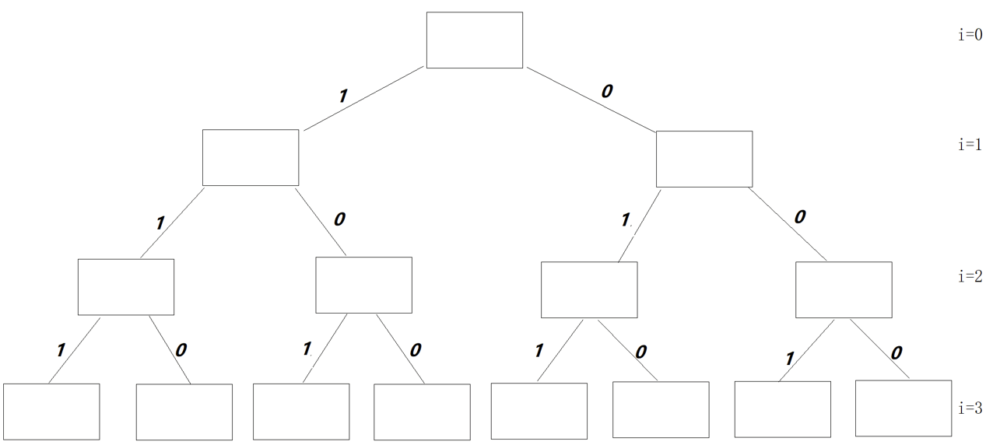
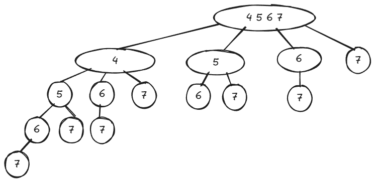
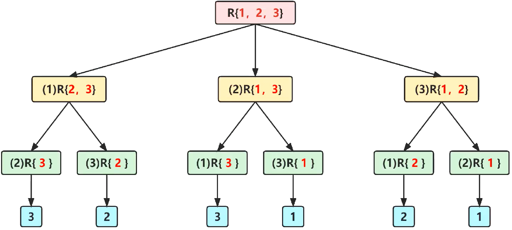

# 内容
1. 子集树
2. 排列树
# 生成子集树
子集树可以用来解决从集合中挑选一些元素以达到一定条件的问题。
```cpp
void func(int arr[], int length, int x[])
{
    if (i == length)
    {
        for (int j = 0; j < length; ++j)
        {
            if (x[j] == 1)
            {
                std::cout << arr[j] << " ";
            }
        }
        std::cout << std::endl;
    }
    else
    {
        x[i] = 1;
        func(arr, i + 1, length, x);
        x[i] = 0;
        func(arr, i + 1, length, x);
    }
}
```
另一种形式：
```cpp
void func(int arr[], int i, int length, int x[])
{
    if (i == length)
    {
        for (int j = 0; j < length; ++j)
        {
            if (x[j] == 1)
            {
                std::cout << arr[j] << " ";
            }
        }
        std::cout << std::endl;
    }
    else
    {
        // another form
        for (int k = 1; k >= 0; --k)
        {
            x[i] = k;
            func(arr, i + 1, length, x);
        }
    }
}
```
但是这一种形式不太利于直接添加剪支操作。

# 选数字，达到给定和
剪左支的条件：选择第`i`数时，当前累计和已经超过了`given_sum`，则没必要再往下进行。
剪右支的条件：选择第`i`数时，剩下的`i + 1`到`n`的累计和（即剩余未处理的数的和，注意，不是”未选择“，而是”未处理“，”处理“是层级别的概念，”选择“是左右子树概念）`rest`加上当前累计和不够`given_sum`，则没必要往下进行。
```cpp
// 挑选数字：有一组整数，请挑选出一组数字，使它们的和等于指定的值
#include<iostream>
#include<vector>
int arr[] = { 4,8,12,16,7,9,3 };
int given_sum = 18;
int res = 0;
std::vector<int> aux;
bool func(int* arr, int i, int length)
{
    bool have = false;

    if (i == length)
    {
        if(res == given_sum)
        {
            for (int v : aux)
            {
                std::cout << v << " ";
            }
            std::cout << std::endl;
            have = true;
        }
    }
    else
    {
        if (res + arr[i] <= given_sum)
        {
            res += arr[i];
            aux.push_back(arr[i]);
            return func(arr, i + 1, length);

            res -= arr[i];
            aux.pop_back();
        }
        int rest = 0;
        for (int j = i + 1; j < length; ++j)
        {
            rest += arr[j];
        }
        if (res + rest >= given_sum)
        {
            return func(arr, i + 1, length);
        }
    }
    return have;
}
int main()
{
    bool have = func(arr, 0, sizeof(arr) / sizeof(arr[0]));
    if (!have)
    {
        std::cout << "have not resolution." << std::endl;
    }
}
```
更好的写法：在main函数中先给出rest的总值。在处理第`i + 1`层前，减去第`i`个数。处理完第`i + 1`层后，即开始回溯到`i`，则`i`层又活了，需要加回第`i`个数。
这样的写法，可以避免每次计算剪右支条件都要走一遍循环计算剩余数字（`i + 1`到`n`）的和，而替换成每次只需简单地减、加一个`arr[i]`。
```cpp
// 挑选数字：有一组整数，请挑选出一组数字，使它们的和等于指定的值
#include<iostream>
#include<vector>
int arr[] = { 4,8,12,16,7,9,3 };
int given_sum = 18;
int res = 0;
int rest = 0;

std::vector<int> aux;
bool func(int* arr, int i, int length)
{
    bool have = false;

    if (i == length)
    {
        if(res == given_sum)
        {
            for (int v : aux)
            {
                std::cout << v << " ";
            }
            std::cout << std::endl;
            have = true;
        }
    }
    else
    {
        rest -= arr[i];
        if (res + arr[i] <= given_sum)
        {
            res += arr[i];
            aux.push_back(arr[i]);
            return func(arr, i + 1, length);

            res -= arr[i];
            aux.pop_back();
        }
        
        if (res + rest >= given_sum)
        {
            return func(arr, i + 1, length);
        }
        rest += arr[i];
    }
    return have;
}
int main()
{
    for (int v : arr)
    {
        rest += v;
    }


    bool have = func(arr, 0, sizeof(arr) / sizeof(arr[0]));
    if (!have)
    {
        std::cout << "have not resolution." << std::endl;
    }
}
```
同时还需要注意，未处理和未选择的概念不要混淆，我第一次写成了如下形式：这是错误的。
```cpp
    // ...
    else
    {
        if (res + arr[i] <= given_sum)
        {
            res += arr[i];
            rest -= arr[i];   // 选择
            aux.push_back(arr[i]);
            return func(arr, i + 1, length);

            res -= arr[i];
            rest += arr[i];   // 未选择
            aux.pop_back();
        }
        
        if (res + rest >= given_sum)
        {
            return func(arr, i + 1, length);
        }
    }
    return have;
}
int main()
{
    for (int v : arr)
    {
        rest += v;
    }
    // ...
}
```
这与上面的含义完全不一样。我们要做的是”处理“、”未处理“时，rest变量的变化。而不是”选择“、”未选择“时，rest变量的变化。”处理“是层级别的概念，”选择“是左右子树概念。
即，不管选不选，走不走左右子树，rest都要在之前减去`arr[i]`；不管选不选，走不走左右子树，之后rest都要加上`arr[i]`。
## 多叉子集树-更高效
以下程序生成的是如下图的子集树：


```cpp
#include<iostream>
#include<vector>
int arr[] = { 4,8,12,16,7,9,3 };
int given_sum = 18;
int res = 0;
int rest = 0;

std::vector<int> aux;
void func(int i, int length, int number)
{
    if (number == 0)
    {
        for (int v : aux)
        {
            std::cout << v << " ";
        }
        std::cout << std::endl;
    }
    else
    {
        // 以层的视角看，生成(k, k+1, ..., n)子树并遍历。
        for (int k = i; k < length; ++k)
        {
            if (number >= arr[k]) // 接下来的k元素不能大于number
            {
                aux.push_back(arr[k]);
                // 选择 k + 1，则向深度遍历，number条件改变
                func(k + 1, length, number - arr[k]);

                // 不选择 k + 1，则回溯到上一层，number条件不改变
                aux.pop_back();
            }
        }
    }
}
int main()
{
    func(0, 7, given_sum);
    return 0;
}
```
输出：8 7 3
## 变种：可以重复选择元素
```cpp
    // ...
    else
    {
        // 以层的视角看，生成(k, k+1, ..., n)子树并遍历。
        for (int k = i; k < length; ++k)
        {
            if (number >= arr[k]) // 接下来的k元素不能大于number
            {
                aux.push_back(arr[k]);
                // 更改：
                // 选择 k，则向深度遍历，number条件改变
                func(k, length, number - arr[k]);

                // 不选择 k，则回溯到上一层，number条件不改变
                aux.pop_back();
            }
        }
    }
}
int main()
{
    func(0, 7, given_sum);
    return 0;
}
```
输出
```
4 4 4 3 3
4 4 7 3
4 8 3 3
4 7 7
8 7 3
12 3 3
9 9
9 3 3 3
3 3 3 3 3 3
```
# 排列树
序列有不同的排列方式，求解原始序列的某一种特定的排列方式以达到一定条件的问题。

排列问题可以表示为以下形式：
设$R=\{ r_1, r_2, r_3, \cdots, r_n \}$是要进行排列的$n$个元素，$R_i=R-\{r_i\}$。
集合$X$中元素的全排列记为$perm(X)$。$(r_i)perm(X)$表示在全排列$perm(X)$的每一个排列前加上前缀$r_i$得到的排列。
$R$的全排列可归纳定义如下：
- 当$n=1$时，$perm(R)=(r)$，其中$r$是集合$R$中唯一的元素
- 当$n>1$时，$perm(R)$由$(r_1)perm(R_1),(r_2)perm(R_2),\cdots,(r_n)perm(R_n)$构成。（$R_i=R-\{r_i\}$）

比如：$R=\{1,2,3\}$，则$perm(R)$由$(1)perm(\{2,3\}),(2)perm(\{1,3\}),(3)perm(\{1,2\})$构成。

在第i层视角上，集合内每个元素都依次与第i个位置进行交换。如下图：元素1到了第1的位置，则出现：`(1)R{2,3}`，元素2到了第1的位置，则出现：`(2)R{1,3}`，元素3到了第1的位置，则出现：`(3)R{1,2}`。



于是，在代码中，我们可以写出for循环的条件：第i层时，（以下表述均对应实际元素数组的下标，例如：第0层，对应第1个元素的位置，下标为0），就要把从`k`（用`k`作为`i`的副本）到`n-1`的元素循环与第`i`个位置进行交换。

交换后再次进行perm计算，下一次的`i`更新为`i+1`。

从层次视角看，本层的`perm`调用结束后，不要忘记把状态回退，即第`k`个元素换回`i`位置。

当到达第`n`层，达到递归终止条件，这时`arr`数组中记录的各个元素的位置即为此时序列的某种全排列。直接全部输出即可。
```cpp
#include<iostream>
void swap(int* arr, int i, int j)
{
    int tmp = arr[i];
    arr[i] = arr[j];
    arr[j] = tmp;
}
void func(int* arr, int i, int length)
{
    if (i == length)
    {
        for (int j = 0; j < length; ++j)
        {
            std::cout << arr[j] << " ";
        }
        std::cout << std::endl;
    }
    else
    {
        // 生成子树，遍历孩子节点
        for (int k = i; k < length; ++k)
        {
            // 从 i 到 n，每次arr数组元素的该位置 都与 k 位置交换一下
            swap(arr, i, k);
            // 注意此处很重要，不再是k + 1，而是i + 1。
            // 如果我们搞成了k + 1，则变成了上面的多叉子集树（选数字问题）。
            // 因为给出了i+1，for循环中k在变，i是不变的，所以每次都会是相同数个元素进行遍历。
            // 因此才能出现排列方式不同的全集（即全排列）。
            func(arr, i + 1, length);
            swap(arr, i, k);
        }
    }
}
int main()
{
    int arr[] = { 1, 2, 3, 4 };
    const int length = sizeof(arr) / sizeof(arr[0]);
    func(arr, 0, length);
}
```
输出
```
1 2 3 4
1 2 4 3
1 3 2 4
1 3 4 2
1 4 3 2
1 4 2 3
2 1 3 4
2 1 4 3
2 3 1 4
2 3 4 1
2 4 3 1
2 4 1 3
3 2 1 4
3 2 4 1
3 1 2 4
3 1 4 2
3 4 1 2
3 4 2 1
4 2 3 1
4 2 1 3
4 3 2 1
4 3 1 2
4 1 3 2
4 1 2 3

```
# n皇后问题（n后、八皇后）
在$n\times n$格的国际象棋棋盘上放置彼此不受攻击的$n$个皇后。皇后可以攻击同一行、同一列或同一斜线上的棋子。

## 非递归
```cpp
void NiceBackTrack()
{
    x[1] = 0;
    int k = 1;
    while (k >= 1)
    {
        x[k] += 1;
        while ((x[k]) <= n) && !Place(k))
        {
            x[k] += 1;
        }
        if (x[k] <= n)
        {
            if (k == n)
            {
                sum += 1;
                PrintQ();
            }
            else
            {
                k += 1;
                x[k] = 0;
            }
        }
        else
        {
            --k;
        }
    }
}
```