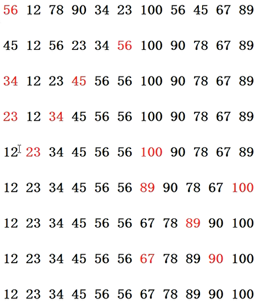
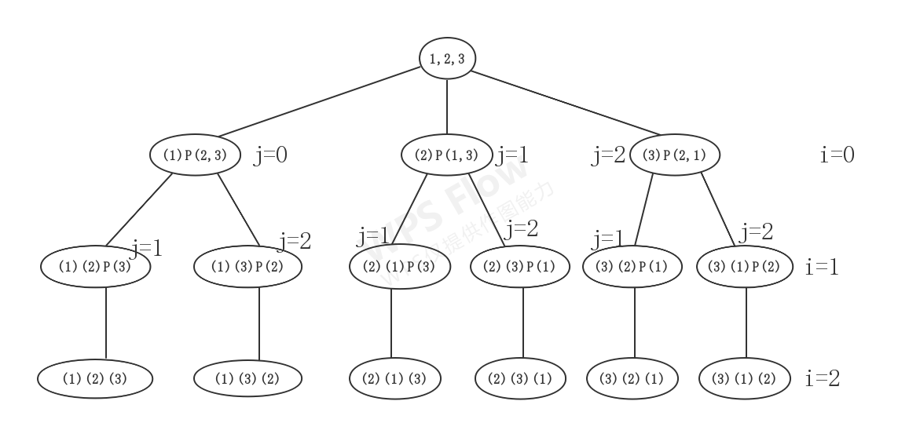

# 内容

# 阶乘(factorial)
```
阶乘可递归地定义为:
fac(n) = 
	1;                 当n=1时
	fac(n-1)*n;        当n>1时
```

此处, `fac(n-1)`代表什么意思呢? 是: `1 * 2 * ... * (n-1)`

## 代码

非递归版

```c
int factorial(int n)
{
    int res = 1;
    for(int i = 1; i <= n; ++i)
    {
        res = res * i;
    }
    return res;
}
```

递归版

```c
int factorial(int n)
{
    if(n <= 1)
        return 1;
    else
        return factorial(n - 1) * n;
}
```

# 死递归和死循环的区别

## 死循环

若把上面阶乘的代码, 稍做改动:

for循环中间的条件去掉 - 变为死循环

```c
int factorial(int n)
{
    int res = 1;
    for(int i = 1;  ; ++i)
    {
        res = res * i;
    }
    return res;
}
```

但是, 死循环除了会耗费单核的CPU, 不会对内存空间产生伤害;

```c
int main()
{
    int sum = fun(4);
}
```

## 死递归

若把上面递归版本阶乘的代码, 稍做改动, 把`if`判断条件改为永假:

```c
int factorial(int n)
{
    if(false)
        return 1;
    else
        return factorial(n - 1) * n;
}
```

则递归将没有一个出口;

而且更严重的是, 由于每一次的递归调用都需要开辟栈帧, 所以不久之后栈将会溢出, 程序崩溃;

## 思考

就这个现象, 其实说明了背后的一些更重要的意义, 一般, 非递归算法的空间复杂度最低可为O(1), 而递归算法的空间复杂度最低为O(n), 递归的特性势必造成额外的空间;

# 遍历打印数组

假如有一int数组为`{12,23,34}`, 要求打印出来

## 非递归 - 能不能把它改成递归?

```c++
void Print_Ar(const int * ar, int n)
{
    assert(ar != NULL);
    for(int i = 0; i < n; ++i)
    {
        cout << ar[i] << " ";
    }
    cout << endl;
}//12 23 34
```

## 递归初版 - 逆序

```c++
void Print(const int * ar, int n)
{
    if(n > 0)
    {
        cout << ar[n-1] << " ";
        Print(ar, n-1);
    }
}
void Print_Ar_recur(const int * ar, int n)
{
    assert(ar != NULL);
    if(n < 1) return;//the length must > 0
    Print(ar, n);
    cout << endl;
}
int main()
{
    int ar[] = {12, 23, 34};
    int n = sizeof(ar) / sizeof(ar[0]);
    Print_Ar_recur(ar, n);
    return 0;
}//34 23 12
```

## 递归2版 - 正序-✔

看到没? 只是把5行和6行的代码调了个序, 效果就截然不同, 这就是递归的神奇之处;

当`n > 0`时, 将一直递归下去, 直到n等于0, 之后, 随着递归栈帧的回退, 将从0到`n-1`逐一打印出来;

```c++
void Print(const int * ar, int n)
{
    if(n > 0)
    {
        Print(ar, n - 1);
        cout << ar[n-1] << " ";
    }
}
void Print_Ar_recur(const int * ar, int n)
{
    assert(ar != NULL);
    if(n < 1) return;//the length must > 0
    Print(ar, n);
    cout << endl;
}
int main()
{
    int ar[] = {12, 23, 34};
    int n = sizeof(ar) / sizeof(ar[0]);
    Print_Ar_recur(ar, n);
    return 0;
}//12 23 34
```

## 总结 - 递归的范式

递归的题解有两部分组成, 将会把代码划分的清清楚楚;

1. 第一个函数过滤掉不合法的参数, 同时作为开始调用递归的调用者;
2. 第二个函数才是真正的递归函数;

## 总结 - 递归的分析

递归函数的执行分为“递推”和“回归”两个过程，这两个过程由递归终止条件控制，即逐层递推，直至递归终止条件满足，终止递归，然后逐层回归。

递归调用同普通的函数调用一样，每当调用发生时，就要**分配新的栈帧**（形参数据，现场保护，局部变量）, **所以, 每个栈帧中的数据都是本层独有的!**；

而与普通的函数调用不同的是，由于递推的过程是一个逐层调用的过程，因此存在一个逐层连续的分配栈帧过程，直至遇到递归终止条件时，才开始回归，这时才逐层释放栈帧空间，返回到上一层，直至最后返回到主调函数。

## 错误版本1-不要使用后置自减

这个浅看看不出来, 实际上是一个必死的结局;

这个会导致**栈溢出**;

因为, `n--`会导致每次前一个栈帧给下一个函数传递的是n原本的值, 才去`--`, 这是后置自减的语义, 然后, 就相当于n原地不变, 所以一直到不了栈帧回退的出口;

```c
void Print(const int * br, int n)
{
    if(n > 0)
    {
        Print(br, n--);
        cout << br[n - 1] << " ";
    }
}
```

## 错误版本2-不要使用前置自减

会导致越界, 并且前面多打了一个(`br[-1]`), 后面少打了一个(`br[n-1]`); 

因为他把n减1并传过去了, 就缺少了n的情况, 并且, 由于前面做了n值的判断, 而又在if里面改值, 这是不妥的; 即, 最好不要在判断n的合法性后对n进行改动, 这是递归程序的忌讳; 

```c
void Print(const int * br, int n)
{
    if(n > 0)
    {
        Print(br, --n);
        cout << br[n - 1] << " ";
    }
}// [?随机值] 12 23 [缺34]
```

但是这种情况, 也可以把程序改正确, 即: 把打印`br[n-1]`改为`br[n]`
```c
void Print(const int * br, int n)
{
    if(n > 0)
    {
        Print(br, --n);
        cout << br[n] << " ";
    }
}// 12 23 34
```

但还是不建议在递归程序的变量上进行前置自减;

## 错误版本3-引用

```c++
void Print(const int * br, int & n)
{
    if(n > 0)
    {
        Print(br, --n);
        cout << br[n] << " ";
    }
}
void Print_Ar_recur(const int * br, int n)
{
    assert(br != NULL);
    if(n < 1)return;//the length must > 0
    Print(br, n);
    cout << endl;
}
//12 12 12
```

因为栈帧递进时, 所有栈帧中的n都一直在动态改变, 最终所有栈帧的n值都变为0了, 即**所有的n都保持一致了**,  因此, 打印的都是`br[0]`, 这是引用的影响;

尽量在递归中少用引用，只有在线索二叉树才会用到

# FindPos

传入数据指针, 长度, 和要找到val值, 返回下标

## 非递归版

```c++
int FindPos(const int * br, int n, int val)
{
    if(br == NULL || n < 1)return -1;
    int pos = n - 1;
    while(pos >= 0 && br[pos]!=val)
    {
        --pos;
    }
    return pos;
}
int main()
{
    int ar[] = {12,56,34,78};
    int n = sizeof(ar)/sizeof(ar[0]);
    int val = 78;
    int pos = FindPos(ar,n,val);
    cout << pos << endl;
}
```

## 递归版本-自己写的初版

```c++
int Find(const int * br, int n, int val)
{
    if(n > 0)
    {
        if(br[n - 1] == val) return n - 1;
        return Find(br, n - 1, val);
    }
}
int FindPos(const int * br, int n, int val)
{
    if(br == NULL || n < 1) return -1;
    return Find(br, n, val);
}
```

错误点：如果没有找到val，没有返回值。即, 如果走到`n==-1`, 则没有return的值, 可视为获取到了一个随机值

## 递归版本-正确版本

```c++
//杨版
int Find(const int * br, int n, int val)
{
    if(n <= 0 || br[n-1] == val)
    {
        return n - 1;
    }
    else
    {
        return Find(br, n - 1, val);
    }
}
int FindPos(const int * br, int n, int val)
{
    if(br==NULL || n<1)return -1;
    return Find(br,n,val);
}
```

## 递归版本-标准版本

```c
//初版和杨版结合、改进
//杨版
int Find(const int * br, int n, int val)
{
    if(n > 0)
    {
        if(br[n-1] == val) return n - 1;
        else return Find(br, n - 1, val);
    }
    return -1;
}
int FindPos(const int * br, int n, int val)
{
    if(br==NULL || n < 1)return -1;
    return Find(br, n, val);
}
```

# 排序

快排、归并、堆排

## 问题

1. 时间复杂度是多少？
2. 空间复杂度是多少？
3. 是否稳定？怎样可以稳定？什么时候需要稳定，什么时候不需要稳定？
4. 什么情况下性能会退化？
5. 三个排序的适用场景？
6. 如果你的排序的递归的，怎么改为非递归？

## 快排

1. 为什么数据有序的时候, 快排时间复杂度为$O(n^2)$?
   1. 这个仅限于每次只从最边缘数据作为划分, 才出现这种情况
   2. 每次划分时, 相当于只划分出了一个数据和剩余的数据, 规模并没有有效的减小, 仍需要划分$n$次; 而不是像最好的情况 - 每次正好把数据划分在中间, 规模减小, 此时只需划分$\log_2n$次; 
   3. 放在二叉树上的形象图示就是: 最差情况下的快排就是一个极端不平衡的二叉树, 最好情况下的快排就是一个很平衡的二叉树;

# 快排

## 划分函数

```c++
int Partition(int *ar, int left, int right)
{
    int tmp = ar[left];
    while(left < right)
    {
        while(left < right && ar[right] > tmp)
        {
            --right;
        }
        if(left < right) ar[left] = ar[right];
        while(left < right && ar[right] <= tmp)
        {
            ++left;
        }
        if(left < right) ar[right] = ar[left];
    }
    ar[left] = tmp;	//最后, left成为中间位置
    return left;
}
```

## 思考 - 为什么一直要强调`left < right`?

因为, 如果不加这种条件的话, left或right可能就会一直贪婪地, 不着边际地走下去, **最终left和right有可能错位**!

如果产生了错位, left的right下标的值相互赋值将没有意义;

反之, 如果很好地控制了left和right的位置, 最终退出整个while循环后, left和right的位置一定指向的是同一个位置; 即, 最后两句的`ar[left] = tmp`和`return left`同样可以换为`ar[right] = tmp`和`return left`!

## 递归函数

```c
void PassQuick(int *ar, int left, int right)
{
    if(left < right)	//如果left == right 相当于只有一个元素, 不需排序
    {
        int pos = Partition(ar, left, right);//上一个划分出来的下标
        
        PassQuick(ar, left, pos - 1);       //对left ~ pos-1再划分
        PassQuick(ar, pos + 1, right);      //对pos+1 ~ right再划分
    }
}
void QuickSort(int * ar, int n)
{
    if(ar == NULL || n < 2)return;
    PassQuick(ar, 0, n-1);
}
```

## 测试

```c
void Print_Ar(const int * ar, int n)
{
    if(ar == NULL || n < 1)return;
    for(int i = 0; i < n; ++i)
    {
        cout << ar[i] << " ";
    }
    cout << endl;
}
int main()
{
    int ar[] = {56, 12, 78, 90, 34, 23, 100, 56, 45, 67, 89};
    int n = sizeof(ar) / sizeof(ar[0]);
    Print_Ar(ar, n);
    QuickSort(ar, n);
    Print_Ar(ar, n);
}
```

同时, 也可以在`PassQuick`函数中`Partition`语句的下一行加个`Print_Ar(ar, 11)`; 这样就能在每次划分完毕之后, 清楚地看到数组的状态;



## 非递归 - 使用STL的queue

```cpp
void QuickSort(int * ar, int n)
{
    if(ar == NULL || n < 2) return;
    queue<int> qu;
    qu.push(0);
    qu.push(n - 1);
    while(!qu.empty())
    {
        int left = qu.front(); qu.pop();
        int right = qu.front(); qu.pop();
        
        int pos = Partition(ar, left, right);
        if(left < pos - 1)
        {
            qu.push(left);
            qu.push(pos - 1);
        }
        if(pos + 1 < right)
        {
            qu.push(pos + 1);
            qu.push(right);
        }
    }
}
```

### 使用对儿 - pair

```cpp
void QuickSort(int * ar, int n)
{
    if(ar == NULL || n < 2) return;
    queue<std::pair<int, int>> qu;
    qu.push(std::pair<int, int>(0, n-1));
    while(!qu.empty())
    {
        std::pair<int, int> record = qu.front(); qu.pop();
        int pos = Partition(ar, record.first, record.second);
        if(record.first < pos - 1)
        {
            qu.push(std::pair<int, int>(record.first, pos-1));
        }
        if(pos + 1 < record.second)
        {
            qu.push(std::pair<int, int>(pos+1, record.second));
        }
    }
}
```

可以使用别名使程序简化 - `using idxPair = std::pair<int, int>`

```cpp
void QuickSort(int * ar, int n)
{
    if(ar == NULL || n < 2) return;
    using idxPair = std::pair<int, int>;
    
    queue<idxPair> qu;
    qu.push(idxPair(0, n-1));
    while(!qu.empty())
    {
        idxPair record = qu.front(); qu.pop();
        int pos = Partition(ar, record.first, record.second);
        if(record.first < pos - 1)
        {
            qu.push(idxPair(record.first, pos-1));
        }
        if(pos + 1 < record.second)
        {
            qu.push(idxPair(pos+1, record.second));
        }
    }
}
```

## 划分函数 - 单向划分 - 特别适于单链表

详见 "快速排序" 一文;

# 全排列、子集树

## 全排列

```c++
void Perm(int * ar, int i, int m)
{
    if(i == m)
    {
        for(int j = 0;j <= m;++j)
        {
            cout << ar[j] << " ";
        }
        cout << endl;
    }
    else
    {
        for(int j = i;j <= m;++j)
        {
            std::swap(ar[i],ar[j]);
            Perm(ar,i+1,m);
            std::swap(ar[i],ar[j]);
        }
    }
}
int main()
{
    int ar[] = {1,2,3};
    int n = sizeof(ar)/sizeof(ar[0]);
    Perm(ar, 0, n-1);
}
/*
1 2 3
1 3 2
2 1 3
2 3 1
3 2 1
3 1 2
*/
```



## 子集树

```c++
void fun(int i, int n)
{
    if(i >= n)return;
    else
    {
        fun(i+1, n);
        fun(i+1, n);
    }
}


void Print(int *ar, int * br, int i, int n)
{
    if(i >= n)
    {
        for(int j = 0;j < n;++j)
        {
            if(br[j] == 1)
            {
                cout << ar[j] << " ";
            }
            cout << endl;
        }
    }
    else
    {
        br[i] = 1;
        Print(ar, br, i+1, n);
        br[i] = 0;
        Print(ar, br, i+1, n);
    }
}
int main()
{
    int ar[] = {1,2,3};
    int br[] = {0,0,0};
    Print(ar, br, 0, 3);
    return 0;
}
/*
1 2 3
1 2
1 3
1
2 3
2
3
*/
```

