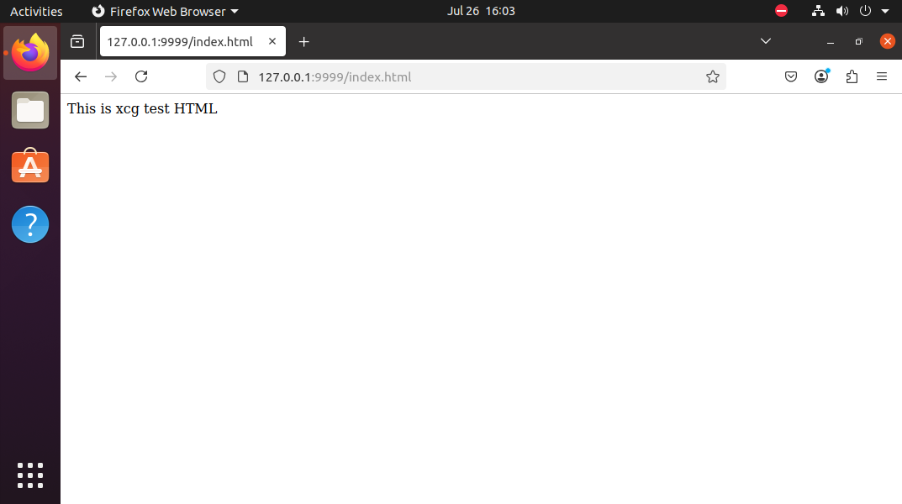

# http协议格式规范
HTTP协议是一种应用层协议，用于在客户端和服务器之间传输数据。

HTTP协议规定了在传输数据时需要遵守的一些约定和规范，以确保数据的正确传输和解释。
以下是HTTP协议必须包含的几个要素：
1. 请求行：请求行包含了客户端发起的请求方法、请求的资源地址和HTTP协议的版本号。例如：

```
GET /index.htm1 HTTP/1.1
```

这里的请求方法是GET，请求的资源地址是`/index.html`，HTTP协议的版本号是1.1。

2. 请求头部：请求头部包含了客户端发送请求的相关信息，例如客户端的User-Agent、Accept-Language等信息。请求头部以一个空行（CRLF）作为结束标志。例如：

```
Host: www.example.com
User-Agent: Mozi11a/5.0 (Windows NT 10.0; win64; x64; rv:89.0) Gecko/20100101 Firefox/89.0
Accept: text/htm1,app1ication/xhtm1+xm1,app1ication/xm1;q=0.9,image/webp,*/*;q=0.8
Accept-Language: en-US,en;q=0.5
Connection: keep-alive
```

3. 请求正文（可选）：请求正文是客户端发送请求时携带的数据，例如POST请求中的表单数据。请求正文通常以Content-Type头部指定数据类型，以及Content-Length头部指定数据长度。请求正文与请求头部之间也以一个空行（CRLF）作为分隔符。
4. 响应行：响应行包含了服务器的响应状态码、状态码对应的原因短语和HTTP协议的版本号。例如：

```
HTTP/1.1 200 OK
```

这里的响应状态码是200，状态码对应的原因短语是OK，HTTP协议的版本号是1.1。

5. 响应头部：响应头部包含了服务器发送响应的相关信息，例如服务器的Server、Content-Type、Content-Length等信息。响应头部以一个空行（CRLF）作为结束标志。例如：

```
Server: Apache/2.4.41 (Ubuntu)
Content-Type: text/html; charset=UTF-8
Content-Length: 1234
<htm1>
  <body>He11o HTTP</body>
</html>
```

6. 响应正文（可选）：响应正文是服务器返回给客户端的数据，例如HTML页面、图片、JSON数据等。响应正文通常以 Content-Type 头部指定数据类型，以及 Content-Length 头部指定数据长度。响应正文与响应头部之间也以一个空行（CRLF）作为分隔符。

总之，HTTP协议要求每个请求和响应都包含一些必要的元素，包括请求行、请求头部、请求正文、响应行、响应头部和响应正文。这些元素包含了客户端和服务器之间传输数据所必需的信息，以确保数据的正确传输和解释。
# HttpServer
以下代码，Server可以做到：
绑定端口，监听连接。
接受连接，接收请求数据。
解析请求数据。
```cpp
// http_server.cpp
#include <iostream>
#include <netinet/in.h>
#include <arpa/inet.h>
#include <unistd.h>
#include <sstream>
class HttpServer
{
public:
    HttpServer(unsigned short port) : m_port(port)
    {

    }
    void start()
    {
        int error = 0;
        int server_fd = socket(AF_INET, SOCK_STREAM, 0);
        if (server_fd < 0)
        {
            std::cerr << "Failed to create socket" << std::endl;
            return;
        }
        struct sockaddr_in server_addr;
        server_addr.sin_family = AF_INET;
        server_addr.sin_port = htons(m_port);
        error = inet_pton(AF_INET, "127.0.0.1", &(server_addr.sin_addr.s_addr));
        if (error == -1)
        {
            std::cerr << "Failed to inet_pton" << std::endl;
            return;
        }
        error = bind(server_fd, (struct sockaddr*)&server_addr, sizeof(server_addr));
        if (error == -1)
        {
            std::cerr << "Failed to bind" << std::endl;
            return;
        }
        error = listen(server_fd, 5);
        if (error == -1)
        {
            std::cerr << "Failed to listen" << std::endl;
            return;
        }
        std::cout << "Server started on port: " << m_port << std::endl;
        struct sockaddr_in client_addr;
        while (1)
        {
            socklen_t client_addr_len = sizeof(client_addr);
            int client_fd = accept(server_fd, (struct sockaddr*)&client_addr, &client_addr_len);
            if (client_fd < 0)
            {
                std::cerr << "Failed to accept" << std::endl;
                return;
            }
            std::cout << "Accepted connection from " << inet_ntoa(client_addr.sin_addr) << std::endl;
            char request[1024] = {0};
            int len = read(client_fd, request, sizeof(request));
            if (len < 0)
            {
                std::cerr << "Failed to read" << std::endl;
                close(client_fd);
                return;
            }
            std::cout << "=========================" << std::endl;
            printf("%s", request);
            std::cout << "=========================" << std::endl;
            std::stringstream request_stream(request);
            std::string method, path, http_version;
            request_stream >> method >> path >> http_version;
            std::cout << "http method:" << method << std::endl;
            std::cout << "http path:" << path << std::endl;
            std::cout << "http version:" << http_version << std::endl;
            close(client_fd);
        }
        close(server_fd);
    }
private:
    unsigned short m_port;
};
int main(int argc, char *argv[])
{
    if (argc < 2)
    {
        std::cerr << "Usage: HttpServer <port>\n";
        return 1;
    }
    HttpServer http_server(std::atoi(argv[1]));
    http_server.start();
    return 0;
}
```
运行：
```sh
./HttpServer 9999
```
当浏览器访问`http://127.0.0.1:9999/index.thml`时，控制台输出：
```
Accepted connection from 127.0.0.1
=========================
GET /index.html HTTP/1.1
Host: 127.0.0.1:9999
User-Agent: Mozilla/5.0 (X11; Ubuntu; Linux x86_64; rv:136.0) Gecko/20100101 Firefox/136.0
Accept: text/html,application/xhtml+xml,application/xml;q=0.9,*/*;q=0.8
Accept-Language: en-US,en;q=0.5
Accept-Encoding: gzip, deflate, br, zstd
Connection: keep-alive
Upgrade-Insecure-Requests: 1
Sec-Fetch-Dest: document
Sec-Fetch-Mode: navigate
Sec-Fetch-Site: none
Sec-Fetch-User: ?1
Priority: u=0, i

=========================
http method:GET
http path:/index.html
http version:HTTP/1.1

```
## 响应
```cpp
#include <iostream>
#include <netinet/in.h>
#include <arpa/inet.h>
#include <unistd.h>
#include <sstream>
#include <fstream>
class HttpServer
{
public:
    HttpServer(unsigned short port) : m_port(port)
    {

    }
    void start()
    {
        int error = 0;
        
        // ...
        
        struct sockaddr_in client_addr;
        while (1)
        {
            socklen_t client_addr_len = sizeof(client_addr);
            int client_fd = accept(server_fd, (struct sockaddr*)&client_addr, &client_addr_len);
            if (client_fd < 0)
            {
                std::cerr << "Failed to accept" << std::endl;
                return;
            }
            std::cout << "Accepted connection from " << inet_ntoa(client_addr.sin_addr) << std::endl;
            char request[1024] = {0};
            int len = read(client_fd, request, sizeof(request));
            if (len < 0)
            {
                std::cerr << "Failed to read" << std::endl;
                close(client_fd);
                return;
            }
            std::cout << "=========================" << std::endl;
            printf("%s", request);
            std::cout << "=========================" << std::endl;
            std::stringstream request_stream(request);
            std::string method, path, http_version;
            request_stream >> method >> path >> http_version;
            std::cout << "http method:" << method << std::endl;
            std::cout << "http path:" << path << std::endl;
            std::cout << "http version:" << http_version << std::endl;

            if (method != "GET")
            {
                bad_request(client_fd);
            }
            else
            {
                std::string filename = "." + path;
                if (filename.find("..") != std::string::npos)
                {
                    forbidden(client_fd);
                }
                else
                {
                    std::string content = get_file_content(filename);
                    if (content.empty())
                    {
                        not_found(client_fd);
                    }
                    else
                    {
                        ok(client_fd, content);
                    }
                }
            }
            close(client_fd);
        }
        close(server_fd);
    }
private:
    std::string get_file_content(const std::string& filename)
    {
        std::fstream fs(filename);
        std::stringstream buffer;
        buffer << fs.rdbuf();   // fs.rebuf()的内容输出给buffer
        return buffer.str();
    }
    void bad_request(int client_fd)
    {
        std::string response = "HTTP/1.1 400 Bad Request\r\n";
        send(client_fd, response.c_str(), response.length(), 0);
    }
    void not_found(int client_fd)
    {
        std::string response = "HTTP/1.1 404 Not Found\r\n";
        send(client_fd, response.c_str(), response.length(), 0);
    }
    void forbidden(int client_fd)
    {
        std::string response = "HTTP/1.1 403 Forbidden\r\n";
        send(client_fd, response.c_str(), response.length(), 0);
    }
    void ok(int client_fd, std::string content)
    {
        std::ostringstream response_steam;
        response_steam  << "HTTP/1.1 200 OK\r\n"
                        << "Content-Type: text/html\r\n"
                        << "Content-Length: " << content.length() << "\r\n"
                        << "\r\n"
                        << content;
        std::string response(response_steam.str());
        send(client_fd, response.c_str(), response.length(), 0);
    }
private:
    unsigned short m_port;
};
int main(int argc, char *argv[])
{
    if (argc < 2)
    {
        std::cerr << "Usage: HttpServer <port>\n";
        return 1;
    }
    HttpServer http_server(std::atoi(argv[1]));
    http_server.start();
    return 0;
}
```
我们在主程序的当前目录下创建一个`index.html`
```html
This is xcg test HTML
```
运行：
```sh
./HttpServer 9999
```
结果：
```
mrcan@ubuntu:~/http_demo/build$ ./HttpServer 9999
Server started on port: 9999
Accepted connection from 127.0.0.1
=========================
GET /index.html HTTP/1.1
Host: 127.0.0.1:9999
User-Agent: Mozilla/5.0 (X11; Ubuntu; Linux x86_64; rv:136.0) Gecko/20100101 Firefox/136.0
Accept: text/html,application/xhtml+xml,application/xml;q=0.9,*/*;q=0.8
Accept-Language: en-US,en;q=0.5
Accept-Encoding: gzip, deflate, br, zstd
Connection: keep-alive
Upgrade-Insecure-Requests: 1
Sec-Fetch-Dest: document
Sec-Fetch-Mode: navigate
Sec-Fetch-Site: none
Sec-Fetch-User: ?1
Priority: u=0, i

=========================
http method:GET
http path:/index.html
http version:HTTP/1.1
Accepted connection from 127.0.0.1
=========================
GET /favicon.ico HTTP/1.1
Host: 127.0.0.1:9999
User-Agent: Mozilla/5.0 (X11; Ubuntu; Linux x86_64; rv:136.0) Gecko/20100101 Firefox/136.0
Accept: image/avif,image/webp,image/png,image/svg+xml,image/*;q=0.8,*/*;q=0.5
Accept-Language: en-US,en;q=0.5
Accept-Encoding: gzip, deflate, br, zstd
Connection: keep-alive
Referer: http://127.0.0.1:9999/index.html
Sec-Fetch-Dest: image
Sec-Fetch-Mode: no-cors
Sec-Fetch-Site: same-origin
Priority: u=6

=========================
http method:GET
http path:/favicon.ico
http version:HTTP/1.1

```
客户端浏览器显示：


