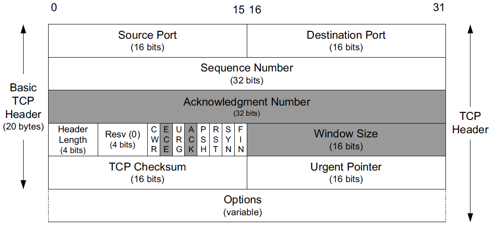

# 内容
1. TCP的特点
2. TCP的标志位
# TCP
特点：

1. 面向连接的
    1. 三次握手--在客户端connect()时
        1. 必须是三次
    2. 四次挥手--在任一方close时
        1. 有时可以三次
2. 可靠的
    1. 应答确认
    2. 超时重传
    3. 乱序重排
    4. 去重
    5. 滑动窗口进行流量控制
3. 流式服务
    1. 发送和接收的次数可能不一致。
        1. 连续多次发送的数据可能会被对方一次性收到。
    2. 起始末尾加标记
    3. send之后recv隔开
4. tcp是有状态的
    1. 开始`closed`
    2. `listen`--`connecting`(三次握手中)
    3. `established`(已完成握手)
    4. `FIN_WAIT_1`/`FIN_WAIT_2`
    5. `TIME_WAIT`
        1. 可靠地终止TCP的连接
        2. 让迟来的报文在这一段时间被识别，即收集后丢弃，以防止误传给下一个使用该端口的连接。

问题：1、TCP/IP协议详解 卷一；2、UNIX网络编程 卷一

1. 三次握手，四次挥手
2. 应答确认、超时重传机制
3. 乱序重排、去重、滑动窗口进行流量控制
4. 什么是粘包？怎么解决？
5. 中间转换状态的意义？TIME_WAIT状态的意义？
# TCP首部

* 序列号(Sequence Number)字段标识了TCP发送端到TCP接收端的数据流的一个字节，**该字节代表着这个报文段对应的数据中的第一个字节**。如果我们考虑在两个应用程序之间的一个方向上流动的数据流，TCP给每个字节赋予一个序列号。这个序列号是一个32位的无符号数，到达$2^{32}-1$后再循环回到0。
* **确认号(Acknowledgment Number)**是该发送方期待接收的下一个序列号。
    * TCP可以被描述为一种“带累积正向确认的滑动窗口协议”。ACK号字段被构建用于指明在接收方已经顺序收到的最大字节(加1)。例如，如果字节1~1024已经接收成功，而下一个报文段包含字节2049~3072，那么接收方不能使用规则的ACK号字段去发信告诉发送方它接收到了这个新报文段（先保留）。然而，现代TCP有一个**选择确认(Selective ACKnowledgment, SACK)选项**，可以允许接收方告诉发送方它正确地接收到了次序杂乱的数据。当与一个具有选择重发(selective repeat)能力的TCP发送方搭配时，就可以实现性能的显著改善。我们将会看到TCP是如何使用重复确认(duplicate acknowledgments)以帮助它的拥塞控制和差错控制过程的。
* **头部长度(Header Length)字段**给出了头部的长度，此字段只占4位，计算时，以32位字(4字节)为单位，比如该字段是1111，则头部长度为$15 * (32 / 8) = 60$字节。它是必需的，因为选项(Options)字段的长度是可变的。
* 接下来是预留位(Resv)和8个标志位，旧版本的TCP头部的标志位只用到了后6个；它们中的1个或多个可被同时启用。其中除了后6个旧版本已有的，新的2个标志位为：
    1. CWR：拥塞窗口减（发送方降低它的发送速率）
    2. ECE：ECN回显（发送方接收到了一个更早的拥塞通告）
* **窗口大小(Window Size)字段**。TCP的流量控制由每个端口使用这个字段来通告一个窗口大小来完成。这个窗口大小是**字节数**，从ACK号指定的，也是接收方想要接收的那个字节开始。这是一个16位的字段，限制了窗口大小到65535字节，从而限制了TCP的吞吐量性能。**窗口缩放(Window Scale)选项**可允许对这个值进行缩放,给高速和大延迟网络提供了更大的窗口和改进性能。
* TCP校验和(TCP Checksum)字段覆盖了TCP的头部、数据以及IP头部中的一些字段；是一个强制性的字段，由发端计算和存储，并由收端进行验证。TCP检验和的计算与UDP检验和的计算相似，使用一个伪首部。
* 紧急指针(Urgent Pointer)字段。紧急指针是一个正偏移量，和序列号字段中的值相加**表示紧急数据最后一个字节**的序列号。这种TCP紧急机制是发送端向另一端提供特殊标志数据的方法。
* 选项字段。最常见的就是“最大段大小”选项。连接的每个端点一般在它发送的第一个报文段（为了建立该连接，SYN位字段被设置的那个报文段）上指定这个选项。MSS指定该选项的发送者在相反方向上希望接收到的报文段的最大值。
* TCP报文段的数据部分是可选的。当一个连接被建立和终止时，交换的报文段只包含TCP头部(可能带选项)而没有数据。
    * 如果这个方向上没有数据被传输，那么一个不带任何数据的头部也会用于ACK接收到的数据（称为一个pure ACK），同时通知通信方改变窗口大小（称为一个窗口更新(window update)）。
    * 当一个报文段可不带数据发送时，超时操作会因此而产生一些新情况。

# 标志位

## URG

URG，全拼是urgent。表示紧急。此标志表示：**紧急指针有效**。

## ACK

表示确认序号字段有效。需要注意，确认标志位和确认序号字段不一样，确认序号和序列号不一样。

* 既然每个传输的字节都被计数，确认序号会填写该端所期望收到的下一个序号。因此确认序号应当是上次已成功收到数据字节序号+1。
* 发送一个ACK与发送任何一个TCP报文段的开销是一样的，因为那个32位的ACK号字段一直都
  是头部的一部分，ACK位字段也一样。
  TCP/IP详解\_卷1\_第2版\_英语原文如下：Sending an ACK costs nothing more than sending any other TCP segment because the 32-bit ACK Number field is always part of the header, as is the ACK bit field.
* 只有ACK标志为1时，确认序号字段才有效；一旦一个连接建立起来，确认序号字段总是被设置， ACK标志也总是被设置为1；这个**ACK位字段几乎用于所有报文段，除了初始和末尾报文段**。

## PSH

接收方应该尽快将这个报文段交给应用层。

## RST

重建连接

## SYN

同步序号用来发起一个连接。

* 当建立一个新的连接时，SYN标志变1。序列号字段随即会包含由这个主机选择的该连接的**初始序列号ISN(Initial Sequence Number)**。
* 该主机要发送数据的第一个字节序列号为ISN+1，因为SYN标志消耗了一个序号。消耗一个序列号也意味着使用重传进行可靠传输。因此，SYN和应用程序字节（还有FIN，稍后我们将会见到）是被可靠传输的。不消耗序列号的ACKs则不是。
## FIN

FIN发端完成发送任务。

# 如何保证数据可靠传输

那些自身不包含可靠传递数据机制的协议。它们可能会使用一种像校验和或CRC这样的数学函数来**检测**接收到的有差错的数据，**但是它们不尝试去纠正差错**。比如对于IP和UDP则根本没有实现差错纠正。对于以太网和基于其上的其他协议，协议提供一定次数的重试，如果还是不成功则放弃。

通信媒介可能会丢失或改变被传递的消息，在这种环境下的通信问题已经被研究了多年。关于这个课题的一些最重要的理论工作由香农在1948年给出。这些工作普及了术语“比特”，并成为信息理论(information theory)领域的基础，帮助我们理解了在一个有损（可能会删除或改变比特）信道里可通过的信息量的根本限制。信息理论与编码理论(coding theory)的领域密切相关，编码理论提供不同的信息编码手段，从而使得信息能在通信信道里尽量免于出错。其中有两种手段：

1. 使用差错校正码（基本上是添加一些冗余的比特，使得即使某些比特被毁，真实的信息也可以被恢复过来）来纠正通信问题是处理差错的一种非常重要的方法。
2. 另一种方法是简单地“尝试重新发送”，直到信息最终被接收。这种方法，称为自动重复请求(Automatic Repeat Request, ARQ)，构成了许多通信协议的基础，包括TCP在内。

## ARQ和重传

如果我们考虑的不只是单个通信信道，而是几个的多跳级联，我们会发现不只会碰到前面提到的那几种差错类型（分组比特差错），而且还会有更多其他的类型。这些问题可能发生在中间路由器上，是几种在讨论IP时会遇到的问题：分组重新排序，分组复制，分组泯灭（丢失）。为在多跳通信信道（例如IP）上使用而设计的带纠错的协议必须要处理这些问题。

现在让我们来探讨能处理这些问题的协议机制。在概括性地讨论这些之后，我们会探究它们是如何被TCP在互联网上使用的。

一个直接处理分组丢失（和比特差错）的方法是重发分组直到它被正确接收。这需要种方法来判断：

1. 接收方是否已收到分组；
2. 接收方接收到的分组是否与之前发送方发送的一样。

接收方给发送方发信号以确定自己已经接收到一个分组，这种方法称为确认(acknowledgment, ACK)。最基本的形式是，发送方发送一个分组，然后等待一个ACK。当接收方接收到这个分组时，它发送对应的ACK。当发送方接收到这个ACK，它再发送另一个分组，这个过程就这样继续。这里会有一些有意思的问题：

1. 发送方对一个ACK应该等待多长时间？
2. 如果ACK丢失了怎么办？
3. 如果分组被接收到了，但是里面有错怎么办？

第一个问题其实挺深奥的。决定去等待多长时间与发送方期待(expect)为一个ACK等待多长时间有关。现在确定这个时间可能比较困难，因此我们推迟对这个技术的讨论。

第二个问题的答案比容易：如果一个ACK丢失了，发送方不易区分ACK报文段丢失与原分组丢失的情况，所以它简单地再次发送原分组。当然，这样的话，接收方可能会接收到两个或更多的拷贝，因此它必须准备好处理这种情况（见下一段）。

至于第三个问题，我们可以借助某个编码技术来解决。使用编码来检测一个大的分组中的差错（有很大的概率）一般都很简单，仅使用比其自身小很多的一些比特即可纠正。更简单的编码一般不能纠正差错，但是能检测它们。这就是校验和与CRC会如此受欢迎的原因。然后，为了检测分组里的差错，我们使用一种校验和形式。当一个接收方接收到一个含有差错的分组时，它不发送ACK。最后，发送方重发完整到达的无差错的分组。

到目前为止即使这种简单的场景，接收方都可能接收到被传送分组的重复(duplicate)副本。这个问题要使用序列号(sequence number)来处理。基本上，在被源端发送时，每个**唯一**的分组都有一个新的序列号，这个序列号由分组自身一直携带着。接收方可以使用这个序列号来判断它是否已经见过这个分组，如果见过则丢弃它。

到目前为止介绍的协议是可靠的，但效率不太高。如果从发送方到接收方传递即使一个很小的分组都要用很长时间（推迟或延迟）的话（如一秒或两秒，对卫星链路来说并非不正常），考虑一下那会怎样。发送方可以注入一个分组到通信路径，然后停下来等待直到它收到ACK。这个协议因此被称为“停止和等待”。假设没有分组在传输中丢失或者这些分组没有被无可挽回地损害，该协议的吞吐量(throughput)性能（每单位时间发送的数据量）与$M/R$成正比，$M$是分组大小，$R$是往返时间（RTT），即分组越小、往返时间越大则性能就越低。如果有分组丢失和损害的话，情况甚至更糟糕：“吞吐质(goodput)”（每单位时间传送的**有用**数据量）明显要比吞吐量要低。

对于不会损害和丢失太多分组的网络来说，低吞吐量的原因是网络经常没有处于繁忙状态。情况与使用装配流水线时不出一个完整产品就不准新的工作进入类似。流水线大部分时间是空闲的。我们进一步对比，很明显，如果我们允许同一时间有多个工作单元进人流水线，就可以做得更好。对网络通信来说也是一样的一—如果我们允许多个分组进入网络，就可以使它“更繁忙”，从而得到更高的吞吐量。
很明显，允许多个分组同时进人网络使事情变得复杂。现在发送方必须不仅要决定什么时间注入一个分组到网络中，还要考虑注入多少个。并且必须要指出在等待ACK时，怎样
# TIME_WAIT
2倍的MSL时间（Maximum Segment Lifetime）。