# 内容

1. TCP编程流程
2. Linux代码
3. Windows代码
# TCP编程流程

面试唯一要写代码的。

1. 服务器端：
    1. socket() - 创建套接字 - 所需地址：ip+port
    2. bind() - 指定这个套接字是哪个IP:Port
    3. listen() - 设置监听队列的大小
    4. c = accept() - 接受连接
    5. recv() - 接收客户端发送的数据
    6. send() - 给客户端发送数据
    7. close() - 关闭连接
2. 客户端：
    1. socket() - 创建套接字
    2. connect() - 发起连接
    3. send() - 如果建立连接成功，则可以发送数据
    4. recv() - 收服务器回复的数据
    5. close()
## 客户端的bind
一般情况下客户端不需要bind，端口号是随机的。如果想要让客户端固定自己发出连接的端口号，可以主动bind。
# htons

1. h: host byte sequence;
2. to: transfer;
3. n: net byte sequence;
4. s: short int;
# socket地址结构
## 通用socket地址结构

socket网络编程接口中表示socket地址的是结构体sockaddr，其定义如下

```c++
#include<bits/socket.h>
struct sockaddr
{
    sa_family_t sa_family;	//socket address family type
    char sa_data[14];
}
```
## 专用socket地址结构
TCP/IP协议族有sockaddr_in和sockaddr_in6两个专用socket地址结构体，分别用于IPv4和IPv6。
### IPv4

```c
struct in_addr
{
    union
    {
        struct
        {
            u_char s_b1, s_b2, s_b3, s_b4;
        }S_un_b;		//An IPv4 address formatted as 4 u_chars.
        struct
        {
            u_short s_w1, s_w2;
        }S_un_w;		//An IPv4 address formatted as 2 u_shorts
        u_long S_addr;	//An IPv4 address formatted as 1 u_long
    }S_un;
#define s_addr S_un.S_addr	//u_long
};
struct sockaddr_in
{
    sa_family_t 	sin_family;	//地址族
    __be16			sin_port;	//端口号，__be16表示u_int16_t，无符号16位大端序
    struct in_addr	sin_addr;	//因特网地址
    //...
};
/*
int main()
{
	char *echo_host = "192.168.1.20";
	int ehco_port = 7;
	struct sockaddr_in *server = (struct sockaddr_in*)malloc(sizeof(struct sockaddr_in));
	server->sin_family = AF_INET;
	server->sin_port = htons(echo_port);
	//server is a struct of 'sockaddr_in'
	//so :  sockaddr_in . sin_addr(is a 'in_addr')
			in_addr . s_addr(is a #define of 'S_un.S_addr', S_addr is a u_long)
		so, sockaddr_in.in_addr.S_un.S_addr
	//final we find the u_long variable, 4 bytes, Corresponds to the 4 bytes of ipv4.
	server->sin_addr.s_addr = inet_addr(echo_host);
}
*/
```
### IPv6

```c
struct in6_addr
{
    unsigned char sa_addr[16];	//IP地址，16字节 网络字节序
};
struct sockaddr_in6
{
    sa_family_t		sin6_family;	//AF_INET6
    u_inet16_t		sin6_port;		//port 网络字节序
    u_int32_t		sin6_flowinfo;	//流信息, 应设置为0
    struct in6_addr	sin6_addr;		//IPv6地址结构体
    u_int32_t		sin6_scope_id;	//scope ID,尚处于试验阶段
};
```
# IP地址转换函数

人们习惯用点分十进制字符串表示IPv4地址，但编程中我们需要把这个字符串转化为整数方能使用

```c
#include<arpa/inet.h>
in_addr_t inet_addr(const char* cp);//字符串表示的IPv4地址转化为网络字节序
char* inet_ntoa(struct in_addr in);	//net to ASCII, IPv4地址的网络字节序转化为字符串表示
```
# 网络编程接口

```c
#include<sys/types.h>
#include<sys/socket.h>
int socket(int domain, int type, int protocol);
int bind(int sockfd, const struct sockaddr* addr, socklen_t addrlen);
int listen(int sockfd, int backlog);
int accept(int sockfd, struct sockaddr* addr, socklen_t *addrlen);
int connect(int sockfd, const struct sockaddr* serv_addr, socklen_t addrlen);
int close(int sockfd);
```
## 数据读写接口

TCP
```c
ssize_t recv(int sockfd, void* buff, size_t len, int flags);
ssize_t send(int sockfd, const void* buff, size_t len, int flags);
```

UDP
```c
ssize_t recvfrom(int sockfd, void* buff, size_t len, int flags,
                 struct sockaddr* src_addr, socklen_t* addrlen);
ssize_t sendto(int sockfd, void* buff, size_t len, int flags,
               struct sockaddr* dest_addr, socklen_t addrlen);
```
# 接口意义
* socket()

```c
int socket(int domain, int type, int protocol);
```
1. socket()方法是用来创建一个套接字，有了套接字就可以通过网络进行数据的收发。创建套接字时要**指定使用的服务类型**，比如使用TCP协议选择流式服务SOCK_STREAM。
2. 参数含义：第一个domain表示Socket Address Family，通常是AF_INET；第二个参数表示基于的服务类型，通常有基于流式的服务(TCP)和基于数据报的服务(UDP)；第三个参数指明你是基于什么协议，但是一般填0，表示默认。因为前两个参数的确定即可约束第三个参数是TCP还是UDP了。
3. Returns file descriptor on success, **-1 on error**.

* bind()

```c
int bind(int sockfd, const struct sockaddr* addr, socklen_t addrlen);
```
1. bind()方法用来指定套接字使用的IP地址和端口，IP地址就是等待被连接的服务器地址。端口是一个16位的整型值。0-1023为知名端口，1024-4095为预留端口，用户不可随意使用；4096以上为临时端口，用户按需使用。在linux上，1024以内的端口号只有root用户可以使用。
2. return **0 on success**, or **-1 on error**.

* listen()

```c
int listen(int sockfd, int backlog);
```
1. 将文件描述符sockfd引用的流socket标记为被动。这个socket后面会被用来接受其他socket的主动连接。
2. 用来创建监听队列。监听队列有**两种**，**一个是存放未完成三次握手的连接**，**一种是存放已完成三次握手的连接**。
3. 第二个参数backlog指定已完成三次握手队列的最大容量数目。
4. return 0 on success, or -1 on error.
5. 无法在一个已连接的socket(已经成功执行connect()的或由accept()调用返回的socket)再执行listen()。

* accept()

```c
int accept(int sockfd, struct sockaddr* addr, socklen_t *addrlen);
```
1. accept()：在文件描述符sockfd引用的监听流socket上接受一个接入连接。处理存放在listen创建的已完成三次握手的队列中的连接。每处理一个连接，则accept()返回该连接对应的套接字描述符。如果该队列为空，则accept阻塞。
2. 它会创建一个新socket，并且正是这个新socket会与执行connect()的对等socket进行连接。accept()调用返回的函数结果是已连接的socket的文件描述符。监听socket（sockfd）会保持打开状态，并且可以被用来接受后续的连接。一个典型的服务器应用程序会创建一个监听socket，将其绑定到一个众所周知的地址上，然后通过接受该socket上的连接来处理所有客户端的请求。
3. return file descriptor on success, or **-1 on error**.

* connect()

```c
int connect(int sockfd, const struct sockaddr* serv_addr, socklen_t addrlen);
```

1. connect方法将文件描述符sockfd引用的主动socket连接到地址通过addr和addrlen指定的监听socket 上。
2. 一般由客户端程序执行，需要指定连接的服务器端的IP地址和端口。该方法执行后，会进行三次握手，建立连接。
3. return **0 on success**, or **-1 on error**.

* recv()

```c
ssize_t recv(int conn_fd, void *buf, size_t len, int flags);
```

* send()

```c
ssize_t send(int conn_fd, const void *buf, size_t len, int flags);
```
# Linux代码

```c
int main()
{
/*  int socket(int domain, int type, int protocol);  */    
    int sockfd = socket(AF_INET, SOCK_STREAM, 0);
    assert(sockfd != -1);
    struct sockaddr_in ser_addr;
    memset(&ser_addr, 0, sizeof(ser_addr));
    ser_addr.sin_family = AF_INET;
    ser_addr.sin_port = htons(6000);
    ser_addr.sin_addr.s_addr = inet_addr("127.0.0.1");	//inet_addr ? make string to integer
/*  int bind(int sockfd, const struct sockaddr* addr, socklen_t addrlen);  */
    int res = bind(sockfd, (struct sockaddr*)&ser_addr, sizeof(ser_addr));
    assert(res != -1);
/*  int listen(int sockfd, int backlog);  */
    res = listen(sockfd, 5);
    assert(res != -1);
    
    struct sockaddr_in cli_addr;
    while(1)
    {
/*  int accept(int sockfd, struct sockaddr* addr, socklen_t *addrlen);  */
        int len = sizeof(cli_addr);
        int conn_fd = accept(sockfd, (struct sockaddr*)&cli_addr, &len);
        if(conn_fd == -1)continue;
        char buff[128] = {0};
        int num = recv(conn_fd, buff, 127, 0);
        printf("buff = %s, num = %d\n", buff, num);
        send(conn_fd, "OK", 2, 0);
        close(conn_fd);
    }
}
```

# Windows代码
## 要引入的库及链接器配置
Windows下的socket编程需要引入`WinSock2.h`库，还需要预处理链接`#pragma comment(lib, "Ws2_32.lib")`。
`#pragma comment(lib, "Ws2_32.lib")` 是用于指定链接器选项的预处理指令，在Windows平台的C/C++编程中比较常见。
- **作用**: 这条指令告诉编译器在链接阶段要链接 `Ws2_32.lib` 库，这是一个包含 Windows Sockets 2 (Winsock) 函数的库。Winsock 提供了网络编程的 API，允许程序进行网络通信，比如创建套接字、发送和接收数据等。
    - 通过 `#pragma comment(lib, "Ws2_32.lib")`，可以在代码中直接指定要链接的库，这样就不需要在编译或项目设置中手动配置链接器选项。
        - 手动配置：右键项目名，Properties，左边栏：Linker - Input，右边的Additional Dependencies，点击右边的下拉键，再点其中的`<Edit...>`，之后弹出窗口，可以把要输入的库写在输入框中。

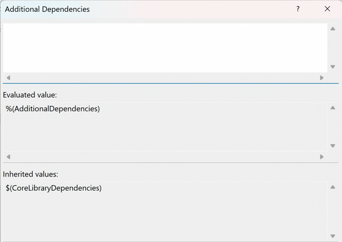
- 如果你在代码中使用了网络函数而没有链接到 `Ws2_32.lib`，编译器会报错，提示找不到相关的函数定义。
## WSAStartup
在Microsoft Learn搜索WinSock2，可以找到`winsock2.h header`的条目。
[Winsock2.h header](https://learn.microsoft.com/en-us/windows/win32/api/winsock2/)

编写Windows Socket程序之前，需要WSAStartup初始化。
[WSAStartup function (winsock2.h)](https://learn.microsoft.com/en-us/windows/win32/api/winsock2/nf-winsock2-wsastartup)

WSAStartup 函数启动进程对 Winsock DLL 的使用。（即初始化Winsock的动态链接库）
别忘了在程序结束前要WSACleanup，表示卸载 Winsock DLL。
```cpp
#include <WinSock2.h>
#include <iostream>
#include <format>
#pragma comment (lib, "Ws2_32")
int main()
{
    WORD wVersionRequested;
    WSADATA wsaData;
    int err;

    /* Use the MAKEWORD(lowbyte, highbyte) macro declared in Windef.h */
    wVersionRequested = MAKEWORD(2, 2);

    err = ::WSAStartup(wVersionRequested, &wsaData);
    if (err != 0) {
        /* Tell the user that we could not find a usable */
        /* Winsock DLL.                                  */
        std::wcout << std::format(L"WSAStartup failed with error : {}\n", err);
        return 1;
    }
    ::WSACleanup();
    return 0;
}
```
此处使用到了[Cpp_拼接字符串的几种方法（format）](../Cpp/Cpp_拼接字符串的几种方法（format）.md)中的format库的字符串输出方法。
## 创建套接字
用到的是[socket function (winsock2.h)](https://learn.microsoft.com/en-us/windows/win32/api/winsock2/nf-winsock2-socket)
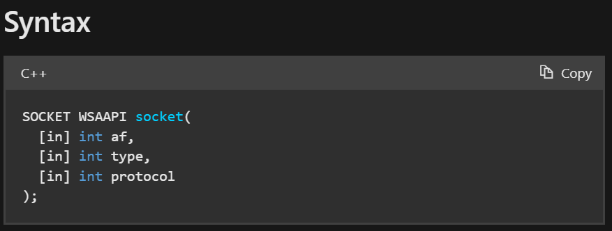
1. 第一个参数是Address Family，因此简称AF，意为地址族规范。
    1. 当前支持的值为`AF_INET`或`AF_INET6`，它们是IPv4和ipv6的Internet地址族格式。
    2. 如果安装了地址族的Windows套接字服务提供程序，则支持地址族的其他选项 (例如，与NetBIOS一起使用的`AF_NETBIOS`)。另外还有苹果的`AF_APPLETALK`，蓝牙的`AF_BTH`。
    3. 请注意，`AF_` address系列和`PF_` protocol系列常量的值是相同的 (例如，AF_INET和PF_INET)，因此可以使用任一常量。
2. 第二个参数是套接字的类型规范。
    1. 有`SOCK_STREAN`（TCP）、`SOCK_DGRAM`（UDP）、`SOCK_RAW`（原始套接字）、`SOCK_RDM`（可靠多播）、`SOCK_SEQPACKET`（伪流数据报套接字）
3. 第三个参数是协议(protocol)。协议参数的可能选项特定于指定的地址族和套接字类型。
    1. 如果指定值0，则调用者不希望指定协议，并且服务提供者将选择要使用的协议。
    2. 当af参数是AF_INET或AF_INET6并且类型是SOCK_RAW时，在IPv6或IPv4分组报头的 protocol 字段中设置为协议指定的值。
    3. 该协议字段的常见值：`IPPROTO_ICMP`、`IPPROTO_IGMP`、`BTHPROTO_RFCOMM`、`IPPROTO_TCP`、`IPPROTO_UDP`、`IPPROTO_ICMPV6`、`IPPROTO_RM`
4. 返回值：如果没有发生错误，则socket返回socket的描述符。否则，将返回`INVALID_SOCKET`，并且可以通过调用`WSAGetLastError`来检索特定的错误代码。

```cpp
#define INVALID_SOCKET  (SOCKET)(~0)  // 0取反，则是全1
```

```cpp
int main()
{
    // ...

    SOCKET listen_sock = ::socket(AF_INET, SOCK_STREAM, 0);
    
    if (listen_sock == INVALID_SOCKET)
    {
        err = ::WSAGetLastError();
        return 1;
    }
    
    // ...
}
```
## sockaddr结构
重点说一下sockaddr，这是个结构体，包含了：
1. `sin_family`
2. `sin_addr`，是sockaddr中的一个联合体，存放IP地址的整型。可以用`inet_addr("127.0.0.1")`将字符串转化为整型来填入`sin_addr.sin_addr`。
3. `sin_port`，需要用`htons`，主机地址到网络的转换。s表示short，2字节。
## bind
[bind function (winsock2.h)](https://learn.microsoft.com/en-us/windows/win32/api/winsock2/nf-winsock2-bind)
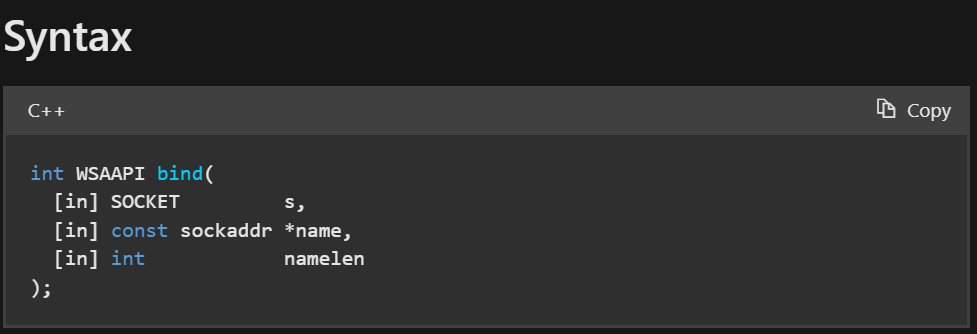
1. 参数1：socket描述符，没有绑定过的。
2. 参数2：本地地址的sockaddr结构的指针
3. 参数3：name参数所指向的值的长度 (以字节为单位)。
4. 返回：如果没有发生错误，返回零。否则，它返回`SOCKET_ERROR`，并且可以通过调用`WSAGetLastError`来检索特定的错误代码。

关于sockaddr结构：[sockaddr结构](#sockaddr结构)

编写时，发现第二个参数`name`不能直接填入`&server_addr`，而是要显式转换为`const sockaddr*`
```cpp
int main()
{
    // ...

    sockaddr_in server_addr;
    server_addr.sin_family = AF_INET;
    server_addr.sin_addr.S_un.S_addr = inet_addr("127.0.0.1");
    server_addr.sin_port = htons(9008);
    
    if (SOCKET_ERROR == ::bind(listen_sock,
            reinterpret_cast<const sockaddr*>(&server_addr),
            sizeof(server_addr)))
    {
        err = ::WSAGetLastError();
        return 1;
    }

    // ...
}
```
### 问题
报错：
```
error C4996: 'inet_addr': Use inet_pton() or InetPton() instead or define _WINSOCK_DEPRECATED_NO_WARNINGS to disable deprecated API warnings
```
VS编译器不建议使用`inet_addr`来转换字符串为ip地址。而是使用`<ws2tcpip.h>`库中的`inet_pton`，即字符串转为整数（p代表字符指针，n代表整数）。
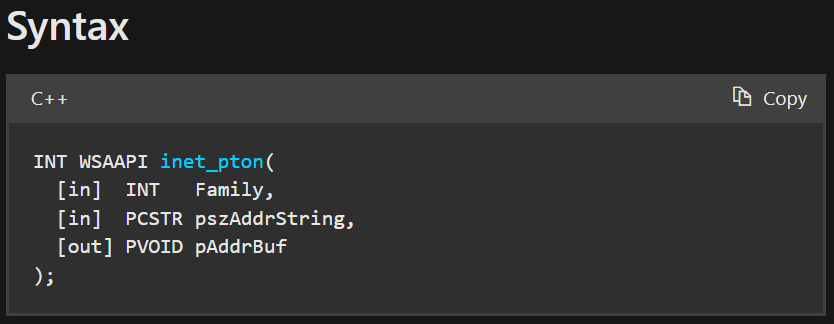
1. 参数1，地址族协议
2. 参数2，要转化的字符串
3. 参数3，要写入到哪里的地址
4. 返回值
    1. 如果没有发生错误，`InetPton`函数将返回值1，并且`pAddrBuf`参数指向的缓冲区包含按网络字节顺序排列的二进制数字IP地址。
    2. 如果参数指向的字符串不是有效的IPv4点分十进制字符串或有效的IPv6地址字符串，则InetPton函数将返回值0。
    3. 如果指向的字符串没问题，有其他错误：返回值为-1，可以通过调用`WSAGetLastError`获取扩展错误信息。

```cpp
// ...
#include <ws2tcpip.h>
int main()
{
    // ...
    
    sockaddr_in server_addr;
    server_addr.sin_family = AF_INET;
    //server_addr.sin_addr.S_un.S_addr = inet_addr("127.0.0.1");
    if (1 != ::inet_pton(AF_INET, "127.0.0.1", &server_addr.sin_addr))
    {
        return 1;
    }
    server_addr.sin_port = htons(9008);
    
    if (SOCKET_ERROR == ::bind(listen_sock,
            reinterpret_cast<const sockaddr*>(&server_addr),
            sizeof(server_addr)))
    {
        err = ::WSAGetLastError();
        return 1;
    }

    // ...
}
```
## listen
将套接字置于侦听传入连接的状态，本质上是设置了一个监听连接套接字的队列。
[listen function (winsock2.h)](https://learn.microsoft.com/en-us/windows/win32/api/winsock2/nf-winsock2-listen)
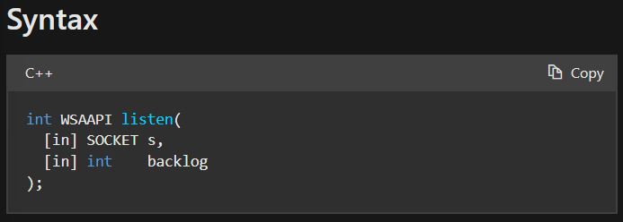
1. 参数1，已经绑定了的，但未连接的socket描述符。
2. 参数2，等待连接队列的最大长度。一般设置为`SOMAXCONN`。
3. 返回值，如果没有错误发生，返回0。否则，将返回`SOCKET_ERROR`，并且可以通过调用`WSAGetLastError`来检索特定的错误代码。

```cpp
int main()
{
    // ...
    if (SOCKET_ERROR == ::listen(listen_sock, SOMAXCONN))
    {
        err = ::WSAGetLastError();
        return 1;
    }
    // ...
}
```
## accept
从listen的监听队列中选出一个未被连接的，拿出来，产生一个worker socket（连接套接字）。如果监听队列中没有客户端连接，则阻塞，直到有人连接后返回。
在这个阶段，accept函数会把连接到服务端`listen_sock`上的client的信息填入到参数`sockaddr* client_addr`中。

[accept function (winsock2.h)](https://learn.microsoft.com/en-us/windows/win32/api/winsock2/nf-winsock2-accept)

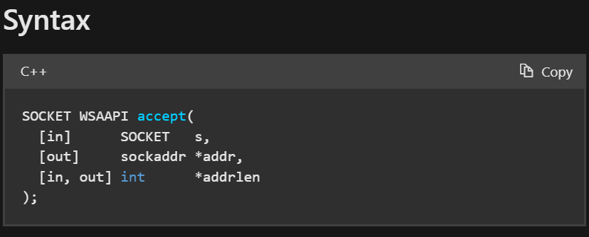
1. 参数1，已listen的套接字。但最终连接实际上是与accept返回的套接字进行的。
2. 参数2，该缓冲区要填入客户端的地址。addr参数的确切格式由从sockaddr结构创建套接字时建立的地址族确定。
3. 参数3，指向整数的指针，该整数包含addr参数所指向的结构的长度。最好让他指向一个初始化值为`sizeof(sockaddr_in)`的int值。
    1. 标志为`[in, out]`，意为是一个需要正确输入、可能会输出的项：见返回值中对addrlen的描述。
4. 返回值，如果没有发生错误，accept将返回一个SOCKET类型的值，该值是连接套接字的描述符。这个返回值是实际连接的套接字的句柄。
    1. 否则，将返回`INVALID_SOCKET`的值，并且可以通过调用`WSAGetLastError`来检索特定的错误代码。
    2. addrlen引用的整数最初需要包含addr指向的空间量（即`int addrlen{ sizeof(client_addr) }`）。函数返回时，它将填入返回的地址的实际长度 (以字节为单位)。

```cpp
// server
int main()
{
    // ...
    sockaddr_in client_addr;
    int addrlen{ sizeof(client_addr) };
    SOCKET work_sock = ::accept(
        listen_sock,
        reinterpret_cast<sockaddr*>(&client_addr),
        &addrlen);
    if (work_sock == INVALID_SOCKET)
    {
        err = ::WSAGetLastError();
        return 1;
    }
    // ...
}
```
## 调试accept - Error Lookup查询原因
程序已经通过`WSAGetLastError`把错误码填入到了err中。如果某个步骤出现了问题，可以看到err中的具体值。
这个值是个整数，可以在VS菜单栏-Tools-External Tools中添加`errorlook.exe`程序的快捷方式：
Title是自定义的，我们填入Error LookUp。
Command填入`C:\Program Files\Microsoft Visual Studio\2022\Community\Common7\Tools\errlook.exe`
Initial directory填入`C:\Program Files\Microsoft Visual Studio\2022\Community\Common7\Tools`
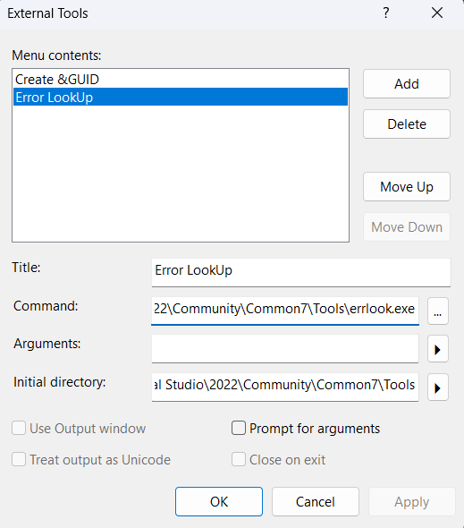
添加完毕后，Tools出来的菜单中就会显示了：
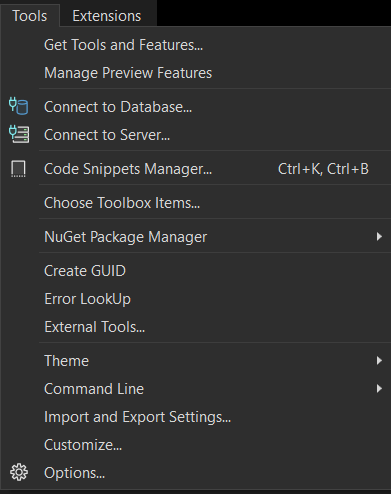

如上面的程序，addrlen如果初始化为0时，传给accept函数后，就会导致accept错误。（因为accept文档中给出参数说明：addrlen引用的整数最初需要包含addr指向的空间量。此时我们传入0是没有意义的，accept中的操作可能会读取addrlen的内容，导致错误）
```cpp
// server
int main()
{
    // ...
    sockaddr_in client_addr;
    int addrlen{ 0 };
    SOCKET work_sock = ::accept(
        listen_sock,
        reinterpret_cast<sockaddr*>(&client_addr),
        &addrlen);
    if (work_sock == INVALID_SOCKET)
    {
        err = ::WSAGetLastError();
        return 1;
    }
    // ...
}
```
最终err码是10014，那么在ErrorLook中查询：
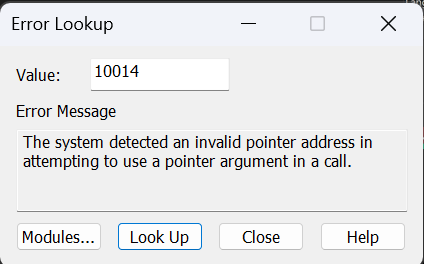
## 客户端
新建一个空项目，SocketClientStudy，新建文件`basic_stream_client.cpp`。不用设置为启动项目。

客户端程序需要WSA初始化、创建套接字。
后面直接连接connect，connect的参数和服务器端bind的参数一样：创建`sockaddr_in`并且填入相关信息（协议、IP地址、端口号）。
[connect function (winsock2.h)](https://learn.microsoft.com/en-us/windows/win32/api/winsock2/nf-winsock2-connect)
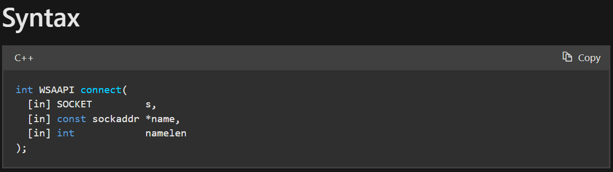
返回值：如果没有发生错误，返回0。否则返回`SOCKET_ERROR`，并且可以通过调用`WSAGetLastError`来检索特定的错误代码。
1. 阻塞套接字，返回值指示连接尝试的成功或失败。
2. 非阻塞套接字，连接尝试无法立即完成。在这种情况下，connect将返回`SOCKET_ERROR`，`WSAGetLastError`将返回`WSAEWOULDBLOCK`。

```cpp
#include <WinSock2.h>
#include <iostream>
#include <format>
#include <ws2tcpip.h>
#pragma comment (lib, "Ws2_32")
int main()
{
    WORD wVersionRequested;
    WSADATA wsaData;
    int err;

    /* Use the MAKEWORD(lowbyte, highbyte) macro declared in Windef.h */
    wVersionRequested = MAKEWORD(2, 2);

    err = ::WSAStartup(wVersionRequested, &wsaData);
    if (err != 0) {
        /* Tell the user that we could not find a usable */
        /* Winsock DLL.                                  */
        std::wcout << std::format(L"WSAStartup failed with error : {}\n", err);
        return 1;
    }

    SOCKET sock = ::socket(AF_INET, SOCK_STREAM, IPPROTO_TCP);
    if (sock == INVALID_SOCKET)
    {
        err = ::WSAGetLastError();
        return 1;
    }

    sockaddr_in server_addr;
    server_addr.sin_family = AF_INET;
    //service.sin_addr.S_un.S_addr = inet_addr("127.0.0.1");
    if (1 != ::inet_pton(AF_INET, "127.0.0.1", &server_addr.sin_addr))
    {
        err = ::WSAGetLastError();
        return 1;
    }
    server_addr.sin_port = htons(9008);
    
    if (SOCKET_ERROR == ::connect(sock, reinterpret_cast<const sockaddr*>(&server_addr), sizeof(server_addr)))
    {
        err = ::WSAGetLastError();
        return 1;
    }

    ::WSACleanup();
    return 0;
}
```
## 联调1
单独Build客户端项目：右击客户端项目名-Project Only-Build Only ...

若Build成功，则可以启动Server项目了。Server项目直接点击VS全局下的调试即可（快捷键F5）。
启动Server之后，若成功地阻塞在accept，则可以单独启动客户端项目了：右击客户端项目-Debug-Start New Instance
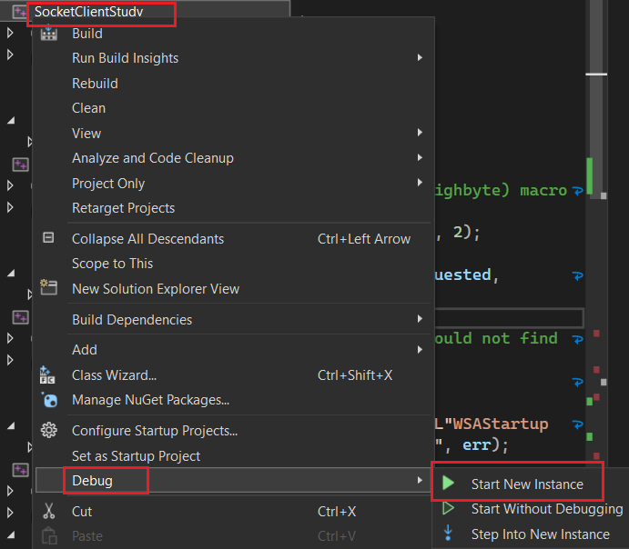
之后，可以很轻松地在此两个项目中流转、单步调试。
## 服务端-显示连接的客户端信息
想要显示连接的客户端的IP地址和端口号。
[InetNtopW function (ws2tcpip.h)](https://learn.microsoft.com/en-us/windows/win32/api/ws2tcpip/nf-ws2tcpip-inetntopw)

对于IP地址，在编写服务端的bind、客户端的connect时，声明`sockaddr_in`时，都需要使用`inet_pton`来填入`sin_addr`。这是让IP地址字符串转换为整数值填入联合体。
而我们想要从`sockaddr_in`获得字符串形式的IP地址时，需要用`inet_ntop`，注意，不能直接读取`sockaddr_in`，而是`sockaddr_in.sin_addr`。详见[sockaddr结构](#sockaddr结构)
对于端口号，对于网络程序来说，需要使用`htons`使主机字节序转为网络字节序（类似于IP地址从字符串转换为计算机程序可理解的整型值），填入`sin_port`。而对于人类的可读性来讲，需要从网络字节序转为主机字节序（类似于IP地址从整数值转换为人类可理解的字符串），需要：`ntohs`。
>`inet_pton`和`inet_ntop`都是ANSI版本的。
>`InetNtopW`是Unicode版本的。参数除了`pStringBuf`的类型为PWSTR不一样，其他一样。见[InetNtopW function (ws2tcpip.h)](https://learn.microsoft.com/en-us/windows/win32/api/ws2tcpip/nf-ws2tcpip-inetntopw)
>
>`htons`：h代表host，to意为转换，n为net，s为short（2字节）。还有`htonl`，为long int（4字节）。

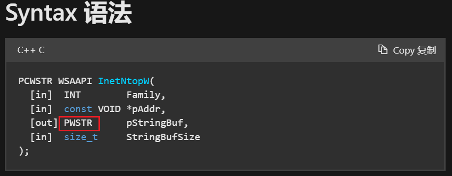

```cpp
int main()
{
    // ...
    wchar_t addr_str[46] = L"";
    InetNtopW(AF_INET, reinterpret_cast<void*>(&client_addr.sin_addr), addr_str, 46);
    std::wcout << std::format(L"client address: {}, port: {}\n", addr_str, ntohs(client_addr.sin_port));
    // ...
}
```
## 服务端-发送消息
[send function (winsock2.h)](https://learn.microsoft.com/en-us/windows/win32/api/winsock2/nf-winsock2-send)

建立好socket通道后，可以直接在此socket上send，recv。
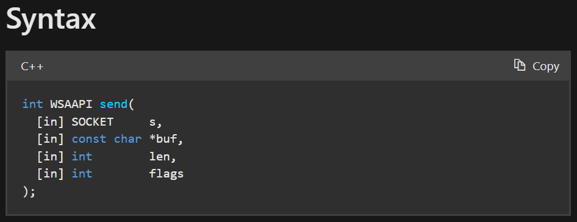
1. 参数1，已连接的socket
2. 参数2，要发送的数据的指针
3. 参数3，要发送的数据的大小（字节数）
4. 参数4，指定调用方式的标志，可以按位OR。如无特殊需要，填0即可。
5. 返回值，如果没有发生错误，将返回已发送的总字节数，该字节数可以小于len参数中请求发送的字节数。若错误，将返回`SOCKET_ERROR`，并且可以通过调用`WSAGetLastError`来检索特定的错误代码。

| Value         | Meaning                                                                                                                                                               |
| ------------- | --------------------------------------------------------------------------------------------------------------------------------------------------------------------- |
| MSG_DONTROUTE | Specifies that the data should not be subject to routing. A Windows Sockets service provider can choose to ignore this flag.<br>指定数据不应进行路由。Windows套接字服务提供程序可以选择忽略此标志。 |
| MSG_OOB       | Sends OOB data (stream-style socket such as SOCK_STREAM only).<br>发送OOB数据 (仅流式套接字，如SOCK_STREAM)                                                                       |
要注意，由于我们想要发送的是一个Unicode字符串，而参数`buf`的类型是`const char *`。
首先，不能以wstring对象的单位发送，应当发送其中的内容`message.c_str()`。
其次，`message.c_str()`返回类型为`const wchar_t *`，而TCP的send是要按字节流进行发送的，所以要显式转换指针为`const char*`，这里的`char*`和字符没有关系，而是表示按字节。
```cpp
int main()
{
    // ...
    std::wstring message{ L"Welcome to server!" };
    ::send(
        work_sock,
        reinterpret_cast<const char*>(message.c_str()),
        sizeof(wchar_t) * message.size(),
        0);
    // ...
}
```
### send的阻塞问题
如果传输系统内没有可用的缓冲区空间来保存要传输的数据，如果套接字不是非阻塞模式，send将阻塞。
在面向流的非阻塞套接字上，写入的字节数可以介于1和请求长度之间，具体取决于客户端和服务器计算机上的缓冲区可用性。
## 服务端-接收消息
[recv function (winsock2.h)](https://learn.microsoft.com/en-us/windows/win32/api/winsock2/nf-winsock2-recv)

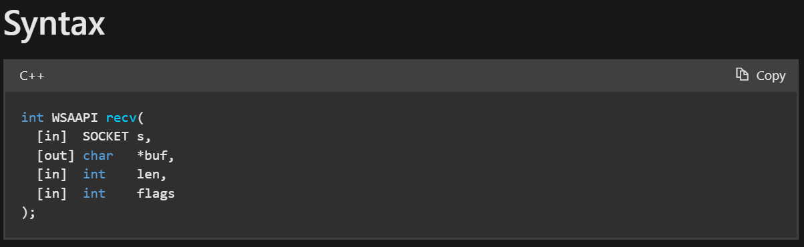
1. 参数1，已连接的socket
2. 参数2，要接收数据的buf指针
3. 参数3，buf的字节大小
4. 参数4，影响此函数行为的标志
5. 返回值，如果没有发生错误，recv返回接收到的字节数，buf参数指向的缓冲区将填入接收到的数据。
    1. 如果套接字是面向连接的，并且远程端已正常关闭连接，则recv将立即返回0，接收到0字节。
    2. 如果是异常断开，将返回`SOCKET_ERROR`的值，并且可以通过调用`WSAGetLastError`来检索特定的错误代码。
        1. 如果连接已重置，错误为`WSAECONNRESET`。

```cpp
int main()
{
    // ...
    wchar_t buf[100] = { 0 };
    int bytes_received = ::recv(work_sock, reinterpret_cast<char*>(buf), sizeof(wchar_t) * sizeof(buf), 0);
    if (bytes_received > 0)
    {
        std::wcout << buf << std::endl;
    }
    // ...
}
```
### recv的阻塞问题
如果套接字上没有可用的传入数据，则recv调用将根据为阻塞并等待数据到达。
如果套接字是非阻塞的。将返回`SOCKET_ERROR`，并将错误代码设置为`WSAEWOULDBLOCK`。
## 客户端-接收消息

```cpp
int main()
{
    // ...
    wchar_t buf[100] = { 0 };
    int bytes_received = ::recv(
        sock,
        reinterpret_cast<char*>(buf),
        sizeof(wchar_t) * sizeof(buf),
        0);
    if (bytes_received > 0)
    {
        std::wcout << buf << std::endl;
    }
    // ...
}
```

## 客户端-发送消息
可以使用`std::wcin`作为Unicode标准输入到buf。
buf中的内容会被覆盖。（但是用wcin作为输入有个缺陷，就是如果句子中间被空格断开了的话，只能填入buf空格之前的字符）
注意，buf的类型是`wchar_t buf[100]`，是C风格的wchar数组，因此在计算有效长度len时（即不包含第一个`\0`），需要使用`wcslen(buf)`。如果要计算有效长度的字节大小，还需要乘以`sizeof(wchar_t)`。
```cpp
int main()
{
    // ...
    std::wcout << L"Please input what you want to send to server: ";
    std::wcin >> buf;
    int bytes_sent = ::send(
        sock,
        reinterpret_cast<const char*>(buf),
        sizeof(wchar_t) * wcslen(buf),
        0);
    // ...
}
```
## 客户端-收尾工作
类似于指针管理，先释放资源，再把描述符置为无效。
```cpp
int main()
{
    // ...
    ::closesocket(sock);
    sock = INVALID_SOCKET;

    ::WSACleanup();
    return 0;
}
```
## 服务端-收尾工作
类似于指针管理，先释放资源，再把描述符置为无效。
```cpp
int main()
{
    // ...
    ::closesocket(work_sock);
    work_sock = INVALID_SOCKET;

    ::closesocket(listen_sock);
    listen_sock = INVALID_SOCKET;

    ::WSACleanup();
}
```
## 联调2
分别运行、调试两端程序的方法同[联调1](#联调1)。
测试结果：
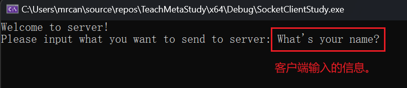

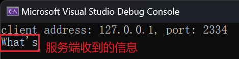
## 【可选】客户端-bind
见[客户端的bind](#客户端的bind)。
需要在connect到server之前进行客户端的bind。需要声明一个本地的`sockaddr_in`，填入自己的协议、地址、端口号。
```cpp
int main()
{
    // create socket...
    sockaddr_in local;
    local.sin_family = AF_INET;
    if (1 != inet_pton(AF_INET, "127.0.0.1", &local.sin_addr))
    {
        return 1;
    }
    local.sin_port = htons(10000);
    
    if (SOCKET_ERROR == ::bind(sock, reinterpret_cast<const sockaddr*>(&local), sizeof(local)))
    {
        err = ::WSAGetLastError();
        return 1;
    }
    
    // connect ...
    
    // ...
}
```
测试：
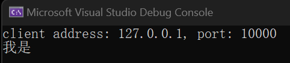
发现，客户端的端口号确实改成了我们自定义的10000。
## 服务端-循环多次accept
在accept到send、recv直到`closesocket(work_sock)`外面包一个while循环即可。
```cpp
// server
int main()
{
    // ...
    while (true)
    {
        // accept ...
        // send ...
        // recv ...
        ::closesocket(work_sock);
        work_sock = INVALID_SOCKET;
    }
    
    ::closesocket(listen_sock);
    listen_sock = INVALID_SOCKET;

    ::WSACleanup();
}
```
但要注意，如果想要在一个主机上运行多个客户端，则客户端不能自定义为固定的端口号。即不能主动bind。
经测试，可以运行2个客户端，排队连接：
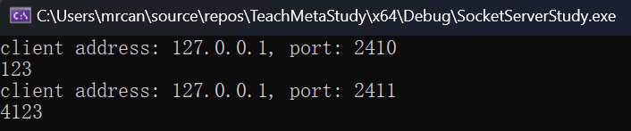
## 服务端-修改监听队列大小
如果修改服务端监听队列大小为1，会产生什么影响？
```cpp
// server
int main()
{
    // ...
    if (SOCKET_ERROR == ::listen(listen_sock, 1))
    {
        err = ::WSAGetLastError();
        return 1;
    }
    // ...
}
```
经测试，发现启动前2个客户端的connect正常：
1. 第1个客户端在第2个客户端启动之前，connect很快返回。此时第1个客户端还没输入消息，占用了连接。
2. 第2个客户端在监听队列中等待第1个客户端结束。因此connect阻塞。

但第3个客户端启动后，发现监听队列满了，因此会connect失败，立即返回`SOCKET_ERROR`。
## 服务端-循环+多线程accept
使用`jthread`+`lambda表达式`封装每一个客户端被服务端accept后，服务端的操作。注意构造完毕jthread后需要detach，否则默认会join，导致主线程等待子线程结束从而无法处理其他网络事务。
还有，由于使用到了`client_addr`和`work_sock`，需要在lambda表达式的`[]`中进行捕获。
在lambda表达式中，如果要修改某些值（此例中要修改`client_addr`和`addr_str`），默认是不允许的，如果要修改，需要修饰其为`mutable`。
```cpp
// server
int main()
{
    // WSAStartup
    // Create Socket
    // bind
    // listen
    while (true)
    {
        // accept ...
        std::jthread t([client_addr, work_sock]() mutable
            {
                wchar_t addr_str[46] = L"";
                InetNtopW(AF_INET, reinterpret_cast<void*>(&client_addr.sin_addr), addr_str, 46);
                std::wcout << std::format(L"client address: {}, port: {}\n", addr_str, ntohs(client_addr.sin_port));
                // send ...
                // recv ...
                ::closesocket(work_sock);
                work_sock = INVALID_SOCKET;
            });
        t.detach();
    }
    
    ::closesocket(listen_sock);
    listen_sock = INVALID_SOCKET;

    ::WSACleanup();
    return 0;
}
```
### 更多测试：客户端bind固定端口，开启多个客户端
客户端bind固定端口10000，开启多个客户端。
在开启第2个客户端时，bind函数会失败，立即返回`SOCKET_ERROR`。
此时关闭所有客户端。
短时间内，再重新启动一个客户端，绑定的还是10000。还是会失败，此时bind成功，但connect是失败的。bind成功是因为目前10000端口只有一个客户端占用。connect失败是因为这个端口不久前刚被使用过，还没有完全失效。这与四次握手释放的时间有关系，默认在2分钟内相同的端口号不可重用。
我们可以通过`WSAGetLastError()`获得错误码+Error Lookup查询详细的connect失败描述：
经调试，connect失败时的错误码为10048。
```cpp
// client
{
    // ...
    if (SOCKET_ERROR == ::connect(sock, reinterpret_cast<const sockaddr*>(&server_addr), sizeof(server_addr)))
    {
        err = ::WSAGetLastError();
        return 1;
    }
    // ...
}
```
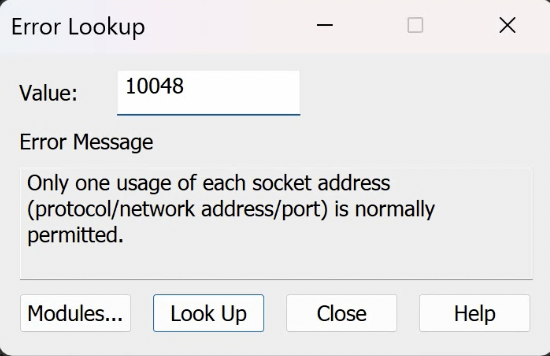
一个socket五元组地址只能用一次。
>五元组的组成：协议、网络地址、端口号。
>协议：客户端、服务端是一致的。共1个。
>网络地址：客户端、服务端各有一个。共2个。
>端口号：客户端、服务端各有一个。共2个。
>因此称为五元组。

由于客户端中刚使用过的10000端口还未完全失效，因此无法很快地重用。
## 结合协程
在VS中，同一解决方案，多个项目：一个是服务器项目，一个是客户端项目，还有现在要提到的协程项目。为了使用协程，在解决方案中引入协程项目后，还需要在使用到它的项目中（如服务器项目）添加现有项（Add Existing Item），在Header Files中添加`.hpp`、`.h`文件，在Source Files中添加`.cpp`文件。然后，在代码文件中`#include "../Coroutines/Agave.hpp"`引入相应头文件以使用库。（在VS中，项目的当前目录都是以`.vcxproj`为基准的）

用协程函数封装上面lambda表达式中做的事情。
```cpp
// server
// ...
#include "../Coroutines-STD20/Agave.hpp"
// Fore Declaration
agave::IAsyncAction worker_async(sockaddr_in client_addr, SOCKET work_sock);
int main(void)
{
    // WSAStartup
    // create socket
    // bind
    // listen
    
    while (true)
    {
        // ... accept
        worker_async(client_addr, work_sock);
    }
    ::closesocket(listen_sock);
    listen_sock = INVALID_SOCKET;
    ::WSACleanup();
    return 0;
}

agave::IAsyncAction worker_async(sockaddr_in client_addr, SOCKET work_sock)
{
    // let this function run on the child thread instead of the main thread.
    co_await agave::resume_background();
    
    wchar_t addr_str[46] = L"";
    InetNtopW(AF_INET, reinterpret_cast<void*>(&client_addr.sin_addr), addr_str, 46);
    std::wcout << std::format(L"client address: {}, port: {}\n", addr_str, ntohs(client_addr.sin_port));
    // send ...
    // recv ...
    ::closesocket(work_sock);
    work_sock = INVALID_SOCKET;
}
```
## 结合线程池
线程池的设计、代码见[线程池_bubo](../项目/线程池_bubo.md)

新建项目`StreamServer`，新建源文件`stream_server_threadpool.cpp`。文件内容先拷贝`basic_stream_server.cpp`的，之后再作调整。

该项目引入头文件（Add Existing Item）：
1. 线程池部分：`ITask.h`、`ThreadPool.h`
2. 协程部分：`Agave.hpp`、`AgaveDetails.hpp`、`B_Object.hpp`、`BJobScheduler.h`

引入源文件（Add Existing Item）：
1. 线程池部分：`ThreadPool.cpp`
2. 协程部分：`BJobScheduler.cpp`。

记得调整项目的`C++`标准为`C++20`。
### Task
新建`network_task.h`。
需要设计什么？
1. 必须实现ITask的接口`run_task`。
2. 根据`basic_stream_server.cpp`中的`worker_async(sockaddr_in client_addr, SOCKET work_sock)`接口，服务器要生成一个网络任务需要传入`client_addr`和`work_sock`（服务端`accept`后返回的sock）。因此`network_task`构造函数需要有这两个作为参数，以及需要有成员变量存储这两个。

```cpp
#include "../ThreadPool/ITask.h"
#include <WinSock2.h>
class NetworkTask : public thpool::ITask
{
public:
	NetworkTask(sockaddr_in client_addr, SOCKET work_sock);
	~NetworkTask();
	void run_task() override;
private:
	sockaddr_in				_client_addr;
	SOCKET					_work_sock;
};
```

实现：
主要实现`run_task`，代码内容是：
1. 服务端-显示连接的客户端信息
2. 服务端-发送消息、接收消息
3. 服务端-收尾工作

```cpp
// stream_server_threadpool.cpp
#include "network_task.h"
#include <iostream>
#include <WS2tcpip.h>
#include <format>

NetworkTask::NetworkTask(sockaddr_in client_addr, SOCKET work_sock) : _client_addr{ client_addr }, _work_sock{ work_sock }
{
}

NetworkTask::~NetworkTask()
{
}

void NetworkTask::run_task()
{
    wchar_t addr_str[46] = L"";
    InetNtopW(AF_INET, reinterpret_cast<void*>(&_client_addr.sin_addr), addr_str, 46);
    std::wcout << std::format(L"client address: {}, port: {}\n", addr_str, ntohs(_client_addr.sin_port));
    // send ...
    std::wstring message{ L"Welcome to server!" };
    ::send(
        _work_sock,
        reinterpret_cast<const char*>(message.c_str()),
        sizeof(wchar_t) * message.size(),
        0);
    // recv ...
    wchar_t buf[100] = { 0 };
    int bytes_received = ::recv(_work_sock, reinterpret_cast<char*>(buf), sizeof(wchar_t) * sizeof(buf), 0);
    if (bytes_received > 0)
    {
        std::wcout << buf << std::endl;
    }
    ::closesocket(_work_sock);
    _work_sock = INVALID_SOCKET;
}
```
### 调用线程池
原先`basic_stream_server.cpp`中获得`work_sock`之后，可以调整其后的行为，让其调用协程（实际是用协程函数封装了后续收发行为）。那么此处，可以更改为调用线程池。
```cpp
#include <WinSock2.h>
#include <iostream>
#include <format>
#include <ws2tcpip.h>
#include "network_task.h"                // add
#include "../ThreadPool/ThreadPool.h"    // add
#pragma comment (lib, "Ws2_32")
int main()
{
    thpool::ThreadPool threadpool{ 10 }; // add
    
    WORD wVersionRequested;
    WSADATA wsaData;
    int err;

    /* Use the MAKEWORD(lowbyte, highbyte) macro declared in Windef.h */
    wVersionRequested = MAKEWORD(2, 2);

    err = ::WSAStartup(wVersionRequested, &wsaData);
    if (err != 0) {
        /* Tell the user that we could not find a usable */
        /* Winsock DLL.                                  */
        std::wcout << std::format(L"WSAStartup failed with error : {}\n", err);
        return 1;
    }

    SOCKET listen_sock = ::socket(AF_INET, SOCK_STREAM, IPPROTO_TCP);
    if (listen_sock == INVALID_SOCKET)
    {
        err = ::WSAGetLastError();
        return 1;
    }
    sockaddr_in server_addr;
    server_addr.sin_family = AF_INET;
    //service.sin_addr.S_un.S_addr = inet_addr("127.0.0.1");
    if (1 != ::inet_pton(AF_INET, "127.0.0.1", &server_addr.sin_addr))
    {
        err = ::WSAGetLastError();
        return 1;
    }
    server_addr.sin_port = htons(9008);

    if (SOCKET_ERROR == ::bind(listen_sock,
        reinterpret_cast<const sockaddr*>(&server_addr),
        sizeof(server_addr)))
    {
        err = ::WSAGetLastError();
        return 1;
    }

    if (SOCKET_ERROR == ::listen(listen_sock, SOMAXCONN))
    {
        err = ::WSAGetLastError();
        return 1;
    }

    while (true)
    {
        sockaddr_in client_addr;
        int addrlen{ sizeof(client_addr) };
        SOCKET work_sock = ::accept(
            listen_sock,
            reinterpret_cast<sockaddr*>(&client_addr),
            &addrlen);
        if (work_sock == INVALID_SOCKET)
        {
            err = ::WSAGetLastError();
            return 1;
        }

        // adjust: 调用线程池
        threadpool.add_task(std::shared_ptr<thpool::ITask>(new NetworkTask{ client_addr, work_sock }));
    }

    ::closesocket(listen_sock);
    listen_sock = INVALID_SOCKET;

    ::WSACleanup();
    return 0;
}
```
#### 测试
运行1个服务端、3个客户端。
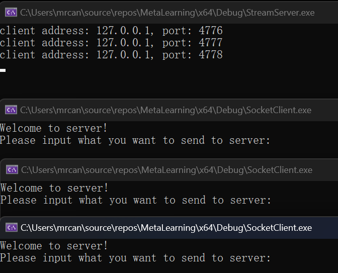
3个客户端分别输入`ThisIs1/2/3`
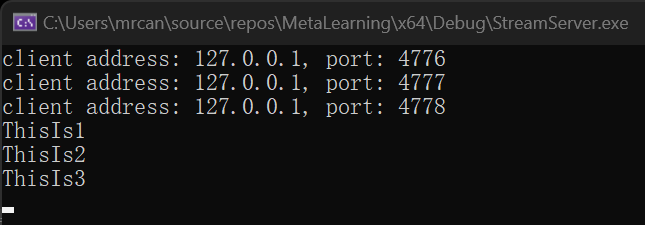
### 调用线程池同时使用协程
新建源文件`stream_server_threadpool_coroutine.cpp`，内容暂时拷贝`stream_server_threadpool.cpp`。
新建头文件`coroutine_task.hpp`。与`network_task.hpp`不同，其需要一个function。
协程和任务之间用function来作为媒介，可以把fn看作是协程函数`agave::IAsyncAction worker_async`，传入给CoroutineTask。
```cpp
#include "../ThreadPool/ITask.h"
#include <WinSock2.h>
#include <functional>
class CoroutineTask : public thpool::ITask
{
public:
	CoroutineTask(std::function<void(void)> cb) : _cb{ cb }
	{

	}
	void run_task() override
	{
		if (_cb)
		{
			_cb();
		}
	}
private:
	std::function<void(void)>		_cb;
};
```
调用线程池同时使用协程时，我们是设置协程的背景，绑定一个线程池。
即在建立线程池后给出如下的`set_bg_entry`，达到的效果是：每当协程函数调用`co_await agave::resume_background()`时，都会从背景绑定的线程池中抽取线程资源执行协程函数。
具体的：在`set_bg_entry`中填入一个lambda表达式，捕获创建好的线程池，在该线程池中添加任务`add_task`，即创建一个`CoroutineTask`，使用`fn`作为参数。
```cpp
// stream_server_threadpool_coroutine.cpp
#include <WinSock2.h>
#include <iostream>
#include <format>
#include <ws2tcpip.h>
#include "network_task.h"
#include "../ThreadPool/ThreadPool.h"
#include "../Coroutines/Agave.hpp"
#include "coroutine_task.hpp"
#pragma comment (lib, "Ws2_32")
agave::IAsyncAction worker_async(sockaddr_in client_addr, SOCKET work_sock);

int main()
{
    thpool::ThreadPool threadpool{ 10 };
    agave::set_bg_entry(
        [&threadpool](std::function<void(void)> fn)
            {
                threadpool.add_task(std::shared_ptr<thpool::ITask>(new CoroutineTask{ fn }));
            }
        );
    
    WORD wVersionRequested;
    WSADATA wsaData;
    int err;

    /* Use the MAKEWORD(lowbyte, highbyte) macro declared in Windef.h */
    wVersionRequested = MAKEWORD(2, 2);

    err = ::WSAStartup(wVersionRequested, &wsaData);
    if (err != 0) {
        /* Tell the user that we could not find a usable */
        /* Winsock DLL.                                  */
        std::wcout << std::format(L"WSAStartup failed with error : {}\n", err);
        return 1;
    }

    SOCKET listen_sock = ::socket(AF_INET, SOCK_STREAM, IPPROTO_TCP);
    if (listen_sock == INVALID_SOCKET)
    {
        err = ::WSAGetLastError();
        return 1;
    }
    sockaddr_in server_addr;
    server_addr.sin_family = AF_INET;
    //service.sin_addr.S_un.S_addr = inet_addr("127.0.0.1");
    if (1 != ::inet_pton(AF_INET, "127.0.0.1", &server_addr.sin_addr))
    {
        err = ::WSAGetLastError();
        return 1;
    }
    server_addr.sin_port = htons(9008);

    if (SOCKET_ERROR == ::bind(listen_sock,
        reinterpret_cast<const sockaddr*>(&server_addr),
        sizeof(server_addr)))
    {
        err = ::WSAGetLastError();
        return 1;
    }

    if (SOCKET_ERROR == ::listen(listen_sock, SOMAXCONN))
    {
        err = ::WSAGetLastError();
        return 1;
    }

    while (true)
    {
        sockaddr_in client_addr;
        int addrlen{ sizeof(client_addr) };
        SOCKET work_sock = ::accept(
            listen_sock,
            reinterpret_cast<sockaddr*>(&client_addr),
            &addrlen);
        if (work_sock == INVALID_SOCKET)
        {
            err = ::WSAGetLastError();
            return 1;
        }

        worker_async(client_addr, work_sock);
    }

    ::closesocket(listen_sock);
    listen_sock = INVALID_SOCKET;

    ::WSACleanup();
    return 0;
}

agave::IAsyncAction worker_async(sockaddr_in client_addr, SOCKET work_sock)
{
    // let this function run on the child thread instead of the main thread.
    co_await agave::resume_background();

    wchar_t addr_str[46] = L"";
    InetNtopW(AF_INET, reinterpret_cast<void*>(&client_addr.sin_addr), addr_str, 46);
    std::wcout << std::format(L"client address: {}, port: {}\n", addr_str, ntohs(client_addr.sin_port));
    // send ...
    std::wstring message{ L"Welcome to server!" };
    ::send(
        work_sock,
        reinterpret_cast<const char*>(message.c_str()),
        sizeof(wchar_t) * message.size(),
        0);
    // recv ...
    wchar_t buf[100] = { 0 };
    int bytes_received = ::recv(work_sock, reinterpret_cast<char*>(buf), sizeof(wchar_t) * sizeof(buf), 0);
    if (bytes_received > 0)
    {
        std::wcout << buf << std::endl;
    }
    ::closesocket(work_sock);
    work_sock = INVALID_SOCKET;
}
```
#### 测试
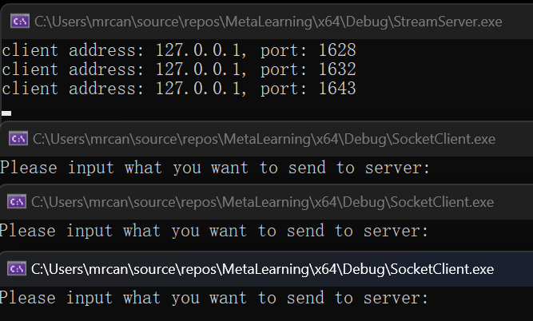
