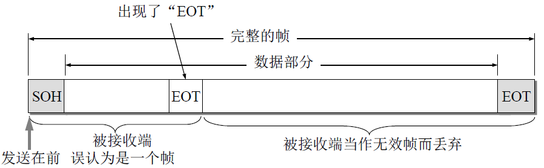
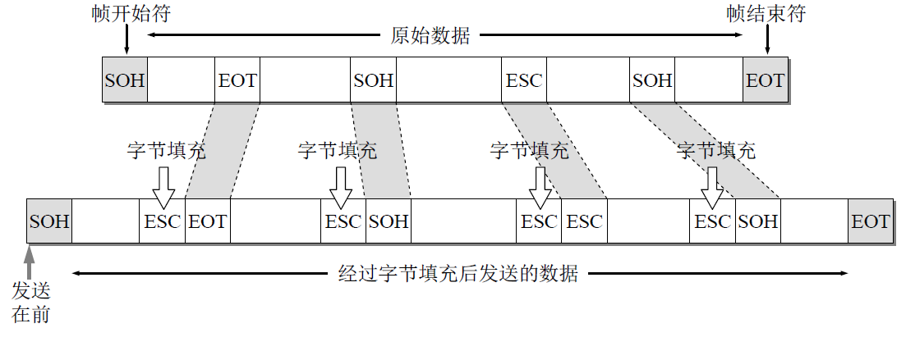
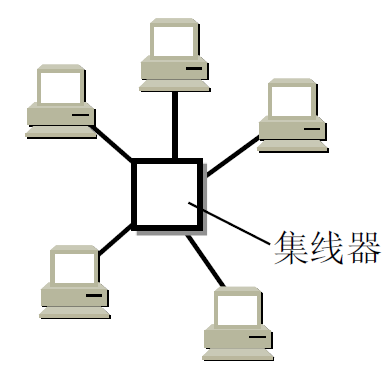
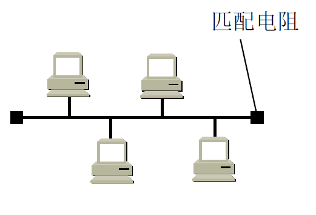
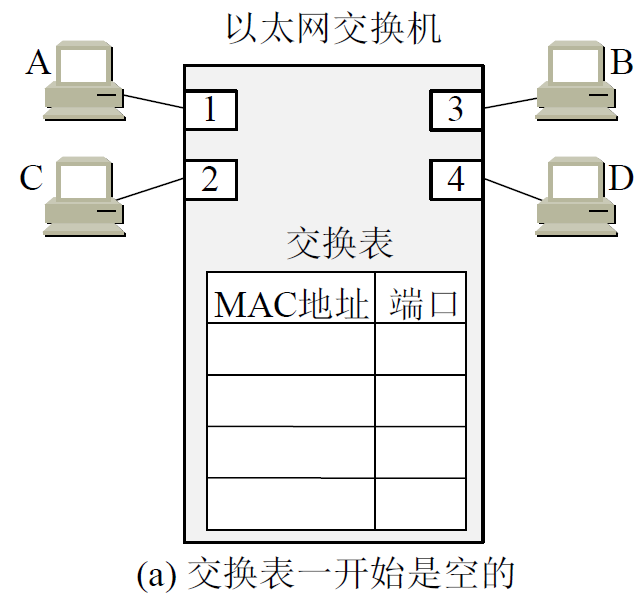
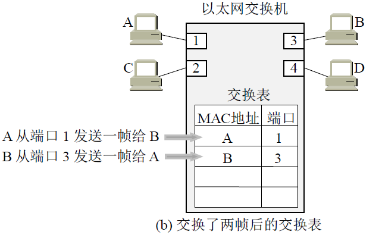
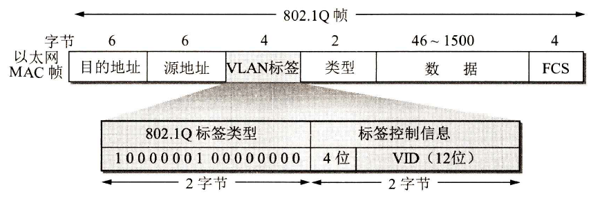
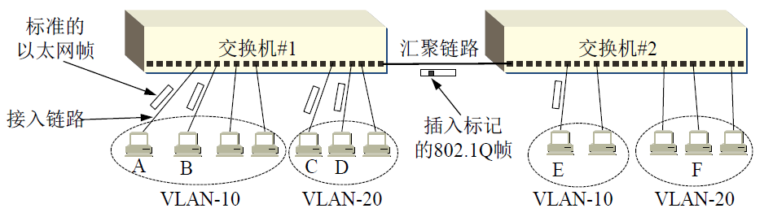

# 数据链路层

传输单位：帧

1. 点对点信道和广播信道的特点，及两种信道所使用的协议的特点(PPP和CSMA/DA)
2. 三个基本问题：
   1. 封装成帧
   2. 透明传输
   3. 差错检测
3. 以太网MAC层的硬件地址
4. 适配器、转发器、集线器、网桥、以太网交换机的作用以及使用场合

# 点对点信道

点对点信道的数据链路层的协议数据单元——帧。

点对点信道的数据链路层在进行通信时的主要步骤如下：

1. 节点A的数据链路层把网络层交下来的IP数据报添加首部和尾部封装成帧。
2. 节点A把封装好的帧发送给节点B的数据链路层。
3. 若节点B的数据链路层收到的帧无差错，则从收到的帧中提取出IP数据报交给上面的网络层；否则丢弃这个帧。

# 成帧

什么是成帧？

封装成帧(framing)就是**发送方在一段数据的前后分别添加首部和尾部**，这样就构成了一个帧。**接收端在收到物理层上交的比特流后，就能根据首部和尾部的标记，从收到的比特流中识别帧的开始和结束**。

我们知道，分组交换的一个重要概念就是：所有在互联网上传送的数据都以分组（即IP 数据报）为传送单位。网络层的IP数据报传送到数据链路层就成为帧的数据部分。在帧的数据部分的前面和后面分别添加上首部和尾部，构成了一个完整的帧。这样的帧就是数据链路层的数据传送单元。

## 帧定界

帧定界是：用于判断帧的边界，从哪开始到哪结束。要用特殊的字符串表示它的开始和特殊的字符串表示结束。

一个帧的帧长等于帧的数据部分长度加上帧首部和帧尾部的长度。首部和尾部的一个重要作用就是进行**帧定界**（即确定帧的界限）。此外，首部和尾部还包括许多必要的控制信息。在发送帧时，是从帧首部开始发送的。各种数据链路层协议都对帧首部和帧尾部的格式有明确的规定。显然，为了提高帧的传输效率，应当使帧的数据部分长度尽可能地大于首部和尾部的长度。但是，每一种**链路层协议都规定了所能传送的帧的数据部分长度上限**——**最大传送单元MTU**(Maximum Transfer Unit)。给出了帧的首部和尾部的位置，以及帧的数据部分与MTU的关系。

* 帧定界的几种方法
  * 字符填充的首尾界符法
  * 比特位填充的首位界符法
  * 字符计数法

当数据在传输中出现差错时，帧定界符的作用更加明显。假定发送端在尚未发送完一个帧时突然出故障，中断了发送。但随后很快又恢复正常，于是重新从头开始发送刚才未发送完的帧。由于使用了帧定界符，接收端就知道前面收到的数据是个不完整的帧（只有首部开始符SOH而没有传输结束符EOT），必须丢弃。而后面收到的数据有明确的帧定界符（SOH和EOT），因此这是一个完整的帧，应当收下。

## 透明传输

数据部分如果出现和头和尾一样的特殊的字符串或位串的内容，会干扰接收方的定界。

当传送的帧是用文本文件组成的帧时（文本文件中的字符都是从键盘上输入的），其数据部分显然不会出现像SOH或EOT这样的帧定界控制字符。**可见不管从键盘上输入什么字符都可以放在这样的帧中传输过去，因此这样的传输就是透明传输**。

但当数据部分是非ASCII码的文本文件时（如二进制代码的计算机程序或图像等），情况就不同了。如果数据中的某个字节的二进制代码恰好和SOH或EOT这种控制字符一样（如图3-6所示），数据链路层就会错误地“找到帧的边界”，把部分帧收下（误认为是个完整的帧），而把剩下的那部分数据丢弃（这部分找不到帧定界控制字符SOH）。这样的帧传输不是透明传输。

* 理解透明传输
  * “透明”表示：某一个实际存在的事物看起来却好像不存在一样（例如，你看不见在你前面有块100%透明的玻璃的存在）。
  * “在数据链路层透明传送数据”——表示无论什么样的比特组合的数据，都**能够按照原样没有差错地通过**这个数据链路层。因此，对所传送的数据来说，这些数据就“看不见”数据链路层有什么妨碍数据传输的东西。或者说，数据链路层对这些数据来说是透明的。

* 解决透明传输问题
  * 必须设法使数据中可能出现的控制字符“SOH”和“EOT”在接收端不被解释为控制字符。
  * 具体的方法是：发送端的数据链路层在**数据中**出现控制字符“SOH”或“EOT”的前面插入一个转义字符“ESC”(其十六进制编码是1B，二进制是00011011)。
  * 在接收端的数据链路层在把数据送往网络层之前删除这个插入的转义字符。
  * 如果转义字符“ESC“也出现在数据当中，那么解决方法仍然是在转义字符的前面插入一个转义字符。因此，当接收端收到连续的两个转义字符时，就删除其中前面的一个。
  * 这种方法称为字节填充(byte stuffing)或字符填充(character stuffing)。
    

## 差错控制：循环冗余校验码计算

被除数是谁？——原始数据+后面补若干个零（生成多项式的最高次幂）。

除数是谁？——生成多项式对应的二进制序列。

商和余数谁是冗余码？——余数。余数位数不够时要在前面补零（最后总位数为生成多项式的最高次幂）

P77 简答题 6 7 8

## 纠错机制-反馈重发机制[传输层]

* 应当明确，“无比特差错”与“无传输差错”是不同的概念。
  * 在数据链路层使用 CRC 检验，能够实现无比特差错的传输，但这还不是可靠传输。
  * 要做到“无差错传输”（即发送什么就收到什么）就必须再加上确认和重传机制。 
  * 本章介绍的数据链路层协议都不是可靠传输的协议。
  * **循环冗余校验码只是在数据链路层保证帧的比特位不出错**，即**无比特差错**。但是复杂的情况如帧丢失、帧重复、帧失序这些复杂错误情况就需要更高层的协议来纠错。这里讨论的反馈重发机制是**传输层的可靠传输的工作原理**。

根据上述，由于检错码不能自动纠正所发现帧乱序的错误，所以当接收方发现错误时，要给发送方反馈信息要求重发。

又叫**自动请求重传ARQ**(Automatic Repeat-reQuest)，重传的请求是自动进行的，接收方不需要请求发送方重传某个出错的帧。

1. 停止-等待方式
2. 连续工作方式（连续ARQ协议）
   1. 拉回方式
   2. 选择性重发方式

### 停止等待协议

* 基本思想
  * 发送端在**发出一帧后必须停下来等待接收端对所发送的确认帧**进行确认。若确认对方正确收到，则发送方继续发送下一帧，否则，发送方就重发该帧。

* A向B发送帧：
  * B成功接收到了，且检测后正常，则回传A一个确认帧，被A接收到后，A才继续发送下一个帧。
  * B接收帧时**检测出错误则丢弃该帧**（或者**帧在传输过程中丢失**），B不会发送任何信息。则A必须重发该帧，直到B成功接收为止。
    * B等确认要等待多长时间？——A设置了一个**超时计时器**，如果到期之前收到了相应的确认则重置该计时器，继续发送下一个帧。
    * 若帧正确到达B，但B回送的确认丢失或延迟了，**A未收到B的确认，会超时重发该帧**。**B可能会收到重复的帧**。B如何知道收到了重复的帧，需要丢弃呢？——**编号**。
      * A为每一个发送的帧都进行编号。若B收到了编号相同的帧，则B认为收到了重复帧，B丢弃重复的帧，**并且B回送确认**。
      * B为发送的确认也进行编号，指示该确认是对哪一个帧的确认。A根据确认帧及其编号，可以确定它是对哪一个帧的确认，避免重复发送，并且**A可以根据此确认号传送下一个帧**。若为重复的确认，则将其丢弃。

* 确认帧的编号问题
  * 确认帧（ACKnowledgement, ACK）——正确接收后回传的帧被称为确认帧。
  * 习惯将确认序号n表示为ACKn，**ACKn表示“第n–1号帧已经收到，现在期望接收第n号帧”**。
* 性能分析
  * 停止等待协议实现简单，但**传输距离远时**信道利用率低。
* 改进
  * 采用**流水线传输**，就是发送方可连续发送多个帧，不必每发完一个帧就停顿下来等待对方的确认。这样可使信道上一直有数据不间断地传送。从而提高信道利用率。**这是连续ARQ协议的基本思想**。
* 与ARQ的关系
  * CRC检验器能够自动丢弃检测到的出错帧。实用的CRC检验器都是用硬件完成的。因此所谓的“丢弃出错帧”，对上层软件或用户来说都是感觉不到的。
  * 发送端对出错的数据帧进行重传是自动进行的，因而这种**差错控制机制**常简称为ARQ(Automatic Repeat reQuest)，直译是自动重传请求，但意思是自动请求重传。因此**停等协议中包含着ARQ协议**（是一种差错控制机制）

### 连续ARQ

* 基本思想
  * 发送方在发送一个帧后，**不停下来等待确认帧到来**。而是**连续再发送多个帧**，帧的个数取决于发送方的发送能力和接收端的接收能力。此方式中，必须为不同帧编上序列号作为帧标识。
  * 接收方一般采用**累积确认**的方式

#### 拉回方式

连续发了多个帧，某一个出错后，从出错的开始需要全部重发，因为要求是按序接收。换言之，一旦接收方发现第n帧出错，则丢弃第n帧及第n帧以后的所有帧。

在等不到2号帧的确认而重传2号数据帧时，虽然结点A已经发完了5号帧，但仍必须向回走，将2号帧及其以后的各帧全部进行重传。连续 ARQ又称为Go-back-N ARQ，意思是当出现差错必须重传时，要向回走N个帧，然后再开始重传。

* 代价：信道的带宽。

#### 选择重发方式

假定发送方连续发送了m帧，而接收方在对收到的数据进行校验后发现第n帧出错(n≤m)，于是**接收方给发送方出错信息要求发送方重发第n帧**。换言之，一旦接收方发现第n帧出错，则丢弃第n帧，但**缓存第n帧以后的所有正确帧**。

选择重发方式与拉回方式比较，前者只重发出错的数据。效率高。

* 代价：存储空间；实现比较复杂
  * 接收端必须维持一个足够大的缓存以便存储出错帧之后收到的帧，直到出错帧被重传。
  * 而且它必须具有**将收到的重传帧插入到正确位置**的逻辑功能。发送端也要求更复杂的逻辑功能以便**能够不按顺序发送一个帧**。由于有这样的复杂性，选择重传ARQ远不如go-back-N ARQ用得广泛。

#### 累积确认

即**不必对收到的帧逐个发送确认**，而是对按序到达的**最后一个帧**发送确认，这样就表示：到这个帧为止的所有帧都已正确收到了。

**优点**：容易实现，即使确认丢失也不必重传；**缺点**：不能向发送方反映出接收方已经正确收到的所有帧的信息。

## 流量控制

滑动窗口协议

## 习题

# 使用广播信道的数据链路层

广播信道可以进行一对多的通信。以太网和无线局域网都是广播链路层技术的例子。下面要讨论的局域网使用的就是广播信道。

# 局域网技术

遵循IEEE 802系列标准。实际上局域网体系结构是**物理层和数据链路层**（细分成了MAC[Madium Access Control]子层、LLC[Logical Link Control]子层）。与介质相关的是MAC（与物理层接触），无关的是LLC（与网络层接触）。

## 局域网的特点和分类

局域网最主要的特点是：网络为一个单位所拥有，且地理范围和站点
数目均有限。

局域网可按网络拓扑进行分类。由于集线器(hub)的出现和双绞线大量用于局域网中，星形以太网以及多级星形结构的以太网获得了非常广泛的应用。下图为星形网。

下图为总线网，各站直接连在总线上。总线两端的匹配电阻吸收在总线上传播的电磁波信号的能量，避免在总线上产生有害的电磁波反射。

总线网以传统以太网最为著名，但以太网后来又演变成了星形网。经过四十多年的发展，以太网的速率已大大提高。

## 以太网

现在最常用的以太网的速率是1 Gbit/s（家庭或中小企业）、10 Gbit/s（数据中心）和100 Gbit/s（长距离传输），且其速率仍在继续提高。现在以太网已成为了局域网的同义词，因此谈论局域网可以看作是在谈论以太网。

* 为了通信的简便，以太网的两种措施
  * 第一，采用较为灵活的**无连接的工作方式**，即不必先建立连接就可以直接发送数据。适配器对发送的数据帧不进行编号，也不要求对方发回确认。这样做可以使以太网工作起来非常简单，而局域网信道的质量很好，因通信质量不好产生差错的概率是很小的。因此，以太网提供的服务是尽最大努力的交付，即**不可靠的交付**。当目的站收到有差错的数据帧时（例如，**用CRC查出差错**），就把帧丢弃，其他什么也不做。**对有差错帧是否需要重传则由高层来决定**。例如，如果高层使用TCP协议，那么TCP就会发现丢失了一些数据。于是经过一定的时间后，TCP就把这些数据重新传递给以太网进行重传。**但以太网并不知道这是重传帧，而是当作新的数据帧来发送**。
  * 第二，以太网发送的数据都使用**曼彻斯特(Manchester)编码**的信号。我们知道，二进制基带数字信号通常就是高、低电压交替出现的信号。使用这种信号的最大问题就是当出现一长串连续的1或连续的0时，接收端就无法从收到的比特流中提取位同步（即比特同步）信号。如图所示，**曼彻斯特编码的编码方法是把每一个码元再分成两个相等的间隔**。码元1是前一个间隔为低电压而后一个间隔为高电压。码元0则正好相反，从高电压变到低电压（也可采用相反的约定，即1是“前高后低”而0是“前低后高”）。**这样就保证了在每一个比特的正中间出现一次电压的转换，而接收端就利用这种电压的转换很方便地把位同步信号提取出来**。但是从曼彻斯特编码的波形图也不难看出，**其缺点是它所占的频带宽度比原始的基带信号增加了一倍**（因为每秒传送的码元数加倍了）。

## 介质访问控制

介质访问的控制都在MAC子层完成。

最早的以太网是将许多计算机都连接到一根总线上。当初认为这种连接方法既简单又可靠，因为在那个时代普遍认为：“有源器件不可靠，而无源的电缆线才是最可靠的”。

总线的特点是：当一台计算机发送数据时，总线上的所有计算机都能检测到这个数据。这种就是广播通信方式。

* 为了在总线上实现不干扰他人的一对一的通信，需要采取一些技术措施
  * 可以使每一台计算机的适配器都拥有一个与其他适配器都不同的地址。在**发送数据帧时，在帧的首部写明接收站的地址**。现在的电子技术可以很容易做到：**仅当数据帧中的目的地址与适配器ROM中存放的硬件地址一致时，该适配器才能接收这个数据帧**，不是发送给自己的数据帧就丢弃。这样，具有广播特性的总线上就实现了一对一的通信。
  * 除了给每个网络适配器一个单独的地址，还需要解决一个问题，因为**有些节点可能在某一刻同时传输帧，那么所有节点会同时接到多个帧**，这个现象叫做：传输的这些帧在所有的接收方处**碰撞**了。通常，在碰撞发生时，没有一个接收节点能够获得有效帧，因此，涉及此次碰撞的所有帧都消失了，相应的这段时间中广播信道大量带宽会被浪费掉。那么如何来规范广播网络(例如总线网)上的计算机在广播信道上的传输行为呢？这是一个**多路访问问题**。显然需要通过制定**多路访问协议**来解决。

### 适配器的作用

* 重要功能
  * 进行串行/并行转换
  * 对数据进行缓存
  * 在计算机的操作系统安装设备驱动程序
  * 实现以太网协议

### 媒体共享技术

* 静态划分信道
  * 频分复用
  * 时分复用
  * 波分复用
  * 码分复用
* 动态媒体接入控制（多点接入）
  * 随机接入：所有的用户可随机地发送信息
  * 受控接入：用户必须服从一定的控制，如轮询(polling)

### 介质访问控制策略

在介质访问控制技术中，最关键的是控制地点和控制方法。

1. 在什么地方对媒体访问进行控制

   * 集中式控制
     * 指定一个单独的集中控制器或一个具有控制整个网络的能力的节点来管理网络的通信，其将拥有控制网络访问的权利。
     * 优点
       * 能提供除了对媒体访问外的其他更高级的功能，如优先级控制、可靠性等。
       * 每个站点的访问控制逻辑简单
       * 避免进行分布合作可能带来的协调问题 
     * 缺点
       * 如果控制点不能工作，则会导致整个网络瘫痪。
       * 由于所有访问要经过控制点的允许，可能会形成瓶颈，降低效率。
   * 分布式控制
     * 无集中控制节点，各节点均处于平等地位；由各个站点共同完成媒体访问控制功能，动态地确定站点的发送顺序；节点间的通信由各节点自身控制。
     * 分类
       * CSMA/CD
       * 令牌法
       * 时隙法(Time Slot)

2. 怎么对共享媒体进行控制访问

   * 同步机制：如FDM、TDM等。

   * 异步机制：如时间片轮转（循环式）、预约式、竞争式等。

     |        | 总线拓扑             | 环型拓扑                 |
     | ------ | -------------------- | ------------------------ |
     | 循环式 | 令牌总线(IEEE 802.4) | 令牌环(IEEE 802.5; FDDI) |
     | 预约式 | DQDB(IEEE 802.6)     |                          |
     | 竞争式 | CSMA/CD(IEEE 802.3)  |                          |

     * 时间片轮转（循环式）
       * 每个站点按照一定的时间顺序得到传输时间。如果站点利用这个机会发送，则对其发送时间或发送的数据总量有一定限制，超过这个限制的数据只能在下一轮中发送。
       * 这种顺序控制可能是集中式的，也可能是分布式的。 
       * 在一段时间内有多个节点要传输数据时，此方式是有效的。
       * 当要传输数据的节点较少时，时间开销就显得很大。
     * 预约式
       * 一般来说，这种技术**把传输媒体的使用时间划分为一些时槽**。一个节点要传输数据时，就可以预约一些时槽进行连续传输。
       * 适合于传输连续数据的情况。**流式通信就是长时间连续传输**，例如话音通信、遥测通信和长文件的传输等。
       * 可以是集中式的，也可以是分布式的。
     * 竞争式
       * 这种技术并不对各个工作站点的发送权限进行控制，而是由各个工作站点自由竞争发送机会。
       * 对突发性的数据传输，竞争是最常用的机制。突发式通信就是短时间的少量传输，例如终端和主机之间的通信就是这样的。
       * 在低负荷时，性能不错。
       * 是分布式的。

### 多路访问协议

有关多路访问协议方面的研究仍在活跃，所有的多路访问协议可分为三种类型之一：信道划分协议、随机接入协议、轮流协议。

#### 信道划分协议

* 时分多路复用(TDM)
* 频分多路复用(FDM)
* 码分多址(Code Division Multiple Access, CDMA)

#### 随机接入协议

在随机接入协议中，一个传输节点总是以信道的全部速率(即R bps)进行发送。当有碰撞时，涉及碰撞的每个节点反复地重发它的帧，直到无碰撞地通过为止。但是当一个节点经历一次碰撞时，他不必立刻重发该帧，而是在**重发该帧之前等待一个随机时延**。涉及碰撞的每个节点独立地选择随机时延。因为该随机时延是独立选择的，所以可能：这些节点之一所选择的时延充分小于其他碰撞节点的时延，因此能够无碰撞地将它的帧在信道中发出。

最常用的随机接入协议有**ALOHA协议**和**载波侦听多路访问(CSMA)协议**。以太网是一种流行并广泛部署的CSMA协议。

* ALOHA协议
  * 访问方式：不监听——随机重发，“发送——冲突——再发送”。
  * 信道利用率最多为18%
* 分槽ALOHA协议
  * 各用户节点只能在下一时间片的起始时刻开始发送信息。
  * 信道利用率最多为37%
* CSMA协议
  * 载波侦听多路访问，Carrier Sense Multiple Access，是一种适合于总线结构的具有信道检测功能的分布式介质访问控制方法，其控制手段称之为“载波侦听”。
  * 该协议的一般描述非常简单。如果一个站点有一个帧要发送，它遵循下面的规则：1、侦听介质的活动。2、如果没有活动，则立即传送，否则等待。
  * CSMA分为三种方式，非坚持和坚持CSMA，坚持CSMA又分为“1-坚持CSMA”和“p-坚持CSMA”
    * 非坚持CSMA：一旦监听到信道忙，就不再监听；延迟一个随机时间后再次监听
      * 优点：降低了冲突发生概率
      * 缺点：信道利用率降低
    * 1-坚持CSMA：监听到信道忙时，仍继续监听，直到信道空闲立即传输。如果冲突，则等待一段随机的时间后重复第一步。
      * 优点：有利于抢占信道，减少信道空闲时间
      * 缺点：冲突概率较大
    * p-坚持CSMA：1、若介质空闲，以概率p传输，以概率(1-p)延迟一个时间单位，该时间单位通常等于最大传播延迟的两倍；2、若介质忙，继续监听直到信道空闲，并重复第1步；3、若传输延迟了一个时间单位，则重复第1步。
    * 对比：非坚持CSMA协议中的站点是尊重别人的，而“1-坚持”方式是自私的。试图既能如非坚持算法那样减少冲突而又像“1-坚持”算法那样减少空闲时间的一种折衷方案是“p-坚持”协议。
  * CSMA的意义：在信道忙时不会有其他主机打乱正在进行的发送。由于采用了信道侦听，因此在一定程度上减少了冲突发生的次数，从而提高了信道的利用率和整个网络的吞吐量。
  * CSMA不能完全避免冲突的原因：当主机A认为信道空闲时，主机B也可能认为信道空闲，因此，两台主机差不多同时发送数据，导致冲突发生。

### 局域网实际常用的访问控制方式

* 目前，计算机局域网常用的访问控制方式有三种，分别用于不同的拓扑结构。
  * 带有冲突检测的载波侦听多路访问法CSMA/CD (Carrier Sense Multiple Access with Collision Detection)
  * 令牌环访问控制法(Token Ring)
  * 令牌总线访问控制法(Token Bus)

|        | 总线拓扑                 | 环型拓扑                     |
| ------ | ------------------------ | ---------------------------- |
| 循环式 | **令牌总线**(IEEE 802.4) | **令牌环**(IEEE 802.5; FDDI) |
| 预约式 | DQDB(IEEE 802.6)         |                              |
| 竞争式 | **CSMA/CD**(IEEE 802.3)  |                              |

其中CSMA/CD是目前比较流行、应用最广泛的介质访问控制方法，以下重点介绍此访问方法。

#### CSMA/CD协议

CSMA/CD和它之前的ALOHA、CSMA技术都是随机访问和竞争发送协议。随机访问意味着任何节点都无法预计其发送的时刻；竞争发送是指所有发送的节点自由竞争信道的使用权。

回到本原的问题——**如何解决在广播网络中多个帧碰撞的问题**？

CSMA解决的问题只有监听，监听只能把信道冲突率降低。但不能完全避免冲突。关键是：CSMA只是在发送之前进行侦听有无其他占用信道，发送之后就不再侦听了，这样依旧可能会产生碰撞。所以需要发送后也要侦听才行——于是带上了后缀CD，CD指的是Collision Detecion，“带冲突检测”。

> * 数据在发送前监听到信道“空闲”，什么还会产生碰撞？
>   * 当某站监听到信道是空闲时，可能总线并非真正空闲。电磁波在总线上总是以有限的速率传播。电磁波在1km电缆的传播时延约为5μs。也就是说你听到的已经成为了过去式，不能代表现在进行时。

* CSMA/CD的工作流程
  1. 先听后发：每个站在发送数据之前先检测总线上是否空闲。如果信道是空闲的，立即抢占总线发送信息。如果信道忙，则退避一段时间再尝试。
  2. 边听边发：当一个节点将开始发送数据后，在传送的过程中发送者要边发送边监听(listen while talking)
  3. 冲突停止：如果监测到的信息与发出的不一致，说明发生了冲突，则停止发送，并发送一串阻塞信号以加强冲突。
  4. 随机延迟后重发：延迟一个随机时间片再去侦听总线，延迟时间短的节点先抢占总线。

##### 争用期

##### 最短帧长

交换机的转发方式有两种：1、直通方式（直接转发）；2、存储转发

直接转发有时只允许转发长度大于64字节的帧，为什么呢？

电磁波在总线上总是以有限的速率传播的，是有时延的。如果总线上传输中的帧很短，可能电磁波侦听不到，就误以为信道是空闲的。

# 交换局域网

## 在数据链路层扩展以太网

### 网桥

* 最初人们使用的是**网桥**，网桥对收到的帧根据其MAC帧的目的地址进行**转发**和**过滤**。当**网桥收到一个帧时，并不是向所有的端口转发此帧，而是根据此帧的目的MAC地址，查找网桥中的地址表，然后确定将该帧转发到哪一个端口**，或者是把它丢弃（即过滤）。

### 交换式集线器

* **交换式集线器(switching hub)**淘汰了网桥，常被称为以太网**交换机(switch)**或**第二层交换机(L2 switch)**，第二层的意思是强调这种交换机工作在数据链路层。以太网交换机的性能远远超过普通的集线器，而且价格也不贵，这就使工作在物理层的集线器逐渐地退出了市场。
* 以太网交换机实质上就是一个**多端口的网桥**，通常都有十几个或更多的端口，和工作在物理层的转发器、集线器有很大的差别。
* 以太网交换机的每个端口都直接与一个单台主机或另一个以太网交换机相连，一般都以全双工方式工作。
* 具有并行性，即可以同时连通多对端口，使多对主机能够同时通信（即可以一次分析、转发多个帧）。
* 相互通信的主机都独占传输媒体，**无碰撞**地传输数据。换句话说，**每一个端口和连接到端口的主机构成了一个碰撞域，具有N个端口的以太网交换机的碰撞域共有N个**。对于传统的10 Mbit/s 的共享式以太网，若共有10 个用户，则每个用户占有的平均带宽只有1 Mbit/s。
  * 若使用以太网交换机来连接这些主机，虽然在每个端口到主机的带宽还是10Mbit/s，但由于一个用户在通信时是独占而不是和其他网络用户共享传输媒体的带宽，因此对于拥有10个端口的交换机的总容量则为100Mbit/s。这正是交换机的最大优点。
* 以太网交换机的输出接口设有缓冲存储器，非常类似于路由器接口的缓存。因此，如果连接在以太网交换机上的两台主机，同时向另一台主机发送帧，那么当这台主机的端口繁忙时，发送帧的这两台主机的端口会把收到的帧暂存一下，以后再发送出去。

#### 从总线以太网到星形以太网

传统的电话网是星形结构，其中心就是电话交换机。那么在20世纪70年代中期出现的局域网，为什么不采用这种星形结构呢？这是因为在当时的技术条件下，还很难用廉价的方法制造出高可靠性的以太网交换机。所以那时的以太网就采用无源的总线结构。这种总线式以太网一问世就受到广大用户的欢迎，并获得了很快的发展。

然而随着以太网上站点数目的增多，使得总线结构以太网的可靠性下降。与此同时，大规模集成电路以及专用芯片的发展，使得星形结构的以太网交换机可以做得既便宜又可靠。在这种情况下，采用以太网交换机的星形结构就成为以太网的首选拓扑，而传统的总线以太网也很快从市场上消失了。

总线以太网使用CSMA/CD协议，以半双工方式工作。但以太网交换机不使用共享总线，没有碰撞问题，因此不使用CSMA/CD协议，而是以全双工方式工作。

既然连以太网的重要协议CSMA/CD都不使用了（相关的“争用期”也没有了），为什么还叫作以太网呢？原因就是**它的帧结构未改变，仍然采用以太网的帧结构**。这也就对应了：“交换机对于主机来说是透明的，主机总以为自己在总线上进行通信。”

### 交换机的转发方式（交换方式）

虽然许多以太网交换机对收到的帧采用**存储转发方式**进行转发，但也有一些交换机采用**直通(cut-through)的交换方式**。

直通交换不必把整个数据帧先缓存后再进行处理，而是在**接收数据帧的同时**就**立即**地**按数据帧的目的MAC地址决定该帧的转发端口**，因而提高了帧的转发速度。如果在这种交换机的内部采用基于硬件的交叉矩阵，交换时延就非常小。直通交换的一个缺点是它不检查差错就直接将帧转发出去，因此有可能也将一些无效帧转发给其他的站。

在某些情况下，仍需要采用基于软件的存储转发方式进行交换，例如当需要进行线路速率匹配、协议转换或差错检测时。

现在有的厂商已生产出能支持两种交换方式的以太网交换机。以太网交换机的发展与建筑物结构化布线系统的普及应用密切相关。在结构化布线系统中，广泛地使用了以太网交换机。

### 交换机的地址表

以太网交换机是一种即插即用设备，其内部的帧**交换表（又称为地址表）**是通过**自学习算法**自动地逐渐建立起来的。实际上，这种交换表就是一个**内容可寻址存储器CAM(Content Addressable Memory)**。以太网交换机由于使用了专用的交换结构芯片，交换机的硬件转发帧的转发速率要比使用软件转发的网桥快很多。

* 交换机的自学习功能
  * 假定在图中的以太网交换机有4个端口，各连接一台计算机，其MAC地址分别是A, B, C和D。交换表最重要的就是两个字段：**目的MAC地址**和**相应的转发端口**。在一开始，以太网交换机里面的交换表是空的。

  * 假定A先向B发送一帧，从端口1进入到交换机。交换机收到帧后，先查找交换表。现在表中没有B的地址。于是，**交换机把此帧的源地址A和端口1写入交换表**中，并**向除端口1以外的所有端口广播这个帧**。如此广播发送就可保证B收到这个帧，而**其他端口**C和D在收到帧后，**因目的地址不匹配将丢弃此帧**。这一过程也称为**过滤**。
  * 由于在交换表中写入了项目(A, 1)，因此以后不管从哪个端口收到帧，只要其目的地址是A，就把收到的帧从端口1转发出去送交A。
  * 接下来假定B通过端口3向A发送一帧。交换机查找交换表，发现交换表中的MAC地址有A，表明凡是发给A的帧（即目的地址为A的帧），都应从端口1转发给A。显然，**现在应直接把收到的帧从端口1转发给A，而没有必要再广播收到的帧**。交换表这时用源地址B写入一个项目(B, 3)，表明今后如有发送给B的帧，应从端口3转发给B。

  * 经过一段时间后，只要主机C和D也向其他主机发送帧，以太网交换机中的交换表就会把转发到C或D应当经过的端口号（2或4）写入交换表中。这样，交换表中的项目就逐渐增多了。
  * 考虑到有时可能要在交换机的端口更换主机，或者主机要更换其网络适配器，这就需要及时**更新**交换表中的项目。为此，**当交换表中写入一个项目时就记下当时的时间，只要超过预先设定的时间（例如300秒），该项目就自动被删除**。用这样的方法保证交换表中的数据都符合当前网络的实际状况。这就是说，图中的交换表**实际上是有三列，即MAC地址、端口和写入时间**。
  * 以太网交换机的这种自学习方法使得以太网交换机能够即插即用，不必人工进行配置，因此非常方便。

## 链路层寻址和ARP

# 虚拟局域网

以太网交换机的问世，加速了以太网的普及应用。一个以太网交换机可以非常方便地连接几十台计算机，构成一个星形以太网。但是，当一个以太网包含的计算机太多时，往往会带来两个缺点。

首先，一个以太网是一个广播域。在以太网上经常会出现大量的广播帧。在交换机的交换表的建立过程中要使用许多广播帧。经常使用的ARP和DHCP 协议，也都要在以太网中传送很多的广播帧。在一个主机数量很大的以太网上传播广播帧，必然会消耗很多的网络资源。如果网络的配置出了些差错，就有可能发生广播帧在网络中无限制地兜圈子，形成了“广播风暴”，使整个的网络瘫痪。

其次，一个单位的以太网往往为好几个下属部门所共享。但有些部门的信息是需要保密的（例如，财务部门或人事部门）。许多部门共享一个局域网对信息安全不利。

如果使每一个小部门各拥有自己的较小的局域网，那么这不但可使局域网的广播域范围缩小，同时也提高了局域网的安全性。在以太网交换机出现后，我们可以很方便灵活地建立虚拟局域网VLAN (Virtual LAN)。这样就把一个较大的局域网，分割成为一些较小的局域网，而每一个局域网是一个较小的广播域。

> 在IEEE 802.1Q 标准中，对虚拟局域网VLAN 是这样定义的：
> 虚拟局域网VLAN是**由一些局域网网段构成的与物理位置无关的逻辑组**，而这些网段具有某些共同的需求。每一个VLAN的帧都有一个明确的标识符，指明发送这个帧的计算机属于哪一个VLAN。

## 虚拟局域网的以太网帧格式

1988年IEEE批准了802.3ac标准，这个标准定义了以太网的帧格式的扩展，以便支持虚拟局域网。虚拟局域网协议允许在以太网的帧格式中插入一个4字节的标识符，称为VLAN标签(tag)，用来指明发送该帧的计算机属于哪一个虚拟局域网。插入VLAN标签的帧称为802.1Q帧。所以虚拟局域网其实只是局域网给用户提供的一种拓展服务，而并不是一种新型局域网。

VLAN标签字段的长度是4字节，插入在以太网MAC帧的源地址字段和类型字段之间。VLAN标签的前两个字节总是设置为0x8100（即二进制的10000001 00000000），称为IEEE 802.1Q标签类型。

VLAN标签的后两个字节中，前面4位实际上没有什么作用，这里不讨论。**后面的12位是该虚拟局域网VLAN标识符VID (VLAN ID)**，它唯一地标志了802.1Q帧属于哪一个VLAN。12位的VID可识别4096个不同的VLAN。

插入VLAN标签后，802.1Q帧最后的帧检验序列FCS必须重新计算。

当数据链路层检测到MAC帧的源地址字段后面的两个字节的值是0x8100时，就知道现在插入了4字节的VLAN标签。由于用于VLAN的以太网帧的首部增加了4个字节，因此以太网的最大帧长从原来的1518字节（1500字节的数据加上18字节的首部和尾部）变为1522字节。

### 例子

这样的802.1Q帧在什么地方使用呢？用简单例子来说明。

交换机#1连接了7台计算机，组成了一个局域网（一个广播域）。现在把局域网划分为两个虚拟局域网VLAN-10和VLAN-20。这里的10和20是虚拟局域网的编号，即VID字段的值，由交换机管理人员设定。

现在我们有了两个较小的广播域。每台计算机都是通过接入链路(access link)连接到以太网交换机的。管理人员划分虚拟局域网的方法有多种。例如，按交换机的端口划分，或按MAC地址划分。每台主机并不知道自己的VID值（但交换机必须知道这些信息）。这些主机通过接入链路发送到交换机的帧都是标准的以太网帧。

> 在一个用多个交换机连接起来的较大的局域网中，可以灵活地划分虚拟局域网，不受地理位置的限制。一个虚拟局域网的范围可以跨越不同的交换机。当然，所使用的交换机必须要能够识别和处理虚拟局域网。在图中，在另外一层楼的交换机#2连接了5台计算机，并与交换机#1相连接。交换机#2中的两台计算机加入到VLAN-10，而另外3台加入到VLAN-20。这两个虚拟局域网虽然都跨越了两个交换机，但都各自是一个广播域，即VLAN-10是处于同一广播域，VLAN-20处于另一个广播域。

* A给B发（同一交换机，同一VLAN）

现在假定A向B发送帧。由于交换机#1能够根据帧首部的目的MAC地址，识别B属于本交换机管理的VLAN-10，因此就像在普通以太网中那样直接进行帧的转发，不需要使用VLAN标签。这是最简单的情况。

* A给E发（同一VLAN，跨越交换机的情况）

> 连接两个交换机端口之间的链路称为**汇聚链路**(trunk link)或干线链路。

现在假定A向E发送帧。交换机#1查到E并没有连接到本交换机，因此必须从汇聚链路把帧转发到交换机#2，但在**转发之前，要插入VLAN标签**，如果不插入VLAN标签，交换机#2就不知道应把帧转发给哪一个VLAN。因此在有虚拟局域网的以太网中的汇聚链路（两个交换机之间）传送的帧是802.1Q帧。交换机#2在向E转发帧之前，要拿走已插入的VLAN标签，因此E收到的帧就是A发送的标准以太网帧，而不是802.1Q帧。上图说明了这种情况。

> 所以，在有虚拟局域网的以太网中的交换机对于主机来说仍是透明的，交换机在转发给主机前已把VLAN的4字节标签处理。

* A给C发（同一交换机，跨越VLAN）

如果A向C发送帧，情况又怎样呢？这种情况就复杂些了，因为这是在不同网络之间的通信。虽然A和C都连接到同一个交换机，但它们已经处在不同的网络中（VLAN-10和VLAN-20）。这问题是互连网络中的通信问题，已经超过了数据链路层的范围。这要由网络层中的路由器来解决。

不过有的交换机中嵌入了一个用专用芯片构成的转发模块，用来在不同的VLAN之间转发帧。这样就可以不必再使用另外的路由器，而就在交换机中实现了第3层的转发功能（由于使用硬件转发，转发帧的速率提高了，比使用路由器要快）。这种转发功能被称为**第3层交换**，而**这种交换机常称为L3/L2交换机**。

* A给F发（跨越交换机，跨越VLAN）

有了这种第3层交换机，甚至于：连接到不同交换机的A和F，都可以不需要经过另外的路由器而相互通信了。
