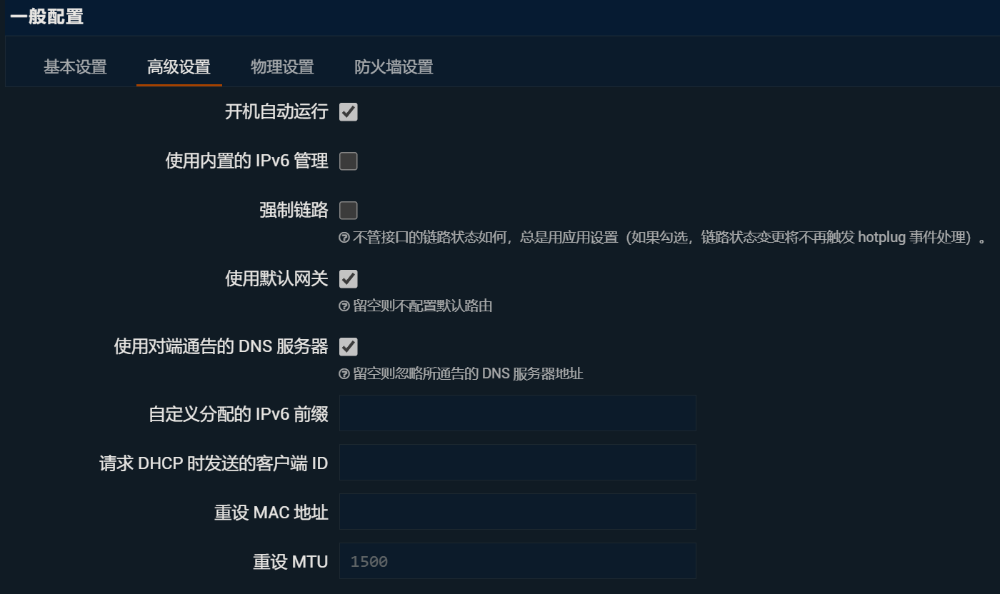
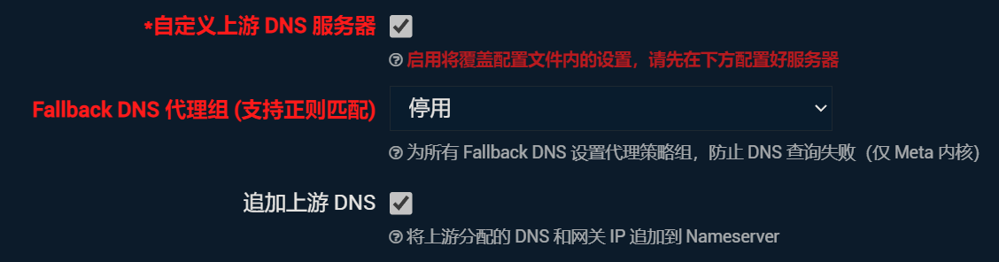

# 同时启用两个网卡时如何分流
```
Ethernet adapter K20 Pro:

   Connection-specific DNS Suffix  . :
   IPv6 Address. . . . . . . . . . . : 240e:404:b731:3135:295c:a44f:73e8:7ab8
   Temporary IPv6 Address. . . . . . : 240e:404:b731:3135:d4b7:5350:f5c7:bc25
   Link-local IPv6 Address . . . . . : fe80::687:6:df5d:ea58%28
   IPv4 Address. . . . . . . . . . . : 192.168.173.153
   Subnet Mask . . . . . . . . . . . : 255.255.255.0
   Default Gateway . . . . . . . . . : fe80::18c8:bfff:fe13:c1c2%28
                                       192.168.173.248
Ethernet adapter School Net:

   Connection-specific DNS Suffix  . : proxy.bjut.edu.cn
   IPv6 Address. . . . . . . . . . . : 2001:da8:216:210f:954a:ccee:b328:8b0f
   Temporary IPv6 Address. . . . . . : 2001:da8:216:210f:2989:37b0:8612:84fd
   Link-local IPv6 Address . . . . . : fe80::46e4:b62a:f433:24cf%13
   IPv4 Address. . . . . . . . . . . : 172.21.15.227
   Subnet Mask . . . . . . . . . . . : 255.255.255.0
   Default Gateway . . . . . . . . . : fe80::21b:53ff:fe4a:997f%13
                                       172.21.15.254
   DNS: 172.21.0.21 (Unencrypted) 172.21.201.22 (Unencrypted)
```
自己的网卡A的网关为192.168.175.219，校园网网卡B的网关为172.21.15.254

1. 输入`route print`我们能看到本机目前的路由表
2. 使用`route delete`删除所有0.0.0.0的路由,也就是默认设置，删除默认路由后无法上网。
   ```
   route delete 0.0.0.0
   route delete ::/0
   ```
3. 添加路由表，指定使用网卡B访问特定的IP。设置完后因为我们把默认路由删了，所有就只能访问该地址。
   ```
   route -p add 172.30.201.2 mask 255.255.255.0 172.21.15.254 METRIC 1
   ```
    1. -p 是为了设置为静态永久路由，防止重启时配置消失
    2. add 添加路由
    3. 1.1.1.1 指定网卡访问的IP
    4. 255.255.255.0是网关掩码
    5. 172.21.15.254指定使用网卡B的网关访问该地址
    6. METRIC 跃点数，跃点数越小优先级越高，范围1~9999，默认就是1
4. 设置默认路由，恢复上网
    1. 设置校园网卡B的默认路由，跃点数为200，指定IP走默认路由，才能上校园网
       ```
       route -p add 0.0.0.0 mask 0.0.0.0 172.21.15.254 METRIC 200
       route -p add ::/0 mask ::/0 fe80::21b:53ff:fe4a:997f METRIC 200
       ```
    2. 现在网卡B上不了非校园网，所以要设置网卡B的默认路由，跃点数为100，要比200小。因此默认使用网卡A上网，而不是网卡B。
       ```
       route -p add 0.0.0.0 mask 0.0.0.0 192.168.173.248 METRIC 100
       route -p add ::/0 mask ::/0 fe80::f435:31ff:fe10:28af METRIC 100
       ```
    3. 此时网卡A和B同时使用时优先使用网卡A。
5. 如果设置出问题了请用下面命令进行解决。
   ```
   NETSH INT IP RESET  （重置IP设置）
   NETSH WINSOCK RESET （重置网络设置）
   NETSH WINHTTP RESET PROXY  （重置代理设置）
   IPCONFIG /FLUSHDNS  （刷新DNS缓存）
   ```

# 校园网网址

| 网址               | IP                     |
| ---------------- | ---------------------- |
| lgn.bjut.edu.cn  | 172.30.201.2           |
| lgn6.bjut.edu.cn | [2001:da8:216:30c9::a] |
| my.bjut.edu.cn   | 172.21.94.12           |
# OpenWrt的配置
为了正确使用IPV6。

参考文章：[OpenWRT 路由器IPv6实战配置长篇教程](https://post.smzdm.com/p/awzodmpp/)

首先给迷你主机刷机，安装OpenWrt系统。
参考[大河李斯特视频工作室](https://space.bilibili.com/12562485/)

注意手边需要有一个显示器、有线键盘，用于进PE刷机、显操作终端界面。

可以在刷机后进OpenWrt系统后：
1. 设置root管理员密码

```sh
passwd
```
2. 修改wan、lan接口号。建议把wan、wan6设置为eth0，lan设置为eth1。

```sh
vim /etc/config/network
```
3. 设置完后reboot。lan口网线插入主PC终端或者AP路由器即可在终端访问`192.168.5.1`以远程操作OpenWrt了。

```sh
reboot
```
## 网络-接口配置
WAN口配置如下：


WAN6口配置如下：





LAN口设置如下：


LAN口页面下面的DHCP服务配置：


## 网络-DHCP/DNS配置
重点注意：由于校园网环境需要先在lgn网关进行用户登录，比如在一个172开头的内网进行，而要用的是lgn.bjut.edu.cn来访问，需要用到自动获取的校园网DNS来解析。

在`DHCP/DNS`配置页面中（服务器设置-基本设置），有一项“重绑定保护”需要取消勾选！不然无法使用内网的DNS，无法访问内网地址。


还有一项，如果要使用IPV6环境，务必把`高级设置`中的“禁止解析 IPV6 DNS 记录”取消勾选。否则无法访问IPV6网址（如lgn6.bjut.edu.cn）。
其他默认即可。


## 网络-防火墙配置
目前不确定校园网环境下使用OpenWrt时防火墙的默认配置是否有影响。

默认下是这样的：


修改后是这样的，即把基本设置的“转发”改为接受。wan口的“入站”、“转发”也改为接受。

除了基本设置以外，其他的都默认。
# AP路由器配置
在开启有线中继时，总是会出现莫名其妙的Bug。比如只有某一个电脑能正常访问lgn6.bjut.edu.cn以及lgn.bjut.edu.cn，其他电脑则只能访问lgn.bjut.edu.cn。更有一种奇葩的现象是那个能正常访问IPV6的电脑有时会无法访问lgn.bjut.edu.cn？

所以干脆就开启正常的路由器模式吧！实测在BJUT的校园网环境下，不会造成多设备识别。网关后台的在网设备只显示了一条设备记录。

路由器型号：Redmi路由器 AX6000
系统ROM版本：MiWiFi 稳定版 1.0.67
## 设置
常用设置-上网设置中：
上网设置，默认是DHCP。保持不动。

IPV6网络设置，需要打开，修改上网方式为NAT6。

其他保持不变。

正常状态下，上网信息如下显示：

至此，只要一个设备连接了此路由器，在lgn6.bjut.edu.cn进行IPV6、IPV4统一认证后，其他设备直接连接此路由器即可同样地按照统一的方式上网，并且无需再进行认证。
# OpenClash配置
通过以上的配置，达到了软路由+AP路由器可以多设备依赖AP路由器的IPV4、IPV6同时上网。
以下，来配置OpenClash，达到丝滑的代理上网效果。
## 下载内核文件
在“服务-OpenClash”中，进入OpenClash页面。
首先要下载内核。
其自带的下载不好用，网络差时，需要手动下载。
在“插件设置-版本更新”页面，依次点击3个Clash内核对应的“下载到本地”。会从Github上下载3个tar.gz压缩包到你现在的终端机。比如Windows电脑。
我们可以把它解压后，通过OpenWrt中的“系统-文件传输”依次上传到`/tmp/upload`。
上传后，在Windows终端进行ssh远程连接OpenWrt。
```sh
ssh root@192.168.5.1
```
如果弹出了私钥相关的信息，初次访问的话，打一个yes即可。
（也可以在“系统-TTYD 终端”操控OpenWrt终端）
进入终端后，把刚才上传的文件移动到3个内核分别对应的位置。


```sh
mv /tmp/upload/clash /etc/openclash/core/clash
mv /tmp/upload/clash_tun /etc/openclash/core/clash_tun
mv /tmp/upload/clash_meta /etc/openclash/core/clash_meta
```
移动完后，发现OpenClash不能识别、执行此文件，需要改变权限。
```
chmod 777 clash
chmod 777 clash_tun
chmod 777 clash_meta
```
## 配置订阅
系统-OpenClash-配置订阅
添加。配置文件名写一个好辨识的，订阅地址按实际的写。一般Clash能用的，都可以。
填完后，保存配置。
上面的自动更新，勾选，更新模式选择“循环”，间隔1440分钟。
填完后，保存配置。最后点更新配置。
## 配置上网模式
Fake-IP在某些限制比较强的网站（如ChatGPT），可能表现得更好。

点页面下面的“切换页面到Fake-IP模式”。

Meta内核相比其他内核比较活跃，并且支持更多的特性。在模式设置中，勾选“使用Meta内核”。

运行模式，选择Fake-IP（TUN）模式。（因为据说TUN访问网页的响应速度更快）

网络栈类型，下面的小字说“请自行根据运行速度为 TUN 模式选择合适的网络栈”，当前软路由主机的芯片配置还算可以，x86体系的，因此可以选择"Mixed"先试试。


模式设置改完了。先点下面的保存配置，别太快地点应用配置。
## 流量控制

取消勾选“禁用QUIC”，因为实测勾选此选项时无法访问Mac端的ChatGPT App。

WAN接口名称、LAN接口名称应正确选择，目前系统的WAN接口是eth0，LAN接口是eth1。

至于“绕过服务器地址”、“绕过大陆IP”，为了避免配置过于复杂，先不勾选。

其他的默认不动。点击保存配置。

## DNS设置
由于在校园网环境下使用，需要配置内网DNS。
在DNS设置页面中，勾选“启用第二DNS服务器”，指定服务器为172.21.201.21。（BJUT的DNS有两个，172.21.201.21和172.21.201.20）
下面的域名列表填入一行：`*.bjut.edu.cn`。
点击保存配置。

OpenClash推荐使用Dnsmasq转发，但是易用性实在难以恭维，在校园网环境下，先这样凑合用吧！
## IPV6设置
为了可以在代理上网的同时支持IPV6，需要勾选“IPv6流量代理”、“允许IPv6类型DNS解析”。
除此之外，为了支持更多网站，勾选“UDP流量转发”。
IPv6代理模式选择“Redirect模式”，具体原因忘记了。
其他默认不变，保存配置。

## 最后
别忘了点应用配置，看看启动效果、上网效果。


可以进3种控制面板选择节点。

## 再次DNS配置
不幸的是，根据测试，即使启用了第二DNS，也无法正常访问内网，比如lgn.bjut.edu.cn、my.bjut.edu.cn。而如果输入IP地址却能访问，显然还是DNS的问题。

那么只能停用“插件设置-DNS设置”中的“本地DNS劫持”了。


之后，在“覆写设置-DNS设置”中

勾选“自定义上游DNS服务器”、“追加上游DNS”。


并在下面“设置自定义上游 DNS 服务器”添加一个自定义DNS。


至此，保存配置、应用配置。
就可以访问内网了。
# 成果
可以多设备连接AP路由器愉快地网上冲浪了！
并且实测，按以上配置，可以不关闭OpenClash的情况下，直接搭配“下载CDN重定向IPV6工具包”正常使用！