# TCP编程流程
面试唯一要写代码的。

1. 服务器端：
    1. `socket()` - 创建套接字 - 所需地址：ip+port
    2. `bind()` - 指定这个套接字是哪个IP:Port
    3. `listen()` - 设置监听队列的大小
    4. `c = accept()` - 接受连接
    5. `recv()` - 接收客户端发送的数据
    6. `send()` - 给客户端发送数据
    7. `close()` - 关闭连接
2. 客户端：
    1. `socket()` - 创建套接字
    2. `connect()` - 发起连接
    3. `send()` - 如果建立连接成功，则可以发送数据
    4. `recv()` - 收服务器回复的数据
    5. `close()`

>客户端的bind：
>一般情况下客户端不需要bind，端口号是随机的。如果想要让客户端固定自己发出连接的端口号，可以主动bind。
# 字节序（大小端问题）
参考：《Linux高性能服务器编程（游双）》5.1.1 主机字节序和网络字节序 一节。

现代CPU的累加器一次都能装载（至少）4字节（这里考虑32位机，下同），那么这4字节在内存中排列的顺序将影响它被累加器装载成的整数的值。这就是字节序问题。

字节序分为大端字节序（big endian）和小端字节序（little endian）。
大端字节序是指一个整数的高位字节（23～31bit）存储在内存的低地址处，低位字节（0～7bit）存储在内存的高地址处。
小端字节序则是指整数的高位字节存储在内存的高地址处，而低位字节则存储在内存的低地址处。

**现代PC（如 x86）大多采用小端字节序**，因此小端字节序又被称为**主机字节序**。两台不同字节序的主机传递数据时，必然发生错误。

>也有系统采用大端字节序，如PowerPC、Java虚拟机。

解决问题的方法是：发送端总是把要发送的数据转化成大端字节序数据后再发送，而接收端知道对方传送过来的数据总是采用大端字节序，所以接收端可以根据自身采用的字节序决定是否对接收到的数据进行转换（小端机转换，大端机不转换）。因此大端字节序也称为网络字节序。

需要指出的是，即使是同一台机器上的两个进程（比如一个由C语言编写，另一个由JAVA编写）通信，也要考虑字节序的问题（JAVA虚拟机采用大端字节序）。

以下代码可用于检查机器的字节序。
```c
#include <stdio.h>
void byteorder()
{
    union
    {
        short value;
        char bytes[sizeof(short)];
    } test;
    test.value = 0x0102;
    if (test.bytes[1] == 1)       // 通过数组[1] 看 高地址 存放的是 高位（1）吗？
    {
        printf("little endian\n");
    }
    else if (test.bytes[1] == 2)  // 通过数组[1] 看 高地址 存放的是 低位（2）吗？
    {
        printf("big endian\n");
    }
    else
    {
        printf("unknown endianness\n");
    }
}
```
## 转换字节序API
定义于`<netinet/in.h>`

Linux提供了如下4个函数来完成主机字节序和网络字节序之间的转换：
这4个函数中，长整型函数通常用来转换IP地址（4字节），短整型函数用来转换端口号（2字节）。
当然不限于此。任何格式化的数据通过网络传输时，都应该使用这些函数来转换字节序。
```c
#include <netinet/in.h>
unsigned long int htonl(unsigned long int hostlong);
unsigned short int htons(unsigned short int hostshort);
unsigned long int ntohl(unsigned long int netlong);
unsigned short int ntohs(unsigned short int netshort);
```
它们的含义很明确，比如`htonl`表示“host to network long”，即将长整型（32bit）的主机字节序数据转化为网络字节序数据。
1. `h: host` / `n: network`
2. to: transfer to
    1. n + l: `long int` / `s: short int`
    2. h + l: `long int` / `s: short int`
# socket地址结构
常见的协议族：
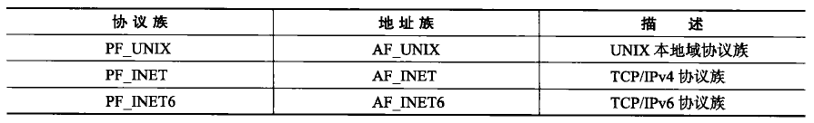
>协议族：Protocol Family，简写PF。也称domain。
>地址族：Address Family，简写AF。用于标识​**​网络地址和端口号​**​。
>AF_INET：Address Family - Internet的简写。Internet采用的协议就是TCP/IP协议族。不带后缀的默认为TCP/IPv4。在 Linux/UNIX/Windows 系统中通用
>AF_UNIX：Address Family - UNIX的简写，有的也简写为AF_LOCAL。用于本地进程间通信
>AF_PACKET：用于底层的数据链路层访问
## 通用socket地址结构
socket网络编程接口中表示**socket地址**的是结构体`sockaddr`，其定义如下：
```c++
#include<bits/socket.h>
struct sockaddr
{
    sa_family_t sa_family;	//socket address family type
    char sa_data[14];       //socket address data
}
```
`sa_family`成员是地址族类型（`sa_family_t`）的变量。**地址族**类型通常与**协议族**类型对应。
`sa_data`成员用于存放socket地址值。但是，不同的协议族的地址值具有不同的含义和长度，如下图所示。
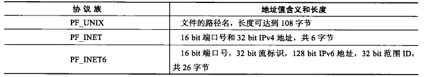
可见，14字节根本无法完全容纳多数协议族的地址值。因此，Linux定义了新的通用socket地址结构体：
>这个结构体不仅提供了足够大的空间用于存放地址值，而且是内存对齐的

```c
#include <bits/socket.h>
struct sockaddr_storage
{
    sa_family_t sa_family;
    unsigned long int __ss_align;
    char __ss_padding[128 - sizeof(__ss_align)];
}
```
## 专用socket地址结构
上面提到的两个通用socket地址结构体显然很不好用，比如设置与获取IP地址和端口号就需要执行烦琐的位操作。所以Linux为各个协议族提供了专门的socket地址结构体。
比如UNIX本地域协议族使用的socket地址结构体`sockaddr_un`：

```c
#include <sys/un.h>
struct sockaddr_un
{
    sa_family_t sin_family;// 搭配 AF_UNIX使用
    char sun_path[108];    // socket unix path 文件路径
}
```

TCP/IP的专用socket地址结构，见下文。
# TCP/IP协议族地址结构
TCP/IP协议族有`sockaddr_in`和`sockaddr_in6`两个专用socket地址结构体，分别用于IPv4和IPv6。
定义于`<netinet/in.h>`中
## IPv4：sockaddr_in
`sockaddr_in`的in表示Internet（v4）。
```c
// IPv4 socket地址族结构
struct sockaddr_in
{
    sa_family_t 	sin_family;	//地址族
    __be16			sin_port;	//端口号，__be16 表示 16位大端序，类型是 u_int16_t
    struct in_addr	sin_addr;	//IPv4 的 IP地址存放结构
};
```
注意命名的规律：
Socket地址族结构体`sockaddr_xx`成员的前缀都带`sxx_`。

`in_addr`这个结构体是单独定义的，和socket概念是独立的。用于存放 IPv4 的 IP地址。所以类型名不带”s“前缀。
```c
struct in_addr
{
    union
    {
        struct
        {
            // 4个char都是8位2进制，用于存储4个0-255。
            u_char s_b1, s_b2, s_b3, s_b4; 
        }S_un_b;		//An IPv4 address formatted as 4 u_chars, 4 * 8 bits
        
        struct
        {
            u_short s_w1, s_w2;
        }S_un_w;		//An IPv4 address formatted as 2 u_shorts, 2 * 16bits
        
        u_long S_addr;	//An IPv4 address formatted as 1 u_long, 1 * 32 bits
    }S_un;
#define s_addr S_un.S_addr	// u_long
};
```
其中`#define`给`S_un.S_addr`取了别名`s_addr`。而且用的还是联合体，等效于：
```c
struct in_addr
{
    u_int32_t s_addr;
};
```
因此外界访问IP地址只需要：`mysocketaddr.sin_addr.s_addr`。注意中间的`sin_addr`是socketIPv4地址族的成员名，要和`sin_addr`的类型名`in_addr`区分。
### 示例
```c
int main()
{
	char *echo_host = "192.168.1.20";
	int ehco_port = 7;
	struct sockaddr_in *server = (struct sockaddr_in*)malloc(sizeof(struct sockaddr_in));
	server->sin_family = AF_INET;
	server->sin_port = htons(echo_port);
	//server is a struct of 'sockaddr_in'
	//so :  sockaddr_in . sin_addr(is a 'in_addr')
			in_addr . s_addr(is a #define of 'S_un.S_addr', S_addr is a u_long)
		so, sockaddr_in.in_addr.S_un.S_addr
	//final we find the u_long variable, 4 bytes, Corresponds to the 4 bytes of ipv4.
	server->sin_addr.s_addr = inet_addr(echo_host);
}
```
## IPv6
```c
struct sockaddr_in6
{
    sa_family_t		sin6_family;	//AF_INET6
    u_inet16_t		sin6_port;		//port 网络字节序
    u_int32_t		sin6_flowinfo;	//流信息, 应设置为0
    struct in6_addr	sin6_addr;		//IPv6地址结构体
    u_int32_t		sin6_scope_id;	//scope ID,尚处于试验阶段
};
```

```c
struct in6_addr
{
    unsigned char sa_addr[16];	    //IP地址，16字节 网络字节序
};
```
# IP地址字符串转换为整数

人们习惯用点分十进制字符串表示IPv4地址，编程中我们需要把这个字符串转化为整数，才能填入地址结构体。

```c
#include<arpa/inet.h>
in_addr_t inet_addr(const char* cp); //字符串表示的IPv4地址转化为网络字节序
int inet_aton(const char* cp, struct in_addr* inp);// 与inet_addr功能相同，但是转化结果是存到了inp中 成功返回1失败返回0

char* inet_ntoa(struct in_addr in);	 //net to ASCII, IPv4地址的网络字节序转化为字符串表示
```
需要注意的是，`inet_ntoa`函数内部用一个静态变量存储转化结果，函数的返回值指向该静态内存，因此`inet_ntoa`是不可重入的。
```c
char* szValuel = inet_ntoa("1.2.3.4");
char* szValue2 = inet_ntoa("10.194.71.60");
printf("address 1: $s\n", szValue1);
printf("address 2: $s\n", szValue2);
```
运行这段代码，得到的结果是：
address1: 10.194.71.60
address2: 10.194.71.60
因此多次调用该函数后，前面的结果都会失效。

## 推荐使用更新的函数（pton、ntop）
定义于`<arpa/inet.h>`。这是随IPv6出现的新函数，但同样适用于IPv4。
```c
#include<arpa/inet.h>
int inet_pton(int af, const char* src, void* dst);
const char* inet_ntop(int af, const void* src, char* dst, socklen_t cnt);
```
`inet_pton`成功时返回1，失败则返回0并设置errno。

`inet_ntop`中的cnt参数指定目标存储单元（字符数组）的大小。下面的宏能帮助我们指定这个大小：
```c
#include <netinet/in.h>
#define INET_ADDRSTRLEN  16
#define INET6_ADDRSTRLEN 46
```
16是：4个3位数+3个点+1个`\0`

`inet_ntop`成功时返回目标存储单元的地址，失败则返回`NULL`并设置errno。
# 建立Socket连接API

```c
#include<sys/types.h>
#include<sys/socket.h>
int socket(int domain, int type, int protocol);
int bind(int sockfd, const struct sockaddr* addr, socklen_t addrlen);
int listen(int sockfd, int backlog);
int accept(int sockfd, struct sockaddr* addr, socklen_t *addrlen);
int connect(int sockfd, const struct sockaddr* serv_addr, socklen_t addrlen);
int close(int sockfd);
```
## socket()
```c
int socket(int domain, int type, int protocol);
```
1. `socket()`方法是用来创建一个套接字，有了套接字就可以通过网络进行数据的收发。创建套接字时要**指定使用的服务类型**，比如使用TCP协议选择流式服务`SOCK_STREAM`。
2. 参数含义：
    1. 第一个domain表示Socket Address Family，通常是`AF_INET`；
    2. 第二个参数表示基于的服务类型，通常有基于流式的服务(TCP)和基于数据报的服务(UDP)；
    3. 第三个参数指明你是基于什么协议。一般填0，表示默认。因为前两个参数的确定即可约束第三个参数是TCP还是UDP了。
3. Returns `file descriptor` on success, `-1` on error.
## bind() - 命名socket - 绑定地址
```c
int bind(int sockfd, const struct sockaddr* addr, socklen_t addrlen);
```
1. `bind()`方法用来指定套接字使用的IP地址和端口
    1. IP地址就是等待被连接的服务器地址。
    2. 端口是一个16位的整型值。
        1. `0-1023`为知名端口，在linux上，1024以内的端口号只有root用户可以使用。
        2. `1024-4095`为预留端口，用户不可随意使用；
        3. `4096以上`为临时端口，用户按需使用。
2. sockaddr可以看作是`sockaddr_in`的抽象类型。
3. return`0` on success, or `-1` on error.
## listen()
创建2个监听队列，一个存放未完成连接的客户，一个存放已完成连接的客户。
```c
int listen(int sockfd, int backlog);
```
1. 将文件描述符`sockfd`引用的流socket标记为被动。这个socket后面会被用来接受其他socket的主动连接。
2. 用来创建监听队列。监听队列有**两种**，**一个是存放未完成三次握手的连接**，**一种是存放已完成三次握手的连接**。
3. 第二个参数`backlog`指定系统监听连接的最大容量数目。如果连接数量超过了队列长度，服务器将不再受理新的连接，客户端会收到`ECONNREFUSED`错误消息。
    1. 在内核版本2.2之前，backlog表示所有半连接（SYN_RCVD）、完全连接（ESTABLISHED）的数量上限。
    2. 但自2.2之后，它只表示处于完全连接状态的数量上限。处于半连接状态的数量上限则由`/proc/svs/net/ipv4/tcp_max_syn_backlog`定义。
    3. backlog参数的典型值是5。
    4. 系统实际上可以监听的连接数目是超过backlog的。
4. return `0` on success, or `-1` on error.
5. 无法在一个已连接的socket（已经成功执行`connect()`的或由`accept()`调用返回的socket）再执行`listen()`。

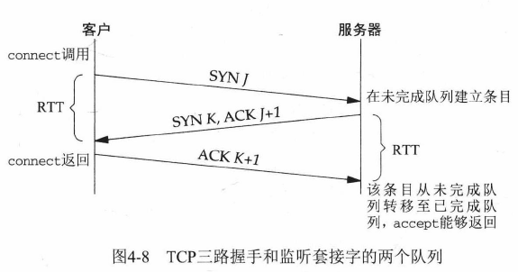
图片源于UNIX网络编程_卷1

### 具体流程
1. 当来自客户的SYN到达时，TCP在未完成连接队列中创建一个新项
2. 然后响应以三路握手的第二个分节：服务器的SYN+ACK响应。
3. 这一项一直保留在未完成连接队列中，直到三路握手的第三个分节（客户对服务器SYN的ACK）到达或者该项超时为止。
4. 如果三路握手正常完成，该项就从未完成连接队列移到已完成连接队列的队尾。
5. 当进程调用accept时，已完成连接队列中的队头项将返回给进程，
    1. 或者如果该队列为空，那么进程将被置于休眠状态，直到TCP在该队列中放入一项才唤醒它。
## accept()
```c
int accept(int sockfd, struct sockaddr* addr, socklen_t *addrlen);
```
1. `accept()`：从已完成连接队列的队头取出一个连接项。每处理一个连接，则`accept()`返回该连接对应的套接字描述符。如果该队列为空，则accept阻塞。
2. 它会创建一个新socket，并且正是这个新socket会与执行`connect()`的对等socket进行连接。
3. 由于accept是通用的API，它不知道对方是什么协议族，因此addr是抽象类型，addrlen也是不确定的，需要传指针。
4. `accept()`调用返回的函数结果是创建的socket对应的文件描述符。
5. return `file descriptor` on success, or `-1` on error.

### accept只管取出连接，不管连接状态
现在考虑如下情况：如果监听队列中处于ESTABLISHED状态的连接对应的客户端出现网络异常（比如掉线），或者提前退出，那么服务器对这个连接执行的accept调用是否成
功？
客户端连接成功后，立即断开该客户端的网络连接（类似于拔掉网线）（服务器还没反应过来客户端断网了）。结果发现accept调用能够正常返回。
在服务器上运行netstat命令以查看accept返回的连接socket的状态：发现依然是ESTABLISHED。说明，accept调用对于客户端网络断开毫不知情。

如果客户端建立连接后立即退出客户端程序（客户端发出FIN）。这次accept调用同样正常返回。
服务端netstat命令发现连接状态为`CLOSE_WAIT`。再次说明：accept只是从监听队列中取出连接，而不论连接处于何种状态，更不关心任何网络状况的变化。
## connect()
```c
int connect(int sockfd, const struct sockaddr* serv_addr, socklen_t addrlen);
```
1. connect方法将文件描述符`sockfd`引用的主动socket连接到通过addr和addrlen指定地址的监听socket上。
2. 一般由客户端程序执行，需要指定连接的服务器端的IP地址和端口。该方法执行后，会进行三次握手，建立连接。
3. return `0` on success, or `-1` on error.
# 数据收发API

## TCP
```c
ssize_t recv(int sockfd, void* buff, size_t len, int flags);
ssize_t send(int sockfd, const void* buff, size_t len, int flags);
```
recv返回接收的字节数，如果发生错误则返回 `-1`。如果发生错误，则会设置 `errno` 来指示错误。
当**流套接字**（如TCP）对等体执行了有序关闭时，返回值为 0（传统的“文件结束”返回）。
如果请求从**流套接字**接收的字节数为 0，也可能返回 0。

send如果成功，将返回已发送的字节数。如果失败，则返回 `-1`，并设置相应的 `errno`。
## UDP
```c
ssize_t recvfrom(int sockfd, void* buff, size_t len, int flags,
                 struct sockaddr* src_addr, socklen_t* addrlen);
ssize_t sendto(int sockfd, void* buff, size_t len, int flags,
               struct sockaddr* dest_addr, socklen_t addrlen);
```
recvfrom返回接收的字节数，如果发生错误则返回 `-1`。如果发生错误，则会设置 `errno` 来指示错误。

不同域（例如 UNIX 和 Internet 域）中的**数据报**套接字（如UDP）允许接收 0 长度数据报。当接收到此类数据报时，返回值为 0。

sendto如果成功，将返回已发送的字节数。如果失败，则返回 `-1`，并设置相应的 `errno`。

# Linux代码 - TCP

```c
int main()
{
/*  int socket(int domain, int type, int protocol);  */
    int sockfd = socket(AF_INET, SOCK_STREAM, 0);
    assert(sockfd != -1);
    
    struct sockaddr_in ser_addr;
    memset(&ser_addr, 0, sizeof(ser_addr));
    
    ser_addr.sin_family = AF_INET;
    ser_addr.sin_port = htons(6000);
    ser_addr.sin_addr.s_addr = inet_addr("127.0.0.1");	//inet_addr(): make string to integer
    
/*  int bind(int sockfd, const struct sockaddr* addr, socklen_t addrlen);  */
    int res = bind(sockfd, (struct sockaddr*)&ser_addr, sizeof(ser_addr));
    assert(res != -1);
    
/*  int listen(int sockfd, int backlog);  */
    res = listen(sockfd, 5);
    assert(res != -1);
    
    struct sockaddr_in cli_addr;
    while(1)
    {
/*  int accept(int sockfd, struct sockaddr* addr, socklen_t *addrlen);  */
        int len = sizeof(cli_addr);
        int conn_fd = accept(sockfd, (struct sockaddr*)&cli_addr, &len);
        if (conn_fd == -1) continue;
        
        char buff[128] = {0};
        int num = recv(conn_fd, buff, 127, 0);
        printf("buff = %s, num = %d\n", buff, num);
        
        send(conn_fd, "OK", 2, 0);
        
        close(conn_fd);
    }
}
```
# 粘包问题
TCP是流式服务，数据是以流的形式传输的，在网络层这一层面，不应该考虑粘包的问题。

而是应该在TCP传输的数据本身上做文章。

可以这样处理：发送端每send一次，接收端就recv一次，并且要回发一个ok，发送端recv，等待ok到了之后才send下一个数据。但是这样做效率太低了。

可以加标志位以区分数据的完整性。这是简单的做法。比如：7、3、2，处理之后：`[7][3][2]`

更好的做法是：在每个独立的数据前加一个头部，头部中记录数据的长度。如此便可与下一个数据做区分。

## 会引起粘包的客户端代码
```c
#include <stdio.h>
#include <sys/socket.h>
#include <netinet/in.h>
#include <arpa/inet.h>
#include <string.h>

int main()
{
    int error = 0;
    int client_sock = socket(AF_INET, SOCK_STREAM, 0);
    // 数据交互

    // 发送消息
    const char * msg1 = "hi";
    const char * msg2 = "jack";
    error = send(client_sock, msg1, strlen(msg1), 0);
    if (error < 0)
    {
        printf("send error\n");
        return -1;
    }
    error = send(client_sock, msg2, strlen(msg2), 0);
    if (error < 0)
    {
        printf("send error\n");
        return -1;
    }

    // 接收消息

}
```
## 客户端改进
为每个消息包一个包裹，前面4个字节存放消息的大小。
使用memmove实现字节移动。（实际就是把消息填入到4字节后的位置）
```c
#include <stdio.h>
#include <sys/socket.h>
#include <netinet/in.h>
#include <arpa/inet.h>
#include <string.h>

int main()
{
    int error = 0;
    int client_sock = socket(AF_INET, SOCK_STREAM, 0);

    struct sockaddr_in server_addr;
    server_addr.sin_family = AF_INET;
    server_addr.sin_port = htons(8888);
    inet_pton(AF_INET, "127.0.0.1", &(server_addr.sin_addr.s_addr));

    connect(client_sock, (struct sockaddr*)&server_addr, sizeof(server_addr));

    // 数据交互

    // 发送消息
    const char * msg1 = "hi";
    const char * msg2 = "jack";
    char data1[256] = {0};

    // 在data1的低地址（占用4个字节）填充msg的长度
    *(int*)(data1) = strlen(msg1);
    int headLen = sizeof(int);

    // 从data1的headLen后面开始，填充msg1的字符串内容
    memmove(data1 + headLen, msg1, strlen(msg1));

    error = send(client_sock, data1, headLen + strlen(msg1), 0);
    if (error < 0)
    {
        printf("send error\n");
        return -1;
    }


    char data2[256] = {0};
    *(int*)(data2) = strlen(msg2);
    memmove(data2 + headLen, msg2, strlen(msg2));
    error = send(client_sock, data2, headLen + strlen(msg2), 0);
    if (error < 0)
    {
        printf("send error\n");
        return -1;
    }

    close(client_sock);
}
```
## 服务端
主要逻辑在循环上。
要记录每次读到的长度（readLen），目前未处理的（因为数据不完整）的长度（gotLen）。
当gotLen大于等于4字节时，前4个字节是字符串长度（msgLen）。
再去看gotLen减去headLen（int的4字节），是否大于等于msgLen。如果是，则说明数据完整了，可以取出了。
去除之后，别忘记更新gotLen的值，减去这次已经处理了的headLen和msgLen。
容易遗忘的是，需要把buff中，把本次处理了的headLen、msgLen之后的数据前移覆盖。仍用memmove。
第一层循环，是读到buff，有字节就读。除非返回`-1`。
第二层循环，是看是否够4个字节，不够就退出第二层循环。
```c
#include <stdio.h>
#include <sys/socket.h>
#include <netinet/in.h>
#include <arpa/inet.h>
#include <string.h>

int main()
{
    int error = 0;
    int server_sock = socket(AF_INET, SOCK_STREAM, 0);
    struct sockaddr_in server_addr;
    server_addr.sin_family = AF_INET;
    server_addr.sin_port = htons(8888);
    inet_pton(AF_INET, "127.0.0.1", &(server_addr.sin_addr.s_addr));
    bind(server_sock, (struct sockaddr*)&server_addr, sizeof(server_addr));
    listen(server_sock, 5);

    struct sockaddr_in client_addr;
    socklen_t client_addr_len = sizeof(client_addr);
    int client_sock = accept(server_sock, (struct sockaddr*)&client_addr, &client_addr_len);
    // 数据交互

    // 接收消息
    char buff[1024] = {0};
    int headLen = sizeof(int);
    int gotLen = 0;
    int readLen = 0;
    while ((readLen = recv(client_sock, buff + gotLen, sizeof(buff) - gotLen, 0)) != -1)
    {
        gotLen += readLen;
        while (gotLen >= headLen)
        {
            int msgLen = *(int*)buff;
            if (gotLen - headLen >= msgLen)
            {
                char msgBuff[512] = {0};
                memmove(msgBuff, buff + headLen, msgLen);
                printf("msgBuff = %s\n", msgBuff);
                int dataLen = headLen + msgLen;
                memmove(buff, buff + dataLen, gotLen - dataLen);
                gotLen -= dataLen;
            }
            else
            {
                break;
            }
        }
    }
}
```
## 测试
```
mrcan@ubuntu:~/networkProgram$ ./tcpserver 
msgBuff = hi
msgBuff = jack
```
# Linux代码 - UDP
## 服务端
```c
#include <iostream>
#include <sys/socket.h>
#include <netinet/in.h>
#include <arpa/inet.h>
#include <string.h>
int main()
{
    int error = 0;
    int server_socket = socket(AF_INET, SOCK_DGRAM, 0);
    // addr
    struct sockaddr_in server_addr;
    server_addr.sin_family = AF_INET;
    server_addr.sin_port = htons(8000);
    error = inet_pton(AF_INET, "127.0.0.1", &(server_addr.sin_addr.s_addr));
    if (error == -1)
    {
        printf("inet_pton error!");
        exit(1);
    }

    error = bind(server_socket, (sockaddr*)&server_addr, sizeof(server_addr));
    if (error == -1)
    {
        printf("bind error!");
        exit(1);
    }
    struct sockaddr_in client_addr;
    socklen_t client_addr_len = sizeof(client_addr);
    while (1)
    {
        char buff[1024];
        memset(buff, 0, sizeof(buff));
        int n = recvfrom(server_socket, buff, sizeof(buff), 0, (sockaddr*)&client_addr, &client_addr_len);
        if (n == -1)
        {
            printf("recvfrom error!");
            exit(1);
        }
        printf("buff = %s\n", buff);
        n = sendto(server_socket, "ok", 2, 0, (sockaddr*)&client_addr, client_addr_len);
        if (n == -1)
        {
            printf("sendto error!");
            exit(1);
        }
    }
}
```

## 客户端
```c
#include <iostream>
#include <sys/socket.h>
#include <netinet/in.h>
#include <arpa/inet.h>
#include <string.h>
int main()
{
    int error = 0;
    int client_socket = socket(AF_INET, SOCK_DGRAM, 0);
    // addr
    struct sockaddr_in server_addr;
    server_addr.sin_family = AF_INET;
    server_addr.sin_port = htons(8000);
    error = inet_pton(AF_INET, "127.0.0.1", &(server_addr.sin_addr.s_addr));
    if (error == -1)
    {
        printf("inet_pton error!");
        exit(1);
    }

    socklen_t server_addr_len = sizeof(server_addr);
    char buff[1024];
    while (1)
    {
        memset(buff, 0, sizeof(buff));
        fgets(buff, sizeof(buff), stdin);
        if (strncmp("end", buff, 3) == 0)
        {
            break;
        }
        int n = sendto(client_socket, buff, strlen(buff) - 1, 0, (sockaddr*)&server_addr, server_addr_len);
        if (n == -1)
        {
            printf("sendto error!");
            exit(1);
        }
        memset(buff, 0, sizeof(buff));
        n = recvfrom(client_socket, buff, sizeof(buff), 0, (sockaddr*)&server_addr, &server_addr_len);
        if (n == -1)
        {
            printf("recvfrom error!");
            exit(1);
        }
        printf("buff = %s\n", buff);
    }
}
```

# Windows代码
## 要引入的库及链接器配置
Windows下的socket编程需要引入`WinSock2.h`库，还需要预处理链接`#pragma comment(lib, "Ws2_32.lib")`。
`#pragma comment(lib, "Ws2_32.lib")` 是用于指定链接器选项的预处理指令，在Windows平台的`C/C++`编程中比较常见。
- **作用**: 这条指令告诉编译器在链接阶段要链接 `Ws2_32.lib` 库，这是一个包含 Windows Sockets 2 (Winsock) 函数的库。Winsock 提供了网络编程的 API，允许程序进行网络通信，比如创建套接字、发送和接收数据等。
    - 通过 `#pragma comment(lib, "Ws2_32.lib")`，可以在代码中直接指定要链接的库，这样就不需要在编译或项目设置中手动配置链接器选项。
        - 手动配置：右键项目名，Properties，左边栏：Linker - Input，右边的Additional Dependencies，点击右边的下拉键，再点其中的`<Edit...>`，之后弹出窗口，可以把要输入的库写在输入框中。

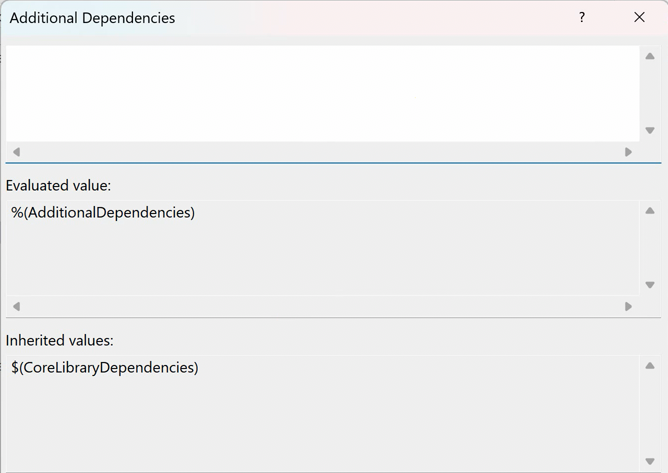
- 如果你在代码中使用了网络函数而没有链接到 `Ws2_32.lib`，编译器会报错，提示找不到相关的函数定义。
## WSAStartup
在Microsoft Learn搜索WinSock2，可以找到`winsock2.h header`的条目。
[Winsock2.h header](https://learn.microsoft.com/en-us/windows/win32/api/winsock2/)

编写Windows Socket程序之前，需要WSAStartup初始化。
[WSAStartup function (winsock2.h)](https://learn.microsoft.com/en-us/windows/win32/api/winsock2/nf-winsock2-wsastartup)

WSAStartup 函数启动进程对 Winsock DLL 的使用。（即初始化Winsock的动态链接库）
别忘了在程序结束前要WSACleanup，表示卸载 Winsock DLL。
```cpp
#include <WinSock2.h>
#include <iostream>
#include <format>
#pragma comment (lib, "Ws2_32")
int main()
{
    WORD wVersionRequested;
    WSADATA wsaData;
    int err;

    /* Use the MAKEWORD(lowbyte, highbyte) macro declared in Windef.h */
    wVersionRequested = MAKEWORD(2, 2);

    err = ::WSAStartup(wVersionRequested, &wsaData);
    if (err != 0) {
        /* Tell the user that we could not find a usable */
        /* Winsock DLL.                                  */
        std::wcout << std::format(L"WSAStartup failed with error : {}\n", err);
        return 1;
    }
    ::WSACleanup();
    return 0;
}
```
此处使用到了[Cpp_拼接字符串的几种方法（format）](../Cpp/Cpp_拼接字符串的几种方法（format）.md)中的format库的字符串输出方法。
## 创建套接字
用到的是[socket function (winsock2.h)](https://learn.microsoft.com/en-us/windows/win32/api/winsock2/nf-winsock2-socket)
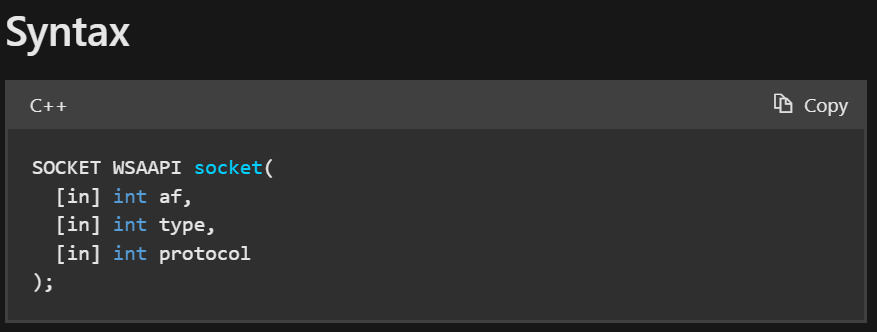
1. 第一个参数是Address Family，因此简称AF，意为地址族规范。
    1. 当前支持的值为`AF_INET`或`AF_INET6`，它们是IPv4和ipv6的Internet地址族格式。
    2. 如果安装了地址族的Windows套接字服务提供程序，则支持地址族的其他选项 (例如，与NetBIOS一起使用的`AF_NETBIOS`)。另外还有苹果的`AF_APPLETALK`，蓝牙的`AF_BTH`。
    3. 请注意，`AF_` address系列和`PF_` protocol系列常量的值是相同的 (例如，AF_INET和PF_INET)，因此可以使用任一常量。
2. 第二个参数是套接字的类型规范。
    1. 有`SOCK_STREAN`（TCP）、`SOCK_DGRAM`（UDP）、`SOCK_RAW`（原始套接字）、`SOCK_RDM`（可靠多播）、`SOCK_SEQPACKET`（伪流数据报套接字）
3. 第三个参数是协议(protocol)。协议参数的可能选项特定于指定的地址族和套接字类型。
    1. 如果指定值0，则调用者不希望指定协议，并且服务提供者将选择要使用的协议。
    2. 当af参数是AF_INET或AF_INET6并且类型是SOCK_RAW时，在IPv6或IPv4分组报头的 protocol 字段中设置为协议指定的值。
    3. 该协议字段的常见值：`IPPROTO_ICMP`、`IPPROTO_IGMP`、`BTHPROTO_RFCOMM`、`IPPROTO_TCP`、`IPPROTO_UDP`、`IPPROTO_ICMPV6`、`IPPROTO_RM`
4. 返回值：如果没有发生错误，则socket返回socket的描述符。否则，将返回`INVALID_SOCKET`，并且可以通过调用`WSAGetLastError`来检索特定的错误代码。

```cpp
#define INVALID_SOCKET  (SOCKET)(~0)  // 0取反，则是全1
```

```cpp
int main()
{
    // ...

    SOCKET listen_sock = ::socket(AF_INET, SOCK_STREAM, 0);
    
    if (listen_sock == INVALID_SOCKET)
    {
        err = ::WSAGetLastError();
        return 1;
    }
    
    // ...
}
```
## sockaddr结构
重点说一下sockaddr，这是个结构体，包含了：
1. `sin_family`
2. `sin_addr`，是sockaddr中的一个联合体，存放IP地址的整型。可以用`inet_addr("127.0.0.1")`将字符串转化为整型来填入`sin_addr.sin_addr`。
3. `sin_port`，需要用`htons`，主机地址到网络的转换。s表示short，2字节。
## bind
[bind function (winsock2.h)](https://learn.microsoft.com/en-us/windows/win32/api/winsock2/nf-winsock2-bind)
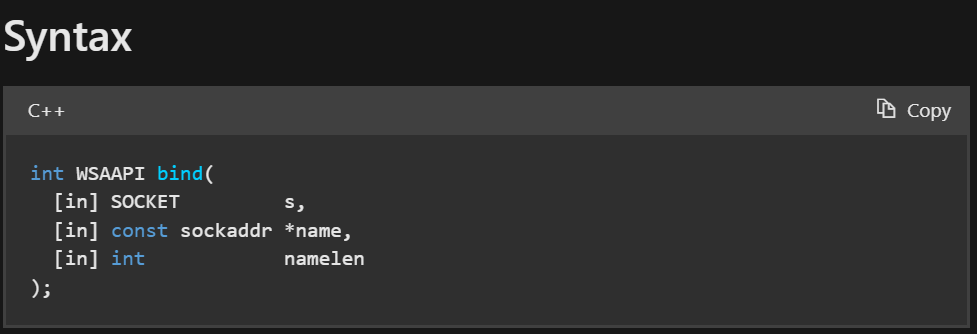
1. 参数1：socket描述符，没有绑定过的。
2. 参数2：本地地址的sockaddr结构的指针
3. 参数3：name参数所指向的值的长度 (以字节为单位)。
4. 返回：如果没有发生错误，返回零。否则，它返回`SOCKET_ERROR`，并且可以通过调用`WSAGetLastError`来检索特定的错误代码。

关于sockaddr结构：[sockaddr结构](#sockaddr结构)

编写时，发现第二个参数`name`不能直接填入`&server_addr`，而是要显式转换为`const sockaddr*`
```cpp
int main()
{
    // ...

    sockaddr_in server_addr;
    server_addr.sin_family = AF_INET;
    server_addr.sin_addr.S_un.S_addr = inet_addr("127.0.0.1");
    server_addr.sin_port = htons(9008);
    
    if (SOCKET_ERROR == ::bind(listen_sock,
            reinterpret_cast<const sockaddr*>(&server_addr),
            sizeof(server_addr)))
    {
        err = ::WSAGetLastError();
        return 1;
    }

    // ...
}
```
### 问题
报错：
```
error C4996: 'inet_addr': Use inet_pton() or InetPton() instead or define _WINSOCK_DEPRECATED_NO_WARNINGS to disable deprecated API warnings
```
VS编译器不建议使用`inet_addr`来转换`点分十进制IP地址字符串`为`网络字节序`。而是使用`<ws2tcpip.h>`库中的`inet_pton`，即字符串转为整数（p代表字符指针，n代表整数）。
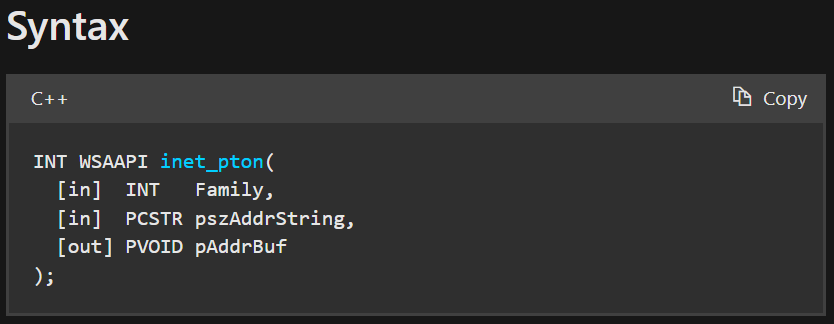
1. 参数1，地址族协议
2. 参数2，要转化的字符串
3. 参数3，要写入到哪里的地址
4. 返回值
    1. 如果没有发生错误，`InetPton`函数将返回值1，并且`pAddrBuf`参数指向的缓冲区包含按网络字节顺序排列的二进制数字IP地址。
    2. 如果参数指向的字符串不是有效的IPv4点分十进制字符串或有效的IPv6地址字符串，则InetPton函数将返回值0。
    3. 如果指向的字符串没问题，有其他错误：返回值为-1，可以通过调用`WSAGetLastError`获取扩展错误信息。

```cpp
// ...
#include <ws2tcpip.h>
int main()
{
    // ...
    
    sockaddr_in server_addr;
    server_addr.sin_family = AF_INET;
    //server_addr.sin_addr.S_un.S_addr = inet_addr("127.0.0.1");
    if (1 != ::inet_pton(AF_INET, "127.0.0.1", &server_addr.sin_addr))
    {
        return 1;
    }
    server_addr.sin_port = htons(9008);
    
    if (SOCKET_ERROR == ::bind(listen_sock,
            reinterpret_cast<const sockaddr*>(&server_addr),
            sizeof(server_addr)))
    {
        err = ::WSAGetLastError();
        return 1;
    }

    // ...
}
```
## listen
将套接字置于侦听传入连接的状态，本质上是设置了一个监听连接套接字的队列。
[listen function (winsock2.h)](https://learn.microsoft.com/en-us/windows/win32/api/winsock2/nf-winsock2-listen)

1. 参数1，已经绑定了的，但未连接的socket描述符。
2. 参数2，等待连接队列的最大长度。一般设置为`SOMAXCONN`。
3. 返回值，如果没有错误发生，返回0。否则，将返回`SOCKET_ERROR`，并且可以通过调用`WSAGetLastError`来检索特定的错误代码。

```cpp
int main()
{
    // ...
    if (SOCKET_ERROR == ::listen(listen_sock, SOMAXCONN))
    {
        err = ::WSAGetLastError();
        return 1;
    }
    // ...
}
```
## accept
从listen的监听队列中选出一个未被连接的，拿出来，产生一个worker socket（连接套接字）。如果监听队列中没有客户端连接，则阻塞，直到有人连接后返回。
在这个阶段，accept函数会把连接到服务端`listen_sock`上的client的信息填入到参数`sockaddr* client_addr`中。

[accept function (winsock2.h)](https://learn.microsoft.com/en-us/windows/win32/api/winsock2/nf-winsock2-accept)

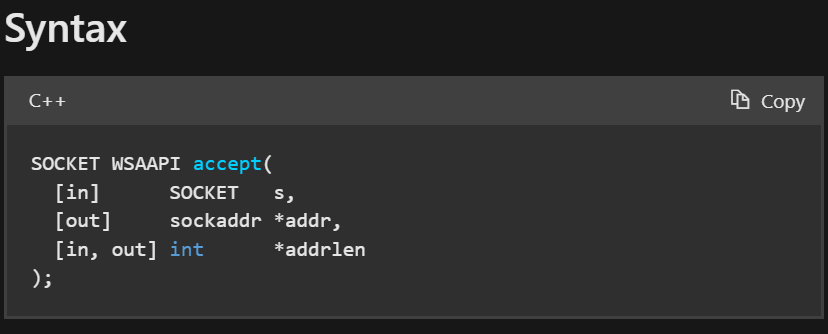
1. 参数1，已listen的套接字。但最终连接实际上是与accept返回的套接字进行的。
2. 参数2，该缓冲区要填入客户端的地址。addr参数的确切格式由从sockaddr结构创建套接字时建立的地址族确定。
3. 参数3，指向整数的指针，该整数包含addr参数所指向的结构的长度。最好让他指向一个初始化值为`sizeof(sockaddr_in)`的int值。
    1. 标志为`[in, out]`，意为是一个需要正确输入、可能会输出的项：见返回值中对addrlen的描述。
    2. addrlen引用的整数最初需要包含addr指向的空间量（即`int addrlen{ sizeof(client_addr) }`）。函数返回时，它将填入返回的地址的实际长度 (以字节为单位)。
4. 返回值，如果没有发生错误，accept将返回一个SOCKET类型的值，该值是连接套接字的描述符。这个返回值是实际连接的套接字的句柄。
    1. 否则，将返回`INVALID_SOCKET`的值，并且可以通过调用`WSAGetLastError`来检索特定的错误代码。

```cpp
// server
int main()
{
    // ...
    sockaddr_in client_addr;
    int addrlen{ sizeof(client_addr) };
    SOCKET work_sock = ::accept(
        listen_sock,
        reinterpret_cast<sockaddr*>(&client_addr),
        &addrlen);
    if (work_sock == INVALID_SOCKET)
    {
        err = ::WSAGetLastError();
        return 1;
    }
    // ...
}
```
## 调试 accept - 通过 Error Lookup 查询原因
程序已经通过`WSAGetLastError`把错误码填入到了err中。如果某个步骤出现了问题，可以看到err中的具体值。
这个值是个整数，可以在VS菜单栏-Tools-External Tools中添加`errorlook.exe`程序的快捷方式：
Title是自定义的，我们填入Error LookUp。
Command填入`C:\Program Files\Microsoft Visual Studio\2022\Community\Common7\Tools\errlook.exe`
Initial directory填入`C:\Program Files\Microsoft Visual Studio\2022\Community\Common7\Tools`
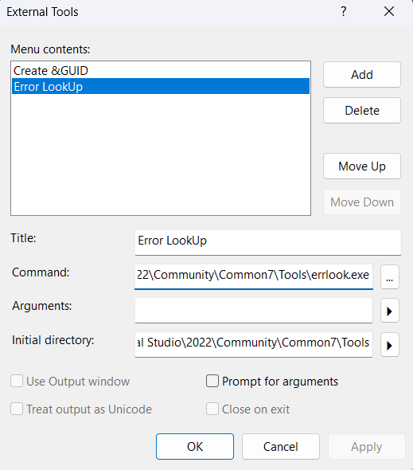
添加完毕后，Tools出来的菜单中就会显示了：
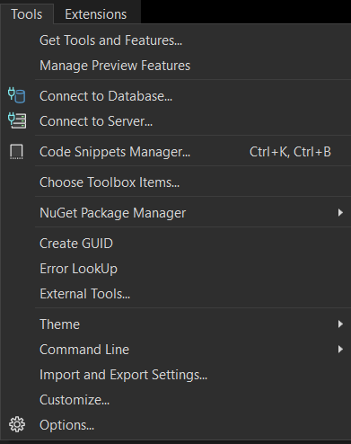

如上面的程序，`addrlen`如果初始化为0时，传给accept函数后，就会导致accept错误。（因为accept文档中给出参数说明：addrlen引用的整数最初需要包含addr指向的空间量。此时我们传入0是没有意义的，accept中的操作可能会读取addrlen的内容，导致错误）
```cpp
// server
int main()
{
    // ...
    sockaddr_in client_addr;
    int addrlen{ 0 };
    SOCKET work_sock = ::accept(
        listen_sock,
        reinterpret_cast<sockaddr*>(&client_addr),
        &addrlen);
    if (work_sock == INVALID_SOCKET)
    {
        err = ::WSAGetLastError();
        return 1;
    }
    // ...
}
```
最终err码是10014，那么在ErrorLook中查询：
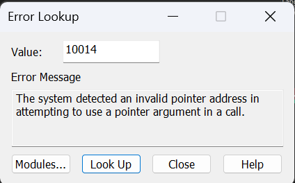
## 客户端
新建一个空项目，SocketClientStudy，新建文件`basic_stream_client.cpp`。不用设置为启动项目。

客户端程序需要WSA初始化、创建套接字。
后面直接连接connect，connect的参数和服务器端bind的参数一样：创建`sockaddr_in`并且填入相关信息（协议、IP地址、端口号）。
[connect function (winsock2.h)](https://learn.microsoft.com/en-us/windows/win32/api/winsock2/nf-winsock2-connect)
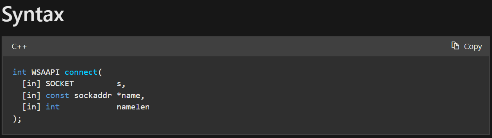
返回值：如果没有发生错误，返回0。否则返回`SOCKET_ERROR`，并且可以通过调用`WSAGetLastError`来检索特定的错误代码。
1. 阻塞套接字，返回值指示连接尝试的成功或失败。
2. 非阻塞套接字，连接尝试无法立即完成。在这种情况下，connect将返回`SOCKET_ERROR`，`WSAGetLastError`将返回`WSAEWOULDBLOCK`。

```cpp
#include <WinSock2.h>
#include <iostream>
#include <format>
#include <ws2tcpip.h>
#pragma comment (lib, "Ws2_32")
int main()
{
    WORD wVersionRequested;
    WSADATA wsaData;
    int err;

    /* Use the MAKEWORD(lowbyte, highbyte) macro declared in Windef.h */
    wVersionRequested = MAKEWORD(2, 2);

    err = ::WSAStartup(wVersionRequested, &wsaData);
    if (err != 0) {
        /* Tell the user that we could not find a usable */
        /* Winsock DLL.                                  */
        std::wcout << std::format(L"WSAStartup failed with error : {}\n", err);
        return 1;
    }

    SOCKET sock = ::socket(AF_INET, SOCK_STREAM, IPPROTO_TCP);
    if (sock == INVALID_SOCKET)
    {
        err = ::WSAGetLastError();
        return 1;
    }

    sockaddr_in server_addr;
    server_addr.sin_family = AF_INET;
    //service.sin_addr.S_un.S_addr = inet_addr("127.0.0.1");
    if (1 != ::inet_pton(AF_INET, "127.0.0.1", &server_addr.sin_addr))
    {
        err = ::WSAGetLastError();
        return 1;
    }
    server_addr.sin_port = htons(9008);
    
    if (SOCKET_ERROR == ::connect(sock, reinterpret_cast<const sockaddr*>(&server_addr), sizeof(server_addr)))
    {
        err = ::WSAGetLastError();
        return 1;
    }

    ::WSACleanup();
    return 0;
}
```
## 联调1
单独Build客户端项目：右击客户端项目名-Project Only-Build Only ...
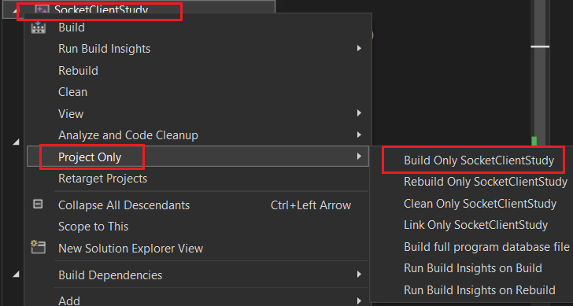
若Build成功，则可以启动Server项目了。Server项目直接点击VS全局下的调试即可（快捷键F5）。
启动Server之后，若成功地阻塞在accept，则可以单独启动客户端项目了：右击客户端项目-Debug-Start New Instance
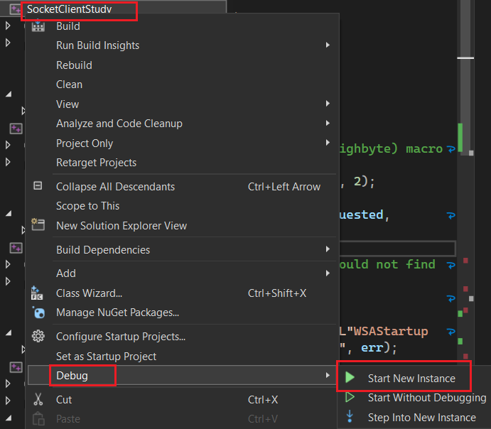
之后，可以很轻松地在此两个项目中流转、单步调试。
## 服务端-显示连接的客户端信息
想要显示连接的客户端的IP地址和端口号。
[InetNtopW function (ws2tcpip.h)](https://learn.microsoft.com/en-us/windows/win32/api/ws2tcpip/nf-ws2tcpip-inetntopw)

对于IP地址，在编写服务端的bind、客户端的connect时，声明`sockaddr_in`时，都需要使用`inet_pton`来填入`sin_addr`。这是让IP地址字符串转换为整数值填入联合体。
而我们想要从`sockaddr_in`获得字符串形式的IP地址时，需要用`inet_ntop`，注意，不能直接读取`sockaddr_in`，而是`sockaddr_in.sin_addr`。详见[sockaddr结构](#sockaddr结构)
对于端口号，对于网络程序来说，需要使用`htons`使主机字节序转为网络字节序（类似于IP地址从字符串转换为计算机程序可理解的整型值），填入`sin_port`。而对于人类的可读性来讲，需要从网络字节序转为主机字节序（类似于IP地址从整数值转换为人类可理解的字符串），需要：`ntohs`。
>`inet_pton`和`inet_ntop`都是ANSI版本的。
>`InetNtopW`是Unicode版本的。参数除了`pStringBuf`的类型为PWSTR不一样，其他一样。见[InetNtopW function (ws2tcpip.h)](https://learn.microsoft.com/en-us/windows/win32/api/ws2tcpip/nf-ws2tcpip-inetntopw)
>
>`htons`：h代表host，to意为转换，n为net，s为short（2字节）。还有`htonl`，为long int（4字节）。

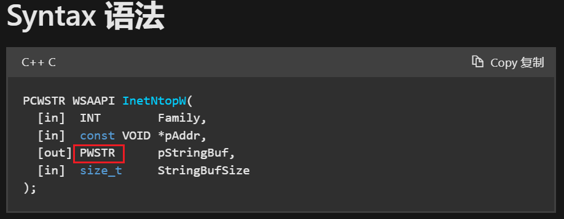

```cpp
int main()
{
    // ...
    wchar_t addr_str[46] = L"";
    InetNtopW(AF_INET, reinterpret_cast<void*>(&client_addr.sin_addr), addr_str, 46);
    std::wcout << std::format(L"client address: {}, port: {}\n", addr_str, ntohs(client_addr.sin_port));
    // ...
}
```
## 服务端-发送消息
[send function (winsock2.h)](https://learn.microsoft.com/en-us/windows/win32/api/winsock2/nf-winsock2-send)

建立好socket通道后，可以直接在此socket上send，recv。
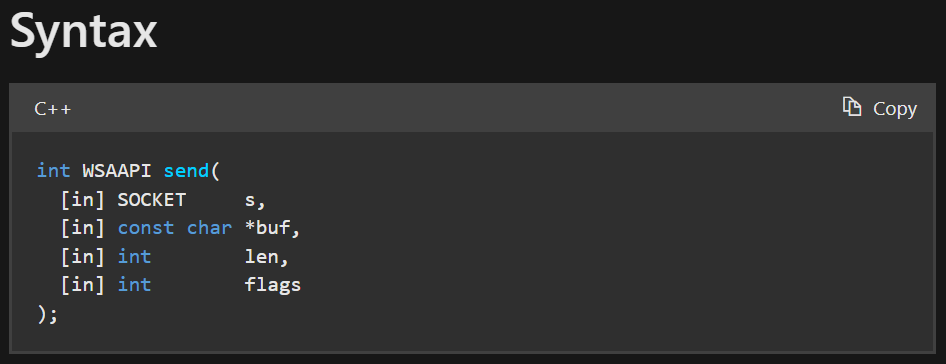
1. 参数1，已连接的socket
2. 参数2，要发送的数据的指针
3. 参数3，要发送的数据的大小（字节数）
4. 参数4，指定调用方式的标志，可以按位OR。如无特殊需要，填0即可。
5. 返回值，如果没有发生错误，将返回已发送的总字节数，该字节数可以小于len参数中请求发送的字节数。若错误，将返回`SOCKET_ERROR`，并且可以通过调用`WSAGetLastError`来检索特定的错误代码。

| Value         | Meaning                                                                                                                                                               |
| ------------- | --------------------------------------------------------------------------------------------------------------------------------------------------------------------- |
| MSG_DONTROUTE | Specifies that the data should not be subject to routing. A Windows Sockets service provider can choose to ignore this flag.<br>指定数据不应进行路由。Windows套接字服务提供程序可以选择忽略此标志。 |
| MSG_OOB       | Sends OOB data (stream-style socket such as SOCK_STREAM only).<br>发送OOB数据 (仅流式套接字，如SOCK_STREAM)                                                                       |
要注意，由于我们想要发送的是一个Unicode字符串，而参数`buf`的类型是`const char *`。
首先，不能以wstring对象的单位发送，应当发送其中的内容`message.c_str()`。
其次，`message.c_str()`返回类型为`const wchar_t *`，而TCP的send是要按字节流进行发送的，所以要显式转换指针为`const char*`，这里的`char*`和字符没有关系，而是表示按字节。
```cpp
int main()
{
    // ...
    std::wstring message{ L"Welcome to server!" };
    ::send(
        work_sock,
        reinterpret_cast<const char*>(message.c_str()),
        sizeof(wchar_t) * message.size(),
        0);
    // ...
}
```
### send的阻塞问题
如果传输系统内没有可用的缓冲区空间来保存要传输的数据，如果套接字不是非阻塞模式，send将阻塞。
在面向流的非阻塞套接字上，写入的字节数可以介于1和请求长度之间，具体取决于客户端和服务器计算机上的缓冲区可用性。
## 服务端-接收消息
[recv function (winsock2.h)](https://learn.microsoft.com/en-us/windows/win32/api/winsock2/nf-winsock2-recv)

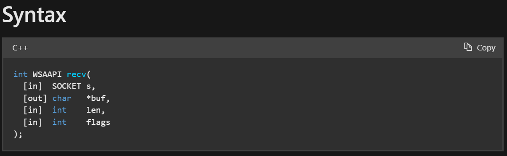
1. 参数1，已连接的socket
2. 参数2，要接收数据的buf指针
3. 参数3，buf的字节大小
4. 参数4，影响此函数行为的标志
5. 返回值，如果没有发生错误，recv返回接收到的字节数，buf参数指向的缓冲区将填入接收到的数据。
    1. 如果套接字是面向连接的，并且远程端已正常关闭连接，则recv将立即返回0，接收到0字节。
    2. 如果是异常断开，将返回`SOCKET_ERROR`的值，并且可以通过调用`WSAGetLastError`来检索特定的错误代码。
        1. 如果连接已重置，错误为`WSAECONNRESET`。

```cpp
int main()
{
    // ...
    wchar_t buf[100] = { 0 };
    int bytes_received = ::recv(work_sock, reinterpret_cast<char*>(buf), sizeof(wchar_t) * sizeof(buf), 0);
    if (bytes_received > 0)
    {
        std::wcout << buf << std::endl;
    }
    // ...
}
```
### recv的阻塞问题
如果套接字上没有可用的传入数据，则recv调用将根据为阻塞并等待数据到达。
如果套接字是非阻塞的。将返回`SOCKET_ERROR`，并将错误代码设置为`WSAEWOULDBLOCK`。
## 客户端-接收消息

```cpp
int main()
{
    // ...
    wchar_t buf[100] = { 0 };
    int bytes_received = ::recv(
        sock,
        reinterpret_cast<char*>(buf),
        sizeof(wchar_t) * sizeof(buf),
        0);
    if (bytes_received > 0)
    {
        std::wcout << buf << std::endl;
    }
    // ...
}
```

## 客户端-发送消息
可以使用`std::wcin`作为Unicode标准输入到buf。
buf中的内容会被覆盖。（但是用wcin作为输入有个缺陷，就是如果句子中间被空格断开了的话，只能填入buf空格之前的字符）
注意，buf的类型是`wchar_t buf[100]`，是C风格的wchar数组，因此在计算有效长度len时（即不包含第一个`\0`），需要使用`wcslen(buf)`。如果要计算有效长度的字节大小，还需要乘以`sizeof(wchar_t)`。
```cpp
int main()
{
    // ...
    std::wcout << L"Please input what you want to send to server: ";
    std::wcin >> buf;
    int bytes_sent = ::send(
        sock,
        reinterpret_cast<const char*>(buf),
        sizeof(wchar_t) * wcslen(buf),
        0);
    // ...
}
```
## 客户端-收尾工作
类似于指针管理，先释放资源，再把描述符置为无效。
```cpp
int main()
{
    // ...
    ::closesocket(sock);
    sock = INVALID_SOCKET;

    ::WSACleanup();
    return 0;
}
```
## 服务端-收尾工作
类似于指针管理，先释放资源，再把描述符置为无效。
```cpp
int main()
{
    // ...
    ::closesocket(work_sock);
    work_sock = INVALID_SOCKET;

    ::closesocket(listen_sock);
    listen_sock = INVALID_SOCKET;

    ::WSACleanup();
}
```
## 联调2
分别运行、调试两端程序的方法同[联调1](#联调1)。
测试结果：
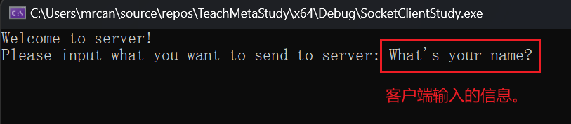

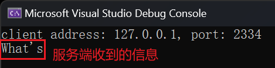
## 【可选】客户端-bind
见[客户端的bind](#客户端的bind)。
需要在connect到server之前进行客户端的bind。需要声明一个本地的`sockaddr_in`，填入自己的协议、地址、端口号。
```cpp
int main()
{
    // create socket...
    sockaddr_in local;
    local.sin_family = AF_INET;
    if (1 != inet_pton(AF_INET, "127.0.0.1", &local.sin_addr))
    {
        return 1;
    }
    local.sin_port = htons(10000);
    
    if (SOCKET_ERROR == ::bind(sock, reinterpret_cast<const sockaddr*>(&local), sizeof(local)))
    {
        err = ::WSAGetLastError();
        return 1;
    }
    
    // connect ...
    
    // ...
}
```
测试：
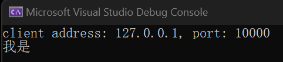
发现，客户端的端口号确实改成了我们自定义的10000。
## 服务端-循环多次accept
在accept到send、recv直到`closesocket(work_sock)`外面包一个while循环即可。
```cpp
// server
int main()
{
    // ...
    while (true)
    {
        // accept ...
        // send ...
        // recv ...
        ::closesocket(work_sock);
        work_sock = INVALID_SOCKET;
    }
    
    ::closesocket(listen_sock);
    listen_sock = INVALID_SOCKET;

    ::WSACleanup();
}
```
但要注意，如果想要在一个主机上运行多个客户端，则客户端不能自定义为固定的端口号。即不能主动bind。
经测试，可以运行2个客户端，排队连接：
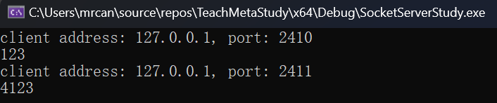
## 服务端-修改监听队列大小
如果修改服务端监听队列大小为1，会产生什么影响？
```cpp
// server
int main()
{
    // ...
    if (SOCKET_ERROR == ::listen(listen_sock, 1))
    {
        err = ::WSAGetLastError();
        return 1;
    }
    // ...
}
```
经测试，发现启动前2个客户端的connect正常：
1. 第1个客户端在第2个客户端启动之前，connect很快返回。此时第1个客户端还没输入消息，占用了连接。
2. 第2个客户端在监听队列中等待第1个客户端结束。因此connect阻塞。

但第3个客户端启动后，发现监听队列满了，因此会connect失败，立即返回`SOCKET_ERROR`。
## 服务端-循环+多线程accept
使用`jthread`+`lambda表达式`封装每一个客户端被服务端accept后，服务端的操作。注意构造完毕jthread后需要detach，否则默认会join，导致主线程等待子线程结束从而无法处理其他网络事务。
还有，由于使用到了`client_addr`和`work_sock`，需要在lambda表达式的`[]`中进行捕获。
在lambda表达式中，如果要修改某些值（此例中要修改`client_addr`和`addr_str`），默认是不允许的，如果要修改，需要修饰其为`mutable`。
```cpp
// server
int main()
{
    // WSAStartup
    // Create Socket
    // bind
    // listen
    while (true)
    {
        // accept ...
        std::jthread t([client_addr, work_sock]() mutable
            {
                wchar_t addr_str[46] = L"";
                InetNtopW(AF_INET, reinterpret_cast<void*>(&client_addr.sin_addr), addr_str, 46);
                std::wcout << std::format(L"client address: {}, port: {}\n", addr_str, ntohs(client_addr.sin_port));
                // send ...
                // recv ...
                ::closesocket(work_sock);
                work_sock = INVALID_SOCKET;
            });
        t.detach();
    }
    
    ::closesocket(listen_sock);
    listen_sock = INVALID_SOCKET;

    ::WSACleanup();
    return 0;
}
```
### 更多测试：客户端bind固定端口，开启多个客户端
客户端bind固定端口10000，开启多个客户端。
在开启第2个客户端时，bind函数会失败，立即返回`SOCKET_ERROR`。
此时关闭所有客户端。
短时间内，再重新启动一个客户端，绑定的还是10000。还是会失败，此时bind成功，但connect是失败的。bind成功是因为目前10000端口只有一个客户端占用。connect失败是因为这个端口不久前刚被使用过，还没有完全失效。这与四次握手释放的时间有关系，默认在2分钟内相同的端口号不可重用。
我们可以通过`WSAGetLastError()`获得错误码+Error Lookup查询详细的connect失败描述：
经调试，connect失败时的错误码为10048。
```cpp
// client
{
    // ...
    if (SOCKET_ERROR == ::connect(sock, reinterpret_cast<const sockaddr*>(&server_addr), sizeof(server_addr)))
    {
        err = ::WSAGetLastError();
        return 1;
    }
    // ...
}
```
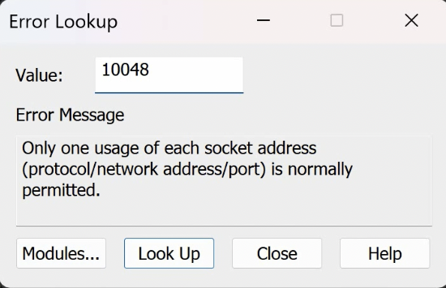
一个socket五元组地址只能用一次。
>五元组的组成：协议、网络地址、端口号。
>协议：客户端、服务端是一致的。共1个。
>网络地址：客户端、服务端各有一个。共2个。
>端口号：客户端、服务端各有一个。共2个。
>因此称为五元组。

由于客户端中刚使用过的10000端口还未完全失效，因此无法很快地重用。
## 结合协程
在VS中，同一解决方案，多个项目：一个是服务器项目，一个是客户端项目，还有现在要提到的协程项目。为了使用协程，在解决方案中引入协程项目后，还需要在使用到它的项目中（如服务器项目）添加现有项（Add Existing Item），在Header Files中添加`.hpp`、`.h`文件，在Source Files中添加`.cpp`文件。然后，在代码文件中`#include "../Coroutines/Agave.hpp"`引入相应头文件以使用库。（在VS中，项目的当前目录都是以`.vcxproj`为基准的）

用协程函数封装上面lambda表达式中做的事情。
```cpp
// server
// ...
#include "../Coroutines-STD20/Agave.hpp"
// Fore Declaration
agave::IAsyncAction worker_async(sockaddr_in client_addr, SOCKET work_sock);
int main(void)
{
    // WSAStartup
    // create socket
    // bind
    // listen
    
    while (true)
    {
        // ... accept
        worker_async(client_addr, work_sock);
    }
    ::closesocket(listen_sock);
    listen_sock = INVALID_SOCKET;
    ::WSACleanup();
    return 0;
}

agave::IAsyncAction worker_async(sockaddr_in client_addr, SOCKET work_sock)
{
    // let this function run on the child thread instead of the main thread.
    co_await agave::resume_background();
    
    wchar_t addr_str[46] = L"";
    InetNtopW(AF_INET, reinterpret_cast<void*>(&client_addr.sin_addr), addr_str, 46);
    std::wcout << std::format(L"client address: {}, port: {}\n", addr_str, ntohs(client_addr.sin_port));
    // send ...
    // recv ...
    ::closesocket(work_sock);
    work_sock = INVALID_SOCKET;
}
```
## 结合线程池
线程池的设计、代码见[线程池_bubo](../项目/线程池_bubo.md)

新建项目`StreamServer`，新建源文件`stream_server_threadpool.cpp`。文件内容先拷贝`basic_stream_server.cpp`的，之后再作调整。

该项目引入头文件（Add Existing Item）：
1. 线程池部分：`ITask.h`、`ThreadPool.h`
2. 协程部分：`Agave.hpp`、`AgaveDetails.hpp`、`B_Object.hpp`、`BJobScheduler.h`

引入源文件（Add Existing Item）：
1. 线程池部分：`ThreadPool.cpp`
2. 协程部分：`BJobScheduler.cpp`。

记得调整项目的`C++`标准为`C++20`。
### Task
新建`network_task.h`。
需要设计什么？
1. 必须实现ITask的接口`run_task`。
2. 根据`basic_stream_server.cpp`中的`worker_async(sockaddr_in client_addr, SOCKET work_sock)`接口，服务器要生成一个网络任务需要传入`client_addr`和`work_sock`（服务端`accept`后返回的sock）。因此`network_task`构造函数需要有这两个作为参数，以及需要有成员变量存储这两个。

```cpp
#include "../ThreadPool/ITask.h"
#include <WinSock2.h>
class NetworkTask : public thpool::ITask
{
public:
	NetworkTask(sockaddr_in client_addr, SOCKET work_sock);
	~NetworkTask();
	void run_task() override;
private:
	sockaddr_in				_client_addr;
	SOCKET					_work_sock;
};
```

实现：
主要实现`run_task`，代码内容是：
1. 服务端-显示连接的客户端信息
2. 服务端-发送消息、接收消息
3. 服务端-收尾工作

```cpp
// stream_server_threadpool.cpp
#include "network_task.h"
#include <iostream>
#include <WS2tcpip.h>
#include <format>

NetworkTask::NetworkTask(sockaddr_in client_addr, SOCKET work_sock) : _client_addr{ client_addr }, _work_sock{ work_sock }
{
}

NetworkTask::~NetworkTask()
{
}

void NetworkTask::run_task()
{
    wchar_t addr_str[46] = L"";
    InetNtopW(AF_INET, reinterpret_cast<void*>(&_client_addr.sin_addr), addr_str, 46);
    std::wcout << std::format(L"client address: {}, port: {}\n", addr_str, ntohs(_client_addr.sin_port));
    // send ...
    std::wstring message{ L"Welcome to server!" };
    ::send(
        _work_sock,
        reinterpret_cast<const char*>(message.c_str()),
        sizeof(wchar_t) * message.size(),
        0);
    // recv ...
    wchar_t buf[100] = { 0 };
    int bytes_received = ::recv(_work_sock, reinterpret_cast<char*>(buf), sizeof(wchar_t) * sizeof(buf), 0);
    if (bytes_received > 0)
    {
        std::wcout << buf << std::endl;
    }
    ::closesocket(_work_sock);
    _work_sock = INVALID_SOCKET;
}
```
### 调用线程池
原先`basic_stream_server.cpp`中获得`work_sock`之后，可以调整其后的行为，让其调用协程（实际是用协程函数封装了后续收发行为）。那么此处，可以更改为调用线程池。
```cpp
#include <WinSock2.h>
#include <iostream>
#include <format>
#include <ws2tcpip.h>
#include "network_task.h"                // add
#include "../ThreadPool/ThreadPool.h"    // add
#pragma comment (lib, "Ws2_32")
int main()
{
    thpool::ThreadPool threadpool{ 10 }; // add
    
    WORD wVersionRequested;
    WSADATA wsaData;
    int err;

    /* Use the MAKEWORD(lowbyte, highbyte) macro declared in Windef.h */
    wVersionRequested = MAKEWORD(2, 2);

    err = ::WSAStartup(wVersionRequested, &wsaData);
    if (err != 0) {
        /* Tell the user that we could not find a usable */
        /* Winsock DLL.                                  */
        std::wcout << std::format(L"WSAStartup failed with error : {}\n", err);
        return 1;
    }

    SOCKET listen_sock = ::socket(AF_INET, SOCK_STREAM, IPPROTO_TCP);
    if (listen_sock == INVALID_SOCKET)
    {
        err = ::WSAGetLastError();
        return 1;
    }
    sockaddr_in server_addr;
    server_addr.sin_family = AF_INET;
    //service.sin_addr.S_un.S_addr = inet_addr("127.0.0.1");
    if (1 != ::inet_pton(AF_INET, "127.0.0.1", &server_addr.sin_addr))
    {
        err = ::WSAGetLastError();
        return 1;
    }
    server_addr.sin_port = htons(9008);

    if (SOCKET_ERROR == ::bind(listen_sock,
        reinterpret_cast<const sockaddr*>(&server_addr),
        sizeof(server_addr)))
    {
        err = ::WSAGetLastError();
        return 1;
    }

    if (SOCKET_ERROR == ::listen(listen_sock, SOMAXCONN))
    {
        err = ::WSAGetLastError();
        return 1;
    }

    while (true)
    {
        sockaddr_in client_addr;
        int addrlen{ sizeof(client_addr) };
        SOCKET work_sock = ::accept(
            listen_sock,
            reinterpret_cast<sockaddr*>(&client_addr),
            &addrlen);
        if (work_sock == INVALID_SOCKET)
        {
            err = ::WSAGetLastError();
            return 1;
        }

        // adjust: 调用线程池
        threadpool.add_task(std::shared_ptr<thpool::ITask>(new NetworkTask{ client_addr, work_sock }));
    }

    ::closesocket(listen_sock);
    listen_sock = INVALID_SOCKET;

    ::WSACleanup();
    return 0;
}
```
#### 测试
运行1个服务端、3个客户端。
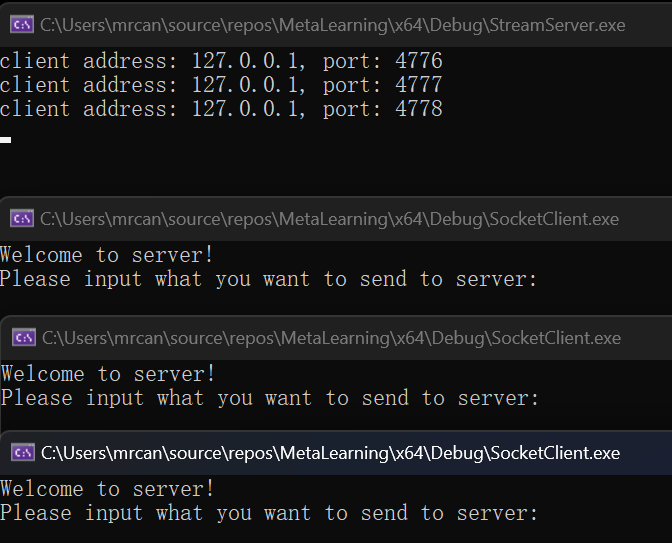
3个客户端分别输入`ThisIs1/2/3`
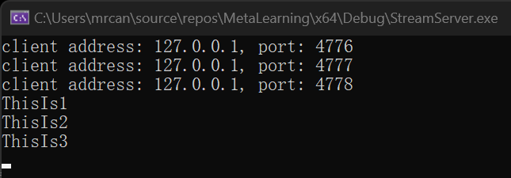
### 调用线程池同时使用协程
新建源文件`stream_server_threadpool_coroutine.cpp`，内容暂时拷贝`stream_server_threadpool.cpp`。
新建头文件`coroutine_task.hpp`。与`network_task.hpp`不同，其需要一个function。
协程和任务之间用function来作为媒介，可以把fn看作是协程函数`agave::IAsyncAction worker_async`，传入给CoroutineTask。
```cpp
#include "../ThreadPool/ITask.h"
#include <WinSock2.h>
#include <functional>
class CoroutineTask : public thpool::ITask
{
public:
	CoroutineTask(std::function<void(void)> cb) : _cb{ cb }
	{

	}
	void run_task() override
	{
		if (_cb)
		{
			_cb();
		}
	}
private:
	std::function<void(void)>		_cb;
};
```
调用线程池同时使用协程时，我们是设置协程的背景，绑定一个线程池。
即在建立线程池后给出如下的`set_bg_entry`，达到的效果是：每当协程函数调用`co_await agave::resume_background()`时，都会从背景绑定的线程池中抽取线程资源执行协程函数。
具体的：在`set_bg_entry`中填入一个lambda表达式，捕获创建好的线程池，在该线程池中添加任务`add_task`，即创建一个`CoroutineTask`，使用`fn`作为参数。
```cpp
// stream_server_threadpool_coroutine.cpp
#include <WinSock2.h>
#include <iostream>
#include <format>
#include <ws2tcpip.h>
#include "network_task.h"
#include "../ThreadPool/ThreadPool.h"
#include "../Coroutines/Agave.hpp"
#include "coroutine_task.hpp"
#pragma comment (lib, "Ws2_32")
agave::IAsyncAction worker_async(sockaddr_in client_addr, SOCKET work_sock);

int main()
{
    thpool::ThreadPool threadpool{ 10 };
    agave::set_bg_entry(
        [&threadpool](std::function<void(void)> fn)
            {
                threadpool.add_task(std::shared_ptr<thpool::ITask>(new CoroutineTask{ fn }));
            }
        );
    
    WORD wVersionRequested;
    WSADATA wsaData;
    int err;

    /* Use the MAKEWORD(lowbyte, highbyte) macro declared in Windef.h */
    wVersionRequested = MAKEWORD(2, 2);

    err = ::WSAStartup(wVersionRequested, &wsaData);
    if (err != 0) {
        /* Tell the user that we could not find a usable */
        /* Winsock DLL.                                  */
        std::wcout << std::format(L"WSAStartup failed with error : {}\n", err);
        return 1;
    }

    SOCKET listen_sock = ::socket(AF_INET, SOCK_STREAM, IPPROTO_TCP);
    if (listen_sock == INVALID_SOCKET)
    {
        err = ::WSAGetLastError();
        return 1;
    }
    sockaddr_in server_addr;
    server_addr.sin_family = AF_INET;
    //service.sin_addr.S_un.S_addr = inet_addr("127.0.0.1");
    if (1 != ::inet_pton(AF_INET, "127.0.0.1", &server_addr.sin_addr))
    {
        err = ::WSAGetLastError();
        return 1;
    }
    server_addr.sin_port = htons(9008);

    if (SOCKET_ERROR == ::bind(listen_sock,
        reinterpret_cast<const sockaddr*>(&server_addr),
        sizeof(server_addr)))
    {
        err = ::WSAGetLastError();
        return 1;
    }

    if (SOCKET_ERROR == ::listen(listen_sock, SOMAXCONN))
    {
        err = ::WSAGetLastError();
        return 1;
    }

    while (true)
    {
        sockaddr_in client_addr;
        int addrlen{ sizeof(client_addr) };
        SOCKET work_sock = ::accept(
            listen_sock,
            reinterpret_cast<sockaddr*>(&client_addr),
            &addrlen);
        if (work_sock == INVALID_SOCKET)
        {
            err = ::WSAGetLastError();
            return 1;
        }

        worker_async(client_addr, work_sock);
    }

    ::closesocket(listen_sock);
    listen_sock = INVALID_SOCKET;

    ::WSACleanup();
    return 0;
}

agave::IAsyncAction worker_async(sockaddr_in client_addr, SOCKET work_sock)
{
    // let this function run on the child thread instead of the main thread.
    co_await agave::resume_background();

    wchar_t addr_str[46] = L"";
    InetNtopW(AF_INET, reinterpret_cast<void*>(&client_addr.sin_addr), addr_str, 46);
    std::wcout << std::format(L"client address: {}, port: {}\n", addr_str, ntohs(client_addr.sin_port));
    // send ...
    std::wstring message{ L"Welcome to server!" };
    ::send(
        work_sock,
        reinterpret_cast<const char*>(message.c_str()),
        sizeof(wchar_t) * message.size(),
        0);
    // recv ...
    wchar_t buf[100] = { 0 };
    int bytes_received = ::recv(work_sock, reinterpret_cast<char*>(buf), sizeof(wchar_t) * sizeof(buf), 0);
    if (bytes_received > 0)
    {
        std::wcout << buf << std::endl;
    }
    ::closesocket(work_sock);
    work_sock = INVALID_SOCKET;
}
```
#### 测试
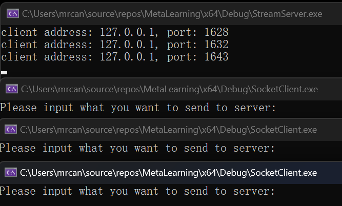
