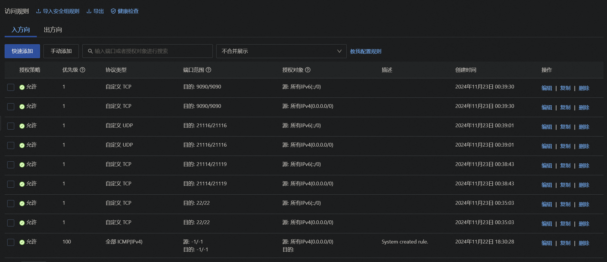
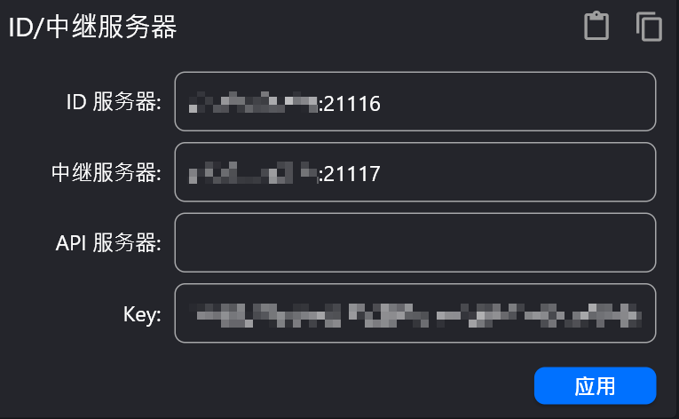

# 云服务器选购
阿里云2C2G3M（2 CPU、2G RAM、3M固定带宽（无限流量）），1年99元。选北京地区的，在国内延迟可能低一些。
# 软件选择
远程桌面软件选择RustDesk，开源的。
server端：
https://github.com/rustdesk/rustdesk-server/releases
client端：
https://github.com/rustdesk/rustdesk/releases
# RustDesk下载
根据[RustDesk官方文档](https://rustdesk.com/docs/en/self-host/rustdesk-server-oss/install/)。
服务端的文件有：两个可执行文件和一个文件夹。

- `hbbs` - RustDesk ID/Rendezvous server
- `hbbr` - RustDesk Relay server

一般，下载这个：
https://github.com/rustdesk/rustdesk-server/releases/download/1.1.12/rustdesk-server-linux-amd64.zip

使用`wget + url`命令即可下载。

# 代理

Linux服务器要下载好多开源项目或者国际软件。往往需要代理网络。

云服务器只有Linux命令行，因此需要下载mihomo项目（Clash Meta）来用命令行配置。
https://github.com/MetaCubeX/mihomo/releases
下载其中的：
https://github.com/MetaCubeX/mihomo/releases/download/v1.18.10/mihomo-linux-amd64-v1.18.10.deb
是deb格式的安装包。可以使用`apt install + 文件名`安装这种离线安装包。

安装后，可以通过`find / -name mihomo`来查找服务器上名字包含mihomo的文件在哪里。
```
/root/.config/mihomo
/etc/mihomo
/usr/share/licenses/mihomo
/usr/bin/mihomo
```

`/root/.config/mihomo/`是mihomo的配置文件目录。
有以下内容：
`config.yaml   geoip.metadb`

`/etc/mihomo/`也是mihomo的一个配置文件目录，但是貌似优先用的是root的（即当前用户的配置优于etc目录下的全局配置）

## 守护进程
安装后，需要把mihomo作为一个守护进程跑在服务器上。
参考文档：
https://wiki.metacubex.one/en/startup/service/
如下创建系统配置文件 `/etc/systemd/system/mihomo.service`
```
[Unit]
Description=mihomo Daemon, Another Clash Kernel.
After=network.target NetworkManager.service systemd-networkd.service iwd.service

[Service]
Type=simple
LimitNPROC=500
LimitNOFILE=1000000
CapabilityBoundingSet=CAP_NET_ADMIN CAP_NET_RAW CAP_NET_BIND_SERVICE CAP_SYS_TIME CAP_SYS_PTRACE CAP_DAC_READ_SEARCH CAP_DAC_OVERRIDE
AmbientCapabilities=CAP_NET_ADMIN CAP_NET_RAW CAP_NET_BIND_SERVICE CAP_SYS_TIME CAP_SYS_PTRACE CAP_DAC_READ_SEARCH CAP_DAC_OVERRIDE
Restart=always
ExecStartPre=/usr/bin/sleep 1s
ExecStart=/usr/local/bin/mihomo -d /etc/mihomo
ExecReload=/bin/kill -HUP $MAINPID

[Install]
WantedBy=multi-user.target
```

使用以下命令重新加载 systemd：
`systemctl daemon-reload`
启用Mihomo服务：
`systemctl enable mihomo`
使用以下命令立即启动 Mihomo：
`systemctl start mihomo`
使用以下命令重新加载 Mihomo：
`systemctl reload mihomo`
使用以下命令检查 Mihomo 的状态：
`systemctl status mihomo`
使用以下命令查看Mihomo的运行日志：
`journalctl -u mihomo -o cat -e`或者`journalctl -u mihomo -o cat -f`
## 配置文件
`wget + 代理服务商的clash订阅链接`下载`config.yaml`到Linux服务器上。然后把`config.yaml`拷贝到mihomo配置目录下。
如果配置目录不对劲，可以通过`mihomo -d [配置目录]`指定、自定义。
## 终端自动代理
需要配置`/etc/profile`。
在内容中加入：
```bash
export http_proxy=127.0.0.1:7890
export https_proxy=127.0.0.1:7890
export all_proxy=127.0.0.1:7890
```
## 测试连通
`curl www.google.com`，如果输出了内容，则可以了。
## UI控制
可以配置`config.yaml`中的：
```yaml
external-controller: '0.0.0.0:9090'
# RESTful API 的口令
secret: 'YourPassword'

# 您可以将静态网页资源（如 clash-dashboard）放置在一个目录中，clash 将会服务于 `RESTful API/ui`
# 参数应填写配置目录的相对路径或绝对路径。
external-ui: ./public
```
如果要绑定到公网IP，需要把默认的`127.0.0.1`改为`0.0.0.0`。
如果对外网开放，强烈建议需要secret鉴权。
我们还需要提供一个UI的web目录。
以选用yacd为例。
https://github.com/haishanh/yacd/releases
下载`yacd.tar.xz`。解压操作略。
然后我们在配置目录下创建一个public，在public里创建yacd。把内容移动到yacd下面。
然后，就可以通过`http://YourIP:9090/ui/yacd/?hostname=YourIP&port=9090&secret=YourSecret`进入UI界面了。
# Node.js安装

https://pm2.keymetrics.io/docs/usage/quick-start/

rustdesk官方建议我们使用pm2管理服务。

而pm2需要npm安装，即需要安装`Node.js`。
Node.js的安装又需要用到NVM。
根据：
https://nodejs.org/en/download/package-manager

```bash
# installs nvm (Node Version Manager)
curl -o- https://raw.githubusercontent.com/nvm-sh/nvm/v0.40.0/install.sh | bash
# download and install Node.js (you may need to restart the terminal)
nvm install 22
# verifies the right Node.js version is in the environment
node -v # should print `v22.11.0`
# verifies the right npm version is in the environment
npm -v # should print `10.9.0`
```
## sudo npm install命令无效
但是我们之后发现pm2的安装需要`sudo npm install`权限。

但提示：`sudo npm install command not found`

根据
https://stackoverflow.com/a/73308302/16887299

```bash
sudo ln -s $(which npm) /usr/local/bin/npm
sudo ln -s $(which node) /usr/local/bin/node
```
即可解决。
主要原因是按照node.js官方的安装方法，他们给我们安到了：`/root/.nvm/versions/node/v22.11.0/bin/node`、`/root/.nvm/versions/node/v22.11.0/bin/npm`。
所以sudo命令不识别。
## npm设置代理
同时发现需要给npm单独配置代理。终端的代理无效。
`npm config set proxy http://127.0.0.1:7890`
设置好后，可以通过`npm config list`查看proxy字段是否正确。

至此，就可以安装pm2了。
# pm2安装
```bash
sudo npm install pm2@latest -g
```
安装完成后，则可以按照rustdesk文档中用pm2来启动服务。
```bash
pm2 start hbbs
pm2 start hbbr
```
可以通过`pm2 list`来查看当前pm2管理的服务。
如果想让`hbbs` / `hbbr`在重启后自动运行，最好再执行一下`pm2 startup`和`pm2 save`。（详细查阅pm2文档）

至此，rustdesk服务就运行在服务器上了。
# rustdesk的key
服务一运行，会自动生成一对加密的私钥和公钥（分别位于运行目录下的`id_ed25519`和`id_ed25519.pub`文件中），其主要用途是通信加密。

这个`id_ed25519.pub`文件的内容需要填写到客户端的key中。

如果要更改密钥，请删除`id_ed25519`和`id_ed25519.pub`文件并重新启动`hbbs` / `hbbr` ， `hbbs`将生成新的密钥对。
# 云服务器防火墙配置
根据文档，默认情况下， hbbs监听 21114（TCP，用于 Web 控制台，仅在 Pro 版本中可用）、21115 (TCP)、21116 (TCP/UDP) 和 21118 (TCP)， hbbr监听 21117 (TCP) 和 21119 (TCP) 。请务必在防火墙中打开这些端口。请注意，应为 TCP 和 UDP 启用 21116。 21115用于NAT类型测试，21116/UDP用于ID注册和心跳服务，21116/TCP用于TCP打洞和连接服务，21117用于Relay服务，21118和21119用于支持网络客户端。如果不需要Web客户端（21118、21119）支持，可以禁用相应端口。

设置成如下的即可：


22是为了ssh协议（远程shell）。
## 坑：不要贸然开放所有端口
不要贸然开放所有端口，经过测试，服务器会莫名遭到DDoS攻击，导致CPU、带宽高占用，服务器连接数峰值达到10K，对于2C2G3M的服务器来说，肯定禁不住。导致ssh经常断联、无响应；远程桌面也很卡顿。
还好分析了一眼阿里云后台的监控数据，不然我以为是网络带宽太小的问题。其实就是端口全开放导致攻击漏洞太大的问题。（也算是亲自体验过DDoS攻击了，这才知道了防火墙的作用有多么重要，自此不再是累赘）
# rustdesk客户端配置
设置-网络中。


ID服务器IP+21116端口，中继服务器IP+21117端口。

启动服务，若主页下面图标显示就绪，即可以使用。