# 产品
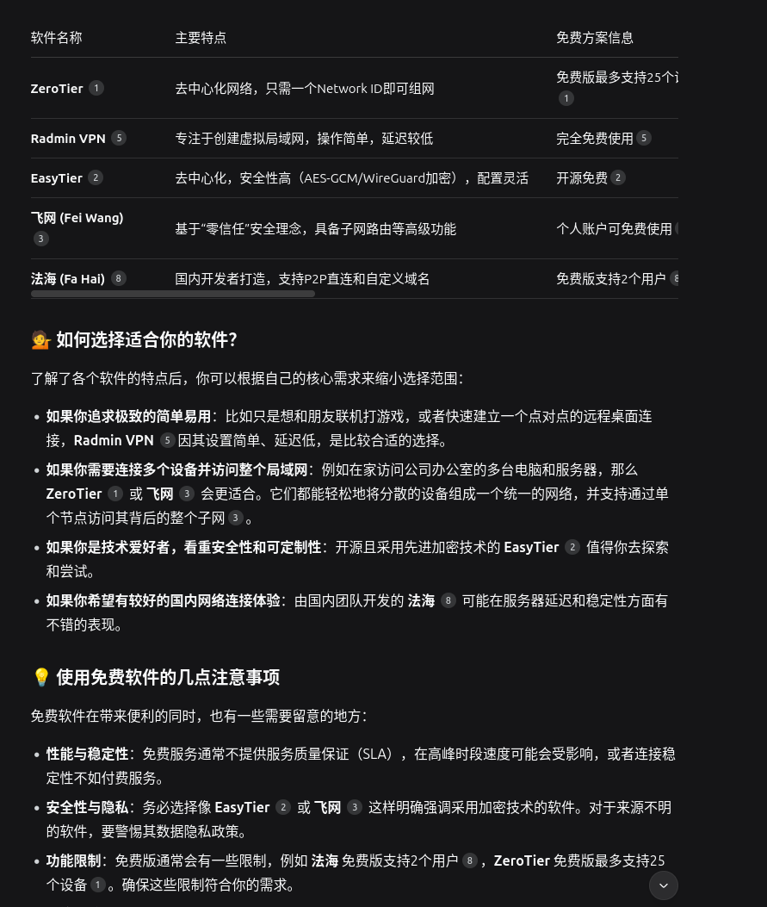

Happyn：基于 N2N 的安全、易于使用的虚拟专用网络（VPN）解决方案。客户端已开源。

# 方案及安全性分析

## 方案 1｜Teleport（自建，合规最强）— 推荐

**适用**：团队多人、要审计/审批、要零暴露。  
**优点**：

- 节点与 A 服务器只**出站**到 Teleport Proxy；外部无法直连。
- 登录用 **临时 SSH 证书**（几分钟/几小时自动过期），支持 **SSO/MFA**。
- **会话审计**（命令、TTY、录屏）、**按角色/标签授权**、**Just-in-Time** 申请。  
    **注意**：自建 1～2 台 Proxy+Auth 做 HA；落地需要接公司 SSO/日志。

**10 分钟 PoC 路线**
1. 起一台公开 Proxy（可云上），安装 teleport（开箱全免费功能够用）。
2. 在 A 上装 teleport agent，用一次性 token **出站注册**到 Proxy。
3. 你本机 `tsh login`（走 SSO/MFA）→ `tsh ssh A` 直连；在 Web 控制台能看到会话记录。

## 方案 2｜Headscale/Netmaker（WireGuard 专网）+ OpenSSH 证书（全自建、轻量）

**适用**：不引入 SaaS，又想快速可控；审计要求适中。  
**做法**：
- 用 **Headscale/Netmaker** 给所有人机/服务器一个私网（不暴露公网端口）。
- 服务端 **OpenSSH 信任公司 SSH CA**（`TrustedUserCAKeys`），给运维颁发**短期用户证书**（建议用 Smallstep `step-ca` 自动签发/轮换）。  
    **优点**：简单、性能好、完全私有化。  
    **不足**：审计/审批需要自建（集中化命令审计可用 `tlog/auditd` + 日志平台）。
## 方案 3｜托管最快（允许第三方时）
- **Cloudflare Access for SSH**：A 只跑 `cloudflared` 出站连边缘；基于 SSO/MFA 的短期证书，**审计完善**，上线最快。
- **Tailscale SSH**：身份化 ACL、NAT 穿透强；但依赖 Tailscale 控制面（若要自建则改用方案 2 + OpenSSH 证书）。

## 选型快速判断
- **强审计/审批、合规优先、零暴露** → **Teleport（自建）**。
- **全自建、轻量可控** → **Headscale/Netmaker + OpenSSH 证书**。
- **要立刻上线且允许第三方** → **Cloudflare Access** 或 **Tailscale SSH**。

## 不管选谁，都请做这些“底线配置”

- 禁用密码登录：`PasswordAuthentication no`；必要时 `PermitRootLogin no`。
- 只监听专网接口（wg0/tailscale0/lo），**公网网卡防火墙封死 22**。
- 用**短期凭证**（Teleport/SSH 证书），配**定期轮换与一键吊销**。
- 开启**命令审计**与集中日志；关键操作走 **MFA + 审批**。
- 分环境隔离（prod/stage/dev 用不同 CA/网段/策略）。
# 物理防火墙
https://e.huawei.com/cn/products/security
HiSecEngine USG12000 系列 AI 防火墙

HiSecEngine USG12000 系列防火墙（以下简称 USG12000 系列）是华为公司推出的首款T级AI防火墙，在网络边界实时防护已知与未知威胁，通常部署在云计算数据中心，大型企业及园区网出口，为数据中心、企业及园区网络提供领先的安全防护能力。USG12000系列采用先进的硬件架构设计，应用多种绿色节能创新技术，大幅降低设备能源消耗。提供全类型接口板，单槽位接口密度最高可达18x100GE，满足大流量需求。广泛应用于政府，金融，安平，教育，医疗，企业等行业。

提供高达T级的业务处理性能，集成NAT、CGN、VPN、虚拟化以及内容安全等多种安全特性，应对新时代大流量、多业务威胁防御场景。

具备完善的运营商级高可靠性架构和方案，支持双主控、双机热备、NSR、GR等多种可靠性机制。采用基于硬件的软件完整性校验，避免非法软件运行，打造安全基石。用户可以根据不同的网络需求进行灵活的选择。
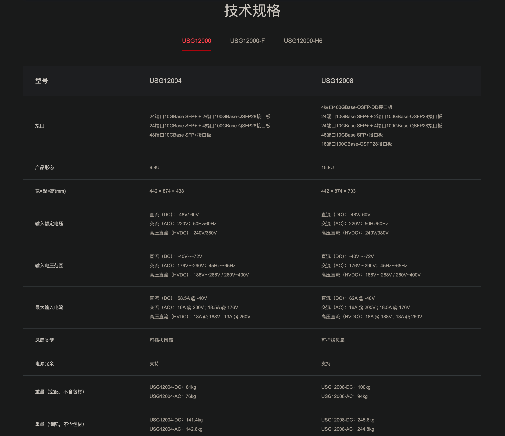
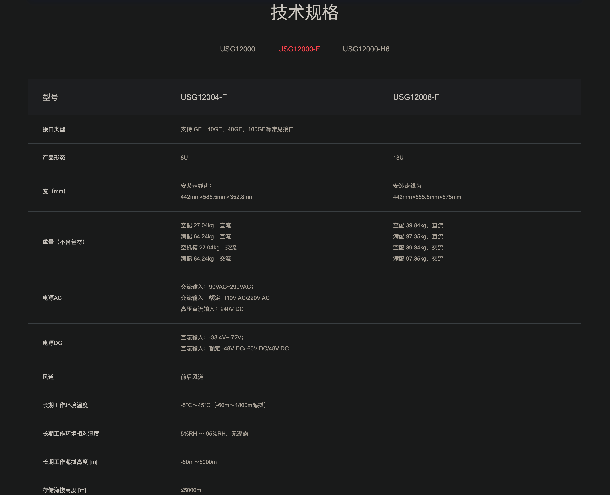

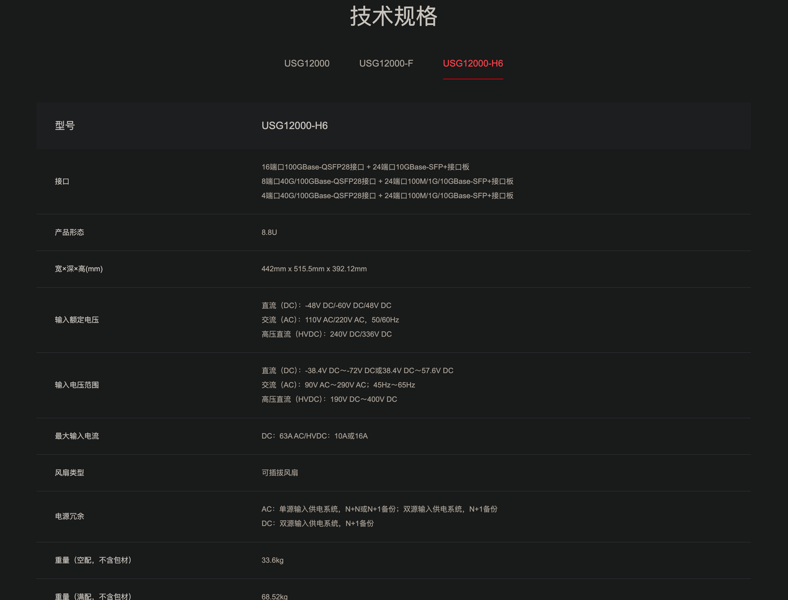

华为 HiSecEngine USG6700F 系列 AI 防火墙

是华为面向下一代数据中心推出的高性能万兆AI防火墙，通过全新软硬件架构，打造具备智能防御、卓越性能、极简运维三大关键能力的新一代AI防火墙，有效应对挑战。USG6700F系列使用智能技术赋能边界防御，精准阻断已知和未知威胁；内置多个安全专用加速引擎有效提升IPv4/IPv6转发、内容安全检测、IPSec等关键业务处理性能；通过安全运维平台实现防火墙、入侵防御、抗DDoS等多类安全产品的统一管理和运维，降低安全运维OPEX。

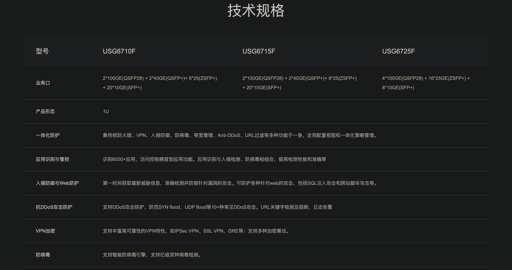
HiSecEngine USG6600F 系列 AI 防火墙

华为 HiSecEngine USG6600F 系列是华为面向下一代数据中心推出的万兆AI防火墙，HiSecEngine USG6600F系列基于最新软硬件平台，提供IPv4/IPv6共栈能力，业务性能大幅提升；使用智能技术有效检测高级威胁，增强边界防护能力。支持联动华为乾坤安全云服务，提供边界防护与响应服务，端云联动，立体防御。广泛适用于金融、政府、大企业等行业。

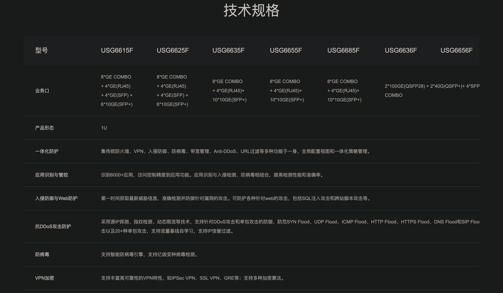

HiSecEngine USG6500F 系列 AI 防火墙

HiSecEngine USG6500F 系列 AI 防火墙是华为面向小型企业、行业分支、连锁商业机构设计开发的新一代AI防火墙，在提供NGFW能力的基础上，联动其他安全设备，增强边界检测能力，有效防御高级威胁。产品提供模式匹配以及加解密业务处理加速能力，使得防火墙处理内容安全检测、IPSec等业务的性能显著提升。支持联动华为乾坤安全云服务，提供边界防护与响应、漏洞扫描、日志审计等服务，端云联动，立体防御，广泛适用于教育、医疗、零售等行业。
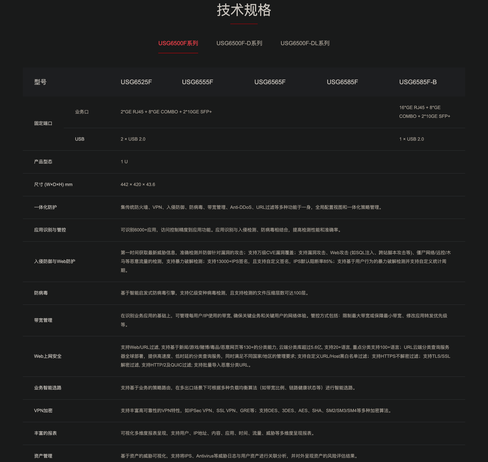

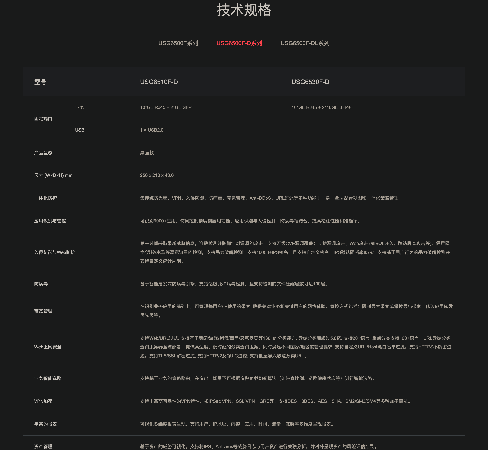

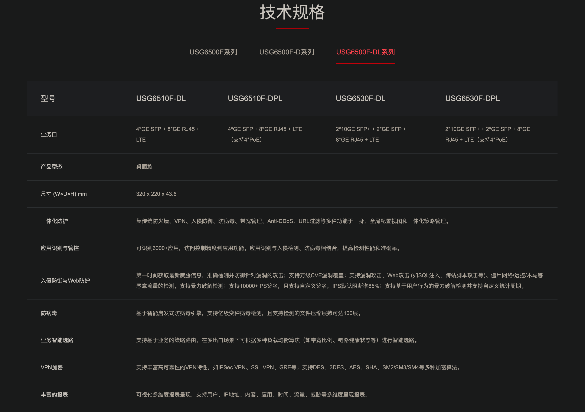

华为 HiSecEngine USG6000F-E 系列防火墙

HiSecEngine USG6000F-E系列防火墙是华为面向中小型企业和多分支机构推出的高性能防火墙，适用于各类场景和网络安全建设需求。通过全新软硬件平台来实现功能全面、高性能、低时延的智能防火墙。

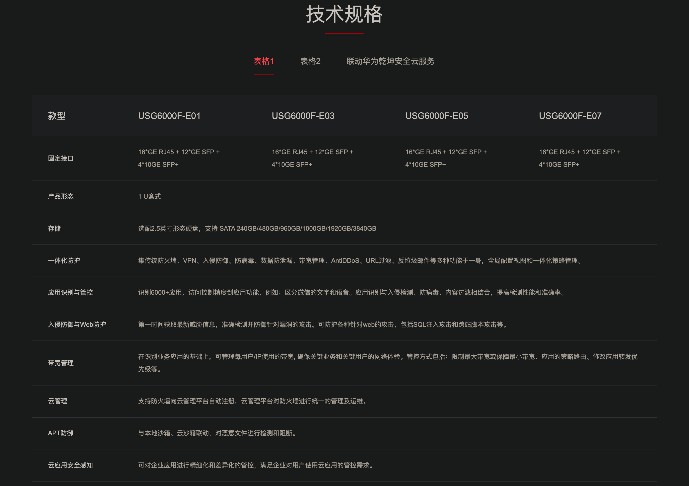

华为 HiSecEngine USG6700E 系列 AI 防火墙

华为HiSecEngine USG6700E系列AI防火墙（盒式）是面向下一代数据中心和和大型企业园区网推出的万兆AI防火墙，在提供NGFW能力的基础上，联动其他安全设备，主动防御网络威胁，增强边界检测能力，有效防御高级威胁，同时解决性能下降问题。NP引擎提供快速转发能力，防火墙性能显著提升。广泛适用于金融、政府、大企业等行业。

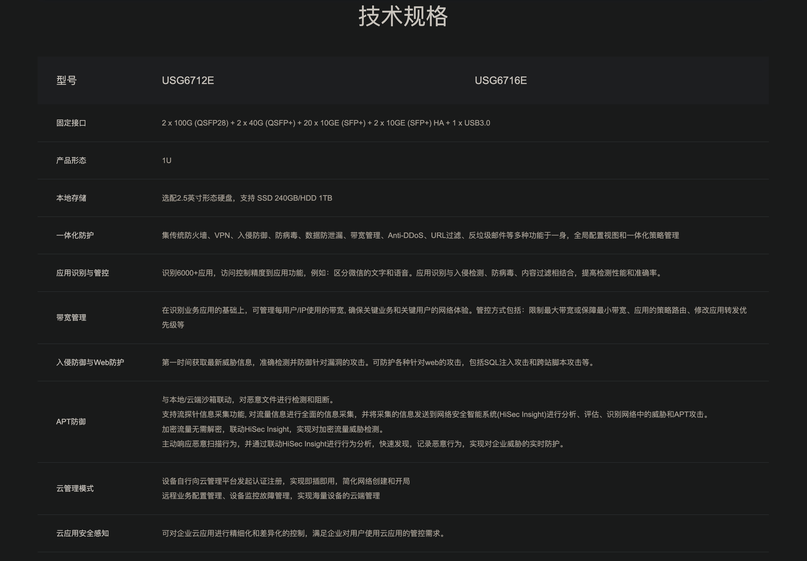

HiSecEngine USG6600E 系列 AI 防火墙

华为 HiSecEngine USG6600E 系列 AI 防火墙是面向下一代数据中心推出的万兆AI防火墙，在提供NGFW能力的基础上，联动其他安全设备，主动防御网络威胁，增强边界检测能力，有效防御高级威胁，同时解决性能下降问题。NP提供快速转发能力，防火墙性能显著提升。广泛适用于金融、政府、大企业等行业。

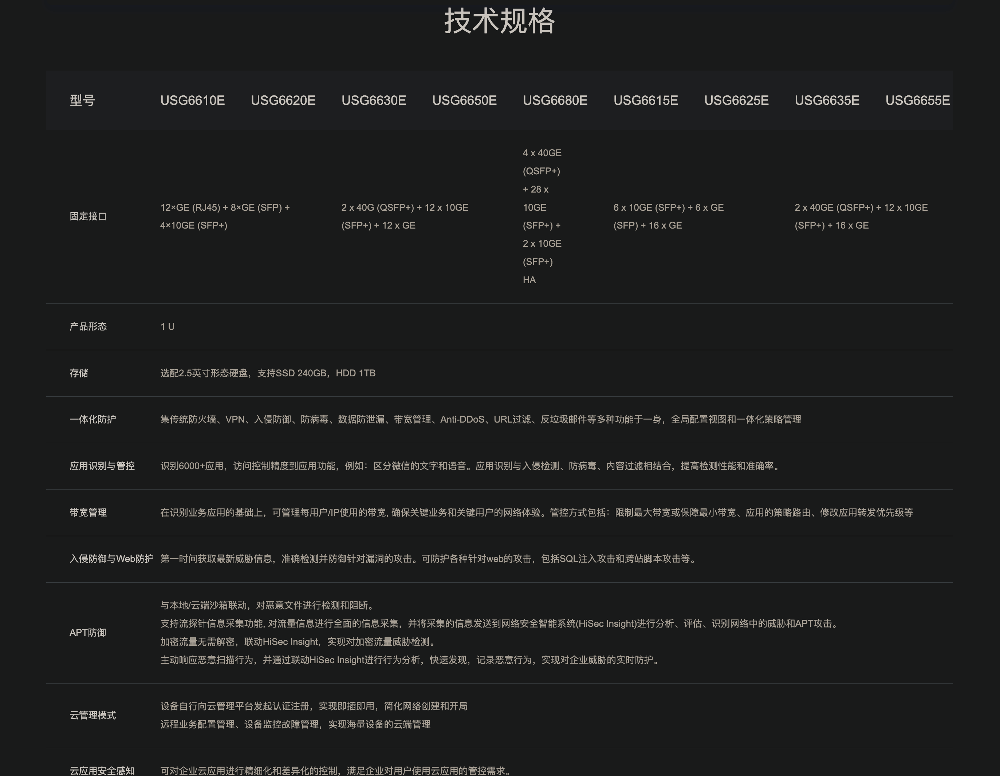

HiSecEngine USG6500E 系列 AI 防火墙

华为 HiSecEngine USG6500E 系列 AI 防火墙是面向中小企业和连锁机构推出的企业级AI防火墙，在提供NGFW能力的基础上，联动其他安全设备，主动积极防御网络威胁，增强边界检测能力，有效防御高级威胁，同时解决性能下降问题。产品提供模式匹配以及加解密业务处理加速能力，使得防火墙处理内容安全检测、IPSec等业务的性能显著提升。支持联动华为乾坤安全云服务，提供边界防护与响应、漏洞扫描、日志审计等服务，端云联动，立体防御。广泛适用于教育、医疗、零售等行业。

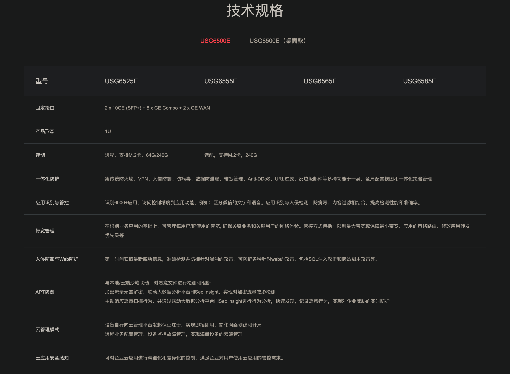

桌面款
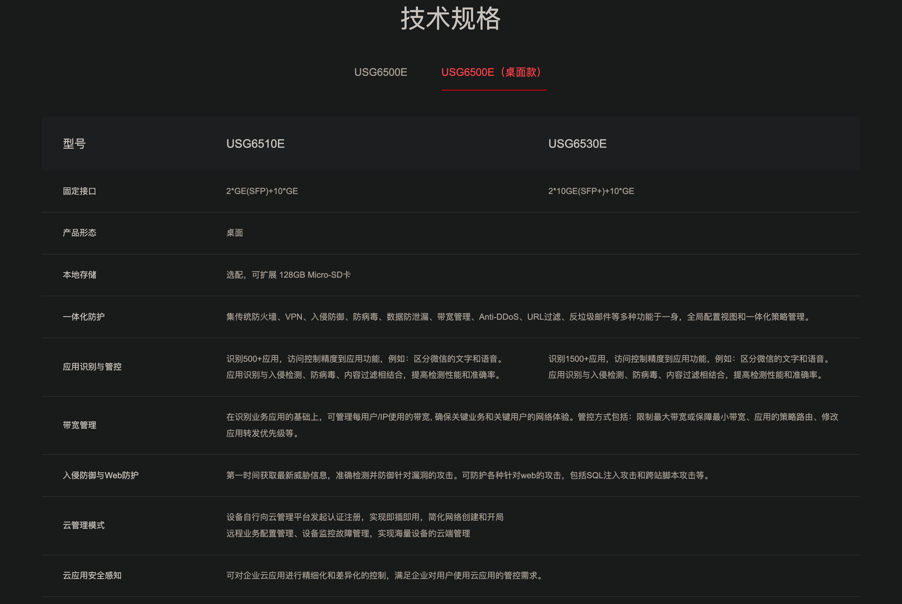

