# 产品
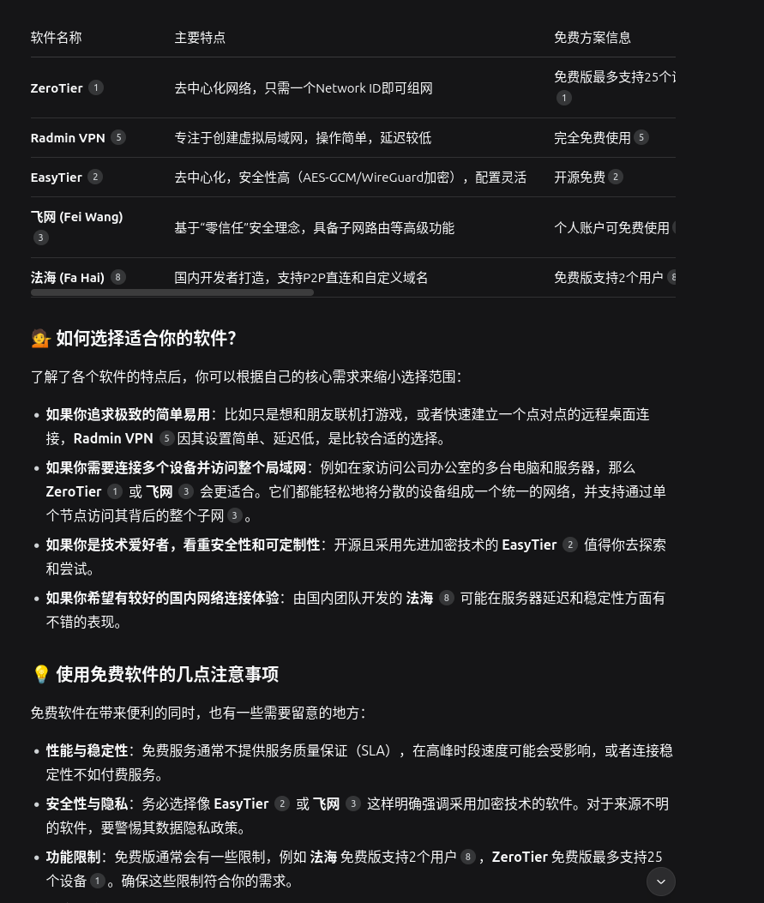

Happyn：基于 N2N 的安全、易于使用的虚拟专用网络（VPN）解决方案。客户端已开源。

# 方案及安全性分析

## 方案 1｜Teleport（自建，合规最强）— 推荐

**适用**：团队多人、要审计/审批、要零暴露。  
**优点**：

- 节点与 A 服务器只**出站**到 Teleport Proxy；外部无法直连。
- 登录用 **临时 SSH 证书**（几分钟/几小时自动过期），支持 **SSO/MFA**。
- **会话审计**（命令、TTY、录屏）、**按角色/标签授权**、**Just-in-Time** 申请。  
    **注意**：自建 1～2 台 Proxy+Auth 做 HA；落地需要接公司 SSO/日志。

**10 分钟 PoC 路线**
1. 起一台公开 Proxy（可云上），安装 teleport（开箱全免费功能够用）。
2. 在 A 上装 teleport agent，用一次性 token **出站注册**到 Proxy。
3. 你本机 `tsh login`（走 SSO/MFA）→ `tsh ssh A` 直连；在 Web 控制台能看到会话记录。

## 方案 2｜Headscale/Netmaker（WireGuard 专网）+ OpenSSH 证书（全自建、轻量）

**适用**：不引入 SaaS，又想快速可控；审计要求适中。  
**做法**：
- 用 **Headscale/Netmaker** 给所有人机/服务器一个私网（不暴露公网端口）。
- 服务端 **OpenSSH 信任公司 SSH CA**（`TrustedUserCAKeys`），给运维颁发**短期用户证书**（建议用 Smallstep `step-ca` 自动签发/轮换）。  
    **优点**：简单、性能好、完全私有化。  
    **不足**：审计/审批需要自建（集中化命令审计可用 `tlog/auditd` + 日志平台）。
## 方案 3｜托管最快（允许第三方时）
- **Cloudflare Access for SSH**：A 只跑 `cloudflared` 出站连边缘；基于 SSO/MFA 的短期证书，**审计完善**，上线最快。
- **Tailscale SSH**：身份化 ACL、NAT 穿透强；但依赖 Tailscale 控制面（若要自建则改用方案 2 + OpenSSH 证书）。

## 选型快速判断
- **强审计/审批、合规优先、零暴露** → **Teleport（自建）**。
- **全自建、轻量可控** → **Headscale/Netmaker + OpenSSH 证书**。
- **要立刻上线且允许第三方** → **Cloudflare Access** 或 **Tailscale SSH**。

## 不管选谁，都请做这些“底线配置”

- 禁用密码登录：`PasswordAuthentication no`；必要时 `PermitRootLogin no`。
- 只监听专网接口（wg0/tailscale0/lo），**公网网卡防火墙封死 22**。
- 用**短期凭证**（Teleport/SSH 证书），配**定期轮换与一键吊销**。
- 开启**命令审计**与集中日志；关键操作走 **MFA + 审批**。
- 分环境隔离（prod/stage/dev 用不同 CA/网段/策略）。
# 物理防火墙
https://e.huawei.com/cn/products/security
HiSecEngine USG12000 系列 AI 防火墙

HiSecEngine USG12000 系列防火墙（以下简称 USG12000 系列）是华为公司推出的首款T级AI防火墙，在网络边界实时防护已知与未知威胁，通常部署在云计算数据中心，大型企业及园区网出口，为数据中心、企业及园区网络提供领先的安全防护能力。USG12000系列采用先进的硬件架构设计，应用多种绿色节能创新技术，大幅降低设备能源消耗。提供全类型接口板，单槽位接口密度最高可达18x100GE，满足大流量需求。广泛应用于政府，金融，安平，教育，医疗，企业等行业。

提供高达T级的业务处理性能，集成NAT、CGN、VPN、虚拟化以及内容安全等多种安全特性，应对新时代大流量、多业务威胁防御场景。

具备完善的运营商级高可靠性架构和方案，支持双主控、双机热备、NSR、GR等多种可靠性机制。采用基于硬件的软件完整性校验，避免非法软件运行，打造安全基石。用户可以根据不同的网络需求进行灵活的选择。
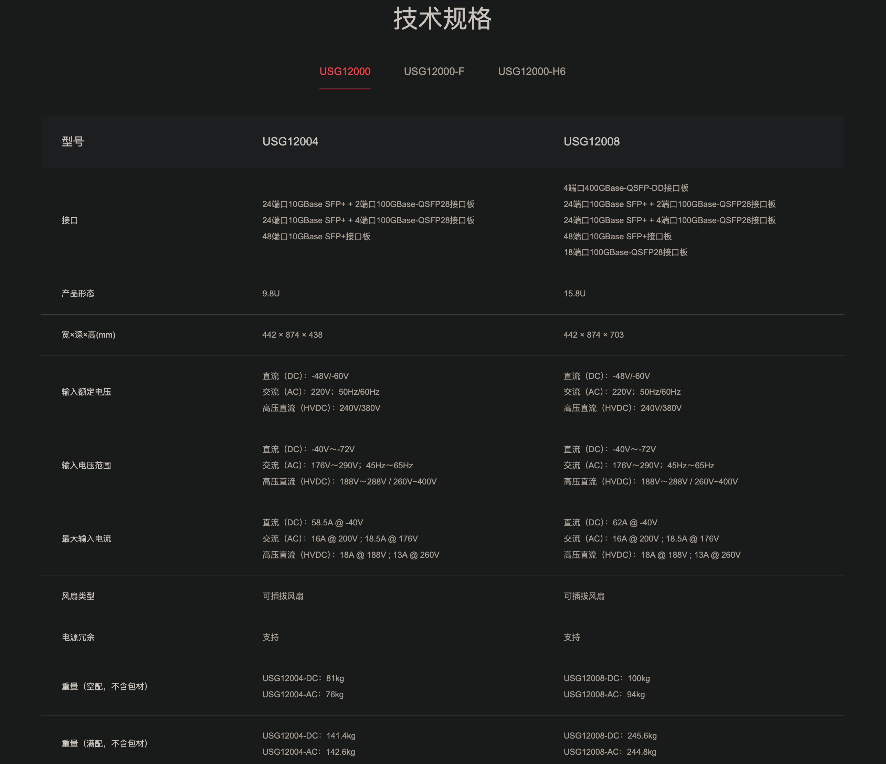
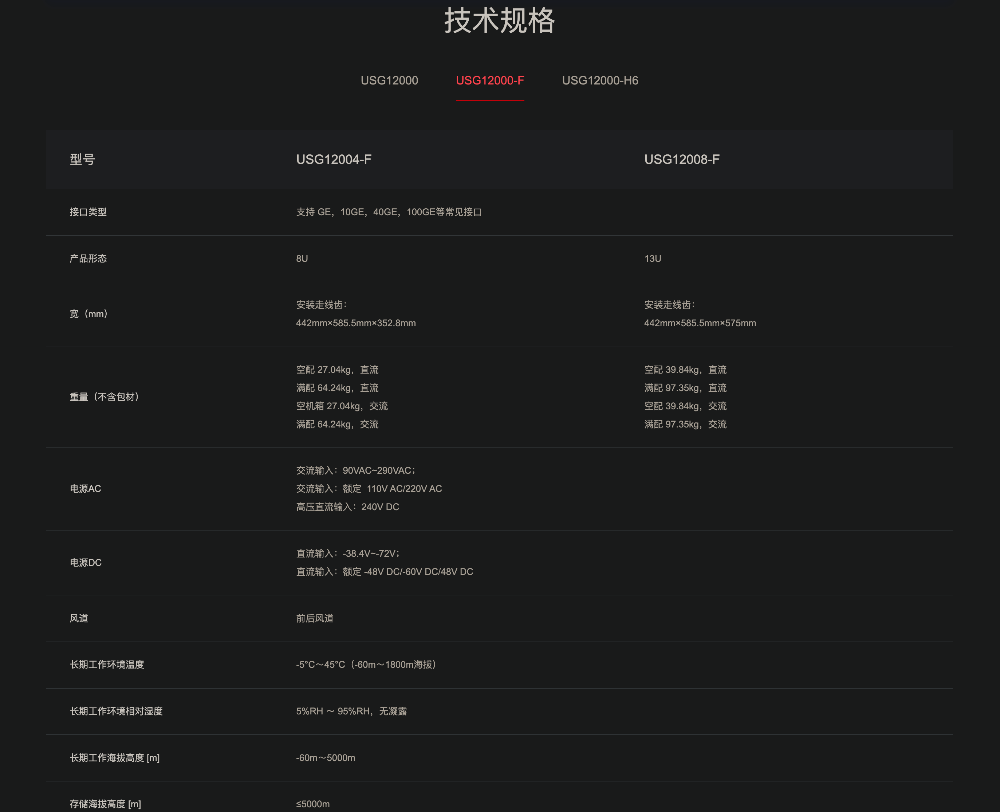

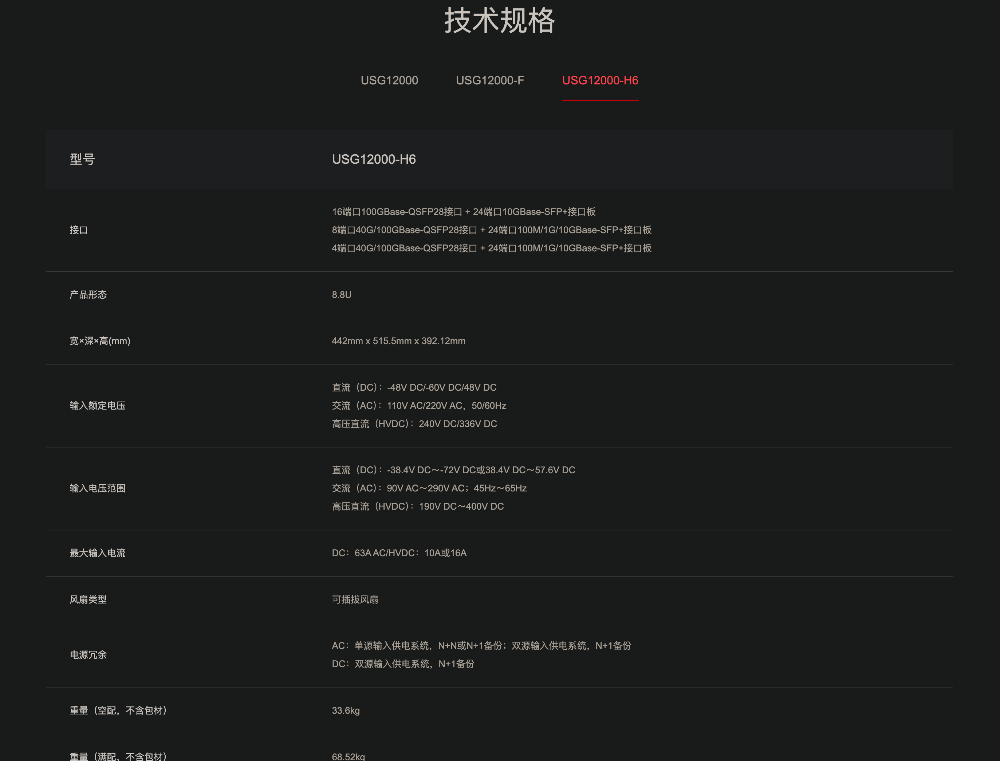


华为 HiSecEngine USG6700F 系列 AI 防火墙

是华为面向下一代数据中心推出的高性能万兆AI防火墙，通过全新软硬件架构，打造具备智能防御、卓越性能、极简运维三大关键能力的新一代AI防火墙，有效应对挑战。USG6700F系列使用智能技术赋能边界防御，精准阻断已知和未知威胁；内置多个安全专用加速引擎有效提升IPv4/IPv6转发、内容安全检测、IPSec等关键业务处理性能；通过安全运维平台实现防火墙、入侵防御、抗DDoS等多类安全产品的统一管理和运维，降低安全运维OPEX。

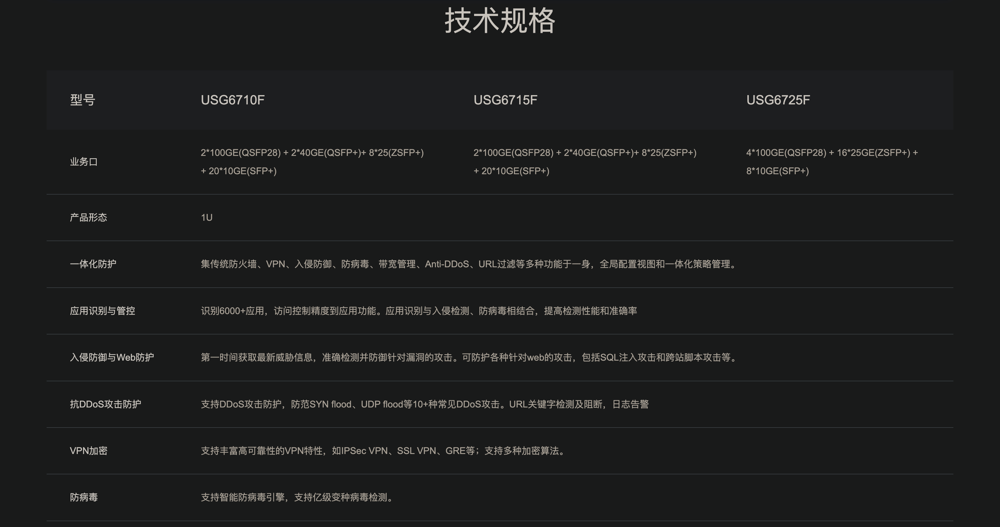
HiSecEngine USG6600F 系列 AI 防火墙

华为 HiSecEngine USG6600F 系列是华为面向下一代数据中心推出的万兆AI防火墙，HiSecEngine USG6600F系列基于最新软硬件平台，提供IPv4/IPv6共栈能力，业务性能大幅提升；使用智能技术有效检测高级威胁，增强边界防护能力。支持联动华为乾坤安全云服务，提供边界防护与响应服务，端云联动，立体防御。广泛适用于金融、政府、大企业等行业。

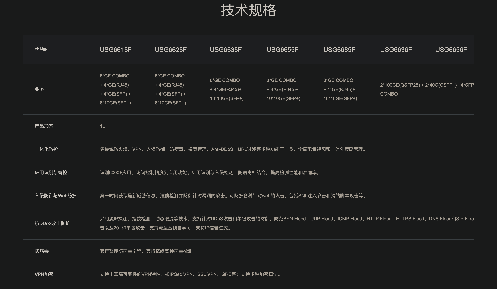

HiSecEngine USG6500F 系列 AI 防火墙

HiSecEngine USG6500F 系列 AI 防火墙是华为面向小型企业、行业分支、连锁商业机构设计开发的新一代AI防火墙，在提供NGFW能力的基础上，联动其他安全设备，增强边界检测能力，有效防御高级威胁。产品提供模式匹配以及加解密业务处理加速能力，使得防火墙处理内容安全检测、IPSec等业务的性能显著提升。支持联动华为乾坤安全云服务，提供边界防护与响应、漏洞扫描、日志审计等服务，端云联动，立体防御，广泛适用于教育、医疗、零售等行业。
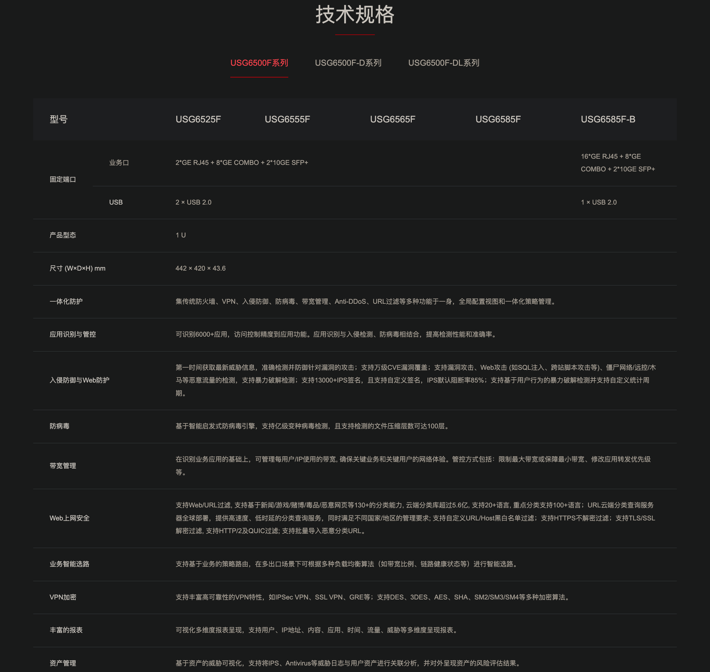

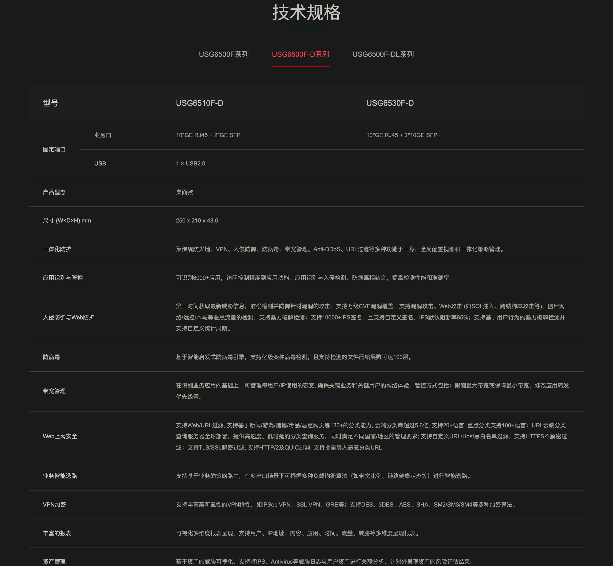

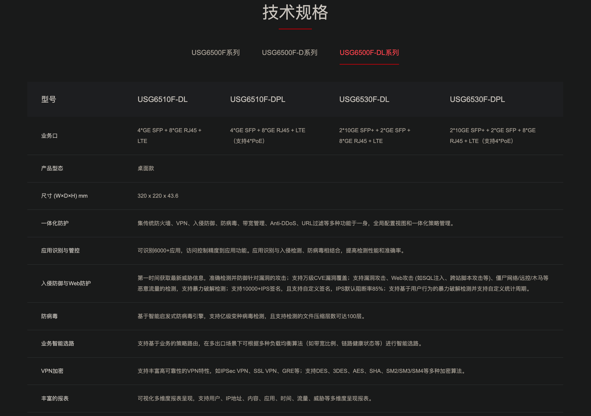


华为 HiSecEngine USG6000F-E 系列防火墙

HiSecEngine USG6000F-E系列防火墙是华为面向中小型企业和多分支机构推出的高性能防火墙，适用于各类场景和网络安全建设需求。通过全新软硬件平台来实现功能全面、高性能、低时延的智能防火墙。


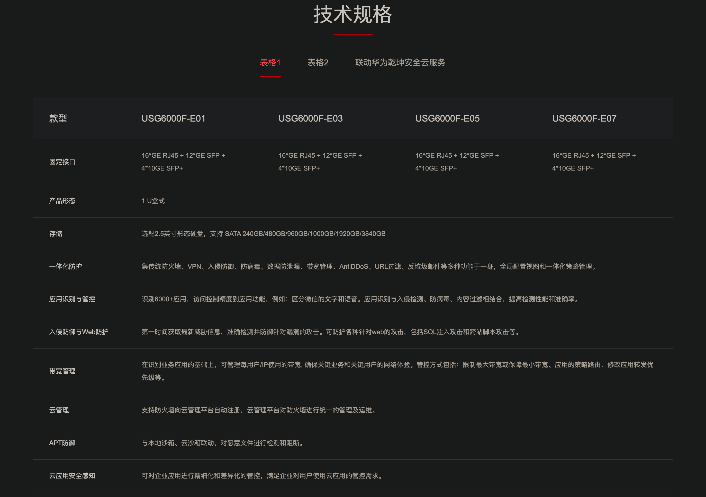

华为 HiSecEngine USG6700E 系列 AI 防火墙

华为HiSecEngine USG6700E系列AI防火墙（盒式）是面向下一代数据中心和和大型企业园区网推出的万兆AI防火墙，在提供NGFW能力的基础上，联动其他安全设备，主动防御网络威胁，增强边界检测能力，有效防御高级威胁，同时解决性能下降问题。NP引擎提供快速转发能力，防火墙性能显著提升。广泛适用于金融、政府、大企业等行业。

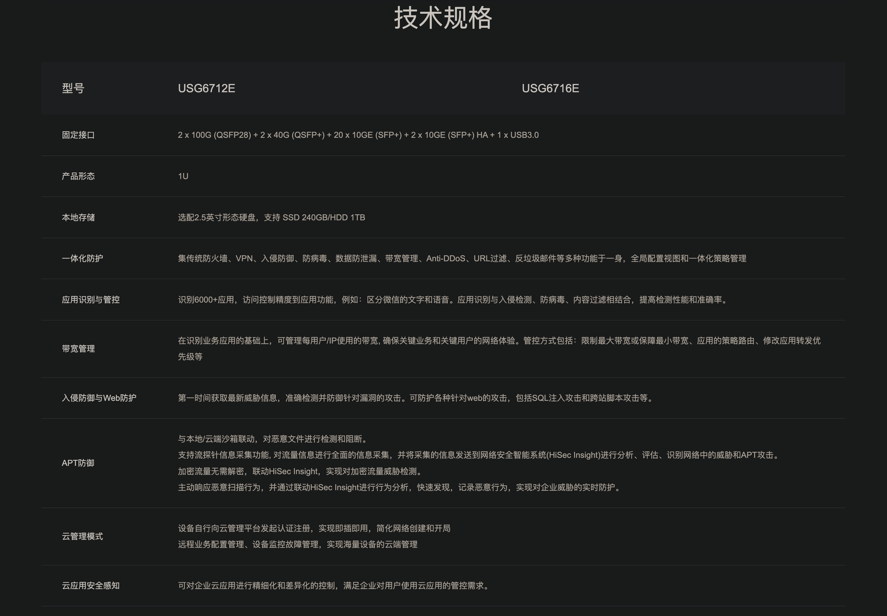

HiSecEngine USG6600E 系列 AI 防火墙

华为 HiSecEngine USG6600E 系列 AI 防火墙是面向下一代数据中心推出的万兆AI防火墙，在提供NGFW能力的基础上，联动其他安全设备，主动防御网络威胁，增强边界检测能力，有效防御高级威胁，同时解决性能下降问题。NP提供快速转发能力，防火墙性能显著提升。广泛适用于金融、政府、大企业等行业。

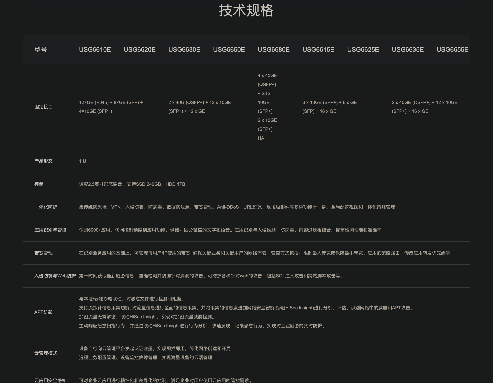

HiSecEngine USG6500E 系列 AI 防火墙

华为 HiSecEngine USG6500E 系列 AI 防火墙是面向中小企业和连锁机构推出的企业级AI防火墙，在提供NGFW能力的基础上，联动其他安全设备，主动积极防御网络威胁，增强边界检测能力，有效防御高级威胁，同时解决性能下降问题。产品提供模式匹配以及加解密业务处理加速能力，使得防火墙处理内容安全检测、IPSec等业务的性能显著提升。支持联动华为乾坤安全云服务，提供边界防护与响应、漏洞扫描、日志审计等服务，端云联动，立体防御。广泛适用于教育、医疗、零售等行业。

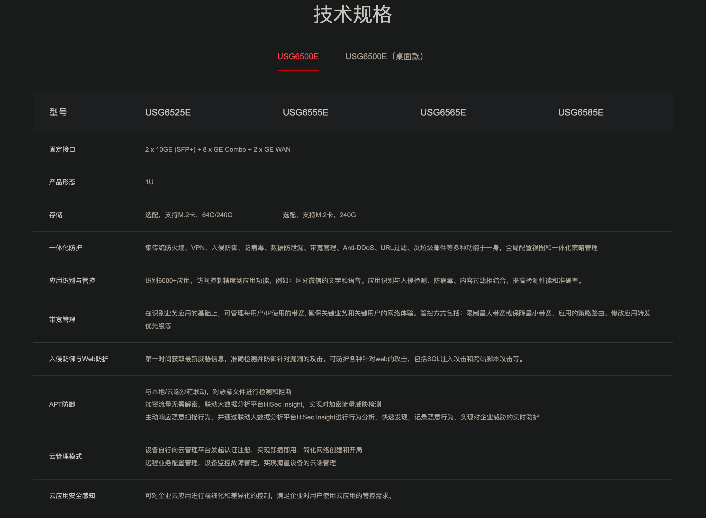

桌面款
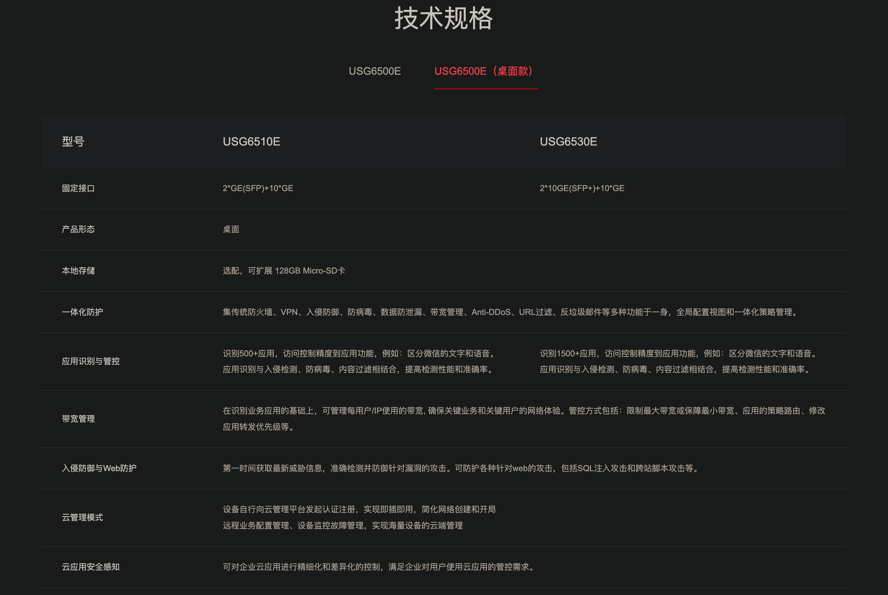

# Tailscale 和 Headscale
Tailscale 是基于 WireGuard 的虚拟组网工具。提供免费、收费的托管控制服务。

Headscale 是 Tailescale 控制服务器的开源、自托管实现。

# Podman
Podman 相比 Docker 的好处是，Podman可以经由管理员的权限下放让普通用户也可以操作容器，在服务器上跑容器映射的实验。

自检命令（不需要管理员权限）：
```bash
podman info --debug | sed -n '1,120p'
id
grep -E "^$(whoami):" /etc/subuid /etc/subgid 2>/dev/null
```

- `podman info` 里如果显示 rootless 正常、存储/网络组件齐全，基本就能开干。
- 如果 `/etc/subuid` / `/etc/subgid` 没你的条目，很多情况下会导致功能受限或直接失败，这就需要管理员加。

```
host:
  arch: amd64
  buildahVersion: 1.39.4
  cgroupControllers:
  - memory
  - pids
  cgroupManager: systemd
  cgroupVersion: v2
  conmon:
    package: conmon-2.1.12-1.el9.x86_64
    path: /usr/bin/conmon
    version: 'conmon version 2.1.12, commit: 5859d6167f22954414ce804d3f2ae9cf6208f929'
  cpuUtilization:
    idlePercent: 95.1
    systemPercent: 0.75
    userPercent: 4.15
  cpus: 512
  databaseBackend: sqlite
  distribution:
    distribution: rocky
    version: "9.6"
  eventLogger: file
  freeLocks: 2048
  hostname: turing001
  idMappings:
    gidmap:
    - container_id: 0
      host_id: 1013
      size: 1
    - container_id: 1
      host_id: 951968
      size: 65536
    uidmap:
    - container_id: 0
      host_id: 1013
      size: 1
    - container_id: 1
      host_id: 951968
      size: 65536
  kernel: 5.14.0-570.55.1.el9_6.x86_64
  linkmode: dynamic
  logDriver: k8s-file
  memFree: 198968160256
  memTotal: 2434049519616
  networkBackend: netavark
  networkBackendInfo:
    backend: netavark
    dns:
      package: aardvark-dns-1.14.0-1.el9.x86_64
      path: /usr/libexec/podman/aardvark-dns
      version: aardvark-dns 1.14.0
    package: netavark-1.14.1-1.el9_6.x86_64
    path: /usr/libexec/podman/netavark
    version: netavark 1.14.1
  ociRuntime:
    name: crun
    package: crun-1.23.1-2.el9_6.x86_64
    path: /usr/bin/crun
    version: |-
      crun version 1.23.1
      commit: d20b23dba05e822b93b82f2f34fd5dada433e0c2
      rundir: /tmp/cxing-runtime/crun
      spec: 1.0.0
      +SYSTEMD +SELINUX +APPARMOR +CAP +SECCOMP +EBPF +CRIU +YAJL
  os: linux
  pasta:
    executable: /usr/bin/pasta
    package: passt-0^20250217.ga1e48a0-10.el9_6.x86_64
    version: ""
  remoteSocket:
    exists: true
    path: /tmp/cxing-runtime/podman/podman.sock
  rootlessNetworkCmd: pasta
  security:
    apparmorEnabled: false
    capabilities: CAP_CHOWN,CAP_DAC_OVERRIDE,CAP_FOWNER,CAP_FSETID,CAP_KILL,CAP_NET_BIND_SERVICE,CAP_SETFCAP,CAP_SETGID,CAP_SETPCAP,CAP_SETUID,CAP_SYS_CHROOT
    rootless: true
    seccompEnabled: true
    seccompProfilePath: /usr/share/containers/seccomp.json
    selinuxEnabled: true
  serviceIsRemote: false
  slirp4netns:
    executable: /usr/bin/slirp4netns
    package: slirp4netns-1.3.2-1.el9.x86_64
    version: |-
      slirp4netns version 1.3.2
      commit: 0f13345bcef588d2bb70d662d41e92ee8a816d85
      libslirp: 4.4.0
      SLIRP_CONFIG_VERSION_MAX: 3
      libseccomp: 2.5.2
  swapFree: 0
  swapTotal: 0
  uptime: 1104h 28m 50.00s (Approximately 46.00 days)
  variant: ""
plugins:
  authorization: null
  log:
  - k8s-file
  - none
  - passthrough
  - journald
  network:
  - bridge
  - macvlan
  - ipvlan
  volume:
  - local
registries:
  search:
  - registry.access.redhat.com
  - registry.redhat.io
  - docker.io
store:
  configFile: /home/cxing/.config/containers/storage.conf
  containerStore:
    number: 0
    paused: 0
    running: 0
    stopped: 0
  graphDriverName: overlay
```

以上的信息说明：

- `security.rootless: true` ✅（你现在就是以普通用户在用 Podman）
- `idMappings` 里有一段 **65536** 的 uid/gid 映射 ✅（说明 subuid/subgid 也配了，rootless 功能比较完整）
- `cgroupVersion: v2` + `cgroupManager: systemd` ✅（资源隔离走 systemd/cgroup v2）
- `networkBackend: netavark` 且 `rootlessNetworkCmd: pasta` ✅（rootless 网络也能用）

需要注意的几个“普通用户限制点”
- `cgroupControllers` 只有 `memory` 和 `pids`（**没有 cpu**）。所以像 `--cpus`、CPU quota 这类参数**可能不生效或会报错**；内存/进程数限制一般是可用的。
- SELinux 开着（`selinuxEnabled: true`）。挂载宿主机目录时，常见要加 `:Z`：
    `podman run --rm -it -v "$PWD:/work:Z" ubuntu:22.04 bash`
- 端口映射一般能用 `-p`，但 **<1024 的端口**在 rootless 下通常不行（除非管理员改过系统策略）。
## 常用基础命令
临时起一个交互容器做实验（推荐）
```bash
podman run --rm -it ubuntu:22.04 bash
```

进已经在跑的容器
```bash
podman ps
podman exec -it <容器名或ID> bash
```


## 用 Podman 在服务器上部署 Headscale

准备目录
```bash
mkdir -p ~/headscale/{config,lib,run}
cd ~/headscale
```

下载对应版本的示例配置：
```bash
curl -fsSL \
  https://raw.githubusercontent.com/juanfont/headscale/v0.27.1/config-example.yaml \
  -o ~/headscale/config/config.yaml
```

## Headscale 配置文件
示例配置里包含 `server_url`、`listen_addr`、数据库路径、`dns.base_domain` 等关键项。
用你熟悉的编辑器改（例如 `vim ~/headscale/config/config.yaml`），至少改这几处：

- `server_url`: 改成你客户端要连的地址（推荐 HTTPS 域名）
- `listen_addr`: **容器里建议用 `0.0.0.0:8080`**（否则只监听 127.0.0.1，端口映射进不去）
- `dns.base_domain`: 改成你的 MagicDNS 域名（注意示例里强调要和 `server_url` 域名不同）
    - `dns.base_domain` **不是** headscale 服务器的公网域名（那个是 `server_url`），它是给 **MagicDNS 用的“内网后缀域名”**：开启 MagicDNS 后，你 tailnet 里的每台设备都会有一个形如`laptop.tailnet.example.com` 这样的名字来互相访问。
    - 最常见写法：`tailnet.<主域名>`
    - 如果想要用主机名互访，必须配这个和MagicDNS，而且客户端在启动时要`--accept-dns=true`。
- SQLite 默认路径 `database.sqlite.path: /var/lib/headscale/db.sqlite` 保持即可（我们会把它映射到宿主机 `~/headscale/lib`）。
- headscale configtest 可以用来验证配置文件。

> 如果准备放到反代后面并让反代处理 TLS，也可以按文档把 `tls_cert_path`/`tls_key_path` 置空并确保 WebSocket 正常转发。


## 用 Podman 启动 Headscale 容器

```bash
podman pull ghcr.io/juanfont/headscale:v0.27.1

podman run -d --name headscale \
  -v "$HOME/headscale/config:/etc/headscale:Z" \
  -v "$HOME/headscale/lib:/var/lib/headscale:Z" \
  -v "$HOME/headscale/run:/var/run/headscale:Z" \
  -p 0.0.0.0:8080:8080 \
  -p 127.0.0.1:9090:9090 \
  --health-cmd "headscale health" \
  ghcr.io/juanfont/headscale:v0.27.1 serve
```
说明：
- `:Z` 是 Rocky/SELinux 环境常用的卷标处理（不加可能权限报错）。
- `9090` 是 metrics/debug 端口，我这里绑定到 `127.0.0.1`，避免公网暴露（容器文档也提到 8080/9090 的发布方式以及 `0.0.0.0` vs `127.0.0.1` 的差异）。

看日志确认启动：

`podman logs -f headscale`

检查是否能跑起来

```bash
podman ps
podman logs --tail=200 headscale
podman port headscale
```
## pull到了什么地方？

对 **rootless（普通用户）Podman** 来说，`podman pull` 下来的镜像不会变成当前目录里的一个 `.tar` 文件，而是被写进 **这个用户自己的本地镜像存储（image store）** 里（按层存储、内容寻址）。

- **持久化存储（镜像/层）**：`$HOME/.local/share/containers/storage`
- **运行时临时目录（容器运行时文件）**：通常在 `XDG_RUNTIME_DIR`（常见是 `/run/user/$UID`；你机器上看起来可能被设到 `/tmp/cxing-runtime/...`）

`podman info` 里显示：
- `store.configFile: /home/cxing/.config/containers/storage.conf`  说明实际路径可能被这个配置文件覆盖了。

直接查看“它到底下到哪里了”（最准）

`podman info --format 'GraphRoot={{.Store.GraphRoot}}'`
`podman info --format 'RunRoot={{.Store.RunRoot}}'`

想看镜像占了多少、有哪些
```bash
podman images
podman system df
```
### -p 语法
Podman 的 `-p` 参数用于端口映射，语法格式如下：
```bash
podman run -p [主机IP:][主机端口:][容器端口] [容器名]
```

示例：将容器80端口映射到主机8080端口，只允许本机访问
当指定了IP地址后，意味着，特定了网络接口。
```bash
podman run -p 127.0.0.1:8080:80 nginx
```

范围映射：
```bash
podman run -p 2000-2005:1000-1005 镜像
```

# Headscale 命令
创建用户：
```bash
podman exec -it headscale headscale users create cxing
```

生成preauth key：
```bash
podman exec -it headscale headscale preauthkeys create --user [ID] --reusable --expiration 24h
```

然后在客户端执行：
```bash
tailscale up --login-server http://你的headscale域名 --authkey 填上面生成的key
```

用 Quadlet 做开机自启（rootless）
Podman 的 Quadlet 支持把 `.container` 文件放到 `~/.config/containers/systemd/` （用户级）并由 systemd 生成 service 来管理。

创建文件：
```
mkdir -p ~/.config/containers/systemd
vim ~/.config/containers/systemd/headscale.container
```

填入（按需改版本/端口/路径）
```ini
[Container]
Image=ghcr.io/juanfont/headscale:v0.27.1
ContainerName=headscale
Exec=serve
PublishPort=0.0.0.0:8080:8080
PublishPort=127.0.0.1:9090:9090
Volume=%h/headscale/config:/etc/headscale:Z
Volume=%h/headscale/lib:/var/lib/headscale:Z
Volume=%h/headscale/run:/var/run/headscale:Z

[Install]
WantedBy=default.target
```

加载并启动：
```bash
systemctl --user daemon-reload
systemctl --user start headscale.service
systemctl --user enable headscale.service
```

反代 / 443 / Cloudflare 的关键提醒

- **反向代理必须支持 WebSockets**，否则 tailscale 客户端会注册/握手失败。
- **Cloudflare proxy / tunnel 官方明确说不支持且无法工作**（Cloudflare 不支持 tailscale 协议所需的 WebSocket POST）。 
- rootless 用户默认绑不了 443：要么让管理员改系统参数/做端口转发，要么用一个 root 权限的反代（Nginx/Caddy）占 443 转到你 8080。

# Tailscale 客户端安装

## MacOS
在 macOS 上装 Tailscale，最稳的是装 **官方 Standalone 版本（推荐）**，其次是 **App Store 版本**。官方要求 **macOS 12.0 (Monterey) 或更高**。 
### 方式一：官方 Standalone（推荐）

1. 去 Tailscale 的 macOS 安装页/下载页，下载 **Standalone** 安装包并安装（通常是 `.pkg`）。
2. 打开 **Tailscale.app**（菜单栏会出现 Tailscale 图标），按引导完成登录。
3. 系统会提示安装 VPN 配置/扩展：按 macOS 版本去 **系统设置**里允许。
    - macOS 15（Sequoia）/macOS 14（Sonoma）授权路径略有不同，按官方指引在 **Privacy & Security / Network Extensions** 里开启/Allow。

> 备注：Standalone 版本会用到系统扩展；App Store 版本则不需要系统扩展、只装 VPN 配置。
### 方式二：Homebrew（可选）
安装 GUI 版（cask）：
`brew install --cask tailscale-app`
`open -a Tailscale`

### 安装 CLI Integration
打开 **Tailscale 应用 → Settings → CLI integration → Show me how → Install Now**，输入 mac 管理员密码。装完后会有：
- `/usr/local/bin/tailscale`

测试：
```bash
tailscale status
```
### 连接自建的Tailscale
```bash
tailscale up --login-server <headscaleAddress> --authkey <yourpreauthkey>
```

# Tailscale 登录时的问题

## 一直未响应
先确认客户端可以访问到headscale这个端口（默认8080或者自定义的8111）
```bash
nc -vz DomainName port
curl -vk http://DomainName:port
```

如果超时，说明是port端口没对公网开放，或者是服务器防火墙没配，或者是反代没配

## 证书自签问题导致的未响应
先在服务器上确认：Headscale 的 8112 现在到底通不通

在服务器上直接跑（强制不走代理）：
```bash
curl --noproxy '*' -sv http://127.0.0.1:8112/health | head
curl --noproxy '*' -sv https://127.0.0.1:8112/health | head
```

- **如果 http 有响应**（200/404 都行，只要是 HTTP 响应），说明 8112 是 **HTTP**。
- **如果 https 才有响应**且提示 self-signed，说明 8112 是 **HTTPS（自签名）**。
- **如果两个都连不上**，那先别跑 tailscale up —— headscale 本身或端口映射有问题。

```log
[cxing@turing001 ~]$ curl --noproxy '*' -sv https://127.0.0.1:8112
*   Trying 127.0.0.1:8112...
* Connected to 127.0.0.1 (127.0.0.1) port 8112 (#0)
* ALPN, offering h2
* ALPN, offering http/1.1
*  CAfile: /etc/pki/tls/certs/ca-bundle.crt
* TLSv1.0 (OUT), TLS header, Certificate Status (22):
* TLSv1.3 (OUT), TLS handshake, Client hello (1):
* TLSv1.2 (IN), TLS header, Certificate Status (22):
* TLSv1.3 (IN), TLS handshake, Server hello (2):
* TLSv1.2 (IN), TLS header, Finished (20):
* TLSv1.2 (IN), TLS header, Unknown (23):
* TLSv1.3 (IN), TLS handshake, Encrypted Extensions (8):
* TLSv1.2 (IN), TLS header, Unknown (23):
* TLSv1.3 (IN), TLS handshake, Certificate (11):
* TLSv1.2 (OUT), TLS header, Unknown (21):
* TLSv1.3 (OUT), TLS alert, unknown CA (560):
* SSL certificate problem: self-signed certificate
* Closing connection 0
```

8112 是 HTTPS 自签名，服务器不信任证书

把 headscale 的证书加到系统信任（Rocky 9）：

```bash
openssl s_client -connect qiyan.fund:8112 -servername qiyan.fund -showcerts </dev/null 2>/dev/null \
  | openssl x509 -outform PEM | sudo tee /etc/pki/ca-trust/source/anchors/headscale.crt >/dev/null

sudo update-ca-trust

```

# 配置服务器的Headscale
公司有5个同事
## 在headscale 中 建5个用户
```bash
podman exec -it headscale headscale users create alice
podman exec -it headscale headscale users create bob
podman exec -it headscale headscale users create carol
podman exec -it headscale headscale users create dave
podman exec -it headscale headscale users create eve

podman exec -it headscale headscale users list
```

`users list` 里会显示 **ID**，后面生成 preauth key 常用这个 ID（官方示例就是 `--user <id>`）。

## 发 key
示例（给 alice，假设 alice 的 user ID 是 1）：
```bash
podman exec -it headscale headscale preauthkeys create --user 1 --expiration 24h --reusable
```

`--reusable` 是指 允许在有效期内多次添加设备。

把 key 发给 user，让他在自己的设备上执行：
```bash
tailscale up --login-server=http://qiyan.fund:8112 --auth-key=xxx --hostname=...
```

## 场景管理

1、都需要登陆服务器，起码要访问到自己的home目录下做开发。其中有一个hnie是root用户。cxing是普通用户，但是要管理tailscale。 
2、不需要互相访问彼此电脑。

1. Headscale 里：一人一个 user
    - `hnie`、`cxing`、`u1`、`u2`、`u3`（按真实用户名来）
    - 好处：离职/换设备/权限回收非常清晰（删掉该 user 或移除他的 nodes 即可）
2. 服务器节点用 tag 管（不要挂到某个人名下）
    - 给服务器打 `tag:server`
    - 然后 ACL 里规定：**所有员工只能访问 `tag:server:22`（SSH）**
    - 管理员（`hnie`、`cxing`）可以访问服务器更多端口（可选）
3. 服务器 Linux 侧：每人一个 Linux 账号（home 自动隔离）
    - 例如：`alice` 的 home 默认权限就是 700/750（建议统一 `chmod 700 /home/<user>`），同事无法读写彼此目录
    - Root 账号仍只建议用 key 登录，日常不用

### 写ACL
在宿主机（你挂载的 config 目录）创建一个 `acl.hujson`，比如放在：  
`$HOME/headscale/config/acl.hujson`

内容示例（把用户名替换成实际的）：

```json
{
  "groups": {
    "group:staff": ["hnie@", "cxing@", "u1@", "u2@", "u3@"],
    "group:admins": ["hnie@", "cxing@"]
  },

  "tagOwners": {
    "tag:server": ["group:admins"]
  },

  "acls": [
    // 所有人只允许 SSH 到服务器
    { "action": "accept", "src": ["group:staff"], "dst": ["tag:server:22"] },

    // （可选）管理员允许访问服务器所有端口，方便排障/跑服务
    { "action": "accept", "src": ["group:admins"], "dst": ["tag:server:*"] }
  ]
}
```

然后在 headscale 的 `config.yaml` 里启用这个 ACL 文件：
- 配置里通常是某个 `policy` / `acl` 字段指向文件路径
- 直接在 `config.yaml` 里搜 `policy` 或 `acl`，把路径指到容器内路径：`/etc/headscale/acl.hujson`
- 因为已经把 `$HOME/headscale/config` 挂载到容器 `/etc/headscale` 了，所以容器内就是 `/etc/headscale/acl.hujson`

改完后重启 headscale 容器：
`podman restart headscale`

# 配置服务器的Tailscale
## Linux 安装 Tailscale（需要root）
```bash
curl -fsSL https://tailscale.com/install.sh | sh
sudo tailscale up
sudo tailscale set --operator=cxing # 允许cxing管理tailscale
```

结果：以后 **cxing 作为普通用户**就能跑 `tailscale up / status / down` 等管理命令（不需要 root）。

## 服务器作为一个节点登录Headscale
先在 headscale 里找 `cxing` 或 `hnie` 的 user ID（假设管理员 user ID 是 1），生成一个 **给服务器用** 的 key：
```
podman exec -it headscale headscale preauthkeys create --user 1 --expiration 1h
```

然后在服务器上（由cxing来执行也可以）把服务器节点注册进去，并打tag：
```bash
tailscale up \
  --login-server=https://qiyan.fund:8112 \
  --hostname=turing001 \
  --advertise-tags=tag:server \
  --auth-key=上面生成的key
```

# Remote CLI（管理员客户端的配置）
用于管理员日常加人/删机/看节点/改路由，省的再`podman exec`进容器。

在服务器上创建API key
```bash
podman exec -it headscale headscale apikeys create --expiration 90d
```

管理员电脑终端下载同版本headscale二进制版本。如果是macOS，则下载darwin后缀的。

配置Remote CLI 连接参数
可以通过ymal 文件配置Remote CLI连接参数：

Headscale CLI 会按照顺序找`config.yaml`：`/etc/headscale` → `$HOME/.headscale` → 当前目录；也可以用 `-c/--config` 或 `HEADSCALE_CONFIG` 指定路径。

推荐放这里：
```bash
mkdir -p ~/.headscale
nano ~/.headscale/config.yaml
```

写入：
1. 注意锁进
2. address 不要写 http 前缀，只写 `域名:端口` 即可
3. headscale 服务器 必须启用 gRPC，并且 50443 （或者改的端口）对管理员端 可达。
4. 证书要有，要可信，否则会连不上。

```yaml
cli:
  address: qiyan.fund:50443
  api_key: <你的API_KEY>
  # 如果你用的是自签证书且无法加到系统信任，可临时加这一行（不推荐长期用）
  insecure: true
```

## Remote CLI的50443端口相关的配置 - 服务器生成自签证书
Remote CLI **要求 gRPC 启用 + 走 TLS（加密连接）**，默认 gRPC 端口是 `50443`。

现在 `login-server` 用的是 `http://...:...`，这通常意味着还没把 headscale 的 gRPC/TLS 管理口准备好。建议把 gRPC 管理口 **只开放在 tailnet 内**（最安全）：要么只监听 `127.0.0.1` 再用 SSH 隧道访问，要么只允许 Tailscale 网段访问。 

在服务器生成自签证书（放到挂载的 config 目录）
在服务器（turing001）上执行：
```bash
mkdir -p ~/headscale/config/certs

openssl req -x509 -newkey rsa:4096 -sha256 -days 3650 -nodes \
  -keyout ~/headscale/config/certs/headscale.key \
  -out  ~/headscale/config/certs/headscale.crt \
  -subj "/CN=qiyan.fund" \
  -addext "subjectAltName=DNS:qiyan.fund"
```

改 Headscale 的 `config.yaml` ：打开 gRPC + 指向证书
在 Headscale 的配置文件里加/修改这几项：（这里面的路径指的是容器里的路径，这些文件映射的是挂载的目录`~/headscale/config`）
```yaml
grpc_listen_addr: 0.0.0.0:50443
grpc_allow_insecure: false

tls_cert_path: /etc/headscale/certs/headscale.crt
tls_key_path: /etc/headscale/certs/headscale.key
```
>注意：Remote CLI 需要“有效证书”。没有受信任证书时，要么把自签证书加入系统信任，要么在 CLI 里 `insecure`。

最后一步，需要在headscale的podman run里加一条端口映射（示例）
```bash
-p 0.0.0.0:50443:50443
```
如果现在的 headscale 容器是跑着的，通常做法是：
```bash
podman stop headscale
podman rm headscale
```
然后用带 50443 映射的命令重建（数据都在 volume 里不会丢）
```bash
podman run -d --name headscale \
  -v "$HOME/headscale/config:/etc/headscale:Z" \
  -v "$HOME/headscale/lib:/var/lib/headscale:Z" \
  -v "$HOME/headscale/run:/var/run/headscale:Z" \
  -p 0.0.0.0:8112:8080 \
  -p 127.0.0.1:8113:9090 \
  -p 0.0.0.0:50443:50443 \
  ghcr.io/juanfont/headscale:v0.27.1 serve
```

确认端口监听：
```bash
ss -ltn | egrep '(:8112|:50443)'
podman port headscale
```

如果服务器有防火墙/安全组，也要放行 TCP 50443，或至少放行给你的办公网段。


测试：
```bash
headscale nodes list
```
如果超时，则测试50443端口是否可达
```bash
nc -vz DomainName 50443
# 或更详细
curl -vk https://DomainName:50443
# 看 TLS 能不能握手
openssl s_client -connect DomainName:50443 -servername DomainName
```

- **A. 直接超时/拒绝连接**：说明 **服务器没监听 / 容器没映射 / 防火墙没放行 / 云安全组没开**（最常见）
    - 如果 `nc` 超时，而服务器上确实在监听，那就几乎肯定是 **防火墙/云安全组**
    - Rocky 防火墙（需要 root/hnie 做）：`sudo firewall-cmd --add-port=50443/tcp --permanent && sudo firewall-cmd --reload`
- **B. TLS 能握手成功**：说明端口通了，再检查 headscale 的 gRPC 配置

在服务器上确认：headscale 是否真的在监听 50443 + podman 是否映射出来。在服务器（turing001）上跑：

```bash
podman port headscale | egrep '50443|8112'
ss -ltn | egrep ':50443|:8112'
podman logs --tail=200 headscale`
```
应该能看到类似：

- `0.0.0.0:50443 -> 50443/tcp`（podman port）
- `LISTEN ... :50443`（ss）

如果 **看不到 50443**，那 Remote CLI 永远连不上。


确认 Headscale 配置中 启用了 gRPC + TLS（headscale 的 `config.yaml`）：
```yaml
grpc_listen_addr: 0.0.0.0:50443

tls_cert_path: /etc/headscale/certs/headscale.crt
tls_key_path: /etc/headscale/certs/headscale.key
```

> Remote CLI 走的是 **gRPC over TLS**，不是你现在的 HTTP `8112`。只有 HTTP 的话，Remote CLI 连接一定会超时。
# 可视化Web UI
上面的Remote CLI只是省去了SSH + 进容器的步骤，但是仍然不够直观。

社区有很多 Headscale 的Web UI 项目。
以 Headplane 为例。

在服务器（cxing目录下）
```bash
mkdir -p ~/headplane/{data,config}
```

生成Headplane 的 `cookie_secret`（必须32字符）
```bash
COOKIE_SECRET="$(openssl rand -base64 48 | tr -d '\n' | head -c 32)"
echo "$COOKIE_SECRET"
```

写 Headscale 配置文件

```bash
cat > ~/headplane/config/config.yaml <<'YAML'
server:
  host: "0.0.0.0"
  port: 3000
  base_url: "http://localhost:3000"
  cookie_secret: "__REPLACE_ME__"
  # 你现在没上 HTTPS，就必须关掉 secure cookie，否则浏览器可能不收 cookie
  cookie_secure: false

data_path: "/var/lib/headplane"

headscale:
  # 注意：这里是 headscale 的 HTTP endpoint，不是 gRPC 50443
  url: "http://qiyan.fund:8112"
  config_strict: false

integration:
  agent:
    enabled: false
  proc:
    enabled: false
YAML
```

然后把 cookie_secret 替换进去：

`sed -i "s/__REPLACE_ME__/${COOKIE_SECRET}/" ~/headplane/config/config.yaml`


用Podman 跑 Headplane
先检查服务器的 3000 是否占用：
```bash
ss -lnt | grep ':3000' || true
```

启动容器（暂时只绑定到本机，避免直接暴露公网）：

```bash
podman run -d --replace --name headplane \
  -p 127.0.0.1:3000:3000 \
  -v "$HOME/headplane/config/config.yaml:/etc/headplane/config.yaml:Z" \
  -v "$HOME/headplane/data:/var/lib/headplane:Z" \
  ghcr.io/tale/headplane:latest
```

看日志确认起来了：
```bash
podman logs -f headplane
```

客户端：
从 管理员客户端 访问 UI （SSH隧道）
```bash
ssh -N -L 9300:127.0.0.1:3000 cxing@turing001
```

浏览器打开：`http://127.0.0.1:9300/admin`

登录时需要 **Headscale API key**（不是 preauth key）。Headplane 文档明确：登录要提供 Headscale API key。

服务器上生成 API key：
`podman exec -it headscale headscale apikeys create --expiration 90d`

## Headplane 配置校验要求

**Headplane 配置校验是“强制要求 integration.agent 里必须提供 `pre_authkey` 或 `pre_authkey_path`”**，哪怕把 `enabled: false` 也照样会报错（它会把 agent 的默认字段补齐后再校验）。所以容器启动就直接退出了。

解决方法：
给 `integration.agent` 补一个 `pre_authkey_path`（放一个 key 文件），即使 agent 不启用也能通过校验，从而 UI 正常启动。

在 headscale 里生成一个 preauth key（给“占位用”）

用已有的 cxing 用户（ID为1）
```bash
podman exec -it headscale headscale preauthkeys create \
  --user 1 \
  --reusable \
  --expiration 8760h
```

>这个 key 本质是“给 agent 或其他节点自动注册用”的。你现在 agent 不启用，它不会自动跑，但 Headplane 校验必须要有一个。

把 key 写到 文件，同时权限收紧
```bash
mkdir -p ~/headplane/keys
echo "<把上面的key粘贴到这里>" > ~/headplane/keys/agent.key
chmod 600 ~/headplane/keys/agent.key
```

修改`~/headplane/config/config.yaml`

把 `integration` 段改成下面这样（关键是补 `pre_authkey_path`）：

```yaml
server:
  host: "0.0.0.0"
  port: 3000
  base_url: "http://localhost:3000"
  cookie_secret: "..."  # 确保正好32字符
  cookie_secure: false

data_path: "/var/lib/headplane"

headscale:
  url: "http://192.168.2.151:8112"
  config_strict: false

integration:
  agent:
    enabled: false
    pre_authkey_path: "/var/lib/headplane/agent.key"
  proc:
    enabled: false

```

重建 Headplane 容器（把key 文件挂进容器）
```bash
podman rm -f headplane 2>/dev/null || true

podman run -d --name headplane \
  -p 127.0.0.1:3000:3000 \
  -v "$HOME/headplane/config/config.yaml:/etc/headplane/config.yaml:Z" \
  -v "$HOME/headplane/data:/var/lib/headplane:Z" \
  -v "$HOME/headplane/keys/agent.key:/var/lib/headplane/agent.key:Z,ro" \
  ghcr.io/tale/headplane:latest
```

检查是否跑起来：
```bash
podman ps --filter name=headplane
podman logs --tail=80 headplane
```


## 不要让Headplane用HTTPS去请求Head scale的HTTP API
在浏览器前端页面提交apikey报错为：
```log
2025-12-22T10:25:49.378Z [server] INFO: Running Node.js 22.20.0
2025-12-22T10:25:49.413Z [config] INFO: Found a valid configuration file at /etc/headplane/config.yaml
2025-12-22T10:25:50.042Z [server] INFO: Running on 0.0.0.0:3000
2025-12-22T10:25:57.525Z [auth] ERROR: Error while validating API key: DataWithResponseInit {
  type: 'DataWithResponseInit',
  data: 'self-signed certificate',
  init: [Object]
}
```

这个报错的意思很明确：**Headplane 在用 HTTPS 去请求 Headscale 的 HTTP API 时，遇到了“自签名证书”，Node.js 默认不信任，于是把 API key 校验直接判失败**。

Headplane 本身就支持这种场景：如果 Headscale 用了 TLS 且不是 Let’s Encrypt，需要在 Headplane 配置里给 `headscale.tls_cert_path`。

### 先确认：8112 到底是 HTTP 还是 HTTPS
在服务器上跑（重点是分别试 http/https）：
```bash
curl -vk https://127.0.0.1:8112/
curl -vk http://127.0.0.1:8112/
```

- 如果 **https 能连**，输出里会看到证书信息/自签名提示。
- 如果 **http 才能连**，那 Headplane 里就必须用 `http://...`，不要走 TLS。

如果 Headscale 的 8112 是 HTTPS（自签名）——让 Headplane 信任证书

导出 Headscale 的证书到文件（在服务器上）

> 之前 `openssl s_client` 看到 `CN=qiyan.fund`，所以这里用 `-servername qiyan.fund`。

```bash
mkdir -p $HOME/headplane/certs

openssl s_client -connect 127.0.0.1:8112 -servername qiyan.fund -showcerts </dev/null 2>/dev/null \
  | openssl x509 -outform PEM > $HOME/headplane/certs/headscale.crt

```

修改 Headplane 配置（关键是2点：url 用 https + `tls_cert_path`）

`$HOME/headplane/config/config.yaml` 里把 headscale 段改成这样（**注意 url 用域名，不要用 IP**，否则下一步可能会踩“证书域名不匹配”）：

```yaml
headscale:
  url: "https://qiyan.fund:8112"
  tls_cert_path: "/var/lib/headplane/tls.crt"
  config_strict: false
```

>`tls_cert_path` 只有在 `url` 是 `https://` 时才生效。


重启 headplane 容器，并把证书 mount 进去
```bash
podman rm -f headplane 2>/dev/null || true

podman run -d --name headplane \
  -p 127.0.0.1:3000:3000 \
  -v "$HOME/headplane/config/config.yaml:/etc/headplane/config.yaml:Z,ro" \
  -v "$HOME/headplane/data:/var/lib/headplane:Z" \
  -v "$HOME/headplane/certs/headscale.crt:/var/lib/headplane/tls.crt:Z,ro" \
  --add-host qiyan.fund:192.168.2.151 \
  ghcr.io/tale/headplane:latest
```

这里加了 `--add-host qiyan.fund:192.168.2.151`：
- 证书校验需要用域名 `qiyan.fund`
- 但又希望走内网（192.168.2.0/24）而不是公网（103.91.178.50）
- 所以在容器里把域名解析“劫持”到内网 IP

然后再进 Web UI 提交 API key，就不该再报 `self-signed certificate` 了。


### 如果要坚持走HTTP
那就把 Headscale 的 HTTP API 确保是纯 HTTP（Headscale 配置里别启用 tls 相关），并在 Headplane 用：

```bash
headscale:
  url: "http://192.168.2.151:8112"
```

这种情况下 **不要配 `tls_cert_path`**（配了也没用）。

## 证书域名不匹配

```log
[cxing@turing001 headplane]$ podman logs -f headplane
2025-12-22T10:35:18.285Z [server] INFO: Running Node.js 22.20.0
2025-12-22T10:35:18.321Z [config] INFO: Found a valid configuration file at /etc/headplane/config.yaml
2025-12-22T10:35:18.382Z [config] INFO: Using certificate from /var/lib/headplane/tls.crt
2025-12-22T10:35:18.957Z [server] INFO: Running on 0.0.0.0:3000
2025-12-22T10:35:52.767Z [auth] ERROR: Error while validating API key: DataWithResponseInit { type: 'DataWithResponseInit', data: "Hostname/IP does not match certificate's altnames: IP: 192.168.2.151 is not in the cert's list: ", init: [Object] }
```

**证书校验通过了“自签名”这一关，但失败在“域名不匹配”**。

错误信息非常明确：

> `IP: 192.168.2.151 is not in the cert's list`

也就是说：headplane 现在去连的是 **`https://192.168.2.151:8112`**（IP），但证书的 **SAN（Subject Alternative Name）里没有这个 IP**。证书大概率只包含 `qiyan.fund`（或者其它域名），所以必须 **用域名访问**，不能用 IP 走 HTTPS。

解决方法：
Headplane 用域名 + 容器内把域名解析到内网 IP（走内网又不破坏证书）

把 headplane 配置里的 headscale.url 改成域名（不要用 192.168.2.151）

```yaml
headscale:
  url: "https://qiyan.fund:8112"
  tls_cert_path: "/var/lib/headplane/tls.crt"
  config_strict: false
```

启动headplane 时加 `--add-host` 强制容器内把域名指向内网 IP

在用证书挂载的基础上，重跑（注意：`--add-host` 要放在镜像名前）：
```bash
podman rm -f headplane 2>/dev/null || true

podman run -d --name headplane \
  -p 127.0.0.1:3000:3000 \
  -v "$HOME/headplane/config/config.yaml:/etc/headplane/config.yaml:Z,ro" \
  -v "$HOME/headplane/data:/var/lib/headplane:Z" \
  -v "$HOME/headplane/certs/headscale.crt:/var/lib/headplane/tls.crt:Z,ro" \
  --add-host qiyan.fund:192.168.2.151 \
  ghcr.io/tale/headplane:latest
```

这样做的效果是：

- **证书校验用的 Host 是 `qiyan.fund`** ✅（匹配 SAN）
- 实际连接走 **内网 192.168.2.151** ✅（不走公网带宽）
    
然后再提交 API key，就应该不再报 SAN mismatch。

# 常用命令
如果现在的 headscale 容器是跑着的，通常做法是：
```bash
podman stop headscale
podman rm headscale
```
然后用带 50443 映射的命令重建（数据都在 volume 里不会丢）
```bash
podman run -d --name headscale \
  -v "$HOME/headscale/config:/etc/headscale:Z" \
  -v "$HOME/headscale/lib:/var/lib/headscale:Z" \
  -v "$HOME/headscale/run:/var/run/headscale:Z" \
  -p 0.0.0.0:8112:8080 \
  -p 127.0.0.1:8113:9090 \
  -p 0.0.0.0:50443:50443 \
  ghcr.io/juanfont/headscale:v0.27.1 serve
```

`podman logs -f headscale`

```bash
curl --noproxy '*' -sv http://qiyan.fund:8112/health | head
curl --noproxy '*' -sv https://qiyan.fund:8112/health | head
```


```bash
podman port headscale | egrep '50443|8112'
ss -ltn | egrep ':50443|:8112'
podman logs --tail=200 headscale`
```

以下是通过SSH隧道转发对端8112端口到本机8112端口
```bash
ssh -N -L 8112:127.0.0.1:8112 cxing@turing001
```

headplane客户端：
从 管理员客户端 访问 UI （SSH隧道）
```bash
ssh -N -L 9300:127.0.0.1:3000 cxing@turing001
```