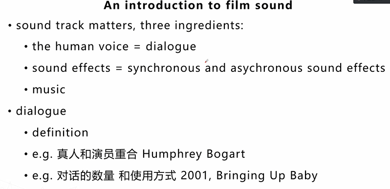

# 考试流程

纸笔考试阅读总共60分钟，但是没有单独填答题卡的时间，所以实际上只能做54分钟。写一篇，填一篇。

三篇文章。40道题。

四大类题型：（共13个小的类别）

1. 填空
   1. 简答、完成句子、无/有选项summary、表格题、图表标记、流程图
2. 判断
3. 选择（单选、多选）
4. 匹配
   1. 特殊词匹配、首尾句匹配、段落信息匹配、小标题。

填空、判断难度稍低；选择、匹配难度稍高。

27-29道题6.5分，30-32道7.0，33-34道7.5。平均一篇文章只能错2到3道题，才能保证7分以上。

60%考察基础词汇、句法；20%考察阅读理解、定位技巧；20%文章逻辑关系、判断力。

内容不固定，但是文章体裁只有两类，说明文 - 现象解释、议论文 - 问题解决。

## 其他

在答题卡上不能只写t或f，不能写缩写，要全部都写完，not given你要写成not given。

# 文章难度分析

1. 三篇难度随机
2. 第一篇难度大的比例有所提升
3. 第三篇一般比较简单

难在哪里？

1. 文章内容偏离日常生活接触的知识
   1. 咔嚓忽悠可的建筑群、古代的人
   2. 地理类的Grand Canyon
   3. 美国大峡谷的形成原因
   4. 地理学的洋流
   5. 心理学上情绪有关的大脑定量分析
   6. 语言学上的口哨

2. 题目回到原文同义替换的比例增加
   1. 以前你的题目和你的文章还能看到一些原文原词，但是现在就没有了，现在你在题目里看到这个词，你在文章中怎么都看不着这个词，往往都是同义词替换

## 优先选择容易题做

1. 四大类题型：（共13个小的类别）填空、判断难度稍低；选择、匹配难度稍高。
   1. 填空
      1. 简答、完成句子、无/有选项summary、表格题、图表标记、流程图
   2. 判断
   3. 选择（单选、多选）
   4. 匹配
      1. 特殊词匹配、首尾句匹配、段落信息匹配、小标题。
2. 如果题型看着差不多，就看文章的开头和topic。优先选择自己熟悉话题的文章。
2. 按阅读量
   1. 有的是不需要读太多的内容就能做得出来答案的
   2. 有的题目要求阅读量比较高，它需要你可能读一整篇，或者是可能读一个段落才能做对这种情况。
      1. 像选择和匹配就属于难度比较高，也就是阅读量比较高的题目
      2. 但并不是说所有的简单题型都一定简单，也并不是说所有的难的题型一直难
4. 按照文章长度来看的话，先做短文章，短的就意味着你所需要看的内容少，所以先做短的，如果长度也都差不多，那去看文章生词大概瞄一眼哪些文章里面生词最少，先做。

# 如何练习

每天打好基础语法和单词的就是练习。

## 词汇

在APP上背阅读词汇，一天背5组同义词替换（剑1~剑9同义替换、剑10同义替换、剑11同义替换、剑13同义替换），然后再看每一本不同书的时候去背它的必备词汇（雅思阅读必备词汇C4~C11），如果阅读分数想要在7.5分以上，单词量一定是在8000以上的，而且加上阅读技巧才能到7.5分以上，如果阅读技巧稍微弱一点的话，你就得到在10000、12000。

但是阅读的单词有一个特点就是在于它不需要你对这个单词有非常深刻的认知，你只需要看到这个单词认识，知道它的大概中文意思就行了，一定不要太准确，如果阅读词汇你的中文意思背得太准确的话，其实也不好，因为你就不能快速的找到它的同义词。比如说有个例子说的是地方的水利灌溉系统的improving，给人们带来了足够的食物。那题目说的是 advanced application system给人们带来了足够的食物。如果你想advanced和improving这俩词儿，advanced是先进的，improving是进步。如果背得非常的准确，把单词背得非常的死的话，可能会觉得他俩说的意思不是特别的一致，但是其实他俩说的就是一模一样的意思，都是先进、进步、高阶、好，用一句话总结就是他俩说的都是好，水的灌溉系统的好，到使这里的人们可以生活得很好。所以对于阅读词汇来讲的话，我们一定是建议大概意思范围就行了，这是词汇。

## 长难句不回读

去找句子的主谓宾。因为在阅读里面，你时间比较长的一个非常重要的点，其实就是在于我题目看完回到原文，原文看完以后第一遍我没看出来，我要再看一遍到底说的是什么，要看好几遍来达到我知道这个答案是什么的目的。这种情况下，就会花费比较长的时间来做题，所以一定要有长难句的不回读训练。

要做到看一遍就能够掌握到这句话里的主干是什么，修饰成分是什么，掌握到这句话的主要意思想表达的是什么，和题目里面的关系是什么。

## 两种联系阅读的方法

### 中英文对照阅读

第一种，中英文对照阅读，一段话，先把它翻译成英文，翻译完以后和英文原版进行对照，有出入。对我们现在的语言水平来看的话，包括口语、写作是有好处的。如果按照中英文对照阅读的训练进行训练下去的话，你会发现你的翻译能力有大幅度的进步和提升，就意味着你的写作和你的口语都会有进步，这个方法确实会比较费时间。不建议坚持看一本书，比如哈利波特小王子什么的，那些就有点不太能够直接的跟我们的写作相对应。建议看什么？建议去看写作范文，哪些翻译软件非常的好用，直接把它翻译成中文，我发的肯定都是英文写作范文，然后你就把它翻译成中文，然后中文看完以后一句一句翻译，然后对照一下写作范文，哪些表达方式我们没有，我们把它积累出来，这样的话就会更加的直接的针对于我们的雅思学习。

### 直接阅读

第二种，是直接阅读。直接阅读是什么？跟我们平时阅读中文书籍一样，我们直接阅读英文文章，直接阅读英文文章就是可以阅读。可以拿剑4及以后的的那些文章直接来阅读，以理解文章大概内容为目的。直接阅读一定要注意去读做过题目的文章。如果这篇文章题目还没有做，就不要去读它。因为一共我们剑桥真题就这么多，对吧？每一题按照考试的流程去练才是最好的。

或者读机经。机经是什么？就是以往的考试的可能存在的文章，就是以读文章为目的去看。

另外一个在读的时候要注意的一个点就是一定不要边查边读。所有的英语学习，包括口语，包括写作，包括听力，包括阅读，不要把所有的这些听说读写最终都练成考词汇。你可以从书中来判断陌生单词的意思，比如说写作的时候你想要写这个词，但是你不太会表达，你可以先尝试用其他的表达方式来把它替换出来，然后最后补充词汇，最后查一下这个单词和它的意思和你想象的一不一致。最后查一下这个表达方式——你想要用的，但是第一时间没有表达出来的，这就是补充词汇。

1. 读做过题目的文章
2. 读机经
3. 一定不要边查边读
4. 最后补充词汇

# 考试技巧

雅思阅读就两个方面：一是定位题眼、同义替换。二是阅读理解、归纳总结。

1. 定位且理解细节信息的能力——同义替换。
2. 归纳文章或者段落主要信息的能力——阅读能力。

## 定位题眼、同义替换

如果有明显题眼，做题的时候一定是先看题，再看文章。

1. 题目里面通常有题眼，要在文章里面找到题眼，就是所说的答案句，对比一下这两个说的是什么，然后选答案。
2. 对于那些结构性的题目，需要考察你的阅读能力，结构性的题目并不能在文章中找到非常明显的题眼，可能要看一段话或者是整篇文章来做这道题，比如说有的题目最后一篇，最后一题，他会问你这篇文章作者的意图是什么？这篇文章的开头是什么？这篇文章的主旨中心思想是什么？需要归纳文章或段落信息的能力，所以两个不同的能力对应的是我们不同的题目。

阅读之前补充定位——选择什么样的词作为定位词。有一些我们常见的或常选的词，第一个叫特殊词：两种情况，一个是题目里面有特殊词，一个是题目里面没有特殊词。

如果题目里面有特殊词最好，比如说一些大写名词，人名或者是地名，一些数字等等，大写的重要名词。这些比较好找，并且在文章中不会被替换。但是数字要注意，他可能会给你挖坑，他在题目里跟你说1890年，在文章里他可能会跟你说19世纪末。所以数字要警惕它的替换。大写数字或者是一些斜体或者是带符号等等的这些词，这些词儿相对来说，回归文章当中都比较好找，所以如果题目里有这些特殊词，就直接以它为定位词会文章找就可以了。

如果题目里没有特殊词，全都是一些小写的，平常的词汇，要用多点定位法：要选择more than one定位词，以避免漏掉信息，或者扫读的时候忽略了。所以多点定位是在句子的不同成分里面选名词或者是名词词组。主语选一个，宾语选一个，定语选一个，状语选一个，一般选2~3个，这样的话抓住大概的主、谓、宾、定、状等等的这些，再去对应的找意思相符合的大致范围。

## 同义替换

同义替换就是填空句子完成或简答找定位，然后理解细节信息，阅读能力匹配，找小标题等等这些段落主要信息。但是这个适合先看文章再做题。

所以我们的考试技巧先看文章再看题，还是先看题再看文章，都有自己的优缺点。如果我们先看文章的话，我们做题的准确率就会比较高，但是需要看的内容比较多，因为阅读量大；如果先看题，再看文章的话，阅读量比较小，但是有可能由于前后忽略了一个信息，导致做不对。所以我们要根据题目的特性选择不同的技巧，比如说细节信息题，一定是先看题，再看文章，如果是章篇结构体，可能先看文章再看题比较好，所以不同的题目我们选择不同的做题技巧。

# 阅读方法

扫读、略读、精读。

扫读只是为了找到定位词而已，不需要了解和认识里面的某一个词汇或者是某一个短语，或者是它的文章意思等等，找到那个点就行了。扫读完了以后，我们就找到了定位词，接下来就要去略读。

略读：去看一下定位词跟我的题目说的这个东西大概一不一致，方向一不一样，是不是我的题目范围，然后再精读。

精读：一字一句的去认真读这篇文章里面的词汇是什么，句法是什么，然后根据题目找答案。

## 扫读

扫读适合题目中有明显定位词，回到原文中找到定位词就可以解题了。那么在这种情况下来一定要注意，扫读不是逐字逐句阅读，用w阅读法。

w阅读法是什么意思？不是横着看，而是横竖结合——斜着下斜着上，每次w阅读5行。视线范围内可以在同一时间最大限度的看到最多的内容。

## 略读

略读适合题目本身是概括总结性的话语，只需要看大致意思就可以了，只需要看文章主旨就行了。有选择性的阅读，跳过细节，抓取文章大概。

## 精读

精读要求就会比较高，主要就考练习了。

第一就是找长难句。就是一套题中，选三篇文章里错题最多的那篇进行精读。精读是要把文章里面所有的长难句都找出来，把里面的生词整理出来，要求对文章背景有所了解，把文章的结构体系和逻辑关系都找出来。那么其中长难句找出来以后，按照我们长难句进行分析，看这个句子的主语是谁，谓语是谁。先看句子主句是谁，然后分句修饰成分是什么等等。

第二，找里面的不认识的单词，包括一些重要名词，包括一些文章，特殊情况，比如文章讲的Marine mammals，海洋里面的哺乳动物，它里面肯定会讲到各种各样的名词，各种各样的哺乳动物的名字等等，这些也得整理出来，得了解。

第三，了解文章的背景，除了这篇文章说的海洋的哺乳动物以外，它还可能有哪些方面。自己通过搜索引擎查找。

第四个也是最重要的，即整理出文章的体系结构和逻辑关系，这些体系结构和逻辑关系可以帮助你理解与之相同类的文章的所有的体系结构和逻辑关系，还能帮助你进行写作的逻辑关系和体系结构的level up。但并不是翻译这篇文章，不是把这篇文章逐字逐句的翻译出来去理解它是什么，而是用你自己的话去总结它。比如说这篇文章说的是introduction to film sound，这篇文章的题目讲的就是电影声音，然后刚开始告诉你film sound很重要，它其中有三种表达方式，第一种是人声，就是我们所说的对白，第二种是音效，管乐和弦乐，第三种是音乐。即：先给你对于film sound上的一个introduction，然后再逐一去解释：对白的definition是什么；举例：真人和演员重合；举例：对话的数量和使用方式。体系结构其实是：看文章是从词看到句子，从句子看到意群，从意群看到章篇。

# 日常工作

同义词。

长难句分析。
