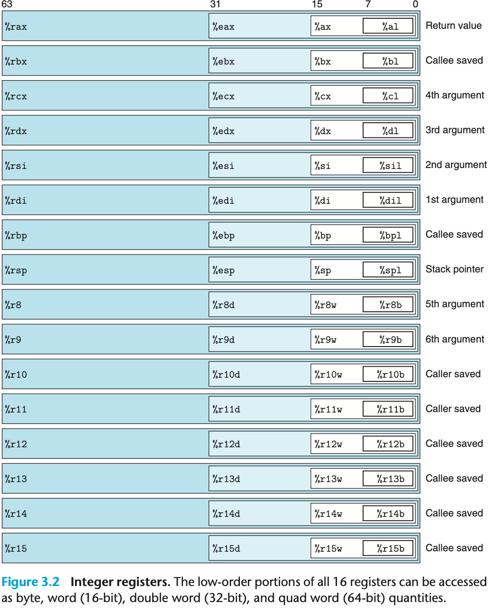
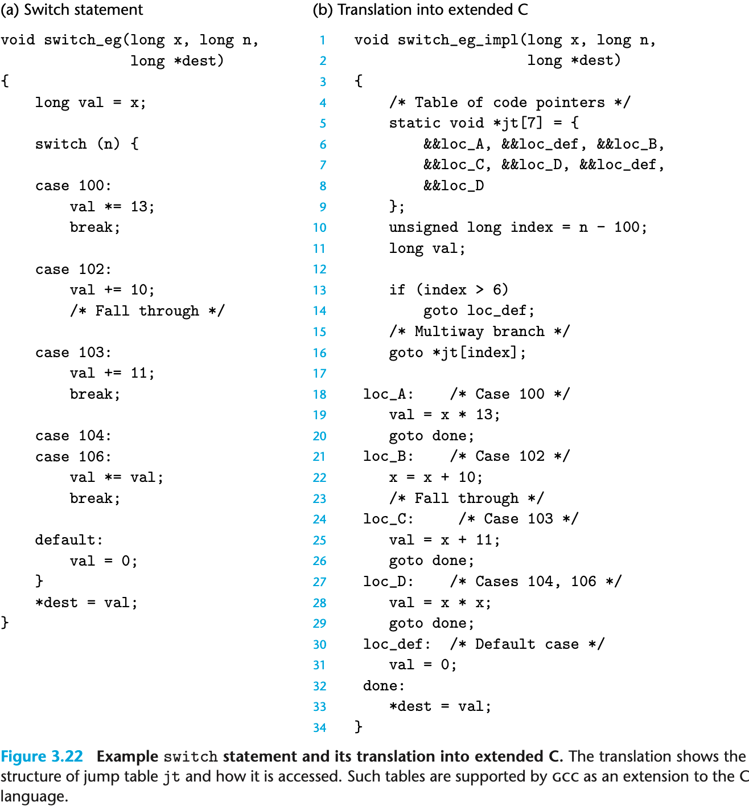
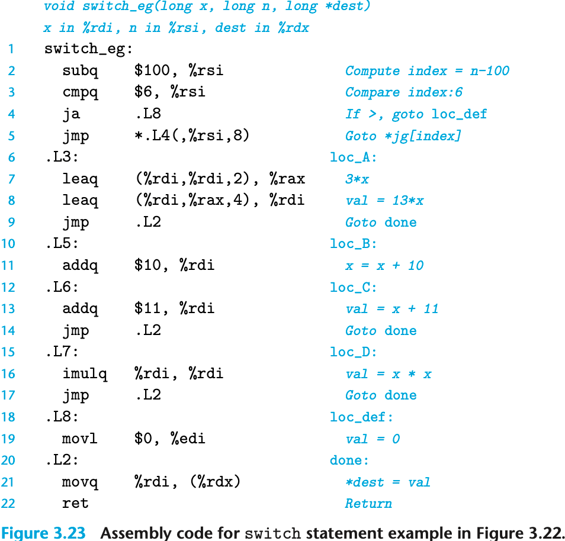
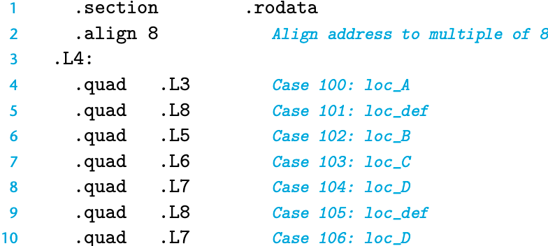

# 处理器

中央处理单元（CPU），简称处理器，是解释（或执行）存储在主存中指令的引擎。处理器的核心是一个大小为一个字的存储设备（或寄存器），称为程序计数器（PC）。在任何时刻，PC都指向主存中的某条机器语言指令（即含有该条指令的地址）。

# 一些常见的寄存器

程序计数器（通常称为"PC"，在 x86-64 中用`%rip`表示）给出将要执行的下一条指令在内存中的地址。

**整数寄存器文件**包含 16 个命名的位置，分别存储 64 位的值。这些寄存器可以存储地址（对应于C语言的指针）或整数数据。有的寄存器被用来记录某些重要的程序状态，而其他的寄存器用来保存临时数据，例如过程的参数和局部变量，以及函数的返回值。

**条件码寄存器**保存着最近执行的算术或逻辑指令的状态信息。它们用来实现控制或数据流中的条件变化，比如说用来实现 if 和 while 语句。

**一组向量寄存器**可以存放一个或多个整数或浮点数值。
## x86-64 CPU 通用寄存器

16 个 64 位 通用寄存器，用于存储整数数据和指针。名字都以 `%r` 开头。

最初 8086 有 8 个 16 位的寄存器。标号从 `%ax` 到 `%bp`。
扩展到 IA32 架构时，这 8 个寄存器扩展成 32 位寄存器，标号从 `%eax` 到 `%ebp`。
扩展到 x86-64 后，原来的 8 个寄存器扩展成 64 位，标号从 `%rax` 到 `%rbp`。除此之外，增加了 8 个新的寄存器，它们的标号按照新的命名规则制定：从 `%r8` 到 `%r15`。



如图中嵌套的方框标明的，指令可以对这 16 个寄存器的低位字节中存放的不同大小的数据进行操作。字节级（8 位）操作可以访问最低的字节，16 位操作可以访问最低的 2 个字节，32 位操作可以访问最低的 4 个字节，而 64 位操作可以访问整个寄存器（8 个字节）。

复制和生成 1 字节、2 字节、4 字节和 8 字节值这些指令以寄存器作为目标时，对于生成小于 8 字节结果的指令，寄存器中剩下的字节会怎么样，对此有两条规则：生成 1 字节和 2 字节数字的指令会保持剩下的字节不变；生成 4 字节数字的指令会把高位 4 个字节置为 0。后面这条规则是作为从 IA32 到 x86-64 的扩展的一部分而采用的。

不同的寄存器扮演不同的角色。其中最特别的是栈指针 `%rsp`，用来指明运行时栈的结束位置。有些程序会明确地读写这个寄存器。
另外 15 个寄存器的用法更灵活。少量指令会使用某些特定的寄存器。
更重要的是，有一组标准的编程规范控制着如何使用寄存器来管理栈、传递函数参数、返回函数值，以及存储局部和临时数据。
## 一组 1 位的条件码寄存器（CF、ZF、SF、OF）
除了整数寄存器，CPU还维护着一组单个位的条件码（condition code）寄存器，它们描述了最近的算术或逻辑操作的属性。可以检测这些寄存器来执行条件分支指令。最常用的条件码有：

CF（Carry Flag）：无符号进位标志。最近的操作使最高位产生了进位。可用来检查无符号操作的溢出。
ZF（Zero Flag）：零标志。最近的操作得出的结果为0。
SF（Sign Flag）：符号（负数）标志。最近的操作得到的结果为负数。
OF（Overflow Flag）：有符号溢出标志。最近的操作导致一个补码溢出——正溢出或负溢出。
# 指令和操作数
## 操作数指示符

立即数：常数值。ATT 格式的汇编代码，书写方式是 `$-577` 或者 `$0x1F`。汇编器会自动选择最紧凑的方式进行数值编码。

寄存器：表示某个寄存器的内容。可以表示 1、2、4、8 个字节。

内存引用：根据计算出来的地址（通常称为有效地址）访问某个内存位置。

## 寻址模式
允许不同形式的内存引用。

语法：$Imm(r_b,r_i,s)$。有效地址计算公式为：$Imm + R[r_b] + R[r_i] \cdot s$
1. 立即数偏移 $Imm$
2. 基址寄存器 $r_b$，必须是 64 位寄存器。
3. 变址寄存器 $r_i$，必须是 64 位寄存器。
4. 比例因子 $s$，必须是 1、2、4、8

引用数组元素时会用到这种通用形式，其他都是这个通用形式的特殊情况，比如省略了某部分。

| 类型  | 格式               | 操作数值                          | 名称               |
| --- | ---------------- | ----------------------------- | ---------------- |
| 立即数 | $Imm$            | $Imm$                         | 立即数寻址（不用寻址）      |
| 寄存器 | $r_a$            | $R[r_a]$                      | 寄存器寻址（访问寄存器）     |
| 存储器 | $Imm$            | $M[Imm]$                      | 绝对值寻址            |
| 存储器 | $(r_a)$          | $M[R[r_a]]$                   | 间接寻址（寄存器内的值作为地址） |
| 存储器 | $Imm(r_b)$       | $M[Imm+R[r_b]]$               | （基址+偏移量）寻址       |
| 存储器 | $(r_b,r_i)$      | $M[R[r_b]+R[r_i]]$            | 变址寻址             |
| 存储器 | $Imm(r_b,r_i)$   | $M[Imm+R[r_b]+R[r_i]]$        | 变址寻址             |
| 存储器 | $(,r_i,s)$       | $M[R[r_i]\cdot s]$            | 比例变址寻址           |
| 存储器 | $Imm(,r_i,s)$    | $M[Imm+R[r_i]\cdot s]$        | 比例变址寻址           |
| 存储器 | $(r_b,r_i,s)$    | $M[R[r_b]+R[r_i]\cdot s]$     | 比例变址寻址           |
| 存储器 | $Imm(r_b,r_i,s)$ | $M[Imm+R[r_b]+R[r_i]\cdot s]$ | 比例变址寻址           |
## 数据传送指令

最频繁使用的指令是将数据从一个位置复制到另一个位置。

MOV 类指令：movb、movw、movl 和 movq。这些指令都执行同样的操作；主要区别在于它们操作的数据大小不同：分别是 1、2、4 和 8 字节。
>源操作数指定的值是一个立即数，存储在寄存器中或者内存中。目的操作数指定一个位置，要么是一个寄存器或者，要么是一个内存地址。X86-64 加了一条限制，传送指令的两个操作数不能都指向内存位置。

MOVZ、MOVS：在将较小的源值复制到较大的目的时使用。
MOVZ 类指令：把数据从源（在寄存器或内存中）复制到目的寄存器。MOVZ 类中的指令把目的中剩余的字节填充为 0。
MOVS 类指令：通过符号扩展来填充，把源操作的最高位进行复制。

## 压入、弹出栈操作

通过 push 操作把数据压入栈顶，通过 pop 操作删除栈顶数据。栈指针 `%rsp` 保存着栈顶元素的地址。

它具有一个属性：弹出的值永远是最近被压入而且仍然在栈中的值。

`pushq` 指令的功能是把数据压入到栈上，而 `popq` 指令是弹出数据。这些指令都各只有一个操作数——压入的数据源 和 弹出到哪里。

将一个四字值压入栈中，首先要将栈指针减 8 ，然后将值写到新的栈顶地址。因此，指令 `pushq %rbp` 的行为等价于下面两条指令：

```asm
subq  $8,    %rsp   # Decrement stack pointer
movq  %rbp, (%rsp)  # Store %rbp on stack
```

它们之间的区别是在机器代码中 pushq 指令编码为 1 个字节，而上面那两条指今一共需要 8 个字节。


弹出一个四字的操作包括从栈顶位置读出数据，然后将栈指针加 8。因此，指令 `popq %rax` 等价于下面两条指令：

```asm
movq  (%rsp), %rax  # Read %rax from stack
addq   $8,    %rsp  # Increment stack pointer
```

栈和程序代码以及其他形式的程序数据都是放在同一内存中，所以程序可以用标准的内存寻址方法访问栈内的任意位置。例如，假设栈顶元素是四字，指令 `movq 8(%rsp), %rdx` 会将第二个四字从栈中复制到寄存器 `%rdx`。
## 算术、逻辑操作

ADD 由四条加法指令组成：addb、addw、addl 和 addq

加载有效地址、一元操作、二元操作和移位。

二元操作有两个操作数，而一元操作有一个操作数。

| 指令          | 效果                                  | 描述         |
| ----------- | ----------------------------------- | ---------- |
| `leaq S, D` | `D <- &S`                           | 加载有效地址     |
| `INC D`     | `D <- D + 1`                        | 加 1        |
| `DEC D`     | `D <- D - 1`                        | 减 1        |
| `NEG D`     | `D <- -D`                           | 取负         |
| `NOT D`     | `D <- ~D`                           | 取补         |
| `ADD S, D`  | `D <- D + S`                        | 加          |
| `SUB S, D`  | `D <- D - S`                        | 减          |
| `IMUL S, D` | `D <- D * S`                        | 乘          |
| `XOR S, D`  | $D \leftarrow D \textasciicircum S$ | 异或         |
| `OR S, D`   | $D \leftarrow D \mid S$             | 或          |
| `AND S, D`  | `D <- D & S`                        | 与          |
| `SAL k, D`  | $D \leftarrow D \texttt{<<} k$      | 左移         |
| `SHL k, D`  | $D \leftarrow D \texttt{<<} k$      | 左移（等同于SAL） |
| `SAR k, D`  | $D \leftarrow D \texttt{>>}_A k$    | 算术右移       |
| `SHR k, D`  | $D \leftarrow D \texttt{>>}_L k$    | 逻辑右移       |
leaq 指令不改变任何条件码，因为它是用来进行地址计算的。除此之外，以上列出的所有指令都会设置条件码。对于逻辑操作，例如 XOR，进位标志和溢出标志会设置成 0。对于移位操作，进位标志将设置为最后一个被移出的位，而溢出标志设置为 0。INC 和 DEC 指令会设置有符号溢出和零标志，但是不会改变无符号进位标志。
### leaq
`leaq`：load effective address，加载有效地址，实际上是 `movq` 的变形。目的操作数必须是一个寄存器。
`leaq  S, D`。效果：`D <- &S`
虽然指令形式是从内存读数据到寄存器，但实际上根本就没有引用内存。它的第一个操作数看上去是一个内存引用，但该指令并不是从指定的位置读入数据，而是将有效地址写入到目的操作数。

例如，如果寄存器 `%rdx` 的值为 `x`，那么指令 `leaq 7(%rdx, %rdx, 4), %rax` 将设置寄存器 `%rax` 的值为 `5x+7`。

>`leaq` (Load Effective Address Quad-word) 确实是汇编初学者最容易感到困惑的指令之一，因为它名为“加载地址”，但经常被编译器用来“做数学题”。

简单来说，可以把 `leaq` 理解为**借用了“内存寻址硬件电路”来进行“算术运算”的指令**。

核心概念：它只算，不取

为了理解 `leaq`，先对比一下它和 `movq` 的区别。假设 `%rdx` 寄存器里存的是一个内存地址 `0x100`。

- **`movq (%rdx), %rax`**
    - **动作**：计算出地址（`0x100`），然后**去访问内存**，把地址 `0x100` 里的数据取出来，放入 `%rax`。
    - **类比**：查到快递柜的取件码，**打开柜子，把包裹拿回家**。
- **`leaq (%rdx), %rax`**
    - **动作**：计算出地址（`0x100`），**直接停手**。它**不访问内存**，而是把“计算出来的这个地址值”（即 `0x100` 这个数字）直接写入 `%rax`。
    - **类比**：查到快递柜的取件码，**把取件码抄在纸上**，结束。

**一句话总结：`leaq` 只是利用了 CPU 内部计算地址的那个电路，来算出一个数值。**

破解那个 "5x + 7" 的例子：利用了 x86 处理器非常强大的**内存寻址模式**。在 x86 中，内存引用的通用格式是：
$$D(B, I, S)$$

它代表的数值（有效地址）计算公式是：
$$\text{结果} = \text{Base}(基址) + \text{Index}(变址) \times \text{Scale}(比例因子) + \text{Displacement}(位移)$$

也就是：
$$\text{结果} = B + I \times S + D$$

现在把例子代入进去：

指令：`leaq 7(%rdx, %rdx, 4), %rax`

已知：`%rdx` 的值为 x。

- **D (位移)** = $7$
- **B (基址)** = `%rdx` = $x$
- **I (变址)** = `%rdx` = $x$
- **S (比例因子)** = $4$

计算过程：
$$\text{结果} = x + (x \times 4) + 7$$
$$\text{结果} = x + 4x + 7$$
$$\text{结果} = 5x + 7$$

这就是为什么它算出了 $5x+7$。编译器非常聪明，它发现这一条指令就能完成“乘法”和“加法”的组合，比写一条 `imul` (乘法) 再写一条 `add` (加法) 要快得多。

`leaq` 的两大用途

在 CSAPP 和实际编程中，`leaq` 主要做两件事：

用途一：真正的取地址（C 语言的 `&` 运算符）

这是它的本职工作。如果想获取数组中某个元素的地址，而不是元素的值。    
```c
int *p = &a[i]; // 获取 a[i] 的地址
```
汇编：
leaq 会根据 a 的起始地址和 i 的偏移量算出该元素的内存地址，存入指针 p 中。

用途二：快速算术运算（编译器的“骚操作”）

这是它的兼职工作，也就是你看到的 $5x+7$。

编译器非常喜欢用 leaq 来执行加法和简单的乘法（乘以 1, 2, 4, 8），原因如下：
1. **单指令多步运算**：一条指令可以完成 `a + b*4 + c` 这种复杂运算。
2. **不影响标志位**：普通的 `add` 或 `sub` 指令会改变 CPU 的状态标志（如进位标志、零标志），可能会影响后续的条件跳转。而 `leaq` 单纯只是算个数，**完全不修改标志寄存器**，这让编译器在安排指令流水线时更自由、更安全。

## 控制指令（CMP、TEST、SET、JMP）
有两类指令，只改变条件码而不改变其他寄存器。——CMP 和 SET
### CMP 指令
CMP 指令根据 2 个操作数之差来设置条件码。除了只设置条件码而不更新目的寄存器之外，CMP 指令与 SUB 指令的行为是一样的。基于两个操作数相减。
如果两个操作数相等，CMP 指令会将零标志设置为1。
### TEST 指令
除了只设置条件码而不改变目的寄存器的值，TEST 指令的行为与 AND 指令一样。基于两个操作数相按位与。

看似无用的用法：`testq %rax, %rax`。或者其中一个操作数是一个掩码，用来指示哪些位应该被测试。

`testq %rax, %rax` 是汇编语言中非常经典的一个**习惯用法（Idiom）**，它的核心作用是：**检查寄存器 `%rax` 的值是正数、负数还是零，而不改变 `%rax` 中的值。**

它的原理是什么？
`TEST` 指令的行为与 `AND` 指令非常相似，它对两个操作数进行**按位与（Bitwise AND）**运算。
- **运算**：`%rax & %rax`。
- **结果**：任何数和自己做“按位与”，结果还是它自己。
- **区别**：普通的 `AND` 指令会把结果写回寄存器，但 `TEST` 指令**只设置条件码（标志位），丢弃运算结果**。

它影响了哪些标志位？
因为运算结果就是 `%rax` 本身，所以 CPU 会根据 `%rax` 的当前值来设置标志位：
- **ZF (零标志)**：如果 `%rax` 等于 **0**，ZF 被置为 1。
- **SF (符号标志)**：如果 `%rax` 是**负数**（最高位为 1），SF 被置为 1。
- **OF (溢出标志)**：`TEST` 指令总是将 OF 清零，因为它不会产生溢出。

为什么要这样写？
这是一种“只看不动”的检测方法。程序员通常会在条件跳转指令（如 `je`, `jns`, `jg`）之前使用它。

**常见场景：**
- `je` (Jump if Equal) $\rightarrow$ 如果 `%rax == 0` 则跳转。
- `js` (Jump if Signed) $\rightarrow$ 如果 `%rax < 0` 则跳转。
- `jne` (Jump if Not Equal) $\rightarrow$ 如果 `%rax != 0` 则跳转。

总结
当看到 `testq %var, %var` 这种“自己测试自己”的代码时，由于任何数 `AND` 自己都等于自己，可以直接把它翻译成高级语言的：

`if (var == 0) ...` 或 `if (var < 0) ...`
### SET 指令
核心功能

SET 指令本身不进行比较，它只负责读取上一条指令（通常是 cmp 或 test）留下的状态标志（如 ZF, SF, OF），并根据某种逻辑组合，向目标操作数写入 0 或 1。如果条件成立：写入 1。如果条件不成立：写入 0。

关键特性目标大小仅为 1 字节：SET 指令的目的操作数只能是 8 位寄存器（如 `%al`）或者一个字节的内存位置。

后缀的含义不同：通常汇编指令的后缀表示操作数大小（如 `movl` 表示移动 Long 4 字节）。但在 SET 指令中，后缀表示条件。
`setl` 不是 "Set Long"，而是 "Set if Less"（小于时置位）。
`setb` 不是 "Set Byte"，而是 "Set if Below"（低于时置位，用于无符号数）。

setl (小于时置位)：它不仅仅看符号位，还要考虑溢出：

逻辑公式：$D \leftarrow SF \oplus OF$ (符号标志 XOR 溢出标志)。

原理：如果没有溢出 ($OF=0$)：结果为负 ($SF=1$) 就代表小于。如果发生了溢出 ($OF=1$)：比如两个很大的正数相减变成了负数（正溢出），或者两个负数相减变成了正数（负溢出），此时符号位 $SF$ 会因为溢出而取反。因此，必须将 $SF$ 和 $OF$ 进行异或运算，才能得到真实的数学上的“小于”关系。
> 正溢出：两个正数相加，结果大到超过了最大上限（比如 8 位中的 +127），导致最高位（符号位）被进位冲刷成了 1，计算机因此错误地把它当成了负数。
> 负溢出：两个负数相加（或负数减正数），结果小到跌破了最小下限（比如 8 位中的 -128），导致符号位“借位”改变，计算机错误地把它当成了正数。
> 当发生这两种情况时，OF 就会设为 1。


高位清零需求：因为 SET 只改变最低的一个字节（例如只改 `%rax` 里的 `%al` 部分），如果需要得到一个完整的 32 位或 64 位结果（比如 C 语言里的 int 或 long 类型的 0 或 1），通常需要紧接着使用 movzbl（Move Zero-Extended Byte to Long）指令来把高位清零。

### JMP 指令
在产生目标代码文件时，汇编器会确定所有带标号指令的地址，并将跳转目标（目的指令的地址）编码为跳转指令的一部分。

汇编语言中，直接跳转是给出一个标号作为跳转目标的，例如上面所示代码中的标号".L1"。间接跳转的写法是`'*'`后面跟一个操作数指示符。


在汇编代码中，跳转目标用符号标号书写。汇编器，以及后来的链接器，会产生跳转目标的适当编码。跳转指令有几种不同的编码，但是最常用都是 PC 相对的（PC-relative）。也就是，它们会将目标指令的地址与紧跟在跳转指令后面那条指令的地址之间的差作为编码。这些地址偏移量可以编码为1、2或4个字节。第二种编码方法是给出"绝对"地址;用4个字节直接指定目标。汇编器和链接器会选择适当的跳转目的编码。

当执行 PC相对寻址时，程序计数器的值是跳转指令后面的那条指令的地址，而不是跳转指令本身的地址。这种惯例可以追溯到早期的实现，当时的处理器会将更新程序计数器作为执行一条指令的第一步。


条件跳转：

| 指令             | 同义名  | 跳转条件                               | 描述                  |
| -------------- | ---- | ---------------------------------- | ------------------- |
| jmp Label      |      | 1                                  | 直接跳转                |
| jmp `*Operand` |      | 1                                  | 间接跳转                |
| je Label       | jz   | ZF                                 | 相等 / 0              |
| jne Label      | jnz  | ~ZF                                | 不相等 / 非0            |
| js Label       |      | SF                                 | 负数                  |
| jns Label      |      | ~SF                                | 非负数                 |
| jl Label       | jnge | `SF ^ OF`                          | 小于（有符号`<`）          |
| jle Label      | jng  | $(SF \textasciicircum OF) \mid ZF$ | 小于或等于（有符号`<=`）      |
| jg Label       | jnle | `~(SF ^ OF) & ~ZF`                 | 不小于等于（有符号大于）        |
| jge Label      | jnl  | `~(SF ^ OF)`                       | 不小于（有符号大于或等于）       |
| jb Label       | jnae | CF                                 | 低于（无符号<）：b表示Below   |
| jbe Label      | jna  | $CF \mid ZF$                       | 低于或相等（无符号`<=`）      |
| jae Label      | jnb  | $\sim CF$                          | 超过或相等（无符号`>=`）      |
| ja Label       | jnbe | $\sim CF \& \sim ZF$               | 超过（无符号`>`）：a表示Above |
jl、jb 这种起名方法和 SET 指令很相似。

#### 条件传送（cmov）——解决现代处理器流水线和分支预测的性能问题
使用数据的传送（Data Transfer）来替代传统的控制转移（Control Transfer/Jump）。

为什么要引入“条件传送”？
传统的 `if-else` 语句通常编译成条件跳转（Conditional Jump）指令。

- **传统的做法（控制转移）**：CPU 走到分支点，必须猜还要往哪边走（是执行 `if` 里的代码还是 `else` 里的）。如果猜对了，速度很快；但如果**猜错了（分支预测错误）**，CPU 就必须清空流水线，丢弃已经做了一半的工作，重新加载正确的指令。这会带来严重的性能惩罚（图中提到大约 15~30 个时钟周期）。
- **问题的根源**：现代处理器使用“流水线”技术来提高性能，这要求处理器必须能极其准确地预测下一条指令在哪里。对于随机性很强的判断（例如 `x < y` 的结果完全随机），预测错误率很高，导致性能急剧下降。

“条件传送”是如何工作的？

**条件传送**（如图中的 `cmov` 指令）采用了一种完全不同的策略：**它不进行跳转，而是把两条路都走一遍。**
- **逻辑**：
    1. 不管条件成不成立，**同时计算**出 `if` 分支的结果（设为 `val1`）和 `else` 分支的结果（设为 `val2`）。
    2. 最后使用一条 `cmov` 指令，根据条件码（Condition Codes），决定是把 `val1` 还是 `val2` 赋值给最终的变量。
- 例子（absdiff 函数）：
    要计算 `result = x < y ? y-x : x-y;`
    - **汇编做法**：
        1. 先算出 `y-x` (存入 `%rax`)。
        2. 再算出 `x-y` (存入 `%rdx`)。
        3. 比较 `x` 和 `y` (`cmpq %rsi, %rdi`)。
        4. `cmovge %rdx, %rax`：如果 `x >= y`，就把 `%rdx` 的值挪进 `%rax`；否则保持 `%rax` 不变。

这种特性的优缺点
- **优点**：
    - **保持流水线满载**：因为没有“跳转”指令，CPU 不需要预测往哪跳，它只是按顺序执行指令。控制流不依赖于数据，这让流水线非常顺畅。
    - **性能稳定**：无论条件是真还是假，执行的时间都是固定的。
- **缺点**：
    - 如果两个分支的计算量都非常大，那么“都算一遍”可能会比“猜错重来”更慢。
    - 如果分支里有副作用（比如修改了全局变量），就不能用这种方法。
#### switch 语句
和使用一组很长的 if-else 语句相比，使用跳转表的优点是执行开关语句的时间与开关情况的数量无关。

GCC 根据开关情况的数量和开关情况值的稀疏程度来翻译开关语句。
当开关情况数量比较多（例如4个以上），并且值的范围跨度比较小时，就会使用跳转表。

执行 switch 语句的关键步骤是通过跳转表来访问代码位置。在 C 代码中是第 16 行，一条 goto 语句引用了跳转表 jt。GCC支持 `计算的 goto`（computed goto），是对 C 语言的扩展。在汇编代码版本中，类似的操作是在第 5 行，jmp 指令的操作数有前缀`'*'`，表明这是一个间接跳转，操作数指定一个内存位置，索引由寄存器 `%rsi` 给出，这个寄存器保存着 index 的值。
C 代码将跳转表声明为一个有 7 个元素的数组，每个元素都是一个指向代码位置的指针。这些元素跨越 index 的值 0 ～ 6，对应于 n 的值 100 ～1 06。可以观察到，跳转表对重复情况的处理就是简单地对表项 4 和 6 用同样的代码标号（`loc_D`），而对于缺失的情况的处理就是对表项 1 和 5 使用默认情况的标号（`loc_def`）。





汇编代码中，跳转表的声明形式如下：


这些声明表明，在叫做`.rodata`（只读数据，Read-Only Data）的目标代码文件的段中，应该有一组7个"四"字（8个字节），每个字的值都是与指定的汇编代码标号（例如`.L3`）相关联的指令地址。标号`.L4`标记出这个分配地址的起始。与这个标号相对应的地址会作为间接跳转（第5行）的基地址。

# 关于 64 位在实际的实现
> 易混淆注意热身：地址是什么？单位是什么？——地址的单位是字节。这个内存地址中的数据包默认由 8 位组成，如果是 16 进制，则 0xff 则表示：1111 1111。即 1 个 16 进制数可以表示 4 位。


在任意给定的时刻，只有有限的一部分虚拟地址被认为是合法的。例如，x86-64 的虚拟地址是由 64 位的字来表示的。在目前的实现中，这些地址的高 16 位必须设置为0，所以一个地址实际上能够指定的是 $2^{48}$ 或 256TB 范围内的一个字节。


# 栈上的局部存储
需要把数据存放到内存中的情况：

1. 寄存器不足够存放所有的本地数据。
2. 对一个局部变量取地址运算符`&`
3. 某些局部变量是数组或结构，因此必须能够通过数组或结构引用被访问到。

# 寄存器中的局部存储空间
寄存器组是唯一被所有`过程`共享的资源。

虽然在给定时刻只有一个过程是活动的，我们仍然必须确保当一个过程（调用者）调用另一个过程（被调用者）时，被调用者不会覆盖调用者稍后会使用的寄存器值。为此，x86-64 采用了一组统一的寄存器使用惯例，所有的过程（包括程序库）都必须遵循。

根据惯例，寄存器 `%rbx`、`%rbp` 和 `%r12 ~ %r15` 被划分为`被调用者保存`寄存器（callee saved）。当过程 P 调用过程 Q 时，Q 必须保存这些寄存器的值，保证它们的值在 Q 返回到 P 时与 Q 被调用时是一样的。过程 Q 保存一个寄存器的值不变，要么就是根本不去改变它，要么就是把原始值压入栈中，改变寄存器的值，然后在返回前从栈中弹出旧值。压入寄存器的值会在栈帧中创建标号为"保存的寄存器"的一部分。

所有其他的寄存器，除了栈指针 `%rsp`，都分类为`调用者保存`寄存器（caller saved）。这就意味着任何函数都能修改它们。可以这样来理解"调用者保存"这个名字：过程 P 在某个此类寄存器中有局部数据，然后调用过程 Q。因为 Q 可以随意修改这个寄存器，所以在调用之前首先保存好这个数据是 P（调用者）的责任。

# 数据对齐
许多计算机系统对基本数据类型的合法地址做出了一些限制，要求某种类型对象的地址必须是某个值 K（通常是 2、4 或 8）的倍数。这种对齐限制简化了形成处理器和内存系统之间接口的硬件设计。

假设一个处理器总是从内存中取 8 个字节，则地址必须为 8 的倍数。如果我们能保证将所有的 double 类型数据的地址对齐成 8 的倍数，那么就可以用一个内存操作来读或者写值了。否则，我们可能需要执行两次内存访问，因为对象可能被分放在两个 8 字节内存块中。
## 编译器为了对齐做的工作
编译器在汇编代码中放入命令，指明全局数据所需的对齐。

例如，跳转表的汇编代码声明在第 2 行包含下面这样的命令：
`.align 8`
这就保证了它后面的数据（在此，是跳转表的开始）的起始地址是 8 的倍数。因为每个表项长 8 个字节，后面的元素都会遵守 8 字节对齐的限制。

## 强制对齐的情况
对于大多数 x86-64 指令来说，保持数据对齐能够提高效率，但是它不会影响程序的行为。

另一方面，如果数据没有对齐，某些型号的 Intel 和 AMD 处理器对于有些实现多媒体操作的 SSE 指令，就无法正确执行。这些指令对 16 字节数据块进行操作，在 SSE 单元和内存之间传送数据的指令要求内存地址必须是 16 的倍数。任何试图以不满足对齐要求的地址来访问内存都会导致异常，默认的行为是程序终止。

因此，任何针对 x86-64 处理器的编译器和运行时系统都必须保证分配用来保存可能会被 SSE 寄存器读或写的数据结构的内存，都必须满足 16 字节对齐。

这个要求有两个后果∶
1. 任何内存分配函数（alloca、malloc、calloc 或 realloc）生成的块的起始地址都必须是16的倍数。
2. 大多数函数的栈帧的边界都必须是 16 字节的倍数。（这个要求有一些例外。）

较近版本的 x86-64 处理器实现了 AVX 多媒体指令。除了提供 SSE 指令的超集，支持 AVX 的指令并没有强制性的对齐要求。


* **原因**：SSE 指令通常一次性搬运 **16 字节**（128 位）的数据块。为了硬件设计的简化和读写的高效，早期的 SSE 指令要求内存地址必须是 **16 的倍数**（即地址的最后一位十六进制数必须是 `0`）。
### SSE 是什么
Streaming SIMD Extensions（流式单指令多数据扩展）

它是 Intel 在 1999 年推出的一种 CPU 指令集扩展。为了**加速多媒体处理**（如视频解码、3D 图形渲染、音频处理）而设计的“大规模并行计算”工具。

#### SIMD（单指令多数据）
SSE 最大的特点是引入了 **SIMD (Single Instruction, Multiple Data)** 技术。
* **传统方式 (SISD)**：做 4 次加法需要执行 4 条指令。
    * `1 + 1 = 2`
    * `2 + 2 = 4`
    * ...
* **SSE 方式 (SIMD)**：**一条指令**同时处理**多个数据**。
    * SSE 引入了全新的 **128 位寄存器（XMM 寄存器）**。
    * 因为 128 位 = 16 字节，它可以容纳 4 个 32 位的 `float`（浮点数）或者 4 个 32 位的 `int`。
    * 一条 SSE 指令可以让这 4 组数字同时相加，效率理论上提升了 4 倍。

#### 它的继任者：AVX

文中最后提到了一句 **AVX**。
AVX 是 SSE 的升级版，它引入了更宽的 256 位寄存器（YMM）。

较新的 AVX 指令**没有强制性的对齐要求**，这意味着现在的 CPU 即使读写没有对齐的内存，也不会直接崩溃了（虽然速度可能会慢一点）。


# 虚拟内存
概念上来说，虚拟内存被组织为一个由**存放在磁盘上**的$N$个连续的字节大小的单元组成的数组。

## 几个名词

### MMU
Memory Management Unit，内存管理单元。它是一个专用硬件，利用存放在主存中的查询表来动态翻译虚拟地址，这个查询表由操作系统管理。

### TLB
Translation Lookaside Buffer。CPU 内部的极高速缓存，用来存放 虚拟页号 到 物理页号的映射。


`C++` 执行一条指令。

读取内存时，`MOV RAX, [0x1234000]`时，CPU 看到的 `0x1234000` 就是虚拟地址（VA）。

要拿到真正的物理地址，过程大致如下：
1. 切分地址
    * 虚拟地址：$VA = VPN\text{(Virtual Page Number)}+Offset$
    * 物理地址：$PA = PPN\text{(物理页号)} + Offset$
    * Offset 是页内偏移量，低位，通常是 12 bit，对应 4 KB 页大小。
2. 查询 TLB (Translation Lookaside Buffer)——性能的关键
    * 它是 CPU 内部的一个极高速缓存，专门用来存 `"VA -> PA"` 的映射关系。也就是说，通过 TLB 能查到 物理页号。
    - **TLB Hit (命中)**: 运气好！MMU 直接从 TLB 拿到物理页号，拼上 Offset，直接发给 L1 Cache/内存。**耗时：0~1 个周期**
    - **TLB Miss (未命中)**: 麻烦了。CPU 必须暂停当前的快乐时光，去内存里翻阅“黄页”（页表）。
3. Page Walk（页表游走）——性能杀手
    * 如果 TLB Miss，MMU 硬件会自动去内存中查询页表（Page Table）。在 x86-64 架构下，这是一个 4级页表 结构（`PML4 -> PDP -> PD -> PT`）。
    * CPU 读取 `CR3` 寄存器，找到页表根目录。
    * 第 1 次访存：查 Level 4 表。
    * 第 2 次访存：查 Level 3 表。
    * 第 3 次访存：查 Level 2 表。
    * 第 4 次访存：查 Level 1 表，找到物理页号（PPN）。
    * 更新 TLB：将结果填入 TLB，以便下次使用。
    * 总结：一次 TLB Miss 会导致 4 次额外的内存访问。如果内存延迟是 100 ns，那么一条简单的指令就被拖慢了 400ns，所以要在高性能场景下，避免 TLB Miss。

## 页表
假设 `C++` 指针值为：`0x00007F8040403ABC`

```
Hex Digit: 7    F    8    0    4    0    4    0    3    A    B    C
Binary.  : 0111 1111 1000 0000 0100 0000 0100 0000 0011 1010 1011 1100
```

（这是一个符合 Linux 用户空间规范的 48 位地址）

把它拆解成二进制（关键步骤）
MMU 拿到这个 16 进制地址，第一件事是把它转换成 **二进制**，并按 **9-9-9-9-12** 的规则切分：

```
Hex   : 7    F  8(1|000) 0  4(01|00) 0  4(010|0) 0    3   |A    B    C
Binary: 0111'1111'1|000  0000 01|00  0000 010|0  0000 0011|1010 1011 1100 
        ---- ---- -|---  ---- --|--  ---- ---|-  ---- ----|---- ---- ----
           9 bit   |   9bit     |   9bit     |   9bit     |    12 bit
```
按照 x86-64 规则切分后的含义如下：

| **层级**     | **英文** | **对应二进制**      | **十进制索引 (Index)** | **作用**            |
| ---------- | ------ | -------------- | ----------------- | ----------------- |
| **L4**     | PML4   | `011111111`    | **255**           | 去 PML4 表的第 255 项查 |
| **L3**     | PDP    | `000000001`    | **1**             | 去 PDP 表的第 1 项查    |
| **L2**     | PD     | `000000010`    | **2**             | 去 PD 表的第 2 项查     |
| **L1**     | PT     | `000000011`    | **3**             | 去 PT 表的第 3 项查     |
| **Offset** | 偏移量    | `101010111100` | **0xABC**         | 也就是 2748          |


假设 CPU 的 **CR3 寄存器**（页表基址寄存器）当前存的值是物理地址 `0x10000`。
1. 第一步：查 PML4 (Level 4)
    - **输入**：CR3 (`0x10000`) + 索引 (`255`)
    - **动作**：CPU 访问物理内存地址 `0x10000 + 255 * 8` (每项 8 字节)。
    - **假设读取到的数据**：`0x20000` (当然还有 Present, R/W 等标志位，忽略)。
    - **结论**：下一级表（PDP）藏在物理地址 **`0x20000`**。
2. 查 PDP (Level 3)
    - **输入**：上一步结果 (`0x20000`) + 索引 (`1`)
    - **动作**：CPU 访问物理内存地址 `0x20000 + 1 * 8`。
    - **假设读取到的数据**：`0x30000`。
    - **结论**：下一级表（PD）藏在物理地址 **`0x30000`**。
3. 查 PD (Level 2) —— **关键分岔路口**
    - **输入**：上一步结果 (`0x30000`) + 索引 (`2`)
    - **动作**：CPU 访问物理内存地址 `0x30000 + 2 * 8`。
    - **假设读取到的数据**：`0x40000` (且标志位 PS=0，表示这是普通页表)。
    - **结论**：下一级表（PT）藏在物理地址 **`0x40000`**。
        - _注：如果这里读到的数据 PS=1，说明这是 2MB Hugepage，直接跳到最后一步。_
4. 查 PT (Level 1)
    - **输入**：上一步结果 (`0x40000`) + 索引 (`3`)
    - **动作**：CPU 访问物理内存地址 `0x40000 + 3 * 8`。
    - **假设读取到的数据**：**`0x99990000`** (这是最终的**物理页帧号 PPN**)。
    - **结论**：你要找的数据，在一个物理基地址为 `0x99990000` 的 4KB 页面里。
5. 拼接最终物理地址 (Physical Address)
    - **输入**：物理页基址 (`0x99990000`) + 原始地址的 Offset (`0xABC`)
    - **计算**：`0x99990000 + 0xABC`
    - **最终结果**：**`0x99990000ABC`**


如果用了 Hugepage (2MB) ，假设读取 PD 到的物理基址是 `0x88800000`。

**计算最终地址**：
- 此时，虚拟地址剩下的 **21位** (原来的 PT 索引 9位 + Offset 12位) 全部被视为 **大页内偏移**。
- 原始地址低 21 位是：`000000011 101010111100` -> Hex `0x03ABC`。
- 最终物理地址 = `0x88800000` + `0x03ABC` = `0x88803ABC`。

TLB 缓存这一个条目，就能让你在接下来的 2MB 范围内随便读写，都不会发生 TLB Miss。
## CR3、PML4/PDP/PD/PT 里的值是怎么填进去的？
Linux 中 fork 一个新进程时，内核创建一个 `task_struct` 来代表这个进程，并且为它分配一个 `mm_struct`。
内核会向物理内存申请一页（4 KB），作为这个新进程的 PML4 表。这就是 CR3 的值。——4 KB 页面的物理基地址。
初始化内核空间：因为所有进程共享同一个内核空间（高地址部分），OS 会把内核的页表映射直接复制到这个新 PML4 的高位条目中。

CR3 的生效（上下文切换时）
CPU 同一时间只能执行一个任务。当 Linux 决定调度你的进程上台执行时（Context Switch）：
1. 切换动作：内核执行 `switch_mm` 函数。
2. 加载寄存器：内核使用汇编指令 `MOV CR3, [新进程的PML4物理地址]`。
   （Intel x86 的汇编语法，`MOV DEST, SRC` 的意思是把 SRC（源）的值传送给 DEST（目的）。）
   在真实的汇编指令中，CPU 不允许直接把内存里的数据 `MOV` 给 CR3。必须先经过一个通用寄存器（比如 `RAX`）中转。
3. 刷新 TLB：修改 CR3 会导致 TLB 里的旧数据部分或全部失效（因为映射关系变了）。
    1. **这一瞬间发生了什么？** 一旦 `MOV CR3, RAX` 执行完毕：
    2. **切换世界**：CPU 此时此刻看到的“虚拟内存空间”瞬间变了。上一条指令还在访问进程 A 的栈，下一条指令如果访问同样的虚拟地址，就会映射到进程 B 的物理内存。
    3. **清空 TLB**：因为映射关系全变了，CPU 会自动把 TLB 里旧进程的缓存全部作废（Flush TLB），这会导致刚切换后的瞬间性能稍微下降（因为要重新查表）。
    - _(注：现代 CPU 有 PCID 特性可以减少这种清空，但原理上可以理解为必须清空)_。

当写代码 `int *p = malloc(100MB)` 时，OS 并没有真的分配 100MB 物理内存，它只是在**虚拟地址空间**里画了个大饼（VMA, Virtual Memory Area）。此时，页表里是**空的**（或者标记为不可用）。

当**第一次**尝试读写这块内存（比如 `p[0] = 1`）时，真正的“填表”过程开始了：

1. **触发异常 (Page Fault)**：
    - CPU 的 MMU 拿着虚拟地址去查表。
    - 查到 `PML4/PDP...` 发现对应的条目是空的（Present位 = 0）。
    - MMU 报错，触发 `#PF (Page Fault)` 异常。
    - CPU 暂停当前程序，跳到内核的 **Page Fault Handler**。
2. **内核接管 (The Handler)**：
    - 内核看了一眼出错地址：“噢，这是刚才答应分配给他的合法内存，但我还没给物理页。”
3. **分配物理页 (Physical Page Allocation)**：
    - 内核向**物理内存管理系统**（通常是 **伙伴系统 Buddy System**）要一块 4KB 的空闲物理页。
    - 假设申请到了物理页，物理地址是 `0x99990000`。
4. **逐级“修路”（建立映射）**： 内核开始遍历页表树，如果中间层缺失，就现场分配：
    - **查 PML4**：如果有值就继续；如果是空的，申请一页物理内存做 **PDP 表**，把它的物理地址填入 PML4，标记 Present=1。
    - **查 PDP**：同上，没有就申请 **PD表**，填进去。
    - **查 PD**：同上，没有就申请 **PT表**，填进去。
    - **查 PT**：终于到了最底层。内核把刚才申请到的物理数据页地址 **`0x99990000`** 填入这个 PT 条目。
5. **恢复执行**：
    - 内核处理完异常，执行 `iret` 返回用户程序。
    - 用户程序重新执行刚才那条 `p[0] = 1` 指令。
    - **这次 MMU 查表，一路绿灯，成功拿到物理地址。**

| **结构**         | **值代表什么？**              | **值是谁给的？** | **来源算法/机制**                                                                     |
| -------------- | ----------------------- | ---------- | ------------------------------------------------------------------------------- |
| **CR3**        | 当前进程 PML4 表的物理基址        | OS 调度器     | `fork()` 时分配的一个物理页                                                              |
| **PML4 Entry** | 下一级 PDP 表的物理基址          | OS 缺页处理程序  | 需要建立映射时，向 Buddy System 申请一页空内存当 PDP 表                                           |
| **PDP Entry**  | 下一级 PD 表的物理基址           | OS 缺页处理程序  | 向 Buddy System 申请一页空内存当 PD 表                                                    |
| **PD Entry**   | 下一级 PT 表的物理基址 (或大页物理基址) | OS 缺页处理程序  | **如果是 Hugepage**：直接申请 2MB 连续物理内存填入这里；<br><br>  <br><br>**如果是普通页**：申请一页空内存当 PT 表 |
| **PT Entry**   | **最终数据的物理页基址**          | OS 缺页处理程序  | 向 Buddy System 申请 4KB 物理页给用户存数据                                                 |
## HugePage
标准页大小是 4 KB。HugePage 通常是 2MB 或者 1 GB。

1. TLB Reach（TLB 的覆盖范围）
   TLB 是硬件，容量非常有限，比如只有 512 个条目。
    - **4KB 页**: 512 个条目 $\times$ 4KB = **2MB**。
        - 意味着：如果你的程序频繁访问超过 2MB 的热点数据，TLB 就会疯狂塞满、驱逐、再加载。这就是 **TLB Thrashing (抖动)**。
    - **2MB 大页**: 512 个条目 $\times$ 2MB = **1GB**。
        - 意味着：同样的 TLB 硬件，现在能覆盖 1GB 的热点数据！极大降低了 TLB Miss 的概率。
2. 缩短 Page Walk 路径
   使用 2 MB HugePage 时，页表结构会从 4 级变成 3级（在 PD 层级直接指向物理大页，不再去查 PT 表）。
   访存次数少了。


## 一个关于性能的顿悟

懂了这个过程，就会明白**为什么 Hugepage 这么快**：

**普通页的 Page Fault**： 你要访问一个新地址，内核可能需要连续申请 4 次物理页（补齐 PDP, PD, PT, Data Page 四级），产生巨大的内核开销。

**Hugepage 的 Page Fault**：
1. 内核发现这是个大页区域。
2. 直接申请一块 **2MB** 的物理内存。
3. 走到 **PD (Level 2)** 这一层，直接把地址填进去，设上 `PS=1`。
4. **PT 表？根本不需要创建！** 省了内存，也省了填表的时间。

假设程序申请了 **2MB** 内存并把它写满，对比一下工作量：

场景 A：使用普通 4KB 页 (Small Pages)

要把 2MB 填满，需要 512 个 4KB 的小页 ($2MB \div 4KB = 512$)。
1. **缺页异常次数**：触发 **512 次** Page Fault（每次访问一个新的 4KB 块都会触发）。
2. **PT 表项填写**：OS 需要在 PT 表里填 **512 个** 条目。
3. **内存消耗**：OS 必须额外分配 **1 个** 4KB 的物理页来专门存放这张 PT 表。

场景 B：使用 2MB 大页 (HugePage)
1. **缺页异常次数**：只触发 **1 次** Page Fault（第一次访问时触发，OS 直接给你一个 2MB 物理大饼）。
2. **PT 表项填写**：**0 次**。直接在 PD 表里填 **1 个** 条目，标记 `PS=1` 就结束了。
3. **内存消耗**：**0 Bytes**。不需要创建 PT 表，节省了 4KB 的元数据开销。

可以把这想象成**发快递**：
- **普通模式（4KB）**：要寄 2MB 的货。
    - 把货拆成了 512 个小包裹。
    - 需要填 512 张快递单（填 PT 表项）。
    - 需要找一个大袋子（PT 表本身）把这 512 张单子装起来。
    - 快递员要跑 512 趟（Page Faults）。
- **HugePage 模式（2MB）**：
    - 把 2MB 的货直接打成一个大托盘。
    - 只需要填 1 张快递单（填 PD 表项）。
    - 不需要那个装单子的大袋子了（省了 PT 表）。
    - 快递员跑 1 趟就搞定。

**结论**： HugePage 不仅仅是“省略了一个填 PT 的步骤”，它是**把 512 次琐碎的操作合并成了 1 次原子操作**。这就是为什么在数据库（如 MySQL、PostgreSQL）和高性能计算中，HugePage 能带来吞吐量提升的核心原因。