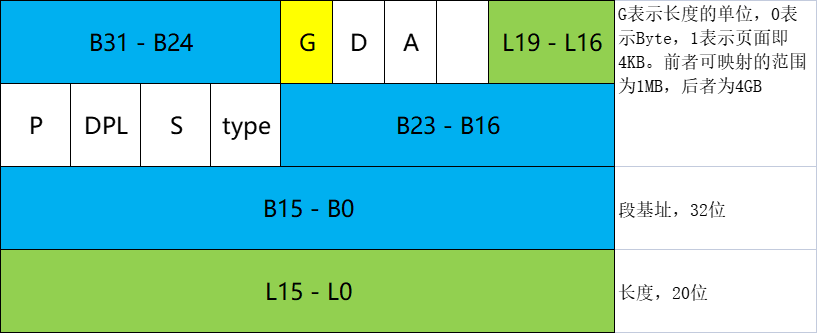

# 内容

比较著名的芯片体系：

* Intel x86
* AMD
* ARM7/9
* ppc
* mips

Intel和AMD多用于PC。现在的手机、平板用的大多是ARM9，可穿戴设备大多是ppc、mips。ARM、ppc、mips实时性非常好。

> 读本文前需要明确：
>
> 1. CPU位数表示ALU宽度（数据总线条数）。所以要说CPU是多少位由ALU宽度（数据总线条数）决定。
> 2. CPU可寻址能力由CPU芯片上的地址总线条数决定。
> 3. CPU地址总线条数不等于CPU位数。

# Intel 80x86家族发展历程

每天所讲到的x86-32位体系指的是从Intel 80386芯片一直到后面所发展的一系列32位处理器。而x86并不是从32为起步，而是从1978年的8086（16位）开始发展，经过80186（16）、80286（伪32）。

1. 1970年代
   1. 4004 -- 4位
   2. 8008 -- 8位
2. 1974年代
   1. 8080 -- 8位
   1. 8085 -- 8位
3. 1978年代
   1. 8086 -- 16位
   2. 80186 -- 16位
4. 1983年代
   1. 80286 -- 32位（伪）
   2. 80386 -- 32位（真）
   3. 80486 -- 32位
5. 1993年代
   1. Pentium -- 32位

8位芯片如果只有8条地址总线，那么只能寻址256字节，这样的CPU局限性太高，因此早期的8位CPU（如8080、8085）的地址总线设计成了16条，可以寻址64KB。

8位芯片的寄存器只有1个字节，但是寻找的地址是16位即2字节地址，不能全部放到一个寄存器中，需要分开存放。8位芯片导致数据位数和地址位数不对等，形成了历史包袱，所以在8080和8085中出现了很多16位的汇编指令以解决数据和地址位数不对等的问题。

到了8086芯片，是16位CPU，地址总线设计为20条，可寻址1MB。虽然数据和地址位数不对等，但是巧妙的设计可以解决这个问题，当初设计师没有按照8080、8085那样设计20位汇编指令，而是让地址入寄存器时右移4位。

# 开创x86体系--开始分段--实模式

从8086开始，增加了4个段寄存器，CS、DS、SS、ES，分别是代码段寄存器、数据段寄存器、堆栈段寄存器、扩展段寄存器，都是16位，可存放2字节。另外还有一个IP寄存器，也是16位，名字含义为指令指针寄存器，可专门存放内存地址偏移量，即内存地址。

此时，设计师把内存划分为分段体系，规定每个段的起始地址必须是16的倍数，所以每个段至少有16个字节，最大呢？是IP寄存器能最大支持存放的数字，即$2^{16}=64KB$。此时，每一段的内容都有其段起始地址和段范围。这就可以把每一段的起始地址写到相应的段寄存器中了。

为啥规定每个段的起始地址必须是16的倍数？如果一个数字能被16整除，那么2进制下，这个数字的低四位均为0！因此可以右移四位已知的数据，把其余高位有效数据存放到16位段寄存器中！这就是巧妙之处。

由此以来，之后的寻址方式就变成：取具体对应段的段寄存器为段基址，作为地址总线高16位，再加上具体数据在段中的相对偏移量（从IP寄存器中的值取）。

如此推演：

1. 段寄存器中的值，左移4位，对应的值就称为：段基址
2. IP寄存器中的值，就称为一个内存段上的偏移量/偏移地址/相对地址/**逻辑地址**

在8086芯片开创的年代，还没有虚拟地址映射的概念，因此寻址得到的数据地址直接对应了内存上的物理地址。这样的模式，称为**实地址模式**，也叫实模式。

# 融合操作系统--保护模式

实现保护机制，就要在保存段起始地址的同时，记录段的范围，确保不要越界。同时也要给每一个段记录其访问权限。

1. 内存段起始地址
2. 内存段长度 - 防止偏移量（逻辑地址）越界
3. 内存的权限信息 - 确保他人访问时合法，避免任意读取、修改、执行

虽然32位处理器是32位，但是其段寄存器的大小依旧是16位，肯定是无法存放这些全部内容的，即使有32位的寄存器也不够存储。

但在80386这个处理器上，做出了变革，增加了GTDR和LDTR两个寄存器，分别是全局段描述符表寄存器、局部段描述符表寄存器，前者是所有进程共享的，后者是每个进程私有的。

段描述符表实际上是一个数组，依次存放了每个段的信息。

因此，从前的段寄存器则需要用来存储段描述符表中本段对应的下标值。

段寄存器，共16位，低2位存储权限标志，00表示最高权限，11表示最低权限，表示当前段属于用户态/内核态下的空间。第3个低位表示当前段的信息存储在GDTR/LDTR中，0表示GDTR，1表示LDTR。剩下的高13位存储描述符表中对应的下标值。最大值为$2^{13}=8192$。其中内核代码占用了12个全局段描述符表项，因此可用的值有8180个。


段描述符表的表项的结构：



段描述表中的一个表项中记录了32位段基址，20位段长度大小及其单位。

## 保护模式下内存分段的地址映射

段寄存器存储的值，右移3位，得到段描述符中对应的下标值。再到段描述符（GDT）中取得该段的信息（基址、大小、权限属性）。

则保护模式下内存分段的地址映射可以如下计算获得：（以取得DS数据段某地址为例）

$GDT[DS>>3].BaseAddr+IP=线性地址$。其中，IP要和记录的段长度进行比较，判断是否越界。

如果没有分页机制，则以上线性地址就是实际的物理地址。

## 保护模式下内存分页的地址映射

继续，判断内核是否打开内存页映射，标志位存储于CR0寄存器中的PG位，为0表示只分段，为1表示使用内存分页。

| 寄存器 | 描述                         |
| ------ | ---------------------------- |
| CR0    | PG：内存是否开启分页机制     |
| CR2    | 保存发生缺页异常时的虚拟地址 |
| CR3    | 保存当前进程的页目录起始地址 |
| CR4    | PAE是否开启物理地址扩展      |

如果打开了内存分页机制，那么得到的该线性地址就称为虚拟地址，需要经过页面的多级映射，才能得到真正的物理地址。

32位下，需要二级映射；36位下，需要三级映射；64位下，需要四级映射。

拿32位举例子，分为三段，10、10、12。高10位表示页目录的下标值，次10位表示页表的下标值，低12位表示物理页面上的偏移量。

10位限制了页目录最多有1024项，每一项都是4字节，32位，则页目录本身占4KB。页目录项中存储了页表的地址。

10位限制了页表最多有1024项，每一项都是4字节，32位，则页表本身占4KB。页表项中存储了一个物理页面的起始地址。

12位限制了地址偏移量最大为4K，刚好对应于一个页面的大小4KB，确保不会确界。

因为一页是4KB，所以每一个页面的地址都是4K的整数倍，那么这些地址的低12位都为0，所以PT（页表）中的页表项的32位中只需高20位来存储物理页面号（也称作框号）。同样的道理，每个页表都是4KB，那么PG（页目录）中的页目录项的32位中只需高20位来存储页表的起始地址。剩下的12位存什么呢？权限信息（比如页有无分配？是否可访问？是否是脏页）。

其中，PT项的最低1位是present位，为0表示页表项对应的物理页面在交换分区中，为1表示此页面就在物理内存中。换页算法中需要与这个位打交道。

物理页面的结构体可在内核源码中`struct page`看到，命名为`mem_map_t`。

物理页面实际上用动态开辟的数组来管理，是一个`mem_map_t * mem_map`。PT项的高20位即为物理页面数组的下标。

最多有1024个PG，1个PG可以映射1024个PT，1个PT可以映射1024个物理页面，1个物理页面有4KB。由此，我们可以计算得到，$1024*1024*4KB=4GB$

### 问题：每个进程如何确保页目录、页表地址不冲突

我们可以想到，每个进程都分配了相同大小的虚拟地址空间。那么变量的地址也可能会存在相同的情况。而每个CPU都要同时执行多个进程，CR3寄存器（存放页目录地址）只有一个。每一个进程都有自己独立的地址空间，所以不同进程在切换的时候，要把自己的页目录地址更新到CR3寄存器中。

可在内核代码中`switch_mm`函数中看到：

```c
static inline void switch_mm(struct mm_struct *prev, ...)
{
    {
        ...
        asm volatile("movl %0, %%cr3": :"r" (__pa(next->pgd)));
    }
}
```

