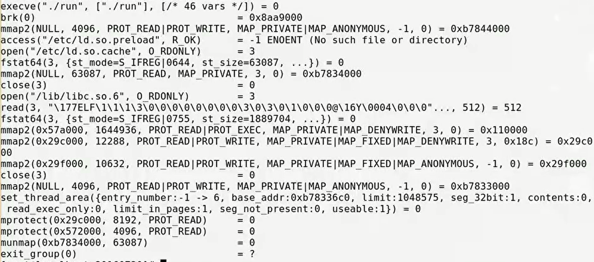

# 一段代码

```cpp
int gdata1 = 10;
int gdata2 = 0;
int gdata3;

static int gdata4 = 11;
static int gdata5 = 0;
static int gdata6;

int main()
{
    int a = 12;
    int b = 0;
    int c;
    
    static int d = 13;
    static int e = 0;
    static int f;
    
    return 0;
}
```

以上，有若干变量。

有全局变量、静态全局变量，有局部变量、静态局部变量。

# 代码和程序的关系

1. 任何语言代码产生的程序，无非是产生了两种东西。——指令、数据。程序员应该对自己写的代码了解清楚，哪些是数据，哪些是指令。
2. 指令和数据加载到内存之后，肯定要区分区域，怎么划分？

## 计算机组成

三大件：CPU、内存、I/O，每家厂商有每家独自的产品实现。

为了在应用层屏蔽不同产品的差异：

1. IO的屏蔽是VFS（虚拟文件系统）做的。
2. 内存和IO一起作为一个资源分配的单位，用虚拟存储器（虚拟内存）屏蔽。
3. CPU、内存、IO一起作为一个资源调度的单位，用进程来屏蔽。

因此，我们写的程序代码是不可能直接加载到物理内存上的。而是先加载到虚拟内存上。

## 虚拟内存

虚拟的——不存在，却看得到。那么虚拟这个概念实际上是不存在的，只是逻辑层抽象出来的。

每个程序进行运行时，系统都会给其分配虚拟内存。然后系统内部再去自动管理处理底层的物理内存。

虚拟内存大小有多大？和系统的位数有关。也可以理解为和CPU的位数有关。CPU位数的含义是什么？

### 系统的位数/CPU的位数——CPU位数!=地址总线位数

位数可以衡量一个CPU的计算能力。

CPU主要是用来运算数据。一句话来说**CPU的位数等于它一次性可以计算的数据的长度**。所以，CPU的位数实际上指的是CPU中ALU（算术逻辑单元）的宽度。

ALU运算的数据从何而来？从寄存器哪来，那么寄存器的数据从何而来？——数据总线。所以，CPU的位数=ALU宽度=数据总线的条数

所以，CPU位数压根和地址总线没关系，比如说x86体系下的16位CPU，它的数据总线是16位，而地址总线是20位；8位CPU的数据总线是8位，地址总线是16位。

虚拟内存有多大？和地址总线数有关，代表CPU的可寻址能力，假如CPU有32条地址总线，那么该CPU可寻址$2^{32}$bit即4G。每个程序都会有4G的虚拟地址空间。但是要注意，CPU位数不一定等于地址总线条数！比如8086，是16位CPU，但是地址总线有20条，所以可寻址能力是$2^{20}=1MB$。

总结：

1. CPU位数表示ALU宽度（数据总线条数）。所以要说CPU是多少位由ALU宽度（数据总线条数）决定。
2. CPU可寻址能力由CPU芯片上的地址总线条数决定。
3. CPU地址总线条数不等于CPU位数。

### 程序虚拟地址空间的布局

略，见“进程地址空间体系”一文。

# 从编译到链接--从obj到可执行文件

32位系统下，obj文件的地址是按4字节对齐的。

可执行文件是按照页面对齐的，一页的默认大小是4096Byte，即4KB。

## 第一步：合并、调整

### 合并相同名字的段？

多个obj文件在进行链接时，第一步，合并每一个obj文件相同的段。这样有利于充分利用每1页来存储信息。

比如有3个obj文件，3个obj的text段合并在一起，若不超过4KB，则占1页。类似地，data段、bss段也合并并且各自占独立的页面。

即，可执行文件的页面是按不同段来划分的，每一页上都有全部的obj的同一个段。

### 优化：合并相同权限属性的段

其实，可以进一步优化，即按照相同的权限属性去划分页。比如只读数据、可读可写数据、可读可执行等等。

只读数据比如说：常量字符串就存在于`.rodata`段；另外代码段也是只读的。所以可以把这两者存在同一页中。

可读可写数据比如说：data段和bss段合并，这样就节省了一个页面的空间。

因此，**链接的第一步：所有相同属性的段进行合并，组织在同一个页面上**。

### 调整段表中每一个段的起始偏移量和段的大小

因为段进行了合并，因此需要调整段的起始偏移量。

### 合并符号表

每一个obj文件都有符号表，符号表也要合并。

### 进行符号解析

所有obj符号表中对符号引用的地方都要找到该符号在哪里、哪个文件中定义？

也是在此步，进行强弱符号、符号重定义的判别、决策。

### 分配内存地址

之前obj符号表中对符号引用的地方的地址是空的，待填，现在要分配其地址。得到合法的虚拟空间的地址。

## 第二步：链接的核心——符号的重定位

已经做好了符号解析、内存地址的分配，现在要更新之前符号地址错误、待填的地址信息。即**在指令段里把没填的地址修改为正确的地址**。

# 可执行文件的格式

观察可执行文件其ELF Header，其中有一个Entry point address属性，存储了程序的入口地址，通常是main函数地址。

其次，相比obj文件，其多了一个模块是program headers。

而且program header有很多个，比如，这个可执行文件有3个program header。

```
# readelf -l <可执行文件名>
Program Headers:
  Type      Offset      VirtAddr    PhysAddr    FileSiz MemSiz  Flg Align
  LOAD      0x000000    0x08048000  0x08048000  0x000e2 0x00028	R E	0x1000
  LOAD      0x0000e4    0x080490e4  0x080490e4  0x00010 0x00028 RW  0x1000
  GNU_STACK 0x000000    0x00000000  0x00000000  0x00000 0x00000 RW  0x4
  
 Section to Segment mapping:
  Segment Sections...
   00     .text
   01     ,data .bss
   02
   
```

两个Load类型的header的Align是0x1000，说明其对齐方式是4KB，一页。

没有这两个LOAD页操作系统将不知道这个可执行文件如何执行。

下面的Section to Segment mapping说的是每一个header里面对应、包含着哪些段。

我们可以看到，第一个说的是LOAD1，包含了.text段；第二个说的是LOAD2，包含了.data和.bss段；

同时可以在Flg属性看到，第一个LOAD是RE，代表可读、可执行；第二个LOAD是RW，可读可写。也证实了，可执行文件的页面是按照之前obj文件中相同属性的段来合并到一页的。

program headers包含的这两个LOAD页指示了操作系统，要把哪些东西加载到内存上。这是可执行文件和不可执行文件的本质区别。

# 可执行文件加载/映射到虚拟地址空间

可执行文件中的LOAD页，虚拟地址空间都是按页划分的。

可执行文件加载/映射到虚拟地址空间这个过程是mmap。深入理解计算机系统第9章。

# 虚拟地址空间加载/映射到物理内存

物理内存也是按页面划分的。

虚拟地址空间加载/映射到物理内存——多级页表映射方式实现。

# 程序的运行

1. 创建虚拟地址空间到物理内存的映射（创建内核地址映射结构体），创建页目录和页表。
2. 加载代码段和数据段。
3. 把可执行文件的入口地址写入CPU寄存器中。

可以执行`strace <可执行文件名>`查看可执行文件运行后所做的动作。



可以看到，执行了execve，可想而知和我们的常识相符，一个新的程序要执行，首先要fork，之后再exec替换进程地址空间。

之后，进行若干次mmap。即完成可执行文件LOAD页加载到虚拟地址空间。

再之后，最终程序肯定是要跑到物理内存上运行的，尚需完成虚拟地址空间到物理内存空间的映射。--请见“Linux_地址映射”一文。

# 相关书籍

1. 程序员的自我修养1、2、3、4、6、10章；
2. 深入理解计算机系统5、6、7、8、9章。
3. 现代操作系统/操作系统精髓与设计原理

* 虚拟内存
* 进程管理以及通信
* 网络
* 虚拟文件系统
