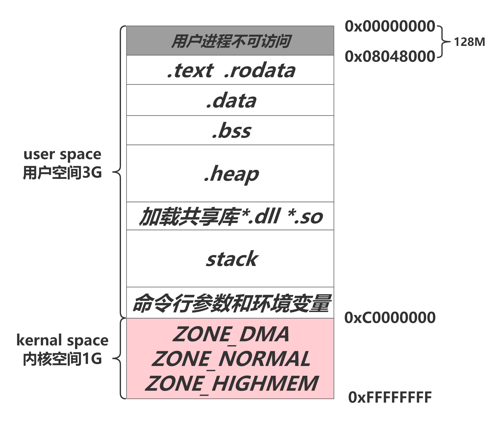

# 进程地址空间体系图



对于32位X86架构上运行的Linux而言， 其虚拟地址空间的寻址范围从`0 ~ 4G`，内核将这块空间划分为两个部分，将最高的**1G**字节`0xC0000000 ~ 0xFFFFFFFF`称为**“内核空间”**， 顾名思义是提供给内核使用；而将较低**3G**字节`0x00000000 ~ 0xBFFFFFFF`称为**“用户空间”**，即提供给各个运行的进程使用。

理论上，每个进程都是可以访问全部能寻址的4G虚拟内存空间的，但是系统为了防止内核空间被用户进程有意或无意的破坏，所以采用了分级保护措施： 将内核定为0级，将用户进程定为3级， **这样用户进程便无法直接访问内核的虚拟内存空间，仅能通过系统调用来进入内核态，从而来访问被限定的部分内核空间地址**。同时，由于访问权限的机制，不同的进程间也都拥有独立的用户空间。这样非对称的访问机制使得Linux系统运行更加的安全稳定。

另外，**用户进程是无法访问`0x00000000 ~ 0x08048000`这一段虚拟内存地址的**，在这段地址上有诸多例如C库，动态加载器如ld.so和VDSO等的映射地址。 如果用户进程访问到该区间会返回段错误。

# 内核空间

每一个进程的用户空间是私有的，但是所有进程共享用一个内核空间。

所以，进程之间的通信方式中的匿名管道通信就应用于此。

## ZONE_HIGHMEM

高端内存。在32位Linux系统，内核空间只有1G，在内核中映射高于1G的物理内存时，会使用到高端内存。64位不存在高端内存，因为64位系统的内核空间有512G。

## ZONE_NORMAL

内核常用的部分、最重要的部分。

## ZONE_DMA

直接内存访问。加快磁盘和内存交换数据。避免了经过CPU寄存器的过程，因此可以避免浪费CPU资源。

# 命令行参数和环境变量

main函数的原型就是一个例子。

```
int main(int argc, char ** argv, char ** environ)
```

argc记录了命令行参数的个数。

argv存的是命令行参数。

environ存的是环境变量。

我们简单地引入一个stdio.h头文件，就能使用C语言库函数了，这个头文件并没有在本地，这是因为环境变量指出了库文件存在哪些位置，程序编译链接时加载了环境变量。

这里涉及的命令行参数、环境变量都是存在于栈的高内存地址空间的。

# 栈

为何要有栈？程序运行时，总要有一个主入口，即

**进程中的每一个线程都有属于自己的栈**。

用户空间中地址最高的段叫做栈，他被**用于存放函数参数和动态局部变量**。调用一个方法或函数会将一个新的栈帧（stack frame）压入到栈中，这个栈帧会在函数返回时被清理掉。

在程序运行过程中，进程通过函数的调用和返回使得控制权在各个函数间转移，在新函数调用时，原函数的栈帧状态保持不变，并为新的函数开辟其所需的帧空间；当调用函数返回时，该函数的运行空间随着栈帧被弹出而清空，这次进程回到原函数的栈帧环境中继续执行。

>通过不断向栈中压入数据，超出其容量就会耗尽栈所对应的内存区域，这将触发一个页故障（page fault），而被Linux的`expand_stack()`处理，它会调用`acct_stack_growth()`来检查是否还有合适的地方用于栈的增长。
>
>如果栈的大小低于`RLIMIT_STACK`（通常为8MB），那么一般情况下栈会被加长，程序继续执行，感觉不到发生了什么事情。这是一种将栈扩展到所需大小的常规机制；
>
>然而，如果达到了最大栈空间的大小，就会栈溢出(stack overflow)，程序收到一个段错误(segmentation fault)。
>
>* 动态栈增长是唯一一种访问未映射内存区域而被允许的情形，其他任何对未映射内存区域的访问都会触发页错误，从而导致段错误。一些被映射的区域是只读的，因此企图写这些区域也会导致段错误。

# 共享库内存段

在栈和堆之间，有一段是用来存放共享库的。

# mmap段

mmap段，即Memory Mapping Segment。

> File mappings (including dynamic libraries) and anonymous mappings. Example: `/lib/libc.so`

在栈段的低一段便是mmap段，mmap是一种高效便捷的文件I/O方式，**内核将文件内容映射在此段内存中，常见情形便是加载动态链接库**。另外，在Linux中，如果你通过`malloc`申请一块大于`MMAP_THRESHOLD`(通常默认为128KB， 可用`mallopt()`修改)大小的堆空间时， glibc会返回一块匿名的mmap内存块而非一块堆内存。

# 堆

在mmap段下面便是堆段了，堆段同栈段一样，都是为进程运行提供动态的内存分配，**但是其和栈的区别在于堆上内存的生命期和执行分配的函数的生命期不一致，堆上分配的内存只有在对应进程通过系统调用主动释放或进程结束后才会释放**。所以，内存泄露这个经典的问题便由此产生。

另外， 由于堆内存的反复申请和释放，也不可避免的会造成堆段碎片化。这种情况可以使用“对象池”的设计手段来避免。

# 静态内存区域（数据段）--bss段和data段

堆段再往下便是**BSS段**和**DATA段**这两个静态内存区域，这两段都是用来存储静态局部或静态全局变量，其在编译期间便决定了虚拟内存的消耗。

**区别是DATA段存放的是已经初始化的变量，其映射自程序镜像中包含对应静态变量的文件；而BSS段则存放的是未初始化的变量，它不映射自任何一个执行文件**。

根据C语言标准规定，未初始化的静态成员变量的初始值必须为0，所以内核在加载二进制文件后执行程序前会将BSS段清0。

# 代码段

BSS和DATA段下是**代码段**(TEXT)，此段存有程序的指令代码。Text段是通过只读的方式加载到内存中的，在多个进程中可以被安全共享。

# 数据存放于哪个段？

```cpp
int gdata1 = 10;
int gdata2 = 0;
int gdata3;

static int gdata4 = 11;
static int gdata5 = 0;
static int gdata6;

int main()
{
    int a = 12;
    int b = 0;
    int c;
    
    static int d = 13;
    static int e = 0;
    static int f;
    
    return 0;
}
```

全部的指令都存放在代码段，而一个程序除了数据就是指令，因此，函数中的局部变量`int a = 12; int b = 0; int c;`均为指令。其余的静态变量、全局变量都为数据。

## 对于全局变量

全局变量都是数据。则`gdata1~gdata6`都是数据，都会生成对应的符号。

然而，如果未初始化或者初始化为0，均视为未初始化，如`gdata2`、`gdata3`、`gdata5`、`gdata6`预留在`.bss`段。

> 未初始化和初始化为0是不同的概念、动作！即使最终的结果都是把int数据置0且存到bss段。但是显式初始化在C语言中会生成强符号，没有进行初始化的（即没有=0）会生成弱符号！

`gdata1`、`gdata4`分配到`.data`段。

## 对于局部变量

对于非静态量，即`a`、`b`、`c`来说，已经不再属于数据，因为不会生成相应的符号。

而是属于指令的范畴。实际翻译过来的指令含义如下。

```x86asm
mov dword ptr[a], 0Ch	# word为2字节，dword表示double word，即4字节数据
```

即把`0Ch`移到a的内存中。

这些指令产生后，在`.data`代码段存放。

对于静态量，即`d`、`e`、`f`来说，依旧当作数据处理，生成符号，如果未初始化或者初始化为0，均视为未初始化，如`e`、`f`预留在`.bss`段。

`d`分配到`.data`段。

# 虚拟地址的实现原理

它存在，你能看得见，这是物理的；
它存在，你看不见，这是透明的；
它不存在，你却看得见，这是虚拟的；
它不存在，你也看不见，这是删除的。

---

每个进程都运行在一个属于自己的内存沙盒里，这个沙盒即虚拟地址空间，这些虚拟地址再通过页表(page table)来映射到物理内存上，页表由操作系统维护并被CPU所引用。所以用户空间地址的映射是动态变化的；而内核空间则是持续存在的，在每个进程中都映射到相同的物理内存中，这样便于寻址以应对随时出现的中断和系统调用。
