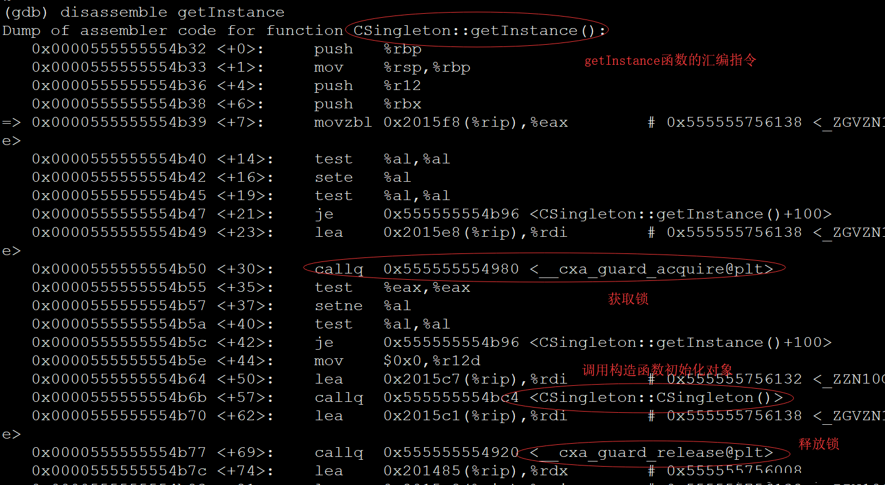

# 内容

1. 单例模式简介
2. 饿汉式单例模式
3. 懒汉式单例模式
4. 线程安全的单例模式
# 单例模式简介

单例模式指的是，无论怎么获取，**永远只能得到该类类型的唯一一个实例对象**，那么设计一个单例就必须要满足下面三个条件：
1. 构造函数私有化，这样用户就不能任意定义该类型的对象了
2. 定义该类型唯一的对象
3. 通过一个static静态成员方法返回唯一的对象实例
# 饿汉式（本身线程安全）

**饿汉式**单例模式，顾名思义，就是程序启动时就实例化了该对象，并没有推迟到第一次使用该对象时再进行实例化；如果运行过程中没有使用到，该实例对象就被浪费掉了。

```cpp
class CSingleton
{
public:
	static CSingleton* getInstance()
	{
		return &single;
	}
private:
	static CSingleton single;
	CSingleton() { cout << "CSingleton()" << endl; }
	~CSingleton() { cout << "~CSingleton()" << endl; }
	CSingleton(const CSingleton&) = delete; // 防止外部使用拷贝构造产生新的对象
};
CSingleton CSingleton::single;

int main()
{
	CSingleton *p1 = CSingleton::getInstance();
	CSingleton *p2 = CSingleton::getInstance();
	CSingleton *p3 = CSingleton::getInstance();
	cout << p1 << " " << p2 << " " << p3 << endl;
	return 0;
}

```
打印`0016E138 0016E138 0016E138`
可以看到，三次获取的CSingleton对象都是同一个对象实例，这是一个**饿汉式**单例模式。
# 懒汉式（线程不安全）

**懒汉式**单例模式，顾名思义，将对象的实例化延迟到第一次使用它的时刻。

```cpp
class CSingleton
{
public:
	static CSingleton* getInstance()
	{
		if (nullptr == single)
		{
			single = new CSingleton();
		}
		return single;
	}
private:
	static CSingleton *single;
	CSingleton() { cout << "CSingleton()" << endl; }
	~CSingleton() { cout << "~CSingleton()" << endl; }
	CSingleton(const CSingleton&) = delete;
};
CSingleton* CSingleton::single = nullptr;

int main()
{
	CSingleton *p1 = CSingleton::getInstance();
	CSingleton *p2 = CSingleton::getInstance();
	CSingleton *p3 = CSingleton::getInstance();
	cout << p1 << " " << p2 << " " << p3 << endl;
	return 0;
}

```

符合单例模式的要求，三次获取的都是同一个对象，而且程序启动时，只对single指针初始化了空值，等第一次调用`getInstance`函数时，由于single指针为`nullptr`，才进行对象的实例化，所以是一个**懒汉式**单例模式。

但是上面的代码有一个问题：只有new没有delete！作为`C++`开发者，资源的分配和回收，我们必须要考虑清楚，不能糊涂。

这个问题确实棘手，首先资源的释放如果交给用户来操作，难免会忘记写delete，又或者多次delete，可能错误释放野指针。我们可以利用static静态对象在程序结束时自动析构这么一个特征，给出如下释放资源的代码：在单例类中定义一个嵌套类，在嵌套类的析构函数中，自动释放外层类的资源。

```cpp
class CSingleton
{
public:
	static CSingleton* getInstance()
	{
		if (nullptr == single)
		{
			single = new CSingleton();
		}
		return single;
	}
private:
	static CSingleton *single;
	CSingleton() { cout << "CSingleton()" << endl; }
	~CSingleton() { cout << "~CSingleton()" << endl; }
	CSingleton(const CSingleton&) = delete;

	// 定义一个嵌套类，在该类的析构函数中，自动释放外层类的资源
	class CRelease
	{
	public:
		~CRelease() { delete single; }
	};
	// 通过该静态对象在程序结束时自动析构的特点，来释放外层类的对象资源
	static CRelease release;
};
CSingleton* CSingleton::single = nullptr;
CSingleton::CRelease CSingleton::release;

int main()
{
	CSingleton *p1 = CSingleton::getInstance();
	CSingleton *p2 = CSingleton::getInstance();
	CSingleton *p3 = CSingleton::getInstance();
	cout << p1 << " " << p2 << " " << p3 << endl;
	return 0;
}

```

# 线程安全的懒汉式

在开发服务器程序的时候，经常会用到多线程，多线程要考虑代码的线程安全特性，不能让代码在多线程环境下出现竞态条件，否则就要进行线程互斥操作，我们来考虑一下上面两种单例模式，如果用在多线程环境当中，是否是线程安全的单例模式。
1. 饿汉单例模式的线程安全特性
    1. 饿汉单例模式中，单例对象定义成了一个static静态对象，它是在程序启动时，main函数运行之前就初始化好的，因此不存在线程安全问题，可以放心在多线程环境中使用。
2. 懒汉单例模式的线程安全特性
    1. 懒汉单例模式，获取单例对象的方法如下：

```cpp
static CSingleton* getInstance()
{
    if (nullptr == single)
    {
        single = new CSingleton();
    }
    return single;
}
```
很明显，这个`getInstance`是个不可重入函数，也就它在多线程环境中执行，会出现竞态条件问题，首先搞清楚这句代码，`single = new CSingleton()`它会做三件事情，开辟内存，调用构造函数，给single指针赋值，那么在多线程环境下，就有可能出现如下问题：
1. 线程A先调用getInstance函数，由于single为`nullptr`，进入if语句
2. new操作先开辟内存，此时A线程的CPU时间片到了，切换到B线程
3. B线程由于single为`nullptr`，也进入if语句了，开始new操作

很明显，上面两个线程都进入了if语句，都试图new一个新的对象，不符合单例模式的设计，那该如何处理呢？应该为getInstance函数内部加锁，在线程间进行互斥操作。
```cpp
#include <iostream>
#include <pthread.h>
using namespace std;

class CSingleton
{
public:
    static CSingleton* getInstance()
  	{
  		// 获取互斥锁
  		pthread_mutex_lock(&mutex);
  		if (nullptr == single)
  		{
  			single = new CSingleton();
  		}
  		// 释放互斥锁
  		pthread_mutex_unlock(&mutex);
  		return single;
  	}
private:
  	static CSingleton *single;
  	CSingleton() { cout << "CSingleton()" << endl; }
  	~CSingleton() 
  	{
  		pthread_mutex_destroy(&mutex); // 释放锁
  		cout << "~CSingleton()" << endl; 
  	}
  	CSingleton(const CSingleton&);
  
  	class CRelease
  	{
  	public:
  		~CRelease() { delete single; }
  	};
  	static CRelease release;
  	
  	// 定义线程间的互斥锁
  	static pthread_mutex_t mutex;
};
CSingleton* CSingleton::single = nullptr;
CSingleton::CRelease CSingleton::release;
// 互斥锁的初始化
pthread_mutex_t CSingleton::mutex = PTHREAD_MUTEX_INITIALIZER;

int main()
{
    CSingleton *p1 = CSingleton::getInstance();
    CSingleton *p2 = CSingleton::getInstance();
    CSingleton *p3 = CSingleton::getInstance();
    return 0;
}
```
上面的代码，是一个线程安全的懒汉单例模式，但是效率太低，因为每次调用getInstance都需要加锁解锁，除了第一次调用，后面对getInstance函数持续的加解锁实在时没有必要，所以这里需要使用`锁+双重判断`，也叫**双重检验锁**，把上面的getInstance函数代码修改如下：
```cpp
static CSingleton* getInstance()
{
  	if (nullptr == single)
  	{
        // 获取互斥锁
        pthread_mutex_lock(&mutex);
        /* 
            这里需要再添加一个if判断，否则当两个
            线程都进入这里，又会多次new对象，不符合单例模式
        */
        if(nullptr == single)
        {
            single = new CSingleton();
        }
        // 释放互斥锁
        pthread_mutex_unlock(&mutex);
    }

    return single;
}
```
如果把mutex封装为一个类，那么更加符合面向对象的思想。
```cpp
#include <iostream>
#include <pthread.h>
using namespace std;

// 对互斥锁操作的封装
class CMutex
{
public:
    CMutex(){pthread_mutex_init(&mutex, NULL);}  // 初始化锁
    ~CMutex(){pthread_mutex_destroy(&mutex);}  // 销毁锁 
    void lock(){pthread_mutex_lock(&mutex);}  // 获取锁
    void unlock(){pthread_mutex_unlock(&mutex);}  // 释放锁
private:
    pthread_mutex_t mutex;
};

class CSingleton
{
public:
    static CSingleton* getInstance()
    {
        if (nullptr == single)
        {
            // 获取互斥锁
            mutex.lock();
            /* 
                这里需要再添加一个if判断，否则当两个
                线程都进入这里，又会多次new对象，不符合
                单例模式的涉及
            */
            if(nullptr == single)
            {
                single = new CSingleton();
            }
            // 释放互斥锁
            mutex.unlock();
        }

        return single;
    }
private:
    static CSingleton *single;
    CSingleton() { cout << "CSingleton()" << endl; }
    ~CSingleton() { cout << "~CSingleton()" << endl;}
    CSingleton(const CSingleton&);

    class CRelease
    {
    public:
        ~CRelease() { delete single; }
    };
    static CRelease release;

    //线程间的静态互斥锁
    static CMutex mutex;
};
CSingleton* CSingleton::single = nullptr;
CSingleton::CRelease CSingleton::release;
// 定义互斥锁静态对象
CMutex CSingleton::mutex;

int main() 
{
    CSingleton *p1 = CSingleton::getInstance();
    CSingleton *p2 = CSingleton::getInstance();
    CSingleton *p3 = CSingleton::getInstance();
    return 0;
}
```
# 更简洁的线程安全的懒汉式

下面这个懒汉单例模式是否是线程安全的，代码如下：
```cpp
#include <iostream>
using namespace std;

class CSingleton
{
public:
	static CSingleton* getInstance()
	{
		static CSingleton single; // 懒汉式单例模式，定义唯一的对象实例
		return &single;
	}
private:
	CSingleton() { cout << "CSingleton()" << endl; }
	~CSingleton() { cout << "~CSingleton()" << endl; }
	CSingleton(const CSingleton&) = delete;
};
int main()
{
	CSingleton *p1 = CSingleton::getInstance();
	CSingleton *p2 = CSingleton::getInstance();
	CSingleton *p3 = CSingleton::getInstance();
	return 0;
}
```

上面的单例模式在多线程环境中使用时，会不会出现这种情况，线程A第一次调用getInstance函数的时候，single对象第一次初始化，此时线程B也调用getInstance函数，会不会也进行single对象的初始化呢，因为此时线程A并没有初始化完single？

在Linux环境中，通过g++编译上面的代码，命令如下：
`g++ -o main main.cpp -g`
生成可执行文件main，用gdb进行调试，到getInstance函数，并打印该函数的汇编指令，如下：



可以看到，**对于static静态局部变量的初始化，编译器会自动对它的初始化进行加锁和解锁控制，使静态局部变量的初始化成为线程安全的操作，不用担心多个线程都会初始化静态局部变量，因此上面的懒汉单例模式是线程安全的单例模式！**
# 总结

一个看似小小的单例模式，却可以串联面向对象思想，到软件设计思想，到设计模式，再到Linux操作系统的进程和线程模型，线程间的互斥和通信。

---
参考文献：[C++设计模式 - 单例模式_单例模式大秦坑王-CSDN博客](https://blog.csdn.net/QIANGWEIYUAN/article/details/88544524?spm=1001.2014.3001.5502)