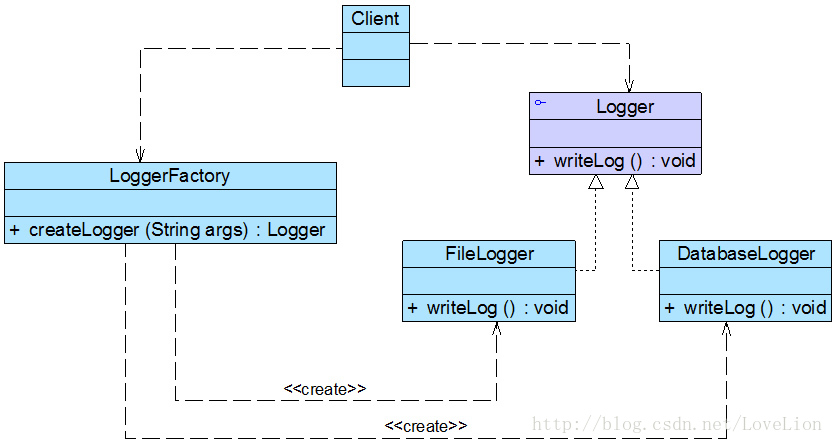
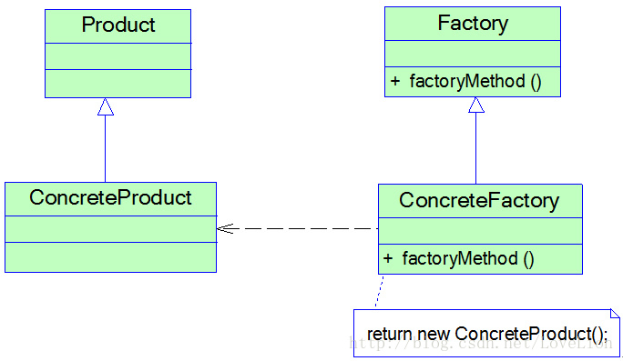
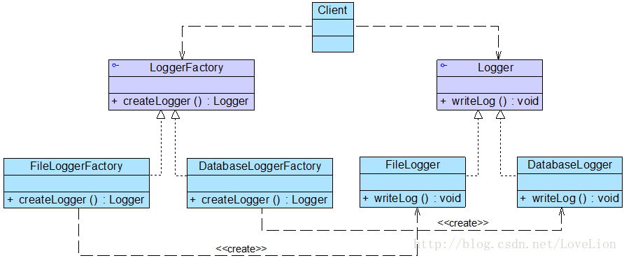

# 内容

1. 工厂方法模式之前
2. 工厂方法模式

# 工厂方法模式之前

简单工厂模式虽然简单，但存在一个很严重的问题。**当系统中需要引入新产品时，由于静态工厂方法通过所传入参数的不同来创建不同的产品，这必定要修改工厂类的源代码(增加if else)，将违背“开闭原则”，如何实现增加新产品而不影响已有代码？**工厂方法模式应运而生。

案例分析-**日志记录器的设计**：

某软件公司欲开发一个系统运行日志记录器(Logger)，该记录器可以通过多种途径保存系统的运行日志，如通过文件记录或数据库记录，用户可以通过**修改配置文件**灵活地更换日志记录方式。在设计各类日志记录器时，该公司的开发人员发现需要对日志记录器进行一些初始化工作，初始化参数的设置过程较为复杂，而且某些参数的设置有严格的先后次序，否则可能会发生记录失败。**如何封装记录器的初始化过程并保证多种记录器切换的灵活性**是该公司开发人员面临的一个难题。

该公司的开发人员通过对该需求进行分析，发现该日志记录器有两个设计要点：

1. 需要封装日志记录器的初始化过程，这些初始化工作较为复杂，例如需要初始化其他相关的类，还有可能需要读取配置文件（例如连接数据库或创建文件），导致代码较长，如果将它们都写在构造函数中，会导致构造函数庞大，不利于代码的修改和维护；
2. 用户可能需要更换日志记录方式，在客户端代码中需要提供一种灵活的方式来选择日志记录器，尽量**在不修改源代码的基础上更换或者增加日志记录方式**。

该公司开发人员最初使用简单工厂模式对日志记录器进行了设计，初始结构如图所示：



在上图中，LoggerFactory充当创建日志记录器的工厂，提供了工厂方法createLogger()用于创建日志记录器，Logger是抽象日志记录器接口，其子类为具体日志记录器。其中，工厂类LoggerFactory代码片段如下所示：

```c++
class LoggerFactory
{
public:
    LoggerFactory() {}
    ~LoggerFactory() {}
    static Logger* createLogger(const string & args)
    {
        if(args == "db")
        {
            // ... 连接数据库代码
            Logger* logger = new DatabaseLogger();//创建数据库日志记录器对象
            // ... 初始化数据库日志记录器代码
            return logger;
        }
        else if(args == "file")
        {
            // ... 创建日志文件
            Logger* logger = new DatabaseLogger();//创建文件日志记录器对象
            // ... 初始化文件日志记录器代码
            return logger;
        }
        return nullptr;
    }
}
```

为了突出设计重点，上述代码省略了具体日志记录器类的初始化代码。在LoggerFactory类中提供了静态工厂方法createLogger()，用于根据所传入的参数创建各种不同类型的日志记录器。通过使用简单工厂模式，我们将日志记录器对象的创建和使用分离，客户端只需使用由工厂类创建的日志记录器对象即可，无须关心对象的创建过程，但是我们发现，虽然简单工厂模式实现了对象的创建和使用分离，但是仍然存在如下两个问题：

1. 工厂类过于庞大，包含了大量的if…else…代码，导致维护和测试难度增大；
2. 系统扩展不灵活，如果增加新类型的日志记录器，必须修改静态工厂方法的业务逻辑，违反了“开闭原则”。

如何解决这两个问题，提供一种简单工厂模式的改进方案？这就是工厂方法模式的动机之一。

# 工厂方法模式的思想

在简单工厂模式中只提供一个工厂类，该工厂类处于对产品类进行实例化的中心位置，它需要知道每一个产品对象的创建细节，并决定何时实例化哪一个产品类。简单工厂模式最大的缺点是当有新产品要加入到系统中时，必须修改工厂类，需要在其中加入必要的业务逻辑，这违背了“开闭原则”。此外，在简单工厂模式中，所有的产品都由同一个工厂创建，工厂类职责较重，业务逻辑较为复杂，具体产品与工厂类之间的耦合度高，严重影响了系统的灵活性和扩展性，而工厂方法模式则可以很好地解决这一问题。

在工厂方法模式中，我们**不再提供一个统一的工厂类来创建所有的产品对象，而是针对不同的产品提供不同的工厂，系统提供一个与产品等级结构对应的工厂等级结构**。

# 工厂方法模式的开始

## 工厂方法模式的定义

工厂方法模式(Factory Method Pattern)：定义一个用于创建对象的接口，让子类决定将哪一个类实例化。工厂方法模式让一个类的实例化延迟到其子类。工厂方法模式又简称为工厂模式(Factory Pattern)，又可称作虚拟构造器模式(Virtual Constructor Pattern)或多态工厂模式(Polymorphic Factory Pattern)。工厂方法模式是一种类创建型模式。

工厂方法模式**提供一个抽象工厂接口来声明抽象工厂方法**，而由其子类来具体实现工厂方法，创建具体的产品对象。工厂方法模式结构如图所示：



在工厂方法模式结构图中包含如下几个角色：

1. **Factory（抽象工厂）**
   * 在抽象工厂类中，声明了工厂方法(Factory Method)，用于返回一个产品。
   * 抽象工厂是工厂方法模式的核心，所有创建对象的工厂类都必须实现该接口。
2. **ConcreteFactory（具体工厂）**
   * 它是抽象工厂类的子类，实现了抽象工厂中定义的工厂方法，并可由客户端调用，返回一个具体产品类的实例。
3. **Product（抽象产品）**
   * 它是定义产品的接口，是工厂方法模式所创建对象的超类型，也就是产品对象的公共父类。
4. **ConcreteProduct（具体产品角色）**
   * 它实现了抽象产品接口，某种类型的具体产品由专门的具体工厂创建，具体工厂和具体产品之间一一对应。

**与简单工厂模式相比，工厂方法模式最重要的区别是引入了抽象工厂角色**，抽象工厂可以是接口，也可以是抽象类或者具体类，其典型代码如下所示：

```c++
struct Factory
{
public:
    Factory() {cout << "Factory()"<<endl;}
    virtual ~Factory() {cout << "~Factory"<<endl;}
    virtual Product * factoryMethod() = 0;
}
```

在抽象工厂中声明了工厂方法但并未实现工厂方法，具体产品对象的创建由其子类负责，客户端针对抽象工厂编程，可在运行时再指定具体工厂类，具体工厂类实现了工厂方法，不同的具体工厂可以创建不同的具体产品，其典型代码如下所示：

```c++
class ConcreteFactoryA : public Factory
{
public:
    ConcreteFactoryA() {cout << "ConcreteFactoryA()"<<endl;}
    ~ConcreteFactoryA() {cout << "~ConcreteFactoryA()"<<endl;}
    virtual Product * factoryMethod()
    {
        return new ConcreteProductA();
    }
}
class ConcreteFactoryB : public Factory
{
public:
    ConcreteFactoryB() {cout << "ConcreteFactoryB()"<<endl;}
    ~ConcreteFactoryB() {cout << "~ConcreteFactoryB()"<<endl;}
    virtual Product * factoryMethod()
    {
        return new ConcreteProductB();
    }
}
```

产品类（与简单工厂模式无异）

```c++
class Product
{
public:
    Product() { cout << "Product()" << endl; }
    virtual ~Product() { cout << "~Product" << endl; }
    virtual void methodSame()
    {
        cout << "this is Product" << endl;
        //公共方法的实现
    }
    virtual void methodDiff() = 0;//抽象业务方法
};
class ConcreteProductA : public Product
{
public:
    ConcreteProductA() { cout << "ConcreteProductA()" << endl; }
    virtual ~ConcreteProductA() { cout << "~ConcreteProductA" << endl; }
    virtual void methodDiff()
    {
        cout << "this is A" << endl;
        // 业务方法的覆盖实现
    }
};
class ConcreteProductB : public Product
{
public:
    ConcreteProductB() { cout << "ConcreteProductB()" << endl; }
    virtual ~ConcreteProductB() { cout << "~ConcreteProductB" << endl; }
    virtual void methodDiff()
    {
        cout << "this is B" << endl;
        // 业务方法的覆盖实现
    }
};
```

在实际使用时，具体工厂类在实现工厂方法时除了创建具体产品对象之外，还可以负责产品对象的初始化工作以及一些资源和环境配置工作，例如连接数据库、创建文件等。

在客户端代码中，只需关心工厂类即可，不同的具体工厂可以创建不同的产品，典型的客户端类代码片段如下所示：

```c++
int main()
{
    Factory* factorya = new ConcreteFactoryA();
    Factory* factoryb = new ConcreteFactoryB();
    Product* producta = factorya->factoryMethod();
    Product* productb = factoryb->factoryMethod();
    delete factorya;
    delete factoryb;
    delete producta;
    delete productb;
}
/* 运行结果
        Factory()
        ConcreteFactoryA()
        Factory()
        ConcreteFactoryB()
        Product()
        ConcreteProductA()
        Product()
        ConcreteProductB()
        ~ConcreteFactoryA
        ~Factory
        ~ConcreteFactoryB
        ~Factory
        ~ConcreteProductA
        ~Product
        ~ConcreteProductB
        ~Product
*/
```

可以通过配置文件来存储具体工厂类ConcreteFactory的类名，更换新的具体工厂时无须修改源代码，系统扩展更为方便。

### 思考

工厂方法模式中的工厂方法能否为静态方法？为什么？

## 完整解决方案

该公司开发人员决定使用工厂方法模式来设计日志记录器。其基本结构如图所示：



在上图中，Logger接口充当抽象产品，其子类FileLogger和DatabaseLogger充当具体产品，LoggerFactory接口充当抽象工厂，其子类FileLoggerFactory和DatabaseLoggerFactory充当具体工厂。完整代码如下所示：

```c++
//日志记录器接口：抽象产品
interface Logger {
	public void writeLog();
}
 
//数据库日志记录器：具体产品
class DatabaseLogger implements Logger {
	public void writeLog() {
		System.out.println("数据库日志记录。");
	}
}
 
//文件日志记录器：具体产品
class FileLogger implements Logger {
	public void writeLog() {
		System.out.println("文件日志记录。");
	}
}
 
//日志记录器工厂接口：抽象工厂
interface LoggerFactory {
	public Logger createLogger();
}
 
//数据库日志记录器工厂类：具体工厂
class DatabaseLoggerFactory implements LoggerFactory {
	public Logger createLogger() {
			//连接数据库，代码省略
			//创建数据库日志记录器对象
			Logger logger = new DatabaseLogger(); 
			//初始化数据库日志记录器，代码省略
			return logger;
	}	
}
 
//文件日志记录器工厂类：具体工厂
class FileLoggerFactory implements LoggerFactory {
	public Logger createLogger() {
            //创建文件日志记录器对象
			Logger logger = new FileLogger(); 
			//创建文件，代码省略
			return logger;
	}	
}
```

编写如下客户端测试代码：

```c++
int main()
{
    LoggerFactory factory;
    Logger logger;
    factory = new FileLoggerFactory(); //可引入配置文件实现
    logger = factory.createLogger();
    logger.writeLog();
}
/* 运行结果

*/
```

## 与配置文件结合

 为了让系统具有更好的灵活性和可扩展性，Sunny公司开发人员决定对日志记录器客户端代码进行重构，使得可以在不修改任何客户端代码的基础上更换或增加新的日志记录方式。

在客户端代码中将不再使用new关键字来创建工厂对象，而是将具体工厂类的类名存储在配置文件（如XML文件）中，通过读取配置文件获取类名字符串，再使用Java的反射机制，根据类名字符串生成对象。在整个实现过程中需要用到两个技术：Java反射机制与配置文件读取。软件系统的配置文件通常为XML文件，我们可以使用DOM (Document Object Model)、SAX (Simple API for XML)、StAX (Streaming API for XML)等技术来处理XML文件。关于DOM、SAX、StAX等技术均可充当配置文件技术。

# 参考文献

```
[1] 刘伟. 设计模式.
```
