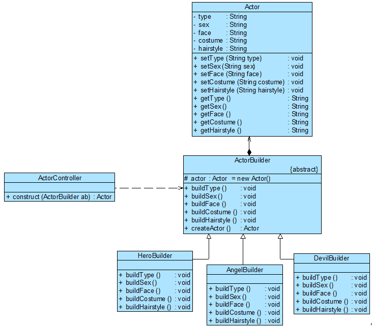

# 内容

1. 引述
1. 建造者模式概述
2. 引入抽象工厂
2. 抽象工厂模式概述
2. 解决方案

# 引述

没有人买车会只买一个轮胎或者方向盘，大家买的都是一辆包含轮胎、方向盘和发动机等多个部件的完整汽车。**如何将这些部件组装成一辆完整的汽车并返回给用户，这是建造者模式需要解决的问题**。建造者模式**又称为生成器模式**，它是一种较为复杂、使用频率也相对较低的创建型模式。建造者模式为客户端返回的不是一个简单的产品，而是一个由多个部件组成的复杂产品。

## 案例-游戏角色设计

该软件公司游戏开发小组决定开发一款名为《仙魔群侠传》的网络游戏，该游戏采用主流的RPG(Role Playing Game,角色扮演游戏)模式，玩家可以在游戏中扮演虚拟世界中的一个特定角色，角色根据不同的游戏情节和统计数据（如力量、魔法、技能等）具有不同的能力，角色也会随着不断升级而拥有更加强大的能力。

作为RPG游戏的一个重要组成部分，**需要对游戏角色进行设计，而且随着该游戏的升级将不断增加新的角色。不同类型的游戏角色，其性别、脸型、服装、发型等外部特性都有所差异**，例如“天使”拥有美丽的面容和披肩的长发，并身穿一袭白裙；而“恶魔”极其丑陋，留着光头并穿一件刺眼的黑衣。

该公司决定**开发一个小工具来创建游戏角色，可以创建不同类型的角色并可以灵活增加新的角色**。

该司的开发人员通过分析发现，游戏角色是一个复杂对象，它包含性别、脸型等多个组成部分，不同的游戏角色其组成部分有所差异，如图所示：


无论是何种造型的游戏角色，它的创建步骤都大同小异，都需要逐步创建其组成部分，再将各组成部分装配成一个完整的游戏角色。**如何一步步创建一个包含多个组成部分的复杂对象**，建造者模式为解决此类问题而诞生。

# 建造者模式概述

建造者模式是较为复杂的创建型模式，它将客户端与包含多个组成部分（或部件）的复杂对象的创建过程分离，**客户端无须知道复杂对象的内部组成部分与装配方式，只需要知道所需建造者的类型即可**。它关注如何一步一步创建一个的复杂对象，不同的具体建造者定义了不同的创建过程，且具体建造者相互独立，增加新的建造者非常方便，无须修改已有代码，系统具有较好的扩展性。

## 定义

建造者模式(Builder Pattern)：将一个复杂对象的构建与它的表示分离，使得同样的构建过程可以创建不同的表示。建造者模式是一种对象创建型模式。

## 结构

建造者模式一步一步创建一个复杂的对象，它允许用户只通过指定复杂对象的类型和内容就可以构建它们，用户不需要知道内部的具体构建细节。建造者模式结构如图所示：


## 角色

在建造者模式结构图中包含如下几个角色：

* Builder（抽象建造者）：Builder既可以是抽象类，也可以是接口。它为创建一个产品Product对象的各个部件指定抽象接口。在该接口中一般声明两类方法。
  * 一类方法是buildPartX()，它们用于创建复杂对象的各个部件
  * 另一类方法是getResult()，它们用于返回复杂对象。
* ConcreteBuilder（具体建造者）
  * 它实现了Builder接口，实现各个部件的具体构造和装配方法，定义并明确它所创建的复杂对象，也可以提供一个方法返回创建好的复杂产品对象。
* Product（产品角色）
  * 它是被构建的复杂对象，包含多个组成部件，具体建造者创建该产品的内部表示并定义它的装配过程。
* Director（指挥者）：指挥者又称为导演类，它负责安排复杂对象的建造次序。
  * 指挥者与抽象建造者之间存在关联关系，可以在其construct()建造方法中调用建造者对象的部件构造与装配方法，完成复杂对象的建造。
  * 客户端一般只需要与指挥者进行交互，在客户端确定具体建造者的类型，并实例化具体建造者对象（也可以通过配置文件和反射机制），然后通过指挥者类的构造函数或者Setter方法将该对象传入指挥者类中。

## 代码

* 产品类

在建造者模式的定义中提到了**复杂对象**，那么什么是复杂对象？简单来说，复杂对象是指那些包含多个成员属性的对象，这些成员属性也称为部件或零件，如汽车包括方向盘、发动机、轮胎等部件，电子邮件包括发件人、收件人、主题、内容、附件等部件，一个典型的复杂对象类代码示例如下：

```cpp
class Product  
{
private:
    String partA; //定义部件，部件可以是任意类型，包括值类型和引用类型
    String partB;
    String partC;
    //partA的Getter方法和Setter方法省略
    //partB的Getter方法和Setter方法省略
    //partC的Getter方法和Setter方法省略
};
```

* 抽象建造者类

在抽象建造者类中定义了产品的创建方法和返回方法，其典型代码如下

```cpp
class Builder
{
protected:
    //创建产品对象
    Product * product;//Product product=new Product();
public:
    void buildPartA() = 0;
    void buildPartB() = 0;
    void buildPartC() = 0;
    //返回产品对象
	Product* getResult()
    {
        return product;
    }
};
```

在抽象类`Builder`中声明了一系列抽象的`buildPartX()`方法用于创建复杂产品的各个部件，具体建造过程在`ConcreteBuilder`中实现，此外还提供了工厂方法`getResult()`，用于返回一个建造好的完整产品。

* 具体建造者类

在`ConcreteBuilder`中实现了`buildPartX()`方法，通过调用`Product`的`setPartX()`方法可以给产品对象的成员属性设值。不同的具体建造者在实现`buildPartX()`方法时将有所区别，如`setPartX()`方法的参数可能不一样，在有些具体建造者类中某些`setPartX()`方法无须实现（提供一个空实现）。而这些对于客户端来说都无须关心，客户端只需知道具体建造者类型即可。

* 指挥者类

在建造者模式的结构中还引入了一个指挥者类Director，该类主要有两个作用：一方面它隔离了客户与创建过程；另一方面它控制产品的创建过程，包括某个buildPartX()方法是否被调用以及多个buildPartX()方法调用的先后次序等。指挥者针对抽象建造者编程，客户端只需要知道具体建造者的类型，即可通过指挥者类调用建造者的相关方法，返回一个完整的产品对象。在实际生活中也存在类似指挥者一样的角色，如一个客户去购买电脑，电脑销售人员相当于指挥者，只要客户确定电脑的类型，电脑销售人员可以通知电脑组装人员给客户组装一台电脑。指挥者类的代码示例如下：

```cpp
class Director
{
private:
    Builder * builder;
public:
    Director(Builder* builder)
    {
    	this.builder = builder;
    }
    void setBuilder(Builder* builder)
    {
    	this.builder = builer;
    }
    //产品构建与组装方法
    Product* construct()
    {
        builder->buildPartA();
        builder->buildPartB();
        builder->buildPartC();
        return builder->getResult();
    }
};
```

在指挥者类中可以注入一个抽象建造者类型的对象，其核心在于提供了一个建造方法construct()，在该方法中调用了builder对象的构造部件的方法，最后返回一个产品对象。

* 客户端

对于客户端而言，只需关心具体的建造者即可，一般情况下，客户端类代码片段如下所示：

```cpp
Builder* builder = new ConcreteBuilder(); //可通过配置文件实现
Director* director = new Director(builder);
Product* product = director->construct();
```

可以通过配置文件来存储具体建造者类`ConcreteBuilder`的类名，使得更换新的建造者时无须修改源代码，系统扩展更为方便。在客户端代码中，无须关心产品对象的具体组装过程，只需指定具体建造者的类型即可。

## 与抽象工厂模式的对比

建造者模式与抽象工厂模式有点相似，但是

* **建造者模式返回一个完整的复杂产品**，而**抽象工厂模式返回一系列相关的产品**；
* 在抽象工厂模式中，客户端通过选择具体工厂来生成所需对象，而**在建造者模式中，客户端通过指定具体建造者类型并指导Director类如何去生成对象**，侧重于一步步构造一个复杂对象，然后将结果返回。
* 如果将**抽象工厂模式看成一个汽车配件生产厂**，生成不同类型的汽车配件，那么**建造者模式就是一个汽车组装厂**，通过对配件进行组装返回一辆完整的汽车。

# 完整解决方案

该公司开发人员决定使用建造者模式来实现游戏角色的创建，其基本结构如图所示：



在图中，ActorController充当指挥者，ActorBuilder充当抽象建造者，HeroBuilder、AngelBuilder和DevilBuilder充当具体建造者，Actor充当复杂产品。

指挥者类ActorController需要定义`construct()`方法，该方法拥有一个抽象建造者`ActorBuilder`类型的参数，在该方法内部实现了游戏角色对象的逐步构建。

为了提高系统的灵活性和可扩展性，最好将具体建造者类的类名存储在配置文件中，并通过某个工具类Util来读取配置文件并反射生成对象。

# 总结

建造者模式的核心在于如何一步步构建一个包含多个组成部件的完整对象，使用相同的构建过程构建不同的产品，在软件开发中，如果我们需要创建复杂对象并希望系统具备很好的灵活性和可扩展性可以考虑使用建造者模式。

## 主要优点

* 在建造者模式中，客户端不必知道产品内部组成的细节，将产品本身与产品的创建过程解耦，使得相同的创建过程可以创建不同的产品对象。
* 每一个具体建造者都相对独立，而与其他的具体建造者无关，因此可以很方便地替换具体建造者或增加新的具体建造者，用户使用不同的具体建造者即可得到不同的产品对象。由于指挥者类针对抽象建造者编程，增加新的具体建造者无须修改原有类库的代码，系统扩展方便，符合“开闭原则”
* 可以更加精细地控制产品的创建过程。将复杂产品的创建步骤分解在不同的方法中，使得创建过程更加清晰，也更方便使用程序来控制创建过程。

## 主要缺点

* 建造者模式所创建的产品一般具有较多的共同点，其组成部分相似，如果产品之间的差异性很大，例如很多组成部分都不相同，不适合使用建造者模式，因此其使用范围受到一定的限制。
* 如果产品的内部变化复杂，可能会导致需要定义很多具体建造者类来实现这种变化，导致系统变得很庞大，增加系统的理解难度和运行成本。

## 适用场景

* 需要生成的产品对象有复杂的内部结构，这些产品对象通常包含多个成员属性。
* 需要生成的产品对象的属性相互依赖，需要指定其生成顺序。
* 对象的创建过程独立于创建该对象的类。在建造者模式中通过引入了指挥者类，将创建过程封装在指挥者类中，而不在建造者类和客户类中。
* 隔离复杂对象的创建和使用，并使得相同的创建过程可以创建不同的产品。

在建造者模式中，**客户端只需实例化指挥者类**，指挥者类针对抽象建造者编程，客户端根据需要传入具体的建造者类型，指挥者将指导具体建造者一步一步构造一个完整的产品（逐步调用具体建造者的buildX()方法），相同的构造过程可以创建完全不同的产品。

在游戏角色实例中，如果需要更换角色，只需要修改配置文件，更换具体角色建造者类即可；

如果需要增加新角色，可以增加一个新的具体角色建造者类作为抽象角色建造者的子类，再修改配置文件即可，原有代码无须修改，完全符合“开闭原则”。

# 参考文献

```
[1] 刘伟. 设计模式.
```
