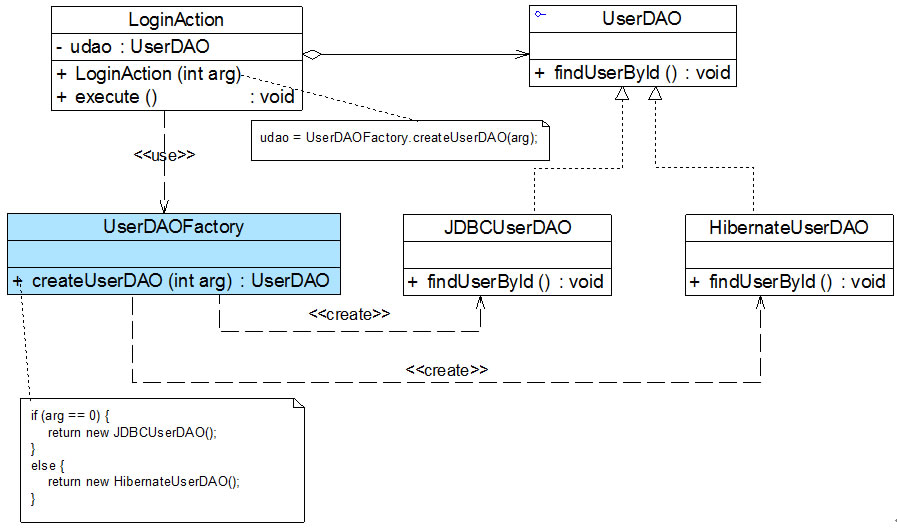
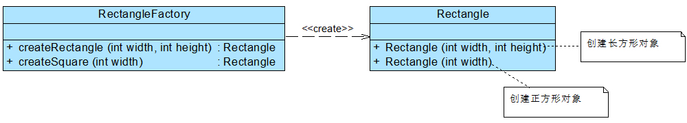
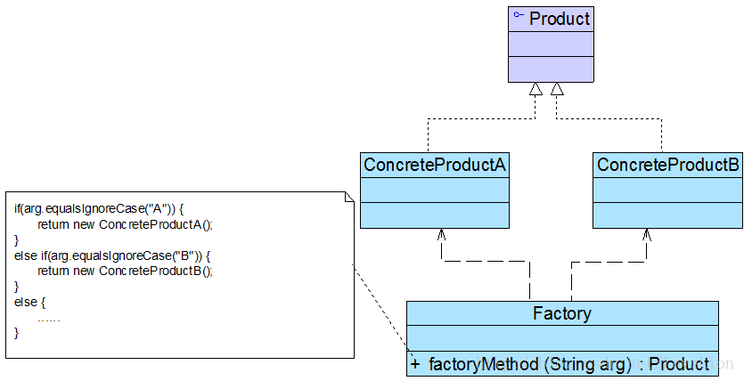

# 内容

1. 简单工厂模式之前
2. 简单工厂模式

# 简单工厂模式之前

案例分析：

某软件公司欲开发一套图表库，该图表库可以为应用系统提供各种不同外观的图表，例如柱状图、饼状图、折线图等。该公司图表库设计人员希望为应用系统开发人员提供一套灵活易用的图表库，而且**可以较为方便地对图表库进行扩展**，以便能够在将来增加一些新类型的图表。

该软件公司图表库设计人员提出了一个初始设计方案，将所有图表的实现代码封装在一个Chart类中，其框架代码如下所示：

```c++
class Chart
{
private:
    string type;
public:
    Chart(const string & type) : type(type)
    {
        if(type == "histogram")
        {
            //初始化柱状图
        }
        else if(type == "pie")
        {
            //初始化饼状图
        }
        else if(type == "line")
        {
            //初始化折线图
        }
    }
    void display()
    {
        if(type == "histogram")
        {
            //显示柱状图
        }
        else if(type == "pie")
        {
            //显示饼状图
        }
        else if(type == "line")
        {
            //显示折线图
        }
    }
};
int main()
{
    Chart("pie");
}
```

客户端代码通过调用Chart类的构造函数来创建图表对象，根据参数type的不同可以得到不同类型的图表，然后再调用display()方法来显示相应的图表。

Chart类是一个“巨大的”类，在该类的设计中存在如下几个问题：

1. 在Chart类中包含很多“if…else…”代码块，整个类的代码相当冗长，代码越长，阅读难度、维护难度和测试难度也越大；而且大量条件语句的存在还将影响系统的性能，程序在执行过程中需要做大量的条件判断。
2. Chart类的职责过重，它负责初始化和显示所有的图表对象，将各种图表对象的初始化代码和显示代码集中在一个类中实现，**违反了“单一职责原则”**，不利于类的重用和维护；而且将大量的对象初始化代码都写在构造函数中将导致构造函数非常庞大，对象在创建时需要进行条件判断，降低了对象创建的效率。
3. 当需要增加新类型的图表时，必须修改Chart类的源代码，**违反了“开闭原则”**。
4. 客户端只能通过new关键字来直接创建Chart对象，Chart类与客户端类耦合度较高，对象的创建和使用无法分离。
5. 客户端在创建Chart对象之前可能还需要进行大量初始化设置，例如设置柱状图的颜色、高度等，如果在Chart类的构造函数中没有提供一个默认设置，那就只能由客户端来完成初始设置，这些代码在每次创建Chart对象时都会出现，导致代码的重复。

面对一个如此巨大、职责如此重，且与客户端代码耦合度非常高的类，我们应该怎么办？简单工厂模式将在一定程度上解决上述问题。

# 简单工厂模式的思想

## 为何需要工厂[Java代码讲解]

在开始简单工厂模式前，我们先探究一个问题——创建对象可以很灵活，为什么还需要工厂？

与一个对象相关的职责通常有三类：**对象本身所具有的职责、创建对象的职责和使用对象的职责**。对象本身的职责比较容易理解，就是对象自身所具有的一些数据和行为，可通过一些公开的方法来实现它的职责。在本文，我们将简单讨论一下对象的创建职责和使用职责。

创建对象的方式有很多，譬如在Java语言中，有以下几种创建对象的方式：

1. new关键字
2. 反射机制
3. clone()方法
4. 通过工厂类创建对象

毫无疑问，在客户端代码中直接使用new关键字是最简单的一种创建对象的方式，但是它的灵活性较差，下面通过一个简单的示例来加以说明： 

```c++
class LoginAction
{
    private UserDAO udao;
    public LoginAction()
    {
        udao = new JDBCUserDAO();	//创建对象
    }
    public void execute()
    {
        // ...
        udao.findUserById();		//使用对象
    	// ...
    }
}
```

在LoginAction类中定义了一个UserDAO类型的对象udao，在LoginAction的构造函数中创建了JDBCUserDAO类型的udao对象，并在execute()方法中调用了udao对象的findUserById()方法，这段代码看上去并没有什么问题。

下面分析以下LoginAction和UserDAO之间的关系，LoginAction类负责创建了一个UserDAO子类的对象并使用UserDAO的方法来完成相应的业务处理，也就是说**LoginAction即负责udao的创建又负责udao的使用**。创建对象和使用对象的职责耦合在一起，这样的设计会导致一个很严重的问题：如果在LoginAction中希望能够使用UserDAO的另一个子类如HibernateUserDAO类型的对象，必须修改LoginAction类的源代码（比如，修改构造函数，udao=new HibernateUserDAO();），**违反了“开闭原则”**。

## 如何解决该问题？

最常用的一种解决方法是将udao对象的创建职责从LoginAction类中移除，在LoginAction类之外创建对象，那么谁来负责创建UserDAO对象呢？答案是工厂类。

通过引入工厂类，客户类（如LoginAction）不涉及对象的创建，对象的创建者也不需设计对象的使用。引入工厂类UserDAOFactory之后的结构如图



## 好处

### 好处1-分离创建职责和使用职责

工厂类的引入降低了因为产品或工厂类改变所造成的维护工作量。如果UserDAO的某个子类的构造函数发生改变或者要需要添加或移除不同的子类，只要维护UserDAOFactory的代码，而不会影响到LoginAction；如果UserDAO的接口发生改变，例如添加、移除方法或改变方法名，只要修改LoginAction（譬如execute函数内部调用udao的方法），不会给UserDAOFactory带来任何影响。

工厂模式说来说去，只强调了一点：两个类A和B之间的关系应该仅仅是A创建B或者是A使用B，而不能两种关系都有。**将对象的创建和使用分离**。使得系统更加符合“单一职责原则”，有利于对功能的复用和系统的维护。

### 好处2-工厂类将对象的创建代码、配置环境封装

此外，将对象的创建和使用分离还有一个好处：**防止用来实例化一个类的数据和代码在多个类中到处都是，可以将有关创建的知识搬移到一个工厂类中**。这在Joshua Kerievsky的《重构与模式》一书中有专门的一节来进行介绍。因为有时候我们创建一个对象不只是简单调用其构造函数，还需要设置一些参数，可能还需要配置环境，如果将这些代码散落在每一个创建对象的客户类中，势必会出现代码重复、创建蔓延的问题，而这些客户类其实无须承担对象的创建工作，它们只需使用已创建好的对象就可以了。此时，可以引入**工厂类来封装对象的创建逻辑和客户代码的实例化/配置选项**。

### 好处3-可以增加代码可读性

使用工厂类还有一个“不是特别明显的”优点，一个类可能拥有多个构造函数，而在Java、C++等语言中构造函数名字都与类名相同，客户端只能通过传入不同的参数来调用不同的构造函数创建对象，**从构造函数和参数列表中也许大家根本不了解不同构造函数所构造的产品的差异。但如果将对象的创建过程封装在工厂类中，我们可以提供一系列名字完全不同的工厂方法**，每一个工厂方法对应一个构造函数，客户端可以以一种更加可读、易懂的方式来创建对象，而且，从一组工厂方法中选择一个意义明确的工厂方法，比从一组名称相同参数不同的构造函数中选择一个构造函数要方便很多。

在下图，矩形工厂类RectangleFactory提供了两个工厂方法createRectangle()和createSquare()，一个用于创建长方形，一个用于创建正方形，这两个方法比直接通过构造函数来创建长方形或正方形对象意义更加明确，也在一定程度上降低了客户端调用时出错的概率。

## 何时不需要

那么，是否需要为设计中的每一个类都配备一个工厂类？答案是：具体情况具体分析。如果产品类很简单，而且不存在太多变数，其构造过程也很简单，此时无须为其提供工厂类，直接在使用之前实例化即可，例如Java语言中的String类，我们就无须为它专门提供一个StringFactory，这样做反而有点像杀鸡用牛刀，大材小用，而且会导致工厂泛滥，增加系统的复杂度。

# 简单工厂模式的开始

## 简单工厂模式的定义

简单工厂模式(Simple Factory Pattern)：定义一个工厂类，它可以根据参数的不同返回不同类的实例，被创建的实例通常都具有共同的父类。**在简单工厂模式中用于创建实例的方法是静态(static)方法**，因此简单工厂模式又被称为静态工厂方法(Static Factory Method)模式，它属于类创建型模式。

在简单工厂模式结构图中包含如下几个角色：

1. **Factory（工厂角色）**
   * 工厂角色即工厂类，它是简单工厂模式的核心，负责实现创建所有产品实例的内部逻辑
   * 工厂类**可以被外界直接调用**，创建所需的产品对象
   * 在工厂类中提供了静态的工厂方法factoryMethod()，它的返回类型为**抽象产品类型**Product
2. **Product（抽象产品角色）**
   * 它是工厂类所创建的所有对象的父类，封装了各种产品对象的公有方法
   * 它的引入将提高系统的灵活性，**使得在工厂类中只需定义一个通用的工厂方法，因为所有创建的具体产品对象都是其子类对象**。
3. **ConcreteProduct（具体产品角色）**
   * 它是简单工厂模式的创建目标，所有被创建的对象都充当这个角色的某个具体类的实例
   * 每一个具体产品角色都继承了抽象产品角色，需要实现在抽象产品中声明的抽象方法。

## 简单工厂模式的设计步骤

在使用简单工厂模式时，首先需要对产品类进行重构，**不能设计一个包罗万象的产品类，而需根据实际情况设计一个产品层次结构**，将所有产品类公共的代码移至抽象产品类，并在抽象产品类中声明一些抽象方法，以供不同的具体产品类来实现。

1. 首先将需要创建的各种不同对象（例如各种不同的Chart对象）的相关代码封装到不同的类中，这些类称为**具体产品类**，而将它们公共的代码进行抽象和提取后封装在一个**抽象产品类**中，每一个具体产品类都是抽象产品类的子类；
2. 然后提供一个**工厂类**用于创建各种产品，在工厂类中提供一个创建产品的工厂方法，该方法可以根据所传入的参数不同创建不同的具体产品对象；
3. **客户端**只需调用工厂类的工厂方法并**传入相应的参数**即可得到一个产品对象。

典型的抽象产品类代码如下所示：

```c++
class Product
{
public:
    Product() {cout << "Product()" << endl;}
    virtual ~Product() {cout << "~Product" << endl;}
    virtual void methodSame()
    {
        cout << "this is Product" << endl;
        //公共方法的实现
    }
    virtual void methodDiff() = 0;//抽象业务方法
};
```

在具体产品类中实现了抽象产品类中声明的抽象业务方法，不同的具体产品类可以提供不同的实现，典型的具体产品类代码如下所示：

```c++
class ConcreteProductA : public Product
{
public:
    ConcreteProductA() {cout << "ConcreteProductA()" << endl;}
    ~ConcreteProductA() {cout << "~ConcreteProductA" << endl;}
    virtual void methodDiff()
    {
        cout << "this is A" << endl;
        // 业务方法的覆盖实现
    }
};
class ConcreteProductB : public Product
{
public:
    ConcreteProductB() {cout << "ConcreteProductB()" << endl;}
    ~ConcreteProductB() {cout << "~ConcreteProductB" << endl;}
    virtual void methodDiff()
    {
        cout << "this is B" << endl;
        // 业务方法的覆盖实现
    }
};
```

简单工厂模式的核心是工厂类，在没有工厂类之前，客户端一般会使用new关键字来直接创建产品对象，而在引入工厂类之后，客户端可以通过工厂类来创建产品，在简单工厂模式中，工厂类提供了一个静态工厂方法供客户端使用，根据所传入的参数不同可以创建不同的产品对象，典型的工厂类代码如下所示：

```c++
class Factory
{
public:
    Factory() {cout << "Factory()" << endl;}
    ~Factory() {cout << "~Factory" << endl;}
    static Product* getProduct(const string & arg)
    {
        Product* product = nullptr;
        if(arg == "A")
        {
            product = new ConcreteProductA();
            // ... 初始化设置product
        }
        else if(arg == "B")
        {
            product = new ConcreteProductB();
            // ... 初始化设置product
        }
        return product;
    }
};
```

在客户端代码中，我们通过调用工厂类的工厂方法即可得到产品对象，典型代码如下所示：

```c++
int main()
{
    unique_ptr<Product> pA = unique_ptr<Product>(Factory::getProduct("A"));
    unique_ptr<Product> pB = unique_ptr<Product>(Factory::getProduct("B"));
    pA->methodSame();
    pA->methodDiff(); 
    pB->methodSame();
    pB->methodDiff();

    return 0;
}
```


## 示例结构

 简单工厂模式的要点在于：**当你需要什么，只需要传入一个正确的参数，就可以获取你所需要的对象，而无须知道其创建细节。**简单工厂模式结构比较简单，其核心是工厂类的设计

# 参考文献

```
[1] 刘伟. 设计模式.
```
