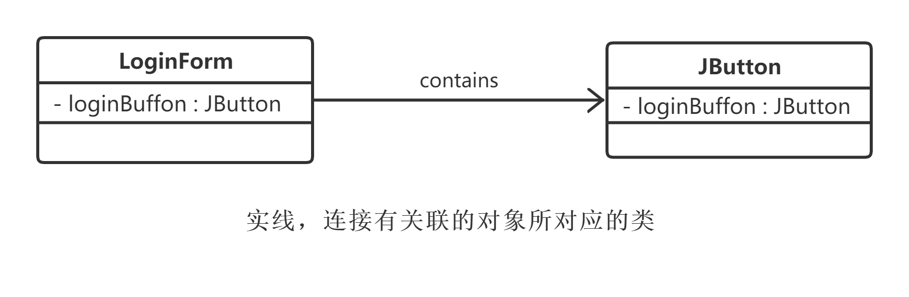
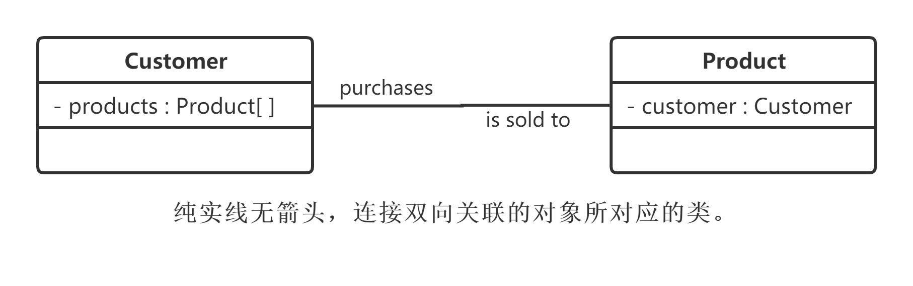
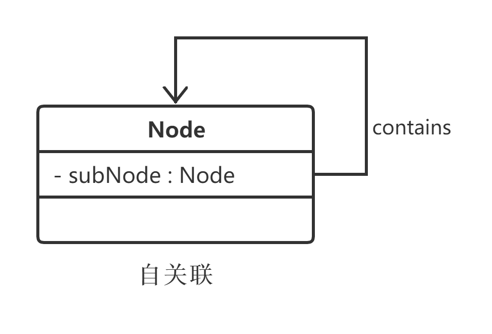
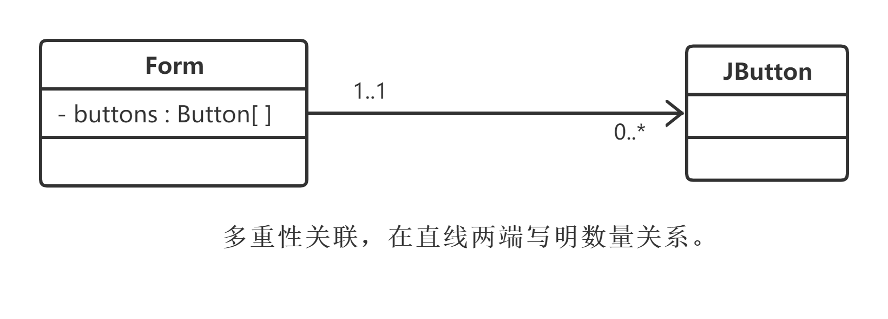
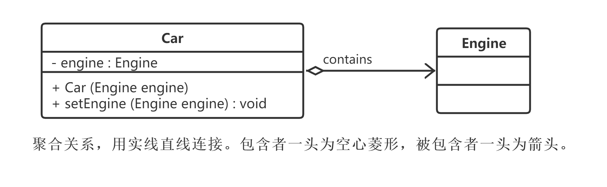
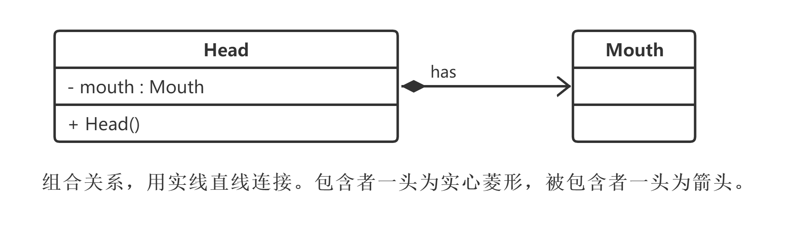
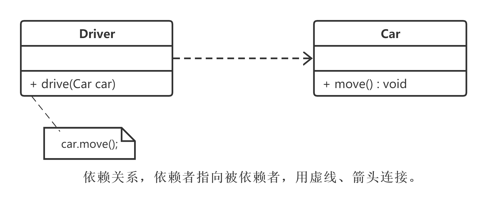
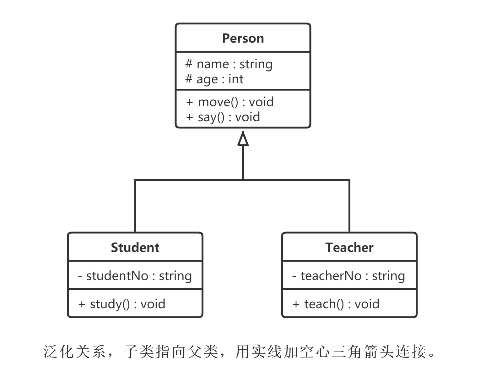
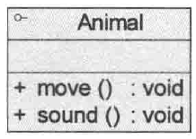
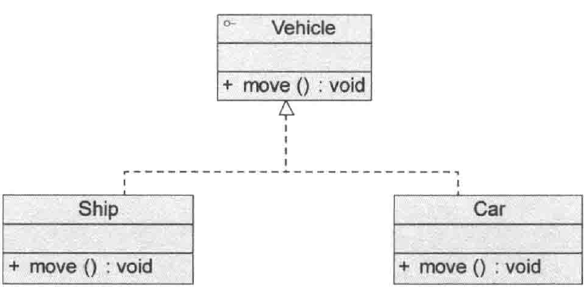

# 内容

在软件系统中，类不是孤立存在的，类与类之间存在相互关系，因此需要通过UML来描述这些类之间的关系。类之间具有如下几种关系。

1. 关联关系
    1. 双向关联
    2. 单向关联
    3. 自关联
    4. 多重性关联
    5. 聚合关系
    6. 组合关系
2. 依赖关系
3. 泛化关系（继承关系）
4. 接口与实现关系
以上是按照刘伟的分类方式来说的。

更易理解、符合名字定义的分类方式如下：

1. 继承关系（即泛化关系，将接口与实现关系也包含在内）
2. 组合关系
3. 聚合关系
4. 依赖关系
5. 关联关系
# 关联关系

关联关系（Association）是类与类之间最常用的一种关系，它是一种**结构化关系**，用于表示一类对象与另一类对象之间有联系，如汽车和轮胎、师傅和徒弟、班级和学生等。

**在UML类图中，用实线连接有关联的对象所对应的类**，在使用Java、`C#`和`C++`等编程语言**实现关联关系时，通常将一个类的对象作为另一个类的属性**。

* 要点
    * 在使用类图表示关联关系时可以在关联线上标注角色名，**一般使用一个表示两者之间关系的动词或者名词表示角色名(有时该名词为实例对象名)**
    * 关系的两端代表不同的两种角色，因此在一个关联关系中可以包含两个角色名。
    * 角色名不是必需的，可以根据需要增加，其目的是使类之间的关系更加明确。

例如，在一个登录界面类Login Form中包含一个JButton类型的注册按钮login Button，它们之间可以表示为关联关系，代码实现时可以在Login Form中定义一个名为login Button的属性对象，其类型为JButton，如图所示。



关联关系可以细分为6种。

## 双向关联

默认情况下，关联是双向的。例如，顾客(Customer)购买商品(Product)并拥有商品；反之，卖出的商品总有某个顾客与之相关联。因此，`Customer`类和`Product`类之间具有双向关联关系，**用直线表示**，如图所示。



## 单向关联

类的关联关系也可以是单向的，单向关联用带箭头的实线表示。例如，顾客(Customer)拥有地址(Address),则Customer类与Address类具有单向关联关系。与第一个图`LoginForm - JButton`的关系一样。**用直线加箭头表示**。

## 自关联

在系统中可能存在一些类的属性对象类型为该类本身，这种特殊的关联关系称为自关联。例如，一个节点类(Node)的成员又是节点对象，如图。



## 多重性关联

又称为重数性关联关系（Multiplicity），表示一个类的对象与另一个类的对象连接的个数。

在UML中多重性关联关系可以直接**在关联直线上增加一个数字表示与之对应的另一个类的对象的个数**。

* 下表：多重性表示方式列表

| 表示方式 | 多重性说明                                                   |
| -------- | ------------------------------------------------------------ |
| `1..1`   | 表示另一个类的1个对象**只与1个**该类对象有关系               |
| `0..*`   | 表示另一个类的1个对象与**0个或多个**该类对象有关系           |
| `1..*`   | 表示另一个类的1个对象与**1个或多个**该类对象有关系           |
| `0..1`   | 表示另一个类的1个对象**没有或只与1个**该类对象有关系         |
| `m..n`   | 表示另一个类的1个对象与最少m、最多n个该类对象有关系$(m\le n)$ |

例如，一个界面(Form)可以拥有0个或多个按钮(Button)，但是一个按钮只能属于一个界面。因此，一个Form类的对象可以与0个或多个Button类的对象相关联，但一个Button类的对象只能与一个Form类的对象关联，如图。



## 聚合关系

聚合关系（Aggregation）**表示一个整体与部分**的关系。通常在定义一个整体类后，再去分析这个整体类的组成结构，从而找出一些成员类，该整体类和成员类之间就形成了聚合关系。如一台计算机包含显示器、主机、键盘、鼠标等部分，就可以使用聚合关系来描述整体与部分之间的关系。

在聚合关系中，成员类是整体类的一部分，即成员对象是整体对象的一部分，但是成员对象可以脱离整体对象独立存在。在UML中，聚合关系用带空心菱形的直线表示。例如，汽车发动机(Engine)是汽车(Car)的组成部分，但是汽车发动机可以独立存在，因此汽车和发动机是聚合关系，如图所示。



Car中定义了一个Engine类型的成员变量，从语义上来说，Engine是Car的一部分，但是Engine对象可以脱离Car单独存在。因此，**在类Car中并不直接实例化Engine，而是通过构造函数或者setter设值将在类外部实例化好的Engine对象以参数形式传入Car中**，这种传入方式称为**注入（Injection）**。正因为Car和Engine的实例化时刻不相同，因此**它们之间不存在生命周期的制约关系**，而**仅仅只是整体与部分之间的关系**而已。

## 组合关系

组合关系（Composition）也表示类之间整体和部分的关系，但是组合关系中**部分和整体具有统一的生存期**。**一旦整体对象不存在，部分对象也将不存在**，部分对象与整体对象之间具有**同生共死**的关系。例如一个界面对象与其包含的按钮、文本框、静态文本等成员对象，如果界面对象在内存中被销毁，则所有成员均被销毁。

在组合关系中，成员类是整体类的一部分，而且整体类可以控制成员类的生命周期，即成员类的存在依赖于整体类。

在UML中，组合关系用带**实心菱形**的直线表示。例如，人的头(Head)与嘴巴(Mouth)，嘴巴是头的组成部分之一，而且如果头没了，则嘴巴也就没了，因此头和嘴巴是组合关系，如图所示。



Head中定义了一个Mouth类型的成员，而且在Head的构造函数中实例化Mouth对象，因此在创建Head对象的同时将创建Mouth对象，在销毁Head对象的同时销毁Mouth对象。**它们之间不仅仅只是整体与部分之间的关系，而且整体还可以控制部分的生命周期**。

* 聚合和组合的对比
    * 聚合关系表示整体与部分的关系比较弱，而组合关系比较强；
    * 聚合关系中代表部分事物的对象与代表整体事物的对象的生存期无关，删除整体对象并不表示部分对象被删除。
    * 从代码实现的角度来看也略有区别，聚合关系通过对象注入的方式来实现，而组合关系通过在整体类的构造函数中实例化成员类来实现。
    * 但是它们的**共同点是一个类的实例为另一个类的成员对象**。

聚合关系和组合关系与普通的关联关系主要是语义上的区别，如表示客户类与产品类的关系就不能用聚合和组合，因为产品并不是客户的一部分，不存在整体与部分关系，只能用普通的关联关系。
# 依赖关系

依赖关系（Dependency）**是一种使用关系**，被使用者的改变有可能会影响到使用者，在需要**表示一个事物使用另一个事物**时使用依赖关系。

大多数情况下，依赖关系**体现在某个类的方法使用另一个类的对象作为参数**。

在UML中，依赖关系**用带箭头的虚线**表示，由依赖的一方指向被依赖的一方。例如，驾驶员开车，在`Driver`类的`drive()`方法中将`Car`类型的对象`car`作为一个参数传递，以便在`drive()`方法中能够调用`car`的`move()`方法，且驾驶员的`drive()`方法依赖车的`move()`方法，因此类`Driver`依赖类`Car`，如图所示。



在具体实现时：

1. 如果在一个类的方法中调用了另一个类的静态方法；或：
2. 在一个类的函数中定义了另一个类的对象作为其局部变量

也是依赖关系的表现形式，但是这个关系需要在实现阶段慢慢浮现出来，在分析设计阶段可以暂时不予考虑。

# 泛化关系

泛化关系（Generalization）也就是继承关系，**也称为“is-a-kind-of”关系**。

泛化关系用于**描述父类与子类**之间的关系，父类又称作基类或超类，子类又称作派生类。

在UML中，**泛化关系用带空心三角形的直线**来表示。

在代码实现时，**使用面向对象的继承机制来实现泛化关系**，如在Java语言中使用extends关键字，在`C++/C#`中使用冒号`:`来实现。例如，Student类和Teacher类都是Person类的子类，Student类和Teacher类继承了Person类的属性和方法，Person类的属性包含姓名(name)和年龄(age)，每一个Student和Teacher也都具有这两个属性，另外Student类增加了属性学号`(studentNo)`，Teacher类增加了属性教师编号`(teacherNo)`，Person类的方法包括行走`move()`和说话`say()`，Student类和Teacher类继承了这两个方法，而且Student类还新增方法`study()`，Teacher类还新增方法`teach()`，如图所示。



# 接口与实现关系

在很多面向对象语言中都引入了接口的概念，如Java、`C#`等。在接口中，一般没有属性，而且所有的操作都是抽象的，只有操作的声明，没有操作的实现。

UML中用与类的表示法类似的方式表示接口，如图所示。



接口之间也可以有与类之间关系类似的继承关系和依赖关系，但是接口和类之间还存在一种**实现关系（Realization）**。在这种关系中，类实现了接口，类中的操作实现了接口中所声明的操作。

在UML中，**类与接口之间的实现关系用带空心三角形的虚线来表示**。例如，定义了一个交通工具接口`Vehicle`，其中有一个抽象操作`move()`，在类`Ship`和类`Car`中都实现了该`move()`操作，不过具体的实现细节将会不一样，如图所示。



实现关系在用代码实现时，不同的面向对象语言也提供了不同的语法，如在Java语言中使用`implements`关键字，在`C++/C#`中使用冒号`:`来实现。

# 参考文献

```
[1] 刘伟. 设计模式.
```
