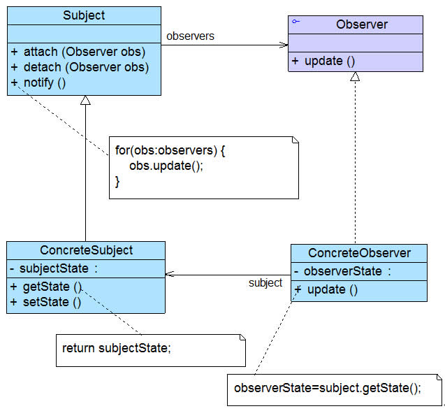

# 内容

1. 行为型模式
2. 观察者模式

* 行为型模式
  * 关注系统中对象之间的相互交互，研究运行时对象之间的互相通信和协作，明确对象职责。

# 观察者模式

* 模式动机：建立一套低耦合的消息触发机制。

建立一种对象与对象之间的依赖关系，一个对象发生改变时，将自动通知其他对象，其他对象将相应做出反应。在此，发生改变的对象称为观察目标，被通知的对象成为观察者，一个观察目标可以对应多个观察者，而且这些观察者之间没有相互联系，可以根据需要增加和删除观察者，使得系统更易于扩展，这就是观察者模式的模式动机。

* 观察者模式概述

观察者模式是使用频率最高的设计模式之一。

建立对象间一对多的关联关系，并能使一个对象的变化被所有关联对象感知。

* 定义

观察者模式(Observer Pattern)：定义对象之间的一种一对多依赖关系，使得每当一个对象状态发生改变时，其相关依赖对象皆得到通知并被自动更新。观察者模式的别名包括**发布-订阅(Publish/Subscribe)模式**、**模型-视图(Model/View)模式**、**源-监听器(Source/Listener）模式**或**从属者(Dependents)模式**。

观察者模式是一种对象行为型模式。

## 类之间的关系

观察者模式结构中通常包括观察目标和观察者两个继承层次结构，其结构如图所示：



  在观察者模式结构图中包含如下几个角色：

* **Subject（目标）**：**目标**又称为**主题**，它是指**被观察的对象**。
  * 在目标中定义了一个观察者集合，一个观察目标可以接受任意数量的观察者来观察，它提供一系列方法来增加和删除观察者对象，如`attach(ObServer*)`，`detach(Observer*)`。
  * 同时它定义了通知方法notify()。目标类可以是接口，也可以是抽象类或具体类。
* **ConcreteSubject（具体目标）**：具体目标是目标类的子类。如果无须扩展目标类，则具体目标类可以省略。
  * 通常它包含有经常发生改变的数据，当它的状态发生改变时，向它的各个观察者发出通知；
  * 同时它还实现了在目标类中定义的抽象业务逻辑方法（如果有的话）。
* **Observer（观察者）**：观察者将对观察目标的改变做出反应，观察者一般定义为接口。
  * 该接口声明了更新数据的方法update()，因此又称为抽象观察者。
* **ConcreteObserver（具体观察者）**：在具体观察者中维护一个指向具体目标对象的引用，它存储具体观察者的有关状态，这些状态需要和具体目标的状态保持一致；它实现了在抽象观察者Observer中定义的update()方法。
  * 通常在实现时，可以调用具体目标类的attach()方法将自己添加到目标类的集合中或通过detach()方法将自己从目标类的集合中删除。

## 代码示例

* 观察目标

下面通过示意代码来对该模式进行进一步分析。首先我们定义一个抽象目标Subject，典型代码如下所示：

```java
import java.util.*;
abstract class Subject
{
    //定义一个观察者集合用于存储所有观察者对象
    protected ArrayList observers<Observer> = new ArrayList();
    
    //注册方法，用于向观察者集合中增加一个观察者
	public void attach(Observer observer)
    {
    	observers.add(observer);
    }
    //注销方法，用于在观察者集合中删除一个观察者
	public void detach(Observer observer)
    {
    	observers.remove(observer);
    }
    //声明抽象通知方法
	public abstract void notify();
}
```

具体目标类ConcreteSubject是实现了抽象目标类Subject的一个具体子类，其典型代码如下所示：

```java
class ConcreteSubject extends Subject
{
    //实现通知方法
	public void notify() 
    {
        //遍历观察者集合，调用每一个观察者的响应方法
		for(Object obs : observers) 
        {
			((Observer)obs).update();
		}
	}	
}
```

* 观察者

抽象观察者角色一般定义为一个接口，通常只声明一个update()方法，为不同观察者的更新（响应）行为定义相同的接口，这个方法在其子类中实现，不同的观察者具有不同的响应方法。抽象观察者Observer典型代码如下所示。

```java
interface Observer 
{
    //声明响应方法
	public void update();
}
```

在具体观察者ConcreteObserver中实现了update()方法，其典型代码如下所示：

```java
class ConcreteObserver implements Observer 
{
    //实现响应方法
	public void update() {
		//具体响应代码
	}
}
```

在有些更加复杂的情况下，具体观察者类`ConcreteObserver`的`update()`方法在执行时需要使用到具体目标类`ConcreteSubject`中的状态（属性），**因此在`ConcreteObserver`与`ConcreteSubject`之间有时候还存在关联或依赖关系**，在`ConcreteObserver`中定义一个`ConcreteSubject`实例，通过该实例获取存储在`ConcreteSubject`中的状态。

如果`ConcreteObserver`的`update()`方法不需要使用到`ConcreteSubject`中的状态属性，则可以对观察者模式的标准结构进行简化，在具体观察者`ConcreteObserver`和具体目标`ConcreteSubject`之间无须维持对象引用。

**如果在具体层具有关联关系，系统的扩展性将受到一定的影响，增加新的具体目标类有时候需要修改原有观察者的代码**，在一定程度上违反了“开闭原则”，但是如果原有观察者类无须关联新增的具体目标，则系统扩展性不受影响。

## 代码练习

```cpp
using namespace std;
class Subject;
class Observer
{
protected:
    string name;
    Subject * sub;
public:
    Observer(string na, Subject* s)
        : name(na), sub(s)
    {}
    virtual ~Observer() {}
public:
    virtual void update() = 0;
    
};
class StockObserver : public Observer
{
public:
    StockObserver(string ns, Subject* sub)
        : Observer(na, sub)
    {}
	void update()
    {
        cout << name << " 收到消息: " << sub->event << endl;
        if(sub->event == "Boss来了!")
        {
            cout << "马上关闭炒股软件，装作很认真工作的样子！" << endl;
        }
    }
};
class GameObserver : public Observer
{
public:
    GameObserver(string ns, Subject* sub)
        : Observer(na, sub)
    {}
	void update()
    {
        cout << name << " 收到消息: " << sub->event << endl;
        if(sub->event == "Boss来了!")
        {
            cout << "马上关闭游戏，装作很认真工作的样子！" << endl;
        }
    }
};
/* 通知者 */
class Subject
{
protected:
    list<Observer*> observers;	//list<std::shared_ptr<Observer>> objservers;
public:
    string event;	// 事件
    virtual void attach(Observer*) = 0;
    virtual void detach(Observer*) = 0;
    virtual void notify() = 0;
};
/* 秘书 */
class Secretary : public Subject
{
public:
    void attach(Observer* obs)
    {
        observers.push_back(obs);
    }
    void detach(Observer* obs)
    {
        observers.remove(obs);
    }
    void notify()
    {
        for(auto & x : observers)
        {
            x->update();
        }
    }
};
int main()
{
    Subject * dwq = new Secretary();	//
    Observer * xiaoshuai = new GameObserver("小帅", dwq);
    Observer * liming = new GameObserver("李明", dwq);
    Observer * wangfang = new StockObserver("王芳", dwq);
    dwq->attach(xiaoshuai);
    dwq->attach(liming);
    dwq->attach(wangfang);
    
    dwq->event = "去吃饭了!";
    dwq->notify();
    cout << endl;
    
    dwq->event = "老板来了!";
    dwq->notify();
    cout << endl;
    return 0;
}
```

# 观察者模式与MVC

在当前流行的MVC(Model-View-Controller)架构中也应用了观察者模式，MVC是一种架构模式，它包含三个角色：模型(Model)，视图(View)和控制器(Controller)。

其中**模型可对应于观察者模式中的观察目标**，而**视图对应于观察者**，控制器可充当两者之间的中介者。当**模型层的数据发生改变时，视图层将自动改变其显示内容**。

**模型层提供的数据是视图层所观察的对象**，在视图层中包含两个用于显示数据的图表对象，一个是柱状图，一个是饼状图，相同的数据拥有不同的图表显示方式，如果模型层的数据发生改变，两个图表对象将随之发生变化，这意味着图表对象依赖模型层提供的数据对象，因此数据对象的任何状态改变都应立即通知它们。同时，这两个图表之间相互独立，不存在任何联系，而且图表对象的个数没有任何限制，用户可以根据需要再增加新的图表对象，如折线图。在增加新的图表对象时，无须修改原有类库，满足“开闭原则”。

# 适用场景

在以下情况下可以考虑使用观察者模式：

1. 一个抽象模型有两个方面，其中一个方面依赖于另一个方面，将这两个方面封装在独立的对象中使它们可以各自独立地改变和复用。
2. 一个对象的改变将导致一个或多个其他对象也发生改变，而并不知道具体有多少对象将发生改变，也不知道这些对象是谁。
3. 需要在系统中创建一个触发链，A对象的行为将影响B对象，B对象的行为将影响C对象……，可以使用观察者模式创建一种链式触发机制。
