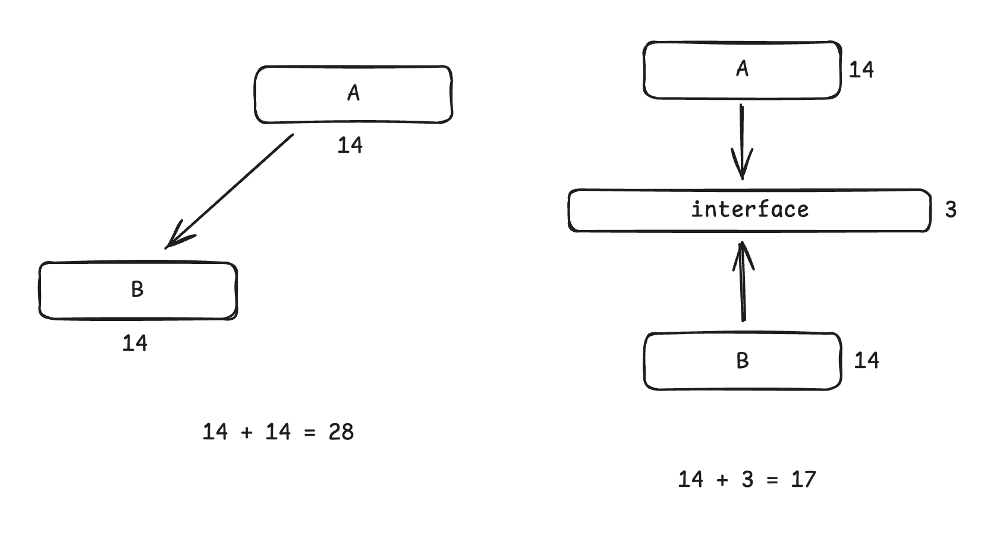
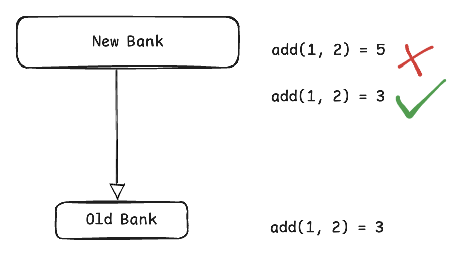

# 内容

1. 面向对象的设计原则
2. 常见七种设计原则
# 面向对象的设计原则：可维护性的复用

对于面向对象软件系统的设计而言，在支持可维护性的同时，提高系统的可复用性是一个至关重要的问题。
如何同时提高一个软件系统的可维护性和可复用性是面向对象设计需要解决的核心问题之一。
在面向对象设计中，可维护性的复用是以设计原则为基础的。

面向对象设计原则为支持可维护性复用而诞生，这些原则蕴含在很多设计模式中，它们是从许多设计方案中总结出的指导性原则。面向对象设计原则也是用于评价一个设计模式的重要指标之一，在设计面向对象软件系统的过程中，要多思考，“XXX模式符合XXX原则吗？”、“XXX模式违反了XXX原则吗？”。
# 常见设计原则 - SOLID

1. Robert C. Martin（“Uncle Bob”）在2000年代初期提出并推广了SOLID原则，《Agile Software Development, Principles, Patterns, and Practices》一书中，对这些原则进行了详细的解释和讨论。
2. 里氏代换原则（LSP）由计算机科学家Barbara Liskov在1987年的一篇名为《Data Abstraction and Hierarchy》的论文中首次提出。虽然Liskov并没有明确提出SOLID这个术语，但她的工作为其中的LSP原则奠定了基础。

| 设计原则名称                             | 定义                                                                                                      | 使用频率  |
| ---------------------------------- | ------------------------------------------------------------------------------------------------------- | ----- |
| 单一职责原则, Single Responsibility, SRP | 一个类只负责一个功能领域中的相应职责                                                                                      | ★★★★☆ |
| 开闭原则, Open-Closed, OCP             | 软件实体应对扩展开放，而对修改关闭                                                                                       | ★★★★★ |
| 里氏代换原则, Liskov Substitution, LSP   | 如果一个子类可以替换其父类，并且程序的行为没有发生变化，那么这个子类是符合里氏代换原则的。<br>换句话说，子类对象必须能够替换父类对象，并且不影响程序的正确性。                       | ★★★★★ |
| 接口隔离原则, Interface Segregation, ISP | 客户端不应该被迫依赖它们不需要的接口，即一个类对另一个类的依赖应该建立在最小的接口上。<br>具体来说，接口隔离原则提倡将臃肿的接口拆分为多个小型的、特定客户的接口，这样每个接口只包含客户端真正需要的方法。 | ★★☆☆☆ |
| 依赖倒转原则, Dependence Inversion, DIP  | （软件设计的灵魂）高层模块不应该依赖于低层模块，二者都应该依赖于抽象；抽象不应该依赖于细节，细节应该依赖于抽象。                                                | ★★★★★ |
## 开闭原则
一个软件实体（类、模块、函数等）应该在不修改其源代码的情况下，扩展或增强其行为。
通过在不修改现有代码的情况下增加新功能，减少对已稳定系统的影响，避免引入新的错误。这可以通过使用接口、抽象类和多态等面向对象的设计机制来实现。
### 示例
假设我们有一个简单的图形绘制程序，最初只支持绘制圆形。为了遵循开闭原则，我们首先定义一个图形接口，并实现一个圆形类：
```java
// 图形接口
interface Shape {
    void draw();
}

// 圆形类
class Circle implements Shape {
    @Override
    public void draw() {
        System.out.println("Drawing a Circle");
    }
}

// 绘制类
class Drawing {
    private List<Shape> shapes;

    public Drawing() {
        shapes = new ArrayList<>();
    }

    public void addShape(Shape shape) {
        shapes.add(shape);
    }

    public void drawShapes() {
        for (Shape shape : shapes) {
            shape.draw();
        }
    }
}

public class Main {
    public static void main(String[] args) {
        Drawing drawing = new Drawing();
        drawing.addShape(new Circle());
        drawing.drawShapes();
    }
}
```
在这个例子中，我们的绘制程序可以绘制圆形。如果我们需要添加新的图形，例如矩形，我们可以通过扩展而不是修改现有代码来实现：
```java
// 矩形类
class Rectangle implements Shape {
    @Override
    public void draw() {
        System.out.println("Drawing a Rectangle");
    }
}

public class Main {
    public static void main(String[] args) {
        Drawing drawing = new Drawing();
        drawing.addShape(new Circle());
        drawing.addShape(new Rectangle());
        drawing.drawShapes();
    }
}
```
通过添加一个实现了Shape接口的新类Rectangle，我们可以扩展绘制程序的功能，而不需要修改现有的Drawing类和Circle类。这种设计符合开闭原则，因为我们通过扩展（添加新类）而不是修改现有代码来增加新功能。
## 依赖倒转原则（DIP）

1. 从项目管理的角度来说，如果A直接依赖B，那么开发周期就会被B模块拖累，A模块闲置，人力效率不高，从甘特图看需要开发28天。
    1. 而如果A、B在事先经过良好的协商，规范出一套接口的话，A、B就可以共同依赖这个接口，各自同时开发。假如协商需要3天，那么开发周期只需要$3+14=17$天。
1. 从软件的扩展性来说，如果A直接依赖于B，没有事先协商好，那么B可能不能完全满足A的需求，到时候还是需要不断修改代码，开发效率低下。
    1. 如果都依赖一个接口，那么后期的扩展只需要在接口上增设方法即可。
### 示例
假设有一个简单的场景，一个Service类依赖于一个Repository类：
```java
public class Repository {
    public void save(Object data) {
        // 保存数据的实现
    }
}

public class Service {
    private Repository repository;

    public Service() {
        this.repository = new Repository();
    }

    public void process(Object data) {
        // 处理数据
        repository.save(data);
    }
}
```
在这个例子中，Service类直接依赖于具体的Repository类。这种设计违反了依赖倒转原则。如果我们想要更改数据存储的方式，比如使用另一个数据存储实现，就必须修改Service类的代码。

按照依赖倒转原则，我们可以使用接口来实现依赖注入，将Repository的实现抽象化：
```java
public interface IRepository {
    void save(Object data);
}

public class Repository implements IRepository {
    @Override
    public void save(Object data) {
        // 保存数据的实现
    }
}

public class Service {
    private IRepository repository;

    public Service(IRepository repository) {
        this.repository = repository;
    }

    public void process(Object data) {
        // 处理数据
        repository.save(data);
    }
}
```
在这个设计中，Service类依赖于IRepository接口，而不是具体的Repository类。这样，如果我们想要更改数据存储的方式，只需要提供一个实现IRepository接口的新类即可，而不需要修改Service类的代码。通过这种方式，高层模块（Service）和低层模块（Repository）都依赖于抽象（IRepository），细节（Repository的具体实现）依赖于抽象（IRepository），符合依赖倒转原则。

这种设计提高了系统的灵活性和可维护性，使得代码更容易扩展和修改。
## 接口隔离原则
### 示例
假设有一个大型接口IMultiFunctionDevice，其中包含多种功能的方法：
```java
public interface IMultiFunctionDevice {
    void print();
    void scan();
    void fax();
    void copy();
}
```
如果某个客户端只需要打印功能，那么它必须实现所有的方法，即使不需要扫描、传真和复印功能。这违反了接口隔离原则。

按照接口隔离原则，我们可以将这个大接口拆分为多个小接口：
```java
public interface IPrinter {
    void print();
}

public interface IScanner {
    void scan();
}

public interface IFax {
    void fax();
}

public interface ICopier {
    void copy();
}
```
然后，对于只需要打印功能的客户端，它只需要依赖IPrinter接口：
```java
public class SimplePrinter implements IPrinter {
    @Override
    public void print() {
        // 实现打印功能
    }
}
```
这样，客户端只依赖于它需要的接口，实现了接口隔离原则的目标。
## 里氏替换原则
子类对象必须能够替换父类对象（兼容父类对象的功能），并且不影响程序的正确性。
里氏代换原则主要有以下几个要点：
1. **子类必须完全实现父类的方法**：子类不能抛出父类没有抛出的异常，子类的方法参数要与父类方法参数类型一致，返回值类型也要一致或是其子类型。
2. **子类可以有自己的特性**，但这些特性不能改变父类原有功能的含义和行为。
3. **继承的原则**：子类应该扩展父类的功能，而不是削弱父类的功能。也就是说，子类不应该删除父类中已有的功能。

比如：Old Bank的add行为结果是3，而New Bank的add虽然形式上一致，但行为却不正确。违反了里氏替换原则。猜测New Bank在重写add方法后，优化代码或更新、升级组件后造成了副作用，导致运行时行为不一致、结果不正确。

### 示例
考虑一个父类Bird和一个子类Penguin的例子：
```java
public class Bird {
    public void fly() {
        System.out.println("Bird is flying");
    }
}

public class Penguin extends Bird {
    @Override
    public void fly() {
        throw new UnsupportedOperationException("Penguins cannot fly");
    }
}
```
在这个例子中，Penguin不能替换Bird，因为企鹅不能飞。这违反了里氏代换原则。正确的做法是重新设计类结构，使得企鹅和其他鸟类能够更好地反映现实中的行为：
```java
public class Bird {
    public void move() {
        System.out.println("Bird is moving");
    }
}

public class FlyingBird extends Bird {
    public void fly() {
        System.out.println("Bird is flying");
    }
}

public class Penguin extends Bird {
    @Override
    public void move() {
        System.out.println("Penguin is walking or swimming");
    }
}
```
在这个设计中，FlyingBird继承了Bird，并增加了fly方法，而企鹅只是继承了Bird，并重写了move方法。这样，企鹅和其他鸟类都能正确替换Bird，符合里氏代换原则。
# 其他设计原则

| 设计原则名称                       | 定义                                    | 使用频率  |
| ---------------------------- | ------------------------------------- | ----- |
| 合成复用原则, Composite Reuse, CRP | 尽量使用对象组合，而不是继承来达到复用的目的                | ★★★★☆ |
| 迪米特法则, Law of Demeter, LoD   | 一个软件实体应当尽可能少地与其他实体发生相互作用，只与最近关系的实体关联。 | ★★★☆☆ |
## 迪米特法则
迪米特法则由Ian Holland在1987年提出，并首次在Northeastern University（美国东北大学）的Demeter Project中得到应用，因此得名。
该原则被认为是一种促进模块化和高内聚低耦合设计的重要策略，广泛应用于面向对象的软件设计中。

**核心思想是：一个对象应当对其他对象有最少的了解**，具体来说：
1. **一个对象只应与直接的朋友通信**：即仅与自己直接持有的对象或在方法中创建的对象通信，而不应与被间接持有的对象通信。
2. **避免“火车式”方法调用**：不要通过一个对象链式地调用多个对象的方法，例如 a.getB().getC().doSomething()。
3. **通过引入中介减少对象间的直接依赖**：通过封装对象之间的关系，使得对象之间的通信通过中介完成，从而减少直接依赖。
### 示例
假设有以下类结构：
```java
class Engine {
    public void start() {
        System.out.println("Engine started");
    }
}

class Car {
    private Engine engine;

    public Car() {
        this.engine = new Engine();
    }

    public Engine getEngine() {
        return engine;
    }
}

class Driver {
    public void startCar(Car car) {
        car.getEngine().start(); // 违反了迪米特法则
    }
}
```
在这个例子中，Driver类通过Car类访问Engine类的方法，违反了迪米特法则。我们可以通过引入一个中介方法来改进：
```cpp
class Car {
    private Engine engine;

    public Car() {
        this.engine = new Engine();
    }

    public void startEngine() {
        engine.start();
    }
}

class Driver {
    public void startCar(Car car) {
        car.startEngine(); // 符合迪米特法则
    }
}
```
在改进后的设计中，Driver类不再直接访问Engine类的方法，而是通过Car类的startEngine方法来启动引擎。这符合迪米特法则，降低了对象之间的耦合性，提高了系统的可维护性。
# 设计原则的价值

优秀的面向对象的程序应该是有以下五个特征的：低耦合，高内聚，高复用，易维护，易扩展。

1. 开闭原则让程序易扩展，易维护。
2. 里氏替换原则、依赖倒置和合成复用原则可以降低耦合。
3. 接口隔离、单一职责原则和迪米特原则可以提高内聚性。

而低耦合，高内聚的代码才能实现高复用。

