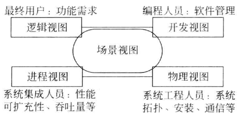
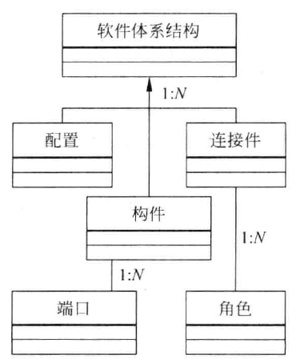
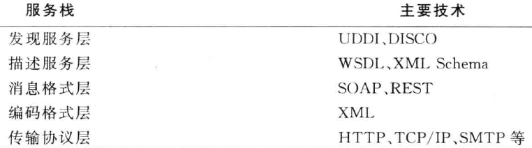
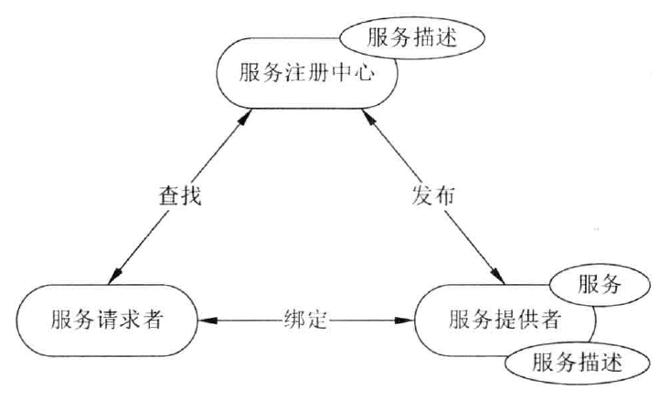

参考书籍：张友生编著 - 软件体系结构原理、方法与实践（第2版）

# 第1章 软件体系结构概论

## 构件

一般认为，构件是指语义完整、语法正确和有可重用价值的单位软件，是软件重用过程中可以明确辨识的系统；结构上，它是语义描述、通信接口和实现代码的复合体。

有的可以独立工作，有的需要与其他配合工作；使用和开发生产无关，只要按照标准来生产；

## 构件模型

构件模型是对构件本质的抽象描述，主要是为构件的制作与构件的重用提供依据。

### 青鸟构件模型

青鸟构件模型由外部接口和内部结构两部分组成；

外部接口说明了构件所提供的服务（消息、操作、变量）；

内部结构分为内部成员以及内部成员之间的关系。其中内部成员包括具体成员与虚拟成员；而成员关系包括内部成员之间的互联，以及内部成员与外部接口之间的互联

## 构件获取

1. 从现有构件中获得符合要求的构件，直接使用或作适应性修改，得到可重用的构件。
2. 通过遗留工程，将具有潜在重用价值的构件提取出来，得到可重用的构件。
3. 从市场上购买现成的商业构件， 即COTS(Commercial Off-The-Shell)构件。
4. 开发新的符合要求的构件。

## 构件管理

### 构件描述

从管理角度出发，也需要对构件进行描述，例如：实现方式、实现体、注释、生产者、生产日期、大小、价格、版本和关联构件等信息，它们与构件模型共同组成了对构件的完整描述。

### 构件分类与组织

为了给用户在查询构件时提供方便，同时也为了更好地重用组件，必须对收集和开发的构件进行分类并置于构件库的适当位置。构件库的组织应方便构件的存储和检索；

可重用技术对构件库组织方法的要求：

1. 支持构件库的各种维护动作，如增加、删除、修改构件，尽量不要影响构件库的结构。
2. 不仅支持精确匹配，还要支持相似构件的查找。
3. 不仅能进行简单的语法匹配，而且能够查找在功能或行为方面等价或相似的构件。
4. 对应用领域具有较强的描述能力和较好的描述精度。
5. 库管理员和用户容易使用。

### 构件分类三大方法

1. 关键字分类法 - 分层逐次树状图
2. 刻面分类法 - 定义若干用于刻画构件特征的"面"
3. 超文本组织方法

### 人员及权限管理

有必要对不同使用者的访问权限进行限制，保证数据安全；

构件库系统可包括5类用户，即注册用户、公共用户、构件提交者、一般系统管理员、超级系统管理员。

## 理解与评价构件

1. 构件的功能与行为
2. 相关的领域知识
3. 可适应性约束条件与例外情形
4. 可以预见的修改部分及修改方法

理解构件的另一种重要手段：逆向工程，试图通过对构件的分析，结合领域知识，半自动地生成相应的设计信息，然后借助设计信息完成对构件的理解和修改。

对构件可重用的评价：是通过收集并分析构件的用户在实际重用该构件的历史过程中的各种反馈信息来完成的。这些信息包括：重用成功的次数，对构件的修改量，构件的健壮性度量，性能度量等等。

## 软件体系结构含义

软件体系结构为软件系统提供了一个结构、行为和属性的高级抽象，由构成系统的元素的描述、这些元素的相互作用、指导元素集成的模式以及这些模式的约束组成。

软件体系结构不仅指定了系统的组织结构和拓扑结构，并且显示了系统需求和构成系统的元素之间的对应关系，提供了一些设计决策的基本原理。

## 软件体系结构设计的方法

两大类方法：过程驱动方法和问题列表驱动方法。

过程驱动方法又分为：

1. 面向对象方法，与OOA/OOD相似，但更侧重接口与交互。
2. “4+1”模型方法。
3. 基于场景的迭代方法。

基于过程驱动的体系结构设计方法适用范围广, 易于裁剪, 具备动态特点, 通用性与实践性强。

问题列表驱动法适用于特定领域, 是静态的, 可以实现量化体系结构设计空间。其基本思想是枚举设计空间, 并考虑设计维的相关性, 以此来选择体系结构的风格。

## 软件体系结构发展史

1. 无体系结构设计阶段
   1. 以汇编语言进行小规模应用程序开发为特征
2. 萌芽阶段
   1. 出现了程序结构设计主题，以控制流图和数据流图构成软件结构为特征
3. 初期阶段
   1. 出现了从不同侧面描述系统的结构模型，以UML为典型代表。
4. 高级阶段
   1. 以描述系统的高层抽象结构为中心，不关心具体的建模细节，划分了体系结构模型与传统软件结构的界限，该阶段以Kruchten提出的“4+1”模型为标志

# 第2章 软件体系结构建模

## 4+1视图

4指的是逻辑、开发、进程、物理视图，1指的是场景视图。每一个视图只关心系统的一个侧面，5个视图结合在一起才能反映系统的软件体系结构的全部内容。

### 逻辑视图

逻辑视图：是从最终用户的角度来看的，关注点是功能需求；

逻辑视图主要支持系统的功能需求，即系统提供给最终用户的服务。
在逻辑视图中，系统分解成一系列的功能抽象，这些抽象主要来自问题领域。这种分解不但可以用来进行功能分析，而且可用作标识在整个系统的各个不同部分的通用机制和设计元素。
在面向对象技术中，通过抽象、封装和继承，可以用对象模型来代表逻辑视图，用类图来描述逻辑视图。

### 开发视图

开发视图（也叫模块视图）：是从程序员的角度来看的，主要侧重软件模块的组织和管理；

开发视图也称模块视图，主要侧重于软件模块的组织和管理。
开发视图要考虑软件内部的需求，如软件开发的容易性、软件的重用和软件的通用性，要充分考虑由于具体开发工具的不同而带来的局限性。
开发视图通过系统输入输出关系的模型图和子系统图来描述。

### 进程视图

进程视图（也叫并发视图）：是从系统集成人员的角度来看的，主要侧重系统的运行特性（非功能型的），性能和可用性、吞吐量，性能可扩充性。

进程视图侧重于系统的运行特性，主要关注一些非功能性的需求。
进程视图强调并发性、分布性、系统集成性和容错能力，以及从逻辑视图中的主要抽象如何适合进程结构。它也定义逻辑视图中的各个类的操作具体是在哪一个线程中被执行的。
进程视图可以描述成多层抽象，每个级别分别关注不同的方面。在最高层抽象中，进程结构可以看作是构成一个执行单元的一组任务。
它可看成一系列独立的，通过逻辑网络相互通信的程序。它们是分布的，通过总线或局域网、广域网等硬件资源连接起来。

### 物理视图

物理视图：是从系统工程人员的角度来看的，主要考虑系统拓扑结构、设备安装、通信等

物理视图主要考虑如何把软件映射到硬件上，它通常要考虑到系统性能、规模、可靠性等。解决系统拓扑结构、系统安装、通讯等问题。
当软件运行于不同的节点上时，各视图中的构件都直接或间接地对应于系统的不同节点上。因此，从软件到节点的映射要有较高的灵活性，当环境改变时，对系统其他视图的影响最小。

### 场景视图

场景可以看作是那些重要系统活动的抽象，它使四个视图有机联系起来，从某种意义上说场景是最重要的需求抽象。在开发体系结构时，它可以帮助设计者找到体系结构的构件和它们之间的作用关系。
同时，也可以用场景来分析一个特定的视图，或描述不同视图构件间是如何相互作用的。
场景可以用文本表示，也可以用图形表示。

## 软件体系结构的核心模型

5个元素构成，配置、连接件、构件、端口、角色。

其中，配置、构件、连接件是最基本的元素。

构件是具有某种功能的可重用的软件模板单元，表示了系统中主要的计算元素和数据存储。构件有两种：复合构件和原子构件。复合构件由其他复合构件和原子构件通过连接组成。

连接件表示了构件之间的交互，简单的连接件如管道、过程调用、事件广播等，更为复杂的交互如客户-服务器通信协议，数据库和应用之间的SQL连接等。

配置表示构件和连接件的拓扑逻辑和约束；

构件的接口由1组端口组成；每个端口表示了构件和外部环境的交互点。

连接件作为建模软件体系结构的主要实体，同样也有接口，连接件的接口由1组角色构成；每一个角色定义了该连接件表示的交互的参与者。

# 第3章 软件体系结构风格

1. 管道/过滤器
2. 面向对象风格（数据抽象）
3. 基于事件的系统
4. 分层系统（层次结构）
5. 黑板系统（仓库系统、知识库）
6. C2系统

## 管道/过滤器

### 优点

1. 使得软构件具有良好的隐蔽性和高内聚、低耦合的特点；
2. 允许设计者将整个系统的输入/输出行为看成是多个过滤器的行为的简单合成；
3. 支持软件重用。只要提供适合在两个过滤器之间传送的数据，任何两个过滤器都可被连接起来
4. 系统维护和增强系统性能简单。新的过滤器可以添加到现有系统中来；旧的可以被改进的过滤器替换掉允许对一些如吞吐量、死锁等属性的分析；
5. 支持并行执行。每个过滤器是作为一个单独的任务完成，因此可与其它任务并行执行。

### 缺点

1. 通常导致进程成为批处理的结构。这是因为虽然过滤器可增量式地处理数据，但它们是独立的，所以设计者必须将每个过滤器看成一个完整的从输入到输出的转换；
2. 不适合处理交互的应用。当需要增量地显示改变时，这个问题尤为严重；
3. 因为在数据传输上没有通用的标准，每个过滤器都增加了解析和合成数据的工作，这样就导致了系统性能下降，并增加了编写过滤器的复杂性。

## 数据抽象和面向对象组织

### 优点

1. 因为对象对其它对象隐藏它的表示，所以可以改变一个对象的表示，而不影响其它的对象；
2. 设计者可将一些数据存取操作的问题分解成一些交互的代理程序的集合。

### 缺点

1. 为了使一个对象和另一个对象通过过程调用等进行交互,必须知道对象的标识。只要一个对象的标识改变了，就必须修改所有其他明确调用它的对象;
2. 必须修改所有显式调用它的其它对象，并消除由此带来的一些副作用。例如，如果A使用了对象B,C也使用了对象B,那么,C对B的使用所造成的对A的影响可能是料想不到的。

## 基于事件的系统（隐式调用风格）

这种风格的主要特点是事件的触发者并不知道哪些构件会被哪些事件影响。

这样不能假定构件的处理顺序，甚至不知道哪些过程会被调用，因此，许多隐式调用的系统也包含显式调用作为构件交互的补充形式。

### 优点

1. 为软件重用提供了强大的支持。当需要将一个构件加入现存系统中时，只需将它注册到系统的事件中。
2. 为改进系统带来了方便。当用一个构件代替另一个构件时，不会影响到其它构件的接口。

### 缺点

1. 构件放弃了对系统计算的控制。一个构件触发一个事件时，不能确定其它构件是否会响应它。而且即使它知道事件注册了哪些构件的构成，它也不能保证这些过程被调用的顺序。
2. 数据交换的问题。有时数据可被一个事件传递，但另一些情况下基于事件的系统必须依靠一个共享的仓库进行交互。在这些情况下全局性能和资源管理便成了问题。
3. 既然过程的语义必须依赖于被触发事件的上下文约束，关于正确性的推理存在问题。

## 分层系统

什么是层？层是一个具有相同属性的集合；

分层是理解问题的一种方法论，可以把复杂软件从大问题分为小问题，从视图的角度看可以降低问题复杂度。

### 优点

1. 支持基于抽象程度递增的系统设计，使设计者可以把一个复杂系统按递增的步骤进行分解
2. 支持功能增强，因为每一层至多和相邻的上下层交互，因此功能的改变最多影响相邻的上下层；
3. 支持重用。只要提供的服务接口定义不变，同一层的不同实现可以交换使用。这样，就可以定义一组标准的接口，而允许各种不同的实现方法

### 缺点

1. 并不是每个系统都可以很容易地划分为分层的模式，甚至即使一个系统的逻辑结构是层次化的，出于对系统性能的考虑，系统设计师不得不把一些低级或高级的功能综合起来；
2. 很难找到一个合适的、正确的层次抽象方法。

## 仓库系统及知识库

在仓库（repository)风格中，有两种不同的构件：中央数据结构说明当前状态，独立构件在中央数据存储上执行，仓库与外构件间的相互作用在系统中会有大的变化。

控制原则的选取产生两个主要的子类。若输入流中某类时间触发进程执行的选择，则仓库是一传统型数据库；另外，若中央数据结构的当前状态触发进程执行的选择，则仓库是一黑板系统。

黑板系统的传统应用是信号处理领域，如语音和模式识别，另一应用是松藕合代理数据共享存取。

黑板系统主要由三部分组成：

1. 知识源。知识源中包含独立的、与应用程序相关的知识，知识源之间不直接进行通信，它们之间的交互只通过黑板来完成。
2. 黑板数据结构。黑板数据是按照与应用程序相关的层次来组织的解决问题的数据，知识源通过不断地改变黑板数据来解决问题。
3. 控制。控制完全由黑板的状态驱动，黑板状态的改变决定使用的特定知识。

## C2风格

C2体系结构风格可以概括为：通过连接件绑定在一起的按照一组规则运作的并行构件网络。C2风格中的系统组织规则如下：

1. 系统中的构件和连接件都有一个顶部和一个底部。
2. 构件的顶部应连接到某连接件的底部，构件的底部则应连接到某连接件的顶部，而构件与构件之间的直接连接是不允许的。
3. 一个连接件可以和任意数目的其他构件和连接件连接。
4. 当两个连接件进行直接连接时，必须由其中一个的底部到另一个的顶部。

### 特点

1. 系统中的构件可实现应用需求,并能将任意复杂度的功能封装在一起;
2. 所有构件之间的通讯是通过以连接件为中介的异步消息交换机制来实现的;
3. 构件相对独立,构件之间依赖性较少。系统中不存在某些构件将在同一地址空间内执行,或某些构件共享特定控制线程之类的相关性假设。

# 二层C/S - 客户/服务器风格

C/S软件体系结构是基于资源不对等，且为实现共享而提出来的，是20世纪90年代成熟起来的技术，C/S体系结构定义了工作站如何与服务器相连，以实现数据和应用分布到多个处理机上。

C/S体系结构有三个主要组成部分：数据库服务器、客户应用程序和网络。

前台主要是数据的显示和分析，完成与用户的交互，后台主要是数据的管理。

## 一般处理流程

1. 分为两部分，即一共两层，前台/后台；前台即为客户端，后台即为服务器端；
2. 前台：表示层，即界面，输入数据，提交请求，业务处理开始，数据存取请求发给后台；
3. 后台：后台的数据存取程序收到前台提交的请求，数据处理开始，对后台的数据层进行数据存取请求，SQL请求开始，DBMS执行SQL，SQL请求结束，数据处理结束，运行结果返回给前台；
4. 前台：接收到运行结果，业务处理结束，处理结果输出到界面

## 客户端

1. 要有逻辑计算能力，即对客户端的硬件有要求，如果客户端效率低，会影响整体系统效率；

## 服务器端

后台主要是数据的管理。要有数据库以及相应的操作；

## 优点

主要在于，客户应用程序和服务器构件分别运行在不同的计算机上，系统中每台服务器都可以适合各构件的要求，这对于硬件和软件的变化显示出极大的适应性和灵活性，而且易于对系统进行扩充和缩小。

系统中的功能构件充分隔离，客户应用程序的开发集中于数据的显示和分析；而数据库服务器的开发则集中于数据的管理，不必在每一个新的应用程序都要对一个DBMS进行编码。将大的应用处理任务分布到许多通过网络连接的低成本计算机上，以节约大量费用。

## 缺点

1. 开发成本较高。对客户端软硬件配置要求较高，尤其是软件的不断升级，对硬件要求不断提高，增加了整个系统的成本，客户端变得臃肿。
2. 客户端程序设计复杂。
3. 信息内容和形式单一
4. 用户界面风格不一，使用繁杂，不利于推广使用；
5. 软件移植困难，不同平台互不兼容。
6. 软件维护和升级困难，每个客户机都需要升级、维护。
7. 新技术不能轻易应用。

# 三层C/S - 客户/服务器风格

与二层的区别就是在中间加了一个应用服务器（功能层），而不是和数据库服务器直接相连；

这样，降低了客户机的负担，把数据的计算任务交给了中间的功能层，现在，客户机的表示层只是作为数据的显示了。

1. 表示层
   1. 表示层是应用的用户接口部分,它担负着用户与应用间的对话功能。它用于检查用户从键盘等输入的数据,显示应用输出的数据。为使用户能直观地进行操作,一般要使用图形用户界面(Graphic User Interface,GUI),操作简单、易学易用。在变更用户界面时,只需改写显示控制和数据检查程序,而不影响其他两层。检查的内容也只限于数据的形式和取值的范围,不包括有关业务本身的处理逻辑
2. 功能层
   1. 功能层相当于应用的本体,它是将具体的业务处理逻辑编人程序中。例如,在制作订购合同时要计算合同金额,按照定好的格式配置数据、打印订购合同,而处理所需的数据则要从表示层或数据层取得。表示层和功能层之间的数据交往要尽可能简捷。例如,用户检索数据时,要设法将有关检索要求的信息一次性地传送给功能层,而由功能层处理过的检索结果数据也一次性地传送给表示层。
   2. 通常,在功能层中包含确认用户对应用和数据库存取权限的功能以及记录系统处理日志的功能。功能层的程序多半是用可视化编程工具开发的,也有使用COBOL和C语言的
3. 数据层
   1. 数据层就是数据库管理系统,负责管理对数据库数据的读写。数据库管理系统必须能迅速执行大量数据的更新和检索。现在的主流是关系型数据库管理系统(RDBMS),因此,般从功能层传送到数据层的要求大都使用SQL。
   2. 三层C/S的解决方案是:对这三层进行明确分割,并在逻辑上使其独立。原来的数据层作为数据库管理系统已经独立出来,所以,关键是要将表示层和功能层分离成各自独立的程序,并且还要使这两层间的接口简洁明了。

## 优点

根据三层C/S的概念及使用实例可以看出，与两层C/S结构相比，三层C/S结构具有以下优点：

1. 允许合理地划分三层结构的功能，使之在逻辑上保持相对独立性，从而使整个系统的逻辑结构更为清晰，能提高系统和软件的可维护性和可扩展性。
2. 允许更灵活有效地选用相应的平台和硬件系统，使之在处理负荷能力上与处理特性上分别适应于结构清晰的三层；并且这些平台和各个组成部分可以具有良好的可升级性和开放性。例如，最初用一台UNIX工作站作为服务器，将数据层和功能层都配置在这台服务器上。随着业务的发展，用户数和数据量逐渐增加，这时，就可以将UNIX工作站作为功能层的专用服务器，另外追加一台专用于数据层的服务器。若业务进一步扩大，用户数进一步增加，则可以继续增加功能层的服务器数目，用以分割数据库。清晰、合理地分割三层结构并使其独立，可以使系统构成的变更非常简单。因此，被分成三层的应用基本上不需要修正。
3. 三层C/S结构中，应用的各层可以并行开发，各层也可以选择各自最适合的开发语言。使之能并行地而且是高效地进行开发，达到较高的性能价格比；对每一层的处理逻辑的开发和维护也会更容易些。
4. 允许充分利用功能层有效地隔离开表示层与数据层，未授权的用户难以绕过功能层而利用数据库工具或黑客手段去非法地访问数据层，这就为严格的安全管理奠定了坚实的基础；整个系统的管理层次也更加合理和可控制。

# B/S - 浏览/服务器风格

是从三层C/S体系结构变化而来，但不是C/S的加强版，而是一种新的体系结构。

组成：浏览器/Web服务器/数据库服务器

## 优点

B/S体系结构主要是利用不断成熟的WWW浏览器技术，结合浏览器的多种脚本语言，用通用浏览器就实现了原来需要复杂的专用软件才能实现的强大功能，并节约了开发成本。从某种程度上来说，B/S结构是一种全新的软件体系结构。

在B/S结构中， 除了数据库服务器外，应用程序以网页形式存放于Web服务器上，用户运行某个应用程序时只须在客户端上的浏览器中输人相应的网址，调用Web服务器上的应用程序并对数据库进行操作完成相应的数据处理工作，最后将结果通过浏览器显示给用户。可以说，在B/S模式的计算机应用系统中，应用(程序)在一定程度上具有集中特征基于B/S体系结构的软件，系统安装、修改和维护全在服务器端解决。用户在使用系统时，仅需要一个浏览器就可运行全部的模块，真正达到了“零客户端”的功能，很容易在运行时自动升级。B/S体系结构还提供了异种机、异种网、异种应用服务的联机、联网、统一服务的最现实的开放性基础。

## 缺点

与C/S体系结构相比，B/S体系结构也有许多不足之处，例如：

1. B/S体系结构缺乏对动态页面的支持能力，没有集成有效的数据库处理功能。
2. B/S体系结构的系统扩展能力差，安全性难以控制。
3. 采用B/S体系结构的应用系统，在数据查询等响应速度上，要远远低于C/S体系结构
4. B/S体系结构的数据提交一般以页面为单位，数据的动态交互性不强，不利于在线事务处理(OnLine Transaction Processing,OLTP)应用。

因此，虽然B/S结构的计算机应用系统有如此多的优越性，但由于C/S结构的成熟性且C/S结构的计算机应用系统网络负载较小，因此，未来一段时间内，将是B/S结构和C/S结构共存的情况。但是，很显然，计算机应用系统计算模式的发展趋势是向B/S结构转变。

# 正交软件体系结构

什么是正交？在线性代数中表示内积为0。在软件中表示的是两者独立性高，相互的影响最小。相比于低耦合的概念，更加低耦合，甚至于零耦合。

## 概念

正交软件体系结构由组织层和线索的构件构成。层是由一组具有相同抽象级别的构件构成。线索是子系统的特例,它是由完成不同层次功能的构件组成(通过相互调用来关联),每一条线索完成整个系统中相对独立的一部分功能。每一条线索的实现与其他线索的实现无关或关联很少,在同一层中的构件之间是不存在相互调用的。

如果线索是相互独立的,即不同线索中的构件之间没有相互调用,那么这个结构就是完全正交的。

## 特征

1. 正交软件体系结构由完成不同功能的n(n>1)个线索（子系统）组成；
2. 系统具有m(m&gt;1)个不同抽象级别的层；
3. 线索之间是相互独立的（正交的）;
4. 系统有一个公共驱动层（一般为最高层）和公共数据结构（一般为最低层）。

## 优点

1. 结构清晰，易于理解
2. 易修改，可维护性强
3. 可移植性强，重用粒度大

# 基于层次消息总线的体系结构风格（HMB）

是个复合体系结构，用到了前面的6种经典体系结构风格，进行了一个组合。

首先，它是个**分层系统**。

其次，它用到了**C2风格**。通过连接件把若干构件绑定在一起，按照一组规则运行，是一组并行的构件网络。

系统里的构件和连接件，都有一个顶部和底部。构件和构件之间的直接连接是不允许的，只能是构件的顶部连接到连接件的底部，或构件的底部连接到连接件的顶部。连接件可以和任何数目的其他构件连接。

第三，用到了**数据抽象/面向对象**。连接的构件都是通过接口去进行连接的，构件的内部对于外部是不可见的。外部只能看到接口而看不到内部。

## 流程

1. HMB风格的构件接口是一种基于消息的互联接口，可以较好地支持体系结构设计。构件之间通过消息进行通讯，接口定义了构件发出和接收的消息集合。
2. 当某个事件发生后，系统或构件发出相应的消息，消息总线负责把该消息传递到此消息感兴趣的构件。
3. 按照响应方式的不同，消息可分为同步消息和异步消息。

# 异构结构风格

一句话：多采用了不同体系风格的优点，淡化了这些体系风格的缺点。

内外有别：外网使用B/S，内网使用C/S。外部提供给用户B/S，适合处理简单的显示输出、交互少场景，而且软件升级时直接在web服务器升级即可。在内部多是对数据库进行修改，直接用二层C/S执行速度快。

查改有别：维护和修改 - C/S结构；查询和浏览 - B/S结构。

# 第8章 基于服务的体系结构（SOA）

SOA是一种架构模型和一套设计方法学，其目的是最大限度地重用应用程序中立型的服务以提高IT适应性和效率。它可以根据需求通过网络对松散耦合的粗粒度应用组件(细粒度对应的是类、函数)进行分布式部署、组合和使用。

服务层是SOA的基础，可以直接被应用调用，从而有效控制系统中与软件代理交互的人为依赖性。

W3C将服务定义为: “服务提供者完成一组工作, 为服务使用者交付所需的最终结果。最终结果通常会使使用者的状态发生变化, 但也可能使提供者的状态改变, 或者双方都产生变化”。

SOA不是一种语言, 也不是一种具体的技术而是种软件系统架构, 它尝试给出在特定环境下推荐采
用的一种架构, 从这个角度上来说, 它更像一种模式。

SOA是面向服务的体系结构，他实际上是组件的模型，把应用程序不同的功能单元可称作服务，可以通过定义服务与服务之间良好的接口和契约，很好地把它们联系起来。因为是一种松耦合的理念，是一种可以替代传统的面向对象模型的模型。但不是说没有面向对象了，单个服务内部仍需要用面向对象来设计。

## SOA的特征

1. **松散耦合**，服务是位置透明的
2. **粗粒度服务**
3. 服务是封装的，通过**标准化接口**交互，服务是自治的功能实体，自包含和模块化
4. 服务的重用
5. 服务的互操作性、兼容性

## SOA的概念

W3C：SOA是一种应用程序体系结构，在这种体系结构中，所有功能都定义为独立的服务，这些服务带有定义明确的可调用接口，能够以定义好的顺序调用这些服务来形成业务流程。

Service-architecture.com：服务是精确定义、封装完整、独立于其它服务所处环境和状态的函数。SO A本质上是服务的集合， 服务之间彼此通信，这种通信可能是简单的数据传送，也可能是两个或更多的服务协调进行某些活动。服务之间需要某些方法进行连接。

Gartner：SOA是一种C/S体系结构的软件设计方法，应用由服务和服务使用者组成， SO A与大多数通用的C/S体系结构模型不同之处， 在于它着重强调构件的松散耦合，并使用独立的标准接口。

## SOA的关键技术

## SOA的实现方法1 -WebService

能够在一个分布式的计算环境中动态地描述、发布、发现和调用服务Web上的对象访问技术。

在WebService的解决方案中，一共有三种工作角色，其中服务提供者和服务请求者是必需的，服务注册中心是一个可选的角色。它们之间的交互和操作构成了SOA的一种实现体系结构。

1. 服务提供者。服务提供者是服务的所有者，该角色负责定义并实现服务，使用WSDL对服务进行详细、准确、规范的描述，并将该描述发布到服务注册中心，供服务请求者查找并绑定使用。
2. 服务请求者。服务请求者是服务的使用者，虽然服务面向的是程序，但程序的最终使用者仍然是用户。从体系结构的角度看,服务请求者是查找、绑定并调用服务,或与服务进行交互的应用程序。服务请求者角色可以由浏览器来担当,由人或程序(例如,另外一个服务)来控制
3. 服务注册中心。服务注册中心是连接服务提供者和服务请求者的纽带,服务提供者在此发布他们的服务描述,而服务请求者在服务注册中心查找他们需要的服务。不过,在某些情况下,服务注册中心是整个模型中的可选角色。例如,如果使用静态绑定的服务,服务提供者则可以把描述直接发送给服务请求者。

Web Service模型中的操作包括**发布、查找和绑定**，这些操作可以单次或反复出现。

1. 发布。为了使用户能够访问服务，服务提供者需要发布服务描述，以便服务请求者可以查找它。
2. 查找。在查找操作中,服务请求者直接检索服务描述或在服务注册中心查询所要求的服务类型。对服务请求者而言，可能会在生命周期的两个不同阶段中涉及查找操作,首先是在设计阶段，为了程序开发而查找服务的接口描述；其次是在运行阶段，为了调用而查找服务的位置描述。
3. 绑定。在绑定操作中，服务请求者使用服务描述中的绑定细节来定位、联系并调用服务，从而在运行时与服务进行交互。绑定可以分为动态绑定和静态绑定。在动态绑定中服务请求者通过服务注册中心查找服务描述，并动态地与服务交互；在静态绑定中，服务请求者已经与服务提供者达成默契,通过本地文件或其他方式直接与服务进行绑定。

在采用Web Service作为SOA的实现技术时,应用系统大致可以分为6个层次，分别是底层传输层、服务通信协议层、服务描述层、服务层、业务流程层和服务注册层。

## SOA的实现方法2 - 服务注册表

服务注册表（service registry）虽然也具有运行时的功能，但主要在SOA设计时使用。

它提供一个策略执行点（Policy Enforcement Point，PEP)，在这个点上，服务可以在SOA中注册，从而可以被发现和使用。服务注册表可以包括有关服务和相关构件的配置、依从性和约束文件。从理论上来说，任何帮助服务注册、发现和查找服务合约、元数据和策略的信息库、数据库、目录或其他结点都可以被认为是一个注册表。大多数商用服务注册产品支持服务注册、服务位置和服务绑定功能。

## SOA的实现方法3 - 企业服务总线（ESB）

ESB的概念是从SOA发展而来的，它是一种为进行连接服务提供的标准化的通信基础结构，基于开放的标准，为应用提供了一个可靠的、可度量的和高度安全的环境，并可帮助企业对业务流程进行设计和模拟，对每个业务流程实施控制和跟踪、分析并改进流程和性能。

企业服务总线（Enterprise Service Bus，ESB） 它使用许多可能的消息传递协议来负责适当的控制、流甚至还可能是服务之间所有消息的传输。

ESB本身可以是单个引擎，甚至还可以是由许多同级和下级ESB组成分布式系统，这些ESB一起工作，以保持SOA系统的运行。

## 服务描述语言 - WSDL

WSDL是对服务进行描述的语言,它有一套基于XML的语法定义。WSDL描述的重点是服务, 它包含 Service Implementation Definition(服务实现定义)和 Service interface Definition(服务接口定义)

## 统一描述、发现和集成协议（UDDI）

UDDI是一种用于描述、发现、集成Web服务的技术，它是Web服务协议栈的一个重要部分。通过UDDI，企业可以根据自己的需要动态查找并使用Web服务，也可以将自己的Web服务动态地发布到UDDI注册中心，供其他用户使用。

## 消息封装协议 - 简单对象访问协议 - SOAP

SOAP是在分散或分布环境中以XML形式提供的一个简单、轻量的**交换结构化和类型信息**的机制。

SOAP本身并没有定义任何应用程序语义（如编程模型或特定语义的实现），实际上，它通过提供一个有标准构件的包模型和在模块中编码数据的机制，定义了一个简单的表示应用程序语义的机制。这使SOAP能够被用于从消息传递到RPC的各种系统。