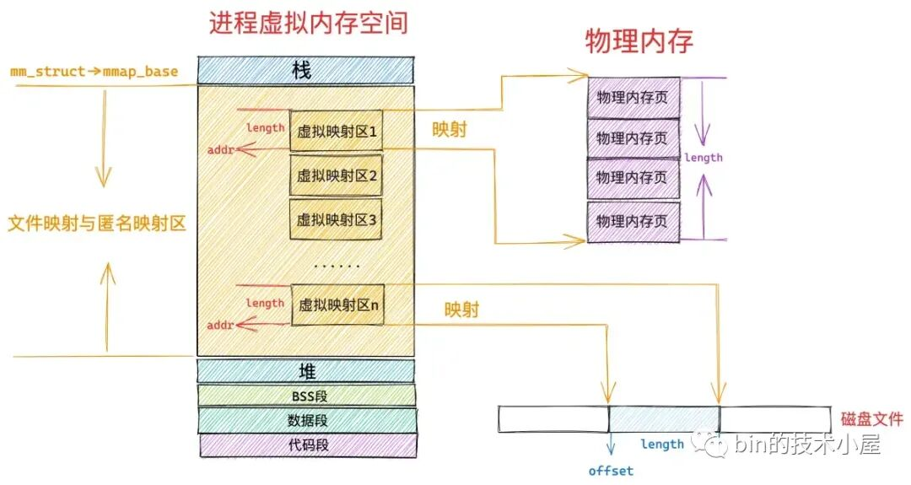
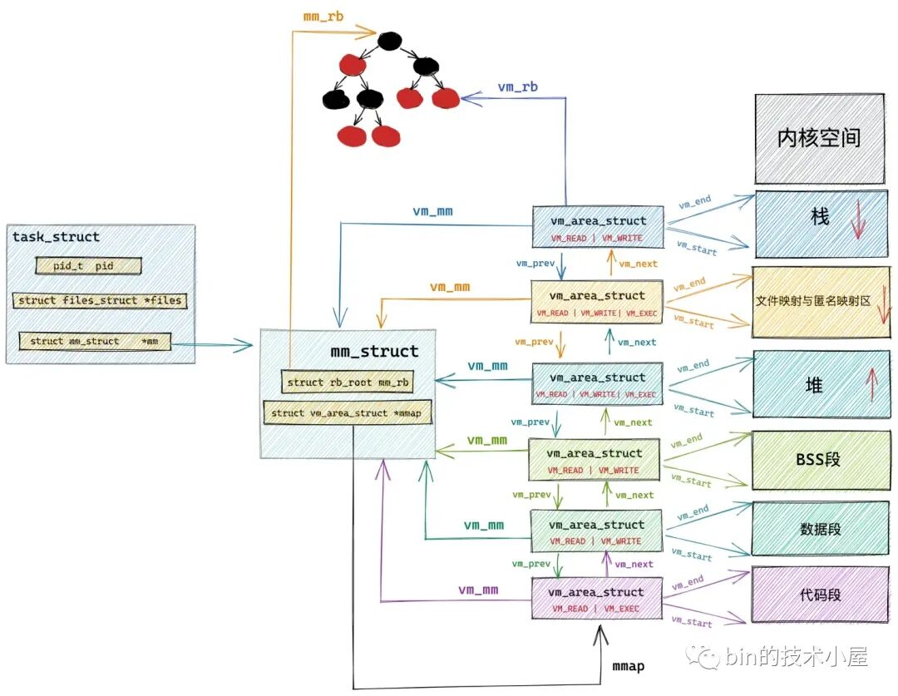

# 创建一个共享内存映射文件
```cpp
enum class access_mode
{
    read,
    write
};
/**
 * This is the basis for all read-only mmap objects and should be preferred over
 * directly using `basic_mmap`.
 */
template<typename ByteT>
using basic_mmap_source = basic_mmap<access_mode::read, ByteT>;

/**
 * This is the basis for all read-write mmap objects and should be preferred over
 * directly using `basic_mmap`.
 */
template<typename ByteT>
using basic_mmap_sink = basic_mmap<access_mode::write, ByteT>;

/**
 * These aliases cover the most common use cases, both representing a raw byte stream
 * (either with a char or an unsigned char/uint8_t).
 */
using mmap_source = basic_mmap_source<char>;
using ummap_source = basic_mmap_source<unsigned char>;

using mmap_sink = basic_mmap_sink<char>;
using ummap_sink = basic_mmap_sink<unsigned char>;
```

`basic_mmap_source`是`basic_map<access_mode::read, ByteT>`。
相比于`basic_mmap<access_mode AccessMode, ByteT>`，
`basic_mmap_source`限制了其`AccessMode`是`read`。
`mmap_source`是`basic_mmap_source<char>`的别名。
可见，`mmap_source`就是：只读的`char`类型映射。

```cpp
/**
 * Convenience factory method that constructs a mapping for any `basic_mmap` or
 * `basic_mmap` type.
 */
template<
    typename MMap,
    typename MappingToken
> MMap make_mmap(const MappingToken& token,
        int64_t offset, int64_t length, std::error_code& error)
{
    MMap mmap;
    mmap.map(token, offset, length, error);
    return mmap;
}

/**
 * Convenience factory method.
 *
 * MappingToken may be a String (`std::string`, `std::string_view`, `const char*`,
 * `std::filesystem::path`, `std::vector<char>`, or similar), or a
 * `mmap_source::handle_type`.
 */
template<typename MappingToken>
mmap_source make_mmap_source(const MappingToken& token, mmap_source::size_type offset,
        mmap_source::size_type length, std::error_code& error)
{
    return make_mmap<mmap_source>(token, offset, length, error);
}
```

`make_mmap`是一个抽象工厂方法。
用于生成`MMap`类型的内存映射。

最终调用到了`MMap`类型内部的`map`方法。
至于是哪个方法，由`MappingToken`决定。如果`MappingToken`是 String，则调用的是`map(const String& path, ...)`。

`make_mmap_source`是具体工厂。
用于生成`MMap = mmap_source`的映射，即生成一个：只读的`char`类型映射。

# map方法
`basic_mmap`最基类的接口。
```cpp
    /**
     * Establishes a memory mapping with AccessMode. If the mapping is unsuccesful, the
     * reason is reported via `error` and the object remains in a state as if this
     * function hadn't been called.
     *
     * `path`, which must be a path to an existing file, is used to retrieve a file
     * handle (which is closed when the object destructs or `unmap` is called), which is
     * then used to memory map the requested region. Upon failure, `error` is set to
     * indicate the reason and the object remains in an unmapped state.
     *
     * `offset` is the number of bytes, relative to the start of the file, where the
     * mapping should begin. When specifying it, there is no need to worry about
     * providing a value that is aligned with the operating system's page allocation
     * granularity. This is adjusted by the implementation such that the first requested
     * byte (as returned by `data` or `begin`), so long as `offset` is valid, will be at
     * `offset` from the start of the file.
     *
     * `length` is the number of bytes to map. It may be `map_entire_file`, in which
     * case a mapping of the entire file is created.
     */
    template<typename String>
    void map(const String& path, const size_type offset,
            const size_type length, std::error_code& error);

    /**
     * Establishes a memory mapping with AccessMode. If the mapping is unsuccesful, the
     * reason is reported via `error` and the object remains in a state as if this
     * function hadn't been called.
     *
     * `path`, which must be a path to an existing file, is used to retrieve a file
     * handle (which is closed when the object destructs or `unmap` is called), which is
     * then used to memory map the requested region. Upon failure, `error` is set to
     * indicate the reason and the object remains in an unmapped state.
     * 
     * The entire file is mapped.
     */
    template<typename String>
    void map(const String& path, std::error_code& error)
    {
        map(path, 0, map_entire_file, error);
    }

    /**
     * Establishes a memory mapping with AccessMode. If the mapping is
     * unsuccesful, the reason is reported via `error` and the object remains in
     * a state as if this function hadn't been called.
     *
     * `handle`, which must be a valid file handle, which is used to memory map the
     * requested region. Upon failure, `error` is set to indicate the reason and the
     * object remains in an unmapped state.
     *
     * `offset` is the number of bytes, relative to the start of the file, where the
     * mapping should begin. When specifying it, there is no need to worry about
     * providing a value that is aligned with the operating system's page allocation
     * granularity. This is adjusted by the implementation such that the first requested
     * byte (as returned by `data` or `begin`), so long as `offset` is valid, will be at
     * `offset` from the start of the file.
     *
     * `length` is the number of bytes to map. It may be `map_entire_file`, in which
     * case a mapping of the entire file is created.
     */
    void map(const handle_type handle, const size_type offset,
            const size_type length, std::error_code& error);

    /**
     * Establishes a memory mapping with AccessMode. If the mapping is
     * unsuccesful, the reason is reported via `error` and the object remains in
     * a state as if this function hadn't been called.
     *
     * `handle`, which must be a valid file handle, which is used to memory map the
     * requested region. Upon failure, `error` is set to indicate the reason and the
     * object remains in an unmapped state.
     * 
     * The entire file is mapped.
     */
    void map(const handle_type handle, std::error_code& error)
    {
        map(handle, 0, map_entire_file, error);
    }
```
`basic_mmap<AccessMode, ByteT>`的map方法实现
1. 一个是针对 file handle type 为 文件路径的。类型为 `String&`
2. 一个是针对 file handle type 为 通用句柄的。如果是 WIN32 则 file handle type 为 HANDLE，其他为 int 。

`map(const String& path, ...)`实际上就是对 `map(const handle_type handle, ...)` 的一次包装，做的额外操作是 打开文件，获取文件句柄。然后传给后者。

```cpp
template<access_mode AccessMode, typename ByteT>
template<typename String>
void basic_mmap<AccessMode, ByteT>::map(const String& path, const size_type offset,
        const size_type length, std::error_code& error)
{
    error.clear();
    if(detail::empty(path))
    {
        error = std::make_error_code(std::errc::invalid_argument);
        return;
    }
    const auto handle = detail::open_file(path, AccessMode, error);
    if(error)
    {
        return;
    }

    map(handle, offset, length, error);
    // This MUST be after the call to map, as that sets this to true.
    if(!error)
    {
        is_handle_internal_ = true;
    }
}
```
## 构造一个mmap：最终的路径
```cpp
template<access_mode AccessMode, typename ByteT>
void basic_mmap<AccessMode, ByteT>::map(const handle_type handle,
        const size_type offset, const size_type length, std::error_code& error)
{
    error.clear();
    if(handle == invalid_handle)
    {
        error = std::make_error_code(std::errc::bad_file_descriptor);
        return;
    }

    const auto file_size = detail::query_file_size(handle, error);
    if(error)
    {
        return;
    }

    if(offset + length > file_size)
    {
        error = std::make_error_code(std::errc::invalid_argument);
        return;
    }

    const auto ctx = detail::memory_map(handle, offset,
            length == map_entire_file ? (file_size - offset) : length,
            AccessMode, error);
    if(!error)
    {
        // We must unmap the previous mapping that may have existed prior to this call.
        // Note that this must only be invoked after a new mapping has been created in
        // order to provide the strong guarantee that, should the new mapping fail, the
        // `map` function leaves this instance in a state as though the function had
        // never been invoked.
        unmap();
        file_handle_ = handle;
        is_handle_internal_ = false;
        data_ = reinterpret_cast<pointer>(ctx.data);
        length_ = ctx.length;
        mapped_length_ = ctx.mapped_length;
#ifdef _WIN32
        file_mapping_handle_ = ctx.file_mapping_handle;
#endif
    }
}
```

## 最最后的实际操作
```cpp
inline mmap_context memory_map(const file_handle_type file_handle, const int64_t offset,
    const int64_t length, const access_mode mode, std::error_code& error)
{
    const int64_t aligned_offset = make_offset_page_aligned(offset);
    const int64_t length_to_map = offset - aligned_offset + length;
#ifdef _WIN32
    const int64_t max_file_size = offset + length;
    const auto file_mapping_handle = ::CreateFileMapping(
            file_handle,
            0,
            mode == access_mode::read ? PAGE_READONLY : PAGE_READWRITE,
            win::int64_high(max_file_size),
            win::int64_low(max_file_size),
            0);
    if(file_mapping_handle == invalid_handle)
    {
        error = detail::last_error();
        return {};
    }
    char* mapping_start = static_cast<char*>(::MapViewOfFile(
            file_mapping_handle,
            mode == access_mode::read ? FILE_MAP_READ : FILE_MAP_WRITE,
            win::int64_high(aligned_offset),
            win::int64_low(aligned_offset),
            length_to_map));
    if(mapping_start == nullptr)
    {
        // Close file handle if mapping it failed.
        ::CloseHandle(file_mapping_handle);
        error = detail::last_error();
        return {};
    }
#else // POSIX
    char* mapping_start = static_cast<char*>(::mmap(
            0, // Don't give hint as to where to map.
            length_to_map,
            mode == access_mode::read ? PROT_READ : PROT_WRITE,
            MAP_SHARED,
            file_handle,
            aligned_offset));
    if(mapping_start == MAP_FAILED)
    {
        error = detail::last_error();
        return {};
    }
#endif
    mmap_context ctx;
    ctx.data = mapping_start + offset - aligned_offset;
    ctx.length = length;
    ctx.mapped_length = length_to_map;
#ifdef _WIN32
    ctx.file_mapping_handle = file_mapping_handle;
#endif
    return ctx;
}
```

## 核心操作：mmap

mmap 返回 `MAP_FAILED` 时，才写入 errno。

# CSV库中的bug
有时会返回错误码：134。


```cpp
        CSV_INLINE void MmapParser::next(size_t bytes = ITERATION_CHUNK_SIZE) {
            // Reset parser state
            this->field_start = UNINITIALIZED_FIELD;
            this->field_length = 0;
            this->reset_data_ptr();

            // Create memory map
            size_t length = std::min(this->source_size - this->mmap_pos, bytes);
            std::error_code error;
            this->data_ptr->_data = std::make_shared<mio::basic_mmap_source<char>>(mio::make_mmap_source(this->_filename, this->mmap_pos, length, error));
            this->mmap_pos += length;
            if (error) throw error;

            auto mmap_ptr = (mio::basic_mmap_source<char>*)(this->data_ptr->_data.get());
            // ...
```

`make_shared`一句，做了以下事情：
1. 用`make_mmap_source`生成一个：只读的`char`类型映射。把这个映射对象用共享指针包装。

在构造 mmap 时， error 可能 出现的情况只有 3 种：
1. `handle == invalid_handle`：`error = std::make_error_code(std::errc::bad_file_descriptor)`：错误码 9
2. `offset + length > file_size`：`error = std::make_error_code(std::errc::invalid_argument)`：错误码 22
3. mmap 失败。`error = detail::last_error()`。即 返回 上一个（最后一个）errno。实测，错误码 134。

```cpp
/**
 * Returns the last platform specific system error (errno on POSIX and
 * GetLastError on Win) as a `std::error_code`.
 */
inline std::error_code last_error() noexcept
{
    std::error_code error;
#ifdef _WIN32
    error.assign(GetLastError(), std::system_category());
#else
    error.assign(errno, std::system_category());
#endif
    return error;
}
```

# Linux 134 错误码
在 Linux 系统中，错误码 **134** 对应的是 **`EOWNERDEAD`**（Owner died）。以下是详细解释：

---

## 错误类型说明
1. **错误名称**：`EOWNERDEAD`
2. **含义**：  
   此错误通常与 **进程间同步机制**（如共享内存中的互斥锁）相关。当一个进程持有锁时异常终止（如崩溃），其他进程尝试获取该锁时会触发此错误。它表示锁的持有者已死亡，锁状态可能处于不一致状态，需要恢复操作。

3. **常见场景**：
   - 使用 `pthread_mutex_lock` 或共享内存中的互斥锁时。
   - 进程崩溃后，其他进程尝试获取该进程持有的锁。
   - 需要调用 `pthread_mutex_consistent` 修复锁状态后才能继续使用。

---

### 如何验证？
在 Linux 终端运行以下命令查看错误码定义：
```bash
$ errno 134
```
输出示例：
```
EOWNERDEAD 134  /* Owner died */
```

---

## 解决方法：
1. **检查锁的使用**：  
   确保使用锁的进程有健壮的退出处理逻辑（如信号处理、资源释放）。
2. **锁恢复机制**：  
   如果使用 `pthread_mutex` 的 `robust` 属性（`PTHREAD_MUTEX_ROBUST`），需在获取锁后检查错误码：
   ```c
   int err = pthread_mutex_lock(&mutex);
   if (err == EOWNERDEAD) {
       // 1. 使锁恢复一致状态
       pthread_mutex_consistent(&mutex);
       // 2. 执行数据恢复逻辑
   }
   ```
3. **避免资源泄漏**：  
   确保进程崩溃前释放锁（例如通过 `atexit` 注册清理函数）。

---

### 其他可能的高位错误码：
Linux 错误码通常较小（如 `ENOENT=2`）。若遇到 **大于 133** 的错误码（如 134），通常是：
- **实时扩展错误**（定义在 `<errno.h>`）：如 `EOWNERDEAD` (134)、`ENOTRECOVERABLE` (135)。
- **特定于同步机制**：与进程间通信（IPC）、线程或共享内存相关。

---

### 总结：
| 错误码 | 名称         | 原因与场景                     |
|--------|--------------|-------------------------------|
| 134    | `EOWNERDEAD` | 锁的持有者进程已终止，需恢复锁状态。 |

建议检查代码中是否有未处理的进程崩溃或锁恢复逻辑缺失。

# mmap 底层 Linux 内核代码

`/usr/include/sys/mman.h`

找 `MAP_FAILED` 字眼。

```cpp
/* Return value of `mmap' in case of an error.  */
#define MAP_FAILED	((void *) -1)

__BEGIN_DECLS
/* Map addresses starting near ADDR and extending for LEN bytes.  from
   OFFSET into the file FD describes according to PROT and FLAGS.  If ADDR
   is nonzero, it is the desired mapping address.  If the MAP_FIXED bit is
   set in FLAGS, the mapping will be at ADDR exactly (which must be
   page-aligned); otherwise the system chooses a convenient nearby address.
   The return value is the actual mapping address chosen or MAP_FAILED
   for errors (in which case `errno' is set).  A successful `mmap' call
   deallocates any previous mapping for the affected region.  */

#ifndef __USE_FILE_OFFSET64
extern void *mmap (void *__addr, size_t __len, int __prot,
		   int __flags, int __fd, __off_t __offset) __THROW;
#else
# ifdef __REDIRECT_NTH
extern void * __REDIRECT_NTH (mmap,
			      (void *__addr, size_t __len, int __prot,
			       int __flags, int __fd, __off64_t __offset),
			      mmap64);
# else
#  define mmap mmap64
# endif
#endif
#ifdef __USE_LARGEFILE64
extern void *mmap64 (void *__addr, size_t __len, int __prot,
		     int __flags, int __fd, __off64_t __offset) __THROW;
#endif
```

# 详解内存映射系统调用 mmap
```cpp
#include <sys/mman.h>
void* mmap(void* addr, size_t length, int prot, int flags, int fd, off_t offset);

// 内核文件：/arch/x86/kernel/sys_x86_64.c
SYSCALL_DEFINE6(mmap, unsigned long, addr, unsigned long, len,
  unsigned long, prot, unsigned long, flags,
  unsigned long, fd, unsigned long, off)
```

调用 mmap 进行匿名映射的时候（比如进行堆内存的分配），是将进程虚拟内存空间中的某一段虚拟内存区域与物理内存中的匿名内存页进行映射，
调用 mmap 进行文件映射的时候，是将进程虚拟内存空间中的某一段虚拟内存区域与磁盘中某个文件中的某段区域进行映射。


在文件映射与匿名映射这段虚拟内存区域中，包含了一段一段的虚拟映射区，每当我们调用一次 mmap 进行内存映射的时候，内核都会在文件映射与匿名映射区中划分出一段虚拟映射区出来，这段虚拟映射区就是我们申请到的虚拟内存。

## mmap 的 前 2 个参数：addr、 length
addr ：表示我们要映射的这段虚拟内存区域在进程虚拟内存空间中的起始地址（虚拟内存地址），但是这个参数只是给内核的一个暗示，内核并非一定得从我们指定的 addr 虚拟内存地址上划分虚拟内存区域，内核只不过在划分虚拟内存区域的时候会优先考虑我们指定的 addr，如果这个虚拟地址已经被使用或者是一个无效的地址，那么内核则会自动选取一个合适的地址来划分虚拟内存区域。我们一般会将 addr 设置为 NULL，意思就是完全交由内核来帮我们决定虚拟映射区的起始地址。

length ：要申请的这段虚拟内存有多大呢 ？如果是匿名映射，length 参数决定了我们要映射的匿名物理内存有多大，如果是文件映射，length 参数决定了我们要映射的文件区域有多大。

> addr，length 必须要按照 PAGE_SIZE（4K） 对齐。



如果我们通过 mmap 映射的是磁盘上的一个文件，那么就需要通过参数 fd 来指定要映射文件的描述符（file descriptor），通过参数 offset 来指定文件映射区域在文件中偏移。

在内存管理系统中，物理内存是按照内存页为单位组织的；
在文件系统中，磁盘中的文件是按照磁盘块为单位组织的。

内存页和磁盘块大小一般情况下都是 4K 大小，所以这里的 offset 也必须是按照 4K 对齐的。
## 虚拟映射对象的结构体
而在文件映射与匿名映射区中的这一段一段的虚拟映射区，其实本质上也是虚拟内存区域，它们和进程虚拟内存空间中的代码段，数据段，BSS 段，堆，栈没有任何区别，
在内核中都是 `struct vm_area_struct` 结构来表示的，下面我们把进程空间中的这些虚拟内存区域统称为 VMA。

进程虚拟内存空间中的所有 VMA 在内核中有两种组织形式：一种是双向链表，用于高效的遍历进程 VMA，这个 VMA 双向链表是有顺序的，所有 VMA 节点在双向链表中的排列顺序是按照虚拟内存低地址到高地址进行的。

另一种则是用红黑树进行组织，用于在进程空间中高效的查找 VMA，因为在进程虚拟内存空间中不仅仅是只有代码段，数据段，BSS 段，堆，栈这些虚拟内存区域 VMA，尤其是在数据密集型应用进程中，文件映射与匿名映射区里也会包含有大量的 VMA，进程的各种动态链接库所映射的虚拟内存在这里，进程运行过程中进行的匿名映射，文件映射所需要的虚拟内存也在这里。而内核需要频繁地对进程虚拟内存空间中的这些众多 VMA 进行增，删，改，查。所以需要这么一个红黑树结构，方便内核进行高效的查找。


```cpp
// 进程虚拟内存空间描述符
struct mm_struct {
    // 串联组织进程空间中所有的 VMA  的双向链表 
    struct vm_area_struct *mmap;  /* list of VMAs */
    // 管理进程空间中所有 VMA 的红黑树
    struct rb_root mm_rb;
}

// 虚拟内存区域描述符
struct vm_area_struct {
    // vma 在 mm_struct->mmap 双向链表中的前驱节点和后继节点
    struct vm_area_struct *vm_next, *vm_prev;
    // vma 在 mm_struct->mm_rb 红黑树中的节点
    struct rb_node vm_rb;
}
```



