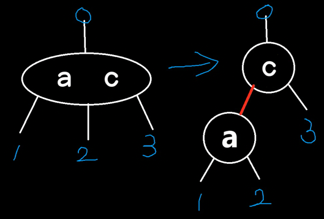
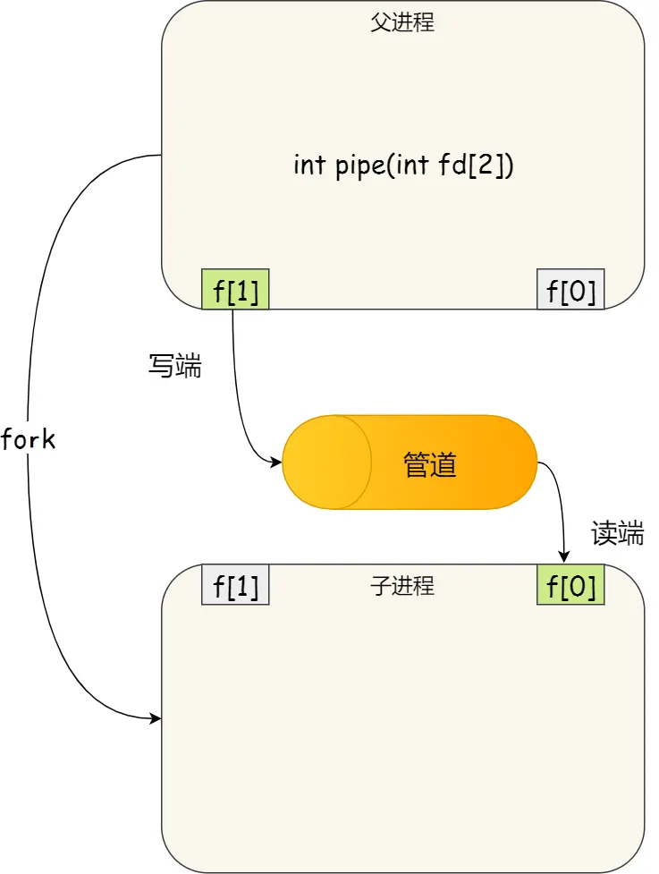
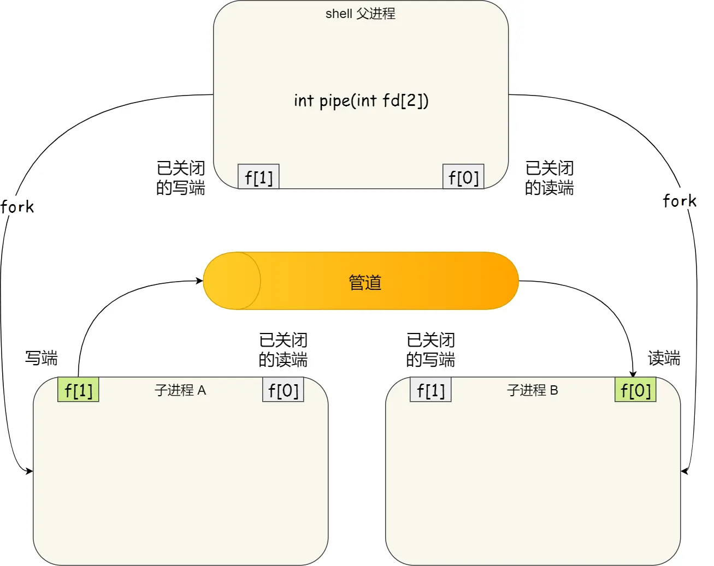
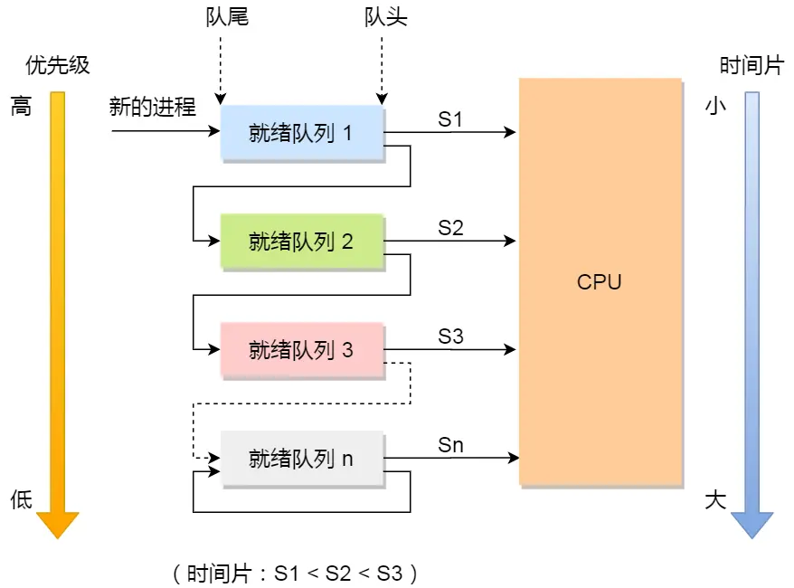
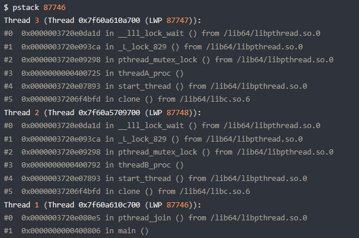
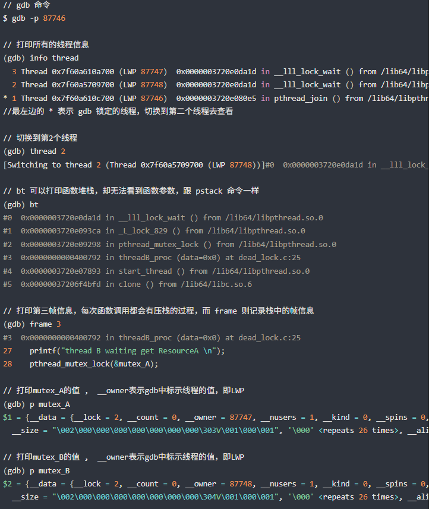
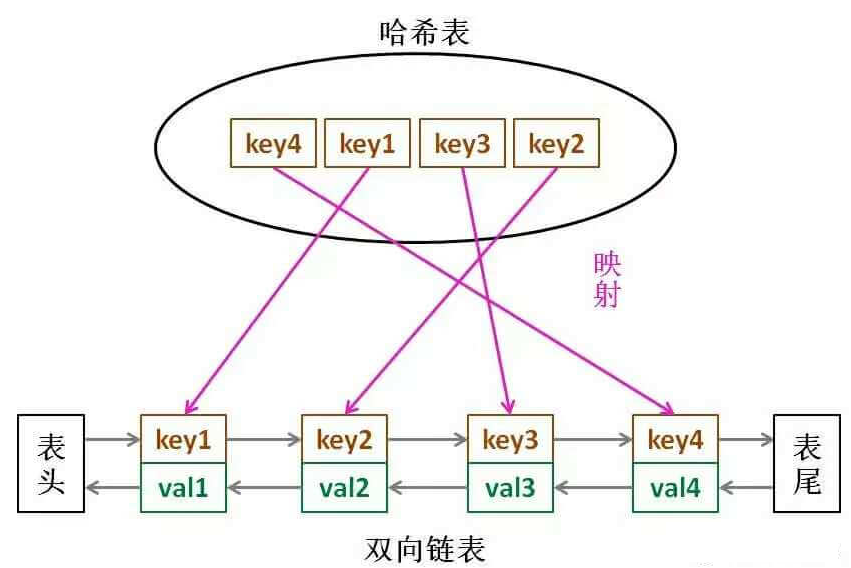
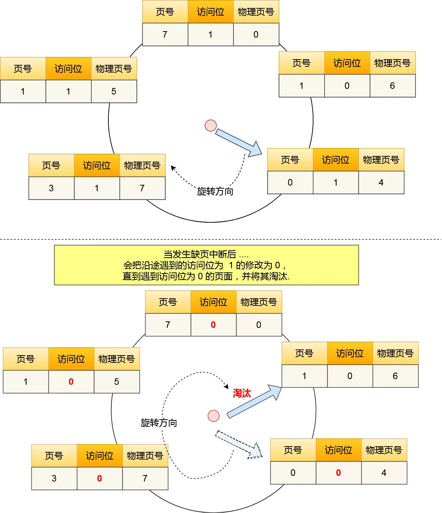

# Modern Cpp
1. auto
2. 范围for循环
3. 函数对象、lambda
4. 智能指针
5. 右值引用

## lambda
按值捕获，在函数体内能变吗？
按引用捕获，为什么能变？

# OOP的思想
1. 封装，主要从控制访问权限切入
2. 继承
    1. 隐藏
    2. 多重继承
        1. 菱形继承
            1. 虚继承
3. 多态
    1. 重载（静多态）：名字相同，参数列表不同。返回值不参与。
        1. 编译期就确定了。
        2. 主要面向泛型编程。
        3. 可以通过重载、函数模板实现。
    2. 重写（动多态）
        1. 虚函数（动态联编）
        2. 在构造函数中可以调用虚函数，但是没有多态性。

## 四个类型转换

# 智能指针
## unique和裸指针性能比较
如果未开启优化，unique性能确实比裸指针差。
但是如果开启优化，比如release时，unique的反汇编代码，和裸指针一样，而且还是安全的。

unique_ptr性能确实比裸指针差。​​
​​原因：​​ 编译器不会进行内联优化。每次 unique_ptr的构造、析构、移动赋值、`reset()`、`release()`操作，以及通过 `operator->`或 `operator*`访问成员/解引用，都会生成对相应成员函数的调用指令。
​​代价：​​ 这些函数调用（即使是简单的）会引入额外的指令（压栈、跳转、弹栈等），增加了代码大小和执行时间。构造/析构可能涉及设置/清除内部指针和可能的自定义删除器状态。移动操作虽然不拷贝资源，但函数调用开销依然存在。
裸指针优势：​​ 裸指针的操作（赋值、解引用、比较）通常直接对应一条或几条非常底层的 CPU 指令（如 mov, lea, cmp），几乎没有额外开销。

## shared的实现原理
## shared需要避免的问题
循环引用。导致对象一直驻存在内存中，无法销毁，内存泄漏。
## weak可以单独使用吗
不可以自己构造，而是通过shared赋值或构造。
主要场景是配合shared使用。
## weak可以直接解引用吗
需要看强引用计数是否为0。
需要调用`lock()`，返回一个强shared引用。
weak怎么知道的？结构中，有一个控制块，存放了强引用和弱引用计数。
## makeunique和makeshared
没使用，则对象和控制块分开存放。
如果使用，则在一起存放。

make的优点：空间局部性好。

什么时候该释放对象内存了？强引用技术为0就该释放了，对象在这时应该就算是失效了。但是如果弱引用计数不为0，那么make的对象就因为控制块未释放而不能释放。

**弱引用计数的维护：​**​ 如果存在 `std::weak_ptr`，还需要维护额外的弱引用计数(`weak_count`)。当**强引用计数归零时，只销毁对象**；只有**当弱引用计数也归零时，才释放控制块本身**。
# STL
## 六大组件
1. 容器
2. 迭代器
3. 算法
4. 仿函数
5. 适配器
6. 分配器
## 容器
顺序型：Vector（向量）、List（）、Array
关系型：map、set。unorderedmap、unorderedset。
### set、map的底层
有序的，使用红黑树实现的
### unorderedset、unorderedmap的底层
哈希表实现。
### 如何解决哈希冲突
哈希冲突是哈希表中无法避免的现象（多个不同键映射到同一个哈希槽位）。以下是解决哈希冲突的主要方法及其特点：
#### ​**​1. 开放定址法 (Open Addressing)​**​
​**​核心思想​**​：当发生冲突时，在哈希表中​**​寻找下一个空闲槽位​**​存储数据
- ​**​常见探测方式​**​：
    - ​**​线性探测 (Linear Probing)​**​：
        冲突时顺序检查下一个槽位（`index = (hash(key) + i) % size`, `i=1,2,3...`）。
        _缺点：易产生“聚集效应”，降低查询效率。_
    - ​**​二次探测 (Quadratic Probing)​**​：
        按二次方跳跃探测（`index = (hash(key) + i²) % size`, `i=1,2,3...`）。
        _缺点：可能无法找到空闲槽位（即使存在）。_
    - ​**​双重散列 (Double Hashing)​**​：
        使用第二个哈希函数计算步长（`index = (hash1(key) + i * hash2(key)) % size`）。
        _优点：分布更均匀，是开放定址法中的最优方案。_
- ​**​适用场景​**​：数据量较小、内存紧凑的场景（如嵌入式系统）。
#### ​**​2. 链地址法 (Separate Chaining)​**​
​**​核心思想​**​：将每个哈希槽位作为​**​链表/树的头节点​**​，冲突的键值对存储在同一槽位的链表中。
- ​**​实现方式​**​：
    - 冲突时，将新数据​**​插入槽位对应的链表末尾​**​。
    - 查询时遍历链表查找目标键。
- ​**​优化方案​**​：
    - ​**​链表转红黑树​**​（如Java 8+的HashMap）：当链表长度超过阈值（如8）时，将链表转为红黑树，将查询效率从`O(n)`提升至`O(log n)`。
- ​**​优势​**​：
    - 处理冲突简单，无聚集问题。
    - 支持高效动态扩容。
- ​**​工业应用​**​：Java `HashMap`、Python `dict`、C++ `unordered_map`均采用此方案。
#### ​**​3. 公共溢出区法 (Overflow Area)​**​
​**​核心思想​**​：分配独立空间存储所有冲突数据
- 哈希表分为​**​主表​**​和​**​溢出区​**​。
- 冲突时，将数据存入溢出区，主表对应槽位​**​指向溢出区的链表​**​。
- ​**​适用场景​**​：冲突率较低或数据量固定的场景（较少用）。
#### ​**​4. 再哈希法 (Rehashing)​**​
- 冲突时使用​**​另一个哈希函数​**​重新计算位置。
- 需要预置多个哈希函数（如`hash1(key)`, `hash2(key)`...）。
- ​**​缺点​**​：计算成本高，通常用于特殊场景（如布隆过滤器）。
#### ​**​实际工程中的关键考量​**​
1. ​**​负载因子 (Load Factor)​**​
    定义：已存储键值对数 / 哈希表总槽位数。
    ​**​当负载因子超过阈值（如0.75）时触发扩容​**​（如Java HashMap），避免冲突率急剧上升。
2. ​**​动态扩容 (Resizing)​**​
    扩容步骤：
    - 新建更大的哈希表（通常翻倍）。
    - 将旧表数据​**​重新哈希​**​到新表。
    - _均摊时间复杂度为O(1)_。
3. ​**​哈希函数设计​**​
    目标：尽可能均匀分布（雪崩效应）。
    常见算法：MurmurHash、CityHash（非加密场景）；SHA-256（安全场景）。
#### ​**​选择指南​**​

|​**​方法​**​|​**​优势​**​|​**​劣势​**​|
|---|---|---|
|​**​链地址法​**​|高效处理高冲突，易实现删除|指针占用额外内存，缓存不友好|
|​**​开放定址法​**​|内存紧凑，缓存友好|删除复杂，易聚集|
|​**​公共溢出区​**​|实现简单|溢出区过大时性能下降|

> 📌 ​**​工业实践建议​**​：
> - 通用场景优先选择​**​链地址法​**​（如Java/Python内置实现）。
> - 内存敏感场景（如嵌入式）考虑​**​开放定址法​**​。
> - 务必通过​**​负载因子控制扩容​**​以维持`O(1)`操作复杂度。
# c程序的编译链接过程
1. 预编译。
    1. 宏定义
    2. 代码开关
    3. 头文件
2. 编译。
    1. 生成汇编代码
3. 汇编
    1. 生成二进制的目标文件
4. 链接
    1. 生成可执行程序。
# 浮点数相等怎么判断
# 数据结构

## B树（B代表Balanced）
是一个搜索树，而且是平衡的。
BST（Binary Search Tree，二叉搜索树）只有搜索性质，没有平衡性质。

搜索性能：m阶，指的是1个节点，最多有多少分支。N是数据规模：$log_m N$

## 红黑树的性质（通过什么规范达到平衡）
1. 根节点是黑色。
2. 如果左右孩子是NIL, 则把此孩子看作黑色节点; 实际上这个NIL节点是哨兵节点, 可看作一个公共叶子节点; 
3. 从每个叶子到根的所有路径上不能有两个连续的红色节点; 如此, 每个红色节点的两个子节点都是黑色。
4. **从任一节点到其每个叶子(可以包含NIL公共叶节点)的所有路径都包含相同数目的黑色节点**。

红黑树其实是2-3树的一个变形（不存在4型节点）。
由于不存在4型节点，所以不能出现2个连续的红色节点。



红黑树最长支的长度 不超过 最短支的长度的2倍。虽然AVL树最大差1，但AVL树插入性能太慢。红黑树就很好地平衡了层数差异和性能。

二叉树的极端形式就是：一支最长、一支最短。
根据**从任一节点到其每个叶子(可以包含NIL公共叶节点)的所有路径都包含相同数目的黑色节点**，只要黑色节点数一样，就算是红黑树。那么：
左子树最长情况下是一红线一黑线交替穿插。右子树最短情况下是全黑。这种情况下，左右两支黑节点数一样，而左支和右支的高度差最大是2倍。
# 算法
以动态规划和数据结构为主  基础题会出现如重载操作符  回文序列等问题
贪心算法和洗牌算法大公司一般都会问
Top k问题
## 排序算法
1. 插入型：直接插入、希尔排序
2. 选择型：选择排序、堆排序
3. 比较型：冒泡排序、快速排序
4. 归并排序

## 快速排序的思想
### 怎么选基准值
快速排序，越乱序，越快。越有序，越慢
1. 随机选，达到乱序的效果。
2. 三位取中。尽量选到靠近中间的值。划分的两支比较均衡。

### 怎么优化
1. 规模小的时候，用直接插入排序
2. 递归深度怎么控制。记录一个递归深度的变量，减到零的时候，就使用堆排序进行优化。
    1. 尾递归的消除
    2. 内省排序。
## 分治算法
## 动态规划
### 动态规划的思想
状态重叠？

核心思想：以空间换时间。把原问题拆成几个重叠子问题。通过几个小问题去推导大问题的解。
# 操作系统
## 进程和线程的区别
1. 进程是资源（包括内存、打开的文件等）分配的单位，线程是 CPU 执行调度的单位。
2. 线程的创建时间比进程快，因为进程在创建的过程中，还需要资源管理信息，比如内存管理信息、文件管理信息，而线程不会涉及这些资源管理信息，而是共享进程的资源。
3. 线程的终止时间比进程快，因为线程释放的资源相比进程少很多
4. 同一个进程内的线程切换比进程切换快，因为线程具有相同的地址空间（虚拟内存共享），这意味着同一个进程的线程都具有同一个页表，那么在切换的时候不需要切换页表。而对于进程，页表切换开销是比较大的。
## 进程的通信方式
1. 管道
    1. 匿名管道：`int pipe(int fd[2])`。
        1. 通信范围是存在父子关系的进程
        2. 返回时向传入的fd数组写入了两个描述符。这两个描述符同属一个进程。一个是写端，一个是读端。管道只能一端写入，另一端读出。
        3. fork会复制描述符。为了避免fork后，父子进程读写混乱。父进程关闭读取的 `fd[0]`，只保留写入的 `fd[1]`；子进程关闭写入的 `fd[1]`，只保留读取的 `fd[0]`。
        4. 如果需要双向通信，则应该创建两个管道。
    2. 命名管道，也被叫做 `FIFO`。因为数据是先进先出的传输方式
        1. 在不相关的进程间（非父子）也能相互通信
        2. 需要通过 `mkfifo` 命令来创建，并且指定管道名字`mkfifo myPipe`
        3. 以文件的方式存在：
           `prw-r--r--. 1 root    root 0 Jul 17 02:45 myPipe`
        4. 向这个文件写入数据时，另一端就可以读取。
           `echo "hello" > myPipe`
        5. 操作了后，命令就停在这了，因为管道里的内容没有被读取，只有当管道里的数据被读完后，命令才可以正常退出。
    3. 效率低，管道不适合进程间频繁地交换数据
2. 消息队列
    1. 消息队列是保存在内核中的消息链表。存在用户态与内核态之间的数据拷贝开销
3. 共享内存
    1. 虚拟内存映射到同一块物理内存。
    2. 避免了拷贝内核的开销。
4. 信号量
    1. 同步控制共享内存。
5. 信号
    1. 异步通信机制。可以为信号定义一个信号处理函数，有信号时，执行回调。
6. socket
### 管道图示
进程中pipe创建匿名管道并fork


命令行`A | B`的原理：Shell进程创建匿名管道，fork出两个子进程。


## 进程调度算法
1. FIFO（FCFS，First Come First Serve）
2. 最短作业优先
3. 高响应比。兼顾了FIFO和最短作业优先。
    1. 响应比指：(等待时间+需要执行时间) / 需要执行时间。如果等待时间过长，则优先执行。如果等待时间一致，则谁需要执行时间越短，谁优先
4. 时间片轮转
    1. 如果时间片用完，进程还在运行，那么将会把此进程从 CPU 释放出来，并把 CPU 分配另外一个进程；
    2. 如果该进程在时间片结束前阻塞或结束，则 CPU 立即进行切换；
5. 最高优先级调度算法
    1. 两种处理优先级高的方法：非抢占式和抢占式
        1. 非抢占式：当就绪队列中出现优先级高的进程，运行完当前进程，再选择优先级高的进程
        2. 抢占式：当就绪队列中出现优先级高的进程，当前进程挂起，调度优先级高的进程运行。
6. 多级反馈队列调度算法
    1. 是「时间片轮转算法」和「最高优先级算法」的综合。
    2. 「多级」表示有多个队列，每个队列优先级从高到低，同时优先级越高时间片越短
    3. 「反馈」表示如果有新的进程加入优先级高的队列时，立刻停止当前正在运行的进程，转而去运行优先级高的队列；




## 乐观锁、悲观锁？
乐观锁是什么场景用。默认不会被改，即多读少写的场景。
## 死锁
### 产生死锁的条件
需要同时满足：
1. 互斥
2. 持有并等待
3. 不可抢占
4. 环路等待
### 如何避免死锁
银行家算法。

破除四个条件之一就行：
主要是破除环路等待。

最常见的并且可行的就是**使用资源有序分配法，来破环环路等待条件**。

即，两个线程都先获取互斥锁 A，然后获取互斥锁 B。顺序一致。
### 如果发生死锁，怎么判断死锁的位置
Linux 下的 C 程序，可以使用 `pstack` + `gdb` 工具来定位死锁问题

pstack 命令可以显示每个线程的栈跟踪信息（函数调用过程），`pstack <pid>` 就可以了。



但是，还不能够确认这两个线程是在互相等待对方的锁的释放，因为我们看不到它们是等在哪个锁对象，

可以使用 gdb 工具进一步确认（`gdb -p <pid>`）。
`info thread`：打印线程信息。每个线程对应了一个LWP。
`thread 2`：切换到指定线程
`bt`：打印函数堆栈
`frame 3`：打印某个函数帧的信息（函数代码）
`p mutex_A`：打印互斥量的内容值。`__owner`标示了哪个线程（LWP）持有。




## 线程崩溃了，进程会崩溃吗？
不管是子线程还是主线程崩溃，进程都会崩溃。
比如，子线程非法访问无权限内存。

段错误。（segment fault）
## 内存泄漏如何排查？
1. 静态分析工具​​（预防阶段）
    1. 编译器警告​​：开启 `-Wall -Wextra`（GCC/Clang）或 `/W4`（MSVC）
    2. Clang-Tidy​​：使用 `clang-tidy -checks=*,-llvm* *.cpp` --检查代码模式
    3. Cppcheck​​：运行 `cppcheck --enable=all --inconclusive`
2. 动态分析（运行时检测）
    1. Linux、Mac首选：Valgrind工具。
    2. 跨平台高效方案：AddressSanitizer (ASan)​​

也可以重载new、delete，用一个map存储创建、删除对象的记录：程序退出时检查 `allocMap`剩余项
```cpp
static std::map<void*, std::string> allocMap;

void* operator new(size_t size, const char* file, int line) {
    void* ptr = malloc(size);
    allocMap[ptr] = fmt::format("{}:{}", file, line);
    return ptr;
}

void operator delete(void* ptr) noexcept {
    allocMap.erase(ptr);
    free(ptr);
}
#define new new(__FILE__, __LINE__)  // 关键宏定义
```
## 页面置换算法
1. 最佳页面置换算法。基本思路是，置换在「未来」最长时间不访问的页面。实际无法实现，意义是衡量算法的效率
2. FIFO：选择在内存驻留时间最长的页面淘汰。有Belady现象。即cache容量越大，缺页率越高。
3. LRU（Least Recently Used，近来最少使用）
    1. 选择最长时间没有被访问的页面淘汰。
    2. 近似最优置换算法，最优置换算法是通过「未来」的使用情况来推测要淘汰的页面，而 LRU 则是通过「历史」的使用情况来推测要淘汰的页面。
    3. 可以用哈希表 + 双链表实现。哈希表存key，双链表是cache。
        1. 如果我们每次默认从链表头部添加元素，那么显然越靠头部的元素就是**最近使用**的，越靠尾部的元素就是**最久未使用**的
        2. 如果调用了一个cache中的页面，需要把它移动到头部。
        3. 为什么要用双链不用单链？
            1. 因为我们需要删除操作。删除一个节点不光要得到该节点本身的指针，也需要操作其前驱节点的指针，而双向链表才能支持直接查找前驱，保证操作的时间复杂度 O(1)。
        4. 为什么要在链表中同时存储 key，而不是只存储 val？
            1. 当缓存容量已满，我们不仅仅要删除尾部的元素，还要把 map 中映射到该节点的 key 同时删除，而这个 key 只能由 Node 得到。如果 Node 结构中只存储 val，那么我们就无法得知 key 是什么，就无法删除 map 中的键。
    4. 总的来说：使用 ​**​哈希表 + 严格排序的双链表​**​
4. 时钟页面置换算法
    1. 使用 **​哈希表​** + **​循环链表** + 表针，表针指向最老的页面
    2. 发生缺页中断时，算法首先检查表针指向的页面。
        1. 如果它的访问位位是 0 就淘汰该页面，并把新的页面插入这个位置，然后把表针前移一个位置
        2. 如果访问位是 1 就清除访问位，并把表针前移一个位置，重复这个过程直到找到了一个访问位为 0 的页面为止。
5. 最不常用页面淘汰
    1. 当发生缺页中断时，选择「访问次数」最少的那个页面，并将其淘汰
    2. 实现方式是，对每个页面设置一个「访问计数器」，每当一个页面被访问时，该页面的访问计数器就累加 1。在发生缺页中断时，淘汰计数器值最小的那个页面
    3. 要增加一个计数器来实现
    4. 如果要对这个计数器查找哪个页面访问次数最小，需要查找链表本身，如果链表长度很大，是非常耗时的，效率不高
    5. 还有个缺陷：LFU 算法只考虑了频率问题，没考虑时间的问题，比如有些页面在过去时间里访问的频率很高，但是现在已经没有访问了，而当前频繁访问的页面由于没有这些页面访问的次数高，在发生缺页中断时，就会可能会误伤当前刚开始频繁访问，但访问次数还不高的页面
        1. 解决的办法还是有的，可以定期减少访问的次数，比如当发生时间中断时，把过去时间访问的页面的访问次数除以 2，也就说，随着时间的流失，以前的高访问次数的页面会慢慢减少，相当于加大了被置换的概率。
### LRU图示

### LRU实现
```cpp
struct Node {
    int key;
    int value;
    Node* prev;
    Node* next;

    Node(int k = 0, int v = 0) : key(k), value(v) {}
};

class LRUCache {
private:
    int capacity;
    Node* dummy; // 哨兵节点
    unordered_map<int, Node*> key_to_node;

    // 删除一个节点（抽出一本书）
    void remove(Node* x) {
        x->prev->next = x->next;
        x->next->prev = x->prev;
    }

    // 在链表头添加一个节点（把一本书放到最上面）
    void push_front(Node* x) {
        x->prev = dummy;
        x->next = dummy->next;
        x->prev->next = x;
        x->next->prev = x;
    }

    // 获取 key 对应的节点，同时把该节点移到链表头部
    Node* get_node(int key) {
        auto it = key_to_node.find(key);
        if (it == key_to_node.end()) { // 没有这本书
            return nullptr;
        }
        Node* node = it->second; // 有这本书
        remove(node); // 把这本书抽出来
        push_front(node); // 放到最上面
        return node;
    }

public:
    LRUCache(int capacity) : capacity(capacity), dummy(new Node()) {
        dummy->prev = dummy;
        dummy->next = dummy;
    }

    int get(int key) {
        Node* node = get_node(key); // get_node 会把对应节点移到链表头部
        return node ? node->value : -1;
    }

    void put(int key, int value) {
        Node* node = get_node(key); // get_node 会把对应节点移到链表头部
        if (node) { // 有这本书
            node->value = value; // 更新 value
            return;
        }
        key_to_node[key] = node = new Node(key, value); // 新书
        push_front(node); // 放到最上面
        if (key_to_node.size() > capacity) { // 书太多了
            Node* back_node = dummy->prev;
            key_to_node.erase(back_node->key);
            remove(back_node); // 去掉最后一本书
            delete back_node; // 释放内存
        }
    }
};
```
### Clock图示



# 网络
## IO复用？
## 输入网址，显示网页，都经历了什么过程
1. 域名解析 - DNS
2. 协议对应端口。http是80端口，https是443端口。
    1. https需要额外握手，确认证书
    2. 浏览器发送http请求。请求内容，是TCP报文的数据部分。
3. 两个IP + 端口，可以组成一个TCP连接。走传输层。
4. 交给网络层。走路由器
5. 再交给数据链路层。
## 3次握手
第3次可以携带数据。
## 4次挥手
## IP协议分类？
忘了。五类。
## 多播地址、广播地址的区别？
## TCP和UDP分片？
根据MTU，TCP报文有标识位。在传输层本身就可以分片。
但UDP没有分片标识位。如果UDP报文很大，用的是IP层报文提供的底层分片服务。
但是，这可能会导致，一但一个IP包丢失，全部数据就会全丢弃，大大增加丢包概率。
可以在应用层控制UDP传输的数据不要太大，达到一个分片的效果。这样，即使丢IP包，也只丢失了小部分数据，而不是一丢丢一串。
### 如果就是想传一个很大的UDP数据包怎么办？
如果要求UDP报文100%传达，需要模拟实现TCP功能或者QUIC协议。