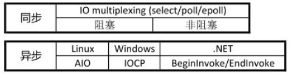
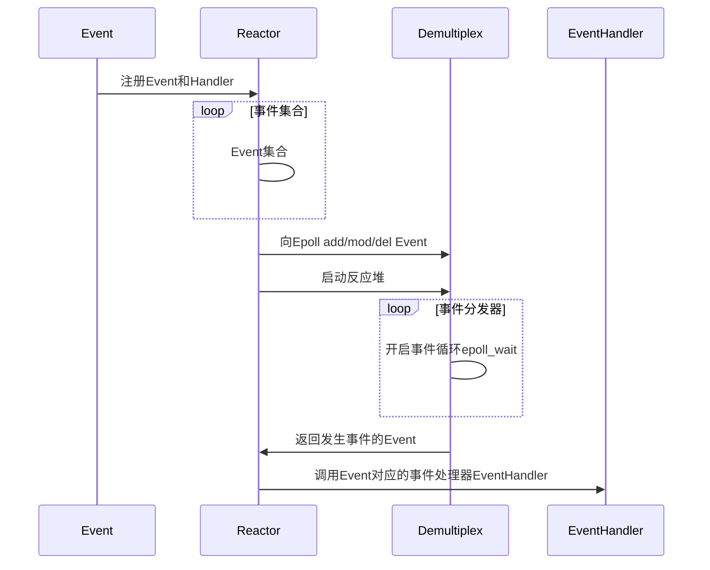

# 内容

1. 阻塞、非阻塞、同步、异步
2. 五种IO模型
3. 好的网路服务器设计思路
4. Reactor模型
5. select/poll/epoll、LT/ET模式对比
6. muduo网络库编程环境配置
7. muduo网络库的多线程模型
8. 基于muduo的服务器程序实例
9. muduo网络库提供的类
10. muduo网络库中TcpServer类中的回调类型
11. 代码示例ChatServer及运行测试结果

# 阻塞、非阻塞、同步、异步

网络IO阶段分为两个：数据准备和数据读写

* 数据准备--根据系统IO操作的就绪状态
  * 阻塞：调用IO方法的线程进入阻塞状态
  * 非阻塞：不会改变线程的状态，通过返回值判断
* 数据读写（IO层面的同步和异步）--根据应用程序和内核的交互方式
  * 同步：用户的recv完成了所有的动作，而且因此阻塞或者空转等待。数据是用户从TCP的接收缓冲区搬移的。
  * 异步：应用程序把任务交给操作系统，自己去做别的事情，操作系统处理完后，通知用户层“buf的数据已经准备好了”。可以通过sigio通知或者实现约定的回调方式通知

```c
ssize_t recv(int sockfd, void* buf, size_t len, int flags);
int size = recv(sockfd, buf, 1024, 0);	//recv阻塞至sockfd上有数据准备好
//如果recv的属性设置为set non-block，则即使sockfd没有数据也会返回，cpu空转

/*
	返回值：
		size == -1; # 原因可能为1.系统内部错误; 2.当前处于非阻塞模式，无数据
			若 errno == EAGAIN 则说明 当前的错误是因为处于非阻塞模式。
		size == 0;	# 是由于远端的正常close而返回
*/
```

陈硕：**（非）阻塞和异/同步IO的关系：在处理IO的时候，阻塞和非阻塞都是同步IO，只有使用了特殊的API才是异步IO。**


即使epoll也是同步的IO，返回发生事件的event，读的时候需要调用recv，所以是同步IO。

* 业务层面的一个逻辑处理是同步还是异步？
  * 同步：A操作等待B操作完毕，得到返回值，继续处理
  * 异步：A操作告诉B操作它感兴趣的事件及通知方式，A操作继续执行自己的业务逻辑了，等B监听到相应。

## 总结

>一个典型的网络IO接口调用，分为两个阶段，分别是“数据就绪”和“数据读写”，数据就绪阶
>段分为阻塞和非阻塞，表现得结果就是，阻塞当前线程或是直接返回。
>
>同步表示A向B请求调用一个网络IO接口时（或者调用某个业务逻辑API接口时），数据的读写都
>是由请求方A自己来完成的（不管是阻塞还是非阻塞）；异步表示A向B请求调用一个网络IO接口
>时（或者调用某个业务逻辑API接口时），向B传入请求的事件以及事件发生时通知的方式，A就
>可以处理其它逻辑了，当B监听到事件处理完成后，会用事先约定好的通知方式，通知A处理结
>果。

# 五种IO模型

* 阻塞 blocking
* 非阻塞 non-blocking
* IO复用 IO multiplexing
* 信号驱动 signal-driven
* 异步 asynchronous

# 好的网络服务器设计

在这个多核时代，服务端网络编程如何选择线程模型？libevent作者的观点：**one loop(事件循环, 一般用IO复用作为事件分发器) per thread** is usually a good model. 多线程服务端编程的问题就转换为如何设计一个高效且易用的event loop，然后每个线程run一个event loop就行了【即muduo库的思想】（当然线程间的同步、互斥少不了，还有其他的耗时事件需要起另外的线程来做）。

* event loop是non-blocking网络编程的核心，在现实生活中，non-blocking几乎总是和IO-multiplexing一起使用，原因有二：
  * **不要单独使用非阻塞IO**：没有人真的会用轮询(busy-polling)来检查某个non-blocking IO操作是否完成，太浪费CPU资源
  * **不要单独使用IO复用**（比如阻塞的IO复用）：IO multiplexing一般不能和blocking IO用在一起，因为blocking IO中read()/write()/accept()/connect()都有可能阻塞当前线程，这样线程就没办法处理其他socket上的IO操作了
  * 所以当我们提到non-blocking的时候，实际上指的是non-blocking + IO multiplexing，单用其中任何一个都没有办法很好地实现功能。
  * 结论：epoll + 非阻塞IO + 线程池(线程的数目一般对应电脑的CPU核数)

> nginx使用的是epoll + fork，是不是不如epoll + pthread？

nginx采用了epoll+fork模型作为网络模块的架构设计，实现了简单好用的负载算法，使各个fork网络进程不会忙的越忙、闲的越闲，并且**通过一把乐观锁解决了该模型导致的服务器惊群**现象，功能十分强大。

# Reactor模型

muduo库和libevent库都是“基于事件驱动的Reactor模型”。

Wikipedia给出的Reactor Design Pattern的解释：

> The Reactor design pattern is an **event handling pattern** for handling service **requests delivered concurrently** ~~to a service handler~~ by one or more inputs. The service handler then **demultiplexes the incoming requests** and **dispatchers them synchronously** to the associated request handlers.

Google Translate:

>Reactor 设计模式是一种事件处理模式，用于处理通过一个或多个输入同时交付给服务处理程序的服务请求。 然后，服务处理程序对传入的请求进行多路分解，并将它们同步分配给相关联的请求处理程序。

* Reactor四个重要组件
  * Event事件
  * Reactor反应堆
  * Demultiplex事件分发器
  * EventHandler事件处理器



# epoll

## select和poll的缺点

* select的缺点：
  * 单个进程能够监视的文件描述符的数量存在最大限制，通常是1024（可更改：`#define __FD_SETSIZE 1024`），但由于select采用轮询的方式扫描文件描述符，则文件描述符数量越多，性能就越差。
  * 内核/用户空间内存拷贝问题，select需要复制大量的句柄数据结构，产生巨大的开销
  * select返回的是含有整个句柄的数组，应用程序需要遍历整个数组才能发现哪些句柄发生了事件
  * select的触发方式是水平触发，应用程序如果没有完成对一个已经就绪的文件描述符进行IO操作，那么之后每次select调用还是会将这些文件描述符通知进程（意思就是一件事情处理得太拖沓，拖延好几次才完成，影响效率）。其实epoll的LT模式也是这样。但是ET模式效率不一定比LT好。
* poll
  * 相比select模型，poll使用链表保存文件描述符，因此没有了监视文件数量的限制，但其他三个缺点依然存在。

>以select模型为例，假设我们的服务器需要支持100万的并发连接，则在__FD_SETSIZE 为1024的情况下，则我们至少需要开辟1k个进程才能实现100万的并发连接。除了进程间上下文切换的时间消耗外，从内核/用户空间大量的句柄结构内存拷贝、数组轮询等，是系统难以承受的。因此，基于select模型的服务器程序，要达到100万级别的并发访问，是一个很难完成的任务。

## epoll原理及优势

epoll的实现机制与select/poll机制完全不同。

epoll通过在Linux内核中申请一个简易的文件系统，提升了效率。

> 文件系统一般用什么数据结构实现——B+树，磁盘IO消耗低、效率很高。

把原先的select/poll调用分成以下3个部分：

1. 调用`epoll_create()`建立一个`epoll对象`（在`epoll文件系统`中为这个`句柄对象`分配资源）

   * `epoll_create`在内核上创建的`eventpoll`结构如下：

     ```c++
     struct eventpoll
     {
         //...
         /* 红黑树的根节点，这棵树中存储着所有添加到epoll中的需要监控的事件*/
         struct rb_root rbr;
         /* 双链表中则存放着将要通过epoll_wait返回给用户的满足条件的事件*/
         struct list_head rdlist;
         //...
     }
     ```

     

2. 调用`epoll_ctl`向`epoll`对象中添加这100万个连接的套接字

3. 调用`epoll_wait`收集发生的事件的`fd`资源

> 如此一来，要实现上面说的场景，只需在进程启动时建立一个`epoll对象`，然后在需要时像这个`epoll对象`中添加或者删除事件。同时`epoll_wait`时，并没有向操作系统复制这100万个连接的句柄数据，内核也不需要去遍历全部的事件。

* LT模式，muduo采用的是LT模式
  * 特点：内核数据没被读完，就会一直上报数据
  * 不会丢失数据或者消息
    * 应用没有读取完数据，内核会不断上报
  * 低延迟处理
    * 每次读数据只需要一次系统调用，照顾了多个连接的公平性，不会因为某个连接上的数据量过大而影响其他连接处理消息
  * 跨平台处理
    * 像select一样可以跨平台使用
* ET模式
  * 特点：内核数据只上报一次，效率相对较高

# muduo网络库编程准备

## 开发环境

1. ubuntu linux
2. 安装json开发库
3. 安装boost + muduo网络库开发环境[muduo库源码编译安装](https://blog.csdn.net/QIANGWEIYUAN/article/details/89023980)
4. 安装redis环境
5. 安装mysql数据库环境
6. 安装nginx
7. 安装cmake环境

* 配置远程开发环境
  * [windows+vscode配置远程linux开发环境](https://blog.csdn.net/qq756684177/article/details/94236990)
    1. linux系统运行sshd服务
    2. 在vscode上安装Remote Development插件，其依赖插件会自动安装
  * [VS环境创建远程linux跨平台项目](https://blog.csdn.net/QIANGWEIYUAN/article/details/89469717)
  * vscode在linux环境下直接开发

## 配置链接库、头文件

muduo库的使用需要链接`lib`库文件，一般为`.so`文件。一般`.so`文件都在`/usr/lib或/usr/local/lib`路径下。

编译链接使用muduo库的程序需要加后缀`-l ...`

```bash
# /usr/lib or /usr/local/lib
# 3 lib: libmuduo_base.so; libmuduo_net.so; libpthread.so
-lmuduo_net -lmuduo_base -lpthread
# 注意顺序，net需要写在前面，因为net依赖base；base写中间，因为依赖phtread
```

### 如何在vscode配置这三个库？

vscode中按`F1`键，搜索`edit configurations`，将会打开：

项目目录下的`.vscode`文件夹下的`c_cpp_properties.json`

```json
{
    "configurations": [
        {
            "name": "Linux",
            "includePath": [
                "${workspaceFolder}/**"
            ],
            "defines": [],
            "compilerPath": "/usr/bin/gcc",
            "cStandard": "c17",
            "cppStandard": "c++20",
            "intelliSenseMode": "linux-gcc-x64"
        }
    ],
    "version": 4
}
```

build构建项目的快捷键是`ctrl+shift+B`键，但若你没有配置过build流程，将会弹出选项让你配置。实际上就是让你配置`.vscode`下的`tasks.json`。

> 除了上面这两个json文件，vscode下的cpp项目中还有一个json配置文件是launch.json，是关于调试的配置信息。

```json
{
    // See https://go.microsoft.com/fwlink/?LinkId=733558
    // for the documentation about the tasks.json format
    "version": "2.0.0",
    "tasks": [
        {
            "type": "shell",
            "label": "build",
            "command": "/usr/bin/g++",
            "args": [
                "-g",
                "${file}",
                "-o",
                "${fileDirname}/${fileBasenameNoExtension}",
            ],
            "options": {
                "cwd": "/usr/bin"
            },
            "problemMatcher": [
                "$gcc"
            ],
            "group": "build"
        }
    ]
}
```

其中，`args`键就是build时编译链接命令后面加的参数。

我们在此使用muduo库，若想用vscode来一键build，则可以在args里加上三个参数。

```json
		{
            // ...
			"args": [
                // ...
                "-lmuduo_net",
                "-lmuduo_base",
                "-lpthread"
            ],
            // ...
        }
```

如果配置文件写好了，则就可以在vscode下一键build。

# muduo网络库的多线程模型

* 网络服务器编程常用模型
  1. accept + read/write : 不是并发服务器
  2. accpet + fork (process-pre-connection) : 适合并发连接数不大，计算任务工作量大于fork的开销
  3. accept + thread (thread-pre-connection) : 比方案2的开销小了一点，但是并发造成线程堆积过多
  4. reactors in threads (one loop per thread) : 是muduo的网络设计。有一个main reactor负载accept连接，然后把连接分发到某个sub reactor(采用round-robin的方式来选择sub reactor)，该连接的操作都在sub reactor所处的线程中完成。多个连接可能被分派到多个线程中，以充分利用CPU。
  5. reactors in process  (one loop pre process) : 是nginx服务器的网络模块设计，基于进程设计，采用多个Reactors充当I/O进程和工作进程，通过一把accept锁完美解决多个Reactors的“惊群现象”。

* muduo底层的模型

muduo的网络设计：reactors in threads - one loop per thread.

方案的特点是"one loop per thread"，有一个main reactor负责accept连接，然后把连接分发到某个sub reactor（轮询方式选择）。该连接的所有操作都在该reactor所处的线程中完成。多个连接可能被分派到多个线程中，以充分利用CPU。如果有过多的耗费CPU IO的计算任务，可以设置一个专门处理耗时计算任务的线程负责处理该类任务。

reactor poll的大小根据CPU核心的数目确定。

```cpp
//设置EventLoop的线程个数，底层通过EventLoopThreadPool线程池管理线程类EventLoopThread
_server.setThreadNum(10);
```

# 基于muduo的服务器程序

## muduo网络库提供的类

1. TcpServer：用于编写服务器程序的。
2. TcpClient：用于编写客户端程序的。

这两个类，实际上就是把`epoll+线程池`封装在一起了。好处就是把网络IO代码和业务代码区分开，使程序员可以专心开发业务代码。

业务代码关注的两件事情：

1. 用户的连接与断开
2. 用户的可读写事件

但这两件事情，如果我们使用了网络库，则如何监听、何时发生事件全都由网络库给程序员上报。

## muduo库中TcpServer类中重要的回调属性

```cpp
void setConnectionCallback(const ConnectionCallback& cb)
{
    connectionCallback_ = cb;
}
void setMessageCallback(const MessageCallback & cb)
{
    messageCallback_ = cb;
}
```

```cpp
typedef std::function<void (const TcpConnectionPtr&)> ConnectionCallback;
typedef std::function<void (const TcpConnectionPtr&, Buffer*, Timestamp)> MessageCallback;
```

## 代码示例 - ChatServer

需要包含的头文件

```cpp
#include<muduo/net/TcpServer.h>
#include<muduo/net/EventLoop.h>
#include<functional>
using namespace std::placeholders;
#include<iostream>
```

```cpp
class ChatServer
{
public:
    /* 在其中：
     * 1、类内构造TcpServer，初始化EventLoop指针
     * 2、给TcpServer注册用户连接的创建、连接的断开回调
     * 3、给TcpServer注册用户读写事件回调
     * 4、设置TcpServer的线程数量，muduo库会自己分配IO线程和工作线程
     */
    ChatServer(muduo::net::EventLoop* loop, //事件循环
               const muduo::net::InetAddress& listenAddr,   //IP+port
               const std::string& nameArg)  //服务器的名字
        : m_server(loop, listenAddr, nameArg),
          m_loop(loop)
    {
        m_server.setConnectionCallback(std::bind(&ChatServer::onConnection, this, _1));
        m_server.setMessageCallback(std::bind(&ChatServer::onMessage, this, _1, _2, _3));
        m_server.setThreadNum(4);
    }
    //开启事件循环
    void start()
    {
        m_server.start();
    }
private:
    //当发生用户的连接创建、连接断开事件后，调用函数
    void onConnection(const muduo::net::TcpConnectionPtr &conn)
    {

    }
    //读写事件发生后，调用函数
    void onMessage(const muduo::net::TcpConnectionPtr &conn,
                   muduo::net::Buffer * buffer,
                   muduo::Timestamp time)
    {

    }
private:
    muduo::net::TcpServer m_server;
    muduo::net::EventLoop * m_loop;
};
```

### 编写回调函数

OnConnection和OnMessage

```cpp
    //当发生用户的连接创建、连接断开事件后，调用函数
    void onConnection(const muduo::net::TcpConnectionPtr &conn)
    {
        std::cout << conn->peerAddress().toIpPort() << " -> " <<
            conn->localAddress().toIpPort() << " state:";
        if(conn->connected())
        {
            std::cout << " online.";
        }
        else
        {
            std::cout << " offline."
            conn->shutdown();
            //_loop->quit();
        }
        std::cout << std::endl;
    }
    //读写事件发生后，调用函数
    void onMessage(const muduo::net::TcpConnectionPtr &conn,
                   muduo::net::Buffer * buffer,
                   muduo::Timestamp time)
    {
        std::string buf = buffer->retrieveAllAsString();
        std::cout << "recv data: " << buf << " time: " << time.toString() << std::endl;
        conn->send(buf);
    }
```

### 主函数

```cpp
int main()
{
    muduo::net::EventLoop loop; //相当于创建了一个epoll
    muduo::net::InetAddress addr("127.0.0.1", 6000);
    ChatServer chatserver(&loop, addr, "mychat");
    chatserver.start();
    loop.loop();    //相当于调用epoll_wait，以阻塞方式等待新用户连接事件、已连接用户的读写事件
}
```

### 测试服务器程序

首先，编译链接需要加后缀`-lmuduo_net -lmuduo_base -lpthread`。

编译链接后，执行程序。

```bash
./chatserver
```

可以通过telnet连接服务器。

```bash
telnet 127.0.0.1 6000
```

#### 运行结果

```
xcg@ubuntu:~$ telnet 127.0.0.1 6000
Trying 127.0.0.1...
Connected to 127.0.0.1.
Escape character is '^]'.
hello!					#客户端输入显示到屏幕上的，发送给服务器的内容
hello!					#收到的服务器复制后回发的一模一样的内容。
^]
telnet> quit
Connection closed.
```

```
xcg@ubuntu:~/muduo-0528$ ./chatserver 
20220528 08:10:49.554317Z  8116 INFO  TcpServer::newConnection [mychat] - new connection [mychat-127.0.0.1:6000#1] from 127.0.0.1:60338 - TcpServer.cc:80
127.0.0.1:60338 -> 127.0.0.1:6000 state: online.
recv data: hello!
 time: 1653725453.563665
127.0.0.1:60338 -> 127.0.0.1:6000 state: offline.
20220528 08:10:56.835295Z  8116 INFO  TcpServer::removeConnectionInLoop [mychat] - connection mychat-127.0.0.1:6000#1 - TcpServer.cc:109
```

