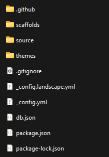

# 安装Hexo

参考：[文档 | Hexo](https://hexo.io/zh-cn/docs/)

1. 安装[Node.js](https://nodejs.org/en)
2. 命令行npm全局安装hexo-cli：`$ npm install -g hexo-cli`
## Mac
```sh
node@20 is keg-only, which means it was not symlinked into /opt/homebrew,
because this is an alternate version of another formula.

If you need to have node@20 first in your PATH, run:
  echo 'export PATH="/opt/homebrew/opt/node@20/bin:$PATH"' >> ~/.zshrc

For compilers to find node@20 you may need to set:
  export LDFLAGS="-L/opt/homebrew/opt/node@20/lib"
  export CPPFLAGS="-I/opt/homebrew/opt/node@20/include"
```
添加PATH后记得重启终端才能生效。
# 测试hexo init

在空文件夹下`$ hexo init`。

相当于执行了以下几步：
1. 远程拷贝了：Git clone [hexo-starter](https://github.com/hexojs/hexo-starter) 和 [hexo-theme-landscape](https://github.com/hexojs/hexo-theme-landscape) 主题到当前目录或指定目录。
2. 使用了： [Yarn 1](https://classic.yarnpkg.com/lang/en/)、[pnpm](https://pnpm.io/zh/) 或 [npm](https://docs.npmjs.com/cli/install) 包管理器下载局部hexo的依赖（如有已安装多个，则列在前面的优先）。npm 默认随 [Node.js](https://hexo.io/zh-cn/docs/index.html#%E5%AE%89%E8%A3%85-Node-js) 安装。

# 测试hexo g

生成静态文件。

# 测试hexo s

启动服务器。默认情况下，访问网址为： `http://localhost:4000/`。

| 选项               | 描述              |
| ---------------- | --------------- |
| `-p`, `--port`   | 重设端口            |
| `-s`, `--static` | 只使用静态文件         |
| `-l`, `--log`    | 启动日记记录，使用覆盖记录格式 |
# 恢复已有环境

以下是精简了的去除了可后期生成的必要的raw文件：


由于没有hexo和其他依赖，在重新生成数据时，需要先进行：`npm install`根据`package.json`指定的信息安装依赖包。

然后才可以在此文件夹下`$ hexo g`。

注意，db.json是比较重要的数据文件，里面记录了hexo的操作，生成的数据时间戳、逻辑关系都以此为准。