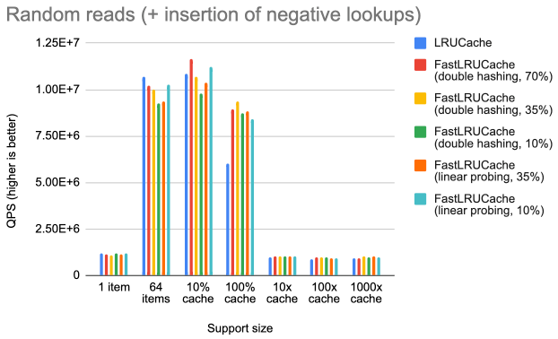
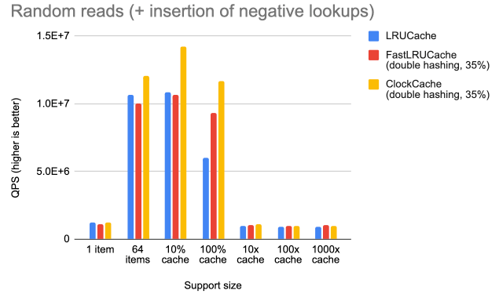
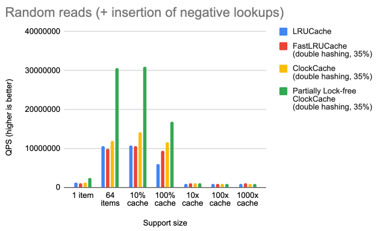

https://github.com/facebook/rocksdb/issues/10306

RocksDB 社区中，根据 LRU **“每片一把 mutex”** 会有热点争用的问题，社区推动了 **Lock-Free** 方向的替代。
# 当前的问题分析
当前默认的block缓存实现（LRUCache）会花费大量时间等待和处理锁，因为每个操作都必须获取每个分片的锁。

评估一个替代的block缓存实现，该缓存使用更细粒度的锁或根本不使用锁，同时修复其他性能热点，例如淘汰算法（即维护 LRU 列表的开销）和索引成本。

理想情况下，新的实现应该在多种典型工作负载下（重点关注读取路径）的性能优于 LRUCache。

# FastLRUCache 中 实现开放地址哈希表 的性能评估
FastLRUCache 是现有 LRUCache 的一个分支，为新的缓存设计提供了原型。

优化方向是：改善哈希表。（open-addressed hash table）
通过实现开放地址哈希表，使之可以预分配表、降低查找期间的指针追逐成本。

FastLRUCache 并没有比 LRUCache 有显著的提升。一些性能分析表明，与直觉相反，预分配表和避免查找期间的指针追逐（pre-allocating the table and avoiding pointer chasing）在总执行成本中占比较低（至少在我们使用的随机读取类型的工作负载中是如此）。

所以最大的瓶颈仍是在于锁定和 LRU 维护。

根据这些数据，得出结论，必须直接开发无锁时钟缓存，而不是优化哈希表设计。
# 基于锁的 ClockCache 版本 性能评估

在竞争较高的工作负载（即支持规模较小）下，此版本的 ClockCache 性能优于 LRUCache。在竞争较低的情况下，它的性能与 LRUCache 基本相当。

但是优势不大。
# 基于 LockFree 的 ClockCache 版本 性能评估
[Lock-free Lookup and Release in ClockCache #10347](https://github.com/facebook/rocksdb/pull/10347)

摘要：这是 ClockCache 部分无锁版本的原型。粗略地说，读取是无锁的，而写入是基于锁的：
- Lookup is lock-free.  查找是无锁的。
- Release is lock-free, unless (i) no references to the element are left and (ii) it was marked for deletion or `erase_if_last_ref` is set.  
    释放是无锁的，除非 (i) 没有留下对该元素的引用，并且 (ii) 它被标记为删除或设置了 `erase_if_last_ref` 。
- Insert and Erase still use a per-shard lock.  
    插入和擦除仍然使用每个分片锁。

可以看到，在争用较多时，LockFree 版本的 ClockCache 明显性能优于 其他模型。
