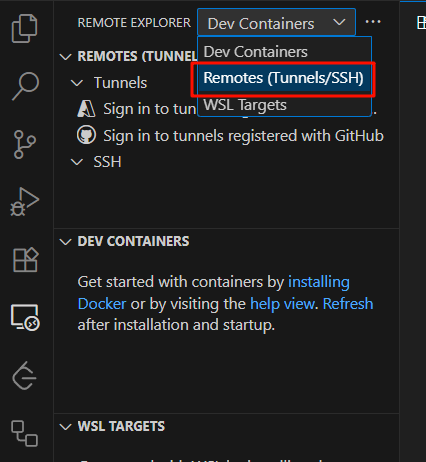

想用windows主机ssh连接虚拟机，连不上。
# 确保 SSH 服务已安装并运行
虽然Ubuntu系统自带了ssh，但是这是客户端的，服务端的openssh-server没有安装。
```bash
# 检查服务状态
sudo systemctl status ssh    # Ubuntu/Debian
sudo systemctl status sshd   # CentOS/RHEL

# 若未安装
sudo apt install openssh-server  # Ubuntu
sudo yum install openssh-server  # CentOS

# 启动并设置开机自启
sudo systemctl start ssh
sudo systemctl enable ssh
```
## 检查SSH端口监听
```bash
sudo netstat -tuln | grep :22
```
- 正常应显示：`tcp 0 0 0.0.0.0:22 0.0.0.0:* LISTEN`
- 若未监听，修改配置：`sudo nano /etc/ssh/sshd_config`

确保存在：
```bash
Port 22
ListenAddress 0.0.0.0  # 允许所有IP连接
PermitRootLogin yes    # 临时允许root登录（测试后建议关闭）
```
## 重启SSH服务
```bash
sudo systemctl restart ssh
```
# VSCode远程连接
在Extensions中搜索Remote，安装Remote Development。
之后左边就会多出一个选项：


点击后，在边栏右上角选择Remotes（SSH）


然后点SSH栏右边的齿轮。


上边栏就会出现：


我们选择第一个，也是Windows下当前用户默认的ssh配置文件夹。


在里面配置远程主机的连接信息


Host指主机名，Linux中@后面的就是。

HostName指ip地址。Linux下ifconfig可以查看。
User指@前面的。

保存文件之后，左边栏就会出现：


# SSH远程连接虚拟机 怎么用公钥免除每次登录输入密码的烦恼
服务器存放公钥。
终端存放私钥。
## 生成密钥对（主机操作）

打开终端（Windows 使用 PowerShell 或 CMD；Mac/Linux 用系统终端）
生成密钥：
```sh
ssh-keygen -t ed25519 -C "your_email@example.com"  # 推荐 ed25519
# 或传统 RSA：ssh-keygen -t rsa -b 4096
```

按提示完成（默认保存位置 `~/.ssh/id_ed25519`）

## 复制公钥到虚拟机的authorized_keys
方法一：自动复制（推荐）（主机操作）

```sh
ssh-copy-id -i ~/.ssh/id_ed25519.pub user@vm_ip
# 输入虚拟机密码一次
```

方法二：手动复制

```sh
cat ~/.ssh/id_ed25519.pub # 查看主机上的公钥内容
ssh user@vm_ip            # 登录虚拟机

mkdir -p ~/.ssh
echo "粘贴的公钥内容" >> ~/.ssh/authorized_keys
chmod 700 ~/.ssh
chmod 600 ~/.ssh/authorized_keys
```

## 配置主机的VSCode
按 `F1` > 选择 ​​`Remote-SSH: Connect to Host...​​`
选择 ​​`Configure SSH Hosts...`​​ > 添加配置：（其实是帮你打开`~/.ssh/config`）

```
Host MyVM   # 自定义别名
  HostName 192.168.1.100          # 虚拟机IP
  User your_username
  IdentityFile ~/.ssh/id_ed25519  # 私钥路径
```

保存配置文件（通常是 `~/.ssh/config`）
## 常见问题解决
1. ​**​权限错误​**​：
    `chmod 600 ~/.ssh/config   # 确保本地 config 文件权限正确`
2. ​**​服务端配置检查​**​：
    - 确认虚拟机 `/etc/ssh/sshd_config` 包含：
        `PubkeyAuthentication yes AuthorizedKeysFile .ssh/authorized_keys`
    - 重启 SSH 服务：
        `sudo systemctl restart sshd`
3. ​**​调试连接​**​：
    `ssh -Tv user@vm_ip   # -v 查看详细日志`


> ✅ 成功标志：使用 `ssh user@vm_ip` 或 VSCode 连接时无需输入密码即可登录。
> 遇到问题建议检查两边日志（本地终端 debug 信息或虚拟机 `/var/log/auth.log`）