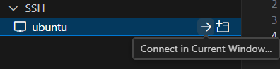

想用windows主机ssh连接虚拟机，连不上。
# 确保 SSH 服务已安装并运行
虽然Ubuntu系统自带了ssh，但是这是客户端的，服务端的openssh-server没有安装。
```bash
# 检查服务状态
sudo systemctl status ssh    # Ubuntu/Debian
sudo systemctl status sshd   # CentOS/RHEL

# 若未安装
sudo apt install openssh-server  # Ubuntu
sudo yum install openssh-server  # CentOS

# 启动并设置开机自启
sudo systemctl start ssh
sudo systemctl enable ssh
```
## 检查SSH端口监听
```bash
sudo netstat -tuln | grep :22
```
- 正常应显示：`tcp 0 0 0.0.0.0:22 0.0.0.0:* LISTEN`
- 若未监听，修改配置：`sudo nano /etc/ssh/sshd_config`

确保存在：
```bash
Port 22
ListenAddress 0.0.0.0  # 允许所有IP连接
PermitRootLogin yes    # 临时允许root登录（测试后建议关闭）
```
## 重启SSH服务
```bash
sudo systemctl restart ssh
```
# VSCode远程连接
在Extensions中搜索Remote，安装Remote Development。
之后左边就会多出一个选项：


点击后，在边栏右上角选择Remotes（SSH）


然后点SSH栏右边的齿轮。


上边栏就会出现：


我们选择第一个，也是Windows下当前用户默认的ssh配置文件夹。


在里面配置远程主机的连接信息


Host指主机名，Linux中@后面的就是。

HostName指ip地址。Linux下ifconfig可以查看。
User指@前面的。

保存文件之后，左边栏就会出现：


