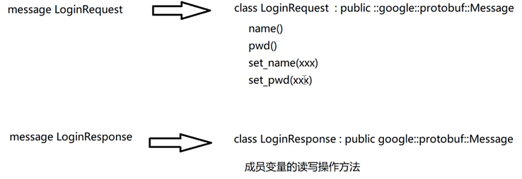
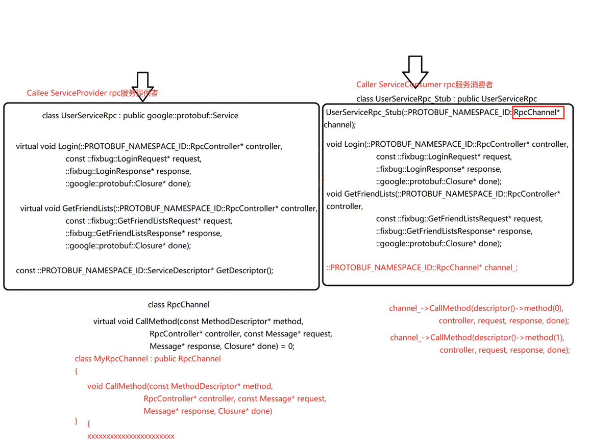

protobuf（protocol buffer）是Google的一种数据交换的格式，独立于平台语言。
protobuf提供了多种语言的实现：Java、C#、C++、Go和Python等，每一种实现都包含了相应语言的编译器及库文件。
# 安装
见《mprpc_环境配置》一篇。

安装成功后，可以在命令行输入`protoc`，这是protobuf的编译命令，可通过简单的配置文件生成相应的代码。
比如命令行的可选项：
```bash
  --cpp_out=OUT_DIR           Generate C++ header and source.
  --csharp_out=OUT_DIR        Generate C# source file.
  --java_out=OUT_DIR          Generate Java source file.
  --js_out=OUT_DIR            Generate JavaScript source.
  --objc_out=OUT_DIR          Generate Objective C header and source.
  --php_out=OUT_DIR           Generate PHP source file.
  --python_out=OUT_DIR        Generate Python source file.
  --ruby_out=OUT_DIR          Generate Ruby source file.
```
## VSCode插件
可以安装一个vscode-proto3
# 定义消息类型 - message
本质上，message是生成了一个公有继承于`::google::protobuf::Message`的类。
提供了message成员变量的读写方法、（反）序列化方法。


## 示例

在项目目录下创建一个test文件夹，在其中再建一个protobuf文件夹。

进入文件夹，新建一个`test.proto`、`main.cc`进行测试。

```protobuf
syntax = "proto3";  //声明protobuf的版本
package xcg;        //声明代码所在的包，相当于cpp的namespace

//定义登录请求消息类型
message LoginRequest
{
    string name = 1;//数字1不代表字符串的值，而是声明此属性为第几个字段
    string pwd = 2;
}
//定义登录响应消息类型
message LoginResponse
{
    int32 errcode = 1;//错误码
    string errmsg = 2;//错误消息
    bool success = 3; //标志登录是否成功
}
```

其中的string不代表具体的某一语言当中的字符串类型，而是protobuf中的字符串类型。也就是说，protobuf中的类型只是个抽象，具体实现则看你是用哪种语言编译。

属性后面的` = 1`数字1不代表字符串的值，而是声明此属性为第几个字段。
## protobuf给属性生成的方法
1. `set_xxx(param)`
2. `xxx()`

protobuf生成的类都会给每一个属性提供`set_xxx(param)`和`xxx()`的方法，分别是写入、读取。

## 序列化方法

protobuf生成的类有一系列的序列化方法。返回值为bool，true表示序列化成功。调用时需要用一个protobuf类对象调用。

如：
1. SerializeToString - 序列化到字符串中
   ```cpp
   bool SerializeToString(std::string* output) const;
   ```
2. SerializeToArray - 序列化到字节数组中
   ```cpp
   bool SerializeToArray(void * data, int size) const;
   ```
3. SerializeToFileDescriptor - 序列化到文件描述符
4. SerializeToOstream - 序列化到输出流

## 反序列化方法

protobuf生成的类，相应地有一系列的反序列化方法。返回值为bool，true表示反序列化成功。调用时需要用一个protobuf类对象调用。

如：
1. ParseFromString
   ```cpp
   inline bool ParseFromString(const std::string& data)
   {
       return ParseFromArray(data.data(), static_cast<int>(data.size()));
   }
   ```
# protobuf的“编译”--protoc生成相应语言的代码

```
protoc test.proto --cpp_out=./
```

其中，`--cpp_out`选项是指明生成Cpp头文件和源文件，后面带的参数指明生成的目录。格式：`--cpp_out=OUT_DIR`。

相应地，也会有其他语言的选项，如`--java_out`就是生成Java源文件（Java没有头文件）；`python_out`就是生成python源文件。

执行该命令，当前目录下出现：`test.pb.cc`和`test.pb.h`。

其中，`test.pb.h`包含`LoginRequest`和`LoginResponse`类的定义，而且它们已经自动包含到了`xcg`的namespace。

# 编写cpp文件, 使用protobuf的生成类

```cpp
// main.cc
#include"test.pb.h"
#include<iostream>

#include "test.pb.h"
#include <iostream>
using namespace xcg;
int main()
{
    // 封装了login请求对象的数据
    LoginRequest req;
    req.set_name("zhang san");
    req.set_pwd("123456");
    // 对象数据序列化 为 字符串
    std::string send_str;
    if(req.SerializeToString(&send_str))
    {
        std::cout << send_str << std::endl;
    }
    // 从一个字符串反序列化到login请求对象
    LoginRequest req2;
    if (req2.ParseFromString(send_str))
    {
        std::cout << req2.name() << std::endl;
        std::cout << req2.pwd() << std::endl;
    }
    return 0;
}
```
编译命令：注意需要链接protobuf的库。
```bash
g++ main.cc test.pb.cc -lprotobuf
```
运行结果：
```

        zhang san123456
zhang san
123456
```


# string和bytes

在编写protobuf文件中的类型时，尽量不要用string类型，而是用bytes类型，可以避免中间传输、存储字符数据时，额外的字符、字节之间的转换。因为bytes存储意味着直接以原始二进制进行存储。如果使用string，中间过程存在着字符到字节码的相互转换。

比如如果存在Unicode，则使用string可能会存在存储效率不高的问题。
```protobuf
//定义登录请求消息类型
message LoginRequest
{
    bytes name = 1;//数字1不代表字符串的值，而是声明此属性为第几个字段
    bytes pwd = 2;
}
```
# 三种类型

1. 数据
2. 列表（数组）
3. 映射表（map）
# 嵌套类中的属性方法
如果是嵌套类，比如我们定义的ResultCode，那么这个子类的每一个属性的方法是`mutable_xxx()`，这个返回的指针是非const的。普通的`xxx()`方法返回的是const值，不可修改。
```cpp
#include "test.pb.h"
#include <iostream>
using namespace xcg;
int main()
{
    LoginResponse rsp;
    ResultCode *rc = rsp.mutable_result();
    rc->set_errcode(0);
    rc->set_errmsg("登陆处理失败");
    GetFriendListsResponse rsp2;
    ResultCode *rc2 = rsp2.mutable_result();
    rc2->set_errcode(0);
    rc2->set_errmsg("成功");

    User * user1 = rsp2.add_friend_list();
    user1->set_name("zhang san");
    user1->set_age(20);
    user1->set_sex(User::MAN);
    User * user2 = rsp2.add_friend_list();
    user2->set_name("li si");
    user2->set_age(22);
    user2->set_sex(User::WOMAN);

    std::cout << rsp2.friend_list_size() << std::endl;

}
```
# 列表 - repeated

```protobuf
message GetFriendListsRequest
{
    uint32 userid = 1;
}
message GetFriendListsResponse
{
    int32 errcode = 1;
    bytes errmsg = 2;
    bool success = 3;
}
```

> 写到此，我们发现，不同的响应类可能用到重复的属性，即errcode和errmsg，可以抽象封装为一个ResultCode类型。

```protobuf
message ResultCode
{
    int32 errcode = 1;
    bytes errmsg = 2;
}
```
于是，响应类可以改为：
```protobuf
message LoginResponse
{
    ResultCode result = 1;
    bool success = 2;
}
message GetFriendListResponse
{
    ResultCode result = 1;
    // ...
    bool success;
}
```

## User

其中枚举的0和1不代表字段的顺序，而是和普通语言一样的定义方法，从0开始。
```protobuf
message User
{
    bytes name = 1;
    uint32 age = 2;
    enum Sex
    {
        MAN = 0;
        WOMAN = 1;
    }
    Sex sex = 3;
}
```

## GetFriendListsResponse - 使用列表存储
列表需要使用repeated关键字代表。

```protobuf
message GetFriendListResponse
{
    ResultCode result = 1;
    repeated User friend_list = 2; // 列表（数组）类型
}
```

## 列表类的属性方法
## xxx_size() - 返回列表大小
## add_xxx() - 添加、返回一个可写元素
可以看到，对于`repeated`类型，即列表类型，都生成了`add_xxx()`方法。往列表里增加一个空元素，并返回该元素的地址。我们可以对其进行修改。

```cpp
::xcg::User* add_friend_list();
```

## xxx(int) - 返回某下标处的只读元素
列表类型，有一个`xxx(int)`方法。可以返回只读数据。（返回一个const引用）

```cpp
const ::xcg::User& friend_list(int index) const;
```

用此方法结合`friend_list_size`方法，可以遍历列表中的元素。

## 修改protobuf自定义类型成员的方式

前面自定义了ResultCode，但是在编写cpp代码时，发现其没有生成`set_result`方法，只有`result`方法，此方法返回的是对应类型的常引用。这说明自定义的类对象统一都视为const类型。幸亏的是，还提供了一个方法是`mutable_result`方法，返回的是普通指针，可用此指针写入数据。

```cpp
const ::xcg::ResultCode& result() const;
::xcg::ResultCode* mutable_result();
```

所以，修改自定义类型成员的正确方式：

```cpp
int main()
{
    LoginResponse rsp;
    ResultCode * resultCode = rsp.mutable_result();
    resultCode->set_errcode(1);
    resultCode->set_errmsg("登录失败");
}
```

# 映射表 - map

```protobuf
message LoginRequest
{
    bytes name = 1;
    bytes pwd = 2;
    map<int32, string> test = 3;
}
```

# 定义描述rpc方法的类型 - service
service本质上是继承了`::google::protobuf::Service`类，生成了service包含的rpc方法。还提供了一个返回服务描述符的方法。

生成的这个UserServiceRpc类不用填参数，有默认构造。此类属于服务提供者（callee）。其中的方法都是虚函数。
还对应生成了带`_Stub`后缀的类。继承于上面这个不带后缀的类。需要填写一个`RpcChannel*`指针作为成员变量进行构造。没有默认构造。此类属于服务调用者（caller）。由于继承的是上面这个类，其中的方法也是虚函数。
这个`_Stub`类中的方法实现都是通过调用channel的CallMethod方法进行的，第一个参数都是`descriptor()->method(n)`，n为rpc方法的顺序号。
这个RpcChannel类是个抽象类，其中的CallMethod是纯虚方法。
需要我们去实现一个MyRpcChannel，并实现具体的CallMethod。
## 前言
在分布式框架中，最主要解决的问题就是远程过程调用。
直白一点，server1想要调用另一个主机上server2的方法。
不仅仅需要传请求参数，server1还需要说明自己想要调用哪个方法。总之，需要传方法名字标识、请求参数。
protobuf的核心功能定位在于对参数的**序列化、反序列化**。
第二个核心功能就是，帮我们区分调用哪个方法。但是要明白的是，protobuf本身不提供任何的RPC通信功能，它只是**对方法进行描述**。
## rpc关键字：示例
```protobuf
rpc 方法名(message类型) returns(message类型);
```

```protobuf
service UserServiceRpc
{
    rpc Login(LoginRequest) returns(LoginResponse);
    rpc GetFriendList(GetFriendListRequest) returns(GetFriendListResponse);
}
```
## option关键字：示例

如果只是写了上面的代码，用protoc编译，默认是不会生成我们声明的所有service服务类和rpc方法描述的。
要生成，需要在proto文件中显式声明option语句。

```protobuf
option cc_generic_services = true;
```

上面这句表示：生成所有定义的service服务类和rpc方法描述。

## 服务类和rpc方法描述类

经过编译链接后，新生成的`pb.h`文件中：

生成了`UserServiceRpc`类、`UserServiceRpc_Stub`类。

服务类，此例为`UserServiceRpc`，继承于`::google::protobuf::Service`。

并且其中生成了protobuf文件中定义的自定义方法：

1. `virtual void Login(...)`
2. `virtual void GetFriendList(...)`

还有获取rpc方法描述的`GetDescriptor`方法：

```cpp
const ::PROTOBUF_NAMESPACE_ID::ServiceDescriptor* GetDescriptor();
```

该描述包括：服务的名字、服务包含的方法（包括该方法是属于哪个类的）。

实际上，类似于`UserServiceRpc`这个类，在分布式框架中是callee的角色，充当RPC Service Provider，即服务提供者。

## Stub类 - 继承于Service类

```cpp
class UserServiceRpc_Stub : public UserServiceRpc
```

实际上，Stub在分布式框架中是caller，充当Service Consumer，即服务消费者。

1. 带参构造函数
   ```cpp
   UserServiceRpc_Stub(::PROTOBUF_NAMESPACE_ID::RpcChannel * channel);
   ```

2. 成员变量：`::PROTOBUF_NAMESPACE_ID::RpcChannel * channel_`

其次，该类也生成了protobuf文件中定义的自定义方法：

1. `void Login(...)`
2. `void GetFriendList(...)`

注意，虽然没写明virtual，但因为继承于UserServiceRpc，所以同样是虚函数，只不过生成Stub类时自动实现了该函数。

```cpp
void UserServiceRpc::Login(::PROTOBUF_NAMESPACE_ID::RpcController* controller,
                           const ::xcg::LoginRequest*,
                           ::xcg::LoginResponse*,
                           ::google::protobuf::Closure* done)
{
  channel_->CallMethod(descriptor()->method(0),
                       controller, request, response, done);
}

void UserServiceRpc::GetFriendList(::PROTOBUF_NAMESPACE_ID::RpcController* controller,
                                   const ::xcg::GetFriendListRequest*,
                                   ::xcg::GetFriendListResponse*,
                                   ::google::protobuf::Closure* done)
{
  channel_->CallMethod(descriptor()->method(1),
                       controller, request, response, done);
}
```

## RpcChannel

```cpp
class PROTOBUF_EXPORT RpcChannel
```

在上面的Stub类中的“生成函数”中可以看到，最终调的是其构造时传入的channel对象的CallMethod方法。而RpcChannel中的CallMethod是个纯虚函数：

```cpp
virtual void CallMethod(const MethodDescriptor* method,
                        RpcController* controller, const Message* request,
                        Message* response, Closure* done) = 0;
```

说明，需要自定义一个MyRpcChannel，继承于RpcChannel，并实现具体的CallMethod。在构造Stub类对象时，传入此MyRpcChannel。

## 总结

整个RPC框架的流程：（以完成Login举例）

1. User调用`UserServiceRpc_Stub`类中的`Login`。
2. `UserServiceRpc_Stub`类就充当中间调用者，最终调用其RpcChannel成员的具体实现的CallMethod方法。
3. 不同的Stub的成员函数，对应着一个特定的method ID，比如Login，对应`descriptor()->method(0)`，GetFriendList，对应`descriptor()->method(1)`。
4. 具体的method，需要Rpc Service Provider来提供，即`UserServiceRpc`类。同时，Rpc方法的具体描述也会在此类中存储。描述包括：服务的名字、服务包含的方法（包括该方法是属于哪个类的）。
5. 最终，在远端的Server上执行该method方法。
6. User的调用请求在远端Server处理完成后，结果就从Server进行回传。

# 本地服务发布为rpc服务

远端，服务的提供方，本地服务类，如何对接到rpc框架？

```cpp
#include<iostream>

#include"user.pb.h"

class UserService : public xcg::UserServiceRpc
{
public:
    bool Login(std::string name, std::string password)
    {   
        std::cout << "doing local service: Login" << std::endl;
        std::cout << "name: " << name << ", password: " << password << std::endl;
        return true;
    }   
    // Override
    void Login(::PROTOBUF_NAMESPACE_ID::RpcController* controller,
               const ::xcg::LoginRequest* request,
               ::xcg::LoginResponse* response,
               ::google::protobuf::Closure* done)
    {   
        // local process
        std::string name = request->name();
        std::string password = request->password();

        bool login_result = Login(name, password);
    
        // response content
        xcg::Result * result = response->mutable_result();
        result->set_errcode(0);
        result->set_errmsg("ok");
        response->set_success(login_result);

        // callback to response
        done->Run();
    }   
};
```

本地服务类，继承于UserServiceRpc，需要实现其中的`Login(...)`方法，即protobuf中定义的rpc方法描述。

1. 以此作为rpc远端调用的接口；
2. 在此接口里，进行远端参数的获取；
3. 然后对这些参数进行本地处理；
4. 处理后，进行响应体的填充；
5. 调用`done->Run()`。进行回调。主要完成响应体的序列化以及发送响应（由rpc框架完成）。

## Closure

done是Closure类型，此类为抽象类，内容很简单，有一个Run纯虚函数：

```cpp
class PROTOBUF_EXPORT Closure
{
public:
    Closure() {}
    virtual ~Closure();
    
    virtual void Run() = 0;
    
private:
    GOOGLE_DISALLOW_EVIL_CONSTRUCTORS(Closure);
};
```

说明，需要先自定义一个MyClosure，具体实现Run方法逻辑，再在外部调用Login时传入此Closure指针。

