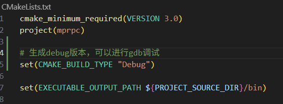
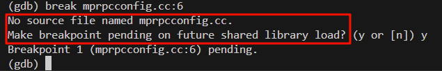
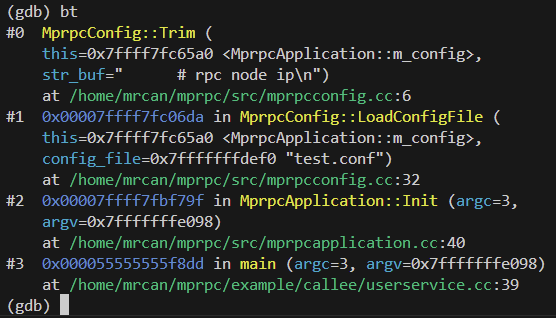

# 无RPC的代码，怎么升级使用RPC框架
在`/example/callee`中的代码
```cpp
#include <iostream>
class UserService
{
public:
    bool Login(std::string name, std::string pwd)
    {
        std::cout << "doing local service: Login" << std::endl;
        std::cout << "name: " << name << ", pwd: " << pwd << std::endl;
    }
};
int main()
{
    UserService us;
    us.Login("xcg", "123456");
}
```
如上，这是独立的代码，UserService可以进行Login处理。但是如果不使用RPC框架，则只能在本地被调用。
需要想办法，能让远程调用。
## 编写user.proto
在`/example/`中的代码
```protobuf
syntax = "proto3";
package xcg;
option cc_generic_services = true;
message ResultCode
{
    int32 errcode = 1;
    bytes errmsg = 2;
}
message LoginRequest
{
    bytes name = 1;
    bytes pwd = 2;
}
message LoginResponse
{
    ResultCode result = 1;
    bool success = 2;
}
service UserServiceRpc
{
    rpc Login(LoginRequest) returns(LoginResponse);
}
```
使用protoc编译
```bash
protoc user.proto --cpp_out=./
```
接下来，就是使用user.pb.h。
## 服务提供者继承UserServiceRpc，实现rpc虚方法，业务处理，响应
```cpp
// userservice.cc
#include <iostream>
#include "user.pb.h"
// 服务提供者
class UserService : public xcg::UserServiceRpc
{
public:
    bool Login(std::string name, std::string pwd)
    {
        std::cout << "doing local service: Login" << std::endl;
        std::cout << "name: " << name << ", pwd: " << pwd << std::endl;
    }
    // 重写基类UserServiceRpc的虚函数。这些方法都是框架直接调用的
    void Login(::google::protobuf::RpcController* controller,
                       const ::xcg::LoginRequest* request,
                       ::xcg::LoginResponse* response,
                       ::google::protobuf::Closure* done)
    {
        // 拿到了框架给上报的请求参数LoginRequest
        // 需要取出相应数据做本地业务
        std::string name = request->name();
        std::string pwd = request->pwd();
        // 取出数据后，调用本身已有的方法
        bool login_result = Login(name, pwd);
        // 填写响应消息
        xcg::ResultCode * result_code = response->mutable_result();
        result_code->set_errcode(0);
        result_code->set_errmsg("ok!");
        response->set_success(login_result);
        // 执行回调操作：由框架done->Run()处理消息的序列化、返回传输
        done->Run();
    }
};
```
## 服务调用者继承UserServiceRpc_Stub，实现rpc虚方法

# 模拟rpc框架的使用，以分析框架需要什么东西
1. 框架需要一个基础类，进行Init初始化，使用argc、argv参数。因为rpc服务器本身有ip地址、端口号，需要zookeeper的ip地址、端口号。从配置文件读。
2. 框架需要提供一个可以发布服务的RpcProvider。

```cpp
// userservice.cc的代码

// class UserService的定义...
// ...

#include "mprpcapplication.h"
int main(int argc, char ** argv)
{
    // 框架的初始化操作
    MprpcApplication::Init(argc, argv);
        
    // provider是一个rpc网络服务对象，负责发布服务到rpc节点上
    RpcProvider provider; 
    // 把UserService发布到rpc节点上
    provider.NotifyService(new UserService());
    
    // 启动一个rpc服务发布节点
    provider.Run();
    // 之后，进程进入阻塞状态，等待远程的rpc调用请求
}
```
## MprpcApplication类
在`/src/include`中编写头文件
```cpp
#pragma once
// mprpc 框架的基础类，用于初始化框架
// 单例设计
class MprpcApplication
{
public:
    static void Init(int argc, char ** argv);
    static MprpcApplication& GetInstance()
    {
        static MprpcApplication app;
        return app;
    }
private:
    MprpcApplication()
    {

    }
    MprpcApplication(const MprpcApplication&) = delete;
    MprpcApplication(MprpcApplication&&) = delete;
};
```
## RpcProvider类
在`/src/include`中编写头文件
```cpp
#pragma once
#include "google/protobuf/service.h"
// 框架提供的专门发布RPC服务的网络对象类
class RpcProvider
{
public:
    // 这里是框架提供给外部使用的，可以发布Service
    void NotifyService(::google::protobuf::Service * service);
    // 启动RPC服务节点
    void Run();
};
```
## CMakeLists.txt
### 根目录
```cmake
cmake_minimum_required(VERSION 3.0)
project(mprpc)

set(EXECUTABLE_OUTPUT_PATH ${PROJECT_SOURCE_DIR}/bin)

set(LIBRARY_OUTPUT_PATH ${PROJECT_SOURCE_DIR}/lib)

include_directories(${PROJECT_SOURCE_DIR}/src/include)
include_directories(${PROJECT_SOURCE_DIR}/example)
link_directories(${PROJECT_SOURCE_DIR}/lib)

# 框架的代码
add_subdirectory(src)
# 使用框架的实例代码
add_subdirectory(example)
```

src生成的代码就是框架的部分。需要生成一个对外的so库。
### src目录
```cmake
# 当前文件夹中所有文件 别名 SRC_LIST
aux_source_directory(. SRC_LIST)
# 生成动态库
add_library(mprpc SHARED ${SRC_LIST})
```
### example目录
```cmake
add_subdirectory(callee)
```
### example/callee目录
```cmake
set(SRC_LIST userservice.cc ../user.pb.cc)

add_executable(provider ${SRC_LIST})
# 声明编译时需要链接mprpc、protobuf动态库
target_link_libraries(provider mprpc protobuf)
```
# 流程

1. 编写protobuf文件，作为协议；
2. 继承rpc服务类。实现rpc方法。
    1. 获取请求体的参数
    2. 本地处理业务
    3. 写入响应体
    4. 执行回调操作，完成响应数据的序列化，进行发送响应。
3. 发布服务，启动服务
    1. 初始化框架
    2. 定义发布rpc服务的对象（provider）
    3. 启动rpc服务发布节点。
4. 服务程序进入等待状态，接受远程rpc调用请求。
# rpc框架的编写

## MprpcApplication类
主要需要实现Init函数。
主要用于使用外部命令行传入的参数，以及读取参数中的配置文件，进行初始化。

1. 可以单独封装一个MprpcConfig类。MprpcApplication类使用它进行config的读取。
2. Init只需要进行一次，所以将MprpcApplication设计为单例模式。
3. 由于Init是静态方法，Init方法使用到了类内对象MprpcConfig，因此MprpcConfig成员需要声明为static。

```cpp
// mprpcapplication.h
#pragma once
#include "mprpcconfig.h"
// mprpc 框架的基础类，用于初始化框架
// 单例设计
class MprpcApplication
{
public:
    static void Init(int argc, char ** argv);
    static MprpcApplication& GetInstance();
private:
    static MprpcConfig m_config;
    MprpcApplication()
    {

    }
    MprpcApplication(const MprpcApplication&) = delete;
    MprpcApplication(MprpcApplication&&) = delete;
};
```
### 实现
1. ShowArgsHelp函数用于提示用户正确的命令行参数格式
2. Init函数主要实现
    1. 检查参数格式
    2. 通过getopt拿到参数
    3. 调用MprpcConfig成员的LoadConfigFile方法解析配置文件的信息，即获取rpc服务器和zookeeper的ip、端口

```cpp
// mprpcapplication.cc
#include "mprpcapplication.h"
#include <iostream>
#include <unistd.h>
MprpcConfig MprpcApplication::m_config;
MprpcApplication& MprpcApplication::GetInstance()
{
    static MprpcApplication app;
    return app;
}

void ShowArgsHelp()
{
    std::cout << "format: commad -i <configfile>" << std::endl;
}
// 类外实现静态方法，不用前面加static
void MprpcApplication::Init(int argc, char ** argv)
{
    if (argc < 2)
    {
        ShowArgsHelp();
        exit(EXIT_FAILURE);
    }
    int c = 0;
    std::string config_file;
    while((c = getopt(argc, argv, "i:")) != -1)
    {
        switch (c)
        {
        case 'i':
            // 获取到配置文件的名字
            config_file = optarg;
            break;
        case '?':
            // std::cout << "invalid args!" << std::endl;
            ShowArgsHelp();
            exit(EXIT_FAILURE);
        case ':':
            // std::cout << "need <configfile>!" << std::endl;
            ShowArgsHelp();
            exit(EXIT_FAILURE);
        default:
            break;
        }
    }
    // 开始加载配置文件 rpcserver_ip rpcserver_port zookeeper_ip zookeeper_port
    m_config.LoadConfigFile(config_file.c_str());

    std::cout << "rpcserver_ip: " << m_config.Load("rpcserver_ip") << std::endl;
    std::cout << "rpcserver_port: " << m_config.Load("rpcserver_port") << std::endl;
    std::cout << "zookeeper_ip: " << m_config.Load("zookeeper_ip") << std::endl;
    std::cout << "zookeeper_port: " << m_config.Load("zookeeper_port") << std::endl;
}
```
若测试的是[注意读取配置文件可能出现的空格、注释、无效信息问题](#注意读取配置文件可能出现的空格、注释、无效信息问题) 中的配置文件，正确结果：
```bash
mrcan@ubuntu:~/mprpc/bin$ ./provider -i test.conf 
rpcserver_ip: 127.0.0.1
rpcserver_port: 8000
zookeeper_ip: 127.0.0.1
zookeeper_port: 5000
```
## MprpcConfig类
1. 提供LoadConfigFile方法，负责解析加载配置文件，将key、value插入到自身的map中
2. 提供Load方法，可以对外提供查询key读取value。
3. 需要集成一个`unordered_map`记录key、value。
4. Trim负责在解析配置文件过程中除去字符串前后的空格。

```cpp
#pragma once
#include <unordered_map>
#include <string>
class MprpcConfig
{
public:
    // 负责解析加载配置文件
    void LoadConfigFile(const char * config_file);
    // 查询配置项信息
    std::string Load(const std::string& key);
private:
    std::unordered_map<std::string, std::string> m_configMap;
    // 去掉字符串前后的空格
    void Trim(std::string &str_buf);
};
```
### 注意读取配置文件可能出现的空格、注释、无效信息问题
```conf
      # rpc node ip
  
   rpcserver_ip        =   127.0.0.1        


        # rpc node port
      rpcserver_port     =     8000  


    # zookeeper ip
            zookeeper_ip   =127.0.0.1       

# zookeeper port
  zookeeper_port= 5000    


```
如上，配置文件可能有：
1. 注释
2. 纯空行的换行符可以用gets过滤
3. 配置项，以=分隔，前面是key，后面是value，可能前后各有空格
    1. key前后的空格可通过Trim处理，后面肯定没有换行符。
    2. value只能用Trim处理前面的空格，因为后面可能存在`空格或换行符`：
        1. `5000\n`：即没有空格，有一个换行符
        2. `5000      \n`：即有空格，有换行符
        3. 所以需要先去掉末尾的换行符，再进行Trim处理。
### 实现
```cpp
#include "mprpcconfig.h"
#include <iostream>
void MprpcConfig::Trim(std::string &str_buf)
{
    // 去掉字符串前面多余的空格
    int idx = str_buf.find_first_not_of(' ');
    if (idx > 0)
    {
        // 说明字符串前面有空格
        str_buf = str_buf.substr(idx, str_buf.size() - idx);
    }
    // 去掉字符串后面多余的空格
    idx = str_buf.find_last_not_of(' ');
    str_buf = str_buf.substr(0, idx + 1);
}
void MprpcConfig::LoadConfigFile(const char * config_file)
{
    FILE *pf = fopen(config_file, "r");
    if (nullptr == pf)
    {
        std::cout << config_file << " not exist!" << std::endl;
        exit(EXIT_FAILURE);
    }
    // 1. 注释
    // 2. 多余的空格
    // 3. 正确的配置项（以=分隔的）
    while (!feof(pf))
    {
        char buf[512] = {0};
        fgets(buf, 512, pf);
        std::string str_buf(buf);
        Trim(str_buf);

        // 判断 # 开头的注释 或者纯空行
        if (str_buf[0] == '#' || str_buf.empty())
        {
            continue;
        }
        int idx = str_buf.find('=');
        if (idx == -1 || idx == 0)
        {
            // 配置项不合法
            continue;
        }
        std::string key;
        std::string value;
        key = str_buf.substr(0, idx);
        // 去掉前后的空格
        Trim(key);


        // 去掉末尾的换行符
        int lineBreakIdx = str_buf.find('\n', idx + 1);
        value = str_buf.substr(idx + 1, lineBreakIdx - (idx + 1));
        // 去掉前后的空格
        Trim(value);

        m_configMap.insert({key, value});
    }
}
std::string MprpcConfig::Load(const std::string& key)
{
    auto it = m_configMap.find(key);
    if (it == m_configMap.end())
    {
        return "";
    }
    return it->second;
}
```
## 修改MprpcApplication
向其中添加一个公有static方法`GetConfig()`以便RpcProvider获得config对象
```cpp
#pragma once
#include "mprpcconfig.h"
// mprpc 框架的基础类，用于初始化框架
// 单例设计
class MprpcApplication
{
public:
    static void Init(int argc, char ** argv);
    static MprpcApplication& GetInstance();
    // 以便RpcProvider获得config对象
    static MprpcConfig& GetConfig();
private:
    static MprpcConfig m_config;
    MprpcApplication()
    {

    }
    MprpcApplication(const MprpcApplication&) = delete;
    MprpcApplication(MprpcApplication&&) = delete;
};
```
## RpcProvider类
根据[[#模拟rpc框架的使用，以分析框架需要什么东西]]，框架需要提供一个可以发布服务的RpcProvider。
主要实现：
1. NotifyService，是框架提供给外部使用的，可以发布Service
2. Run，启动RPC服务节点
3. Stop，停止服务

需要集成一个TcpServer，和搭配一个Eventloop（相当于epoll）。
但是经过考虑，TcpServer没有必要写为RpcProvider的成员变量，因为只在Run方法中使用。而且我们提供的是一个对外的框架，最好不要把TcpServer的配置、复杂的参数暴露给用户，尽量让用户简单易用。
而EventLoop可能不仅Run使用，Stop还需要调用它的quit。所以定义为成员变量。
```cpp
#pragma once
#include "google/protobuf/service.h"
#include <muduo/net/TcpServer.h>
#include <muduo/net/EventLoop.h>
#include <muduo/net/InetAddress.h>
// 框架提供的专门发布RPC服务的网络对象类
class RpcProvider
{
public:
    // 这里是框架提供给外部使用的，可以发布Service
    void NotifyService(::google::protobuf::Service * service);
    // 启动RPC服务节点
    void Run();
private:
    muduo::net::EventLoop m_eventLoop;
    // 新的socket连接回调
    void onConnection(const muduo::net::TcpConnectionPtr&);
    // 已建立连接的用户的读写事件回调
    // std::function<void (const TcpConnectionPtr&, Buffer*, Timestamp)>
    void onMessage(const muduo::net::TcpConnectionPtr&, muduo::net::Buffer*, muduo::Timestamp);
};
```
### Run实现
Run主要实现TcpServer的配置、启动。
这属于RpcProvider的网络模块。
```cpp
#include "rpcprovider.h"
#include "mprpcapplication.h"
#include <functional>
void RpcProvider::Run()
{
    std::string ip = MprpcApplication::GetInstance().GetConfig().Load("rpcserver_ip");
    uint16_t port = atoi(MprpcApplication::GetInstance().GetConfig().Load("rpcserver_port").c_str());
    muduo::net::InetAddress address(ip, port);
    // 创建TcpServer对象
    muduo::net::TcpServer server(&m_eventLoop, address, "RpcProvider");
    // 绑定连接回调和消息读写回调方法 - 分离网络代码和业务代码
    // 需要给TcpServer提供一个返回值为void，参数有TcpConnectionPtr的函数
    // 这个函数我们在RpcProvider的成员方法提供
    // 实际上，onConnection到时候由muduo库进行调用
    // 调用的就是this对象，然后需要一个_1以预留TcpConnectionPtr& conn这个参数的位置
    // std::function<void (const TcpConnectionPtr&)>
    server.setConnectionCallback(std::bind(&RpcProvider::onConnection, this, std::placeholders::_1));
    // std::function<void (const TcpConnectionPtr&, Buffer*, Timestamp)>
    server.setMessageCallback(std::bind(&RpcProvider::onMessage, this, 
        std::placeholders::_1, std::placeholders::_2, std::placeholders::_3));

    // 设置muduo库的线程数量
    server.setThreadNum(4);

    std::cout << "RpcProvider Start Service at IP: " << ip << ", port: " << port << std::endl;

    // 启动网络服务
    server.start();
    // 启动epoll_wait，以阻塞的方式等待远程的连接。
    // 如果有连接请求，则muduo库会回调onConnection
    // 如果有收发数据请求，则muduo库会回调onMessage
    m_eventLoop.loop();
}
```
### NotifyService的实现
发布Rpc服务。
是`/example/callee/`下的如UserService程序调用的。
（集成的muduo网络库实现了：不光能调用本地的RpcProvider，而是可以远程调用网络上的任意一个RpcProvider）

怎么做到“发布”？“发布”的本质是什么？其实是记录在案，方便远端查询，并且定位某个方法。
那么我们就要在RpcProvider类中增加：`m_serviceMap`，记录注册的每一个service名字和这个service对应的所有（n个）method。
```cpp
#pragma once
#include "google/protobuf/service.h"
#include <unordered_map>
// 框架提供的专门发布RPC服务的网络对象类
class RpcProvider
{
public:
    // ...
private:
    struct ServiceInfo
    {
        google::protobuf::Service * m_service;
        std::unordered_map<std::string, const google::protobuf::MethodDescriptor*> m_methodMap;
    };
    std::unordered_map<std::string, ServiceInfo> m_serviceMap;

    // ...
};
```
当远端一个Service服务器（比如UserService）调用RpcProvider的NotifyService时，便在里面记录信息，这就是注册，就是发布。
我们可以：
1. 通过远端传入的Service指针，`service->GetDescriptor()`获得服务描述符`ServiceDescriptor *`，
2. 从而获得服务的名字`name()`和方法的数量`method_count()`、每一个方法的描述符`MethodDescriptor*`，
3. 从而获得每一个方法的名字`name()`。

* 把所有方法的名字、方法的描述符记录在`m_methodMap`中。
* 把服务描述符和`m_methodMap`封装在`ServiceInfo`结构体中。
* 之后，把服务的名字和这个`ServiceInfo`作为键值对插入到`m_serviceMap`中。

```cpp
#include "rpcprovider.h"
#include "mprpcapplication.h"
#include <functional>
#include <google/protobuf/descriptor.h>
void RpcProvider::NotifyService(::google::protobuf::Service * service)
{
    const google::protobuf::ServiceDescriptor * pserviceDesc = service->GetDescriptor();

    ServiceInfo service_info;
    service_info.m_service = service;
    int methodCnt = pserviceDesc->method_count();
    for(int i = 0; i < methodCnt; ++i)
    {
        // 该方法定义于ServiceDescriptor
        // const MethodDescriptor* method(int index) const; 
        // 返回的是一个MethodDescriptor*
        // 获取了服务对象指定下标的rpc服务方法的描述
        const google::protobuf::MethodDescriptor* pmethodDesc = pserviceDesc->method(i);
        std::string method_name = pmethodDesc->name();
        std::cout << i << ". method_name: " << method_name << std::endl;
        service_info.m_methodMap.insert({method_name, pmethodDesc});
    }
    
    std::string service_name = pserviceDesc->name();
    std::cout << "service_name: " << service_name << std::endl;
    m_serviceMap.insert({service_name, service_info});
}
```

## 编译
框架依赖muduo库，因此需要在src目录下的`CMakeLists.txt`添加：

>如果忘记了库叫什么名字，可以在`/usr/lib`或`/usr/local/lib`下查找：

```bash
sudo find /usr -name "libmuduo*"
```

```bash
/usr/local/lib/libmuduo_http.a
/usr/local/lib/libmuduo_net.a
/usr/local/lib/libmuduo_base.a
/usr/local/lib/libmuduo_inspect.a
```

我们需要的muduo的库名：muduo_net、muduo_base
```cmake
# 当前文件夹中所有文件 别名 SRC_LIST
aux_source_directory(. SRC_LIST)
# 生成动态库
add_library(mprpc SHARED ${SRC_LIST})
# 依赖muduo库
target_link_libraries(mprpc muduo_net muduo_base pthread)
```
由于我们在编译muduo时编译成了静态库，而我们现在CMake指定生成的是动态库（`add_library(mprpc SHARED ${SRC_LIST})`）。
由于里面有静态库成分，所以编译链接时会报错，因此我们暂时先生成静态库。
```cmake
# 当前文件夹中所有文件 别名 SRC_LIST
aux_source_directory(. SRC_LIST)
# 生成静态库
add_library(mprpc ${SRC_LIST})
# 依赖muduo库
target_link_libraries(mprpc muduo_net muduo_base pthread)
```
测试：
```bash
mrcan@ubuntu:~/mprpc/bin$ ./provider -i test.conf 
rpcserver_ip: 127.0.0.1
rpcserver_port: 8000
zookeeper_ip: 127.0.0.1
zookeeper_port: 5000
RpcProvider Start Service at IP: 127.0.0.1, port: 8000
```
# 调试

在顶级cmake写下：`set(CMAKE_BUILD_TYPE "Debug")`

运行：
```bash
gdb ./provider
```

break加断点，由于我们是生成了so动态链接库，所以会有如下提示：
```gdb
break mprpcconfig.cc:第n行
```

加完断点后，run，运行程序。（gdb调试时，如果有参数，正确启动方式是：`run arg1 arg2`）
```gdb
run -i test.conf
```
结果：

调试过程中，可以敲入bt查看栈帧信息，l查看源代码信息。
bt

l

敲入n可以单步执行。

p + 变量名，可以打印变量的值。

q退出调试