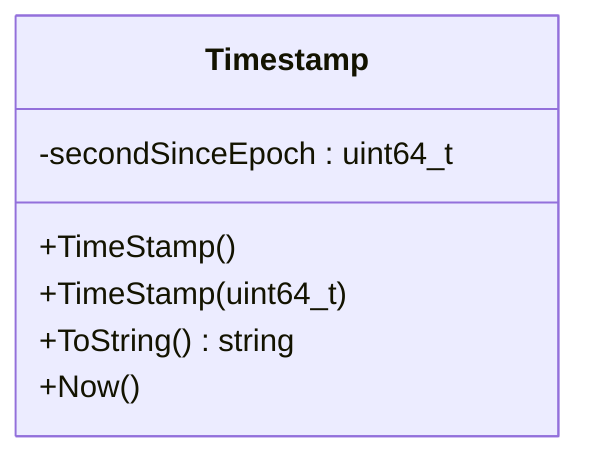
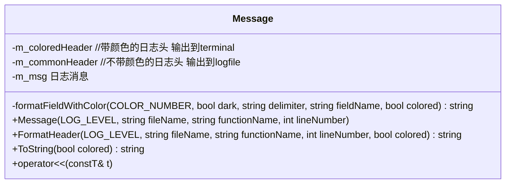
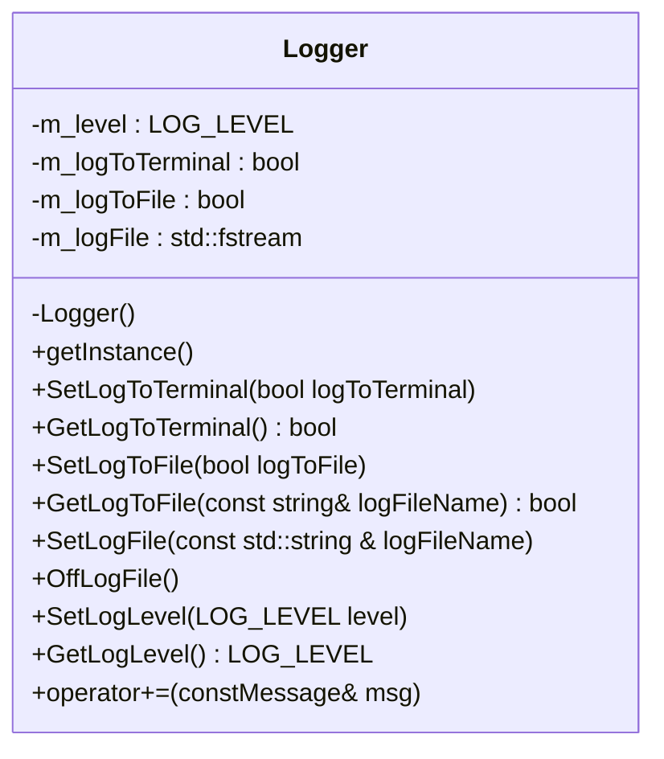
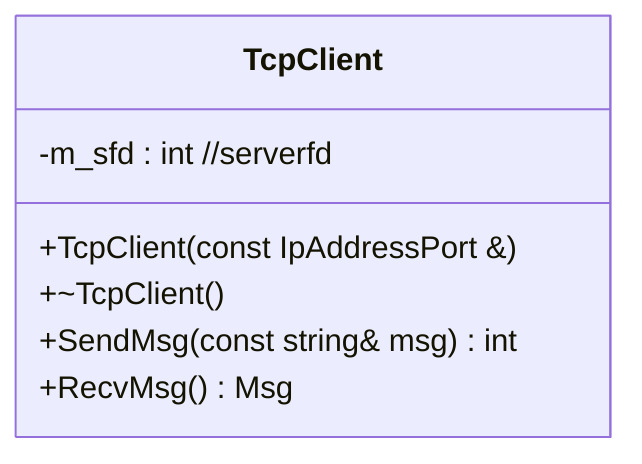
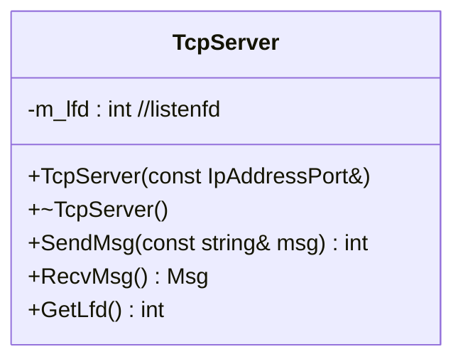

# 内容

1. 环境配置
1. 日志组件

# 项目软件结构

* 网络层
  * 多线程+reactor+one loop per thread+socket api
  * 同步/异步/阻塞/非阻塞
  * select/poll/epoll
  * 池化技术
  * IO模型
  * 网络数据包的收发过程
* 业务层
  * 状态机/MVC模式
* 缓存层
  * 为了存储过程的高效性，使用内存型数据库 - redis/memcached，其中redis可以持久化
* 存储层
  * 关系型数据库 - mysql/oracle/sql server/maridb/mongodb

# 环境配置

主要是云服务器的购买、远程登录配置、vscode ssh remote配置，git配置，远程仓库配置。

# 日志组件

```
[时间戳][带颜色 日志级别][文件名][函数名][行号] - [日志msg]
```

## 组成部分

分为两个部分，前面的部分封装为一个日志头部，记为Message类。后面的具体信息内容拼接在头部之后即可。

* 日志级别

1、重要程度；2、日志级别越细，打印的信息就越多，会对磁盘IO造成影响，影响性能。一般来说，有这些类别：info、debug、error、fatal。我们分别设置为白色、绿色、黄色、红色。

* 文件名、函数名、行号可以用C语言内置的宏。

```c
int main()
{
    printf("[file:%s] [function:%s] [lineNumber:%d]\n", __FILE__, __FUNCTION__, __LINE__);
}
```

## 时间戳类Timestamp



## 日志类Logger

### 消息类Message

由两大部分组成，一部分是消息头，显示信息发生的位置，二是消息体，是具体内容。



### 日志类Logger



日志类的设计模式为单例模式，把构造函数私有化，提供生成对象的静态方法。

## Linux errno

系统调用抛出的错误信息首先是一个错误码，如果要和我们自己实现的日志类结合的话，需要知道Linux errno的含义。

Linux中系统调用的错误都存储于errno中，errno由操作系统维护，存储就近发生的错误，即下一次的错误码会覆盖掉上一次的错误。

对errno的测试

```c
#include<stdio.h>
int main()
{
    int res = open("./a.txt", O_RDONLY, 0664);
    if(-1 == res)
    {
        perror("open()");
    }
}
-------------
/* 输出结果
 * 	open(): No such file or directory
 */
说明，perror括号里的内容只是错误信息前面的开头部分，后面的部分才是刚刚发生的错误的errno所对应的错误信息内容。
```

看open的帮助手册，在return value部分，手册写到：
`open(), openat(), and creat() return the new file descriptor, or -1 if an error occurred (in which case, errno is set appropriately).`

可见，返回值和errno是相互独立的，返回值为-1说明此系统调用出错，而具体的错误类型需要用errno来标识，由内核标识。

### perror和strerror

* perror

手册中对perror的描述(`man 3 perror`)
`The perror() function produces a message on standard error describing the last error encountered during a call to a system or library function.`

关键信息：perror描述的是最后一次错误，是由系统调用产生的错误，将输出到标准错误输出中。

* strerror

我们想要的效果是：通过errno找到对应的msg消息。这个工作可以通过strerror找到。

```cpp
#include<string.h>
int main()
{
    int res = open("./a.txt", O_RDONLY, 0664);
    if(-1 == res)
    {
        LOG_ERROR << strerror(errno);
    }
}
```

### errno与Logger类的结合使用

```cpp
int main()
{
    int res = open("./a.txt", O_RDONLY, 0664);
    if(-1 == res)
    {
        LOG_ERROR << strerror(errno);
    }
}
```

### 系统中errno的位置及含义

查看系统中所有的errno所代表的含义，可以采用如下的代码：

```c
#include <stdio.h>
#include <string.h>     //for strerror()
//#include <errno.h>
int main()
{
    for(int tmp = 0; tmp <=256; tmp++)
    {
        printf("errno: %2d\t%s\n", tmp, strerror(tmp));
    }
    return 0;
}
/* 最后的效果
 * 	[2022/04/17 09:42:40][ERROR][logger.cc][main][61]: No such file or directory
 */
```

Linux中，在头文件 `/usr/include/asm-generic/errno-base.h` 对基础常用errno进行了宏定义：

```c
ifndef _ASM_GENERIC_ERRNO_BASE_H
#define _ASM_GENERIC_ERRNO_BASE_H

#define EPERM            1      /* Operation not permitted */
#define ENOENT           2      /* No such file or directory */
#define ESRCH            3      /* No such process */
#define EINTR            4      /* Interrupted system call */
#define EIO              5      /* I/O error */
#define ENXIO            6      /* No such device or address */
#define E2BIG            7      /* Argument list too long */
#define ENOEXEC          8      /* Exec format error */
#define EBADF            9      /* Bad file number */
#define ECHILD          10      /* No child processes */
#define EAGAIN          11      /* Try again */
#define ENOMEM          12      /* Out of memory */
#define EACCES          13      /* Permission denied */
#define EFAULT          14      /* Bad address */
#define ENOTBLK         15      /* Block device required */
#define EBUSY           16      /* Device or resource busy */
#define EEXIST          17      /* File exists */
#define EXDEV           18      /* Cross-device link */
#define ENODEV          19      /* No such device */
#define ENOTDIR         20      /* Not a directory */
#define EISDIR          21      /* Is a directory */
#define EINVAL          22      /* Invalid argument */
#define ENFILE          23      /* File table overflow */
#define EMFILE          24      /* Too many open files */
#define ENOTTY          25      /* Not a typewriter */
#define ETXTBSY         26      /* Text file busy */
#define EFBIG           27      /* File too large */
#define ENOSPC          28      /* No space left on device */
#define ESPIPE          29      /* Illegal seek */
#define EROFS           30      /* Read-only file system */
#define EMLINK          31      /* Too many links */
#define EPIPE           32      /* Broken pipe */
#define EDOM            33      /* Math argument out of domain of func */
#define ERANGE          34      /* Math result not representable */

#endif
```

其他错误码定义在 `/usr/include/asm-generic/errno.h`中。

```c
#ifndef _ASM_GENERIC_ERRNO_H
#define _ASM_GENERIC_ERRNO_H

#include <asm-generic/errno-base.h>

#define	EDEADLK		35	/* Resource deadlock would occur */
#define	ENAMETOOLONG	36	/* File name too long */
#define	ENOLCK		37	/* No record locks available */
#define	ENOSYS		38	/* Function not implemented */
#define	ENOTEMPTY	39	/* Directory not empty */
#define	ELOOP		40	/* Too many symbolic links encountered */
#define	EWOULDBLOCK	EAGAIN	/* Operation would block */
#define	ENOMSG		42	/* No message of desired type */
#define	EIDRM		43	/* Identifier removed */
#define	ECHRNG		44	/* Channel number out of range */
#define	EL2NSYNC	45	/* Level 2 not synchronized */
#define	EL3HLT		46	/* Level 3 halted */
#define	EL3RST		47	/* Level 3 reset */
#define	ELNRNG		48	/* Link number out of range */
#define	EUNATCH		49	/* Protocol driver not attached */
#define	ENOCSI		50	/* No CSI structure available */
#define	EL2HLT		51	/* Level 2 halted */
#define	EBADE		52	/* Invalid exchange */
#define	EBADR		53	/* Invalid request descriptor */
#define	EXFULL		54	/* Exchange full */
#define	ENOANO		55	/* No anode */
#define	EBADRQC		56	/* Invalid request code */
#define	EBADSLT		57	/* Invalid slot */

#define	EDEADLOCK	EDEADLK

#define	EBFONT		59	/* Bad font file format */
#define	ENOSTR		60	/* Device not a stream */
#define	ENODATA		61	/* No data available */
#define	ETIME		62	/* Timer expired */
#define	ENOSR		63	/* Out of streams resources */
#define	ENONET		64	/* Machine is not on the network */
#define	ENOPKG		65	/* Package not installed */
#define	EREMOTE		66	/* Object is remote */
#define	ENOLINK		67	/* Link has been severed */
#define	EADV		68	/* Advertise error */
#define	ESRMNT		69	/* Srmount error */
#define	ECOMM		70	/* Communication error on send */
#define	EPROTO		71	/* Protocol error */
#define	EMULTIHOP	72	/* Multihop attempted */
#define	EDOTDOT		73	/* RFS specific error */
#define	EBADMSG		74	/* Not a data message */
#define	EOVERFLOW	75	/* Value too large for defined data type */
#define	ENOTUNIQ	76	/* Name not unique on network */
#define	EBADFD		77	/* File descriptor in bad state */
#define	EREMCHG		78	/* Remote address changed */
#define	ELIBACC		79	/* Can not access a needed shared library */
#define	ELIBBAD		80	/* Accessing a corrupted shared library */
#define	ELIBSCN		81	/* .lib section in a.out corrupted */
#define	ELIBMAX		82	/* Attempting to link in too many shared libraries */
#define	ELIBEXEC	83	/* Cannot exec a shared library directly */
#define	EILSEQ		84	/* Illegal byte sequence */
#define	ERESTART	85	/* Interrupted system call should be restarted */
#define	ESTRPIPE	86	/* Streams pipe error */
#define	EUSERS		87	/* Too many users */
#define	ENOTSOCK	88	/* Socket operation on non-socket */
#define	EDESTADDRREQ	89	/* Destination address required */
#define	EMSGSIZE	90	/* Message too long */
#define	EPROTOTYPE	91	/* Protocol wrong type for socket */
#define	ENOPROTOOPT	92	/* Protocol not available */
#define	EPROTONOSUPPORT	93	/* Protocol not supported */
#define	ESOCKTNOSUPPORT	94	/* Socket type not supported */
#define	EOPNOTSUPP	95	/* Operation not supported on transport endpoint */
#define	EPFNOSUPPORT	96	/* Protocol family not supported */
#define	EAFNOSUPPORT	97	/* Address family not supported by protocol */
#define	EADDRINUSE	98	/* Address already in use */
#define	EADDRNOTAVAIL	99	/* Cannot assign requested address */
#define	ENETDOWN	100	/* Network is down */
#define	ENETUNREACH	101	/* Network is unreachable */
#define	ENETRESET	102	/* Network dropped connection because of reset */
#define	ECONNABORTED	103	/* Software caused connection abort */
#define	ECONNRESET	104	/* Connection reset by peer */
#define	ENOBUFS		105	/* No buffer space available */
#define	EISCONN		106	/* Transport endpoint is already connected */
#define	ENOTCONN	107	/* Transport endpoint is not connected */
#define	ESHUTDOWN	108	/* Cannot send after transport endpoint shutdown */
#define	ETOOMANYREFS	109	/* Too many references: cannot splice */
#define	ETIMEDOUT	110	/* Connection timed out */
#define	ECONNREFUSED	111	/* Connection refused */
#define	EHOSTDOWN	112	/* Host is down */
#define	EHOSTUNREACH	113	/* No route to host */
#define	EALREADY	114	/* Operation already in progress */
#define	EINPROGRESS	115	/* Operation now in progress */
#define	ESTALE		116	/* Stale file handle */
#define	EUCLEAN		117	/* Structure needs cleaning */
#define	ENOTNAM		118	/* Not a XENIX named type file */
#define	ENAVAIL		119	/* No XENIX semaphores available */
#define	EISNAM		120	/* Is a named type file */
#define	EREMOTEIO	121	/* Remote I/O error */
#define	EDQUOT		122	/* Quota exceeded */

#define	ENOMEDIUM	123	/* No medium found */
#define	EMEDIUMTYPE	124	/* Wrong medium type */
#define	ECANCELED	125	/* Operation Canceled */
#define	ENOKEY		126	/* Required key not available */
#define	EKEYEXPIRED	127	/* Key has expired */
#define	EKEYREVOKED	128	/* Key has been revoked */
#define	EKEYREJECTED	129	/* Key was rejected by service */

/* for robust mutexes */
#define	EOWNERDEAD	130	/* Owner died */
#define	ENOTRECOVERABLE	131	/* State not recoverable */

#define ERFKILL		132	/* Operation not possible due to RF-kill */
#define EHWPOISON	133	/* Memory page has hardware error */

#endif
```

# TcpC/S

TcpClient/TcpServer类对资源的利用一定要遵循RAII规则。即构造时申请系统资源，析构时归还系统资源。

## TcpClient



## TcpServer




### RAII

RAII: Resource Acquisition is Initialization。

希望C++对象的生命周期和资源的生命周期是一致的。

堆内存：易失性

# 业务层 - MVC模式

## View

```cpp
#include<string>
/* 接口类 */
class View
{
public:
    virtual void process(int fd, std::string &data) = 0;
};
class LoginView : public View
{
public:
    void process(int fd, std::string &data)
    {
        
    }
}
```


## Controller

```cpp
#include<unordered_map>
#include<view.h>
class Controller
{
private:
    std::unordered_map<BIZTYPE, View*> bizTypeMap = 

public:
    Controller();
    ~Controller();
    void ControllerProcess(int fd, std::string &data)
    {
        /* string -> json */
        bizTypeMap[data["biztype"]]
    }
};
```

```cpp
# public.h
enum BIZTYPE
{
    
};
```

# MySQL

```cpp
// mysqldb.h
#ifndef __MYSQLDB_H__
#define __MYSQLDB_H__
#include <mysql/mysql.h>
#include <string>
// 设计成一个线程安全的mysql单例类   因为mysql是可以被多线程看到的
// raii
class MySQLDB
{
private:
    MYSQL* m_mysqlClient;
    MySQLDB();
public:
    static MySQLDB* GetInstance();
    // mysql -h x.x.x.x -P 3307 -u root -p
    void Connect(const std::string& ip,
                 unsigned short port,
                 const std::string& user,
                 const std::string& password,
                 const std::string& db);
    int Query(std::string&& sql);
    bool Insert(std::string&& sql);
    ~MySQLDB();
};
#endif
```


```cpp
MySQLDB::MySQLDB()
{
    m_mysqlClient = NULL;
}
MySQLDB::~MySQLDB()
{
    if(m_mysqlClient != nullptr)
    {
        mysql_close(m_mysqlClient);
    }
}
MySQLDB::MySQLDB* GetInstance()
{
    static MySQLDB res;
    return &res;
}
void MySQLDB::Connect(const std::string & ip,
             unsigned short port,
             const std::string& user,
             const std::string& password,
             const std::string& db)
{
    if(!mysql_real_connect(m_mysqlClient,
                           ip.c_str(), user.c_str(), password.c_str(), db.c_str(), 3306, nullptr, 0))
    {
        LOG_ERROR << "mysql_real_connect() failed!";
    }
    LOG_INFO << "mysql connect success!";
}
int MySQLDB::Query(std::string&& sql)
{
    LOG_INFO << "sql:" << sql;
    if(mysql_query(m_mysqlClient, sql.c_str()))
    {
        LOG_ERROR << mysql_error(m_mysqlClient);
        return 0;
    }
    return mysql_num_rows(mysql_store_result(m_mysqlClient));
}
bool MySQLDB::Insert(std::string&& sql)
{
    LOG_INFO << "sql:" << sql;
    if(mysql_query(m_mysqlClient, sql.c_str()))
    {
        LOG_ERROR << mysql_error(m_mysqlClient);
        return false;
    }
    return true;
}
```

# Redis

## 安装

```bash
wget https://github.com/redis/hiredis/archive/refs/tags/v1.0.2.tar.gz
tar -zxvf v1.0.2.tar.gz
cd hiredis-1.0.2
make
make install
ldconfig
```

