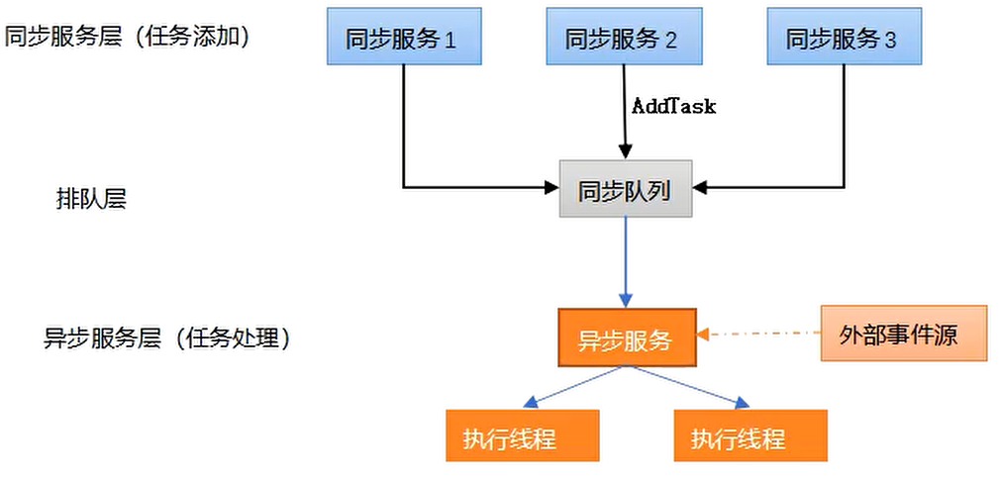
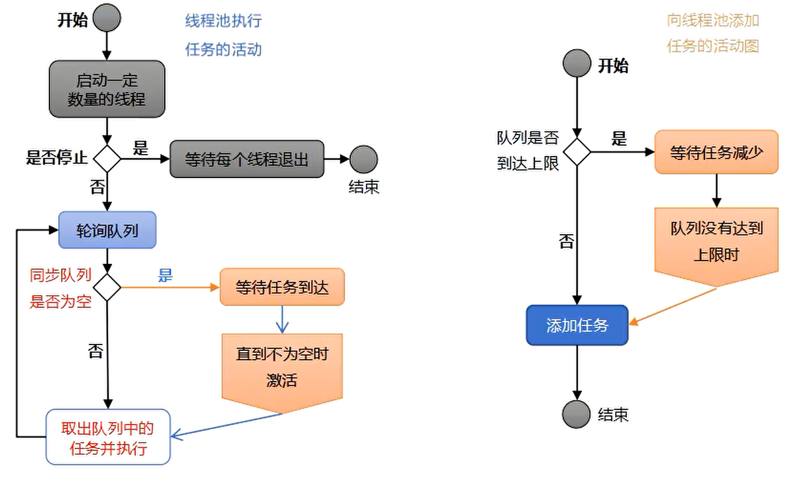

# 内容

1. 半同步半异步线程池介绍
# 线程池介绍

在处理大量并发任务的时候，如果按照传统的方式：来一个任务请求，对应一个线程来处理请求任务。那么大量的线程创建和销毁将消耗过多的系统资源，还增加了线程上下文（运行环境）切换的开销，而通过线程池技术就可以很好地解决这些问题。

线程池技术通过在系统中预先创建一定数量的线程，当任务请求到来时从线程池中分配一个**预先创建的线程**去处理任务，线程在处理完任务之后还可以重用，**不会销毁**，而是等待下次任务的到来。这样，通过线程池能**避免大量的线程创建和销毁动作，从而节省系统资源**。

这样做的一个好处是，对于多核处理器，由于线程会被分配到多个CPU，会**提高并行处理的效率**；另一个好处是**每个线程独立阻塞**，可以防止主线程被阻塞而使主流程被阻塞，导致其他的请求得不到响应的问题。

线程池分为半同步半异步线程池和领导者追随者线程池，本文将主要介绍半同步半异步线程池，这种线程池在实现上更简单，使用得比较多。

# 半同步半异步线程池结构

半同步半异步线程池分成三层，如图所示。



第一层是同步服务层，它处理来自上层的任务请求，上层的请求可能是并发的，这些请求不是马上就会被处理，而是将这些任务放到一个同步排队层中，等待处理。

第二层是同步排队层，来自上层的任务请求都会加到排队层中等待处理。

第三层是异步服务层，这一层中会有多个线程同时处理排队层中的任务，异步服务层从同步排队层中取出任务并行的处理。

这种三层的结构可以最大程度处理上层的并发请求。对于上层来说只要将任务丢到同步队列中就行了，至于谁去处理，什么时候处理都不用关心，主线程也不会阻塞，还能继续发起新的请求。至于任务具体怎么处理，这些细节都是靠异步服务层的多线程异步并行来完成的，这些线程是一开始就创建的，不会因为大量的任务到来而创建新的线程，避免了频繁创建和销毁线程导致的系统开销，而且通过多核处理能大幅提高处理效率。

# 关键技术分析

同步排队层居于核心地位，因为上层会将任务加到排队层中，异步服务层同时也会取出任务，这里有一个同步的过程。

在实现时，排队层就是一个同步队列，允许多个线程同时添加或取出任务，并且要保证操作过程是安全的。

线程池有两个活动过程，一个是往同步队列中添加任务，另一个是从同步队列中取任务。活动图如图所示。



从活动图中可以看到线程池的活动过程，一开始线程池会启动一定数量的线程，这些线程属于异步层，主要用来并行处理排队层中的任务。

如果排队层中的任务数为空，则这些线程等待任务的到来，如果发现排队层中有任务了，线程池则会从等待的这些线程中唤醒一个来处理新任务。同步服务层则会不断地将新的任务添加到同步排队层中这里有个问题值得注意，有可能上层的任务非常多，而任务又是非常耗时的，这时，异步层中的线程处理不过来，则同步排队层中的任务会不断增加，如果同步排队层不加上限控制，则可能会导致排队层中的任务过多、内存暴涨的问题。因此，排队层需要加上限的控制，当排队层中的任务数达到上限时，就不让上层的任务添加进来，起到限制和保护的作用。

# 同步队列

同步队列即为线程中三层结构中的中间那一层，它的主要作用是保证队列中共享数据线程安全，还为上一层同步服务层提供添加新任务的接口，以及为下一层异步服务层提供取任务的接口。同时，还要限制任务数的上限，避免任务过多导致内存暴涨的问题。

同步队列的实现比较简单，我们会用到C++11的锁、条件变量、右值引用、std::move以及std::forward。move是为了实现移动语义，forward是为了实现完美转发。

同步队列的锁是用来线程同步的。

条件变量是用来实现线程通信的，即线程池空了就要等待，不为空就通知一个线程去处理；线程池满了就等待，直到没有满的时候才通知上层添加新任务。

同步队列的具体实现如下。

```cpp
#include<list>
#include<mutex>
#include<condition_variable>
#include<iostream>
using namespace std;
template<class T>
class SyncQueue
{
public:
    SyncQueue(int maxSize) : m_maxSize(maxSize), m_needStop(false){}
    void Put(const T& x)
    {
        Add(x);
    }
    void Put(T && x)
    {
        Add(std::forward<T>(x));
    }
    void Take(std::list<T>& list)
    {
        std::unique_lock<std::mutex> locker(m_mutex);
        //如果队列没有停止运行，则继续看任务队列是否空，如果空则阻塞，不空则继续
        m_notEmpty.wait(locker,
                       [this]()->bool{return m_needStop || NotEmpty();});
        if(m_needStop)return;
        list = std::move(m_queue);	//move对于list来说只移动容器内部对象
        m_notFull.notify_one();
    }
    void Take(T & t)
    {
        std::unique_lock<std::mutex> locker(m_mutex);
        //如果队列没有停止运行，则继续看任务队列是否空，如果空则阻塞，不空则继续
        m_notEmpty.wait(locker,
                       [this]()->bool{return m_needStop || NotEmpty();});
        if(m_needStop)return;
        t = m_queue.front();	//赋值拷贝
        m_queue.pop_front();
        m_notFull.notify_one();
    }
private:
    std::list<T> m_queue;	//任务
    std::mutex m_mutex;
    std::condition_variable m_notEmpty;	//异步任务层
    std::condition_variable m_notFull;	//同步任务层
    int m_maxSize;
    bool m_needStop;
};
```

其中Take函数取的方法是“钓鱼”的方式。

> 如果想通过函数的return直接返回\_Ty是不现实的，因为如果栈空的话会产生返回值混淆。
>
> 所以在外部先定义一个对象名，通过传入引用去接收对象值（通过赋值拷贝）。

```cpp
_Ty Top();
_Ty GetTop()
{
/*  if(Empty())return -1; */
}
bool GetPop(_Ty &v)
{
    if(Empty())return false;
    v = data[top];
    top -= 1;
    return true;
}
```

## Stop

```cpp
class SyncQueue
{
public:
    void Stop()
    {
        {
            std::unique_lock<std::mutex> locker(m_mutex);
	        m_needStop = true;
        }
        //需要唤醒所有阻塞的线程，让他们尽快退出业务操作。
        m_notFull.notify_all();
        m_notEmpty.notify_all();
    }
    bool Empty()/* 此方法需要修改成员锁的属性，不能设置为const方法 */
    {
        std::unique_lock<std::mutex> locker(m_mutex);
        return m_queue.empty();
    }
    bool Full()
    {
        std::unique_lock<std::mutex> locker(m_mutex);
        return m_queue.size() == m_maxSize;
    }
    size_t Size()
    {
        std::unique_lock<std::mutex> locker(m_mutex);
        return m_queue.size();
    }
    int Count()
    {
        return m_queue.size();
    }
private:
    bool NotFull() const
    {
        bool full = m_queue.size() >= m_maxSize;
        if(full)
        {
            cout << "m_queue 满了" << endl;
        }
        return !full;
    }
    bool NotEmpty() const
    {
        bool empty = m_queue.empty();
        if(empty)
        {
            cout << "m_queue 空了" << endl;
        }
        return !empty;
    }
};
```

### Add

```cpp
class SyncQueue
{
private:
    template<class F>
    void Add(F&& x)
    {
        std::unique_lock<std::mutex> locker(m_mutex);
        m_notFull.wait(locker,
                      [this]()->bool {return m_needStop||NotFull();});
        m_queue.push_back(std::forward<F>(x));
        m_notEmpty.notify_one();
    }
};
```

# 线程池

```cpp
const int MaxTaskCount = 100;
class ThreadPool
{
public:
    using Task = std::function<void()>;
    ThreadPool(int numThreads = std::thread::hardware_concurrency)
        : m_queue(MaxTaskCount) /* 设置m_queue的最大容纳任务量 */
    {
        Start(numThreads);
    }
    ~ThreadPool()
    {
        Stop();
    }
private:
    std::list<std::shared_ptr<std::thread> > m_threadgroup;
    SyncQueue<Task> m_queue;
    atomic_bool m_running;	//初始化为假
    std::once_flag m_flag;	//确保函数执行一次的标志
}
```

* Start、RunInThread、StopThread

```cpp
class ThreadPool
{
public:
    void Stop()
    {
        std::call_once(m_flag, [this]() {StopThreadGroup();});
    }

    void Start(int numThreads)	//创建若干线程，放到线程组
    {
        m_running = true;
        for(int i = 0; i < numThreads; ++i)
        {
            //注意，RunInThread是类成员函数，需要指明其是哪个类中的，而且要在前面加&
            m_threadgroup.push_back(
                make_shared<thread>(&ThreadPool::RunInThread, this)
            );
            
        }
    }
private:
    void RunInThread()		//主线程对应的函数，属于类成员函数，需传入this
    {
        while(m_running)	//Start后running为true
        {
            std::list<Task> list;
            m_queue.Take(list);
            for(auto & task : list)
            {
                if(!m_running)return;
                task();
            }
        }
    }
    void StopThreadGroup()
    {
        m_queue.Stop();
        m_running = false;
        for(auto & th : m_threadgroup)
        {
            if(th)
            {
                th->join();
            }
        }
        m_threadgroup.clear();
    }
};
```

* AddTask

```cpp
class ThreadPool
{
public:
    void AddTask(Task && task)
    {
        m_queue.Put(task);
    }
    void AddTask(const Task & task)
    {
        m_queue.Put(task);
    }
};
```

# 测试

```cpp
void funa(ThreadPool &pool)
{
    for(int i = 0;i < 10; ++i)
    {
        auto thdid = this_thread::get_id();
        pool.AddTask();
    }
}
void TestThPool()
{
    ThreadPool pool;
    std::thread tha(fun, 1);
}
int main()
{
    TestThPool();
    return 0;
}
```
# 下去思考的问题

1. 还有一个概念是协程。是在用户态的模拟并发，因而比线程速度更快，但是协程本质上不是并行、高并发，因为实际上它相对于CPU来说是处于串行的状态。
2. 下去思考线程池如何与对象池连接，对象中可以连接MySQL数据库，如何使用线程池调用对象的查询、更新数据方法。
3. 创建一个线程对象与某个线程挂接后，能不能在中间暂停？暂停时改变线程的属性，然后再继续跑动？
4. 能不能精准地创建一个线程，准确地挂在某个核上？
5. 下去看看谷歌的线程池
6. 下去看看protobuf
