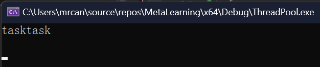
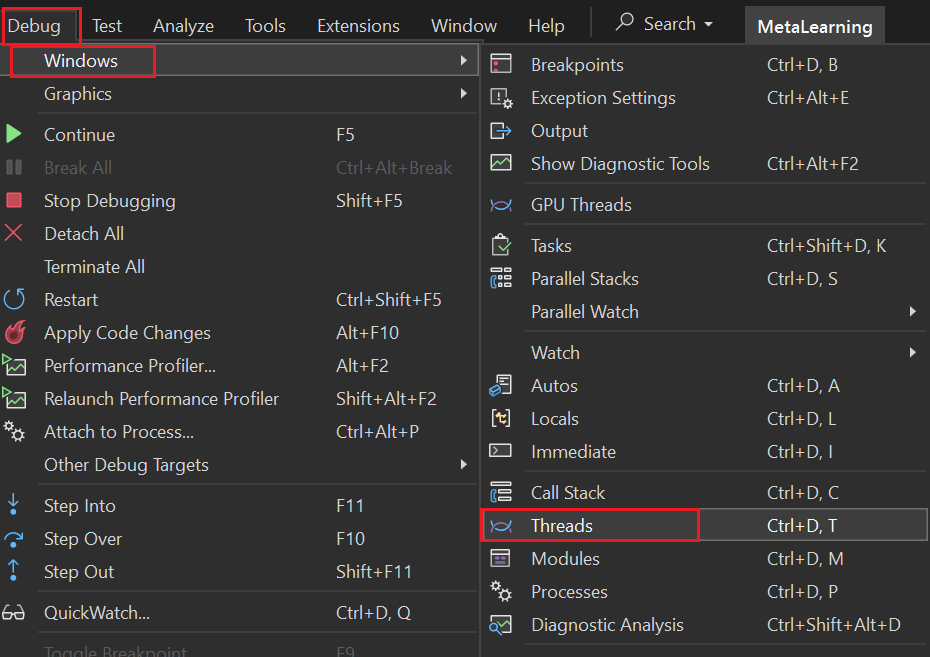
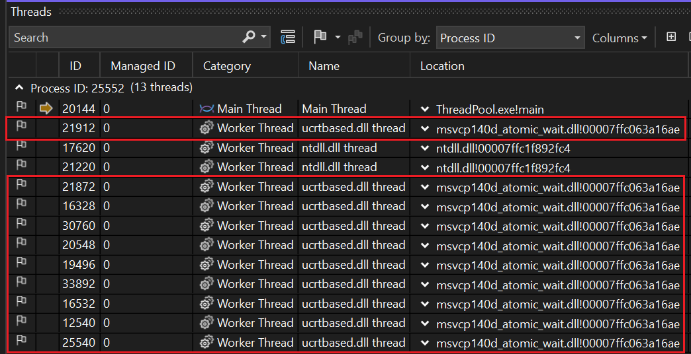

# 创建项目
在已有或新建的解决方案里，新建项目，取名“ThreadPool”。
项目配置标准为`C++20`标准。
# ITask
新建头文件`ITask.h`。
```cpp
namespace thpool
{
	class ITask
	{
	public:
		virtual void run_task(void) = 0;
	};
}
```
# 基于信号量的ThreadPool
新建头文件“ThreadPool.h”
```cpp
// ThreadPool.h
#include <thread>
#include <mutex>
#include <semaphore>
#include <list>
namespace thpool
{
	class ITask;
	class ThreadPool
	{
	public:
		ThreadPool(int max_num);
		~ThreadPool();
		void add_task(std::shared_ptr<ITask> task);
		void add_task(std::list<std::shared_ptr<ITask>> task_lst);
	private:
		// capacity
		int									_max_num;
		// current running task threads
		int									_alive_num;
		std::counting_semaphore<100>		_semaphore;
		std::mutex							_access_mx;
		bool								_is_exit{ false };
		std::list<std::shared_ptr<ITask>>	_task_queue;
	};
}
```

实现：
1. 初始化`_max_num`，规定线程池最大线程数
2. 初始化`_alive_num`，线程池刚创建时，正在执行任务的线程为0。
3. 初始化`_semaphore`为0。

共创建`_max_num`个线程，每个线程基于信号量获取任务，如果成功则`_alive_num`加1，如果此时`_is_exit`标志为真则意味着线程池即将析构，`_alive_num`减1，并退出循环。
如果`_is_exit`标志不为真，则尝试从任务队列中提取任务，需要用互斥锁同步，在外层先简单判断队列大小是否大于0，然后再用锁去再次获取真实值（这样外层先判断，内层再加锁判断，可以加大条件为真的概率，避免锁太急切地加，降低性能），再去执行提取出的任务。循环，直到任务队列大小为0，退出while循环后`_alive_num`减1。
退出大的while时（`_is_exit`标志为真时），`_max_num`减1。
```cpp
// ThreadPool.cpp
#include "ThreadPool.h"
#include "ITask.h"

thpool::ThreadPool::ThreadPool(int max_num)
	: _max_num{ max_num }, _alive_num{ 0 }, _semaphore{ 0 }
{
	for (int i = 0; i < _max_num; ++i)
	{
		std::jthread th([this](void)
			{
				while (true)
				{
					_semaphore.acquire();
					++_alive_num;
					if (_is_exit)
					{
						--_alive_num;
						break;
					}

					while (_task_queue.size() > 0)
					{
						std::unique_lock lck{ _access_mx };
						if (_task_queue.size() > 0)
						{
							auto task = _task_queue.front();
							_task_queue.pop_front();
							lck.unlock();
							task->run_task();
						}
					}
					--_alive_num;
				}
				--_max_num;
			});
		th.detach();
	}
}

void thpool::ThreadPool::add_task(std::shared_ptr<ITask> task)
{
	if (!task)
		return;
	std::unique_lock lck{ _access_mx };
	_task_queue.push_back(task);
	lck.unlock();
	// 判断是否有空余的线程，如果有则唤醒一个
	if (_max_num - _alive_num > 0)
	{
		_semaphore.release(1);
	}
}
```
但是以上程序存在一些问题：
1. `_semaphore.acquire()`和`++_alive_num`不是同步的。
2. `_is_exit`的判断和`--_alive_num`也不是同步的。
3. 在每个线程中都进行while循环反复判断任务队列是否为空，可能会导致一个线程一直独占`_access_mx`互斥量。
4. 在执行完任务后的`--_alive_num`步骤，是和执行结束是不同步的，有可能`_max_num`个线程同时卡在这一步，导致`add_task`函数中的`_max_num - _alive_num > 0`的条件不成立，导致`_semaphore.release(1)`不会执行。这将导致系统实际增加了任务，却没有增加任务的信号量。有小概率死锁（死锁在`_semaphore.acquire()`）。
5. 综上所述，最好把`_semaphore`和`_alive_num`融为一体，不要割裂两者。（也就是说，能不能让信号量的量和`_alive_num`无缝保持一致）
    1. 操作系统的具体实现，如Windows、Linux是可以随时获取信号量的量的，但是我们现在使用的是跨平台`C++`信号量，没有提供获取量大小的方法，因此必须有一个`_alive_num`记录。
    2. 可以在`_semaphore.acquire()`和`++_alive_num`这两个动作整体加锁吗？不可以，因为`_semaphore`本身就是会阻塞的东西，如果加了锁后，`_semaphore`也阻塞了，那么锁就不能解开了。
    3. 上面提到的，加了锁后，里面的东西阻塞了，想要把锁解开，有一样东西可以实现：条件变量。但是，条件变量没有像信号量记录数目的功能（要么是`notify_one`，要么是`notify_all`），因此不行。
6. 最简单的彻底解决4死锁的问题的方法是，`add_task`方法中不再判断`_max_num - _alive_num > 0`的条件，即无论如何，在添加任务时，都要`_semaphore.release(1)`。这样做的副作用就是要把`std::counting_semaphore _semaphore`在声明时，定义其为一个最大值为无限大（最大数）的信号量，可以用`std::counting_semaphore<> _semaphore`表示。
# 修改后的版本
```cpp
// ThreadPool.h
#include <thread>
#include <mutex>
#include <semaphore>
#include <list>
namespace thpool
{
	class ITask;
	class ThreadPool
	{
	public:
		ThreadPool(int max_num);
		~ThreadPool();
		void add_task(std::shared_ptr<ITask> task);
		void add_task(std::list<std::shared_ptr<ITask>> task_lst);
	private:
		// capacity
		int									_max_num;
		// current running task threads
		int									_alive_num;
        std::counting_semaphore<>		    _semaphore;
		std::mutex							_access_mx;
		bool								_is_exit{ false };
		std::list<std::shared_ptr<ITask>>	_task_queue;
	};
}
```

```cpp
// ThreadPool.cpp
#include "ThreadPool.h"
#include "ITask.h"

thpool::ThreadPool::ThreadPool(int max_num)
	: _max_num{ max_num }, _alive_num{ 0 }, _semaphore{ 0 }
{
	for (int i = 0; i < _max_num; ++i)
	{
		std::jthread th([this](void)
			{
				while (true)
				{
					_semaphore.acquire();
					++_alive_num;
					if (_is_exit)
					{
						--_alive_num;
						break;
					}

                    std::unique_lock lck{ _access_mx };
                    if (_task_queue.size() > 0)
                    {
                        auto task = _task_queue.front();
                        _task_queue.pop_front();
                        lck.unlock();
                        task->run_task();
                    }
					--_alive_num;
				}
				--_max_num;
			});
		th.detach();
	}
}

void thpool::ThreadPool::add_task(std::shared_ptr<ITask> task)
{
	if (!task)
		return;
	std::unique_lock lck{ _access_mx };
	_task_queue.push_back(task);
	lck.unlock();
	
    _semaphore.release(1);
}
```
# 线程池的析构——latch的运用
latch是`C++20`引入的标准。
实际上是对操作系统同步量的操作的封装，比如在Windows下，latch就是对事件的封装，或者是对`WaitFor Single/Mutiple Object`的封装。
```cpp
// ThreadPool.h
#include <thread>
#include <mutex>
#include <semaphore>
#include <list>
#include <latch>
namespace thpool
{
	class ITask;
	class ThreadPool
	{
	public:
    	// ...
	private:
    	// ...
		std::latch                          _latch;
        // ...
};
}
```
在ThreadPool构造时初始化`_latch`为`max_num`，表示需要等待`max_num`个线程的结束，latch才放行。
同时，要在退出大的while循环时，`_max_num`减1之后，进行`_latch.count_down()`，参数默认为1，意为对latch值减1。
```cpp
// ThreadPool.cpp
#include "ThreadPool.h"
#include "ITask.h"

thpool::ThreadPool::ThreadPool(int max_num)
	: _max_num{ max_num }, _alive_num{ 0 }, _semaphore{ 0 }, _latch{ max_num }
{
	for (int i = 0; i < _max_num; ++i)
	{
		std::jthread th([this](void)
			{
				while (true)
				{
					_semaphore.acquire();
					++_alive_num;
					if (_is_exit)
					{
						--_alive_num;
						break;
					}

                    // ...
				}
				--_max_num;
				_latch.count_down();
			});
		th.detach();
	}
}
```
析构函数，则可以利用latch，让其在析构函数设置`_is_exit`标志为true且释放`_max_num`信号量后，wait直到latch值为0时，代表所有线程都结束了，就可以返回了。
```cpp
// ThreadPool.cpp
thpool::ThreadPool::~ThreadPool()
{
    _is_exit = true;
    _semaphore.release(_max_num);
    // 等待线程结束，对应latch其值为0时
    _latch.wait();
}
```
# 测试
新建`main_entry.cpp`
```cpp
// main_entry.cpp
#include "ThreadPool.h"
#include "ITask.h"
#include <iostream>
using namespace std::chrono_literals;
class Task : public thpool::ITask
{
public:
    virtual void run_task(void) override
    {
        std::wcout << L"task" << std::endl;
    }
};
int main(void)
{
    thpool::ThreadPool thread_pool{ 10 };
    thread_pool.add_task(std::shared_ptr<thpool::ITask>(new Task));
    thread_pool.add_task(std::shared_ptr<thpool::ITask>(new Task));
    std::this_thread::sleep_for(10s);
    return 0;
}
```
测试结果：

两个task黏在一起，说明多线程输出的。

在Debug-Windows-Threads中，可以看到目前程序中的线程状况：

可以看到有10个子线程在其中：

