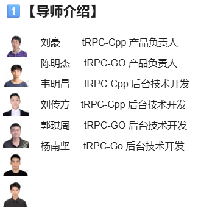

需求：tRPC-Cpp已将内部广播代码变更打出一个patch文件，需要同学基于这个patch，适配开源版本，并完成详细的功能验证
注意：如7天内无提交任何进展包括不限于comment \ commit \ Pull Request，则将视为同学主动放弃issue，组委会将释放issue给下一位等候者。

# 如何参与、完成issue
https://github.com/Tencent/OpenSourceTalent/issues/52
**体验开源社区玩法：** 把开源教育融入日常教学活动是腾讯进行本次犀牛鸟人才培养计划升级的一个重要出发点。我们真诚邀请更多在校大学生及广大开发者了解腾讯开源和腾讯技术，在issue实践里，大家不仅可以自己摸索学习技术，还可以”无门槛认领issue“，轻松加入开源实践交流圈共同探讨开源，切身体验各色开源社区玩法！

**提升技术思路与视野：** 学生可聚焦于具体问题与项目导师进行交流，从研究技术文档到技术实现，从熟悉开发模式到参与开源协作，鼓励学生在实战中探索与学习，提升学生的技术思路和视野！

## 手速要快

今年我们将于2025年7月10日集中开放100+ issue，涉及多个开发语言和技术栈，issue全部来自15个腾讯标杆技术项目issue，想在这个暑假体验一下鹅厂开发吗？别犹豫，直冲“issue任务大厅”找到你适合的issue认领起来，手速推荐顺位：

1. 访问[腾讯开源研学基地](https://docs.qq.com/aio/DTk1wUUFHUkZCQkZN?p=kBrlITmKIZYap9DtpMNaox)
2. 直奔**issue 任务大厅**
3. 查看您意向的**开发语言、issue难度、技术领域**等关键信息
4. 抢滩占领**你心仪issue行的“认领席位”列**
5. 报名登记后，即可点击**issue地址列直达repo**上手issue链接，在该issue页**留言“已成功领取本issue”，把issue编号及留言截图发给犀牛鸟小助手（群主）**，我们会将锁定您的报名信息，并流转issue为“进行中”
6. 开发过程中，您可通过项目repo发布的issue详情、项目学习资料，熟悉和理解issue期望交付的内容，**开启您的issue之旅**包括不限于_comment、commit、PullRequest_等各项开源编码工作，遵循各发布方的规则和开发指南即可
7. 别忘了在7月28日前完成 [报名问卷](https://wj.qq.com/s2/22592394/ahrv/)的填写，认证在校学生&开发者身份才有机会获得各项好礼

## 如何提PR

每个issue来自于不同腾讯技术项目团队，_开发指南_ & _如何贡献_ 可能各有不同，可参考通用流程：

1. 如果你愿意解决issue，请在[腾讯开源研学基地](https://docs.qq.com/aio/DTk1wUUFHUkZCQkZN?p=kBrlITmKIZYap9DtpMNaox)「领取issue任务」
2. 点击issue地址列链接直达项目repo对应的issue，Fork 到个人的仓库下
3. 在个人仓库解决完对应的任务后，提交 PR 至 Issue 所在仓库的 master 分支
4. PR提交后，项目导师将进行 code review， PR 被合并后即视为任务完成
5. 如有任何疑问可以在评论区留言或者邮件至联络人

## 官方规则

👤 单人挑战模式：**先到先得，仅限1人提交代码**，该席位若超7天在repo无提交记录，可能被组委会释放名额；同学们可在等候区轮候组委会邀请

👥 多人竞赛模式：**可1~5人同时提交代码**，项目导师择优合入PR的同学可获得奖励；项目导师在该issue下方评论其他参与同学是否可获得奖励。如遇涉嫌代码抄袭的情形，组委会有权取消奖励资格

注：若您的 PR **首次**被腾讯项目导师合入到master分支前，系统均会提示您签署**腾讯贡献者许可协议**(即Tencent Contributor License Agreement)

