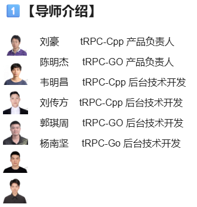

需求：tRPC-Cpp已将内部广播代码变更打出一个patch文件，需要同学基于这个patch，适配开源版本，并完成详细的功能验证
注意：如7天内无提交任何进展包括不限于comment \ commit \ Pull Request，则将视为同学主动放弃issue，组委会将释放issue给下一位等候者。


# tRPC-Cpp 广播调用功能合并与验证计划
## 任务整体难度评估

将一个已有的补丁（`broadcast_call.patch`）合并到 tRPC-Cpp 主干分支，并完成功能验证，是一个 **中等难度** 的任务。主要挑战在于：

- **构建环境复杂性**：tRPC-Cpp 使用 Bazel 进行构建，需要提前安装 Bazel 及相关依赖（如 Protobuf、gflags、fmt 等）[blog.csdn.net](https://blog.csdn.net/weixin_45089880/article/details/138657993#:~:text=bazel%20)。如果从未构建过该项目，需要花时间准备环境并熟悉 Bazel 的用法。
    
- **补丁冲突和适配**：`broadcast_call.patch` 可能是基于旧版本创建的。如果主干分支发生了代码变动，应用补丁时可能出现冲突，需要了解 tRPC-Cpp 框架的代码结构来手工合并修改。
    
- **框架理解**：广播调用涉及 RPC 框架核心机制（例如调用类型、网络传输、多实例调用等）。需要阅读并理解补丁中涉及的模块（RPC 调用层、命名服务等），对于不了解该框架的人来说有一定门槛。不过好在你有 C++ 高并发开发和 RPC 原理经验，可以加速理解这些改动。
    
- **功能验证难度**：需设计测试用例验证广播调用是否生效。这涉及启动多个服务实例、模拟广播场景并收集结果。需要一定的动手实验能力。
    

总体而言，此任务需要在**构建环境、补丁合并、代码理解、测试验证**几个方面投入时间，需要仔细规划和调试。下面将针对该任务制定一个具体的开发计划。

## 构建和运行 tRPC-Cpp 主干版本

开始补丁合并前，需要成功构建并运行 tRPC-Cpp 主干代码，这不仅验证环境搭建正确，也为后续应用补丁提供基础。

**1. 开发环境准备**：确保系统满足开发需求。使用 **Linux (Ubuntu 20.04)** 环境，这也是官方主要支持的环境。准备工作包括：

- **安装 Bazel**：tRPC-Cpp 使用 Bazel 构建。
    
- **安装 JDK**：Bazel 需要 Java 环境。安装 OpenJDK 8 或 11 均可[blog.csdn.net](https://blog.csdn.net/weixin_45089880/article/details/138657993#:~:text=Ubuntu%E7%8E%AF%E5%A2%83%E5%AE%89%E8%A3%85)。确保运行 `bazel` 时 `java` 可用。
    
- **安装 C++编译工具链**：安装 `GCC`/`G++`等基本编译器工具，以及 CMake 等。
    
- **安装项目依赖库**：tRPC-Cpp 架构依赖若干 C++ 库。在构建源码前，应确保以下库在系统中可用或提前安装：
    
    - **Protobuf**：用于序列化RPC消息，需安装 `protoc` 编译器和相应的 `libprotobuf` 库。
        
    - **gflags**：命令行参数解析库，tRPC 使用其定义和解析全局标志。
        
    - **fmtlib**：格式化输出库，用于日志打印等。
        
    - 其他依赖如 OpenSSL（若使用 SSL 通信）、absl 库等。  
        这些库可以通过系统包管理器安装，例如在 Ubuntu 上：
    `sudo apt-get install -y protobuf-compiler libprotobuf-dev libgflags-dev libfmt-dev libssl-dev`
    
**2. 获取主干代码**：从 GitHub 克隆 tRPC-Cpp 仓库主干分支源码：
`git clone https://github.com/trpc-group/trpc-cpp.git`
`cd trpc-cpp`

**3. 编译项目**：tRPC-Cpp 提供了构建脚本，根据[https://github.com/trpc-group/trpc-cpp/blob/main/docs/en/setup_env.md](https://github.com/trpc-group/trpc-cpp/blob/main/docs/en/setup_env.md)，首选 Bazel 构建：在项目根目录：`./run_examples.sh`

**4. 运行示例验证**：为了确认构建的二进制正常运行，脚本 `./run_examples.sh` 除了一键编译，还会运行所有示例，观察示例输出验证框架功能。

通过以上步骤，确认主干分支的代码能够在本地成功构建和运行，为后续合并补丁打下了基础。
# 编译过程中遇到的问题与解决
根据 bazel 的报错信息：
1. ​**​OpenSSL 链接缺失​**​：错误日志中大量 `undefined reference to 'SSL_...'` 表明：
    - 代码正确包含了 OpenSSL 头文件（`#include <openssl/ssl.h>`），
    - ​**​但链接器未正确链接 OpenSSL 的库文件（`libssl.so` 和 `libcrypto.so`）​**​。
2. ​**​Bazel 依赖配置问题​**​  
    tRPC-Cpp 的 SSL 模块需要显式声明对 OpenSSL 的依赖。从错误看，Bazel 在构建目标时未自动链接 OpenSSL。
## 排查
1. 检查 OpenSSL 开发包是否安装
2. 修改 Bazel 构建配置​​：在 `third_party/com_github_openssl_openssl/openssl.BUILD` 文件中，​​显式添加 OpenSSL 依赖​​
3. 更新 SSL BUILD 文件中的依赖​​：确保 `trpc/transport/common/ssl/BUILD` 文件中的依赖引用正确的目标名称
4. 检查 WORKSPACE 中的 OpenSSL 配置​​：在项目根目录的 WORKSPACE 文件中，确保已正确声明 OpenSSL 依赖
### 修改 OpenSSL BUILD 文件​
打开 `third_party/com_github_openssl_openssl/openssl.BUILD` 文件，将目标名称从 `libssl` 和 `libcrypto` 改为 `ssl` 和 `crypto`：
```python
package(default_visibility = ["//visibility:public"])

# 修改目标名称：libssl → ssl
cc_library(
    name = "ssl",  # 原来是 "libssl"
    srcs = glob(["lib64/libssl.so"]),
    hdrs = glob(["include/openssl/*.h"]),
    includes = ["include"],
    deps = [":crypto"],  # 确保依赖关系正确
)

# 修改目标名称：libcrypto → crypto
cc_library(
    name = "crypto",  # 原来是 "libcrypto"
    srcs = glob(["lib64/libcrypto.so"]),
    hdrs = glob(["include/openssl/*.h"]),
    includes = ["include"],
    linkopts = select({
        ":darwin": [],
        "//conditions:default": [
            "-lpthread",
            "-ldl",
        ],
    }),
)
```
### ​更新 SSL BUILD 文件中的依赖​
确保 `trpc/transport/common/ssl/BUILD` 文件中的依赖引用正确的目标名称：
```python
cc_library(
    name = "ssl",
    srcs = ["ssl.cc"],
    hdrs = ["ssl.h"],
    defines = [] + select({
        "//trpc:include_ssl": ["TRPC_BUILD_INCLUDE_SSL"],
        "//trpc:trpc_include_ssl": ["TRPC_BUILD_INCLUDE_SSL"],
        "//conditions:default": [],
    }),
    deps = [
        "//trpc/util:ref_ptr",
        "//trpc/util/log:logging",
    ] + select({
        "//trpc:include_ssl": [
            ":core",
            ":errno",
            "@com_github_openssl_openssl//:crypto",  # 使用 :crypto
            "@com_github_openssl_openssl//:ssl",      # 使用 :ssl
        ],
        "//trpc:trpc_include_ssl": [
            ":core",
            ":errno",
            "@com_github_openssl_openssl//:crypto",  # 使用 :crypto
            "@com_github_openssl_openssl//:ssl",     # 使用 :ssl
        ],
        "//conditions:default": [],
    }),
)
```
### 检查 WORKSPACE 配置​
确保 WORKSPACE 文件中正确引用了 OpenSSL 仓库：
```python
load("@bazel_tools//tools/build_defs/repo:http.bzl", "http_archive")

http_archive(
    name = "com_github_openssl_openssl",
    urls = ["https://github.com/openssl/openssl/archive/refs/tags/OpenSSL_1_1_1k.tar.gz"],
    strip_prefix = "openssl-OpenSSL_1_1_1k",
    build_file = "//third_party/com_github_openssl_openssl:openssl.BUILD",
)
```
## 总结
通过以上修改，Bazel 正确找到了 OpenSSL 目标并解决了链接问题，编译运行example成功。
通过以上步骤，确认了主干分支的代码能够在本地成功构建和运行，为后续合并补丁打下了基础。
# 使用补丁文件合并代码 (`git apply`)
拿到 `broadcast_call.patch` 文件后，需要将其中的改动应用到主干分支代码中。使用 Git 的补丁工具可以合并改动：

# 如何参与、完成issue
https://github.com/Tencent/OpenSourceTalent/issues/52
**体验开源社区玩法：** 把开源教育融入日常教学活动是腾讯进行本次犀牛鸟人才培养计划升级的一个重要出发点。我们真诚邀请更多在校大学生及广大开发者了解腾讯开源和腾讯技术，在issue实践里，大家不仅可以自己摸索学习技术，还可以”无门槛认领issue“，轻松加入开源实践交流圈共同探讨开源，切身体验各色开源社区玩法！

**提升技术思路与视野：** 学生可聚焦于具体问题与项目导师进行交流，从研究技术文档到技术实现，从熟悉开发模式到参与开源协作，鼓励学生在实战中探索与学习，提升学生的技术思路和视野！

## 手速要快

今年我们将于2025年7月10日集中开放100+ issue，涉及多个开发语言和技术栈，issue全部来自15个腾讯标杆技术项目issue，想在这个暑假体验一下鹅厂开发吗？别犹豫，直冲“issue任务大厅”找到你适合的issue认领起来，手速推荐顺位：

1. 访问[腾讯开源研学基地](https://docs.qq.com/aio/DTk1wUUFHUkZCQkZN?p=kBrlITmKIZYap9DtpMNaox)
2. 直奔**issue 任务大厅**
3. 查看您意向的**开发语言、issue难度、技术领域**等关键信息
4. 抢滩占领**你心仪issue行的“认领席位”列**
5. 报名登记后，即可点击**issue地址列直达repo**上手issue链接，在该issue页**留言“已成功领取本issue”，把issue编号及留言截图发给犀牛鸟小助手（群主）**，我们会将锁定您的报名信息，并流转issue为“进行中”
6. 开发过程中，您可通过项目repo发布的issue详情、项目学习资料，熟悉和理解issue期望交付的内容，**开启您的issue之旅**包括不限于_comment、commit、PullRequest_等各项开源编码工作，遵循各发布方的规则和开发指南即可
7. 别忘了在7月28日前完成 [报名问卷](https://wj.qq.com/s2/22592394/ahrv/)的填写，认证在校学生&开发者身份才有机会获得各项好礼

## 如何提PR

每个issue来自于不同腾讯技术项目团队，_开发指南_ & _如何贡献_ 可能各有不同，可参考通用流程：

1. 如果你愿意解决issue，请在[腾讯开源研学基地](https://docs.qq.com/aio/DTk1wUUFHUkZCQkZN?p=kBrlITmKIZYap9DtpMNaox)「领取issue任务」
2. 点击issue地址列链接直达项目repo对应的issue，Fork 到个人的仓库下
3. 在个人仓库解决完对应的任务后，提交 PR 至 Issue 所在仓库的 master 分支
4. PR提交后，项目导师将进行 code review， PR 被合并后即视为任务完成
5. 如有任何疑问可以在评论区留言或者邮件至联络人


## 官方规则

👤 单人挑战模式：**先到先得，仅限1人提交代码**，该席位若超7天在repo无提交记录，可能被组委会释放名额；同学们可在等候区轮候组委会邀请

👥 多人竞赛模式：**可1~5人同时提交代码**，项目导师择优合入PR的同学可获得奖励；项目导师在该issue下方评论其他参与同学是否可获得奖励。如遇涉嫌代码抄袭的情形，组委会有权取消奖励资格

注：若您的 PR **首次**被腾讯项目导师合入到master分支前，系统均会提示您签署**腾讯贡献者许可协议**(即Tencent Contributor License Agreement)

