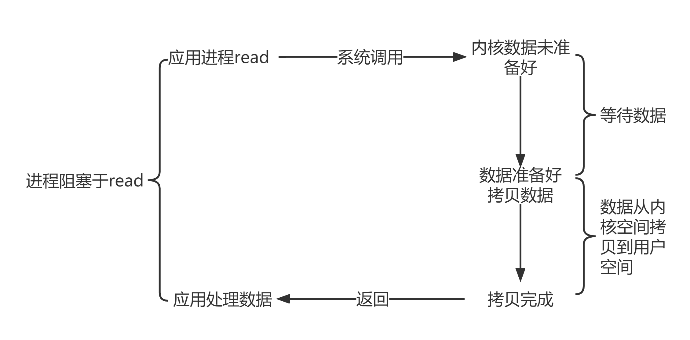
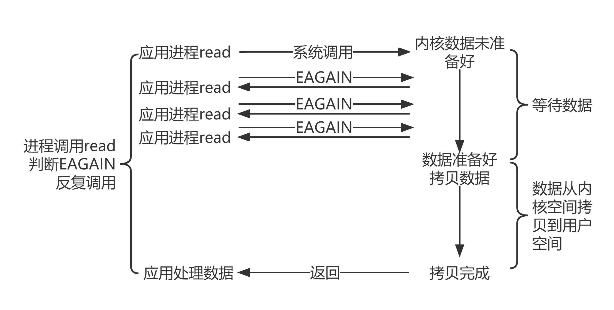
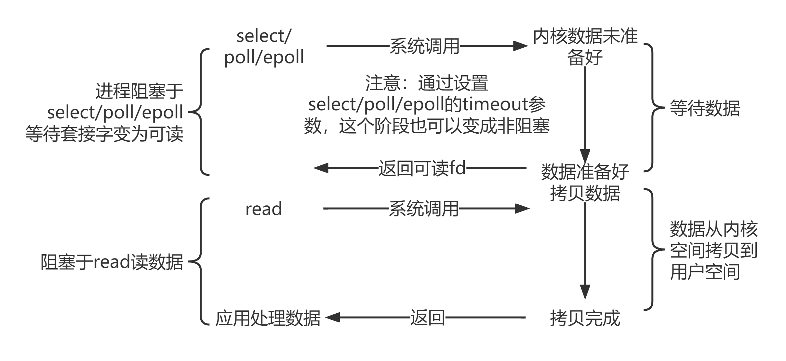
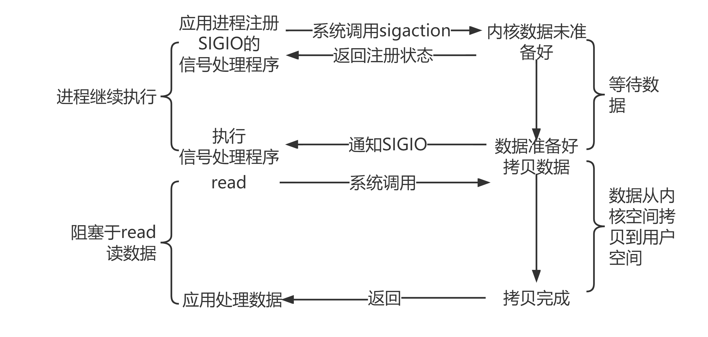
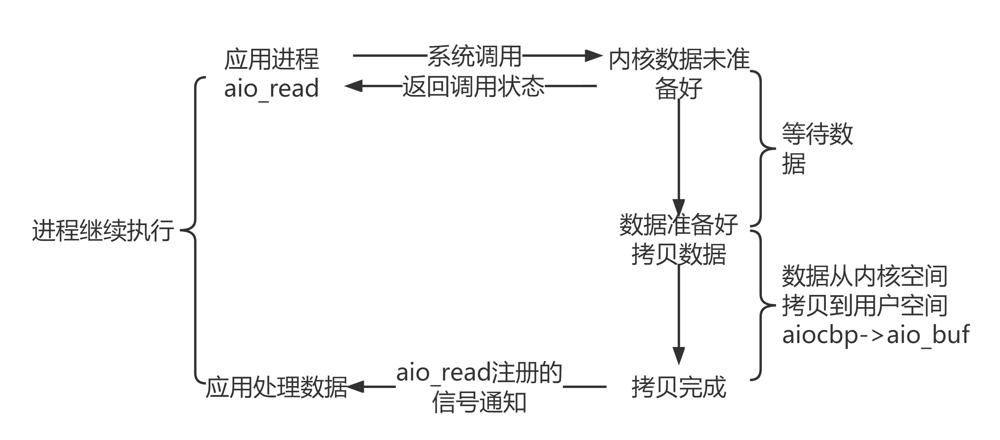

# 内容

1. 阻塞
1. 非阻塞
1. 同步
1. 异步

首先应该阐明的是：阻塞、非阻塞、同步、异步描述的都是IO的状态。然后从IO的两个阶段谈。

5. 五种IO模型

# 典型IO的两个阶段

数据准备 - 数据读写

## 例子

recv，传sockfd、buf、len。数据准备即观察接收缓冲区是否有数据可读。

* 数据未就绪 - 阻塞、非阻塞

当sockfd工作在阻塞模式下，调用recv，如果没有数据就绪，则会阻塞；若sockfd工作在非阻塞模式下，如果没有数据就绪，则立即返回。

如何判断返回的原因？看返回值。以判断是否正常返回。

* 数据就绪 - 同步、异步

应用程序讲内核缓冲区中准备好的数据拷贝到用户空间中的buf缓存区。这个拷贝的过程是需要等待的，等待拷贝完毕应用程序才可以继续向下执行。

异步和同步的方式不一样，需要调用linux提供的异步io接口，`aio_read`、`aio_write`。需要传递`sockfd`、`buf`、`sigio信号(通知方式)`。之后应用程序则立即往后执行其他业务，直到被通知buf的数据已经准备好了，则调用实现绑定的回调函数进行处理。

# 同步/异步

在两个方面都涉及同步/异步。一个方面是**IO同步/异步**，属于上面谈到的。

另一个方面是**业务层面的同步/异步**。

两个方面，角度不同，但思路是一样的，同步是需要自己操心；异步是约定好处理方式，先去忙别的。

**同步**表示A（应用程序）向B（操作系统）请求调用一个网络IO接口时（或者调用某个业务逻辑API接口时），数据的读写都是由请求方A自己来完成的（不管是阻塞还是非阻塞（非阻塞的同步类似于忙等待））；**异步**表示A向B请求调用一个网络IO接口时（或者调用某个业务逻辑API接口时），向B传入请求的事件以及事件发生时通知的方式，A就可以处理其它逻辑了，当B监听到事件处理完成后，会用事先约定好的通知方式，通知A处理结果。

# 五种IO模型

这里谈的IO是指网络IO。

## 同步阻塞IO



阻塞指上半段等待准备好数据；同步指需要花费用户应用程序的时间去拷贝数据、处理数据。

## 同步非阻塞IO



非阻塞指上半段不管数据是否准备好，立即返回；同步指需要花费用户应用程序的时间去拷贝数据、处理数据。

## IO复用



三种接口都是同步阻塞IO。与上面的区别是，一个线程可以管理多个socket。

## 信号驱动



等待数据是异步的过程。在数据就绪前，用户应用程序执行其他逻辑；但是数据准备好后，还是得需要用户应用程序自己处理。仍是同步过程。

优点是提供了消息通知机制，减少了系统调用的次数（相比于同步非阻塞的反复调用EAGAIN）

## 异步IO



```c
struct aiocb
{
    int 			aio_fildes;
    off_t 			aio_offset;
    volatile void *	aio_buf;
    size_t 			aio_nbytes;
    int 			aio_reqprio;
    struct 			sigevent aio_sigevent;
    int				aio_lio_opcode;
}
```

