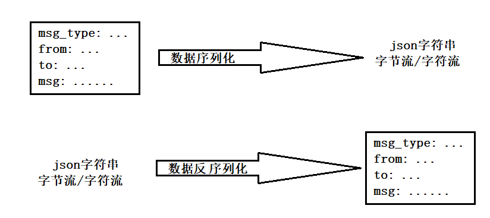

# 内容

1. 项目需求及目标
2. 开发环境
3. `Json`介绍
4. `muduo`网络库编程
5. 服务器集群
6. 基于`发布-订阅`的`Redis`——服务器中间件
7. 数据库设计

本项目要用到的技术栈：

1. `Json`序列化和反序列化；
2. `muduo`网络库开发；
3. `nginx`源码编译安装和环境部署；
4. `nginx`的`tcp`负载均衡器配置；
5. `redis`缓存服务器编程实践；
6. 基于`发布-订阅`的服务器中间件`redis`消息队列编程实践；
7. `MySQL`数据库编程；
8. `CMake`构建编译环境；
9. `Github`托管项目

本项目的内容包含了：通常开发的服务器，网络、业务、数据模块（数据库、数据的操作），项目中要把三大模块区分开，项目初期时以登录模块为主线，分三大块推进。

# 项目需求及目标

* 项目需求
  1. 客户端新用户注册
  2. 客户端用户登录
  3. 添加好友和添加群组
  4. 好友聊天和群组聊天
  5. `nginx`配置`tcp`负载均衡
  6. 集群聊天系统支持客户端跨服务器通信

* 项目目标
  1. 掌握服务器的网络`I/O`模块，业务模块，数据模块分层的设计思想
  2. 掌握`C++` `muduo`网络库的编程以及实现原理
  3. 掌握`Json`的编程应用
  4. 掌握`nginx`配置部署`tcp`负载均衡器的原理及应用
  5. 掌握服务器中间件的应用场景和基于`发布-订阅`的`redis`编程实践以及应用原理
  6. 掌握`CMake`构建自动化编程环境

# 开发环境

1. muduo库基于boost库，需要先安装boost。

   ```sh
   tar -zxvf boost_1_69_0.tar.gz
   cd boost_1_69_0/
   ./bootstrap.sh #运行bootstrap.sh工程编译构建程序
   ./b2 #源码根目录下生成了b2程序，运行b2程序
   #编译完成后，会有如下打印: The Boost C++ Libraries were successfully built!
   sudo ./b2 install #把上面的boost库头文件和lib库文件安装在默认的Linux系统头文件和库文件的搜索路径下
   ```
## 工程目录

```
include目录是头文件放的位置。
server和client的代码在同一工程中，最后生成时可以把C/S分开生成到bin目录下。
可按server和client分类，比如生成代码所需用到的头文件可以分别放在/include/server和/include/client，而server和client共需的头文件直接放到/include下。比如消息的id。
src放源码。
thirdparty是第三方库文件夹，比如放json.hpp。
本项目没有生成lib库(.a/.so)，所以没有lib文件夹。
```

## CMakeLists.txt编写

* 根目录

  ```cmake
  cmake_minimum_required(VERSION 3.0.0)
  project(chat)
  # 配置编译选项
  set(CMAKE_CXX_FLAGS ${CMAKE_CXX_FLAGS} -g)
  # 配置最终的可执行文件输出的路径
  set(EXECUTABLE_OUTPUT_PATH ${PROJECT_SOURCE_DIR}/bin)
  # 配置头文件的搜索路径
  include_directories(${PROJECT_SOURCE_DIR}/include)
  include_directories(${PROJECT_SOURCE_DIR}/include/server)
  # 加载子目录
  add_subdirectory(src)
  ```

* `/src`

  ```cmake
  add_subdirectory(server)
  ```

* `/src/server`

  ```cmake
  # 定义了一个SRC_LIST变量，包含了该目录下所有的源文件
  aux_source_directory(. SRC_LIST)
  # 指定生成可执行文件
  add_executable(ChatServer ${SRC_LIST})
  # 指定可执行文件链接时 需要依赖的库文件
  target_link_libraries(CharServer muduo_net muduo_base pthread)
  ```

  

# Json介绍

Json是一种轻量级的数据交换格式（也叫数据序列化方式）。Json采用完全**独立于编程语言**的文本格式
来存储和表示数据。简洁和清晰的层次结构使得 Json成为理想的数据交换语言。 易于人阅读和编写，同时也易于机器解析和生成，并有效地提升网络传输效率。

Json的用处就是下图：



* Json第三方库

本项目选用的是`JSON for Modern C++`，由德国人`nlohmann`编写的在`C++`下使用的`JSON`库。特点如下:

1. 整个代码由一个头文件`json.hpp`包含，没有依赖关系，使用方便；
2. 使用C++11标准编写；
3. 使得json像STL容器一样，而且STL和json容器之间可以相互转换；
4. 所有类都经过严格的单元测试，覆盖100％的代码，包括所有特殊的行为。此外，还检查了Valgrind是否有内存泄漏。为了保持高质量，该项目遵循“核心基础设施”倡议的最佳实践。

* 测试json

```cpp
#include"json.hpp"
using json = nlohmann::json;
#include<iostream>
#include<vector>
#include<map>
using namespace std;
/* json序列化 示例1 */
void func1()
{
    json js;
    js["msg_type"] = 2;
    js["from"] = "zhang san";
    js["to"] = "li si";
    js["msg"] = "hello, i'm zhang san";
    cout << js << endl;
}
int main()
{
    func1();
    return 0;
}
/* 输出结果
 * {"from":"zhang san","msg":"hello, i'm zhang san","msg_type":2,"to":"li si"}
 */
```

```cpp
/* json序列化 实例2 */
void func2()
{
	json js;
    js["id"] = {1, 2, 3, 4, 5};
    js["name"] = "zhang san";
    js["msg"]["zhang san"] = "i'm zhang san";
    js["msg"]["li si"] = "i'm li si";
    /* 上面两句等同于下面这句一次性添加数组对象 */
/*  js["msg"] = {{"zhang san", "i'm zhang san"}, {"li si", "i'm li si"}}; */
	cout << js << endl;
}
int main()
{
    func2();
    return 0;
}
/* 输出结果
 * {"id":[1,2,3,4,5],"msg":{"li si":"i'm li si","zhang san":"i'm zhang san"},"name":"zhang san"}
 */
```

这个json库强大到直接把`C++` `STL`中的容器内容可以直接序列化成Json字符串，代码如下：

```cpp
/* json序列化 实例3 */
void func3()
{
    json js;
    vector<int> vec;
    vec.push_back(1);
    vec.push_back(2);
    vec.push_back(5);
    // 直接序列化一个vector容器
    js["list"] = vec;
    map<int, string> m;
    m.insert({1, "黄山"});
    m.insert({2, "华山"});
    m.insert({3, "泰山"});
    // 直接序列化一个map容器
    js["path"] = m;
    cout<<js<<endl;
}
/* 输出结果
 * {"list":[1,2,5],"path":[[1,"黄山"],[2,"华山"],[3,"泰山"]]}
 */
```

* API

  * `dump`: `cout <<`能输出json对象是因为重载了`<<`运算符；而要实际生成`string`可用`dump()`，生成的字符串内容和`<< json`的一样。传输数据时，不要传`string`对象，而是要传`string`实际指向的字符串首指针，`c\_str`。

    ```cpp
    void func1()
    {
        json js;
        js["msg_type"] = 2;
        js["from"] = "zhang san";
        js["to"] = "li si";
        js["msg"] = "hello, i'm zhang san";
        string sendBuf = js.dump();
        cout << sendBuf.c_str() << endl;
    }
    ```

    

# 网络IO模块

## ChatServer

### 成员属性

1. `TcpServer m_server` - **基于事件驱动的、IO复用+epoll+线程池**的服务器类，完全**基于Reactor模型**
2. `EventLoop *m_loop` - mainLoop的指针, 保存事件循环. 有了事件循环的指针，可以在合适的时候调用quit退出事件循环；

```cpp
private:
    /* 组合的muduo库，实现服务器功能的类对象 */
    TcpServer _server;
    /* 指向事件循环对象的指针 */
    EventLoop *_loop;
```

### 成员函数

1. 构造 - 参数为`loop`指针, `listenAddr`, `name`, 用于初始化TcpServer
   ```cpp
   public:
       /* 初始化聊天服务器对象 */
       ChatServer(EventLoop* loop,
                  const InetAddress& listenAddr,
                  const string& nameArg);
   ```

2. `start` - 启动服务的接口

   ```cpp
   public:
       void start();
   ```

3. `onConnection`/`onMessage` -  连接创建/断开, 读写事件发生的回调函数
   
   ```cpp
   private:
       /* 上报链接相关信息的回调函数（连接创建，连接断开）*/
       void onConnection(const TcpConnectionPtr&);
       /* 上报读写事件相关信息的回调函数 */
       void onMessage(const TcpConnectionPtr&, Buffer*, Timestamp);
   ```

### 代码实现

```cpp
#ifndef CHATSERVER_H
#define CHATSERVER_H
#include <muduo/net/TcpServer.h>
#include <muduo/net/EventLoop.h>
using namespace muduo;
using namespace muduo::net;
/**
 * 聊天服务器的主类;
 *
 * 要注册两个方法:
 * 给TcpServer注册新用户的连接、连接断开的、已连接用户的可读写事件;
 */
class ChatServer
{
public:
    /* 初始化聊天服务器对象 */
    ChatServer(EventLoop* loop,
               const InetAddress& listenAddr,
               const string& nameArg);
public:
    /* 启动服务 */
    void start();

private:
    /* 上报链接相关信息的回调函数（连接创建，连接断开）*/
    void onConnection(const TcpConnectionPtr&);
    /* 上报读写事件相关信息的回调函数 */
    void onMessage(const TcpConnectionPtr&, Buffer*, Timestamp);


private:
    /* 组合的muduo库，实现服务器功能的类对象 */
    TcpServer _server;
    /* 指向事件循环对象的指针 */
    EventLoop *_loop;
};
#endif
```

## Reactor模型

本项目基于muduo库，模型是**基于事件驱动的、IO复用+epoll+线程池**的网络，完全**基于Reactor模型**，线程暂时设置为4个，有一个主Reactor是IO线程，主要负责新用户的连接，3个sub-Reactor是工作线程，主要负责已连接用户的读写事件的处理。

# 业务模块

## 业务模块与网络模块解耦 - 回调

考虑问题：网络模块收到的消息如何派发到业务模块？让网络模块的代码和业务模块的代码解耦。

假设有一个用户在做登录业务，登录业务包含messageID，name，password，要验证用户名密码是否正确。

解耦的方案有两种：

1. 使用基于面向接口的编程。（抽象基类）
2. **基于回调函数**的操作。

## 业务类型

1. 登录 - `LOGIN_MSG/ACK`
2. 注册 - `REG_MSG/ACK`
3. 加好友 - `ADD_FRIEND_MSG`
4. 一对一聊天 - `ONE_CHAT_MSG`
5. 创建群组 - `CREATE_GROUP_MSG`
6. 加入群组 - `ADD_GROUP_MSG`
7. 群聊 - `GROUP_CHAT_MSG`

```cpp
#ifndef PUBLIC_H
#define PUBLIC_H
/* server和client的公共文件 */

enum EnMsgType  //En表示Enum枚举
{
    LOGIN_MSG = 1,      //登录 消息id, 与chatservice中的login方法绑定
    LOGIN_MSG_ACK,      //登录响应

    REG_MSG,            //注册 消息id, 与chatservice中的reg方法绑定
    REG_MSG_ACK,        //注册响应

    ADD_FRIEND_MSG,     //添加好友
    ONE_CHAT_MSG,       //一对一聊天

    CREATE_GROUP_MSG,   //创建群组
    ADD_GROUP_MSG,      //加入群组
    GROUP_CHAT_MSG      //群聊
};

enum EnLoginErrType
{
    LOGIN_SUCCEESS = 0,
    LOGIN_REPEAT = 1,
    LOGIN_NOTFOUND = 2,
    LOGIN_WRONGPWD = 3
};
#endif
```

### JSON格式

| 业务类型         | JSON示例                                                     |
| ---------------- | ------------------------------------------------------------ |
| 登录请求消息     | `"msgid":1,"id":22,"password":"123"`                         |
| 登录响应消息     | `"msgid":2,"errno":0,"id":22,"name":"xcg"`或`"msgid":2,"errno":1,"errmsg":"this account is online!"`或`"msgid":2,"errno":2,"errmsg":"id not found!"`或`"msgid":2,"errno":3,"errmsg":"password wrong!"` |
| 注册请求消息     | `"msgid":3,"name":"xcg","password":"123"`                    |
| 注册响应消息     | `"msgid":4,"errno":0,"id":22`或`"msgid":4,"errno":1`         |
| 加好友请求消息   | `"msgid":5,"friendid":12`                                    |
| 一对一聊天消息   | `"msgid":6,"to":12,"msg":"hello!"`                           |
| 创建群组请求消息 | `"msgid":7,"groupname":"group1","groupdesc":"this is a group."` |
| 加入群组请求消息 | `"msgid":8,"id":22,"groupid":10`                             |
| 群聊请求消息     | `"msgid":9,"id":22,"groupid":10,"msg":"hello, everyone!"`    |
| 注销请求消息     | `"msgid":10,"id":22`                                         |


## ChatService

### 前置处理

```cpp
#include"json.hpp"
using json = nlohmann::json;
```

```cpp
/* 表示处理消息的事件回调方法类型 */
using MsgHandler = std::function<void(const TcpConnectionPtr&, json&, Timestamp)>;
```

### 成员属性

1. `unordered_map<int, MsgHandler> m_msgHandlerMap` - 映射消息类型id 和 事件回调函数

   ```cpp
   private:
       /* 存储消息id和其对应的业务处理方法 */
       unordered_map<int, MsgHandler> m_msgHandlerMap;
   ```

2. `unordered_map<int, TcpConnectionPtr> m_userConnectionMap` - 存储在线用户的通信连接

   ```cpp
   private:
       /* 存储在线用户的通信连接 */
       unordered_map<int, TcpConnectionPtr> m_userConnectionMap;
   ```

3. `mutex m_connMutex` - 定义互斥锁，保证`m_userConnectionMap`的线程安全

   ```cpp
   private:
       /* 定义互斥锁，保证m_userConnectionMap的线程安全 */
       mutex _connMutex;
   ```

4. 数据操作类对象

   1. UserModel - `m_userModel`
   2. OfflineMsgModel - `m_offlineMsgModel`
   3. FriendModel - `friendModel`
   4. GroupModel - `groupModel`

   ```cpp
   private:
       UserModel       _userModel;         /* 数据操作类对象 */
       OfflineMsgModel _offlineMsgModel;   /* 数据操作类对象 */
       FriendModel     _friendModel;       /* 数据操作类对象 */
       GroupModel      _groupModel;        /* 数据操作类对象 */
   ```

### 成员函数

1. 构造函数 - 私有化, 单例处理
   ```cpp
   public:
       static ChatService * instance();
   private:
       ChatService();
   ```

2. 业务接口

   1. login - 登陆业务
   2. reg - 注册业务
   3. addFriend - 添加好友业务
   4. oneChat - 一对一聊天业务
   5. createGroup - 创建群组业务
   6. addGroup - 加入群组业务
   7. groupChat - 群组聊天业务

   ```cpp
   public:
       /* 处理登录业务 */
       void login(const TcpConnectionPtr &conn, json &js, Timestamp time);
       /* 处理注册业务 */
       void reg(const TcpConnectionPtr &conn, json &js, Timestamp time);
   
       /* 添加好友业务 */
       void addFriend(const TcpConnectionPtr &conn, json &js, Timestamp time);
       /* 一对一聊天业务 */
       void oneChat(const TcpConnectionPtr &conn, json &js, Timestamp time);
   
       /* 创建群组业务 */
       void createGroup(const TcpConnectionPtr &conn, json &js, Timestamp time);
       /* 加入群组业务 */
       void addGroup(const TcpConnectionPtr &conn, json &js, Timestamp time);
       /* 群组聊天业务 */
       void groupChat(const TcpConnectionPtr &conn, json &js, Timestamp time);
   ```

3. getHandler - 获取消息对应的处理器
   ```cpp
   public:
       /* 获取消息对应的处理器 */
       MsgHandler getHandler(int msgid);
   ```

4. clientCloseException - 处理客户端异常退出
   ```cpp
   public:
       /* 处理客户端异常退出 */
       void clientCloseException(const TcpConnectionPtr & conn);
   ```

5. reset - 业务重置方法，通常在服务器异常退出时调用
   ```cpp
   public:
       /* 业务重置方法，通常在服务器异常退出时调用 */
       void reset();
   ```

### 代码实现

```cpp
#ifndef CHATSERVICE_H
#define CHATSERVICE_H
#include<muduo/net/TcpConnection.h>
#include<unordered_map>
#include<functional>

#include"usermodel.hpp"
#include"offlinemsgmodel.hpp"
#include"friendmodel.hpp"
#include"groupmodel.hpp"

using namespace std;
using namespace muduo;
using namespace muduo::net;
#include"json.hpp"
using json = nlohmann::json;

#include<mutex>

/* 表示处理消息的事件回调方法类型 */
using MsgHandler = std::function<void(const TcpConnectionPtr&, json&, Timestamp)>;
/**
 * 聊天服务器业务类. 
 * 用映射关系来存储消息id和具体处理函数. 
 * 此类有一个实例就够了，所以采用单例模式. 
 */
class ChatService
{
public:
    /* 获取单例对象的接口函数 */
    static ChatService* instance();
public:
    /* 处理登录业务 */
    void login(const TcpConnectionPtr &conn, json &js, Timestamp time);
    /* 处理注册业务 */
    void reg(const TcpConnectionPtr &conn, json &js, Timestamp time);

    /* 添加好友业务 */
    void addFriend(const TcpConnectionPtr &conn, json &js, Timestamp time);
    /* 一对一聊天业务 */
    void oneChat(const TcpConnectionPtr &conn, json &js, Timestamp time);

    /* 创建群组业务 */
    void createGroup(const TcpConnectionPtr &conn, json &js, Timestamp time);
    /* 加入群组业务 */
    void addGroup(const TcpConnectionPtr &conn, json &js, Timestamp time);
    /* 群组聊天业务 */
    void groupChat(const TcpConnectionPtr &conn, json &js, Timestamp time);
public:
    /* 获取消息对应的处理器 */
    MsgHandler getHandler(int msgid);
public:
    /* 处理客户端异常退出 */
    void clientCloseException(const TcpConnectionPtr & conn);
public:
    /* 业务重置方法，通常在服务器异常退出时调用 */
    void reset();

private:
    ChatService();
private:
    UserModel       _userModel;         /* 数据操作类对象 */
    OfflineMsgModel _offlineMsgModel;   /* 数据操作类对象 */
    FriendModel     _friendModel;       /* 数据操作类对象 */
    GroupModel      _groupModel;        /* 数据操作类对象 */
private:
    /* 定义互斥锁，保证m_userConnectionMap的线程安全 */
    mutex _connMutex;
private:
    /* 存储消息id和其对应的业务处理方法 */
    unordered_map<int, MsgHandler> _msgHandlerMap;
    /* 存储在线用户的通信连接 */
    unordered_map<int, TcpConnectionPtr> _userConnectionMap;
};
#endif
```

# 数据模块

## 业务模块与数据模块解耦 - ORM框架

> Object Relation Map - 对象关系映射。

在这个框架中，业务层操作的都是对象，看不到具体的SQL操作。

在DAO层（数据层），才有具体的数据库操作。

解决了痛点：业务模块、数据模块之间的解耦。

## 搭建MySQL数据库环境

(以下命令基于ubuntu环境)

1. 安装mysql-server和mysql开发包, 包括mysql头文件和动态库文件
   ```bash
   
   sudo apt-get install mysql-server		#安装最新版MySQL服务器
   sudo apt-get install libmysqlclient-dev #安装开发包
   ```

2. 初始的用户名和密码是自动生成的，按下面步骤修改mysql的root用户密码为123456
   ```bash
   ~$ sudo cat /etc/mysql/debian.cnf
   
   [client]
   host = localhost
   user = debian-sys-maint 			#初始的用户名
   password = Kk3TbShbFNvjvhpM			#初始的密码
   socket = /var/run/mysqld/mysqld.sock
   ```

   ```bash
   # 用上面初始的用户名和密码，登录mysql server，修改root用户的密码，命令如下：
   ~$ mysql -u debian-sys-maint -pKk3TbShbFNvjvhpM
   #-u后面是上面查看的用户名; -p后面紧跟上面查看的密码
   ```

   更改密码：参考https://blog.csdn.net/mrcan666/article/details/124163537?spm=1001.2014.3001.5502
   
3. 设置MySQL字符编码utf-8，以支持中文操作
   ```mysql
   mysql> show variables like "char%"; # 先查看MySQL默认的字符编码
   +--------------------------+----------------------------+
   | Variable_name			   | Value			   			|
   +--------------------------+----------------------------+
   | character_set_client     | utf8                       |
   | character_set_connection | utf8                       |
   | character_set_database   | latin1                     |
   | character_set_filesystem | binary                     |
   | character_set_results    | utf8                       |
   | character_set_server     | latin1                     |#不支持中文！！！
   | character_set_system     | utf8                       |
   | character_sets_dir       | /usr/share/mysql/charsets/ |
   +--------------------------+----------------------------+
   8 rows in set (0.06 sec)
   
   mysql> set character_set_server=utf8;
   Query OK, 0 rows affected (0.00 sec)
   ```

4. 修改表的字符编码：`alter table user default character set utf8;`
   修改属性的字符编码：`alter table user modify column name varchar(50) character set utf8;`

## MySQL类 - 封装MySQL操作

需要引入`mysql/mysql.h`头文件
```cpp
#include<mysql/mysql.h>
```

### 成员变量

`MYSQL *m_conn` - 记录MYSQL类型的指针, 以获取这个mysql连接

```cpp
private:
    MYSQL *m_conn;
```

### 成员函数

1. 构造/析构 - 初始化/释放数据库连接
   ```cpp
   public:
       /* 初始化数据库连接 */
       MySQL();
       /* 释放数据库连接资源 */
       ~MySQL();
   ```

2. getConnection - 获取连接, 即获取成员`m_conn`
   ```cpp
   public:
       /* 获取连接 */
       MYSQL * getConnection();
   ```

3. connect - 连接数据库, 返回值为bool, 说明连接成功与否
   ```cpp
   public:
       /* 连接数据库 */
       bool connect();
   ```

4. query - 查询操作, 参数是string类型的sql语句, 返回值为`MYSQL_RES`, 即MySQL结果集类型
   ```cpp
   public:
       /* 查询操作 */
       MYSQL_RES * query(string sql);
   ```

5. update - 更新操作, 参数是string类型的sql语句, 返回值为bool, 说明更新成功与否
   ```cpp
   public:
       /* 更新操作 */
       bool update(string sql);
   ```

### 代码实现

前置全局声明
```cpp
#include <muduo/base/Logging.h>	//日志工具
/* 数据库配置信息 */
static string server = "127.0.0.1";
static string user = "root";
static string password = "123";
static string dbname = "chat";
```

1. 构造 - 调用`mysql_init`, 实际上只是对mysql连接进行空间资源的开辟, 返回一个指针赋给`m_conn`成员, 没有真正连接, 因此传入nullptr
   ```cpp
   /* 初始化数据库连接 */
   MySQL::MySQL()
   {
       m_conn = mysql_init(nullptr);
   }
   ```

2. 析构 - 调用`mysql_close(m_conn)`, 对MySQL连接资源进行释放
   ```cpp
   /* 释放数据库连接资源 */
   MySQL::~MySQL()
   {
       if(m_conn != nullptr)
       {
           mysql_close(m_conn);
       }
   }
   ```

3. getConnection - 获取连接, 即返回`m_conn`成员
   ```cpp
   /* 获取连接 */
   MYSQL * MySQL::getConnection()
   {
       return m_conn;
   }
   ```

4. connect - 连接数据库, 内部调用`mysql_real_connect`, 传入`m_conn`, 以及server地址, user号, 密码, 要连接的数据库name, 服务器端口;
   ```cpp
   /* 连接数据库 */
   bool MySQL::connect()
   {
       MYSQL *p = mysql_real_connect(m_conn, server.c_str(), user.c_str(),
                                     password.c_str(), dbname.c_str(), 3306, nullptr, 0);
       if(p != nullptr)
       {
           /* C/C++代码默认的编码字符是ASCII，如果不设置，则从MySQL上拉下来的中文无法正常显示 */
           mysql_query(m_conn, "set name gbk");
           LOG_INFO << "connect mysql success!";
       }
       else
       {
           LOG_INFO << "connect mysql failed!";
       }
       return p;
   }
   ```

5. query - 查询操作

   1. 内部调用`mysql_query`, 传入`m_conn`, `sql-string`的c风格字符串首址;

      > `mysql_query`的返回值: 
      >
      > 1. 如果查询成功，返回0;
      > 2. 如果出现错误，返回非0值。

   2. 返回值需要调用`mysql_use_result(m_conn)`获取结果集, 再return;

   ```cpp
   /* 查询操作 */
   MYSQL_RES * MySQL::query(string sql)
   {
       if(mysql_query(m_conn, sql.c_str()))
       {
           LOG_INFO << __FILE__ << ":" << __LINE__ << ":" << sql << "查询失败!";
           return nullptr;
       }
       return mysql_use_result(m_conn);
   }
   ```

6. update - 更新操作

   1. 内部调用`mysql_query`, 传入`m_conn`, `sql-string`的c风格字符串首址;
   2. 判断`mysql_query`的返回值, 若为非0则更新失败; 若为0则更新成功;

   ```cpp
   /* 更新操作 */
   bool MySQL::update(string sql)
   {
       if(mysql_query(m_conn, sql.c_str()))
       {
           LOG_INFO << __FILE__ << ":" << __LINE__ << ":" << sql << "更新失败!";
           return false;
       }
       return true;
   }
   ```

## Model层 - 对业务层封装底层数据库的操作

以User类的操作为例

### User类

```cpp
#ifndef USER_H
#define USER_H
#include<string>
using namespace std;
/**
 * 属于映射类;
 * 匹配User表的ORM类;
 */
class User
{
public:
    User(int id = -1, string name="", string password="", string state="offline")
        : id_(id), name_(name), password_(password), state_(state)
    {   
    }
public:
    void setId(int id){id_ = id;}
    void setName(string name){name_ = name;}
    void setPassword(string password){password_ = password;}
    void setState(string state){state_ = state;}
public:
    int getId() const{return id_;}
    string getName() const{return name_;}
    string getPassword() const{return password_;}
    string getState() const{return state_;}
private:
    int id_;
    string name_;
    string password_;
    string state_;
};
#endif
```

### UserModel类

1. insert - 参数为User的引用, 返回值为bool
2. query - 参数为id, 返回值为User
3. updateState - 更新用户的状态信息, 参数为User的一个临时副本, 返回bool
4. resetAllState - 重置所有用户的状态信息

```cpp
#ifndef USERMODEL_H
#define USERMODEL_H
#include"user.hpp"
/* User表的数据操作类 */
class UserModel
{
public:
    /* User表的增加方法 */
    bool insert(User &user);
public:
    /* 根据用户号码查询用户信息 */
    User query(int id);
public:
    /* 更新用户的状态信息 */
    bool updateState(User user);
    /* 重置所有用户的状态信息 */
    void resetAllState();
};
#endif
```

#### 代码实现

```cpp
#include"usermodel.hpp"
#include"db.h"
#include<iostream>
using namespace std;
/* User表的增加方法 */
bool UserModel::insert(User &user)
{
    /* 1.组装SQL语句 */
    char sql[1024] = {0};
    sprintf(sql, "insert into user(name, password, state) values('%s', '%s', '%s')",
        user.getName().c_str(), user.getPassword().c_str(), user.getState().c_str());
    MySQL mysql;
    if(mysql.connect())
    {
        if(mysql.update(sql))
        {
            /* 获取插入成功的用户数据生成的主键id */
            /* 以下的mysql_insert_id是生成id的方法之一 */
            user.setId(mysql_insert_id(mysql.getConnection()));
            return true;
        }
    }
    /* 注册失败 */
    return false;
}
/* 根据用户号码查询用户信息 */
User UserModel::query(int id)
{
    /* 1.组装SQL语句 */
    char sql[1024] = {0};
    sprintf(sql, "select * from user where id = %d", id);
    MySQL mysql;
    if(mysql.connect())
    {
        /* mysql.query内部申请了资源，处理完成User的构造后，需要free */
        MYSQL_RES *res = mysql.query(sql);  // 此query为MySQL的query，和update同级。
        if(res != nullptr)
        {
            MYSQL_ROW row = mysql_fetch_row(res);
            if(row != nullptr)
            {
                User user;
                user.setId(atoi(row[0]));
                user.setName(row[1]);
                user.setPassword(row[2]);
                user.setState(row[3]);
                mysql_free_result(res);
                return user;
            }
        }
    }
    /* 如果没有有效的查询结果，返回一个默认User，id为-1，表示出错 */
    return User();
}
/* 更新用户的状态信息 */
bool UserModel::updateState(User user)
{
    /* 1.组装SQL语句 */
    char sql[1024] = {0};
    sprintf(sql, "update user set state = '%s' where id = %d", user.getState().c_str(), user.getId());
    MySQL mysql;
    if(mysql.connect())
    {
        if(mysql.update(sql))
        {
            return true;
        }
    }
    return false;
}
/* 重置所有用户的状态信息 */
void UserModel::resetAllState()
{
    char sql[1024] = "update user set state = 'offline' where state = 'online'";
    MySQL mysql;
    if(mysql.connect())
    {
        mysql.update(sql);
    }
}
```

# 测试

点对点聊天

```bash
./ChatServer
```

点对点聊天的json格式：`{"msgid":5,"from":"from_name","to":to_id,"msg":"......"}`

```
# 注册
telnet 127.0.0.1 6000
{"msgid":3,"name":"test0511","password":"123"}
```

```
#登录后一对一聊天
{"msgid":1,"id":22,"password":"123"}
{"msgid":6,"from":"test0511","to":13,"msg":"hello zhang san, i am test0511!"}

{"msgid":1,"id":13,"password":"123456"}
{"msgid":6,"from":"zhang san","to":22,"msg":"hello test0511, i'm zhang san!"}

```


```bash
# xcg
telnet 127.0.0.1 6000
{"msgid":1,"id":22,"password":"123"}	#登录
{"msgid":5,"from":"xcg","to":13,"msg":"hello zhang san, i'm xcg!"}	#发送消息
# 发送离线消息
{"msgid":5,"from":"xcg","to":13,"msg":"hello - 1"}
{"msgid":5,"from":"xcg","to":13,"msg":"hello - 2"}
{"msgid":5,"from":"xcg","to":13,"msg":"hello - 3"}

```

```bash
# zhang san
telnet 127.0.0.1 6000
{"msgid":1,"id":13,"password":"123456"}	#登录
{"msgid":6,"from":"zhang san","to":22,"msg":"hello xcg, i'm zhang san!"}#发送消息

```

# 好友业务

1. 显示有哪些已添加的好友，id
2. 添加好友

但是业务并不严格，只要知道其id即可聊天。

总体业务流程：向服务器发起添加好友的请求，服务器就把关系添加到friend表中，初版本不用征询对方的同意。

friend表就两个字段：userid、friendid是联合主键。

## 测试

添加好友、登陆成功后显示好友列表

```bash
./ChatServer
```

添加好友的json格式：`{"msgid":6,"id":22,"friendid":13}`。此语句意为：id为22的用户主动添加id为13的用户为好友，建立双向关系。

添加后，查看friend表中是否有信息，应有一个id:22 - friendid:13。

```mysql
select * from friend;
```


```bash
# xcg
telnet 127.0.0.1 6000
{"msgid":1,"id":22,"password":"123"}	# 登录
{"msgid":6,"id":22,"friendid":13}	# 添加id:13为好友

# Ctrl + ] -> quit 退出
# 重新登陆
telnet 127.0.0.1 6000
{"msgid":1,"id":22,"password":"123"}	# 登录
# 看看是否返回好友列表
```

# 群组业务

1. 管理员创建群
2. 用户加入群
3. 群聊

## 表

与群组业务相关的有两张表：一个是AllGroup表，一个是GroupUser表。

AllGroup表有三个字段：id、groupname、groupdesc(群组描述)

GroupUser表，因为群和成员之间是多对多的关系，所以需要此中间表来描述这个关系。有三个字段：groupid、userid、grouprole(成员在群中的权限)。groupid和userid是联合主键。

这两张表都是处理群组业务的，所以对应的model只创建了一个。

## model

groupmodel.hpp

# 负载均衡

负载均衡器, 亦叫做反向代理服务器, 在集群服务器架构中, 作为统一接收客户端请求的端口, 其根据配置所界定的负载算法, 把客户端的请求分发到业务服务器上, 要做的三件事情：

1. 把client的请求按照负载均衡算法分发到具体的业务服务器ChatServer上面；相应地, 服务器的响应也要经过负载均衡器, 准确地返回给这个client; 

   > 服务器的响应消息操作, 也可以通过服务器和客户端建立一个ip隧道实现, 达到直接连接, 这样的效率更好; 
2. 能够和ChatServer保持心跳机制，监测ChatServer故障；
3. 能够发现新添加的ChatServer设备，方便扩展服务器数量, 最好是能够平滑地完成这个过程, 而不是需要重启负载均衡服务器导致服务停止。

## nginx负载均衡模块

本项目选择nginx的tcp负载均衡模块，要解决的问题

1. 如何进行nginx源码编译，包含tcp负载均衡模块
2. nginx.conf配置文件中如何配置负载均衡
3. nginx的平滑加载配置文件启动

nginx在1.9版本之前，只支持http协议web服务器的负载均衡，从1.9版本开始以后，nginx开始支持tcp的长连接负载均衡，但是nginx默认不编译tcp负载均衡模块，编写它时，需要加入`--with-stream`参数来激活这个模块。

### 编译安装操作流程

以`nginx-1.12.2.tar.gz`为例;

nginx编译安装需要先安装pcre、openssl、zlib等库。

```bash
sudo apt-get install libpcre3 libpcre3-dev

```


>对开源产品发行源代码的编译安装, 一般都是: 
>
>1. 先执行`./configure`, 生产相应的makefile文件;
>2. `make`, 进行编译
>3. `make install`, 进行安装

解压`nginx-1.12.2.tar.gz`后，进入`nginx-1.12.2`目录，先运行`./configure --with-stream`生成`Makefile`后，运行`make`，最后`make install`。make install命令会向系统路径拷贝文件，所以需要在root用户下执行。

编译完成后，默认安装在了`/usr/local/nginx`目录。

`nginx`目录下，可执行文件在`sbin`目录里，配置文件在`conf`目录里。

### 配置

如何配置负载均衡?

`/usr/local/nginx/conf/nginx.conf`中, 可以看到http字段, 这是基于http的负载均衡配置; 

```nginx
#user  nobody;
worker_processes  1;

events {
    worker_connections  1024;
}

http {
    include       mime.types;
    default_type  application/octet-stream;
    sendfile        on;
    keepalive_timeout  65;
    server {
        listen       80;
        server_name  localhost;
        location / {
            root /var/www/hexo;
            index  index.html index.htm;
        }
        error_page   500 502 503 504  /50x.html;
        location = /50x.html {
            root   html;
        }
    }
}
```

而本项目是tcp服务器, 需要写到`stream`下, 表示基于tcp的负载均衡配置; 

1. server字段
   1. listen - nginx负载均衡器将要监听的端口号
   2. `proxy_pass` - 所有在listen字段端口号上的请求都将分发到这个标记字段所填充到信息中
2. upstream字段 - 可用于负载均衡的服务器信息
   1. server - IP:port - weight权重 - `max_fail`最多失败次数 - `fail_timeout`最长等待响应时间

```nginx
# nginx tcp loadbalance config
stream {
    upstream MyServer {
        server 127.0.0.1:6000 weight=1 max_fails=3 fail_timeout=30s;
        server 127.0.0.1:6002 weight=1 max_fails=3 fail_timeout=30s;
    }
    server {
        # proxy connect timeout 1s;
        listen     8000;
        proxy_pass MyServer;
    }
}
```

### 常用操作

```bash
nginx -s reload		# 重新加载配置文件，平滑启动
nginx -s stop		# 停止nginx服务
```

### 模型设计

> reactors in process - one loop per process

nginx服务器的网络模块设计是基于进程的, 采用多个Reactor充当I/O进程和工作进程, 通过accept锁完美解决多个Reactors的惊群现象;

## 更加高并发?

负载均衡也分为很多种, 可分为业务层负载均衡器, 通过业务分发; 也可分为传输层的负载均衡器, 通过udp/tcp分发; 网络层, 通过ip分发; 数据链路层通过数据帧分发; 

如何更进一步提高并发量?

可以把负载均衡器也进行集群处理, 前端使用一个偏底层的LVS负载均衡器, 即, 一台LVS加多台nginx服务器的模型; LVS的并发量很容易扩展到十几万; 

# 跨服务器通信

本项目中, 用户间的通信模型无非有两种：一对一聊天、群聊。

集群环境中，即用户可能分布在不同服务器主机上。如果按照之前的代码逻辑，每台服务器上的一个Server都只有一个`m_userConnectionMap`（因为这个是ChatService中的成员，而ChatService是单例模式）。所以用户给对方发消息后，如果接收方用户不在同一台服务器上，那么该消息就会被当作离线消息，这显然是不对的。

那么怎么解决跨服务器通信呢？

最直观的想法是让各个ChatServer服务器互相之间直接建立TCP连接进行通信，相当于在服务器网络之间进行广播。这样的设计使得各个服务器之间耦合度太高，不利于系统扩展，并且会占用系统大量的socket资源，各服务器之间的带宽压力很大，不能够节省资源给更多的客户端提供服务，因此不是一个好的设计。

集群部署的服务器之间进行通信，最好的方式就是引入中间件消息队列，解耦各个服务器，使整个系统松耦合，提高服务器的响应能力，节省服务器的带宽资源; 所以答案是引入服务器中间件如消息队列; 如此一来, 服务器仅需做的工作是：向中间件发布订阅消息，之后等待中间件通知去取消息。

在集群分布式环境中，经常使用的中间件消息队列有ActiveMQ、RabbitMQ、Kafka等，都是应用场景广泛并且性能很好的消息队列，供集群服务器之间，分布式服务之间进行消息通信。限于本项目业务类型并不是非常复杂，对并发请求量也没有太高的要求，因此本项目中间件消息队列选型的是-基于发布-订阅模式的redis。

## Redis环境安装和配置

1. Ubuntu安装redis服务命令
   ```bash
   sudo apt-get install redis-server
   ```

2. 安装完成后会自动启动redis服务，通过ps命令确认; redis默认端口为6379
   ```bash
   ps -ef | grep redis
   ```

## redis-cli测试redis-server

启动redis-cli客户端，连接redis server体验一下数据缓存功能

```bash
redis-cli
```

```redis
127.0.0.1:6379> set "abc" "hello world" #设置key-value
OK
127.0.0.1:6379> get "abc"
"hello world"
```

## Redis订阅/发布

redis的发布-订阅机制：发布-订阅模式包含了两种角色，分别是消息的发布者和消息的订阅者。订阅者可以订阅一个或者多个频道channel，发布者可以向指定的频道channel发送消息，所有订阅此频道的订阅者都会收到此消息。

订阅频道的命令是 subscribe，可以同时订阅多个频道，用法是`subscribe channel1 [channel2] ...`;

```redis
127.0.0.1:6379> subscribe 13
Reading messages... (press Ctrl-C to quit)
1) "subscribe"
2) "13"
3) (integer) 1
```

```redis
127.0.0.1:6379> publish 13 "hello, 13" #另一端推送消息给13
```

订阅了`13`频道 的用户收到的消息: 

```redis
1) "message"
2) "13"
3) "hello, 13"
```

### 对应于本项目

由于服务器是集群化的, 所以登录到本系统的用户可能不在同一聊天服务器上, 需要观察Redis中间件来获取消息;

即, 用户是观察者, 消息队列是被观察者;

某一用户登陆到聊天系统后, 

1. 服务器需要向Redis订阅某一频道的消息, 这个频道的id号即为该用户的id号;
2. 当该用户给另一用户发送消息时, 发现其不在本服务器中, 需要向该频道发布消息;

## redis发布-订阅的客户端编程 - 封装为Redis类

redis支持多种不同的客户端编程语言，例如Java对应Jedis，PHP对应phpredis，C++对应的是hiredis。

### hiredis安装步骤

1. `git clone https://github.com/redis/hiredis`

2. make && make install
   ```bash
   cd hiredis
   make
   ...
   sudo make install #拷贝生成的动态库到/usr/local/lib目录下
   # 如果提示没有找到hiredis动态库，则执行下面
   # sudo ldconfig /usr/local/lib
   ```

### 成员变量

1. hiredis同步上下文对象

   1. 一个专门负责publish消息
   2. 一个专门负责subscribe消息

   ```cpp
   private:
       /* hiredis同步上下文对象, 负责publish消息 */
       redisContext * m_publish_context;
       /* hiredis同步上下文对象, 负责subscribe消息 */
       redisContext * m_subscribe_context;
   ```

2. 回调操作, 收到订阅的消息, 给service层上报
   ```cpp
   private:
       /* 回调操作, 收到订阅的消息, 给service层上报 */
       MessageCallback m_notify_handler;
   ```

>1. 对于"hiredis上下文对象"的理解:
>   - 相当于一个redis-cli, 存储了连接相关的信息;
>2. 为什么要写两个上下文对象?
>   * 如果上下文对象正在subscribe那么其将会阻塞, 所以subscribe和publish需要分开操作;

### 成员函数

1. 构造/析构
   ```cpp
   public:
       Redis();
       ~Redis();
   ```

2. connect - 连接Redis服务器
   ```cpp
   public:
       /* 连接Redis服务器 */
       bool connect();
   ```

3. 发布/订阅消息
   ```cpp
   public:
       /* 向指定的redis频道发布消息 */
       bool publish(int channel, string message);
       /* 向指定的redis频道订阅消息 */
       bool subscribe(int channel);
       /* 向指定的redis频道取消订阅消息 */
       bool unsubscribe(int channel);
   ```

4. `observer_channel_message` - 在独立线程中接收订阅频道中的消息

   ```cpp
   public:
       /* 在独立线程中接收订阅频道中的消息 */
       void observer_channel_message();
   ```

5. `init_notify_handler` - 初始化向业务层上报频道消息 的回调函数, 需要用到一个int(频道号), 一个消息内容字符串

   ```cpp
   public:
       using MessageCallback = function<void(int, string)>;
       /* 初始化向业务层上报频道消息 的回调函数, 需要用到int(频道号), 消息内容字符串 */
       void init_notify_handler(MessageCallback cb);
   ```

### 代码实现

1. 构造 - 只是对两个上下文对象指针赋nullptr, 没有实际构造
   ```cpp
   Redis::Redis()
       : m_publish_context(nullptr), m_subscribe_context(nullptr)
   {
   }
   ```

2. 析构 - 调用`redisFree`释放上下文对象资源
   ```cpp
   Redis::~Redis()
   {
       if(m_publish_context != nullptr)
       {
           redisFree(m_publish_context);
       }
       if(m_subscribe_context != nullptr)
       {
           redisFree(m_subscribe_context);
       }
   }
   ```

3. connect

   1. 对context进行实际的申请资源/构造, 返回指针赋给成员, 底层调用`redisConnect`
   2. 创建线程, 执行`observer_channel_message`, 即循环等待Redis频道的reply

   ```cpp
   bool Redis::connect()
   {
       m_publish_context = redisConnect("127.0.0.1", 6379);
       if(nullptr == m_publish_context)
       {
           cerr << "connect redis failed!" << endl;
           return false;
       }
   
       m_subscribe_context = redisConnect("127.0.0.1", 6379);
       if(nullptr == m_subscribe_context)
       {
           cerr << "connect redis failed!" << endl;
           return false;
       }
   
       /**
        * 由于subscribe操作是阻塞的, 
        * 在实际的使用环境下, 不可能因为一个订阅操作去阻塞一个服务器, 
        * 所以要用一个单独的线程来完成监听频道上的事件,
        * 有消息则给业务层进行上报; 
        */
       thread t(
           [&]() { observer_channel_message();} );
       t.detach();
   
       cout << "connect redis-server success!" << endl;
       return true;
   }
   ```

4. publish - 相当于向redis-server发送命令, reply接收命令执行结果
   ```cpp
   bool Redis::publish(int channel, string message)
   {
       /* 相当于向redis-server发送命令, reply接收命令执行结果 */
       redisReply * reply = (redisReply*)redisCommand(
           m_publish_context, "PUBLISH %d %s", channel, message.c_str());
       if(nullptr == reply)
       {
           cerr << "publish command failed!" << endl;
           return false;
       }
       freeReplyObject(reply);
       return true;
   }
   ```

5. subscribe - 相当于把redisCommand细化了, 只操作了发命令, 接收结果交给单独的线程做了, 详见`observer_channel_message`
   ```cpp
   bool Redis::subscribe(int channel)
   {
       if(REDIS_ERR == redisAppendCommand(
           m_subscribe_context, "SUBSCRIBE %d", channel))
       {
           cerr << "subscribe command failed!" << endl;
           return false;
       }
       /* 循环发送缓冲区内容, 直到发送完毕 */
       int done = 0;
       while(!done)
       {
           if(REDIS_ERR == redisBufferWrite(m_subscribe_context, &done))
           {
               cerr << "subscribe command failed!" << endl;
               return false;
           }
       }
       /**
        * 这里不做redisReply的操作,
        * 这是个阻塞的操作, 放在observer_channel_message中做;
        */
       return true;
   }
   ```

6. unsubscribe
   ```cpp
   bool Redis::unsubscribe(int channel)
   {
       if(REDIS_ERR == redisAppendCommand(
           m_subscribe_context, "UNSUBSCRIBE %d", channel))
       {
           cerr << "unsubscribe command failed!" << endl;
           return false;
       }
       /* 循环发送缓冲区内容, 直到发送完毕 */
       int done = 0;
       while(!done)
       {
           if(REDIS_ERR == redisBufferWrite(m_subscribe_context, &done))
           {
               cerr << "unsubscribe command failed!" << endl;
               return false;
           }
       }
       /**
        * 这里不做redisReply的操作,
        * 这是个阻塞的操作, 放在observer_channel_message中做;
        */
       return true;
   }
   ```

7. `observer_channel_message`

   * Redis频道如果有消息, 则有三个字段, 
     1. 对应的是redisGetReply返回的`reply->element[0],[1],[2]`;
     2. 本项目的`element[1]`对应的是频道号;
     3. 本项目的`element[2]`对应的是消息体;

   ```cpp
   void Redis::observer_channel_message()
   {
       redisReply *reply = nullptr;
       int res = REDIS_ERR;
       while(REDIS_OK==(res = redisGetReply(
                                   m_subscribe_context, (void**)&reply)))
       {
           if(reply != nullptr &&
              reply->element[2] != nullptr &&
              reply->element[2]->str != nullptr)
           {
               /* 给业务层上报频道上发生的消息, 即频道号+消息体 */
               m_notify_handler(atoi(reply->element[1]->str),
                                reply->element[2]->str );
           }
           freeReplyObject(reply);
       }
       if(res == REDIS_ERR)
       {
           cerr << "redisGetReply err" << endl;
           return;
       }
       cerr << "observer_channel_message quit" << endl;
   }
   ```

8. `init_notify_handler` - 设置`m_notify_handler`回调

   ```cpp
   void Redis::init_notify_handler(MessageCallback cb)
   {
       m_notify_handler = cb;
   }
   ```

> redisCommand和redisAppendCommand的区别:
>
> 1. redisAppendCommand只是把命令先写到本地缓存中;
> 2. 写到缓存之后还需要调用redisBufferWrite把缓存中的命令发送到Redis服务器;
> 3. 最后, 如果要获得reply, 还需要调用redisGetReply获取结果, 这个操作对于subscribe是阻塞的;
> 4. 由于publish操作一般不会阻塞, 所以直接调用redisCommand;
> 5. 由于subscribe操作最后的redisGetReply将会阻塞, 所以我们把这几个步骤单独写出来, 粒度减小, 追求效率;

# ChatService加入Redis组件

1. 首先, 需要在`chatservice.hpp`中, 引入头文件`"redis.hpp"`; 然后在`ChatService`的类成员变量中声明一个`Redis m_redis`redis操作对象;
   ```cpp
   private:
       Redis m_redis;
   ```

2. 在ChatService类中, 添加一个处理redis业务的成员函数`handleRedisSubscribeMessage`
   ```cpp
   public:
       void handleRedisSubscribeMessage(int channel, string message);
   ```

3. 在`chatservice.cpp`中, ChatService的构造函数中, 需要添加连接redis服务器的操作; 如果连接成功, 给redis设置回调函数为`handleRedisSubscribeMessage`, 参数为chatservice对象指针, channel, message;
   ```cpp
   ChatService::ChatService()
   {
       // ...
       if(m_redis.connect())
       {
           m_redis.init_notify_handler(std::bind(
               &ChatService::handleRedisSubscribeMessage, this, _1, _2));
       }
   }
   ```

   

