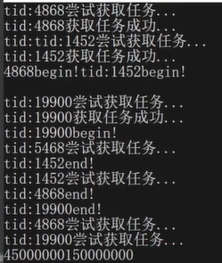
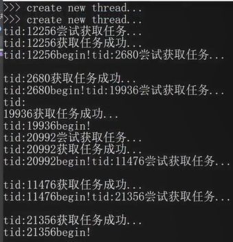
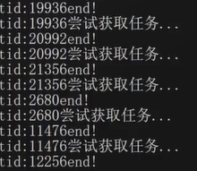
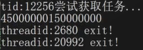

# 知识储备
## 并发和并行

* 并发

单核上，CPU时间片轮转，多个线程轮流执行。物理上是串行执行的，但是由于每个线程占用的CPU时间片非常短（比如10ms），宏观上看就像是多个线程在共同执行，这样的场景称作并发(concurrent)。

* 并行

在多核或者多CPU上，多个线程在同一时刻执行，这样的场景才是真正的并行(parallel)。
## 两种密集型程序

多线程程序一定好吗？不一定，要看具体的应用场景。
* IO密集型：程序里面指令的执行，涉及IO操作较多，比如设备、文件、网络操作（等待客户端的连接），可能会把程序阻塞。如果CPU时间片再分配给这种线程，相当于浪费了CPU资源。
* CPU密集型：程序里面的指令都是做计算用的，不会阻塞。
---
* 多核情况下
    1. IO密集型和CPU密集型虽然对并行计算有不同的需求，IO密集型更适合设计成多线程程序。但是在多核情况下两种密集型程序都是有必要用多线程来处理的。
    2. 线程进行调度时，内核中有这样两个队列：runnable，就绪的或正在调度的队列。如果因IO操作有线程阻塞了，则将会进入阻塞队列，blocking queue。
* 单核情况下
    1. IO密集型的程序依然适合设计为多线程程序。
    2. CPU密集型程序不再适合！这就相当于只有一个计算器，却让多个人分段算。线程的调度有额外的花费：线程的上下文切换。CPU寄存器信息会保存在线程栈上，下次还要再恢复到CPU中，实属麻烦。
## 线程的代价

为了完成任务，创建很多线程可以吗？线程越多越好吗？
* 线程的创建和销毁都是非常“重”的操作，需要进入内核态。在执行任务的过程中，没有集中资源去干正事，而是去花费很大力度创建/销毁？
    * 需要给线程创建`PCB(task_struct)`、线程的内核栈、页目录、页表
    * 描述地址空间相应的数据结构：`vm_area_struct`
    * 内核创建完后，还要返回用户态
    * 线程执行完业务，还要销毁线程，又要切换一次
* 线程栈本身占用大量内存，每一个线程都需要线程栈，栈几乎都被占用完了，还怎么做事情？
    * 32位地址空间，共4G，用户空间有3G。
    * 线程共享进程的地址空间。
    * 可在linux下执行`ulimt -a`命令观察stack size默认栈大小，为8192字节即8M。
    * $3*1024M=3072M, 3072M/8M=384$个。这说明32位环境下，最多创建384个线程。
* 线程的上下文切换要占用大量时间
    * 线程过多，线程的调度是需要进行上下文切换的，上下文切换花费CPU时间也特别多，CPU的利用率就不高了。
* 大量线程同时唤醒会使系统经常出现锯齿状负载或者瞬间负载量很大导致宕机
    * 如果在某一时刻，大量的IO操作准备好了，那么一时间线程是来不及处理的。
# 线程同步
## 线程互斥

某段代码能不能多线程环境下执行？看这段代码是否存在**竞态条件**，即有无临界区代码段。（代码片段在多线程环境下执行，随着线程的调度顺序不同而得到不同的执行结果）。如果有，则要通过线程同步来保证它的原子操作。

如果在多线程环境下不存在竞态条件，则称之为**可重入的**。
### 互斥锁
* lock
* `try_lock`
* `lock_guard`
* `unique_lock`
### atomic原子类型
* CAS操作（无锁机制）
    * 无锁队列、无锁链表、无锁数组
    * 实际上使用的是轻量级、效率高的锁，不是没用锁。
## 线程通信

[GDB调试C++11多线程死锁](https://blog.csdn.net/QIANGWEIYUAN/article/details/88792621)
### 条件变量
### 信号量
看作资源计数没有限制的mutex互斥锁。mutex互斥锁的资源计数只能是0或者1。
### 区别
* 二元信号量和互斥锁的区别
    * mutex只能是哪个线程获取锁，由哪个线程释放锁。
    * `sem.wait()`和`sem.post()`则可以处在不同的线程中调用。
# 线程池
线程池的优势：

服务进程启动之初，事先创建好线程池里面的线程，当业务到来需要分配线程时直接从线程池中获取一个空闲线程执行task任务即可，task执行完成之后把线程归还到线程池中继续给后续task提供服务，而不用释放线程。
## 项目介绍

本项目所实现的线程池和对象池、内存池、STL库的意义一样，只能称作一个库，而不能作为一个独立运行的中间件，必须镶嵌在应用程序中。最终项目表现形式为一种提供给他人的**动态库**，比如用到了`mysql.h`头文件，`libmysqlclient.so`动态库。动态库需要编译出来。
### 使用方式

* 启动线程池

如果你想在应用程序中或者代码中使用本项目的线程池，你可以

1. 直接`ThreadPool pool;`定义一个`pool`对象；
2. 而后则可以调用`pool.sexMode(fixed(default) | cached);`接口设置线程池的运行模式，默认为固定模式。
3. 然后`pool.start();`启动线程池。start不会阻塞。

启动线程池意味着线程池开始创建若干线程，就绪，等待任务过来执行任务。

* 提交任务

调用方只要按以下形式调用API即可：`Result result = pool.submitTask(concreteTask);`

调用方无需关心内部操作，包括线程分配、执行过程。

有时调用方需要获取任务执行的结果，可用`T res = result.get().Cast<T>();`获得任务结果。任务结果的返回值是任意类型，具体类型T由用户指出。（此处用到了C++17中的Any类型）

# 线程池的设计

## 类成员

首先说一说抽象出的类：线程池类、线程池中的线程类。

1. 既然是线程池，就要有一个**存放线程的容器**
   1. 我们最好能实时监控线程池中线程的数量、以及上限阈值，避免线程数量走向极端从而影响性能（线程数量不是越多越好，坏处：1、线程栈空间冗余；2、上下文切换过程时间多于执行操作）
2. 还要有一个存放待完成任务的容器，即**任务队列**
   1. 考不考虑线程安全问题？必须考虑，外层用户提交任务要放数据，下层线程执行任务要取数据。
   2. 任务不能堆积过多。对于任务队列，也要有一个上限阈值。

## 通用化的实现 - Task设计 - 继承多态思想

任务类型需要达到通用性，所以要用到继承、多态的思想。用基类指针可以指向各种各样的派生类对象。

所以需要**设计一个抽象类Task。内部提供一个纯虚函数`virtual void run() = 0`**。如果要设计特定的任务，则继承（实现）之，重写run函数即可。

## 线程通信的保证 - mtx+cv

因为涉及到放任务、取任务，所以很明显是个生产者消费者模型。

必然**用到互斥锁+条件变量，从而对任务队列进行互斥保护**、达到正确的线程通信。

## 线程池的模式

* fixed模式
    * 线程池里面的线程个数是固定不变的，一般是ThreadPool创建时根据当前机器的CPU核心数量进行指定。
* cached模式
    * 线程池里面的线程个数是可动态增长的，根据任务的数量动态地增加线程的数量，但是会设置一个线程数量的阈值。任务处理完成后，如果动态增长的线程空闲60s而没有其他任务待处理，那么就关闭线程，保持池中线程的最初数量。
### 代码形式
```cpp
int main()
{
	ThreadPool pool;
    pool.setMode(fixed(default) | cached);
    pool.start();
}
```
### 提交任务API
```cpp
Result result = pool.submitTask(concreteTask);
result.get().Cast<T>();
```

# 线程池类（ThreadPool）
线程池，不光要管理线程，而且要集成一个任务队列。要对外提供提交任务的接口。

其中的线程去取任务，做，然后返回任务结果。（这是线程类里的事情）

管理的线程，用 vector 管理。
管理的任务，用 queue 管理。任务队列要保证线程安全。

```cpp
enum class PoolMode
{
    MODE_FIXED,     // 固定数量的线程
    MODE_CACHED,    // 线程数量可动态增长
};
class ThreadPool
{
public:
    ThreadPool();
    ~ThreadPool();
    /* 设置线程池的工作模式 */
    void setMode(PoolMode mode);
    /* 设置初始的线程数量 */
    void setInitThreadSize(int size);
    /* 设置task队列任务数量最大阈值 */
    void setTaskQueMaxThreshHold(int threshHold);
    /* 启动线程池 */
    void start();
    /* 给线程池提交任务 */
    void submitTask(std::shared_ptr<Task> task);
private:
    PoolMode m_poolMode;                //当前线程池工作模式
    std::vector<Thread*> m_threads;     //线程列表
    int m_initThreadSize;               //初始的线程数量
    /**
     * 任务队列容器。
     * 特别要注意，需要用 shared_ptr 强引用用户传来的 task ，
     * 以保证任务对象的生命期。
     */
    std::queue<std::shared_ptr<Task>> m_taskQueue;
    /* 目前任务队列中的任务数量 */
    std::atomic_int m_taskNum;
    /* 任务队列最大上限阈值 */
    int m_taskQueMaxThreshHold;
    /* 保护安全地操作任务队列 */
    std::mutex m_taskQueMtx;
    /* 表示任务队列不满 */
    std::condition_variable m_taskQueNotFull;
    /* 表示任务队列不空 */
    std::condition_variable m_taskQueNotEmpty;
private:
    ThreadPool(const ThreadPool &) = delete;
    ThreadPool& operator=(const ThreadPool &) = delete;
};
```
## ThreadPool构造、析构
```cpp
/* 线程池构造 */
ThreadPool::ThreadPool()
   : m_initThreadSize(4),
     m_taskNum(0),
     m_taskQueMaxThreshHold(TASK_MAX_THRESHHOLD),
     m_poolMode(PoolMode::MODE_FIXED)
{

}
ThreadPool::~ThreadPool()
{

}
```
## 设置参数
```cpp
/* 设置线程池的工作模式 */
void ThreadPool::setMode(PoolMode mode)
{
   m_poolMode = mode;
}
/* 设置初始的线程数量 */
void ThreadPool::setInitThreadSize(int size)
{
   m_initThreadSize = size;
}
/* 设置task队列任务数量最大阈值 */
void ThreadPool::setTaskQueMaxThreshHold(int threshHold)
{
   m_taskQueMaxThreshHold = threshHold;
}
```
## 启动线程池
```cpp
/* 启动线程池 */
void ThreadPool::start(int initThreadSize);
```
## 给线程池提交任务
```cpp
/* 给线程池提交任务 */
void ThreadPool::submitTask(std::shared_ptr<Task> task);
```

# Thread类
## 线程函数定义在哪个位置呢？
* 思考：线程函数定义在哪个位置呢？
    * 如果写在Thread类中，那么定义在 ThreadPool 的变量则不容易被函数所访问。
    * 定义为全局函数呢？线程池里的变量都是私有的，也不易访问。
    * 结论：OOP的手法，写在ThreadPool中。

```cpp
/* threadpool.h */
class ThreadPool
{
private:
  /* 定义线程函数 */
  void threadFunc();
};
```
## 怎么把线程函数扔给Thread对象
* 线程对象是在线程池里构建的，线程启动执行也是在线程池里做的，
* 那么创建 thread 线程对象时需要把线程函数给到 thread 线程对象。怎么把函数扔给对象？怎么解决这个技术问题？
    * 引入`<functional>`，用`std::bind()`把函数对象绑定。在线程池 start 时，构造 thread 时传入

```cpp
void ThreadPool::start(int initThreadSize)
{
    m_initThreadSize = initThreadSize;
    for(int i = 0; i < m_initThreadSize; ++i)
    {
        m_threads.emplace_back(
            new Thread(std::bind(&ThreadPool::threadFunc, this))
        );
    }
    for(int i = 0; i < m_initThreadSize; ++i)
    {
        m_threads[i]->start();
    }
}
```
## 头文件
由上述 Thread 类构造时对函数对象的处理，可以得到 Thread 类的大致属性需求、构造参数。

```cpp
class Thread
{
public:
    /* 线程函数对象类型别名 */
    using ThreadFunc = std::function<void()>;
    Thread(ThreadFunc func);
    ~Thread();
    void start();
private:
    ThreadFunc m_func;
};
```
## start 函数（创建线程后，分离线程）
* start 函数 - 启动线程，创建一个线程来执行一个线程函数
    * 需要注意：出了start函数作用域之后线程对象会析构，但是线程函数不能消失，他还要去消费任务队列上的任务。**所以线程对象需要设置为分离线程，否则程序会挂掉**。
    * 分离的效果就是：**线程对象**和它所**启动的线程（实质的线程**）分离开了。独立存在，互不关心对方的生命期。

```cpp
/* threadpool.cpp */
#include<thread>
/* 启动线程 */
void Thread::start()
{
    std::thread t(m_func);	//线程对象t，线程函数m_func
    t.detach();
}
```
# 简单测试
* 简单测试，默认启动 4 个线程。启动后在不同的线程分别执行 threadFunc 函数。
    * 注意：创建的线程分离之后，执行完毕后会自动回收。但是可能存在主线程启动后看不到打印结果的情况，那是因为主线程结束地太快，导致没能看到（实际中的服务器主线程不会很快结束，而是保持）。为了看到执行结果，可以睡眠一段时间。

```cpp
void ThreadPool::threadFunc()
{
  std::cout << "begin threadFunc tid:" 
      << std::this_thread::get_id() << std::endl;
  std::cout << "end threadFunc" 
      << std::this_thread::get_id() << std::endl;
}
/* 线程池项目测试.cpp */
#include"threadpool.h"
#include<iostream>
#include<chrono>
#include<thread>
int main()
{
    ThreadPool pool;
    pool.start();
    std::this_thread::sleep_for(std::chrono::seconds(5));
}
```

# 智能指针解决避免手动释放

```cpp
void ThreadPool::start(int initThreadSize)
{
    m_initThreadSize = initThreadSize;
    for(int i = 0; i < m_initThreadSize; ++i)
    {
        auto ptr = std::make_unique<Thread>(
            std::bind(&ThreadPool::threadFunc, this)
        );
        m_threads.emplace_back(ptr);
    }
    for(int i = 0; i < m_initThreadSize; ++i)
    {
        m_threads[i]->start();
    }
}
```

但是这样会出现编译不过的问题，为什么呢？因为报错发现`unique_ptr`的拷贝构造已经删除，这是唯一性智能指针的语义决定的。而移动构造没有删除，意味可以用右值进行资源转移，所以我们需要在`ptr`前加`std::move`。

```cpp
        m_threads.emplace_back(std::move(ptr));
```

# submitTask

```cpp
/* 给线程池提交任务 */
void ThreadPool::submitTask(std::shared_ptr<Task> sp)
{
    /* 获取锁 */
    std::unique_lock<std::mutex> lock(m_taskQueMtx);
    /* 线程的通信，等待任务队列有空余 */
    //while(taskQue_.size() == taskQueMaxThreshHold_){ notFull_.wait(); }
    m_taskQueNotFull.wait(
        lock,
        [&]()->bool {
            return m_taskQueue.size() < m_taskQueMaxThreshHold;
        }
    );
    /* 如果有空余，把任务放到任务队列中 */
	m_taskQueue.emplace(sp);
    ++m_taskNum;
    /* 因为新放了任务，任务队列肯定不空了，通知notEmpty_上的等待线程 */
    m_taskQueNotEmpty.notify_all();
}
```

## 服务降级（`wait_for(time)`）

为了性能更加优化，我们限制用户提交任务的最长阻塞时间是`1s`，如果提交任务超过了 1s 说明目前线程池的任务队列压力比较大，防止短时间内积压很多任务，则规定为提交任务失败，返回。称为**服务降级**。

需要用到`wait`的两个延伸，`wait_for(time)`，`wait_until(endtime)`。返回值为bool值，`false`表示到时间后条件依然没满足。

以下说的是：如果等了超过 1 秒，说明满的状态已经超过了 1 秒，`wait_for`返回 `false` ，`if` 条件成立，提交失败。
```cpp
    if(!m_taskQueNotFull.wait_for(
        lock,
        std::chrono::seconds(1),
        [&]()->bool {
            return taskQue_.size() < (size_t)taskQueMaxThreshHold_;
        }))
    {
        std::cerr<<"task queue is full, submit out of time failed."<<endl;
        return;
    }
```
# ThreadFunc

```cpp
void ThreadPool::threadFunc()
{
for(;;)
{
    std::shared_ptr<Task> task;
    /* 块作用域 */
    {
        /* 先获取锁 */
        std::unique_lock<std::mutex> lock(m_taskQueMtx);
        std::cout << "tid:" << std::this_thread::get_id()
            << "尝试获取任务..." << std::endl;
        /* 等待notEmpty条件 */
        m_taskQueNotEmpty.wait(
            lock,
            [&]()->bool {
                return m_taskQueue.size() > 0;
            }
        );
        std::cout << "tid:" << std::this_thread::get_id()
            << "获取任务成功..." << std::endl;
        /* 从任务队列中取一个任务出来 */
        task = m_taskQueue.front();
        m_taskQueue.pop();
        --m_taskNum;
        /* 如果有剩余任务，继续通知其他线程来取任务 */
        if (m_taskQueue.size() > 0)
        {
            m_taskQueNotEmpty.notify_all();
        }
        /* 取出了一个任务，任务队列此时肯定不满了，对等待提交任务的人进行通知 */
        m_taskQueNotFull.notify_one();
    }
    /* 当前线程负责执行这个任务, 没必要拥有锁, 脱离块作用域, 释放锁 */
    if(task != nullptr)
        task->run();
}
}
```

# 测试1

```cpp
class MyTask : public Task
{
public:
    void run()
    {
        std::cout << "tid:" << std::this_thread::get_id()
            << "begin!" << std::endl;
        
        std::this_thread::sleep_for(std::chrono::seconds(2));
        
    	std::cout << "tid:" << std::this_thread::get_id()
            << "end!" << std::endl;
    }
};
-------------------------------------------------------------------
test example:
/* 以下为提交3个任务，预估结果为3个线程获取任务成功，1个没有获取到，一直阻塞 */
int main()
{
    ThreadPool pool;
	pool.start(4);
	pool.submitTask(std::make_shared<MyTask>());
	pool.submitTask(std::make_shared<MyTask>());
	pool.submitTask(std::make_shared<MyTask>());
    getchar();
}
/* 若4个线程，提交5个任务，则最先完成并抢到锁的线程能再次获得第5个任务 */
/* 若4个线程，提交10个任务，并把队列容量设为4，则可能有2个任务提交失败 */
```

# 线程执行的返回值（future和packaged_task的实现原理）

比如，计算1到30000的和。线程1计算1到10000，2计算10001到20000，3计算20001到30000。
主线程给每一个线程分配计算的区间，并等待他们算完之后返回结果，合并最终的结果即可。
但是，怎么能拿到线程的返回值呢？

```cpp
class MyTask : public Task
{
public:
    MyTask(int begin, int end)
    	: begin_(begin), end_(end)
    {
        
    }
    void run()
    {
        std::cout << "tid:" << std::this_thread::get_id()
            << "begin!" << std::endl;
        int sum = 0;
        for(int i = begin_; i <= end_; ++i)
        {
            sum += i;
        }
        
    	std::cout << "tid:" << std::this_thread::get_id()
            << "end!" << std::endl;
        
        return sum;
    }
};
```

* 问题1：怎么设计run函数的返回值，可以表示任意的类型？
* 问题2：如何设计这里的Result机制？

```cpp
Result res1 = pool.submitTask(std::make_shared<MyTask>(1, 10000));
Result res2 = pool.submitTask(std::make_shared<MyTask>(10001, 20000));
Result res3 = pool.submitTask(std::make_shared<MyTask>(20001, 30000));
res1.get();
res2.get();
res3.get();
```


## Any类型 - 按需返回具体类型

```cpp
class Any
{
public:
    Any() = default;
    ~Any() = default;
    Any(const Any&) = delete;
    Any& operator=(const Any&) = delete;
    Any(Any &&) = default;
    Any& operator=(Any &&) = default;
    
    /* 这个构造函数可以让 Any 类型接收任意其他的数据 */
    template<typename T>
    Any(T data) : base_(std::make_unique<Derived<T>>(data))
    {}
    /* 这个方法能把 Any 对象里面存储的 data 数据提取出来 */
    template<typename T>
    T cast_()
    {
        // base_ 是定义在 Any 类中的一个 std::unique_ptr<Base>
        // get() 可以获得 其实际指针
        Derive<T>* pd = dynamic_cast<Derive<T>*>(base_.get());
        if(pd == nullptr)
        {
            throw "type is unmatch!";
        }
        return pd->data_;
    }
private:
    class Base
    {
    public:
        virtual ~Base() = default;
    };
    
    template<typename T>
    class Derived : public Base
    {
    public:
        Derived(T data) : data_(data)
        {}
    private:
        // 实际的 data 存在 Derived 类中。
        T data_;
    };
    
private:
    /* 定义一个基类的指针 */
    std::unique_ptr<Base> base_;
};
int main()
{
    ThreadPool pool;
    pool.start(4);
    
    Result res = pool.submitTask(std::make_shared<MyTask>(1, 10000));
    int sum = res.get().cast_<int>();
}
```
如此一来：
res调用get，等待 task 执行完毕，`get()`就能返回一个`Any`。这个 `Any` 的模板参数指明了里面存放的数据是 `int` 型， `Any` 对象调用其 `cast_`， 取出了里面存放的数据。（通过`dynamic_cast<Derive<int>*>`）如果类型不匹配，则抛出异常。

## 自实现信号量类

```cpp
class Semaphore
{
public:
    Semaphore(int limit = 0)
        : resLimit_(limit)
    {
    }
    ~Semaphore() = default;
    /* 获取一个信号量资源 */
    void wait()
    {
        std::unique_lock<std::mutex> lock(mtx_);
        /* 等待信号量有资源，没有资源的话，阻塞当前线程 */
        cond_.wait(lock, [&]()->bool {return resLimit_ > 0;});
        --resLimit_;
    }
    /* 增加一个信号量资源 */
    void post()
    {
        std::unique_lock<std::mutex> lock(mtx_);
        ++resLimit_;
        cond_.notify_one();
    }
private:
    // 信号量目前拥有的资源数
    int resLimit_;
    std::mutex mtx_;
    std::condition_variable cond_;
};
```

## Result设计
先分析一下局势：
1. Task里面肯定有结果
2. 外部有一个Result要接收结果
3. Task里面的结果怎么巧妙地转移到Result上面？
4. 其实Task不用专门有一个Any成员变量保存。
5. 可以直接在Task中保存一个Result指针。
6. 外部Result也绑定一个Task作为成员对象。为了让Task延长生命期，Result需要用`shared_ptr<Task>`构造。
7. `Result`构造函数中，只需要执行：`task_->setResult(this);`，便可以移花接木，把Task成员变量`result_`指向外部的Result。
8. 这样，Task内部，run完之后，返回了Any，Task便可以主动调用`result_->setVal(run())`。把结果写回外部的Result内部。

submitTask接口返回类型需要让用户能接收到线程任务的返回值，并且要求可以是任意类型，所以改为Result。相应的，我们需要设计这样的Result类型。
* 思考，return时用下面哪种方式？
    * `task->getResult();`还是`Result(task);`？
    * 要执行的task从队列中`taskQue_.pop()`，接着调用完毕后Task就会析构（注意，submitTask传入的是shared_ptr，引用计数减1，如果此时没有其他人引用该Task，将会析构，里面的any存储的结果就失效了），即task生命期现在只存在于`threadFuc`函数中。
    * 如果是`task->getResult();`
        * 若task中的Result是以值形式存的，则肯定不行，因为task析构之后，Result也会析构。
        * 若task中的Result是以指针形式存的，则必须指定到一个外部资源保存。比如存到堆上。
            * 如果是在堆上保存，还必须提供一个getResult接口，返回Result的指针，即`result_`成员变量。这样，可以做到把Result安全地保存下来。
    * 但是，可以以更为巧妙的方式！`Result(task);`
        * Result绑定了这个task（用shared智能指针管理，让task对象的生命期延至和Result对等），在Result的构造函数中，调用`task->setResult(this);`！！！居然巧妙地把“外部资源地址”指向了外部待接收结果的Result自己！避免了堆上建立的烦恼。

```cpp
class ThreadPool
{
/*			...			*/
public:
    Result submitTask(std::shared_ptr<Task> sp);
/*			...			*/
};
--------------------------
Result ThreadPool::submitTask(std::shared_ptr<Task> sp)
{
/*			...			*/
	if(...)
    {
        ...
/*		思考，return时用下面哪种方式？	*/
/*      return task->getResult();	 */
        // 此时是提交任务失败的返回
        return Result(task);
    }

/*			...			*/

/*	思考，return时用下面哪种方式？	*/
/*  return task->getResult();	 */
    // 此时是提交任务成功后的返回
    return Result(task);
}
```

经过上面的讨论，Result类成员里需要绑定一个Task对象。即下面的`task_`。下面是Result成员和其构造。

```cpp
/* 实现接收提交到线程池的task任务执行完成后的返回值类型Result */
class Result
{
public:
    Result(std::shared_ptr<Task> task, bool isValid = true);
    ~Result() = default;
private:
    /* 存储任务的返回值 */
    Any any_;
    /* 线程通信信号量 */
    Semaphore sem_;
    /* 指向对应获取返回值的任务对象 */
    std::shared_ptr<Task> task_;
    /* 任务执行是否有效/成功 */
    std::atomic_bool isValid_;
}
------------------
//threadpool.cpp
Result::Result(std::shared_ptr<Task> task, bool isValid)
    : isValid_(isValid), task_(task)
{
}

```
### 成员函数
* 问题1：setVal函数，获取任务执行完的返回值，记录在any成员。
* 问题2：get函数，用户调用这个方法获取task的返回值（没执行完需要阻塞）

```cpp
class Result
{
public:
    void setVal(Any any);
    Any get();
private:
    Any any_;
    Semaphore sem_;
    std::shared_ptr<Task> task_;
    std::atomic_bool isValid_;
};
-------------
/* 	用户调用的 */
Any Result::get()
{
    if(!isValid_)
    {
        return "";
    }
    /* 阻塞用户的线程直到task通知其执行完毕 */
    sem_.wait();
    return std::move(any_);
}
/* 谁调用？答案是 Task 的 run 结束之后，通过Result * result_ 间接调用次函数，通知 get() 唤醒拿结果 */
void Result::setVal(Any any)
{
    /* 存储task的返回值 */
    this->any_ = std::move(any);
    sem_.post();
}
```
## Task增加方法，把结果写入Result

思想：在threadFun函数中，不仅要靠task对象Task类中的run方法执行具体哪种任务，还要把任务的返回值给到result，可以用exec来封装，exec没有多态，run有多态。

```cpp
void Task::exec()
{
    if(result_ != nullptr)
    {
        // run()结束之后，setVal才能被调用成功，此时影响到了 result_ 中保存的信号量 +1，因此 外部的result.get()不再阻塞
	    result_->setVal(run());	//如此可知，task中需要封装一个result对象。
    }
}
----------------
class Task
{
public:
    Task();
    ~Task() = default;
	void exec();
    void setResult(Result *res);
    virtual Any run() = 0;
private:
/*	没必要用shared智能指针，否则就会出现：Result中有shared_ptr<Task>，Task中有shared_ptr<Result>。循环引用，无法释放！*/
    Result *result_;	//result对象的生命周期长于task，不怕。
};
----------------
void Task::setResult(Result *res)
{
    result_ = res;
}
Task::Task()
    : result_(nullptr)
{       
}
----------------
/* 谁调用setResult？此 Result 不是 Result 里的 val ， 而是保存 Val 的一个地方，不要搞混了 */
// 外部可以通过 task 来 指定 Result 要保存到哪个地方。
// 比如可以传入 外部 Result 的 this 指针；也可以 new 一个 Result 在 堆上，set 到堆上地址
// 如果 Result 绑定了一个 task 就可以 通过这个 task 设置 Result 为 自己（this）
Result::Result(std::std::shared_ptr<Task> task, bool isValid)
	: isValid_(isValid), task_(task)
{
    task_->setResult(this);
}
```

## 测试2（Master - Slave模型）

Master - Slave模型，Master线程用来分解任务，然后给各个Slave线程分配任务，等待各个Slave线程执行完任务，返回结果。最后Master线程合并各个任务结果，输出。

```cpp
class MyTask : public Task
{
public:
    MyTask(int begin, int end)
    	: begin_(begin), end_(end)
    {
    }
	Any run()
    {
        std::cout << "tid:" << std::this_thread::get_id()
            << "begin!" << std::endl;
        uLong sum = 0;
        for(uLong i = begin_; i <= end_; ++i)
            sum += i;
        std::cout << "tid:" << std::this_thread::get_id()
            << "end!" << std::endl;
        return sum;
    }
};
using uLong = unsigned long long;
int main()
{
    ThreadPool pool;
    pool.start(4);
    Result res1 = pool.submitTask(std::make_shared<MyTask>(1, 100000000));
    Result res2 = pool.submitTask(std::make_shared<MyTask>(100000001, 200000000));
    Result res3 = pool.submitTask(std::make_shared<MyTask>(200000001, 300000000));
    uLong sum1 = res1.get().cast_<uLong>();
    uLong sum2 = res2.get().cast_<uLong>();
    uLong sum3 = res3.get().cast_<uLong>();
    cout << sum1 + sum2 + sum3 << endl;
}
```

测试结果：



# cached模式线程池

主要的使用点：submitTask函数中，可能需要根据任务数量和空闲线程的数量，判断是否需要创建新的线程。
* 需要处理的问题
    * 问题1，用户自己如何设置线程池的工作模式
    * 问题2，submitTask函数中，根据任务数量和空闲线程的数量，判断是否需要创建新的线程
    * 问题3，threadFunc函数中，有可能已经创建了很多的线程，如果空闲时间超过60s，需要结束、回收。

```cpp
int main()
{
    ThreadPool pool;
    /* 用户自己设置线程池的工作模式 */
    pool.setMode(PoolMode::MODE_CACHED);
    /* 开始启动线程池 */
    pool.start(4);
}
```

## 切换工作模式

为了防止用户在线程池启动后再去切换线程池的工作模式，我们需要给线程池添加一个状态变量，以控制用户能否对线程池的工作模式进行切换。

```cpp
class ThreadPool
{
public:
/*			...			*/
private:
/*			...			*/
    /* 检查pool的运行状态 */
    bool checkRunningState() const;
private:
/*			...			*/
    
    /* 表示当前线程池的启动 */
    std::atomic_bool isPoolRunning_;
};
-------------------------------------------
ThreadPool::ThreadPool()
	: initThreadSize_(0),
	  taskSize_(0),
	  taskQueMaxThreshHold_(TASK_MAX_THRESHHOLD),
	  poolMode_(PoolMode::MODE_FIXED),
	  isPoolRunning_(false)
{
}
void ThreadPool::start(int initThreadSize)
{
    /* 设置线程池的状态为运行态 */
    isPoolRunning_ = true;
    
/*			...			*/
}
bool ThreadPool::checkRunningState() const
{
    return isPoolRunning_;
}
------------------------------------------
void ThreadPool::setMode(PoolMode mode)
{
    if(checkRunningState())
        return;
    poolMode_ = mode;
}
```

## 创建更多线程

cached模式：任务处理比较紧急，场景是小而快的任务。

ThreadPool需要添加记录一个空闲线程数量的变量。

```cpp
class ThreadPool
{
public:
/*			...			*/
private:
/*			...			*/
private:
/*			...			*/

    /* 记录空闲线程的数量 */
    std::atomic_int idleThreadSize_;
}
-------------------------------------------
ThreadPool::ThreadPool()
	: initThreadSize_(0),
	  taskSize_(0),
	  idleThreadSize_(0),
	  taskQueMaxThreshHold_(TASK_MAX_THRESHHOLD),
	  poolMode_(PoolMode::MODE_FIXED),
	  isPoolRunning_(false)
{
}
/* 空闲线程数量需要加1 */
void ThreadPool::start(int initThreadSize)
{
/*			...			*/
    /* 每启动一个线程就给idleThreadSize_加1，表示多了一个空闲线程 */
    for(int i = 0; i < initThreadSize_; ++i)
    {
        threads_[i]->start();
        ++idleThreadSize_;
    }
}
/* 空闲线程数量需要减1 */
void ThreadPool::threadFunc()
{
    for(;;)
    {
    /*			...			*/
        std::shared_ptr<Task> task;
        {
            notEmpty_.wait(lock, [&]()->bool {return taskQue_.size()>0;});
            --idleThreadSize_;
        }
    /*			...			*/
    	notFull_.notify_all();
    }
    if(task != nullptr) task -> exec();
    ++idleThreadSize_;
}
```

现在来增加 submitTask 函数对 cached 模式处理的细节。
有一点要注意，就是尽管任务非常多，但是我们要对线程的数量设一定的上限值。
即需要给 ThreadPool 类增加一个线程数量阈值变量。

然后为了比较线程池当前线程的数量状况，也要添加一个记录线程总数量的变量。

```cpp
const int THREAD_MAX_THRESHHOLD = 10;
class ThreadPool
{
public:
/*			...			*/
    /* 设置线程池cached模式下的线程阈值 */
    void setThreadSizeThreshHold(int threshhold);
/*			...			*/
private:
/*			...			*/
private:
/*			...			*/
    /* 线程数量上限阈值 */
    int threadSizeThreshHold_;
    /* 记录当前线程池里面线程的总数量 */
    std::atomic_int curThreadSize_;
/*			...			*/
};
ThreadPool::ThreadPool()
	: initThreadSize_(0),
	  taskSize_(0),
	  idleThreadSize_(0),
	  curThreadSize_(0),
	  taskQueMaxThreshHold_(TASK_MAX_THRESHHOLD),
	  threadSizeThreshHold_(THREAD_MAX_THRESHHOLD),
	  poolMode_(PoolMode::MODE_FIXED),
	  isPoolRunning_(false)
{
}
void ThreadPool::start(int initThreadSize)
{
/*			...			*/
    /* 记录初始线程个数 */
    initThreadSize_ = initThreadSize;
    curThreadSize_ = initThreadSize;
    /* 创建线程对象 */
/*			...			*/
    /* 启动所有线程 */
/*			...			*/
}
void ThreadPool::setThreadSizeThreshHold(int threshhold)
{
    if(checkRunningState() || poolMode_==PoolMode::MODE_FIXED)
        return;
    threadSizeThreshHold_ = threshhold;
}
-------------------------------------------------------
/* 关注三个状态：
 * 1.线程池的工作模式是否是cached；
 * 2.任务数量是否已经大于空闲线程数量；
 * 3.线程总数量是否没有超过线程数量上限；
 */
Result ThreadPool::submitTask(std::shared_ptr<Task> sp)
{
/*			...			*/
    if(poolMode_ == PoolMode::MODE_CACHED
      && taskSize_ > idleThreadSize_
      && curThreadSize_ < threadSizeThreshHold_)
    {
        /* 创建新线程 */
        auto ptr = std::make_unique<Thread>(std::bind(&ThreadPool::threadFunc, this));
        threads_.emplace_back(std::move(ptr));
        threads_[threadId]->start();	//启动线程
        /* 修改线程个数相关的变量 */
        ++curThreadSize_;
        ++idleThreadSize_;
    }
    
    return Result(sp);
}
```

## 任务处理完毕，回收多余线程

超过`initThreadSize_`数量的线程要进行回收。

**当前时间 比 上一次线程执行完毕的时间** 大于 60s 后回收。

> `C++11`中提供了高精度时间API - `std::chrono::high_resolution_clock().now()`;

```cpp
const int THREAD_IDLE_TIME = 60;	//单位s
void ThreadPool::threadFunc(int threadid)
{
    /* 上一次线程执行完任务的时间 */
    auto lastTime = std::chrono::high_resolution_clock().now();
    for(;;)
    {
    	Task task;
        {
            std::unique_lock<std::mutex> lock(taskQueMtx_);
            std::cout << "tid: " << std::this_thread::get_id()
                << "尝试获取任务..." << std::endl;
                
            // cached模式下，有可能已经创建了很多的线程，但是空闲时间超过60s，应该把多余的线程
            // 结束回收掉（超过initThreadSize_数量的线程要进行回收）
            // 当前时间 - 上一次线程执行的时间 > 60s

            // 每一秒中返回一次   怎么区分：超时返回？还是有任务待执行返回
            // 锁 + 双重判断
            while (taskQueue_.size() == 0)
            {
                // 线程池要结束，回收线程资源
                if (!isPoolRunning_)
                {
                    threads_.erase(threadid);
                    std::cout << "threadid: " << std::this_thread::get_id() << " exit!"
                        << std::endl;
                    exitCond_.notify_all();
                    return;
                }
                
                if (poolMode_ == PoolMode::MODE_CACHED)
                {
                    //while(taskQue_.size() > 0) // 不再去判断 taskQue_.size() > 0，即使size是0，也一直等待60s
                    //{
                    
                    /* 超时 1s 返回 */
                    if(std::cv_status::timeout ==
                       notEmpty_.wait_for(lock, std::chrono::seconds(1)))
                    {
                        auto now = std::chrono::high_resolution_clock().now(); //返回的是time_point类型
                        auto dur = std::chrono::duration_cast<std::chrono::seconds>(now - lastTime);
                        if(dur.count() >= THREAD_MAX_IDLE_TIME
                          && curThreadSize_ > initThreadSize_)
                        {
                            /* 开始回收当前线程 */
                            /* 修改记录线程数量的相关变量 */
                            /* 把线程从线程列表容器中删除 */
                            /* 问题：怎么知道线程函数对应的是线程列表容器中的哪一个线程对象 */
                            /* 我们需要有一个映射关系来记录：threadid => thread对象 => 删除 */
                            thread_.erase(threadid);
                            --curThreadSize_;
                            --idleThreadSize_;
                            std::cout << "threadid: " << std::this_thread::get_id() << " exit!"
                                << std::endl;
                            return;
                        }
                    } 
                    //} // while(taskQue_.size() > 0) 结束
                } 
                else // poolMode_ != PoolMode::MODE_CACHED
                {
                    notEmpty_.wait(lock /* , [&]()->bool { return taskQue_.size() > 0; } */);
                }
            } // end while (taskQueue_.size() == 0)

            // 此时 taskQueue_.size() != 0 而 我们又拿到了 任务队列的锁，可以直接取走任务
            --idleThreadSize_;
            std::cout << "tid: " << std::this_thread::get_id()
                << "获取任务成功..." << std::endl;
            task = taskQue_.front();
            taskQue_.pop();
            --taskSize_;

            if (taskQue_.size() > 0)
            {
                notEmpty_.notify_all();
            }

            notFull_.notify_all();
        } // end std::unique_lock<std::mutex> lock(taskQueMtx_);
        if(task != nullptr)
        {
            task();
        }
        ++idleThreadSize_;
        /* 线程执行完任务后更新lastTime */
        lastTime = std::chrono::high_resolution_clock().now();
    }
}
```

## 问题：怎么知道线程函数对应的是线程列表容器中的哪一个线程对象？

我们需要有一个映射关系来记录：`threadid - thread对象`
```cpp
    std::unordered_map<int, std::unique_ptr<Thread>> threads_;
```

所以，Thread对象需要封装一个id值。
然后，在线程函数`threadFunc`传入`int threadid`参数。
这样，该 id 的Thread在线程函数中计时自己的空闲时间，若连续 wait 了 60s（每wait一次1s超时返回），说明任务过少，空闲线程过多。
只有知道了 id 号，才能让 ThreadPool 记录的 线程map 精确地删除。

```cpp
class Thread
{
public:
    using ThreadFunc = std::function<void()>;
    Thread(ThreadFunc func);
    ~Thread();
    void start();
    /* 启动线程 */
    int getId() const;
private:
    ThreadFunc func_;
    // 这是属于 Thread类 共享的计数器。表示曾经已生成了多少个线程对象
    static int generateId;
    // 当前Thread 对象的ID
    int threadId_;
}
----------------------------------------------
int Thread::generateId_ = 0;
Thread::Thread(ThreadFunc func)
	: func_(func), threadId(++generateId_)
{
    
}
int Thread::getId() const
{
    return threadId_;
}
```

然后，最大的变化来了，把原先的线程列表的vector容器变成了unordered\_map。
```cpp
class ThreadPool
{
// ...
private:
    std::unordered_map<int, std::unique_ptr<Thread>> threads_; // 线程列表
// ...
};
```

因此，在 start 启动线程池的操作中，生成线程的动作就要有所变化

要预留一个占位符`_1`，这是给线程函数的传入参数的位置，`threadid`。

```cpp
// 开启线程池
void ThreadPool::start(int initThreadSize = std::thread::hardware_concurrency())
{
    // 设置线程池的运行状态
    isPoolRunning_ = true;

    // 记录初始线程个数
    initThreadSize_ = initThreadSize;
    curThreadSize_ = initThreadSize;

    // 创建线程对象
    for (int i = 0; i < initThreadSize_; i++)
    {
        // 创建thread线程对象的时候，把线程函数给到thread线程对象
        auto ptr = std::make_unique<Thread>(std::bind(&ThreadPool::threadFunc, this, std::placeholders::_1));
        int threadId = ptr->getId();
        threads_.emplace(threadId, std::move(ptr));
        // threads_.emplace_back(std::move(ptr));
    }

    // 启动所有线程  std::vector<Thread*> threads_;
    for (int i = 0; i < initThreadSize_; i++)
    {
        threads_[i]->start(); // 需要去执行一个线程函数
        idleThreadSize_++;    // 记录初始空闲线程的数量
    }
}
```
## 改为无序哈希表存储id、Thread对象映射关系，后的代码调整
### submitTask
```cpp
Result ThreadPool::submitTask(std::shared_ptr<Task> sp)
{
/*			...			*/
    if(poolMode == PoolMode::MODE_CACHED
      && taskSize_ > idleThreadSize_
      && curThreadSize_ < threadSizeThreshHold_)
    {
        auto ptr = std::make_unique<Thead>(std::bind(&ThreadPool::threadFunc, this));
        int threadId = ptr->getId();
        threads_.emplace(threadId, std::move(ptr));
        threads_[threadId]->start();
        /* 修改线程个数相关的变量 */
        ++curThreadSize_;
        ++idleThreadSize_;
    }
    return Result(sp);
}
```
### ThreadPool的`threadFunc(int threadid)`接口添加int参数

```cpp
class ThreadPool
{
public:
    ...
private:
    /* 定义线程函数，加了一个参数threadid */
    void threadFunc(int threadid);
    ...
private:
	...
}
```
### Thread中`using ThreadFunc`的`std::function<void(int)>`
```cpp
class Thread
{
public:
    /* 要和threadFunc函数参数一致 */
    using ThreadFunc = std::function<void(int)>;
}
```
### Thread的start，多传入一个`threadId_`
```cpp
void Thread::Start()
{
    std::thread t(func_, threadId_);
    t.detach();
}
```
## 测试3

```cpp
class MyTask : public Task
{
public:
    MyTask(int begin, int end)
		: begin_(begin), end_(end)
    {
    }
    Any run()
    {
        std::cout << "tid:" << std::this_thread::get_id()
            << "begin!" << std::endl;
        std::this_thread::sleep_for(std::chrono::seconds(3));
        uLong sum = 0;
        for(uLong i = begin_; i <= end_; ++i)
            sum += i;
        std::cout << "tid:" << std::this_thread::get_id()
            << "end!" << std::endl;
        return sum;
    }
};
---------------------------------------------------------------------------------------
/* 在submitTask函数中 加打印线程的相关信息 */
Result ThreadPool::submitTask(std::shared_ptr<Task> sp)
{
/*			...			*/
    if(poolMode == PoolMode::MODE_CACHED
      && taskSize_ > idleThreadSize_
      && curThreadSize_ < threadSizeThreshHold_)
    {
        std::cout << ">>> create new thread ..." << std::endl;
        auto ptr = std::make_unique<Thead>(
            std::bind(&ThreadPool::threadFunc,
                      this, std::placeholders::_1)
        );
        int threadId = ptr->getId();
        threads_.emplace(threadId, std::move(ptr));
        threads_[threadId]->start();	//启动线程
        /* 修改线程个数相关的变量 */
        ++curThreadSize_;
        ++idleThreadSize_;
    }
    return Result(sp);
}
--------------------------------------------------------------------------------------
/* 暂时修改超时时间，方便测试观察 */
const int THREAD_MAX_IDLE_TIME = 10;
void ThreadPool::threadFunc()
{
					/*			...			*/
                    	if(dur.count() >= THREAD_MAX_IDLE_TIME
                          && curThreadSize_ > initThreadSize_)
                        {
                            ...
                        }
					/*			...			*/
}
--------------------------------------------------------------------------------------
/* 默认初始四线程，六任务。
 * 每个任务都至少消耗3秒，
 * 开始时会把四个线程都占住，会创建新的线程来完成后两个任务
 * 全部任务完成后，超过10秒后，会把多余的2个线程回收。
 */
const int TASK_MAX_THRESHHOLD = INT32_MAX;
const int THREAD_MAX_THRESHHOLD = 10;
int main()
{
    {
        ThreadPool pool;
        pool.setMode(PoolMode::MODE_CACHED);
        pool.start(4);
        Result res1 = pool.submitTask(std::make_shared<MyTask>(1,100000000));			//1
        Result res2 = pool.submitTask(std::make_shared<MyTask>(100000001,200000000));	//2
        Result res3 = pool.submitTask(std::make_shared<MyTask>(200000001,300000000));	//3
        pool.submitTask(std::make_shared<MyTask>(200000001,300000000));					//4

        pool.submitTask(std::make_shared<MyTask>(200000001,300000000));					//5
        pool.submitTask(std::make_shared<MyTask>(200000001,300000000));					//6
        uLong sum1 = res1.get().cast_<uLong>();
        uLong sum2 = res2.get().cast_<uLong>();
        uLong sum3 = res3.get().cast_<uLong>();
    }
    getchar();
}
```

测试结果







## 问题：ThreadPool对象析构以后，怎么样把线程池相关的线程资源全部回收

在析构函数中，用户线程需要等待线程池线程，这是两类不同的线程，需要通过线程间通信来达到等待完成。

线程间通信可以用信号量、条件变量，都可以，我们在ThreadPool类中使用一个条件变量`exitCond_`。

```cpp
class ThreadPool
{
public:
    ...
private:
    ...
private:
    ...
    /* 等待线程资源全部回收 */
    std::condition_variable exitCond_;
    ...
}
```

在析构函数中，
1. 置`isPoolRunning_`为false，如此线程函数进去之后发现线程池要关闭了，
    1. 如果任务队列为0，则就直接退出。
    2. 如果任务队列不为0则取任务。
2. `notEmpty_.notify_all();`，最后一波唤醒，让所有线程醒来，看有没有任务，没任务就收工。
3. ThreadPool关注`exitCond_`，若有人通知了，则说明是线程陆陆续续在退出了，直到`threads_.size() == 0`，说明所有线程都退出了。这时候，线程池就可以放心析构了。

```cpp
ThreadPool::~ThreadPool()
{
    isPoolRunning_ = false;
    notEmpty_.notify_all();
    /* 等待线程池中所有的线程返回，有两种状态：阻塞/执行中 */
    std::unique_lock<std::mutex> lock(taskQueMtx_);
    exitCond_.wait(lock, [&]()->bool {return threads_.size() == 0;});
}
```

# 项目推进时遇到了什么问题？
1. 实现核心功能时的问题：如何通用地获取提交任务后的返回值，即Any，Result的设计。
2. 设计线程池资源回收的，是以...的方式实现的，测试时，有时会出现死锁的现象
## 调试方法
gdb调试，attach到正在死锁的进程，把线程栈打印出来，在哪一个函数的哪一句话不动了。

问题要素：
1、线程池要结束，要释放整个池子的资源了。
2、线程池的成员`isPoolRunning_`状态置为了`false`。

以上两个要素

1，不受线程池内的线程目前的状态而影响，线程的状态：在等待任务、在执行任务。
2，`isPoolRunning_`必将影响线程的代码路径。

`isPoolRunning_`在线程池`start`时置为`true`。

我们设计的ThreadPool不用考虑成员的析构问题，最主要的两个成员容器：
1、无序map中的线程对象是`unique_ptr`管理的。
2、queue中的任务队列是`shared_ptr`管理的。
3、其余的变量都是非指针变量。

ThreadPool析构时仅仅只是把`isPoolRunning_`置`false`就可以了吗？
当然不可以。线程池要等待线程池里面所有的线程返回。
目前线程可能在`threadFunc`函数中阻塞在`notEmpty`上，另一种是正在执行任务中。

此时就需要不同线程的通信。即用户线程和线程池中的线程之间进行通信。
用信号量、条件变量都可以。
我们用条件变量。
在ThreadPool中定义一个成员，`std::condition_variable exitCond_;` 等待线程资源全部回收

```cpp
ThreadPool::~ThreadPool()
{
    isPoolRunning_ = false;
    /* 我们暂且在这个位置 唤醒notEmpty_上的所有线程 */	//实际上，是留了一个坑
    notEmpty_.notify_all();
    
    std::unique_lock<std::mutex> lock(taskQueMtx_);
    /* 表明：要等待到threads_.size()等于0 */
    exitCond_.wait(lock, [&]()->bool {return threads_.size()==0;});
}
```

```cpp
//可能会产生死锁的情况：
int main()
{
    ThreadPool pool;
    pool.start(4);
    Result res1 = pool.submitTask(std::make_shared<MyTask>(1,10000000));
    uLong sum1 = res1.get().cast_<uLong>();
    cout << sum1 << endl;
    cout << "main over!" << endl;
}
/* 运行结果
 * tid: 9624尝试获取任务..
 * tid: 9624获取任务成功...
 * tid:tid: 1664尝试获取任务...
 * 9624begin!
 * tid: 15228尝试获取任务...
 * tid:6796尝试获取任务...
 * tid:9624end!
 * tid:9624尝试获取任务...5000000050000000
 * main over!
 * 
 * threadid:6796 exit!
 * threadid:s1664 exit!
 * threadid:15228 exit!
 *		//发现，抢到任务的线程回不来了。
 */
```

## 代码分析

```cpp
/* main函数所在的主线程，即用户创建线程池的线程 */
ThreadPool::~ThreadPool()
{
    isPoolRunning_ = false;
    notEmpty_.notify_all();
    std::unique_lock<std::mutex> lock(taskQueMtx_);
    exitCond_.wait(lock, [&]()->bool {return threads_.size()==0;});
}
/* 线程池中的每个线程的线程函数 */
void ThreadPool::threadFunc(int threadid)
{
    auto lastTime = ...;
    while(isPoolRunning_)
    {
        std::shared_ptr<Task> task;
        {
            std::unique_lock<std::mutex> lock(taskQueMtx_);		//抢锁动作
            std::cout << "tid: " << std::this_thread::get_id()
                << "尝试获取任务... " << std::endl;
            while(taskQue_.size() == 0)
            {
                if(poolMode_ == PoolMode::MODE_CACHED)
                {
                    /* timeout==wait_for的返回值 意味着等待超时了 */
                    if(std::cv_status::timeout ==
                       notEmpty_.wait_for(lock, std::chrono::seconds(1)))
                    {
                        //回收长时间空闲的线程
                        return;
                    }
                    /* 否则，说明被唤醒了，有任务了，且抢到锁了，继续往下 */
                }
                else /* 若不是cached模式，则按部就班老实等待 */
                {
                    notEmpty_.wait(lock);
                }
            }
			if(!isPoolRunning_)
            {
                threads_.erase(threadid);
                std::cout << "threadid:" << std::this_thread::get_id()
                    << " exit:" << std::endl;
                /* 每一个线程删除后，都通知exitCond_一下，唤醒用户主线程 */
                exitCond_.notify_all();
                return;
            }
        }
        /* 若被唤醒了，有任务了，且抢到锁了，而且确认了isPoolRunning，则可以取得任务 */
        --idleThreadSize_;
        std::cout << "tid:" << std::this_thread::get_id()
            << "获取任务成功..." << std::endl;
    }
}
```

第一种情况：线程是固定模式，任务队列空时，等待在`notEmpty_`上。这种情况我们不怕，因为线程池析构函数已经写了`notEmpty_.notify_all()`;

第二种情况：`task->exec()`中，即线程执行任务中。这种也没事，线程执行完任务再次进入while循环判断时发现`isPoolRunning_为false`了，则删除线程，退出。

第三种情况才是关键，线程`task->exec()` 执行完后进入了`while (isPoolRunning_)`循环，到了获取锁语句之前的位置。这时，线程池关闭了，也就是说在Running状态切换为`false`！现在，线程池、子线程的下一个动作都是对`taskQueMtx_`进行加锁！而最关键的，**如果能够“阴差阳错地”进入第二个`while`循环，那么就会在`notEmpty_`上等死**，因为此时线程池在语义上是已经关闭了，没人再去唤醒它。

第三种情况中的第一种情况：线程池抢到锁，又在`exitCond_`上`wait`阻塞，而子线程虽然能抢到锁，但是会死在`notEmpty_`上。

第三种情况中的第二种情况：子线程抢到锁，往下执行，则没有任务时，在`notEmpty_`上等待会放弃锁，阻塞自己，线程池之后会抢到锁，等待线程结束。**这时没有人去唤醒notEmpty\_上的子线程了。死锁。这是问题之关键**。

那么，第三种情况怎么解决死锁问题呢？

我们注意到，第三种情况中第一种情况的问题是因为线程池`exitCond_.wait()`后，进入了第一个`while`后争抢`lock`的线程可能拿到锁后，顺理成章进入第二个`while`中，若恰逢没有任务，则死在了`notEmpty_`上。所以为了防止错误的时机进入到第二个`while`循环中，在条件处首先再判断一次`isPoolRunning_`。

### 3.1的解决方案：锁+双重判断

```cpp
void ThreadPool::threadFunc(int threadid)
{
    auto lastTime = ...;
    while(isPoolRunning_)
    {
        std::shared_ptr<Task> task;
        {
            std::unique_lock<std::mutex> lock(taskQueMtx_);
            std::cout << ... << std::endl;
            while(isPoolRunning_ && taskQue_.size()==0)
            {
                if(poolMode_ == PoolMode::MODE_CACHED)
                {
                    if(std::cv_status::timeout ==
                       notEmpty_.wait_for(lock, std::chrono::seconds(1)))
                    {
                        //...
                        return;
                    }
                }
                else
                {
                    notEmpty_.wait(lock);
                }
            }//退出while的两种情况：1.!Running, 2.Running && taskQue_.size()!=0
            if(!isPoolRunning_)
            {
				break;
            }
            --idleThreadSize_;
            std::cout << "获取任务成功" << std::endl;
            task = taskQue_.front();taskQue_.pop();
            --taskSize_;
            notFull_.notify_all();
        }
        if(task != nullptr)task->exec();
        ++idleThreadSize_;
        lastTime = ...;
    }
    threads_.erase(threadid);
    std::cout << "线程退出" << std::endl;
    exitCond_.notify_all();
    return;
}
```

如此一来，线程池先抢到锁，再在`exitCond_`上`wait`阻塞释放锁后，子线程得到锁向下走到了第二个while语句，由于再次判断`isPoolRunning_`，这时发现改变为`false`了，就不会走到`notEmpty_.wait()`了。灰溜溜去做删除动作了。

### 3.2的解决方案：调整加锁位置

虽然3.1解决了`isPoolRunning`状态脏读这个漏洞问题，但是依旧不能解决“子线程先抢到锁”从而在`notEmpty_`上等待这种情况发生。即使子线程释放了锁，但是没有人再去唤醒`notEmpty_`，因为原来的语序是先唤醒，再抢锁。所以我们要让用户线程的加锁、唤醒放在子线程wait之后，**要让子线程wait释放了锁之后，才让用户线程唤醒`notEmpty_`**！于是：

```cpp
ThreadPool::~ThreadPool()
{
    isPoolRunning_ = false;
    std::unique_lock<std::mutex> lock(taskQueMtx_);
    notEmpty_.notify_all();
    exitCond_.wait(lock, [&]()->bool {return threads_.size()==0;});
}
```

调换了一下第二、第三句，即子线程先抢到锁后wait在`notEmpty_`上后释放锁，用户线程再抢到锁之后才去`notify_all()`它，那么阻塞的子线程被唤醒了，往下执行，发现`isPoolRunning_`变为`false`了，灰溜溜去做删除动作了。完美解决问题。

# 编译为动态库

## 直接在命令行使用`g++`编译

```bash
g++ -o libxcg-threadpool.so -fPIC -shared [源文件如: threadpool.cpp] -std=c++17
```

## 用cmake构建编译

### 根目录

```cmake
cmake_minimum_required(VERSION 3.0.0)
project(xcg-threadpool)
#配置编译选项
set(CMAKE_CXX_FLAGS ${CMAKE_CXX_FLAGS} -g)
#配置最终的库文件输出的路径
set(LIBRARY_OUTPUT_PATH ${PROJECT_SOURCE_DIR}/lib)
#配置头文件的搜索路径
include_directories(${PROJECT_SOURCE_DIR}/include)
#加载子目录
add_subdirectory(src)
```

### src目录

```cmake
#定义了SRC_LIST变量，包含了该目录下所有的源文件
aux_source_directory(. SRC_LIST)
#指定生成可执行文件
add_library(${PROJECT_NAME} SHARED ${SRC_LIST})
#指定可执行文件链接时 需要依赖的库文件
target_link_libraries(xcg-threadpool pthread)
```

# 使用动态库编译可执行文件

首先需要把动态库`libxcg-threadpool.so`移动到`/usr/lib`或`/usr/local/lib`；把动态库对应的头文件`threadpool.h`移动到`/usr/include`或`/usr/local/include`下。

```bash
g++ -o main main.cpp -std=c++17 -lxcg-threadpool -lpthread
```

