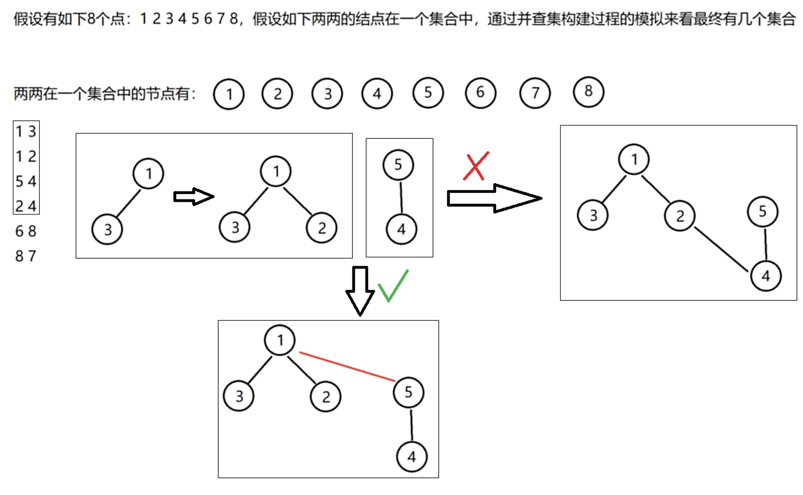
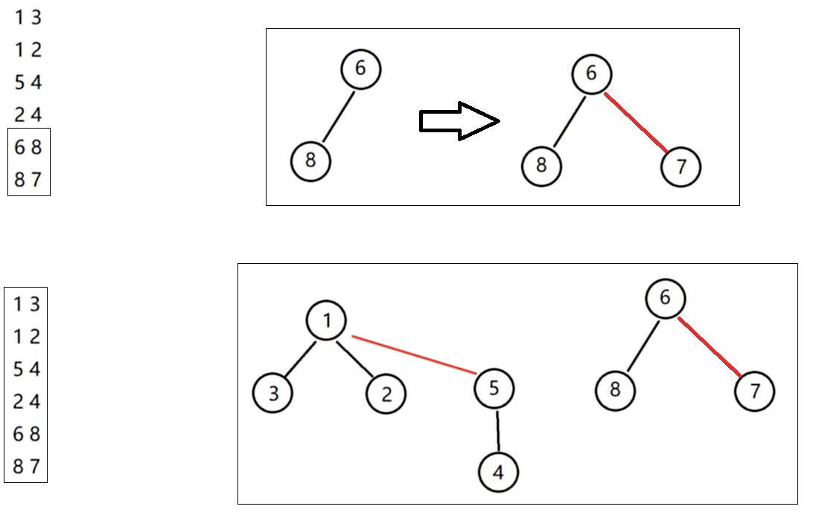

# 并查集
主要用于解决**元素分组**的问题。主要操作有**集合（或单个元素）的合并**和**查询元素所在的集合**。
元素以在同一棵树下为标志，认为在同一集合中。多个集合对应着多棵不同的树，组成了森林。
逻辑上是树形结构，实际上用数组存储元素所在集合的根节点。
# 合并
合并 x 和 y 两个元素时，不能直接合并两个元素，而是要合并两个元素所在树的根节点。
# 查询
查询 x 和 y 是否在同一个集合，是查询 x 和 y 对应的根节点是否相同。
# 合并示例



## 代码
```cpp
#include<iostream>
const int SIZE = 9;
int parent[SIZE];
// 非递归版查询x的根节点
int find(int x)
{
    while(x != parent[x])
    {
        x = parent[x];
    }
    return x;
}
// 递归版查询x的根节点
int r_find(int x)
{
    if(x == parent[x]) return x;
    return r_find(parent[x]);
}
// 合并x和y
void merge(int x, int y)
{
    int x_root = find(x);
    int y_root = find(y);
    if (x_root != y_root)
    {
        parent[y_root] = x_root;
    }
}
int main()
{
    for(int i = 1; i < SIZE; ++i)
    {
        parent[i] = i;
    }
    int x, y;
    // 输入6组两个整数，全都合并。
    for(int i = 1; i <= 6; ++i)
    {
        std::cin >> x >> y;
        merge(x, y);
    }
    for(int i = 1; i < SIZE; ++i)
    {
        std::cout << parent[i] << " ";
    }
    std::cout << std::endl;
    std::cout << "输入要查询的2个元素是否在一个集合：";
    std::cin >> x >> y;
    std::cout << (find(x) == find(y) ? "在" : "不在") << std::endl;
}
```

```bash
输入：
1 3
1 2
5 4
2 4
6 8
8 7
输出parent数组：
1 1 1 5 1 6 6 6 
输入要查询的2个元素是否在一个集合：
2 4
输出：
在
```
# 路径压缩
