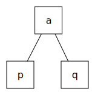
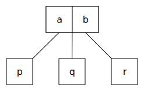
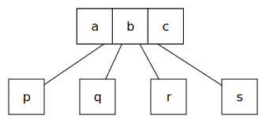

# 内容

# 2-3-4树

在计算机科学中，2-3-4 树（也称为 2-4 树）是一种可用于实现字典的自平衡数据结构。 这些数字(2/3/4)表示的是一棵树中: 每个有1个/2个/3个元素的节点分别有2个/3个/4个子节点：

- a 2-node has one data element, and if internal has two child nodes;
  
- a 3-node has two data elements, and if internal has three child nodes;
  
- a 4-node has three data elements, and if internal has four child nodes;
  

## 与B树的关系

1. 2-3-4树是4阶的B树；
2. 和一般的B树一样，它们可以在$O(\log n)$时间内搜索、插入和删除。 
3. 2-3-4树的一个特性是所有外部节点都处于相同的深度。

## 与红黑树的关系

2-3-4树与红黑树同构，这意味着它们是等效的数据结构。换言之，对于每棵2-3-4树，至少存在一棵数据元素顺序相同的红黑树。此外，对2-3-4树的插入和删除操作会导致节点扩展、拆分和合并，相当于红黑树中的颜色翻转和旋转。

红黑树的介绍通常首先介绍2-3-4树，因为它们在概念上更简单。然而，2-3-4 树在大多数编程语言中可能难以实现，因为树上的操作涉及大量特殊情况。 红黑树更容易实现，因此倾向于使用。

# 性质

1. 叶节点, 每个子节点都是2节点、3节点或4节点，父节点分别保存一个、两个或三个数据元素。
2. 所有叶子都在相同的深度（底层）。
3. 所有数据都按排序顺序保存。
