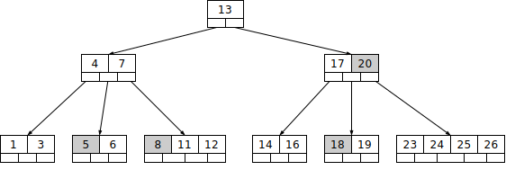
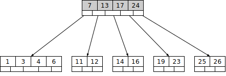

# B的含义
B树是由Rudolf Bayer和Edward M. McCreight在波音研究实验室工作时发明的，目的是有效地**管理大型随机访问文件的索引页面**。

基本假设是索引会非常庞大，以至于只有树的小块可以放入主内存中。

Bayer和McCreight从未解释过"B"代表什么, 如果可能的话, 可能会是：Boeing、**balanced**、broad、busy和Bayer。
McCreight曾说过“你对B树中的'B'的含义思考得越多，你对B树的理解就越好。”

不管"B"代表的什么含义, **总之肯定不是"Binary", 因为B树不是二叉树**; 
那么, 我们暂且就把B Tree中的"B"当做是"Balanced"吧!
# m阶平衡树

m阶, 这个"阶"对于树来说怎么解释?

拿例子说话吧!

**AVL树**, 就是一个**2阶平衡树**, 所谓2阶, 指的是, 1个节点有2个指针域指向2个孩子, 和1个数据域;

那么, m阶的意思就是: $1$个节点最多有$m$个指针域指向$m$个孩子, 和最多有$m-1$个数据域;

B树的特点是和AVL如出一辙的, 甚至比AVL还要道高一尺, AVL只能保证左右子树高度差不超过1, 
而**B树的性质保证了所有叶节点同时在同一层**, 由此可以看出, B树是比AVL更平衡的树; 

由此可见, B树只不过是一个2阶平衡树(AVL)的一个横向变种罢了! 本质上还是AVL的灵魂; 

> 形式上都是平衡的, 但, 与AVL最大的不同是, B树没有节点的旋转操作, 而是涉及到分裂/合并;
# B树的性质

根据Knuth的定义，$m$阶B树是满足以下性质的树：

1. 每个节点最多有$m$个子节点。
2. 每个内部节点至少有$\lceil m/2 \rceil$个子节点。
3. 每个非叶节点至少有2个孩子。
4. 所有叶子都出现在同一层次上并且不携带任何信息。
5. 具有$k$个子节点的非叶节点包含$k-1$个键。

每个内部节点的键充当分割其子树的分隔值。例如，如果一个内部节点有3个子节点（或子树），那么它必须有2个键：$a_1$和$a_2$。 最左子树中的所有值都小于$a_1$，中间子树中的所有值都在$a_1$和$a_2$之间，最右子树中的所有值都大于$a_2$。
# B树、AVL、红黑树、BST这些搜索树的对比
**B树即平衡树，m阶平衡树**。符合搜索树的性质（中序遍历有序）。

**4阶平衡树即2-3-4树**，指树的节点最多有3个关键码，4个分支。2-3-4树实际上就是4阶B树。即: 每个节点, 最多有三个数据, 4个孩子节点

**2阶平衡树即AVL树**。一个节点有2个分支。

但**BST（Binary Search Tree）不是2阶平衡树**，因为BST中的B指的不是Balanced，而是Binary，因此**BST没有平衡性质**。

AVL树节点的左右子树高度差不超过1。

B树相比AVL更平衡，因为所有叶子节点都在同一层。适用于文件索引系统。

B树、AVL树、红黑树、BST本质上**都是一棵搜索树**，
只不过B树是m阶的。BST、AVL、**红黑树是2阶的**。
B树完全平衡，AVL树高度平衡，红黑树近乎平衡，BST不平衡。
# B树的行为
## 插入
特点是，如果节点内的关键码达到了m个，将会分裂。把m个关键码中的中间值往上推一层。被上移的节点左右指向剩下的两半。
## 删除
有两种常用的删除策略：
1. 定位并删除元素，然后调整树使它满足约束条件。
2. 从上到下处理这棵树，在进入一个节点之前，调整树使得之后一旦遇到了要删除的元素，它可以被直接删除而不需要再进行调整。
    1. 这种策略就类似于，红黑树的删除操作前，先让所有的2-型节点扩张为3-型或4-型节点，再去直接删除。见“C语言_树”

以下讨论的是第1种策略。

1. 有没有孩子
    1. 如果删除的关键码没有孩子，可以直接删除。
    2. 如果删除的关键码有孩子，需要从左孩子节点中找最右值或右孩子找最左值，将其上移补位。等于是把孩子中的一个关键码删去了。
2. 删除后
    1. 如果删除后，节点的关键码数小于$(m/2)(上取整)-1$。（比如，5阶B树，删除后节点关键码数目小于2（即1个）；4阶B树（2-3-4树）中删除后节点关键码数目小于1（即0个））。这叫做“**不丰满**”。
    2. 如果节点的关键码数大于$(m/2)(上取整)-1$，叫做“**丰满**”。
    3. 若等于，则类似于“**刚刚脱贫**”。此时如果删去一个元素，就会“不丰满”。
    4. 兄弟丰满，**借**：如果删除后“不丰满”，则把父节点元素下移补充，而父节点需要向该删除后的节点相邻的丰满的兄弟节点中借一个元素。
    5. 兄弟太穷，**并**：如果相邻的兄弟节点都是“刚刚脱贫”的，就要靠父节点下移一个元素，补充到这个删除的位置，然后与相邻的一个兄弟节点进行“合并”成为一个节点。

5阶B树为例，删除：

如图所示，接下来要依次删除 8，20，18，5。

首先要删除元素 8。先查找到元素 8 在叶子节点中，删除 8 后叶子节点的元素个数为 2，符合 B 树的规则。然后需要把元素 11 和 12 都向前移动一位。完成后如图所示。

下一步，删除 20，因为 20 没有在叶子节点中，而是在中间节点中找到，可以发现 20 的继承者是 23（字母升序的下个元素），然后需要将 23 上移到 20 的位置，之后将孩子节点中的 23 进行删除。

删除后检查一下，该孩子节点中元素个数大于 2，无需进行合并操作。

所以这一步之后，B 树如下图所示。

下一步删除 18，18 在叶子节点中，但是该节点中元素数目为 2，删除导致只有 1 个元素，已经小于最小元素数目 2。

而由前面已经知道：如果其某个相邻兄弟节点中比较丰满（元素个数大于 $\lceil \dfrac{5}{2} \rceil - 1$），则可以向父节点借一个元素，然后将最丰满的相邻兄弟节点中上移最后或最前一个元素到父节点中。

在这个实例中，右相邻兄弟节点中比较丰满（3 个元素大于 2），所以先向父节点借一个元素 23 下移到该叶子节点中，代替原来 19 的位置。19 前移。

然后 24 在相邻右兄弟节点中，需要上移到父节点中。最后在相邻右兄弟节点中删除 24，后面的元素前移。

这一步之后，B 树如下图所示。

最后一步需要删除元素 5，但是删除后会导致很多问题。因为 5 所在的节点数目刚好达标也就是刚好满足最小元素个数 2。

而相邻的兄弟节点也是同样的情况，删除一个元素都不能满足条件，所以需要该节点先借父节点一个元素，再与某相邻兄弟节点进行合并操作；首先移动父节点中的元素（该元素在两个需要合并的两个节点元素之间）下移到其子节点中。

然后将这两个节点进行合并成一个节点。所以在该实例中，首先将父节点中的元素 4 下移到已经删除 5 而只有 6 的节点中，然后将含有 4 和 6 的节点和含有 1，3 的相邻兄弟节点进行合并成一个节点。

这一步之后，B 树如下图所示。

但是这里观察到父节点只包含了一个元素 7，这就没有达标（因为非根节点包括叶子节点的元素数量  必须满足于 $2\le K\le 4$)，而此处的 $K=1$）。

如果这个问题节点的相邻兄弟比较丰满，则可以向父节点借一个元素。而此时兄弟节点元素刚好为 2，刚刚满足，只能进行合并，而根节点中的唯一元素 13 下移到子节点。这样，树的高度减少一层。

所以最终的效果如下图。

# B树的应用场景 - 文件索引(数据库索引)
B树本质上还是一棵搜索树，只不过是m阶的完全平衡树。

如果系统所管理的数据量很大，需要用磁盘、硬盘、外存存储，那么为了提高效率，会给数据创建索引。为了索引查询的高效，需要给索引排序。

如果没有索引，如果数据表有1000w行数据，则需要整表线性搜索。
如果有索引，则有搜索树结构。则查找效率为$O(log_2 N)$。（这一点在AVL树和B树上查找效率是一样的）
如果是树节点是m阶。则**传输次数**为$log_m N$。（树的层高，决定了AVL树和B树实际的查找效率不同）

注意区分传输次数和查找效率：
传输次数指的是，按照大节点划块。
最终还是得在大节点的内部进行查找，而查找的最快算法只能是二分查找。

所以这个例子很好地说明了，算法和数据结构二者的地位，缺一不可。
算法效率固然重要，但：
数据结构将决定是否能很好地适配计算机的整体存储结构，达到实际的较高性能。
## 操作系统原理
操作系统中
1. 内存，按页面(page)为最小单位分配、管理，默认每一页4K。
    1. 所以代码上看似我们只占用了几字节，但是实际上可能占用了1页。
    2. 某些场景会使用大页（Huge Pages，如 2MB 或 1GB）以优化性能，但这需要显式配置，并非默认行为。
2. 磁盘，按块(block)为最小单位分配、管理。大多数文件系统（如 ext4、NTFS）默认使用 ​4KB 的块大小，与内存页对齐以提高效率。
    1. 所以操作系统在读取文件时，并不是只读取了几个字节，而是整个块大小。
    2. **可配置性**：块大小可以按需调整（如 1KB、8KB、16KB 等），通常用于特定场景（如处理超大文件或数据库优化）。
    3. **物理扇区与逻辑块**：磁盘的物理扇区大小可能为 512B 或 4KB，但文件系统的逻辑块（Block）会组合多个扇区，形成更大的逻辑单元，16KB 的块就是由 32 个 512B 扇区组成的。
### 先用内存管理举例子，类比磁盘读取
我们malloc或者new一个int，表面上申请了4字节。但是内核的内存管理是按最小一个页面大小（4 KB）来申请的。
这是由内核中，`libc.so`或`libc++.so`库中ptmalloc或者tcmalloc来管理的内存池实现。
如果申请了下一个对象的内存空间，内存池管理的这个页面尚有空间，则直接返回预申请好的这个页面中空闲的地址。

那么，硬盘（磁盘）读取数据到内存中，也是同样的道理，按块来读取，磁盘扇区一般是 512B ，文件系统逻辑块组合多个扇区，可能是 16KB ，是页面大小（4KB）的整数倍。
所以，读取一次硬盘（磁盘）数据，并不只是读取了几个字节，而是把一整块数据读到了内存缓冲区中。
### 分析和方案 - 假设有1千万份简历 - 设计索引
如果我们有1千万份简历文件，每份简历文件为10M，则粗略计算其有9000G。
如何对所有简历文件的内容进行查询？
我们的内存是有限的，按照数组的方式进行查询，一次只能加载一部分。如果可用的内存大小只有1G，有可能需要加载9000次，太慢了。

如果简历以身份证号为关键码，我们**只需要在内存中加载它们的身份证号**和**其简历对应的文件指针**即可。这就是文件索引。

再结合搜索算法，如果要高效地搜索，如二分查找，则需要对关键码进行排序。

文件在磁盘中可以不按身份证号排序。

如果想要创建新的简历，那么关键码需要插入已有的关键码中。

这时候关键码的数据结构就会影响到效率。

如果是用数组存储，虽然读取上很搞效，但插入、删除时间复杂度为O(n)。
如果是用链表存储，虽然插入、删除很高效，但读取上就很慢。
这种静态的存储方式不行。

如果是树形存储，如红黑树存储，虽然可以较好地平衡查询、修改的时间复杂度，但是每一个节点都是malloc申请的堆上内存，根据计算机的存储体系结构，会导致其节点地址在内存结构中呈碎片化，不利于缓存的命中，效率依然不够高。
**节点在内存中碎片化的影响是会触发内存的缺页中断，需要换页，换页会触发读取磁盘IO，消耗时间**。

可以考虑两种方案：
1. 哈希表。
2. 300阶B树。红黑树本质上是一个4阶B树，其每一个节点最多存储3个索引。而300阶B树则可以让节点存储更多连续的数据。尽量让这个数据块的大小正好是内存的页大小（4KB）。提高了内存、缓存命中率。
## AVL树和B树存储索引的对比（假设索引全部加载到内存中）
假如, 目前有1千万个索引要从磁盘中进行读取并且进行搜索。
对于AVL树，每一个节点只能对应 1 个索引元素（关键码）。
对于B树，每一个节点可以容纳$m-1$个索引元素（关键码）。

假设我们有一个300阶B树。（300阶是综合考虑一个B树节点大小约为4KB的情况，更有效地防止跨磁盘块）
那么，1千万个索引构建到B树中，只需要3层。而AVL树需要24层。
相当于，二分查找一个索引，B树只需要访问3个节点，而AVL树可能需要访问24个节点（最差情况）。

| 参数                               | AVL的高度                      | 300阶B树的高度                      |
| -------------------------------- | --------------------------- | ------------------------------ |
| 10,000,000个索引元素($n=1\times10^7$) | $\lceil\log_2 n\rceil = 24$ | $\lceil\log_{300} n\rceil = 3$ |
### 如果索引可以全部加载到内存中
1. ​**索引的搜索过程在内存中完成**：
    无论是AVL树还是B树，查找目标索引的路径（从根节点到叶子节点）全部在内存中进行，**不涉及磁盘IO**。只有最后根据文件指针读取实际文件时才会触发磁盘IO。
2. ​**文件读取的磁盘IO次数**：1次
    找到目标索引后，需通过文件指针从磁盘读取对应的实际文件。无论索引结构层数多少，**仅需1次磁盘IO**​（读取目标文件）。
### 实际数据库中，索引可能远大于内存容量
- ​大规模数据索引无法完全放入内存
    - 实际数据库中，索引可能远大于内存容量。B树通过多级节点将热点数据保留在内存（如根节点常驻内存），冷数据存储在磁盘，**减少内存压力**。 
    - 红黑树/AVL树：若索引无法全放入内存，每次访问深层节点都可能触发磁盘I/O，性能急剧下降。
- ​写操作的磁盘友好性
    - 对于读取操作，无所谓。但是对于修改操作，那么如果插入、删除一条数据记录，就会让树结构进行调整。​
    - B树的节点分裂/合并操作是 ​**局部性修改**​（仅影响相邻节点），适合批量写入磁盘；
    - 而红黑树/AVL树的旋转操作可能导致 ​**全局结构调整**，产生更多随机I/O。
# 总结（⭐）
文件索引管理最主要的 2 个问题：
1. 更快的搜索算法（索引的关键码）
    1. 对于搜索算法倒是没什么差异，AVL树和B树同样都是二分查找的分治策略, 时间复杂度都为$O(\log n)$。
2. 更少的磁盘IO、更低的内存缺页率
    1. 对于树的层数来说，AVL树和B树是有很大差异的。
    2. 若索引太庞大，**最差情况下**必须每次从磁盘中读取：（看路径层数，层低有优势）
        1. **树的层高**，会直接影响到在**最差情况**下的**磁盘I/O次数**。
        2. 因为每次访问一个节点时，都需要将磁盘块（Block）加载到内存中。（最差情况下，索引分布在不同磁盘块中）
        3. 300阶B树刚好把一个最大节点的大小接近4KB即页大小。一个节点对应着1页，若索引相邻，则利用局部性原理提效。
    3. 若索引可以从磁盘一次性加载到内存中：（看节点一次性能容纳索引的数量，容纳越多越有优势）
        1. 一个节点能容纳的索引数量，决定了索引在内存中的分散度。
        2. 如果节点内存地址太分散（像红黑树，只能存3个索引），可能会面临更高的**内存缺页中断**率。**间接影响了磁盘I/O次数**。
3. 总之，无论索引能不能一次性载入内存，B树都占有优势，**集合了层低、节点容量大**的优势。
    1. 层数少，避免了磁盘IO次数。
    2. 节点容量大，避免了内存缺页。
# B+树，B树的改进
B+树可以看作是B树的优化，比 B 树更适合实际应用中的索引。目前现代关系型数据库最广泛的支持索引结构就是 B+ 树。

总之：B+树明确分出`leaf`/`internal`节点， 让`internal`只存`key`，只有`leaf`存全部的索引信息。
（`B∗`树则是节点满的时候先不拆分而是尽可能合并到邻居节点）

B+树与B树差异的点，主要是以下这几点：
1. 非叶子节点只会存放关键码，不存储实际数据。
2. 叶子节点才会存放实际数据。
3. 全部的信息都会在叶子节点出现。
4. 非叶子节点存储的关键码是每个子节点中的最小值。
5. 叶子节点之间构成一个有序链表。

## 相比B树的优势
1. 数据量相同的情况下，B+树的非叶子节点数据密度更大，存储效率高。B+树的非叶子节点可以存放更多的关键码，因此B+树可以比B树更「矮胖」，查询底层节点的磁盘IO次数会更少。
2. **查询更稳定**，由于非叶结点并不是最终指向文件内容的结点，任何关键字的查找必须走一条从根结点到叶子结点的路。**所有关键字查询的路径长度相同**，导致每一个数据的查询效率相当。
3. B+树的叶子节点通过指针形成有序链表，**范围查询（如`WHERE id BETWEEN 100 AND 200`）只需遍历叶子节点**，避免了回溯到上层节点。 

例子：假设磁盘中的一个盘块可容纳 16 B，而一个关键字大小 2 B。一个关键字具体信息指针大小 2 B。
一棵9阶B树（一个结点最多 8 个关键字）的内部结点需要 2 个盘块。而B+树内部结点只需要 1 个盘块。当需要把内部结点读入内存中的时候，B树就比B+树多一次盘块查找时间（在磁盘中就是盘片旋转的时间）。