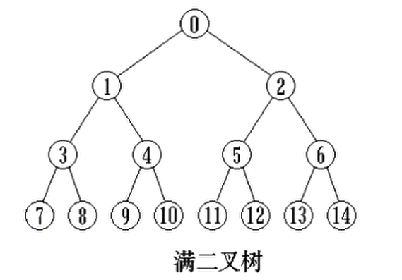
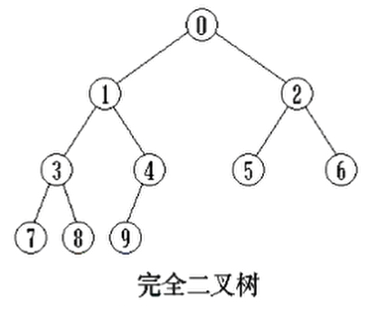
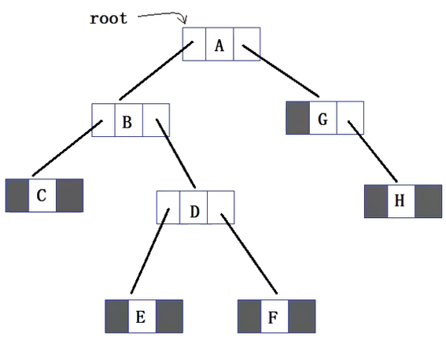
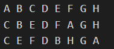
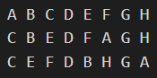

# 内容

1. 树相关概念

## 考点

1. CreateBinaryTree
2. `NicePreOrder` - 前序遍历、`NiceInOrder` - 中序遍历、`NicePostOrder` - 后序遍历
3. 二叉树是否是完全二叉树、满二叉树、二叉搜索树、平衡二叉树

## 相关术语及翻译

| 术语     | 英译                |
| -------- | ------------------- |
| 先序遍历 | PreOrder Traversal  |
| 中序遍历 | InOrder Traversal   |
| 后序遍历 | PostOrder Traversal |

# 树相关概念

三个字来总结：一对多。

树是由`n(n>=0)`个结点组成的有限集合。
如果`n=0`，称为空树；
如果`n>0`，则有一个特定的称之为根`(root)`的结点， 它只有直接后继， 但没有直接前驱；
除根以外的其它结点划分为`m(m>=0)`个互不相交的有限集合$T_0, T_1, T_{m-1}$，每个集合又是一棵树，并且称之为根的**子树(subTree)** 。**每棵子树的根结点有且仅有一个直接前驱**， 但可以有0个或多个直接后继。

1. 节点的度：一个节点含有的子树的个数（直接后继节点）。
2. 树的度：一棵树中，所有节点的度中的最大值。
3. 叶节点（终端节点）：度为0的节点。
4. 非叶节点（分支节点）：度不为0的节点。
5. 父节点（双亲）：若一个节点含有子节点，则是其子节点的父节点；某节点的直接前驱节点。
6. 子节点（孩子）：一个节点的字树的根节点（或直接后继节点）。
7. 兄弟节点：有相同父节点的节点互称为兄弟节点。
8. 节点的层次：从根开始定义起，**根为第1层**，根的子节点为第2层，以此类推。
9. 深度：即从根（第1层）到第n层的路径长，根的深度为0。即`层次数-1`。——偏向于层
10. 高度：从根节点到叶节点的最长路径。当只有根节点时，路径为0即高度为0。——偏向于一条路径
11. 堂兄弟节点：它们的父节点不同，但它们的父节点在同一层的节点，互为堂兄弟。
12. 祖先节点：从根到该节点路径上所经过的所有节点；有的解释为爷爷节点。

# 二叉树概念

二叉树的定义：一棵二叉树是节点的一个有限集合，该集合或为空，或为由一个根节点加上两棵分别称为左子树和右子树的互不相交的二叉树组成。

> 从定义可以看出，“二叉树是由二叉树组成的”，属于递归式定义。如果某件事物的本质是递归的，那么我们解决此类事物的方法往往也是递归式的。

## 二叉树的性质

1. 若二叉树的层次从$0$开始，则第$i$层最多有$2^i$个节点$(i\ge0)$。可用数学归纳法证明。
2. 高度为$k$的二叉树最多有$2^{k+1}-1$个节点$(k\ge0)$。可用等比数列求和公式得出。
3. 对于任何一棵二叉树，如果叶节点个数为$n_0$（$n$的下标表示度数），度为2的非叶节点个数为$n_2$，则有$n_0=n_2+1$。

## 特殊的二叉树

### 满二叉树 - Full Binary Tree

二叉树的每一层的节点数都达到最大值。



### 完全二叉树 - Complete Binary Tree

若二叉树的高度为$h$，则共有$h+1$层。除第$h$层外，其他各层`(0 ~ h-1)`的节点数都达到最大个数，第$h$层从右向左**连续缺**0个或若干个节点。满二叉树是一种特殊的完全二叉树。

具有$n$个节点的完全二叉树的高度为$\lceil\log_2(n+1)\rceil-1$。注意，只适于完全二叉树，不适于一般的二叉树。

> 证明：设完全二叉树的高度为$h$，则有
> $$
> \begin{flalign}
> &~~~~~~2^h-1<n\le2^{h+1}-1\\
> &\Leftrightarrow 2^h<n+1\le2^{h+1}\\
> 取对数&\Leftrightarrow h<\log_2(n+1)\le h+1&
> \end{flalign}
> $$



# 中序+前序/后序序列建立二叉树

| 遍历方式 | 步骤                                           |
| -------- | ---------------------------------------------- |
| 先序遍历 | 先操作根节点，再遍历左子树，再遍历右子树       |
| 中序遍历 | 先遍历左子树，返回后再操作根节点，再遍历右子树 |
| 后序遍历 | 先遍历左子树，再遍历右子树，再操作根节点。     |




如此一棵二叉树。手写出三种方式遍历的序列：

```
先序遍历：ABCDEFGH
中序遍历：CBEDFAGH
后序遍历：CEFDBHGA
```

我们观察手写出来的先序遍历序列和中序遍历序列，发现规律。

在先序遍历中可以看出，A为根节点，以A为基准，再把目光转向中序遍历，则可以看出以A划分出了`CBEDF`和`GH`，而这也分别对应A节点的左子树和右子树。
按照这个规律，再看先序遍历，A后面一个是B，以B为基准，再把目光转向中序遍历，则可以看出以B划分出了`C`和`EDF`，而这也分别对应B节点的左子树和右子树。
......
因此可以根据中序遍历序列和先序/后序遍历序列的其中一种来复画二叉树逻辑结构。

由此，相应地，我们的代码逻辑也浮于水面。先来看根据前序、中序序列来创建二叉树代码。

```cpp
BtNode* CreatePreIn(const char * pre_str, const char * in_str, int len)
{
    BtNode * s = NULL;
    if(len >= 1)
    {
        s = Buynode();
        s->data = pre_str[0];
        int pos = FindInStr(in_str, len, pre_str[0]);
        if(pos == -1)
        {
            exit(1);
        }
        s->left  = CreatePreIn(pre_str+1, in_str, pos);	//左子树
        s->right = CreatePreIn(pre_str+pos+1, in_str+pos+1, len-pos-1);//右子树
    }
    return s;
}
```

测试

```cpp
#include<iostream>
#include<cassert>
#include<cstring>
using namespace std;
typedef char ElemType;
typedef struct BtNode
{
    BtNode * left;
    BtNode * right;
    ElemType data;
}BtNode, *BinaryTree;
BtNode* Buynode()
{
    BtNode * s = (BtNode*)malloc(sizeof(BtNode));
    if(s == NULL)
    {
        exit(1);
    }
    return s;
}
int FindInStr(const char * in_str, int len, char ch)
{
    assert(in_str != NULL);
    int pos = -1;
    int i = 0;
    while(i < len)
    {
        if(in_str[i]==ch)
        {
            pos = i;
            break;
        }
        ++i;
    }
    return pos;
}
BtNode* CreatePreIn(const char * pre_str, const char * in_str, int len)
{
    BtNode * s = NULL;
    if(len >= 1)
    {
        s = Buynode();
        s->data = pre_str[0];
        int pos = FindInStr(in_str, len, pre_str[0]);
        if(pos == -1)
        {
            exit(1);
        }
        s->left  = CreatePreIn(pre_str+1, in_str, pos);	//左子树
        s->right = CreatePreIn(pre_str+pos+1, in_str+pos+1, len-pos-1);//右子树
    }
    return s;
}
BtNode* CreateTreePreIn(const char * pre_str, const char * in_str)
{
    if(pre_str == NULL || in_str == NULL)return NULL;
    int pre_len = strlen(pre_str);
    int in_len = strlen(in_str);
    if(pre_len != in_len)return NULL;
    return CreatePreIn(pre_str, in_str, pre_len);
}
void PrintPre(BinaryTree bt)
{
    if(bt == NULL)return;
    cout << bt->data << " ";
    PrintPre(bt->left);
    PrintPre(bt->right);
}
void PrintIn(BinaryTree bt)
{
    if(bt == NULL)return;
    PrintIn(bt->left);
    cout << bt->data << " ";
    PrintIn(bt->right);
}
void PrintPost(BinaryTree bt)
{
    if(bt == NULL)return;
    PrintPost(bt->left);
    PrintPost(bt->right);
    cout << bt->data << " ";
}
int main()
{
    BinaryTree root = NULL;
    char pre_str[] = {"ABCDEFGH"};
    char in_str[] = {"CBEDFAGH"};
    root = CreateTreePreIn(pre_str, in_str);
    PrintPre(root); cout << endl;
    PrintIn(root); cout << endl;
    PrintPost(root); cout << endl;
    return 0;
}
```

运行结果



相应地，可以得出后序、中序序列建立二叉树代码

```cpp
#include<iostream>
#include<cassert>
#include<cstring>
using namespace std;
typedef char ElemType;
typedef struct BtNode
{
    BtNode * left;
    BtNode * right;
    ElemType data;
}BtNode, *BinaryTree;
BtNode* Buynode()
{
    BtNode * s = (BtNode*)malloc(sizeof(BtNode));
    if(s == NULL)
    {
        exit(1);
    }
    return s;
}
int FindInStr(const char * in_str, int len, char ch)
{
    assert(in_str != NULL);
    int pos = -1;
    int i = 0;
    while(i < len)
    {
        if(in_str[i]==ch)
        {
            pos = i;
            break;
        }
        ++i;
    }
    return pos;
}
BtNode* CreatePostIn(const char * post_str, const char * in_str, int len)
{
    BtNode * s = NULL;
    if(len >= 1)
    {
        s = Buynode();
        s->data = post_str[len-1];
        int pos = FindInStr(in_str, len, post_str[len-1]);
        if(pos == -1)
        {
            exit(1);
        }
        s->left  = CreatePostIn(post_str, in_str, pos);	               //左子树
        s->right = CreatePostIn(post_str+pos, in_str+pos+1, len-pos-1);//右子树
    }
    return s;
}
BtNode* CreateTreePostIn(const char * post_str, const char * in_str)
{
    if(post_str == NULL || in_str == NULL)return NULL;
    int pre_len = strlen(post_str);
    int in_len = strlen(in_str);
    if(pre_len != in_len)return NULL;
    return CreatePostIn(post_str, in_str, pre_len);
}
void PrintPre(BinaryTree bt)
{
    if(bt == NULL)return;
    cout << bt->data << " ";
    PrintPre(bt->left);
    PrintPre(bt->right);
}
void PrintIn(BinaryTree bt)
{
    if(bt == NULL)return;
    PrintIn(bt->left);
    cout << bt->data << " ";
    PrintIn(bt->right);
}
void PrintPost(BinaryTree bt)
{
    if(bt == NULL)return;
    PrintPost(bt->left);
    PrintPost(bt->right);
    cout << bt->data << " ";
}
int main()
{
    BinaryTree root = NULL;
    char pre_str[] = {"ABCDEFGH"};
    char in_str[] = {"CBEDFAGH"};
    char post_str[] = {"CEFDBHGA"};
    root = CreateTreePostIn(post_str, in_str);
    PrintPre(root); cout << endl;
    PrintIn(root); cout << endl;
    PrintPost(root); cout << endl;
    return 0;
}
```




# 非递归遍历链式存储二叉树

## 前序遍历

一个栈，先入右，后入左。

```cpp
#include<iostream>
#include<stack>
using namespace std;
typedef struct TreeNode
{
    TreeNode* left;
    TreeNode* right;
    int val;
}TreeNode;
void preorderTraversal(TreeNode* root)
{
    TreeNode* cur = root;
    stack<TreeNode*> st;
    st.push(cur);
    while (!st.empty())
    {
        cur = st.top();
        st.pop();
        cout << cur->val;
        if (cur->right != nullptr)
        {
            st.push(cur->right);
        }
        if (cur->left != nullptr)
        {
            st.push(cur->left);
        }
    }
}
```

## 中序遍历

一个栈。

1. 指针所指节点的左不为空时，入栈左子树
2. 左空则出栈回退，指针指向出栈的节点（父节点）
3. 打印
4. 指针指向右子树
5. 循环

```cpp
#include<stack>

void inorderTraversal(TreeNode* root)
{
    stack<TreeNode*> st;
    TreeNode* cur = root;
    while(!st.empty() || cur != NULL)
    {
        while(cur != NULL)
        {
            st.push(cur);
            cur = cur->left;
        }
        cur = st.top();
        st.pop();
        cout << cur->val;
        cur = cur->right;
    }
}
```

还有一种写法，只是循环的形式稍有不同。

```cpp
#include<stack>
void inorderTraversal(TreeNode* root)
{
    stack<TreeNode*> st;
    TreeNode* cur = root;
    while(!st.empty() || cur != NULL)
    {
        if(cur != NULL)
        {
            st.push(cur);
            cur = cur->left;
        }
        else
        {
            cur = st.top();
            st.pop();
            cout << cur->val;
            cur = cur->right;
        }
    }
}
```

## 后序遍历

两种方法。

### 双栈法

模仿前序遍历，但是需要另外一个栈来记录。

```cpp
void postorderTraversal(TreeNode* root)
{
    TreeNode* cur = root;
    stack<TreeNode*> st;
    stack<int> ist;
    st.push(cur);
    while (!st.empty())
    {
        cur = st.top();
        st.pop();
        ist.push(cur->val);
        if (cur->left != nullptr)
        {
            st.push(cur->left);
        }
        if (cur->right != nullptr)
        {
            st.push(cur->right);
        }
    }
    while (!ist.empty())
    {
        cout << ist.top();
        ist.pop();
    }
}
```

### 迭代法

仍是单栈，但需要一个tag标记指针来记录已经访问过哪个节点。

```cpp
#include<stack>
#include<vector>
#include<iostream>
using namespace std;
typedef struct TreeNode
{
    TreeNode* left;
    TreeNode* right;
    int val;
}TreeNode;
class Solution {
public:
    vector<int> postorderTraversal(TreeNode* root) {
        vector<int> v;
        stack<TreeNode*> st;
        TreeNode* cur = root;
        TreeNode* tag = nullptr;
        while (cur != nullptr || !st.empty())
        {
            while (cur != nullptr)
            {
                st.push(cur);
                cur = cur->left;
            }
            cur = st.top();
            st.pop();
            if (cur->right == nullptr || cur->right == tag)
            {
                tag = cur;
                v.push_back(cur->val);
                cout << cur->val;
                cur = nullptr;  //不易写出。
            }
            else
            {
                st.push(cur);
                cur = cur->right;
            }
        }
        return v;
    }
};
int main()
{
    TreeNode n3 = { nullptr, nullptr, 3 };
    TreeNode n2 = { &n3, nullptr, 2 };
    TreeNode n1 = { nullptr, &n2, 1 };
    Solution s;
    s.postorderTraversal(&n1);
}
```

