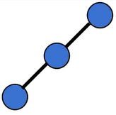
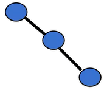
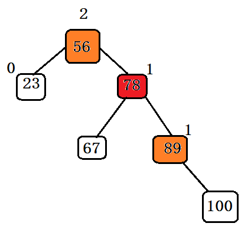
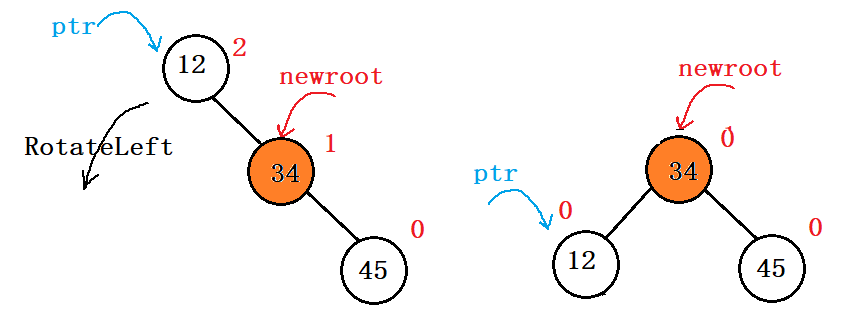
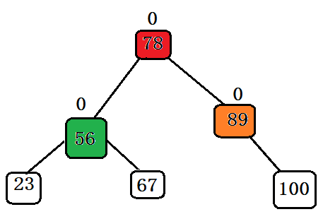
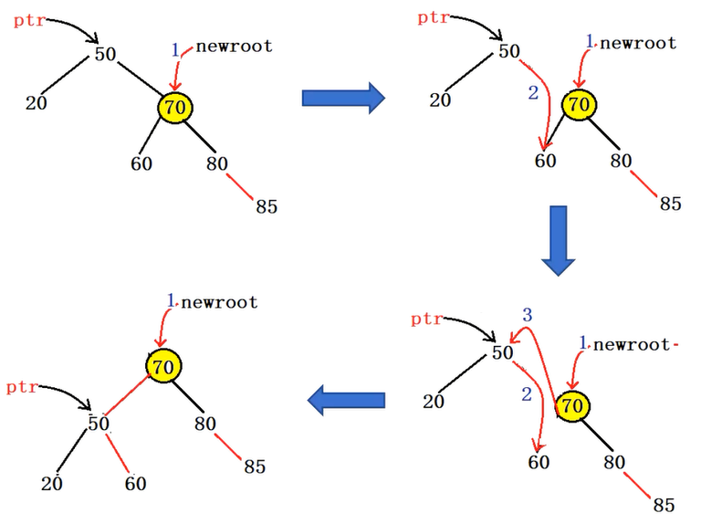
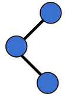
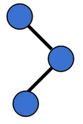
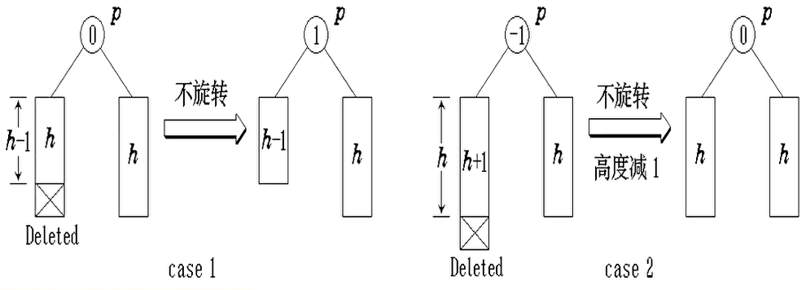

# 内容

1. AVL - 平衡搜索树
2. 单旋转
3. 双旋转

# 平衡搜索树

在计算机科学中，AVL树（以发明者Adelson-Velsky和Landis 命名）是一种**自平衡-二叉搜索树(BST)**。在AVL树中，任何节点的两个子树的高度最多相差1；如果在任何时候它们的差异超过1，则会进行重新平衡以恢复此属性。在平均情况和最坏情况下，查找、插入和删除都需要$O(\log n)$时间，其中$n$是操作之前树中的节点数。插入和删除可能需要通过一个或多个树旋转来重新平衡树。

AVL树以其两位苏联发明家Georgy Adelson-Velsky和Evgenii Landis的名字命名;

AVL树经常与红黑树进行比较，因为它们都支持相同的操作集并且采用$O(\log n)$基本操作的时间。对于查找密集型应用程序，AVL树比红黑树更快，因为它们更严格地平衡。

# 类C实现方式

## 节点结构

可以看到, 相比于二叉搜索树只多出一个balance因子, 这个平衡因子将带来什么魔力呢?

```c++
typedef int KeyType;
typedef struct AVLNode
{
    struct AVLNode* leftchild;
    struct AVLNode* parent;
    struct AVLNode* rightchild;
	KeyType key;
    int balance;	//-1,0,1
}AVLNode, *AVLTree;
```

# 旋转

如果在一棵平衡的二叉搜索树中插入一个新节点，造成了不平衡。此时必须调整树的结构，使之平衡化。

平衡化旋转有两类：

1. 单旋转（左旋和右旋）
2. 双旋转（左平衡和右平衡）

* 每插入一个新节点时，AVL树中相关节点的平衡状态会发生改变。因此，在插入一个新节点后，需要从插入位置沿通向根的路径回溯，检查各结点的平衡因子（左、右子树的高度差）。
  * 如果在某一节点发现高度不平衡，停止回溯。
  * 从发生不平衡的节点起，沿刚才回溯的路径取直接下两层的节点。
  * 如果这三个节点处于一条直线上，则采用单旋转进行平衡化。单旋转可按其方向分为左单旋转和右单旋转，其中一个是另一个的镜像，其方向与不平衡的形状相关。
  * 如果这三个节点处于一条折线上，则采用双旋转进行平衡化。双旋转分为先左后右和先右后左两类。

## 单旋转

| 要达到平衡需要的旋转操作 | 例子                                                         | 原因                        |
| ------------------------ | ------------------------------------------------------------ | --------------------------- |
| 右单旋转(顺时针)         |  | 左孩子的左子树高 - 左左旋转 |
| 左单旋转(逆时针)         |  | 右孩子的右子树高 - 右右旋转 |

## 左单旋转(右右旋转) - 逆时针



此图为例，插入100后，56的平衡因子为2，78为1，89为1。则我们需要以78为轴，将56进行左单旋转。

左单旋转会是什么效果？先看简单的情况



以此为启发，进行旋转



再来看一个与代码步骤有关的图例



1. newroot指针指向ptr的右子树（轴）
2. ptr的右孩子指针指向newroot的左子树（承）
3. newroot的左孩子指针指向ptr（揽）

以下为最基本的三步走：

```c++
void RotateLeft(AVLTree& tree, AVLNode* ptr)
{
	AVLNode* newroot = ptr->rightchild;	  //1:以ptr右子树为轴
	ptr->rightchild = newroot->leftchild; //2:ptr的右指针承接newroot的左孩子
	newroot->leftchild = ptr;             //3:newroot的左指针包揽ptr为首的子树，揽为已有
}
```

在这三步中，每一步的后面都要做相应的对parent的维护

1. newroot的父指针指向ptr的父节点（ptr的父节点代替了newroot的父）
2. 若newroot有左孩子，则左孩子的父指针指向ptr的节点
3. ptr的父指针指向newroot

```c++
void RotateLeft(AVLTree& tree, AVLNode* ptr)
{
	AVLNode* newroot = ptr->rightchild;		//1.1:
    newroot->parent = ptr->parent			//1.2:

	ptr->rightchild = newroot->leftchild;	//2.1:ptr右指针承接newroot左孩
    if(newroot->left != nullptr)newroot->leftchild->parent = ptr;//2.2:
	
    newroot->leftchild = ptr;				//3.1:newroot左指针包揽ptr子树
    ptr->parent = newroot;					//3.2
}
```

在最后一步，处理ptr的parent指针之前，还要处理**ptr的父节点的某一孩子指针**指向问题，**原本是指向50的(即ptr)**，但70(newroot)包揽了50(ptr)的地位，则原本50(ptr)的父节点的一个孩子指针就要指向70(newroot)，**至于是左孩子指针还是右孩子指针，需要根据是否和ptr地址是否相等判断**。

```c++
void RotateLeft(AVLTree& tree, AVLNode* ptr)
{
	AVLNode* newroot = ptr->rightchild;		//1.1:
    newroot->parent = ptr->parent;			//1.2:

	ptr->rightchild = newroot->leftchild;	//2.1:ptr右指针承接newroot左孩
    if(newroot->left != nullptr)newroot->leftchild->parent = ptr;//2.2:
	
    newroot->leftchild = ptr;				//3.1:newroot左指针包揽ptr子树
    
    //??? : 此处是否需要判空
    if(ptr->parent->leftchild == ptr)ptr->parent->leftchild = newroot;
    else ptr->parent->rightchild = newroot;	//4:
    
    ptr->parent = newroot;					//3.2:
}
```

代码还没完，还要处理根节点的变化

```c++
void RotateLeft(AVLTree& tree, AVLNode* ptr)
{
	AVLNode* newroot = ptr->rightchild;		//1.1:
    newroot->parent = ptr->parent;			//1.2:

	ptr->rightchild = newroot->leftchild;	//2.1:ptr右指针承接newroot左孩
    if(newroot->left != nullptr)newroot->leftchild->parent = ptr;//2.2:
	
    newroot->leftchild = ptr;				//3.1:newroot左指针包揽ptr子树
    
    if(ptr == tree)tree = newroot;			//4:如果ptr正好是根，则newroot替代root
    else									//5:若ptr不是根，则处理其父节点的左右孩子指针
    {	//此处不用判空，既然ptr不是根则ptr->parent一定不为空！
        if(ptr->parent->leftchild == ptr)ptr->parent->leftchild = newroot;
        else ptr->parent->rightchild = newroot;	
    }

    ptr->parent = newroot;					//3.2:
}
```

## 双旋转

| 旋转方向   | 例子                                                         | 原因             |
| ---------- | ------------------------------------------------------------ | ---------------- |
| 左右双旋转 |  | 左孩子的右子树高 |
| 右左双旋转 |  | 右孩子的左子树高 |

## 左右旋转 - 先左旋后右旋

先以左孩子节点为根节点, 左孩子节点的右孩子节点为轴, 进行左单旋转;

再, 以父节点为根节点, 左孩子节点为轴, 进行右单旋转;

# Insert

在向一棵本来是高度平衡$(balance = 0,1,-1)$的AVL树中插入一个新节点和在BST树一样，区别是如果树中某个节点的平衡因子$|balance| > 1$，则出现了不平衡，需要做平衡化处理，使得树中各节点重新平衡化。

```cpp
AVLNode * Buynode(KeyType kx)
{
    AVLNode * s = (AVLNode*)malloc(sizeof(AVLNode));
    if(nullptr == s) exit(1);
    memset(s, 0, sizeof(AVLNode));
    s->key = kx;
    s->balance = 0;
    return s;
}
bool Insert(AVLNode *& tree, KeyType kx)
{
    if(tree == nullptr)
    {
        tree = MakeRoot(val);
        return true;
    }
    AVLNode * pa = nullptr;
    AVLNode * p = tree;
    while(p != nullptr && p->key != kx)
    {
        pa = p;
        p = kx < p->key ? p->leftchild : p->rightchild;
    }
    if(p != nullptr && p->key == kx) //已存在重复值
        return false;

    p = Buynode(kx);
    
    p->parent = pa;
    
    if(kx < pa->key)
    {
        pa->leftchild = p;
    }
    else
    {
        pa->rightchild = p;
    }
    return true;
}
```

## 回溯平衡

对于AVL树来说, 单纯的Insert是不够的, 还需要依靠四个函数 - 左旋/右旋/左右旋转/右左旋转, 来达到对树结构的平衡化;

需要考虑的一个关键点: 回溯的终止条件是什么? 即for循环终止判断语句; 

```cpp
void PassBalance(AVLNode &tree, AVLNode * ptr)
{
    AVLNode * pa = p->parent;
    for(; pa != nullptr; )
    {
        if(pa->leftchild == p) //p在pa的左边
        switch(pa->balance)
        {
            case 0: //本来平衡, 插到左, -1
                pa->balance = -1;     break;
            case 1: //本来右1, 插到左, 0
                pa->balance = 0;      break;
            case -1://本来左1, 插到左, 需要平衡
                LeftBalance(tree, pa);break;
        }
        else //p在pa的右边
        switch(pa->balance)
        {
            case 0: //本来平衡, 插到右, 1
                pa->balance = 1;      break;
            case -1://本来左1, 插到右, 平衡
                pa->balance = 0;      break;
            case 1: //本来右1, 插到右, 需要平衡
                RightBalance(tree, pa);break;
        }
        
        p = pa;
        pa = p->parent;
    }
}
```

还可以进一步做优化: 循环不一定要一直继续 - 有可能节点在插入之后, 整个树的高度没有发生变化, 此时无需进行全部的回溯;

```cpp
void PassBalance(AVLNode &tree, AVLNode * ptr)
{
    AVLNode * pa = p->parent;
    bool taller = true;
    for(; pa != nullptr && taller; )
    {
        if(pa->leftchild == p) //p在pa的左边
        switch(pa->balance)
        {
            case 0: //本来平衡, 插到左, -1
                pa->balance = -1;     break;
            case 1: //本来右1, 插到左, 0, 因此树高无变化, 无需回溯
                pa->balance = 0;
                taller = false;       break;
            case -1://本来左1, 插到左, 需要平衡, 进行旋转后, 树高也平衡了, 无需回溯
                LeftBalance(tree, pa);
                taller = false;       break;
        }
        else //p在pa的右边
        switch(pa->balance)
        {
            case 0: //本来平衡, 插到右, 1
                pa->balance = 1;      break;
            case -1://本来左1, 插到右, 平衡, 因此树高无变化, 无需回溯
                pa->balance = 0;
                taller = false;       break;
            case 1: //本来右1, 插到右, 需要平衡, 进行旋转后, 树高也平衡了, 无需回溯
                RightBalance(tree, pa);
                taller = false;       break;
        }
        
        p = pa;
        pa = p->parent;
    }
}
```

这样一来, 此循环最多进入两次即可退出, 因为, 不管你把`pa->balance`调为`-1`或`1`, 下次循环中的`pa->balance`肯定不会是上次的值, 而某一case中, 除了第一种情况taller为true, 其他两种均为false; 

### 左平衡

```cpp
void LeftBalance(AVLTree & tree, AVLNode * ptr)
{
    AVLNode * leftsub = ptr->leftchild;
    AVLNode * rightsub = nullptr;
    switch(leftsub->balance)
    {
        case 0: /* left balance, but maybe a fault */ break;
        case -1:/* 左直线, 需要右单旋转 */
            RotateLeft(tree, ptr);
            ptr->balance = 0;
            leftsub->balance = 0;                     break;
        case 1: /* 左右折线, 需要双旋转 */
            rightsub = leftsub->rightchild;
            switch(rightsub->balance)
            {
                case -1:/* 在根的左孩子的右孩子的左边插入 */
                    leftsub->balance = 0;
                    ptr->balance = 1;                 break;
                case 1: /* 在根的左孩子的右孩子的右边插入 */
                    leftsub->balance = -1;
                    ptr->balance = 0;                 break;
                case 0: /* */
                    leftsub->balance = 0;
                    ptr->balance = 0;                 break;
            }
            /* 先以根的左孩子为根节点, 以其右孩子为轴, 进行左单旋转 */
            RotateLeft(tree, leftsub);
            /* 再以根(ptr)作为根节点, 以其左孩子为轴, 进行右单旋转 */
            RotateRight(tree, ptr);
            rightsub->balance = 0;
            break;//case 1, end
    }
}
```


# Delete

* 如果被删结点x最多只有一个孩子，那么问题比较简单。如果被删结点x有两个孩子，首先搜索在中序次序下的直接前驱y（同样可以找直接后继）。再把结点y的内容传送给结点x，现在问题转移到删除结点y。
  * 把结点y当作被删结点x。
* 将结点x从树中删去。因为结点x最多有一个孩子，我们可以简单地把x的双亲结点中原来指向x的指针改指到这个孩子结点；如果结点x没有孩子，x双亲结点的相应指针置为NULL。然后将原来以结点x为根的子树的高度减1，

* 必须沿x通向根的路径反向追踪高度的变化对路径上各个结点的影响。
* 用一个布尔变量shorter来指明子树的高度是否被缩短。在每个结点上要做的操作取决于shorter的值和结点的balance，有时还要依赖子女的balance。
* 布尔变量shorter的值初始化为True。然后对于从x的双亲到根的路径上的各个结点p，在shorter保持为True时执行下面的操作。如果shorter变成False，算法终止。

* case 1：当前节点p的balance为0。
  * 如果它的左子树或右子树被缩短，则它的balance改为1或-1，同时shorter置为false。
* case 2：节点p的balance不为0，且较高的子树被缩短，则p的balance改为0，同时shorter置为true。


