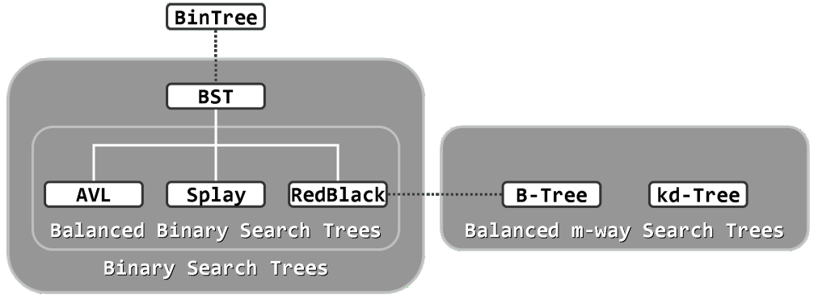
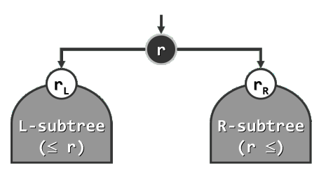
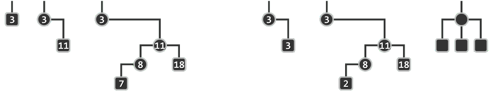
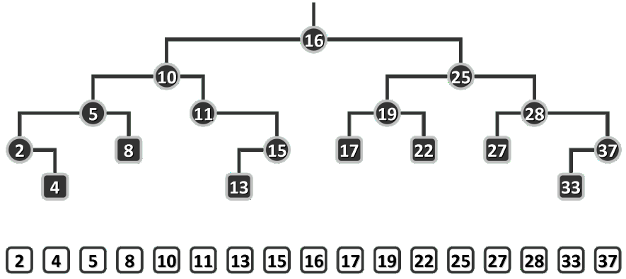
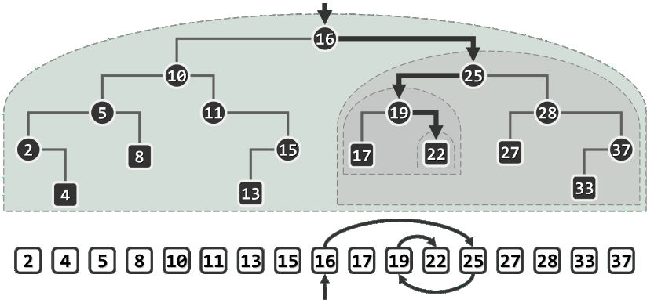
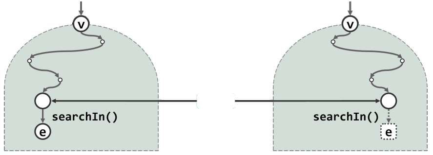
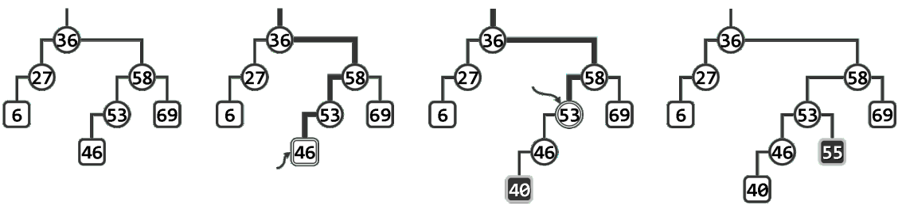
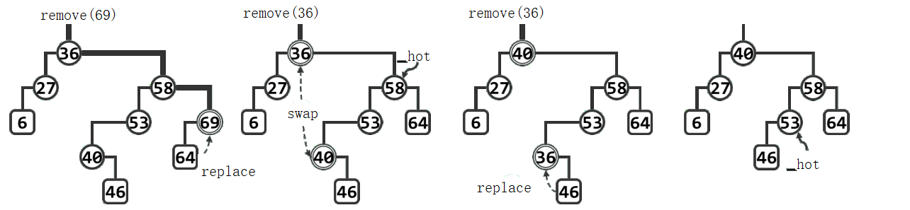

# 内容

1. 各种搜索树之间的关系
2. 树式查找的总体构思
3. 树式查找基本算法与数据结构
4. 二叉搜索树--基于半线性的树形结构
5. 我们的理想：兼顾动态修改与静态查找操作效率
6. 理想平衡
7. 适度平衡
8. AVL--平衡二叉搜索树--最坏情况下，单次动态修改和静态查找也均可以在O(logn)时间内完成

本文章的搜索树实现有两种方式

1. 类C结构体实现方式，自学习实现。
2. 模板类实现方式，参考邓俊辉的《数据结构\_C++语言版\_第3版》。

## 各种搜索树之间的关系



# 二叉搜索树--类C结构体

## 节点结构

* 节点结构

```c++
typedef int KeyType;
typedef struct BstNode
{
	KeyType key;
	BstNode* leftchild;
	BstNode* parent;
	BstNode* rightchild;
}BstNode,*BSTree;
```

* Buynode

```c++
BstNode* Buynode()
{
	BstNode* s = (BstNode*)malloc(sizeof(BstNode));
	if (NULL == s)exit(1);
	memset(s, 0, sizeof(BstNode));
	return s;
}
```

## Insert

```c++
BstNode* MakeRoot(KeyType kx)
{
	BstNode* pnode = Buynode();
	pnode->key = kx;
	return pnode;
}
bool Insert(BstNode*& ptr, KeyType kx)
{
	if (ptr == NULL)
	{
		ptr = MakeRoot(kx);
		return true;
	}
	BstNode* p = ptr;	//遍历Node的指针
	BstNode* pa = NULL;	//实时追踪p的parent
	while (p != NULL && p->key != kx)
	{
		pa = p;
		p = kx < p->key ? p->leftchild : p->rightchild;
	}
	/* 实际上不用再判断p->key == kx, 只要p != NULL就说明找到了相等的节点，
	   如果此时p!=NULL的话，上面的while循环的退出就是因为p->key==kx而退出的
	*/
	if (p != NULL /* && p->key == kx */)return false;

	// 此时已经找到要插入的位置
	p = Buynode();
	p->key = kx;
	p->parent = pa;
	// 更新pa的左或右孩子
	if (p->key < pa->key) pa->leftchild = p;
	else pa->rightchild = p;
	return true;
}
```

代码结构优化--Insert中包含了建根的情况

```c++
bool Insert(BstNode*& ptr, KeyType kx)
{
	BstNode* p = ptr;	//遍历Node的指针
	BstNode* pa = NULL;	//实时追踪p的parent
	while (p != NULL && p->key != kx)
	{
		pa = p;
		p = kx < p->key ? p->leftchild : p->rightchild;
	}
	if (p != NULL)return false;

	// 此时已经找到要插入的位置			//其中，包括根为空的情况
	p = Buynode();
	p->key = kx;
	p->parent = pa;
    if(pa == NULL)	//建根的情况
    {
        ptr = p;
    }
    else // 更新pa的左或右孩子
    {
        if(p->key < pa->key)
            pa->leftchild = p;
        else 
            pa->rightchild = p;
    }
    return true;
}
```

### 测试

```c++
void InOrder(BstNode* ptr)
{
	if (ptr != NULL)
	{
		InOrder(ptr->leftchild);
		cout << ptr->key << " ";
		InOrder(ptr->rightchild);
	}
}
int main()
{
	BSTree root = NULL;
	int ar[] = { 53,17,78,9,45,65,87,23,81,94,88,100 };
	int n = sizeof(ar) / sizeof(ar[0]);
	for (int i = 0; i < n; ++i)
	{
		cout << Insert(root, ar[i]) << endl;
	}
    InOrder(root);cout << endl;
	return 0;
}
```

## Next & NiceInOrder

```c++
BstNode* First(BstNode* ptr)
{
	while (ptr != NULL && ptr->leftchild != NULL)
	{
		ptr = ptr->leftchild;
	}
	return ptr;
}
// 找到当前节点的直接后继（按关键码大小）
BstNode* Next(BstNode* ptr)
{
	if (ptr == NULL)return NULL;
    // 存在右分支
	if (ptr->rightchild != NULL)
	{
		return First(ptr->rightchild);
	}
	else // 没有右分支
	{
		BstNode* pa = ptr->parent;
        // 沿着右子树回溯，直到找到自己作为父节点的左子树
        // 这一过程可以用中序遍历的次序解释
        while(pa != NULL && pa->leftchild != ptr)
        {
            ptr = pa;
            pa = ptr->parent;
        }
        return pa;
	}
}
```

```c++
void NiceInOrder(BstNode* ptr)
{
    for(BstNode* p = First(ptr); p != NULL; p = Next(p))
    {
        cout << p->key << " ";
    }
    cout << endl;
}
```

## Prev & NiceRevInOrder

```c++
BstNode* Last(BstNode* ptr)
{
	while (ptr != NULL && ptr->rightchild != NULL)
	{
		ptr = ptr->rightchild;
	}
	return ptr;
}
BstNode* Prev(BstNode* ptr)
{
    if(ptr == NULL)return NULL;
    // 存在左分支
    if(ptr->leftchild != NULL)
    {
        return Last(ptr->leftchild);
    }
    else
    {
        BstNode* pa = ptr->parent;
        while(pa != NULL && pa->leftchild != ptr)
        {
            ptr = pa;
            pa = ptr->parent;
        }
        return pa;
    }
}
```

```c++
void NiceRevInOrder(BstNode* ptr)
{
    for(BstNode* p = Last(ptr); p != NULL; p = Prev(p))
    {
        cout << p->key << " ";
    }
    cout << endl;
}
```

## Remove

```c++
bool Remove(BstNode*& ptr, KeyType kx)
{
    if(ptr == NULL)return false;
    BstNode* p = ptr;
    while(p != NULL && p->key != kx)
    {
        p = kx < p->key ? p->leftchild : p->rightchild;
    }
    if(p == NULL)return false;
    
    //双分支的特殊处理，与直接后继节点替换。把删除的目标转向其直接后继节点。进而转为删除单分支节点的情况！
    if(p->leftchild != NULL && p->rightchild != NULL)
    {
        BstNode * psucc = First(p->rightchild);	//succ: successor,后继
        p->key = psucc->key;
        p = psucc;
    } 
    //单分支、叶子通用
    BstNode* pa = p->parent;
    BstNode * newchild = p->leftchild!=NULL ? p->leftchild : p->rightchild;
    
    // 使p与newchild解除关系
    	//维护newchild的parent
    if(newchild != NULL)newchild->parent = pa;
    	//解除p的child关系，由于将被删去，把p的左右孩子置为NULL
    p->rightchild = p->leftchild = NULL;
    
    //此处：维护pa的左右孩子。维护根节点
    //如果删除的是根节点：不维护pa的左右孩子(因为pa为空)，替换root
    if(pa == NULL)	//pa == NULL则说明删除的是根节点
    {
        ptr = newchild;
    }
    else			//删除非根节点的情况，维护pa的左右孩子，不替换root
    {
        // 将newchild替代p的位置
            //删除单分支节点时，newchild为其分支节点；
            //删除叶子节点时，newchild为空。不影响。
        if(pa->leftchild == p)
            pa->leftchild = newchild;
        else
            pa->rightchild = newchild;
    }
    //删除结束
    free(p);
    return true;
}
```


# 二叉搜索树--模板类

## 顺序性

在二叉搜索树（binary search tree）中，处处都满足顺序性：
“**任一节点r的左（右）子树中，所有节点（若存在）均不大于（不小于）r**”。



为回避边界情况，这里暂且假定所有节点互不相等。

下图左三个示例是二叉搜索树，右三个示例是反例。


当然，在实际应用中，对相等元素的禁止既不自然也不必要。可在代码的基础上继续扩展，使得二叉搜索树的接口支持相等词条的同时并存（习题[7-10]）。在去除掉这一限制之后，图中原先的第一个反例，将转而成为合法的二叉搜索树。

## 中序遍历序列

下图为二叉搜索树的中序遍历序列，单调增。


顺序性是一项很强的条件。实际上，搜索树中节点之间的全序关系，已完全“蕴含”于这一条件之中。以如上图所示的二叉搜索树为例，只需该树做一次中序遍历，即可将该树转换为一个线性序列，且该序列中的节点严格按照其大小次序排列。

这一现象，并非巧合。借助数学归纳法，可以证明更具一般性的结论：**任何一棵二叉树是二叉搜索树，当且仅当其中序遍历序列单调非降**。

## BST模板类

```c++
#include "BinTree.h"
template<typename T> class BST : public BinTree<T>
{
protected:
    BinNodePosi(T) _hot;	//"命中"节点的父亲
public:
    virtual BinNodePosi(T) & search(const T& e);	//查找
    virtual BinNodePosi(T) insert(const T& e);		//插入
    virtual bool remove(const T& e);				//删除
};
```

可见，在继承原模板类BinTree的同时，BST内部也继续沿用了二叉树节点模板类BinNode。按照二叉搜索树的接口规范定义，这里新增了三个标准的对外接口search()、insert()和remove()，分别对应于基本的查找、插入和删除操作。这三个标准接口的调用参数，都是属于元素类型T的对象引用——这正是此类结构“循关键码访问”方式的具体体现。

以后还将以BST为基类，进一步派生出二叉搜索树的多个变种。无论哪一变种，既必须支持上述三个基本接口，同时在内部的具体实现方式又有所不同。因此，它们均被定义为虚成员函数，从而强制要求派生的所有变种，根据各自的规则对其重写。

## 查找算法及其实现

二叉搜索树的查找算法，亦采用了**减而治之**的思路与策略，其执行过程可描述为：**从树根出发，逐步地缩小查找范围，直到发现目标（成功）或缩小至空树（失败）**。

例如，在下图中查找关键码22的过程如下。首先，经与根节点16比较确认目标关键码更大，故深入右子树25递归查找；经比较发现目标关键码更小，故继续深入左子树19递归查找；经再次比较确认目标关键码更大后，深入右子树22递归查找；最终在节点22处匹配，查找成功。


实际上，针对16、25、19的查找，也将经过该路径的某一前缀，成功终止于对应的节点。当然，查找未必成功。比如针对关键码20的查找也会经过同一查找通路并抵达节点22，但在因目标关键码更小而试图继续向左深入时发现左子树为空，至此即可确认查找失败。

> （此类空节点通常对应于空孩子指针或引用，也可假想地等效为“真实”节点，后一方式不仅可简化算法描述以及退化情况的处理，也可直观地解释（B-树之类）纵贯多级存储层次的搜索树。故在后一场合，空节点也称作外部节点（external node），并等效地当作叶节点的“孩子”。返里暂采用前一方式，故空节点不在插图中出现。） 

一般地，在上述查找过程中，一旦发现当前节点为NULL，即说明查找范围已经缩小至空，查找失败；否则，视关键码比较结果，向左（更小）或向右（更大）深入，或者报告成功（相等）。

**对照中序遍历序列可见，整个过程与有序向量的二分查找过程等效，故可视作后者的推广**。

### searchIn()算法与search()接口

* searchIn()

  ```c++
  template<typename T>
  static BinNodePosi(T) & searchIn(BinNodePosi(T) & v, const T& e, BinNodePosi(T) & hot)
  {
      if(v==nullptr || (e == v->data)) return v;
      hot = v;
      return searchIn(((e < v->data) ? v->lc : v->rc), e, hot);
  }
  ```

* search()

  ```c++
  template<typename T> BinNodePosi(T) & BST<T>::search(const T& e)
  {
      //返回目标节点位置的引用，以便后续插入、删除操作。
      return searchIn(_root, e, hot = NULL);
  }
  ```

### 语义约定

以上查找算法之所以如此实现，是为了统一并简化后续不同搜索树的各种操作接口的实现。其中的技巧，主要体现于返回值和hot变量（即BinTree对象内部的_hot变量）的语义约定。

* 若查找成功，则searchIn()以及search()的返回值都将如图左所示，指向一个关键码为e且真实存在的节点；
* 若查找失败，则返回值的数值虽然为NULL，但是它作为引用将如图右所示，指向最后一次试图转向的空节点。对于后一种情况，不妨假想地将此空节点转换为一个数值为e的哨兵节点——如此，无论成功与否，查找的返回值总是等效地指向“命中节点”。
  
* 在调用searchIn()算法之前，search()接口首先将内部变量\_hot初始化为NULL，然后作为引用型参数hot传递给searchIn()。在整个查找的过程中，hot变量始终指向当前节点的父亲。
  因此在算法返回时，按照如上定义，\_hot亦将统一指向“命中节点”的父亲。即便在退化的情况下（比如查找终止并返回于树根处），算法searchIn()的输出依然符合以上语义约定。
* 请注意，\_hot节点是否拥有另一个孩子，与查找成功与否无关。查找成功时，节点e可能是
  叶子，也可能是内部节点；查找失败时，假想的哨兵e等效于叶节点，但可能有兄弟。

### 效率

* 在二叉搜索树的每一层，查找算法至多访问一个节点，且只需常数时间，故**总体所需时间应线性正比于查找路径的长度**，或最终返回节点的深度。
* 在最好情况下，目标关键码恰好出现在树根处（或其附近），此时只需O(1)时间。
* 然而不幸的是，对于规模为n的二叉搜索树，深度在最坏情况下可达Ω(n)。比如，当该树退化为（接近于）一条单链时，发生此类情况的概率将很高。此时的单次查找可能需要线性时间并不奇怪，因为实际上这样的一棵“二分”搜索树，已经退化成了一个不折不扣的一维有序列表，而此时的查找则等效于顺序查找。
* 由此我们可得到启示：若要控制单次查找在最坏情况下的运行时间，须从控制二叉搜索树的**高度**入手。后续将要讨论的平衡二叉搜索树，正是基于这一思路而做的改进。

## 插入算法及其实现

### 算法

* 为了在二叉搜索树中插入一个节点，首先需要利用查找算法search()确定插入的位置及方向，然后才能将新节点作为叶子插入。
* 以如左图1所示的二叉搜索树为例。若欲插入关键码40，则在执行search(40)之后，如图2所示，\_hot将指向比较过的最后一个节点46，同时返回其左孩子（此时为空）的位置。于是接下来如图(c)所示，只需创建新节点40，并将其作为46的左孩子接入，拓扑意义上的节点插入即告完成。
  
* 不过，为保持二叉搜索树作为数据结构的完整性和一致性，还需从节点_hot（46）出发，自底而上地逐个更新新节点40历代祖先的高度。
* 接下来若欲插入关键码55，则在执行search(55)之后如图3所示，\_hot将指向比较过的最后一个节点53，同时返回其右孩子（此时为NULL）的位置。于是如图4所示，创建新节点55，并将其作为53的右孩子接入。当然，此后同样需从节点\_hot出发，逐代更新祖先的高度。

### insert()接口的实现

```c++
template<typename T>
BinNodePosi(T) BST<T>::insert(const T& e)
{
    BinNodePosi(T) &x = search(e);	//search的过程中更新了_hot
    if(x!=nullptr)return x;//如果e值在树中已经存在则不插
    
    x = new BinNode<T> (e, _hot);	//创建新节点x：以e为关键码，以_hot为父
    _size++;
    updateHeightAbove(x);			//更新x及其历代祖先的高度
    return x;
}
```

* 首先调用search()查找e。若返回位置x非空，则说明已有雷同节点，插入操作失败。否则，
  **x必是\_hot节点的某一空孩子**，于是创建这个孩子并存入e。
* 按照以上实现方式，无论插入操作成功与否，都会返回一个非空位置，且该处的节点与拟插入的节点相等。如此可以确保一致性，以简化后续的操作。
* 另外，上面的查找算法中的对“首个节点插入空树”等特殊情况的处理手法与这里的类似，可以认真体会一番。

### 效率

由上可见，节点插入操作所需的时间，主要消耗于对算法search()及updateHeightAbove()的调用。后者与前者一样，在每一层次至多涉及一个节点，仅消耗O(1)时间，故其**时间复杂度也同样取决于新节点的深度**，在最坏情况下不超过全树的高度。

## 删除算法及其实现

为从二叉搜索树中删除节点，首先也需要调用算法BST::search()，判断目标节点是否的确存在于树中。若存在，则需返回其位置，然后方能相应地具体实施删除操作。



### 单分支情况

以左图1所示二叉搜索树为例，若欲删除节点69，需首先通过search(69)定位待删除的节点69。因该节点的右子树为空，故只需如图2所示，将69替换为64。则拓扑意义上的节点删除即告完成。另外，为保持二叉搜索树作为数据结构的完整性和一致性，还需更新全树的规模记录，释放被摘除的节点69，并自下而上地逐个更新替代节点64历代祖先的高度。**注意，首个需要更新高度的祖先58，恰好由\_hot指示**。

不难理解，对于没有左孩子的目标节点，也可以对称地予以处理。当然，以上同时也已涵盖了左右孩子均不存在的情况（即目标节点为叶子）。

### 双分支情况

继续上例，设拟再删除二度节点36，如图2所示，首先调用BinNode::succ()算法，找到该节点的直接后继40。然后，只需如图3所示交换二者的数据项即可将后继节点等效地视作待删除的目标节点。不难验证，该后继节点必无左孩子，从而相当于转化为此前相对简单的情况——单分支情况。最后如图4所示，将新的目标节点36替换为其右孩子46。

注意，在互换36和40后，如图3所示，曾经一度并不满足顺序性，但这并不要紧，在按照上述方法完成整个删除动作后，全树的顺序性必然又将恢复。

同样地，除了更新全树规模记录和释放被摘除节点，此时也要更新一系列祖先节点的高度。不难验证，此时首个需要更新高度的祖先53依然恰好由\_hot指示。

### remove()实现

```c++
template<typename T>
bool BST<T>::remove(const T& e)
{
    BinNodePosi(T) & x = search(e);
    if(x == nullptr)return false;
    removeAt(x, _hot);
    --_size;
    updateHeightAbove(_hot);
    return true;
}
template<typename T>
static BinNodePosi(T) removeAt(BinNodePosi(T) & x, BinNodePosi(T) & hot)
{
    BinNodePosi(T) w = x;
    BinNodePosi(T) succ = NULL;
    if(!HasLChild(*x))		//若要删除的节点没有左孩子	
        succ = x = x->rc;	//直接将x替换为其右子树
    else if(!HasRChild(*x))	//若右子树为空
        succ = x = x->lc;	//对称地处理，注意：此时succ!=NULL
    else	//双分支情况
    {	//若左右子树均存在，x和其直接后继w互换，w作为实际被delete节点
        w = w->succ();	//寻找x直接后继w -- 只可能发生在x的右子树中
        swap(x->data, w->data);//交换x和w的data
        BinNodePosi(T) u = w->parent;
        ((u == x) ? u->rc : u->lc) = succ = w->rc;
    }
    hot = w->parent;
    if(succ)succ->parent = hot;
    release(w->data);
    release(w);
    return succ;
}
```

首先调用search()查找e。若返回位置x为空，则说明树中不含目标节点，故删除操作随即可以失败返回。否则，调用removeAt()删除目标节点x。同样，此后还需更新全树的规模，并调用函数updateHeightAbove(\_hot)，更新被删除节点历代祖先的高度。

### 效率

删除操作所需的时间，主要消耗于对search()、succ()和updateHeightAbove()的调用。在树中的任一高度，它们至多消耗O(1)时间。故**总体的渐进时间复杂度，亦不超过全树的高度**。
